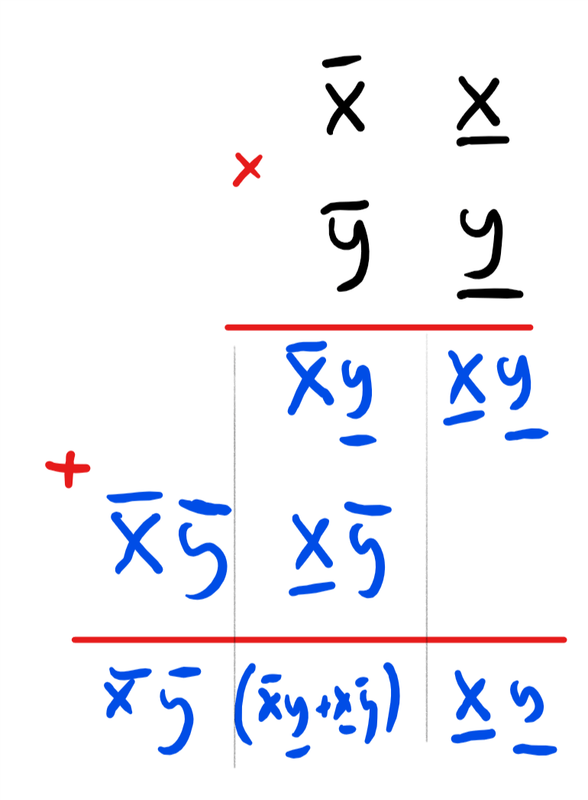
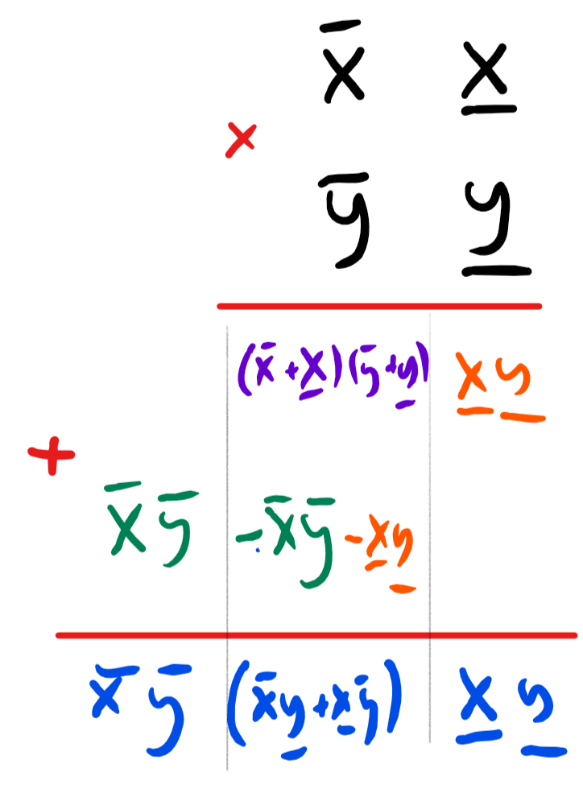
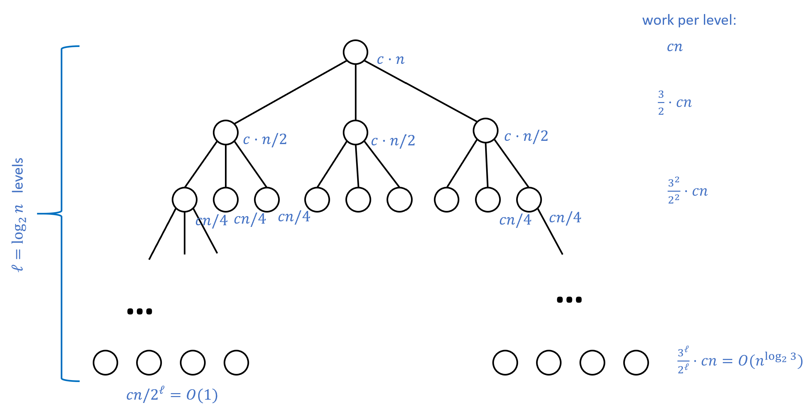
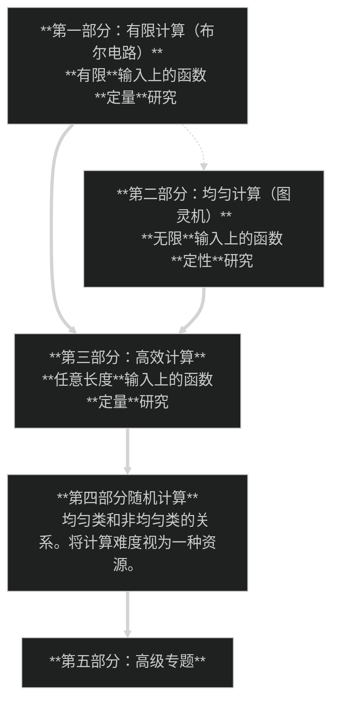

<!-- toc -->

# 引言 { #chapintro }

## 学习目标 { .objectives }
 * 介绍并激发对"计算"本身的研究兴趣, 而不局限于具体的实现方式. 
 * 了解**算法**(Algorithm)这一概念及其发展历程. 
 * 算法不只是一种工具, 更是一种思考和理解的方式. 
 * 领略大O分析法(Big-$O$ analysis)和高效算法设计中蕴含的惊人创造力. 

```admonish quote
"计算机科学并非仅与计算机有关, 正如天文学并非仅于望远镜有关. "

**—Edsger Dijkstra**
```

```admonish quote
"黑客需要了解计算中的理论, 正如画家需要了解颜料中的化学一样. "

**—Paul Graham, 2003年**
```

```admonish quote
"我的演讲主题或许可以通过提出两个简单的问题来最直接地揭示: 首先, 乘法是否比加法更难? 其次, 为什么? …….我(想)证明, 在计算上, 没有跟加法一样简单的乘法算法, 这证明了一些理论上的绊脚石的存在. "

**—Alan Cobham, 1964年**
```


**位值数字系统**(place-value number system)古巴比伦人最大的发明之一. 在位值数字系统中, 数字(number)被表示为一串数位(digit)序列, 其中每个数位的位置决定了其数值. 

这与类似罗马数字的系统刚好相反, 在罗马数字中, 每个数位无论其在数字中的位置如何, 均有一个不变的值. 举个例子, 地球到月球的平均距离大概是259956罗马英里. 在标准罗马数字中, 这个数字的表示为: 

```
MMMMMMMMMMMMMMMMMMMMMMMMMMMMMM
MMMMMMMMMMMMMMMMMMMMMMMMMMMMMM
MMMMMMMMMMMMMMMMMMMMMMMMMMMMMM
MMMMMMMMMMMMMMMMMMMMMMMMMMMMMM
MMMMMMMMMMMMMMMMMMMMMMMMMMMMMM
MMMMMMMMMMMMMMMMMMMMMMMMMMMMMM
MMMMMMMMMMMMMMMMMMMMMMMMMMMMMM
MMMMMMMMMMMMMMMMMMMMMMMMMMMMMM
MMMMMMMMMMMMMMMMMMMDCCCCLVI
```

使用罗马数字表示地球到太阳的距离需要大概100000个符号, 而我们需要一本50页的书来书写这一个数字! 

对于那些习惯于像罗马数字那样以加法系统来思考数字的人来说, 诸如地球到月球距离的这种数字不仅仅是大—它们无法形容: 这些数字不能被有效地表达甚至是理解. 这也难怪第一个计算地球直径的埃拉托色尼(计算误差约为10%), 和第一个计算地球与月球之间距离的喜帕恰斯使用了古巴比伦的六十进制位值数字系统, 而不是使用罗马数字系统. 

## 0.1 整数的乘法: 一个算法示例

在计算机科学的语言中, 这种用于表示数字的位值系统是一种**数据结构**(data structure), 数据结构是一组用于将对象表示为符号的指令或"配方". 而**算法**(algorithm)则是在此类表示形式上执行操作的一组指令或"配方". 数据结构与算法不仅催生了改变人类社会的惊人应用, 其重要性更远超实用价值. 比特(bit)、字符串(string)、图(graph), 乃至程序本身等计算机科学体系中的数据结构, 以及普适性、复制等概念, 不仅被广泛应用于实践领域, 更催生了一种全新的语言和审视世界的方式. 

除了位值数字系统, 古巴比伦人还发明了我们在小学中都学过的加法和乘法的"标准算法". 这些算法在漫长的历史中始终至关重要, 无论是使用算盘、莎草纸还是纸笔计算的人们均受惠于此, 但在计算机的时代, 除了折磨小学三年级学生之外, 这些算法是否还有存在的价值? 为了说明这些算法为何至今仍具有重要意义, 让我们将古巴比伦人的逐位相乘算法(即"小学乘法")与通过重复相加实现的朴素乘法算法进行对比. 我们首先正式描述这两种算法, 详见{{ref:alg:regexpmatch}}和{{ref:alg:gradeschool}}: 

```admonish quote title=""
{{algc}}{alg:regexpmatch}[通过重复相加实现的乘法算法]
$$
\begin{align}
&\textbf{输入: }\text{非负整数}x,y\\
&\textbf{输出: }\text{乘积}x\cdot y\\
&\text{Let }\texttt{result}\leftarrow 0\\
&\textbf{for }\{i=1,\ldots,y\}\\
&\quad\texttt{result}\leftarrow\texttt{result}+ x\\
&\textbf{endfor}\\
&\textbf{return }\texttt{result}\\
\end{align}
$$
```

```admonish quote title=""
{{algc}}{alg:gradeschool}[小学乘法]
$$
\begin{align}
&\textbf{输入: }\text{非负整数}x,y\\
&\textbf{输出: }\text{乘积}x\cdot y\\
&\text{将}x=x_{n-1}x_{n-2}\dots{x_0}与y=y_{m-1}y_{m-2}\dots y_0写做十进制数\\
&x_0\textit{是}x\textit{个位上的数, }x_1\textit{是}x\textit{十位上的数, 依此类推. }\\
&\text{Let }\texttt{result}\leftarrow 0\\
&\textbf{for }\{i=1,\ldots,n-1\}\\
&\quad\textbf{for }\{j=1,\ldots,m-1\}\\
&\quad\quad\texttt{result}\leftarrow\texttt{result}+10^{i+j}\cdot x_i\cdot y_j\\
&\quad\textbf{endfor}\\
&\textbf{endfor}\\
&\textbf{return }\texttt{result}\\
\end{align}
$$
```

{{ref:alg:regexpmatch}}和{{ref:alg:gradeschool}}均假定我们已经掌握了数字相加的方法, 而{{ref:alg:gradeschool}}还假定我们能够将数字与10的幂相乘(毕竟这只相当于一次简单的移位). 假设$x$和$y$是两个$n=20$位的十进制整数(这大致相当于64位二进制数, 也是许多编程语言中常见的类型). 使用{{ref:alg:regexpmatch}}计算$x\cdot y$需要将$x$自身相加$y$次. 由于$y$有20位, 这意味着我们需要至少进行$10^{19}$次加法运算. 相比之下, {{ref:alg:gradeschool}}仅需$n^2$次移位和单位数字的乘法运算, 因此最多仅需$2n^2=800$次单位数字的操作. 为了理解这种差异, 假设一个小学生完成单位数字的操作需要2秒, 那么使用{{ref:alg:gradeschool}}计算$x\cdot y$需要约1600秒(约半小时). 反之, 即使现代计算机的运算速度比人类快十亿倍以上, 若采用{{ref:alg:regexpmatch}}进行计算, 则需要$10^{20}/10^{9}=10^{11}$秒(超过3000年! )才能得到相同的结果. 

计算机从未使算法过时. 恰恰相反, 随着人类测量、存储和传输数据的能力的大幅提升, 我们比以往更需要开发精密而高效的算法, 从而基于数据洪流做出更明智的决策. 我们也不难发现: 算法的概念在很大程度上独立于实际执行计算操作的设备. 无论是硅基芯片还是借助纸笔计算的小学三年级学生, 逐位相乘的算法都远胜于重复累加法. 

理论计算机科学专注于研究算法和计算的内在属性—即那些独立于现有技术而存在的本质特征. 我们既探讨古巴比伦人早已思索过的问题(比如"什么是两数相乘的最优方法"), 也研究依赖前沿科技的课题(例如"能否利用量子纠缠效应实现更快速的因数分解"). 

```admonish note
一个算法的完整描述包括三个部分: 

- **规范**(specification): 算法完成了什么任务, 即**做了什么**(例如, {{ref:alg:regexpmatch}}和{{ref:alg:gradeschool}}进行的乘法). 
- **实现**(implementation): 如何完成算法的任务, 即**如何做**. 即使{{ref:alg:regexpmatch}}与{{ref:alg:gradeschool}}完成的是同样的两数相乘的乘法, 它们的实现方式并不相同(即两个算法具有不同的**实现**). 
- **分析**(analysis): **为什么**组成算法的这一系列指令能够完成它的任务. 一个对于{{ref:alg:regexpmatch}}和{{ref:alg:gradeschool}}的完整描述包含一个**证明**, 证明这两个算法在接受到输入$x,y$的时候的确会输出两数的乘积$x\cdot y$. 

一般来说, 算法的分析不仅会包含对算法的**正确性**分析, 还会包含对算法**高效性**的分析. 也就是说, 我们不仅想证明算法完成了预计的任务, 而且会在规定的次数内完成. 比如说, {{ref:alg:gradeschool}}使用了$O(n^2)$次操作完成了对$n$位数字的乘法, 而{{ref:alg:karatsuba}}(在下一节中介绍)使用了$O(n^{1.6})$次操作完成了同样的操作(我们会在[第1.4.8节]{chapter_1.md#secbigohnotation}中定义大$O$表示法)
```

## 0.2 扩展示例: 一种更快的乘法方法(可选) { #karatsubasec }

一旦你想到标准的逐位相乘乘法, 它似乎是"显然最优"的数字相乘方式. 1960年, 著名数学家安德雷·柯尔莫哥洛夫(Andrey Kolmogorov)在莫斯科国立大学组织了一场研讨会, 他在会上提出猜想: 任何两个$n$位数相乘的算法都需要执行与$n^2$成正比的基本操作次数(用第一章定义的大$O$符号表示为$\Omega(n^2)$次操作). 换言之, 柯尔莫哥洛夫认为在任何乘法算法中, 相乘的数字位数翻倍会导致所需基本操作次数变为四倍. 当时听众中有一位名叫阿纳托利·卡拉楚巴(Anatoly Karatsuba), 他在一周内就推翻了柯尔莫哥洛夫的猜想—他发现了一种仅需$Cn^{1.6}$次操作($C$为常数)的算法. 随着$n$增大, 这个数字会远小于$n^2$, 因此对于大数而言, 卡拉楚巴算法优于小学算法. (例如[Python在处理](https://svn.python.org/projects/python/trunk/Objects/longobject.c)1000比特及以上的数字时, 会从小学算法切换至卡拉楚巴算法. )虽然$O(n^{1.6})$与$O(n^2)$算法之间的差异有时在实践中至关重要(参见下文的[0.3节](#algsbeyondarithmetic)), 但本书将基本忽略这类区别. 不过我们仍会在下文介绍卡拉楚巴算法, 因为它完美展现了算法往往出人意料的特性, 同时也体现了算法分析的重要性—这正是本书乃至整个理论计算机科学的核心所在. 

卡拉楚巴算法基于一种两位数字之间的更快的相乘算法. 假设$x,y\in[100]=\{0,\ldots,99\}$是一对两位数字. 我们使用$\overline x$表示$x$的十位上数字, $\underline x$表示个位上的数字, 所以$x$可以表示为$x=10\overline x+\underline x$, $y$亦可写成$y=10\overline y+\underline y$, 这里$\overline x,\underline x,\overline y,\underline y\in[10]$. [图0.1](#gradeschoolmultfig)展示了两位数字的小学乘法. 

<!-- 图0.1 -->
```admonish pic id = "gradeschoolmultfig"


{{pic}} 小学乘法示例, 演示如何计算$x=10\overline x+\underline x$与$y=10\overline y+\underline y$的乘积. 其使用的公式为: $(10\overline x+\underline x)\times(10\overline y+\underline y)=100\overline x\overline y+10(\overline x\underline y+\underline x+\overline y)+\underline x\underline y$
```

小学乘法的算法可以看作一个将两位数字相乘的任务转化为**四个**单位数字相乘的过程: 

$$
(10\overline x+\underline x)\times(10\overline y+\underline y)=100\overline x\overline y+10(\overline x\underline y+\underline x+\overline y)+\underline x\underline y {{numeq}}{eq:gradeschool}
$$

通常, 在小学算法中, 输入数字位数翻倍会导致操作次数变为原来的四倍, 从而形成$O(n^2)$时间复杂度的算法. 相比之下, 卡拉楚巴算法基于这样一个观察: 我们同样可以将{{eqref:eq:gradeschool}}表示为: 

$$
(10\overline{x}+\underline{x}) \times (10 \overline{y}+\underline{y}) = (100-10)\overline{x}\overline{y}+10\left[(\overline{x}+\underline{x})(\overline{y}+\underline{y})\right] -(10-1)\underline{x}\underline{y}
$$

这将两位数字$x,y$的乘法简化为了以下三个更简单的乘积计算: $\overline x\overline y$、$\underline x\underline y$以及$(\overline{x}+\underline{x})(\overline{y}+\underline{y})$. 通过递归地重复相同策略, 我们可以将两个$n$位数相乘的任务简化为三对$\floor{n/2}+1$位数相乘的任务. 由于每当数字位数翻倍时, 操作次数会变为三倍, 因此当$n=2^l$时, 我们可以使用约$3^l=n^{\log_23}\sim n^{1.585}$次操作完成乘法运算. 

上述内容是卡拉楚巴算法背后的直观思想, 但尚不足以完整描述该算法. 一个算法的完整描述需要包含其操作步骤的精确说明以及算法分析: 即证明该算法确实能实现预设任务. 卡拉楚巴算法的具体操作步骤见{{ref:alg:karatsuba}}, 其数学分析则包含在{{ref: lem:kara_correctness}}和{{ref: lem:kara_complexity}}中. 

<!-- 图0.2 -->
```admonish pic id = "karatsubatwodigitfig"


{{pic}} 卡拉楚巴乘法算法示例, 演示如何计算$x=10\overline x+\underline x$与$y=10\overline y+\underline y$的乘积. 我们先计算橙色、绿色和紫色三项乘积$\underline x\underline y$、$\overline x\overline y$及$(\overline x+\underline x)(\overline y+\underline y)$, 再通过加减运算得到最终结果
```

<!-- 图0.3 -->
```admonish pic id = "karastubavsgschoolv2fig"


{{pic}} 卡拉楚巴算法与小学算法的运行时间对比(在线提供Python实现). 需注意存在"分界长度": 当输入规模足够大时, 卡拉楚巴算法会变得比小学算法更高效. 具体分界点因实现方式和平台细节而异, 但最终必然会出现
```

```admonish quote title=""
{{algc}}{alg:karatsuba}[卡拉楚巴乘法算法]
$$
\begin{align}
&\textbf{输入: }\text{非负整数}x,y\text{, 每个数字最多有}n\text{位}\\
&\textbf{输出: }x\cdot y\\
&\textbf{Procedure }\mathsf{Karatsuba}(x,y)\\
&\quad\textbf{if }\{n\leq 4\}\textbf{ return }x\cdot y\\
&\quad\text{Let }m=\floor{n/2}\\
&\quad\text{将}x,y\text{分别写做}x=10^m\overline x+\underline x,y=10^m\overline y+\underline y\\
&\quad A\leftarrow\mathsf{Karatsuba}(\overline x,\overline y)\\
&\quad B\leftarrow\mathsf{Karatsuba}(\overline x+\underline x,\overline y+\underline y)\\
&\quad C\leftarrow\mathsf{Karatsuba}(\underline x,\underline y)\\
&\quad\textbf{return }(10^n-10^m)\cdot A+10^m\cdot B+(1-10^m)\cdot C\\
&\textbf{endproc}
\end{align}
$$
```

<iframe src="https://trinket.io/embed/python/9ddd61c11f" width="100%" height="600" frameborder="0" marginwidth="0" marginheight="0" allowfullscreen></iframe>

{{ref:alg:karatsuba}}只是卡拉楚巴算法完整描述的一半, 另一半是算法的**分析**, 即证明(1){{ref:alg:karatsuba}}确实完成了乘法的计算以及(2)它确实使用了$O(n^{\log_2 3})$步操作来完成计算. 我们首先从证明(1)开始: 

```admonish quote title=""
{{lemc}}{lem:kara_correctness}[卡拉楚巴算法的正确性]

对于任意的两个非负整数$x,y$, 当输入$x,y$时, {{ref:alg:karatsuba}}的输出为$x\cdot y$.
```

```admonish proof collapsible=true, title = "证明"
令$n$为$x,y$位数的最大值. 我们通过对$n$的归纳来证明{{tref: lem:kara_correctness}}. 基本情况是当$n\le 4$时, 根据定义, 算法直接返回$x\cdot y$(具体采用何种算法计算四位数乘法并不重要—甚至可以使用重复相加法). 当$n>4$时, 令$m=\floor{n/2}$, 并将$x$和$y$表示为$10^m\overline x+\underline x$和$10^m\overline y+\underline y$. 

代入$x\cdot y$可得: 

$$
x\cdot y=10^{2m}\overline x\overline y+10^m(\overline x\underline y+\underline x\overline y)+\underline x\underline y {{numeq}}{eq:karastubaone}
$$
整理上式有: 
$$
x\cdot y=10^{2m}\overline x\overline y+10^m\left[(\overline x+\underline x)(\overline y+\underline y)-\underline x\underline y-\overline x\overline y\right]+\underline x\underline y {{numeq}}{eq:karastubatwo}
$$


由于$\underline x,\overline x,\underline y,\overline y,\overline x+\underline x,\overline y+\underline y$这些数的位数最多为$m+2<n$, 根据归纳假设, 递归调用计算得到的值$A,B,C$满足$A=\overline x\overline y$, $B=(\overline x+\underline x)(\overline y+\underline y)$, $C=\underline x\underline y$. 将其带入{{eqref:eq:karastubatwo}}可知, $x\cdot y$的值等于{{ref:alg:karatsuba}}计算的$(10^{2m}-10^m)\cdot A+10^m\cdot B+(1-10^m)\cdot C$. 
```

```admonish quote title=""
{{lemc}}{lem:kara_complexity}[卡拉楚巴算法的时间复杂度]

假设输入$x,y$为最多有$n$位的整数, {{ref:alg:karatsuba}}将会用$O(n^{\log_2 3})$次操作来进行计算. 
```

~~~admonish proof collapsible=true, title = "证明"
[图0.2](#karatsubatwodigitfig)展示了证明的核心思路, 此处我们只做概要说明, 完整的证明留作习题0.4. 本次证明同样采用归纳法: 定义$T(n)$为{{ref:alg:karatsuba}}在处理长度不超过$n$的输入时所需的最大执行步数. 当基本情况即$n\le 4$时, {{ref:alg:karatsuba}}{{footnote: 原文此处的内容为"Exercise 0.4", 疑为作者笔误}}只需执行常数次计算, 因此存在常数$c$使得$T(4)\le c$; 而当$n>4$时, 递归关系满足不等式

$$
T(n)\le 3T(\floor{n/2}+1)+c'n {{numeq}}{eq:karatsubarecursion}
$$
其中$c'$为常数(基于加法运算可在$O(n)$时间内完成的事实). 

递归不等式{{eqref:eq:karatsubarecursion}}的解为$O(n^{log_2 3})$. 图2直观展示了该复杂度形成的原理, 这也是所谓"[主定理](https://en.wikipedia.org/wiki/Master_theorem_(analysis_of_algorithms))"关于递归关系的推论. 如前文所述, 我们将完整证明留作习题0.4. 
~~~

<!-- 图0.4 -->
```admonish pic id = "karatsuba_analysis2fig"


{{pic}} 卡拉楚巴算法将$n$位乘法分解为三个$n/2$位乘法, 这些乘法又可继续分解为九个$n/4$位乘法, 依此类推. 我们可用深度为$\log_2 n$的三叉树表示所有乘法的计算成本: 根节点处额外成本为$cn$次操作, 第一层额外成本为$c(n/2)$次操作, 第$i$层每个节点的额外成本为 $c(n/2^i)$(该层共有$3^i$个节点). 根据几何级数求和公式, 总成本为$cn\sum_{i=0}^{\log⁡_2n}(3/2)^i\le10cn\log⁡_23$
```

卡拉楚巴算法远非乘法算法的终点. 20世纪60年代, 图姆(Toom)和库克(Cook)扩展了卡拉楚巴的思想, 提出了时间复杂度为$O(n\log_⁡k(2k−1))$($k$为常数)的乘法算法. 1971年, 舍恩哈格(Schönhage)和施特拉森(Strassen)利用**快速傅里叶变换**实现了更优的算法——其核心思想是将整数视为"信号", 通过转换到傅里叶域来更高效地完成乘法运算(**傅里叶变换**是数学和工程学的核心工具, 应用极其广泛; 若您尚未接触过, 很可能在后续学习中会遇到). 此后多年间, 研究者们不断改进算法, 直到最近哈维(Harvery)和范德霍芬(Van Der Hoeven)才成功实现了时间复杂度为$O(n\log⁡ n)$的乘法算法(不过该算法仅在处理真正天文级别的数字时才开始超越舍恩哈格-施特拉森算法). 然而, 尽管取得了这些进展, 我们至今仍未知晓是否存在能在$O(n)$时间内完成两个$n$位数乘法的算法! 

```admonish info
{{remc}}{rem:matrixmult}[矩阵乘法(进阶笔记)]

本书包含许多"进阶"或"选读"的注释与章节. 这些内容可能需要学生具备特定基础知识方可理解, 但均可放心跳过, 因为后续章节均不依赖这些内容. )

与卡拉楚巴算法相似的思路也可用于加速矩阵乘法运算. 矩阵是表示线性方程与线性运算的强大工具, 被广泛应用于科学计算、图形学、机器学习等众多领域. 

矩阵的基本运算之一便是矩阵乘法. 例如若有矩阵$x = \begin{pmatrix} x_{0,0} & x_{0,1}\\ x_{1,0}& x_{1,1} \end{pmatrix}$和$y = \begin{pmatrix} y_{0,0} & y_{0,1}\\ y_{1,0}& y_{1,1} \end{pmatrix}$, 则其乘积为$\begin{pmatrix} x_{0,0}y_{0,0} + x_{0,1}y_{1,0} & x_{0,0}y_{0,1} + x_{0,1}y_{1,1}\\ x_{1,0}y_{0,0}+x_{1,1}y_{1,0} & x_{1,0}y_{0,1}+x_{1,1}y_{1,1} \end{pmatrix}$, 可见该乘积可以通过8次数值乘法来计算. 

现假设$n$为偶数, $x$和$y$为一对$n\times n$的矩阵, $x$与$y$均可被划分为四个$(n/2)\times (n/2)$的块: $x_{0,0},x_{0,1},x_{1,0},x_{1,1}$和$y_{0,0},y_{0,1},y_{1,0},y_{1,1}$. 此时$x,y$的矩阵乘积的表示与上述公式完全一致, 只需将数值的乘积$x_{a,b}y_{c,d}$替换为对应的**矩阵**乘积, 数值加法替换为对应的矩阵加法即可. 这意味着我们可以通过使用上述公式来给出一个算法, 该算法在输入矩阵维度倍增的同时, 所需的操作数量提升为原来的8倍—即当$n=2^l$时, 总操作量将达到$8^l=n^3$次. 

1969年, 福尔克·施特拉森(Volker Strassen)提出通过对以下七项进行加减运算, 即可仅用7次数值乘法完成二维矩阵求积: $t_1 = (x_{1,0}+x_{1,1})(y_{0,0}+y_{1,1})$, $t_2 = (x_{0,0}+x_{1,1})y_{0,0}$, $t_3 = x_{0,0}(y_{0,1}-y_{1,1})$, $t_4 = x_{1,1}(y_{0,1}-y_{0,0})$, $t_5 = (x_{0,0}+x_{0,1})y_{1,1}$, $t_6 = (x_{1,0}-x_{0,0})(y_{1,0}+y_{0,1})$, $t_7 = (x_{0,1}-x_{1,1})(y_{1,0}+y_{1,1})$. 可验证其满足: $xy = \begin{pmatrix} t_1 + t_4 - t_5 + t_7 & t_3 + t_5 \\ t_2 +t_4 & t_1 + t_3 - t_2 + t_6 \end{pmatrix}$. 

基于这一发现, 我们可以获得一个算法, 使得矩阵维度倍增时运输量仅增加至7倍. 这意味着当$n=2^l$时, 总计算成本为$7^l=n^{\log_2 7}\sim n^{2.807}$. 经过一系列后续研究改进, [当前最优算法](https://en.wikipedia.org/wiki/Matrix_multiplication_algorithm#Sub-cubic_algorithms)的时间复杂度已达约$O(n^{2.373})$. 然而与整数乘法不同的是, 目前我们尚未发现能在线性或近似线性时间内(例如$O(n^2\text{polylog}(n))$)完成矩阵乘法的算法. 尽管研究者们尝试运用[群表示理论](https://en.wikipedia.org/wiki/Group_representation)(可视为傅里叶变换的推广)来寻求更快的算法, 但至今为止此项努力[尚未取得成功](http://discreteanalysisjournal.com/article/1245-on-cap-sets-and-the-group-theoretic-approach-to-matrix-multiplication). 
```


## 0.3 超越算术的算法 { #algsbeyondarithmetic }

对更优算法的探索绝非仅限于加法、乘法或解方程等算术任务. 在过去的数十年间, **图论算法**领域涌现出大量突破性成果—包括路径搜索、匹配、生成树、割集和流算法在内的多项发现, 这一领域至今仍是密集研究的重点领域(例如近年来基于电路理论与线性方程求解器之间的意外关联产生了诸多**最大流**问题上的进展. )这些算法不止被应用于网络流量路由、GPS导航等"天然"应用场景, 更广泛渗透于基因交互图谱结构促进新药研发、投资关联风险计算等多元化领域. 

谷歌公司的成立基石是**PageRank**算法—该算法能够高效地近似计算网络图邻接矩阵(经阻尼处理过后的)的"主特征向量(principle eigenvector)". **Akamai**公司的诞生则依托于创新数据结构"一致性哈希", 该数据结构能够实现哈希桶在多服务器之间的分布式存储. **反向传播算法**(backpropagation algorithm)通过将神经网络偏导数计算复杂度从$O(n^2)$降至$O(n)$, 成为深度神经网络近年取得惊人成就的核心支柱. 而基于稀疏约束线性方程求解的**压缩感知**(compressed sensing)算法, 显著降低了MRI图像分析对数据量和质量的要求, 这一突破对于儿童肿瘤MRI检测具有革命性意义—此前医生需实施麻醉暂停患儿呼吸进行扫描, 此过程常常伴随致命风险. 

即便对于毕达哥拉斯时代就开始研究的素数判定这类经典问题, 仍有不断的新发现涌现: 高效的概率算法于1970年代问世, 首个[确定性多项式时间算法](https://en.wikipedia.org/wiki/AKS_primality_test)直至2002年才被发现. 在合数分解这个领域, 1980年代诞生了新算法, 而1990年代的研究成果(本课程后续将继续探讨)更揭示了利用量子力学实现加速算法的诱人前景. 

尽管取得诸多进展, 算法领域仍存在悬而未解之谜. 对于大多数自然问题, 我们既无法断定现有算法是否已达到最优, 亦不能确定是否存在更高效的待发现算法. 正如本章开篇引用的Cobham论断所示——即便是数字乘法这个基础问题, 我们至今仍未证明是否存在与加法算法同等高效的乘法算法. 但至少, 我们已掌握了正确的**追问**方式. 


## 0.4 论负面结果的重要性

寻找更好的算法来解决诸如乘法、解方程、图论问题或将神经网络拟合数据等问题, 无疑是值得付出努力的. 但为何证明这类算法**不存在**也同样重要? 其中一个动机源于纯粹的好奇心. 研究不可行性结果的另一个原因在于, 它们对应着我们世界的根本限制. 换而言之, 不可行性结果即是**自然法则**. 

以下是一些计算机科学领域之外的不可行性案例(更多案例参见[0.7节](#bnotesintrosec)). 物理学中, 制造永动机的不可能性对应着能量守恒定律; 热机无法突破卡诺定律的限制对应着热力学第二定律; 而超光速信息传输的不可能性则是狭义相对论的基石. 数学领域中, 虽然我们在高中都学过解二次方程的公式, 但将这种公式推广到五次及以上方程的不可能性催生了群论; 无法从前四个公设证明欧几里得第五公设则导致了非欧几何的诞生——这种几何体系最终成为广义相对论的关键基础. 

类似地, 计算领域的不可行性结果对应着"计算法则", 这些法则揭示了任何信息处理装置(无论是基于硅基芯片、神经元还是量子粒子)的根本限制. 更重要的是, 计算机科学家创造了巧妙的方法来利用计算局限性完成特定任务. 例如现代互联网通信大多采用RSA加密方案, 其安全性正是基于(推测性的)大整数高效分解的不可能性; 近年来比特币系统采用"数字金本位"模式——通过"挖矿"解决计算难题来获取新型货币, 而非依赖贵金属支撑. 

```admonish hint title="回顾"
- 算法的历史可追溯至数千年前, 它们不仅是人类进步的重要推动力, 如今更构成了价值数十亿美元的产业基础与拯救生命的技术核心. 
- 实现同一计算任务往往存在多种算法, 找到更高效的算法通常比改进计算硬件能带来更显著的提升. 
- 优秀的算法和数据结构不仅能加速计算, 更能带来认知上的飞跃. 
- 我们将探讨的核心问题是如何为给定问题寻找**最优**算法. 
- 要证明某个算法是解决特定问题的最优方案, 就必须**证明不可能**以更少的计算资源解决该问题. 
```


## 0.5 本书其余部分的路线图 { #roadmapsec }

通常, 当我们试图解决计算问题时—无论是求解线性方程组、寻找矩阵的主特征向量, 还是对网络搜索结果进行排序—采用"一目了然"的标准来描述算法通常已经完全足够. 只要我们找到了解决问题的某种方法, 便会感到满意, 可能并不关心这些解决方法中算法的精确数学模型. 但当我们需要回答诸如"是否存在解决问题$P$的算法? "这类问题时, 就必须在数学上进行更精确的界定. 

具体而言, 我们需要: (1)明确定义"解决$P$"的含义, (2)精确定义什么是算法. 有时即使是解决(1)也并非易事, 而(2)则尤其具有挑战性—我们如何(甚至能否)囊括所有潜在的算法设计方法尚未明确. 我们将考察几种简化的**计算模型**, 并论证尽管这些模型形式简洁, 却足以涵盖所有"合理"的计算实现方式, 包括现代计算设备中采用的所有方法. 

一旦我们拥有了这些描述计算的形式化的模型, 我们就能尝试论证计算任务的**不可能性**, 证明某些问题无法被解决(或者可能无法在我们宇宙的资源限制内解决). 阿基米德有言: 只要给他一个支点和足够长的杠杆, 他就能撬动地球. 我们将看到归约方法如何将一项计算困难度结论转换为众多问题的解决方案, 从而清晰界定可计算和不可计算(或易处理与难处理)问题之间的边界. 

在后续章节中, 我们将重新审视计算模型, 探讨随机性或量子纠缠等资源具有的改变这些模型的潜力. 在涉及概率算法的内容中, 我们将窥见随机性如何成为理解计算、信息与通信不可或缺的工具. 同时我们也将认识到, 计算难度可以转化为优势而非障碍, 并且可以用于实现概率算法的"去随机化". 这些思想同样体现在**密码学**中—该领域在过去几十年不仅经历的技术革命, 更完成了智力层面的革新, 其诸多成就都构建于本课程探讨的基础之上. 

理论计算机科学是一个博大精深的领域, 其分支触及众多科学与工程学科. 本书仅呈现了这个领域非常局部(且带有主观倾向)的样本. 最重要的是, 我希望能将本人对这个领域的热爱至少部分地"传染"给读者——这个深受实践联系启发与丰富的学科, 即便不考虑其应用价值, 其本身也蕴含着深邃而璀璨的美感. 

### 0.5.1 章节之间的依赖关系

本书由以下数个部分组成, 见图0.5.

- **基础知识**: 引言、数学背景、和将对象表示为字符串的方法. 
- **第一部分: 有限计算(布尔电路)**
  电路与直线程序的等价性、通用门集合、任意函数的电路实现、电路的字符串表示、通用电路、计数论证法下的电路规模下界
- **第二部分: 均匀计算(图灵机)**
  图灵机与循环程序的等价性、计算模型等价性(包括RAM机器、$\lambda$演算与元胞自动机)、图灵机构型、通用图灵机存在性、不可计算函数(包括停机问题与Rice定理)、Gödel不完备定理、受限计算模型(正则语言与上下文无关语言)
- **第三部分: 高效计算**
  时间复杂度定义、时间分层定理、$\mathbf P$与$\mathbf{NP}$复杂度类、$\mathbf{P_{/poly}}$复杂度类、$\textbf{NP}$完全性与Cook-Levin定理、空间受限计算
- **第四部分: 随机计算**
  概率基础、随机算法、$\textbf{BPP}$复杂度类、错误率放大技术、$\textbf{BPP}\subseteq\mathbf{P_{/poly}}$定理、伪随机生成器与去随机化
- **第五部分: 高级专题**
  密码学、证明与算法(交互式证明与零知识证明、Curry-Howard对应关系)、量子计算

<!-- 图0.5 -->
~~~admonish pic id = "structureofthisbook"


{{pic}} 不同部分之间的依赖结构. 第一部分介绍布尔电路模型, 用以研究有限函数, 重点讨论定量问题(计算一个函数需要多少个逻辑门). 第二部分介绍图灵机模型, 用以研究输入长度无界的函数, 重点讨论定性问题(函数是否可计算). 第二部分多数内容不依赖于第一部分, 因为图灵机可作为首个计算模型引入. 第三部分同时依赖于前两部分, 因其对输入长度无界的函数展开定量研究. 更进阶的第四部分(随机计算)和第五部分(高级专题)则依赖于前三部分的内容体系
~~~

本书主要采用线性叙事结构, 各章节内容环环相扣, 但以下例外情况请注意: 
$\lambda$演算(第8.5节)、Gödel不完备定理(第11章)、自动机/正则表达式与上下文无关文法(第10章)以及空间受限计算(第17章)的内容在后续章节中不再使用, 教师可自主选择是否讲授这些章节. 

第二部分(均匀计算/图灵机)不强烈依赖第一部分(有限计算/布尔电路)的内容, 稍作调整后可互换教学顺序. 布尔电路在第三部分(高效计算)用于证明$\textbf{P}\subseteq\mathbf{P_{/poly}}$和Cook-Levin定理, 在第四部分(用于证明$\textbf{BPP}\subseteq\mathbf{P_{/poly}}$和去随机化)以及第五部分(密码学和量子计算专题)中均有应用. 

第五部分(高级专题)各章节内容相互独立, 可按任意顺序讲授. 

基于本教材的课程建议完整覆盖第一、二、三部分(可选择跳过$\lambda$演算、第11章、第10章或第17章), 随后完整或部分讲授第四部分(随机计算), 最后根据师生兴趣精选第五部分的高级专题进行补充教学. 

## 0.6 习题

```admonish quote title=""
{{proc}}

评估下列发明在加速大数字(即100位或以上)乘法运算中的重要性. 通过粗略估算, 按它们相对于前一种情况所提供的加速倍率进行排序. 

1. 发现逐位相乘的小学算法(对重复加法进行改进). 
2. 发现卡拉楚巴算法(对逐位相乘算法进行改进). 
3. 现代电子计算机的发明(对纸笔计算进行改进). 
```

```admonish quote title=""
{{proc}}

1977年的苹果二代个人电脑(Apple II)处理器主频为1.023兆赫, 约每秒执行$10^6$次操作. 在本文撰写时, 全球最快的超级计算机性能为93"帕秒浮点运算"($10^15$次浮点运算/秒), 约合每秒$10^18$次基本操作. 针对以下每种时间复杂度(作为输入长度$n$的函数), 分别计算这两类计算机在持续运行一周的情况下, 能处理多大规模的输入: 

1. $n$次操作
2. $n^2$次操作
3. $n\log ⁡n$次操作
4. $2n$次操作
5. $n!$次操作
```


```admonish quote title=""
{{proc}}[算法不存在性的实用价值]

本章提及了若干基于新算法发现而创立的企业. 能否举例说明基于算法不存在性而创立的企业? 提示见脚注{{footnote: 正如我们将在第21章(Chapter 21)中看到的, 几乎所有依赖密码学的企业都需要以某些算法的不存在性为前提. 特别地, [RSA安全公司](https://goo.gl/tMsAui)(RSA Security)的成立正是基于RSA加密系统的安全性, 该系统的前提正是假定不存在能高效计算大整数质因数分解的算法. }}. 
```

```admonish quote title=""
{{proc}}{pro:karatsuba}[卡拉楚巴算法分析]

a. 假设数列$T_1,T_2,T_3,\dots$满足$T_2\le 10$, 且对任意$n$有$T_n\le 3T_{\floor{n/2}+1}+Cn$(其中$C\ge 1$). 证明于所有$n>2$, 均有$T_n\le 20C_n^{\log_2 3}${{footnote: 提示: 使用归纳法进行证明——假设该结论对所有从$1$到$m$的$n$值成立, 并证明其对$m+1$同样成立. }}. 

b. 证明卡拉楚巴算法计算两个$n$位数字相乘所需进行的单位数字运算次数不超过$1000n^{\log_2 3}$. 
```

```admonish quote title=""
{{proc}}

使用自选编程语言实现函数`gradeschool_multiply(x,y)`和`karatsuba_multiply(x,y)`: 输入两个数字数组`x`和`y`(其中`x`对应数字`x[0]+10*x[1]+100*x[2]+...`), 分别采用小学算法和卡拉楚巴算法返回表示乘积的数组. 卡拉楚巴算法在多少位数时超越小学算法的性能? 
```

```admonish quote title=""
{{proc}}{pro:matrix}[矩阵乘法(可选, 进阶)]

本习题将证明: 若对某个$\omega>2$, 能用最多$k^\omega$次乘法运算完成两个$k\times k$实值矩阵$A,B$的乘积计算, 则对任意足够大的$n$, 我们能在约$n^\omega$时间内完成两个$n\times n$矩阵的乘法. 

为了使证明严谨, 我们需要引入一些略显繁琐的记号. 假设存在$k\in\mathbb N$和$m\le k^\omega$, 使得对任意满足的$k\times k$矩阵$A,B,C$, 都能对任意$i,j\in[k]$表示为: 

$$
C_{i,j}=\sum^{m-1}_{l=0} a^l_{i,j}f_l(A)g_l(B)
$$

其中$f_0,\dots,f_{m-1},g_0,\dots,g_{m-1}:\mathbb R^{n^2}\to\mathbb R$为线性函数, $\{a_{i,j}^l\}_{i,j\in[k],l\in[m]}$为系数集合. 证明在此假设下, 对任意$\epsilon>0$, 当$n$足够大时, 存在最多使用$O(n^{\omega+\epsilon})$次算术运算即可完成两个$n\times n$矩阵乘积计算的算法. 提示见脚注{{footnote: 首先证明当$n=k^t$(其中$t$为自然数)时的特殊情况, 此时可通过将矩阵分割成$k\times k$块的方式进行递归处理. }}. 
```

## 0.7 参考书目 { #bnotesintrosec }

若要简要了解本书的主要内容, 伯纳德·查泽(Bernard Chazelle)论述[《算法作为现代科学范式》的精彩文章](https://www.cs.princeton.edu/~chazelle/pubs/algorithm.html)是不可多得的优质资料. 摩尔与默滕斯的著作([Moore, Mertens, 2011](https://scholar.google.com/scholar?hl=en&q=Moore,+Mertens+The+nature+of+computation))对计算理论进行了卓越而全面的概述, 涵盖本章及本书后续讨论的诸多内容. 阿伦森的专著([Aaronson, 2013](https://scholar.google.com/scholar?hl=en&q=Aaronson+Quantum+computing+since+Democritus))同样值得推荐, 其中探讨了许多相关主题. 

关于巴比伦人使用的算法, 可参阅[高德纳的论文](http://steiner.math.nthu.edu.tw/disk5/js/computer/1.pdf)和[诺伊格鲍尔的经典著作](https://www.amazon.com/Exact-Sciences-Antiquity-Neugebauer/dp/0486223329). 本章提及的多数算法可见于以下教材: 科曼、莱瑟森、里维斯特和斯坦([Cormen, Leiserson, Rivest, Stein, 2009](https://scholar.google.com/scholar?hl=en&q=Cormen,+Leiserson,+Rivest,+Stein+Introduction+to+Algorithms,+3rd+Edition)), 克莱伯格与塔多斯([Kleinberg, Tardos, 2006](https://scholar.google.com/scholar?hl=en&q=Kleinberg,+Tardos+Algorithm+design)), 达斯古普塔、帕帕季米特里乌和瓦齐拉尼([Dasgupta, Papadimitriou, Vazirani, 2008](https://scholar.google.com/scholar?hl=en&q=Dasgupta,+Papadimitriou,+Vazirani+Algorithms)), 以及[杰夫·埃里克森的教材](http://jeffe.cs.illinois.edu/teaching/algorithms/). 埃里克森的著作可免费在线获取, 其中对递归算法(特别是卡拉楚巴算法)进行了精彩论述. 

卡拉楚巴在本人著作([Karatsuba, 1995](https://scholar.google.com/scholar?hl=en&q=Karatsuba+The+complexity+of+computations))中讲述了发现乘法算法的经过. 如前所述, 图姆和库克([Toom, 1963](https://scholar.google.com/scholar?hl=en&q=Toom+The+complexity+of+a+scheme+of+functional+elements+realizing+the+multiplication+of+integers))([Cook, 1966](https://scholar.google.com/scholar?hl=en&q=Cook+On+the+minimum+computation+time+for+multiplication))、舍恩哈格与施特拉森([Schönhage, Strassen, 1971](https://scholar.google.com/scholar?hl=en&q=Sch%C3%B6nhage,+Strassen+Schnelle+multiplikation+grosser+zahlen))、富雷尔([Fürer, 2007](https://scholar.google.com/scholar?hl=en&q=F%C3%BCrer+Faster+integer+multiplication))以及近期的哈维与范德霍芬([Harvey, Van Der Hoeven, 2019](https://scholar.google.com/scholar?hl=en&q=Harvey,+Van+Der+Hoeven+Integer+multiplication+in+time+O(n+log+n)))相继做出了改进, 相关综述可参阅这篇文章. 后两篇论文的关键基础是**快速傅里叶**变换算法. 约翰·图基在冷战背景下(重新)发现该算法的精彩故事记载于([Cooley, 1987](https://scholar.google.com/scholar?hl=en&q=Cooley+The+re-discovery+of+the+fast+Fourier+transform+algorithm))(之所以称为"重新发现", 是因为后世研究表明该算法可追溯至高斯时代([Heideman, Johnson, Burrus, 1985](https://scholar.google.com/scholar?hl=en&q=Heideman,+Johnson,+Burrus+Gauss+and+the+history+of+the+fast+Fourier+transform))). 快速傅里叶变换在下文提及的部分著作及[杰夫·埃里克森的在线课程](http://jeffe.cs.illinois.edu/teaching/algorithms/)中均有涉及, 另可参考[大卫·奥斯汀的科普文章](http://www.ams.org/samplings/feature-column/fcarc-multiplication). 快速矩阵乘法由施特拉森([Strassen, 1969](https://scholar.google.com/scholar?hl=en&q=Strassen+Gaussian+elimination+is+not+optimal))首创, 此后该领域持续涌现研究成果, 推荐阅读布拉泽的自含式综述([Bläser, 2013](https://scholar.google.com/scholar?hl=en&q=Bl%C3%A4ser+Fast+Matrix+Multiplication)). 

神经网络快速求导的反向传播算法由韦伯斯发明([Werbos, 1974](https://scholar.google.com/scholar?hl=en&q=Werbos+Beyond+regression:+New+tools+for+prediction+and+analysis+in+the+behavioral+sciences.+Ph.+D.+thesis,+Harvard+University,+Cambridge,+MA,+1974.)). 网页排名算法由拉里·佩奇和谢尔盖·布林提出([Page, Brin, Motwani, Winograd, 1999](https://scholar.google.com/scholar?hl=en&q=Page,+Brin,+Motwani,+Winograd+The+PageRank+citation+ranking:+Bringing+order+to+the+web.)), 与克莱伯格的HITS算法([Kleinberg, 1999](https://scholar.google.com/scholar?hl=en&q=Kleinberg+Authoritative+sources+in+a+hyperlinked+environment))密切相关. 阿卡迈公司的创立基于一致性哈希数据结构([Karger, Lehman, Leighton, Panigrahy, Levine, Lewin, 1997](https://scholar.google.com/scholar?hl=en&q=Karger,+Lehman,+Leighton,+Panigrahy,+Levine,+Lewin+Consistent+Hashing+and+Random+Trees:+Distributed+Caching+Protocols+for+Relieving+Hot+Spots+on+the+World+Wide+Web)). 压缩感知技术历史悠久, 其中两篇奠基性论文为([Candes, Romberg, Tao, 2006](https://scholar.google.com/scholar?hl=en&q=Candes,+Romberg,+Tao+Stable+signal+recovery+from+incomplete+and+inaccurate+measurements))和([Donoho, 2006](https://scholar.google.com/scholar?hl=en&q=Donoho+Compressed+sensing)). ([Lustig, Donoho, Santos, Pauly, 2008](https://scholar.google.com/scholar?hl=en&q=Lustig,+Donoho,+Santos,+Pauly+Compressed+sensing+MRI))综述了压缩感知在MRI中的应用, 另可参阅埃伦伯格的科普文章([Ellenberg, 2010](https://scholar.google.com/scholar?hl=en&q=Ellenberg+Fill+in+the+blanks:+Using+math+to+turn+lo-res+datasets+into+hi-res+samples)). 确定性多项式时间素性检测算法由阿格拉瓦尔、卡亚尔和萨克斯纳给出([Agrawal, Kayal, Saxena, 2004](https://scholar.google.com/scholar?hl=en&q=Agrawal,+Kayal,+Saxena+{PRIMES}+is+in+{P})). 

我们简要提及了数学中的经典不可行性结果, 包括欧几里得第五公设的不可证明性、尺规作图三等分角的不可能性, 以及五次方程无法通过根式求解的特性. [陶哲轩的博客文章](https://terrytao.wordpress.com/2011/08/10/a-geometric-proof-of-the-impossibility-of-angle-trisection-by-straightedge-and-compass/)给出了角三等分不可能性的几何证明(这是古希腊时期留下的[三大几何难题之一](http://mathworld.wolfram.com/GeometricProblemsofAntiquity.html)). 马里奥·利维奥的著作([Livio, 2005](https://scholar.google.com/scholar?hl=en&q=Livio+The+equation+that+couldn%27t+be+solved+:+how+mathematical+genius+discovered+the+language+of+symmetry))阐述了这些不可行性结论背后的背景与思想. [当前前沿研究](http://www.scottaaronson.com/barbados-2016.pdf)正尝试运用计算复杂性解释物理学基本问题, 例如理解黑洞特性以及调和广义相对论与量子力学的矛盾. 
