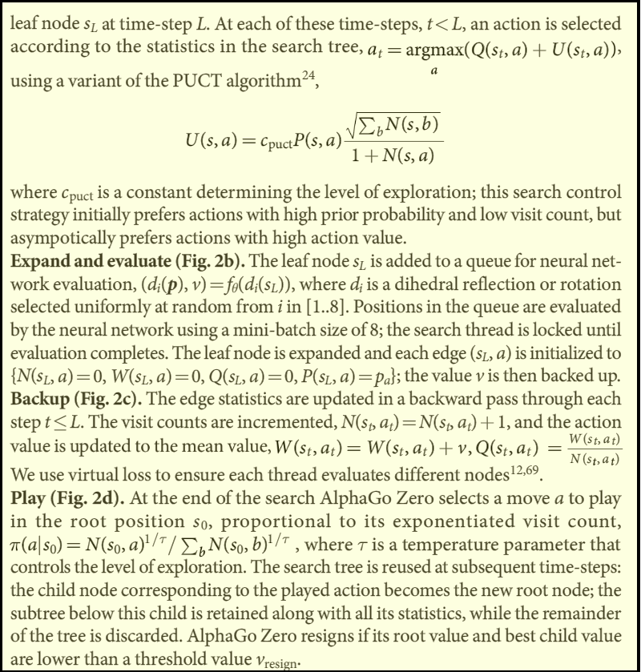
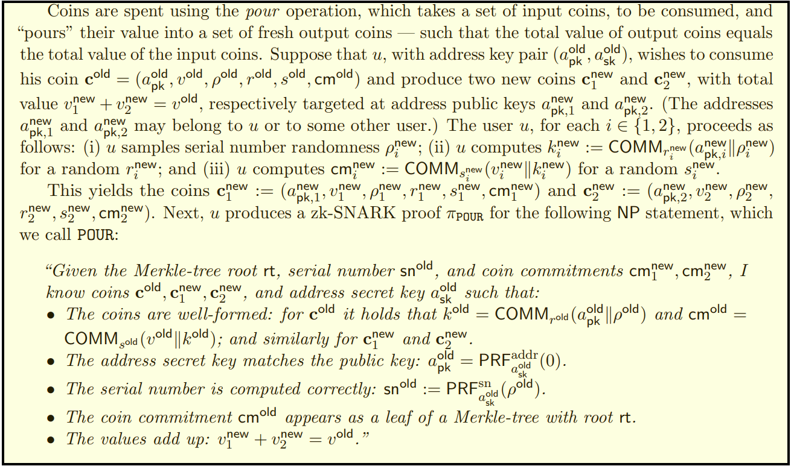
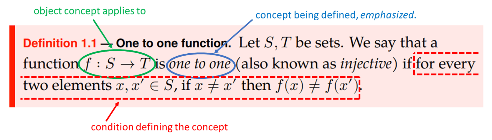
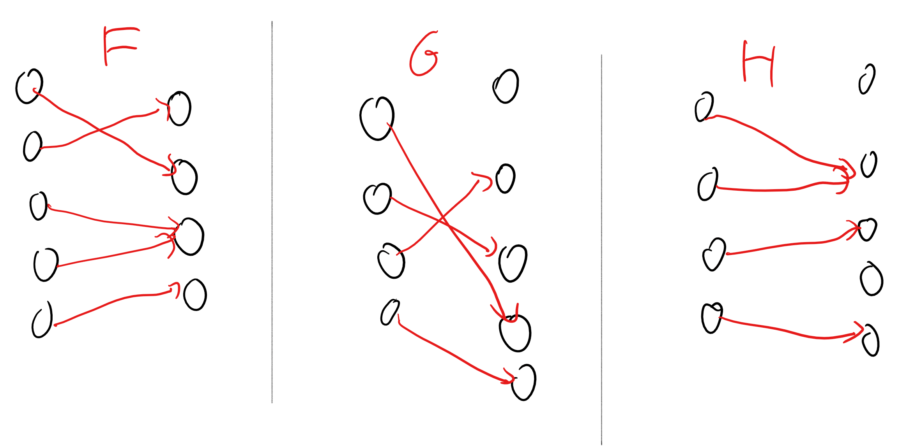
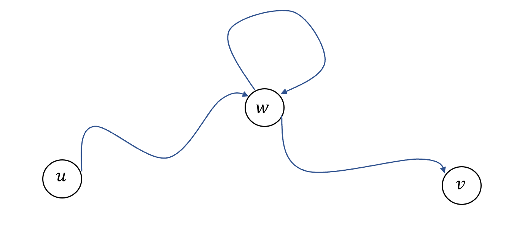
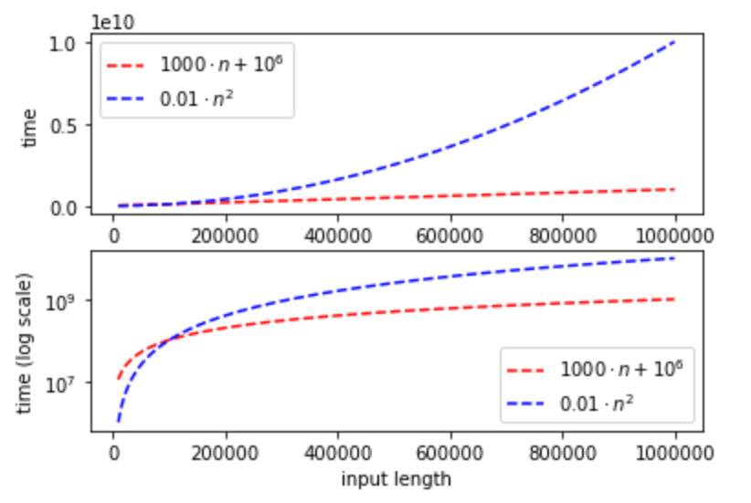
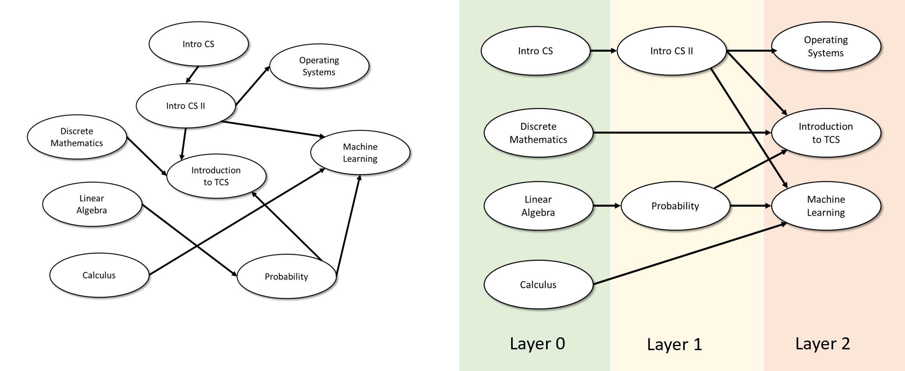
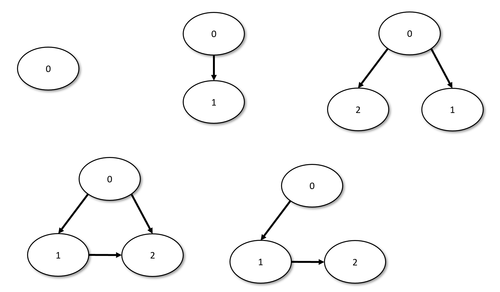

<!-- toc -->

# 数学背景 { #chapmath }

## 学习目标 { .objectives }
 * 学习基本的数学概念, 如几何、函数、数字、逻辑运算符及量词、字符串和图. 
 * 严格地定义大$O$表示法. 
 * 归纳证明法. 
 * 练习如何阅读数学 **定义**、**陈述**与**证明**. 
 * 将直观的论证转化为严谨的证明. 

```admonish quote
"我发现, 从一到十表达的每个数字, 都比前一个数字多一个单位: 之后, 十的倍数会翻倍或增至三倍……直至一百; 然后, 一百的倍数会以与个位和十位相同的方式翻倍和增至三倍……以此类推, 直至计数的最大极限. ", 

—**穆罕默德·伊本·穆萨·花拉子米(Muhammad ibn Mūsā al-Khwārizmī), 820年, 弗雷德里克·罗森(Fredric Rosen)译, 1831年**
```

在本章中, 我们将会介绍一些将在本书中用到的数学概念. 这些概念一般会在"计算机科学中的数学"或"离散数学"等课程或课本中讲解. 有关这些主题的几份可在线免费获取优秀资源, 请参阅"参考书目"部分([第1.9节](chapter_1.md#notesmathchap)). 

**一个数学家的辩白**. 部分学生可能会好奇为什么这本书包含如此多的数学, 这是因为数学就是一门能够简洁而精确描述概念的语言. 在这本书中, 我们使用数学来描述**计算**的概念. 比如说, 我们将思考诸如"**是否存在一种高效算法来求取给定整数的质因数?**"这样的问题(我们将看到这个问题尤为有趣, 它甚至触及了从互联网安全到量子力学等跨度极大的问题! )若要精准的描述这些问题, 我们需要对**算法**这一概念以及算法的**高效性**给出精准的**定义**. 此外, 由于无法通过实验证明某种算法**不存在**, 唯一能证实算法不存在性的方式就是**数学证明**. 


## 1.1 本章: 读者的参考手册 { #manualbackground }

基于你已有的数学背景, 你有两种阅读本章的方式: 

- 如果你已经学习过"离散数学"、"计算机科学中的数学"或任何类似课程, 则无需阅读整章内容, 只需要快速地阅读[第1.2节](chapter_1.md#secmathoverview)来了解我们会用到什么数学工具与[第1.7节](chapter_1.md#notationsec)来了解本书所用符号, 便可跳转至后续章节. 或者, 你也可以放松心情通读本章, 既熟悉本书所用的符号体系, 顺便品味(或忍受)笔者融于字里行间的哲学思考与幽默尝试. 
- 若相关基础较为薄弱, 可以参考[第1.9节](chapter_1.md#notesmathchap)中提供的学习资源. 本章虽然已经涵盖了所有所需知识点, 但系统性地学习相关知识点可能对你更有帮助. 数学学习重在实践, 通过独立完成练习才能真正掌握这些内容. 
- 建议你同时开始回顾离散概率论的相关知识, 本书后续章节(见[第18章](/chapter_18.md))将涉及这部分内容. 


## 1.2 前置数学知识的概览 { #secmathoverview }

我们将使用的主要数学概念如下所示. 此处仅列出这些概念, 其具体定义将在本章后续部分给出. 若您已熟悉所有这些内容, 可以直接跳至[第1.7节](chapter_1.md#notationsec)查看我们使用的完整符号列表. 

- **证明**: 最重要的是, 本书包含大量形式化数学推理, 涵盖数学**定义**、**陈述**与**证明**. 
- **集合及集合运算**: 我们将广泛使用数学**集合**. 涉及到的集合**关系**包括属于($\in$)与包含($\subseteq$), 以及集合**运算**, 主要是并集($\cup$)、交集($\cap$)与差集($\setminus$). 
- **笛卡尔积(Cartesian product)与克林星号(Kleene star)运算**: 两个集合$A$与$B$的**笛卡尔积**, 记作$A\times B$(即由所有满足$a\in A$且$b\in B$的所有有序对$(a,b)$构成的集合), $A^n$表示$n$阶笛卡尔积(例如$A^3=A\times A\times A$), 而$A^*$(称为 **克林星号** )表示所有$n\in\{0,1,2,\dots\}$对应的$A^n$的并集. 
- **函数**: 函数的**定义域**和**陪域**, 以及函数的性质(如**单射**函数和**满射**函数), 还有**部分函数**(即不同于**全函数**的, 对于定义域内部分元素可能存在未定义情况的函数). 
- **逻辑运算**: 常用操作包括逻辑与($\wedge$)、逻辑或($\vee$)、逻辑非($\neg$)等, 以及存在量词($\exists$)和全称量词($\forall$). 
- **基础组合数学**: 诸如$\binom{n}{k}$(表示大小为$n$的集合中所有$k$元子集的数量)等概念. 
- **图论**: 无向图和有向图、连通性、路径和环. 
- **大$O$表示法**: 使用$O,o,\Omega,\omega,\theta$符号分析函数的渐进增长性. 
- **离散概率**: 我们将使用概率论, 特别是基于有限概率空间(如抛掷$n$枚硬币)的概率论, 包括随机变量、期望和浓度等概念. 概率论仅在本书后半部分使用, 我们将在[第18章](/chapter_18.md)先行复习. 然而概率推理是一项精妙(且极其实用)的技能, 尽早开始掌握总是有益的. 

本章后续部分将简要回顾上述概念. 既是为了帮助读者重温可能已经生疏的知识, 也是为了介绍我们的符号与约定——这些约定有时可能与你之前接触过的版本有所不同. 


## 1.3 阅读数学文本

数学家使用各种专业术语的原因, 与工程、法律、医学等其他众多领域并无差别: 我们需要**精确**的术语, 并为频繁使用的概念引入简洁表达. 数学文本往往在单个句子中蕴含极高的信息密度, 因此关键在于缓慢而仔细地阅读, 逐个符号解析. 

随着练习时间逐渐增长, 你将发现阅读数学文本变得越来越轻松, 且专业术语也不再是问题. 更重要的是, 数学文本阅读能力是从本书中能够获得的极具迁移价值的技能之一. 我们的世界正飞速变化——这不仅体现在技术领域, 更延伸至医学、经济学、法律乃至文化等人类实践的方方面面. 无论你未来方向如何, 都很可能会接触到包含前所未见新概念的文本(参见{{ref:fig:alphagozero}}与{{ref:fig:zerocash}}中两个当代"热点领域"的例子). 掌握内化并应用新定义的能力至关重要. 在数学课程相对安全稳定的学习环境中, 这种技能更容易被掌握——至少你可以确信所有概念都有完整定义, 并能随时向教学人员答疑解惑. 

```admonish pic id = 'alphagozerofig'


{{pic}}{fig:alphagozero} 摘自Silver等人2017年发表于《自然》期刊的《[AlphaGo Zero](https://goo.gl/k8pVpL)》论文"方法"部分片段.
```

```admonish pic id = 'zerocashfig'


{{pic}}{fig:zerocash} 摘自Ben-Sasson等人奠定加密货币Zcash项目基础的《[Zerocash](http://zerocash-project.org/paper)》论文片段.
```

数学文本的基本构成要素有三: **定义** 、**断言** 与 **证明**. 

### 1.3.1 定义

数学家经常在已有的概念上定义新的概念. 比如, 以下是一个你可能曾经见过的数学定义(并且我们很快还会再见到): 

```admonish quote title=""
{{defc}}{def:one-to-one}[单射函数]

令$S$与$T$为集合. 当一个函数$f:S\to T$对于任意两个元素$x,x'\in S$, 满足若$x\ne x'$, 则有$f(x)\ne f(x')$, 我们就称是 **单射** 的(one-to-one或injective)其, . 
```

{{ref:def:one-to-one}}阐述了一个简单的概念, 但即便如此它也使用了大量符号. 阅读此类定义时, 一边阅读一边用笔进行标注往往很有帮助(见{{ref:fig:onetoonedef3}}). 例如当看到诸如$f$、$S$或$x$等符号时, 务必确认其指代的对象的类别: 是集合、函数、元素、数字, 还是小妖怪? 你可能还会发现, 向朋友(或对自己)用语言解释这一定义会很有帮助. 

```admonish pic id = 'onetoonedef3fig'


{{pic}}{fig:onetoonedef3} {{ref:def:one-to-one}}的注释版本, 标出了定义的每个对象及其关联的定义
```

### 1.3.2 断言: 定理、引理、主张

定理、引理、断言等都是对已定义概念的真命题. 将特定命题称为"定理"、"引理"还是"断言"属于主观判断, 并不改变其数学实质——三者均指代已被证明为真的命题. 区别在于: **定理**指代值得铭记和强调的重要结论; **引理**通常指技术性结论, 其自身未必重要但能有效辅助其他定理的证明; **断言**则是为证明更重大结论而使用的"过渡性"命题, 其自身价值并不受关注. 


### 1.3.1 证明

数学**证明**是用以证实定理、引理及断言真实性的论证过程. 我们将在下文[1.5节](#proofsbackgroundsec)讨论证明, 其核心在于数学证明的标准极为严苛. 与其他领域不同, 数学证明必须是"无懈可击"的论证, 确保证明对象无可置疑为真. 本节涉及的数学证明示例参见{{ref:exec:simplepathex}}及[1.6节](#topsortsec). 如前言所述, 总体而言: 理解**定义**比掌握**定理**更重要, 理解**定理陈述**比掌握其**证明过程**更重要. 


## 1.4 基础离散数学对象

在本节中, 我们将快速回顾本书中所用的一些数学对象(你当然也可以把这些叫做数学中的"基本数据结构"). 


### 1.4.1 集合

一个**集合**是一些对象的无序容器. 例如, $S=\{2,4,7\}$表示$S$指代一个包含数字$2$、$4$、$7$的集合(我们使用$2\in S$来表示$2$是$S$中的一个元素. )注意集合$\{2,4,7\}$与$\{7,4,2\}$是相同的, 因为它们拥有相同的元素. 同时, 一个集合要么包含一个元素, 要么不包含一个元素, 不存在"包含两次"的概念, 因此我们甚至可以将同一个集合$S$写作$\{2,2,4,7\}$(尽管这样写有些奇怪). 有限集合的 **基数** (cardinality), 即一个集合包含的元素的数量, 记作$|S|$(基数亦可以定义在 **无限** 集上, 见[第1.9节](chapter_1.md#notesmathchap)的参考资料). 因此在上例中$|S|=3$. 若集合$S$的元素都是集合$T$的元素, 则称$S$为$T$的一个**子集**, 记作$S\subseteq T$(我们亦可以称$T$为$S$的一个**超集**. )比如, $\{2,7\}\subseteq \{2,4,7\}$. 不包含任何元素的集合称作**空集**, 写作$\emptyset$. 如果$A$是$B$的一个子集且$A$不等于$B$, 则我们称$A$为$B$的一个**真子集**, 记作$A\subsetneq B$. 

我们可以通过将其元素全部列出来定义集合, 也可以通过写下集合元素满足的一个条件来定义集合, 例如: 
$$
偶数集=\{x\;|\;对于某个非负整数y, 有x=2y\}
$$
当然, 同一集合有多种表示方式, 我们常会使用直观的记号列出几个示例来说明规则. 例如也可将$偶数集$定义为: 
$$
偶数集=\{0,2,4,\ldots\}
$$
注意集合可以是有限的(如$\{2,4,7\}$)或无限的(如$\text{偶数集}$). 集合的元素不必是数字, 例如英语元音的集合$\{a,e,i,o,u\}$, 或按2010年人口普查的美国百万人口城市集合$\{\text{New York, Los Angeles, Chicago, Houston, Philadelphia, Phoenix, San Antonio, San Diego, Dallas}\}$. 集合甚至可以包含其他集合作为元素, 例如$\{1,2,3\}$所有偶数大小子集构成的集合$\{\emptyset,\{1,2\},\{2,3\},\{1,3\}\}$. 

**集合运算**: 集合$S$与的$T$的**并集**记作$S\cup T$, 包含所有属于$S$或属于$T$的元素. **交集**记作$S\cap T$, 包含同时属于$S$和$T$的元素. **差集**记作$S\setminus T$(部分文献中记作$S-T$), 包含属于$S$但不属于$T$的元素. 

**元组、列表、字符串、序列**: **元组**是有序的对象容器, 例如$(1,5,2,1)$是包含四个元素的元组(称为$4$-元组或四元组). 由于元组是有序的, 该元组不同于四元组$(1,1,5,2)$或三元组$(1,5,2)$. $2$-元组亦称为**有序对**. 术语"**元组**"与"**列表**"可互换使用. 若某个元组中的元素均来自于某个有限集$\Sigma$(如$\{0,1\}$), 则称为**字符串**. 类比集合, 我们将元组$T$的**长度**记作$|T|$. 与集合类似, 元组亦有无限形式. 例如由所有完全平方数组成的元组$(1,4,9,\ldots)$. 无限的有序容器称为**序列**, 有时亦称作"无限序列"以强调这一点. "有限序列"是元组的同义词. (可将集合$S$中元素的序列$(a_0,a_1,a_2,\dots)$视为函数$A:\N\to S$(其中对任意$n\in\N$满足$a_n=A(n)$). 类似地, 可将$S$中元素的$k$-元组视为函数$A:[k]\to S$. )

**笛卡尔积**: 若$S$与$T$是集合, 则其**笛卡尔积**记作$S\times T$, 是由所有满足$s\in S$且$t\in T$的有序对$(s,t)$构成的集合. 例如, 若$S=\{1,2,3\}$且$T=\{10,12\}$, 则$S\times T$包含六个元素: $(1,10),(2,10),(3,10),(1,12),(2,12),(3,12)$. 相似的, 若$S,T,U$为集合, 则$S\times T\times U$为由所有满足$s\in S$、$t\in T$、$u\in U$的三元组$(s,t,u)$构成的集合. 更加一般地, 对任意正整数$n$及集合$S_0,\dots,S_{n-1}$, 用$S_0\times S_1\times\dots\times S_{n-1}$表示满足对每个$i\in\{0,\dots,n-1\}$有$s_i\in S_i$的有序$n$-元组$(s_0,\dots,s_{n-1})$的集合. 对任意集合$S$, 将$S\times S$记作$S^2$, $S\times S\times S$记作$S^3$, $S\times S\times S\times S$记作$S^4$, 依此类推. 


### 1.4.2 特殊集合 { #specialsets }

在本书中会反复用到数个特殊集合. 集合
$$
\N=\{0,1,2,\ldots\}
$$


包含了所有的**自然数**, 即非负整数. 对于任意的自然数$n\in\N$, 定义集合$[n]$为$\{0,\dots,n-1\}=\{k\in\N:k<n\}$($\N$与$n$均从$0$开始计数, 与此同时诸多文献中这两个集合是从$1$开始的计数的. 从零开始计数只是一个约定俗成的做法, 只要保持一致性, 并不会产生太大差异. )

我们偶尔也会使用集合$\Z=\{\dots,-2,-1,0,1,2,\dots\}$来表示所有(负的和非负的)整数, 同时使用$\R$来表示所有**实数**(这个集合不仅包含整数, 同时也包含分数与无理数, 例如, $\R$包含诸如$+0.5$、$-\pi$等的数字. )我们使用$\R_+$来表示所有*正*实数的集合$\{x\in\R:x>0\}$. 这个集合有时亦写作$(0,\infty)$. 

**字符串**: 另外一个我们经常会用到的集合是
$$
\{0,1\}^n = \{ (x_0,\ldots,x_{n-1}) \;:\; x_0,\ldots,x_{n-1} \in \{0,1\} \}
$$
这个集合包含了所有长度为$n$($n$为任意自然数)的二进制字符串. 换句话说, $\{0,1\}^n$是包含所有由$0,1$组成的$n$-元组的集合. 这与我们前文中的符号一致: $\{0,1\}^2$是笛卡尔积$\{0,1\}\times\{0,1\}$, $\{(0,1)\}^3$是笛卡尔积$\{(0,1)\}\times\{(0,1)\}\times\{(0,1)\}$, 依此类推. 

我们将字符串$(x_0,x_1,\dots,x_{n-1})$简单地写作$x_0x_1\cdots x_{n-1}$. 例如, 
$$
\{0,1\}^3=\{000,001,010,011,100,101,110,111\}
$$
对于所有字符串$x\in\{0,1\}^n$与$i\in[n]$, 我们将$x$的第$i$个元素记作$x_i$. 

我们也经常会使用包含所有长度二进制字符串的集合, 即
$$
\{0,1\}^* = \{ (x_0,\ldots,x_{n-1}) \;:\; n\in\N \;,\;, x_0,\ldots,x_{n-1} \in \{0,1\} \}
$$
另一个表示这个集合的方式是
$$
\{0,1\}^* = \{0,1\}^0 \cup \{0,1\}^1 \cup \{0,1\}^2 \cup \cdots
$$
或者更为简洁的
$$
\{0,1\}^* = \bigcup_{n\in\N} \{0,1\}^n
$$
集合$\{0,1\}^*$包含了"长度为$0$的字符串"或"空字符串", 我们将这个字符串记作$\texttt{""}$(此处我们使用与大部分编程语言一致的符号, 其他文献可能会使用$\epsilon$或$\lambda$来表示空字符串). 

**推广星号操作**: 对于任意集合$\Sigma$, 我们定义
$$
\Sigma^*=\bigcup_{n\in\N}\Sigma^n
$$
例如, 若$\Sigma=\{a,b,c,d,\dots,z\}$, 则$\Sigma^*$表示字母表a-z上所有有限长度字符串的集合. 

**连接操作**: 两个字符串$x\in\Sigma^n$与$y\in\Sigma^m$的连接是指将$y$书写在$x$后形成的$(n+m)$长度的字符串$xy$. 具体而言, 若$x\in\{0,1\}^n$且$y\in\{0,1\}^m$, 则$xy$等于满足以下条件的字符串$z\in\{0,1\}^{n+m}$: 当$i\in[n]$时$z_i=x_i$, 当$i\in\{n,\dots,n+m-1\}$时$z_i=y_{i-n}$. 


### 1.4.3 函数 { #functionsec } 

若$S$与$T$为非空集合, 则从$S$到$T$的**函数**(记作$F:S\to T$)会将每个元素$x\in S$关联到一个元素$F(x)\in T$. 集合$S$称为函数$F$的**定义域**, 集合$T$称为$F$的**陪域**. 函数$F$的**像**是指集合$\{F(x)\;|\; x\in S\}$, 即由所有被映射的输入元素对应的输出元素组成的$F$的陪域子集(有些文献使用"**值域**"一词表示函数的像, 而另一些文献使用"**值域**"表示函数的陪域. 因此我们将完全避免使用"值域"这一术语. )与集合类似, 我们可以通过列出函数对$S$中所有元素给出的取值表或通过规则来定义函数. 例如, 若$S=\{0,1,2,3,4,5,6,7,8,9\}$且$T=\{0,1\}$, 则下表定义了一个函数$F:S\to T$. 注意该函数与规则$F(x)=(x\mod 2)$定义的函数相同. 

```admonish example
*函数的一个例子*

| 输入 | 输出 |
| ---- | ---- |
| 0    | 0    |
| 1    | 1    |
| 2    | 0    |
| 3    | 1    |
| 4    | 0    |
| 5    | 1    |
| 6    | 0    |
| 7    | 1    |
| 8    | 0    |
| 9    | 1    |
```

若$F:S\to T$满足对所有$x\ne y$均有$F(x)\ne F(y)$, 则称$F$是**单射**(见{{ref:def:one-to-one}}, 亦称为**单射函数**). 若$F$满足对每个$y\in T$均存在某个$x\in S$使得$F(x)=y$, 则称$F$是**满射**(亦称作**满射函数**). 既是单射又是满射的函数称为**双射函数**或**双射**. 从集合$S$到自身的双射亦称为$S$的**排列**. 若$F:S\to T$是双射, 则对于每个$y\in T$均存在唯一的$x\in S$使得$F(x)=y$. 我们将该值$x$记作$F^{-1}(y)$. 注意$F^{-1}(y)$本身也是从$T$到$S$的双射(你能明白为什么吗? ). 

给出两个集合之间的双射通常是证明集合大小相同的有效方法. 事实上, "$S$与$T$具有相同基数"的标准数学定义就是存在一个双射$f:S\to T$. 此外, 若存在从$S$到集合$\{0,\dots,n-1\}$的双射, 则定义集合$S$的基数为$n$. 正如我们将在本书后面看到的, 这个定义可以推广到无限集合的基数定义. 

**部分函数(又译偏函数)**: 我们有时会关注从$S$到$T$的**部分函数**. 部分函数允许在$S$的某个子集上未定义. 也就是说, 若$F$是从$S$到$T$的偏函数, 则对每个$s\in S$, 要么(如标准函数的情况)存在$T$中的元素$F(s)$, 要么$F(s)$未定义. 例如, 部分函数$F(x)=\sqrt x$仅定义在非负实数上. 当需要偏函数和标准(即非部分)函数时, 我们称后者为**全函数**. 当我们不加限定地说"函数"时, 指的是全函数. 

部分函数的概念是函数的严格推广, 因此每个函数都是部分函数, 但并非每个部分函数都是函数(也就是说, 对于任意非空集合$S$与$T$, 从$S$到$T$的偏函数集合是从$S$到$T$的全函数集合的真超集. )当需要强调从$A$到$B$的函数$f$可能不是全函数时, 我们写作$f:A\to_p B$. 我们也可以将从$S$到$T$的偏函数视为从$S$到$T\cup\{\bot\}$的全函数, 其中$\bot$是一个特殊的"失败符号". 因此, 我们可以说$F(x)=\bot$, 而不是$F$在$x$处未定义. 

**关于函数的基本事实**: 验证能否证明以下结论是复习函数知识的绝佳方式: 

- 若$F:S\to T$和$G:T\to U$是单射函数, 则它们的复合函数$H:S\to U$(定义为$H(s)=G(F(s))$)也是单射. 
- 若$F:S\to T$是单射, 则存在一个满射函数$G:T\to S$, 使得对于每个$s\in S$均有$G(F(s))=s$. 
- 若$G:T\to S$是满射, 则存在一个单射函数$F:S\to T$, 使得对于每个$s\in S$均有$G(F(s))=s$. 
- 若$S$与$T$是非空有限集合, 则以下条件相互等价: (a) $|S|\le|T|$; (b) 存在单射函数$F:S\to T$; (c) 存在满射函数$G:T\to S$. 这些等价关系实际上对无限集合$S$和$T$亦成立. 对于无限集合, 条件(b)(或等价的条件(c))是$|S|\le|T|$的公认定义. 

```admonish pic id = 'functionsdiagramfig'


{{pic}}{fig:functionsdiagram} 我们可以将有限函数表示为有向图, 其中从$x$到$f(x)$有一条边. 满射条件要求函数陪域中的每个顶点的入度至少为$1$. 单射条件要求函数陪域中的每个顶点入度至多为$1$, 上图的示例中, $F$是满射函数, $G$是单射函数, 而$H$既不是满射也不是单射
```

```admonish tip
**暂停思考**: 

你可以在许多离散数学教材中找到这些结论的证明, 例如[Lehman-Leighton-Meyer讲义](https://cs121.boazbarak.org/LLM_data_types.pdf)中的第4.5节. 但我强烈建议你尝试独立证明它们, 或至少通过证明小规模情况(如$|S|=3,|T|=4,|U|=5$)的特殊实例来确信这些结论成立. 
```

让我们以其中一个事实为例进行证明: 

```admonish quote title=""
{{lemc}}{lem:onetooneimpliesonto}

若$S,T$是非空集合且$F:S\to T$是单射, 则存在满射函数$G:T\to S$, 使得对每个$s\in S$均有$G(F(s))=s$. 
```

```admonish proof collapsible=true, title = "对{{ref:lem:onetooneimpliesonto}}的证明"
选择某个$s_0\in S$. 我们将定义函数$G:T\to S$如下: 对每个$t\in T$, 若存在某个$s\in S$使得$F(s)=t$, 则令$G(t)=s$(由于$F$的单射性质, 不可能有两个不同的$s,s'$同时映射到$t$, 因此$s$的选择是无歧义的). 否则, 令$G(t)=s_0$. 现在对于每个$s\in S$, 根据$G$的定义, 若$t=F(s)$, 则$G(F(s))=s$. 此外, 这也表示$G$是满射, 因为这意味着对每个$s\in S$都存在某个$t$(即$t=F(s)$)使得$G(t)=s$. 
```


### 1.4.4 图 { #graphsec }

*图*在计算机科学及众多其他领域中无处不在. 图可以用于建模非常多的数据类型, 包括但不限于社交网络、调度约束、道路网络、深度神经网络、基因相互作用、观测值之间的相关性. 几种图的正式定义将在下面给出, 但如果你没有在先前的课程中了解过图, 我强烈建议你从[第1.9节](chapter_1.md#notesmathchap)中的资料中详细了解它们. 

图有两种基本类型: **无向图**与**有向图**. 

```admonish quote title=""
{{defc}}{def:undirgraph}[无向图]

一个**无向图**$G=(V,E)$由一个**顶点**集$S$与一个**边**集$E$组成. 每条边都是一个$V$的大小为2的子集. 我们称两个顶点$u,v\in V$为**相邻顶点**, 若边$\{u,v\}$在$E$中. 
```

基于这个定义, 我们可以定义关于图与顶点的几个性质. 我们将$u$的相邻节点的个数成为$u$的**度数**. 图中的一条**路径**是一个元组$(u_0,\dots,u_k)\in V^{k+1}$(其中$k>0$), 且满足对每个$i\in[k]$, $u_{i+1}$都是$u_i$的相邻节点. **简单路径**是指所有$u_i$均不重复的路径$(u_0,\dots,u_{k-1})$. **环**是指满足$u_0=u_k$的路径$(u_0,\dots,u_k)$. 若两个顶点$u,v\in V$满足$u=v$或存在一条从$u_0=u$到$u_k=v$的路径, 则称这两个顶点是**联通的**. 当图中每对顶点都联通时, 我们称该图是**连通图**. 

下面是一些关于无向图的基本事实. 我们将为它们给出一些非正式的论证, 但完整证明作为练习留待读者自行完成(完整证明可以在[第1.9节](chapter_1.md#notesmathchap)中的诸多资源中找到). 

```admonish quote title=""
{{lemc}}{lem:degreeseges}

在任意的无向图$G=(V,E)$中, 所有顶点的度数之和等于边数的两倍. 
```

通过观察可知: 每条边$\{u,v\}$会对度数总和贡献两次(一次作用于$u$, 另一次作用于$v$), 由此可证明{{ref:lem:degreeseges}}. 

```admonish quote title=""
{{lemc}}{lem:conntrans}

连通关系具有传递性, 即如果$u$与$v$相连, 且$v$与$w$相连, 则$u$与$w$也相连. 
```

通过将路径$(u,u_1,u_2,\dots,u_{k-1},v)$与路径$(v,u_1',\dots,u_{k-1}',w)$拼接, 得到连接$u$与$w$的路径$(u,u_1,\ldots,u_{k-1},v,u'_1,\ldots,u'_{k'-1},w)$, 即可证明{{ref:lem:conntrans}}. 

```admonish quote title=""
{{lemc}}{lem:simplepath}[联通的顶点间有简单路径]

对于任意无向图$G=(V,E)$及连通顶点对$u,v$, 从$u$到$v$的最短路径是简单路径. 特别地, 任意连通顶点对间均存在连接二者的简单路径. 
```

通过"捷径修剪法"可证明{{ref:lem:simplepath}}: 若某路径中同一节点$w$出现两次, 则移除其间的循环段(见{{ref:fig:shotcutpath}}). 将这一直观论证转化为形式化证明是很好的练习: 

```admonish pic id = 'shortcutpathfig'


{{pic}}{fig:shotcutpath} 若图中存在从$u$到$v$的路径两次经过顶点$w$, 则可移除$w$到自身的循环段, 得到仅经过$w$一次的捷径路径. 
```

```admonish question title=""
{{exec}}{exec:simplepathex}

证明{{ref:lem:simplepath}}. 
```

```admonish solution collapsible=true, title = "解答"
此证明遵循{{ref:fig:nvsnsquared}}所示的思路. 需要注意的复杂性在于: 路径中可能有多个顶点被重复访问, 因此"捷径修建"不一定能直接得到简单路径. 我们通过考察$u$与$v$之间的**最短路径**来解决该问题. 具体如下: 

设$G=(V,E)$为无向图, $u$和$v$为$G$中两个连通顶点. 我们将证明存在连接$u$和$v$的简单路径. 令$k$为$u$与$v$之间路径的最短长度, 并设$P=(u_0,u_1,u_2,\dots,u_{k-1},u_k)$为一条长度为$k$的路径(可能存在多条此类路径, 若有则任选其一). (即$u_0=u$, $u_k=v$, 且对任意$l\in[k]$有$(u_l,u_{l+1})\in E$. )我们断言$P$是简单路径. 假设存在某个顶点$w$在路径中出现两次: 即对某些$i<j$有$w=u_i$且$w=u_j$. 此时可通过取$P$的前$i$个顶点(从$u_0=u$到$w$的首次出现)和后$k-j$个顶点(从$w$第二次出现后的顶点$u_{j+1}$到$u_k=v$), 得到捷径路径$P'=(u_0,u_1,\dots,u_{i-1},w,u_{j+1},\dots,u_k)$. 由于$w=u_i=u_j$, $(u_{i-1},w)$和$(w,u_{j+1})$都是$E$中的边, 因此$P'$是连接$u$和$v$的有效路径. 但$P'$的长度为$k-(j-i)<k$, 这与$P$的最小性矛盾. 
```

```admonish info
{{remc}}{rem:comingupwithproofs}[寻找证明的方法]

{{ref:exec:simplepathex}}是寻找证明过程的典型示例. 首先确保理解命题含义, 随后提出非形式化论证说明其成立性, 最后将非形式化论证转化为严格证明. 该证明不必过长或过度形式化, 但应清晰阐述为何从假设可推出结论. 
```

度数和连通性的概念亦可自然推广至有向图, 其定义如下: 

```admonish quote title=""
{{defc}}{def:dirgraph}[有向图]

一个**有向图**$G=(V,E)$由顶点集$V$和边集$E\subseteq V\times V$(由$V$的有序对构成)组成. 有时将边$(u,v)$记为$u\to v$. 若存在边$u\to v$, 则称$v$是$u$的**出邻居**, $u$是$v$的**入邻居**. 
```

有向图可能同时包含边$u\to v$和$v\to u$, 此时$u$和$v$互为入邻居和出邻居. 顶点$u$的**入度**是其入邻居的数量, **出度**是其出邻居的数量. 图中的**路径**是指元组$(u_0,\dots,u_k)\in V^{k+1}$(其中$k>0$), 且对每个$i\in[k]$有$u_{i+1}$是$u_i$的出邻居. 与无向图情形类似, **简单路径**是指所有$u_i$均不相同的路径$(u_0,\dots,u_{k-1})$, **环**是指满足$u_0=u_k$的路径$(u_0,\dots,u_k)$. 我们经常关注的一类有向图是**有向无环图**(Directed Acyclic Graph, DAG), 顾名思义即为不含环的有向图: 

```admonish quote title=""
{{defc}}{def:dag}[有向无环图]

若有向图$G=(V,E)$中不存在顶点列$u_0,u_1,\dots,u_k\in V$使得$u_0=u_k$且对每个$i\in[k]$有边$u_i\to u_{i+1}\in E$, 则称其为**有向无环图**(DAG). 
```

上述引理在有向图中均有对应版本. 其证明(与无向图情形基本一致)将作为习题留给读者. 

```admonish quote title=""
{{lemc}}{lem:diredgreeseges}

对于任意有向图$G=(V,E)$, 入度之和等于出度之和, 且均等于边数. 
```

```admonish quote title=""
{{lemc}}{lem:dirconntrans}

对于任意有向图, 若存在从$u$到$v$的路径和从$v$到$w$的路径, 则存在从$u$到$w$的路径. 
```

```admonish quote title=""
{{lemc}}{lem:dirsimplepath}

对于任意有向图$G=(V,E)$及存在路径的顶点对$u,v$, 从$u$到$v$的最短路径是简单路径. 
```

```admonish info
{{remc}}{rem:labeled}[带标签图]

在某些应用中, 我们会考虑**带标签图**(其顶点或边关联有标签, 标签可以是数字、字符串或其他集合中的元素). 此类图可视为具有(可能为部分的)标签函数$L:V\cup E\to\mathcal L$, 其中$\cal L$为潜在标签集合. 但我们通常不会显式引用此标签函数, 而是直接表述为"顶点$v$具有标签$\alpha$等". 
```


### 1.4.5 逻辑运算符与量词 { #secquantifiers }

如果$P$和$Q$是可真可假的陈述, 则$P$**与**$Q$(记为$P\wedge Q$)是一个当且仅当$P$和$Q$同时为真时才成立的陈述; 而$P$**或**$Q$(记为$P\vee Q$)是一个当且仅当$P$或$Q$为真是成立的陈述. $P$的**否定**记作$\neg P$或$\overline P$, 当且仅当$P$为假时该陈述为真. 

假设$P(x)$是一个依赖于某个**参数**$x$(有时亦称为**自由变量**)的陈述, 其特性在于: 对于从集合$S$中取值的每一个$x$的具体赋值, $P(x)$都会有明确的真值. 例如$x>7$这个陈述本身没有固有真值, 但当我们用具体实数代入$x$时, 它就会成为真或假的命题. 我们用$\forall_{x\in S}P(x)$表示这样一个陈述: 当且仅当对所有$s\in S$都有$P(x)$为真时, 该陈述为真. 用$\exists_{x\in S}P(x)$表示这样一个陈述: 当且仅当存在某个$x\in S$使得$P(x)$为真时, 该陈述为真. 

例如下面这个形式化表达式, 描述的是"存在大于100且不能被3整除的自然数$n$"这个真命题: 
$$
\exists_{n\in \N} (n>100) \wedge \left(\forall_{k\in N} k+k+k \neq n\right)
$$
"对于足够大的$n$". 本书中会反复出现"某个陈述对于足够大的$n$成立"这样的论断, 其含义是: 存在整数$N_0$, 使得对于所有$n>N_0$, $P(n)$都成立. 我们可以将其形式化为$\exists_{N_0\in\N}\forall_{n>N_0}P(n)$. 


### 1.4.6 求和与求积的量词 { #secquantifierssums }

使用下列简记法来表示多个数的求和或求积往往更为便捷. 若$S=\{s_0,\dots,s_{n-1}\}$是有限集且$f:S\to\R$是函数, 则$\sum_{x\in S}f(x)$表示: 
$$
f(s_0) + f(s_1) + f(s_2) + \ldots + f(s_{n-1})
$$
$\prod_{x\in S}f(x)$表示: 
$$
f(s_0) \cdot f(s_1) \cdot f(s_2) \cdot \ldots \cdot f(s_{n-1})
$$
例如, 从$1$到$100$的所有整数的平方和可表示为: 

$$
\sum_{i\in \{1,\ldots,100\}} i^2 {{numeq}}{eq:sumsquarehundred}
$$
由于对整数区间求和极为常见, 对此存在特殊记号. 对于任意两个满足$a\le b$的整数, $\sum^b_{i=a}f(i)$表示$\sum_{i\in S}f(i)$, 其中$S=\{x\in\Z\;:\; a\le x\le b\}$. 因此{{eqref:eq:sumsquarehundred}}可改写为: 
$$
\sum^{100}_{i=1}i^2
$$


### 1.4.7 解析公式: 约束变量与自由变量 { #boundvarsec }

在数学中, 如同在编程中一样, 我们常常会遇到符号化的"变量"或"参数". 给定某个公式时, 理解特定变量在该公式中是约束变量还是自由变量至关重要. 例如在如下陈述中, $n$是自由变量, 而$a$和$b$是受存在量词$\exists$约束的变量: 

$$
\exists_{a,b \in \N} (a \neq 1) \wedge (a \neq n) \wedge (n = a \times b) {{numeq}}{eq:aboutnstmt}
$$
由于$n$是自由变量, 它可以被赋予任意值, 因此{{eqref:eq:aboutnstmt}}的真值取决于$n$的取值. 例如当$n=8$时公式成立, 但当$n=11$时则不成立. (你能看出原因吗? )

同样的问题在解析代码时也会出现. 例如在下列C语言代码片段中: 

```c
for (int i=0 ; i<n ; i=i+1) {
    printf("*");
}
```

变量`i`在`for`循环块内是约束变量, 而变量`n`则是自由变量. 

约束变量的主要特性是: 我们可以对其进行重命名(只要新名称不与其他变量名冲突)而不改变语句的含义. 因此以下陈述

$$
\exists_{x,y \in \N} (x \neq 1) \wedge (x \neq n) \wedge (n = x \times y) {{numeq}}{eq:aboutnstmttwo}
$$
与{{eqref:eq:aboutnstmt}}完全等价—它们对$n$值的真值判断完全相同. 

同样地, 代码: 

```c
for (int j=0 ; j<n ; j=j+1) {
    printf("*");
}
```

与使用`i`的代码段有完全相同的执行效果. 

```admonish info
{{remc}}{rem:notation}[数学符号与编程符号的对比]

数学符号与编程语言存在诸多相似性, 这源于二者都是为精确传递复杂概念而构建的形式化体系. 但两者存在文化差异: 编程语言通常使用具有实际意义的变量名(如`NumberOfVertices`), 而数学则倾向于使用简短标识符(如$n$). 部分原因可能源于数学证明的传统形式—手写论证与口头阐述, 而非键入代码并编译执行. 另一个原因是: 在证明中使用错误变量名最多导致读者困惑, 但在程序中使用错误变量名则可能导致飞机失事、患者死亡或火箭爆炸. 

由此带来的结果是: 数学中常常重复使用标识符, 甚至会耗尽字母表而不得不引入希腊字母, 并通过区分大小写及字体样式来扩展表示范围. 同样地, 数学符号体系大量使用"重载"机制——例如运算符$+$可对应多种不同对象(实数、矩阵、有限域元素等), 其具体含义需通过上下文推断. 

两个领域都存在"类型"概念. 在数学中, 我们通常约定特定字母表示特定类型的变量: 例如$i,j,k,l,m,n$通常表示整数, $\epsilon$通常表示极小正实数(相关约定详见[1.7节](#notationsec)). 阅读或撰写数学文本时, 我们无法依赖"编译器"进行类型安全检查, 因此必须密切关注每个变量的类型, 确保所有操作都是"合法"的. 

Kun的著作([Kun, 2018](https://scholar.google.com/scholar?hl=en&q=Kun+A+programmer%27s+introduction+to+mathematics))对数学与编程文化的异同进行了深入探讨. 
```


### 1.4.8 渐近分析与大$O$表示法 { #secbigohnotation }

```admonish quote

"$\log\log\log n$" 已被证明会趋近于无穷大, 但从未被实际观测到这一现象. "

*——匿名, 由卡尔·波默兰斯(Carl Pomerance)引用(2000年)*
```

精确描述运行时间等量通常非常繁琐, 且并无必要, 因为我们通常主要关注的是"高阶项". 也就是说, 我们希望理解该量随输入变量增长时的缩放行为. 例如, 就运行时间而言, 一个$n^5$时间算法与一个$n^2$时间算法之间的差异, 远比$100n^2+10n$时间算法与$10n^2$算法之间的差异更加显著. 为此, 大$O$表示法作为一种"简化表述"的方式极为有用, 它能让我们的注意力集中在真正重要的内容上. 例如, 使用大$O$表示法, 我们可以说$100n^2+10n$和$10n^2$都简单的属于$\Theta(n^2)$(可非正式地理解为"在常数因子范围内相同"), 而$n^2=o(n^5)$(可非正式地理解为$n^2$"远小于"$n^5$). 

通常(尽管为非正式表述), 若$F,G$是两个将自然数映射到非负实数的函数, 则"$F=O(G)$"表示在不考虑常数因子的情况下$F(n)\le G(n)$, 而"$F=o(G)$"表示$F$远小于$G$, 其含义是: 无论给$F$乘以多大的常数因子, 只要取足够大的$n$, $G$都会更大(因此, 有时会将$F=o(G)$写作$F\ll G$). 如果$F=O(G)$且$G=O(F)$, 则写作$F=\Theta(G)$, 这可以理解为: 若不考虑常数因子, $F$与$G$相同. 更形式化地, 我们如下定义大$O$表示法: 

```admonish quote title=""
{{defc}}{def:bigohdef}[大$O$表示法]

设$R_+=\{x\in\R\;|\; x>0\}$为正实数集. 对于两个函数$F,G:\N\to\R_+$, 若存在$a,N_0\in\N$, 使得对所有$n>N_0$有$F(n)\le a\cdot G(n)$, 则称$F=O(G)$. 若$F=O(G)$且$G=O(F)$, 则称$F=\Theta(G)$. 若$G=O(F)$, 则称$F=\Omega(G)$. 

若对任意$\epsilon>0$, 存在$N_0$使得对所有$n>N_0$有$F(n)<\epsilon G(n)$, 则称$F=o(G)$. 若$G=o(F)$, 则称$F=\omega(G)$. 
```

```admonish pic id = 'nvsnsquaredfig'


{{pic}}{fig:nvsnsquared} 若$F(n)=o(G(n))$, 则当$n$足够大时, $F(n)$将小于$G(n)$. 例如, 若算法$A$的运行时间为$1000\cdot n+10^6$, 算法$B$的运行时间为$0.01n^2$, 那么即使$B$在小输入时更高效, 当输入足够大时, $A$的运行速度将远快于$B$
```

在大$O$表示法中使用"匿名函数"通常很方便. 例如, 当我们写$F(n)=O(n^3)$这样的语句时, 我们的意思是$F=O(G)$, 其中$G$是定义为$G(n)=n^3$的函数. [Jim Apsnes的离散数学笔记第七章](http://www.cs.yale.edu/homes/aspnes/classes/202/notes.pdf)很好地总结了大$O$表示法; 另可参阅[本教程](http://discrete.gr/complexity/), 以获得更温和且更面向程序员的介绍. 

*$O$并不表示相等*. 在大$O$表示法中使用等号极为常见, 但这种用法其实并不准确, 因为诸如$F=O(G)$的语句实际上表示$F$属于集合$\{G':\exists_{N,c}使得\forall_{n>N}G'(n)\le cG(n)\}$. 如果说有什么更合理的表示法, 那就是使用不等式写作$F\le O(G)$和$F\ge\Omega(G)$, 而将等号保留给$F=\Theta(G)$. 因此, 我们有时也会使用这种表示法, 但由于使用等号的习惯已经根深蒂固, 我们通常也沿用此习惯. (有些文献写作$F\in O(G)$而非$F=O(G)$, 但我们不会使用这种表示法. )尽管等号可能引起误解, 但请记住: 诸如$F=O(G)$的语句表示在忽略常数的粗略意义上$F$"至多"为$G$, 而诸如$F=\Omega(G)$的语句表示在相同粗略意义上$F$"至少"为$G$. 


### 1.4.9 关于大$O$表示法的一些"经验法则"

在比较两个函数$F$和$G$时, 有一些简单的经验法则可供参考: 

- 在大$O$表示法中, 乘性常数不影响结果. 因此, 若$F(n)=O(G(n))$, 则$100F(n)=O(G(n))$. 当两个函数相加时, 我们只需要关注较大着. 例如, 在大$O$表示法的语句下, $n^3+100n^2$与$n^3$等价. 一般而言, 对于任意多项式, 我们只需关注高阶项. 
- 对于任意两个常数$a,b>0$, 当且仅当$a\le b$时, $n^a=O(n^b)$成立, 当且仅当$a<b$时, $n^a=o(n^b)$成立. 例如, 综合以上两点可知: $100n^2+10n+100=o(n^3)$. 
- 多项式函数始终小于指数函数: 对于任意两个常数$a>0$和$\epsilon>0$(即使$\epsilon$远小于$a$), 都有$n^a=o(2^{n^\epsilon})$. 例如, $100n^{100}=o(2^{\sqrt{n}})$. 
- 类似地, 对数函数始终小于多项式函数: 对于任意两个常数$a,\epsilon>0$, $(\log n)^a$(记作$\log^a n$)满足$o(n^\epsilon)$. 例如, 综合上述观察可得: $100n^2\log^100 n=o(n^3)$. 

```admonish info
{{remc}}{rem:bigonotime}[大$O$表示法的其他应用场景(可选)]

虽然大$O$表示法常用于分析算法的时间复杂度, 但这绝非其唯一用途. 我们可以用大$O$表示法来限定任意两个从整数映射到正数的函数之间的渐近关系. 无论这些函数是衡量运行时间、内存使用量, 还是其他与计算无关的量, 该方法均适用. 以下是一个与本书无关的例子(你可选择跳过): [黎曼猜想](https://en.wikipedia.org/wiki/Riemann_hypothesis)(数学领域最著名的未解问题之一)的一种表述方式是: 在$0$到$n$之间的质数数量等于$\int_2^n \tfrac{1}{\ln x} dx$, 且其加性误差至多为$O(n\log⁡ n)$. 
```


## 1.5 证明 { #proofsbackgroundsec }

许多人认为数学证明是从若干公理出发, 通过逻辑推导最终得出结论的过程. 事实上, 某些词典也采用这种方式[定义证明](http://www.thefreedictionary.com/mathematical+proof). 这种理解并非完全错误, 但从本质而言, 对命题X的数学证明实质上是一个能让读者确信X为真且不容置疑的论证过程. 

构建此类证明需要做到: 

- 精确理解X的含义. 
- 使**自己**确信X为真. 
- 用清晰、准确、简洁的书面英语记录推理过程(仅在有助于明确性时使用公式或符号). 

多数情况下, 第一步最为关键. 理解命题含义往往比理解其真理性更耗费心力. 在第三步中, 为使读者毫无疑虑, 我们常需将推理分解为若干"基本步骤", 其中每个步骤都应简单到"不言自明"的程度——所有步骤的叠加最终导出目标命题. 


### 1.5.1 证明与程序

**证明写作**与**程序编写**具有高度相似性, 且二者所需的技能也高度重合. **程序**编写包含: 

- 理解程序需要实现的**功能**. 
- 确信该**功能**可通过计算机实现(可通过在白板或记事本上规划如何拆解为子任务来实现). 
- 将规划转化为编译器或解释器可读的代码(通过将每个任务拆解为某种编程语言的基本操作序列). 
- 与证明过程类似, 程序设计的第一步往往最为关键. 核心区别在于: 证明的阅读者是人类, 而程序的阅读者是计算机(随着机器**可验证**证明形式的普及, 这种差异正在逐渐消弭; 此外, 为确保程序的正确性与可维护性, 人类可读性至关重要). 因此我们特别强调证明的**逻辑流畅性**与**可读性**(这对程序编写同样重要). 撰写证明时, 应假想读者是聪明但极度多疑且挑剔的, 他们会对任何未充分论证的步骤提出质疑. 


### 1.5.2 证明的书写风格

数学证明是一种特定类型的写作形式, 具有独特的惯例与偏好风格. 如同所有写作类型, 熟能生巧, 且通过修改草稿提升清晰度至关重要. 

在命题$X$的证明中, " **证明:** "与" **证毕** "之间的所有文字都应专注于论证$X$的真实性. 题外话、示例或沉思应置于这两个标记之外, 以免造成读者困惑. 证明应具备清晰的逻辑流: 每个句子或公式都应有明确目的, 且读者能清晰理解其作用. 撰写证明时, 应对每个句子或公式进行审视: 

1. 该句子/公式是否在声明某个命题为真? 
2. 若是, 该命题是从前述步骤推导而来, 还是将在后续步骤中建立? 
3. 这个句子/公式**起什么作用**? 是通向原命题证明的一步, 还是为证明先前所述的中间论断而设? 
4. 最后, 读者是否能清晰理解前三个问题的答案? 若否, 则需要调整顺序、重新表述或补充说明. 

关于数学写作的推荐资源包括[Lee的讲义](https://sites.math.washington.edu/~lee/Writing/writing-proofs.pdf)、[Hutching的讲义](https://math.berkeley.edu/~hutching/teach/proofs.pdf), 以及[斯坦福大学CS103课程](http://web.stanford.edu/class/cs103/)中的若干优秀讲义. 


### 1.5.3 证明的方法

```admonish quote

"假如事情是这样, 那就有可能; 假如事情是这样, 那就会是; 但既然事情不是这样, 那就不是. 这就是逻辑. "

**——刘易斯·卡罗尔(Lewis Carroll)《爱丽丝镜中奇遇记》**
```

正如编程一样, 证明亦有数种常用的方法. 以下是一些例子: 

**反证法**: 证明$X$的一种方式是展示, 若$X$为假, 则会导致导出矛盾. 这种类型的证明通常由一句"假设, 为了得出矛盾, $X$为假"作为开头, 并以推导出一个矛盾作为结尾(如违反定理陈述中的某个假设). 以下是一个例子: 

```admonish quote title=""
{{lemc}}{lem:C1S5L1}

不存在自然数$a,b$使得$\sqrt{2}=\tfrac{a}{b}$. 
```

```admonish proof collapsible=true, title = "对{{ref:lem:C1S5L1}}的证明"
假设, 为了得出矛盾, 上述引理为假. 令$a\in\N$为满足$\sqrt{2}=\tfrac{a}{b}$的最小自然数(其中$b\in\N$). 对此等式两侧平方有$2=a^2/b^2$, 即$a^2=2b^2$ $(*)$. 此式表明$a^2$为**偶数**. 由于两个奇数之积亦为奇数, 这表明$a$必须是偶数, 即存在$a'\in\N$使得$a=2a'$. 将此式代入$(*)$有$4a'^2=2b^2$, 即$b^2=2a'^2$, 且这表明$b^2$亦为为偶数. 与$a$类似, 我们亦可得到$b$为偶数. 因此, $a/2$与$b/2$为两个满足$\tfrac{a/2}{b/2}=\sqrt{2}$的自然数, 这与$a$的最小性相矛盾. 
```

**全称命题的证明**: 我们经常需要证明形如"所有类型为$O$的对象都具有性质$P$"的命题$X$. 这类证明通常以"设$o$为类型$O$的一个对象"开始, 并通过证明$o$具有性质$P$来结束, 以下是一个简单的例子: 

```admonish quote title=""
{{lemc}}{lem:C1S5L2}

对于任意自然数$n\in\N$, $n$和$n+1$中必有一个是偶数. 
```

```admonish proof collapsible=true, title = "对{{lem:C1S5L2}}的证明"
证明: 设$n\in\N$为任意自然数. 若$n/2$为整数, 则$n=2(n/2)$, 因此$n$是偶数, 证毕. 否则, $n/2+1/2$是整数, 因此$2(n/2+1/2)=n+1$是偶数. 
```

**蕴含命题的证明**: 另一种常见情况是命题$X$形如"$A$蕴含$B$". 这类证明通常以"假设$A$成立"开始, 并通过从$A$导出$B$来结束. 以下是一个简单的例子: 

```admonish quote title=""
{{lemc}}{lem:C1S5L3}

如果$b^2\ge4ac$, 则二次方程$ax^2+bx+c=0$有解. 
```

```admonish proof collapsible=true, title = "对{{ref:lem:C1S5L3}}的证明"
证明: 假设$b^2\ge4ac$. 则$d=b^2-4ac$是一个非负数, 因此存在平方根$s$. 于是$x=(-b+s)/(2a)$满足: 

$$
\begin{aligned} 
ax^2 + bx + c 
&= a(-b+s)^2/(4a^2) + b(-b+s)/(2a) + c
\\ &= (b^2-2bs+s^2)/(4a)+(-b^2+bs)/(2a)+c
\end{aligned} 
{{numeq}}{eq:quadeq}
$$
整理{{eqref:eq:quadeq}}, 我们得到: 
$$
s^2/(4a)+c- b^2/(4a) = (b^2-4ac)/(4a) + c - b^2/(4a) = 0 
$$
```

**等价命题的证明**: 如果命题形如"$A$当且仅当$B$"(通常简写为"$A$ iff $B$"), 那么我们需要同时证明$A$蕴含$B$和$B$蕴含$A$. 我们将$A$蕴含$B$的方向称为"仅当"方向, 将$B$蕴含$A$的方向称为"当"方向. 

**通过中间结论组合的证明**: 当证明较为复杂时, 将其分解为多个步骤通常是有帮助的. 也就是说, 为了证明命题$X$, 我们可能先证明命题$X_1$、$X_2$和$X_3$, 然后证明$X_1\wedge X_2\wedge X_3$蕴含$X$. (注: $\wedge$表示逻辑与运算符. )

**分情况证明**: 这是上述方法的一种特殊形式, 即为了证明命题$X$, 我们将其分为若干情况$C_1,\dots,C_k$, 并证明: (a) 这些情况是穷尽的, 即其中一种情况$C_i$必须发生; (b) 逐一证明每种情况$Ci$都能推导出我们想要的结果$X$. 

**数学归纳法证明**: 我们将在下面的[第1.6.1节](chapter_1.md#inductionsec)中讨论数学归纳法并给出示例. 我们可以将这类证明视为上述方法的变体, 其中我们有无穷多个中间结论$X_0,X_1,X_2,\dots,X_k$, 并证明$X_0$成立, 且$X_0$蕴含$X_1$, $X_0\wedge X_1$蕴含$X_2$, 依此类推. 卡内基梅隆大学15-251课程的网站提供了一份[有用的讲义](http://www.cs.cmu.edu/~arielpro/15251f17/notes/induction-pitfalls.pdf), 介绍了使用数学归纳法时可能遇到的常见陷阱. 

**"不失一般性"(without loss of generality, w.l.o.g)**: 这个术语最初可能令人困惑. 它本质上是一种通过简化情况分析来简化证明的方法. 其思想是, 如果情况1和情况2在变量替换或类似变换下是相同的, 那么情况1的证明也隐含了情况2的证明. 但对此应始终保持怀疑态度. 每当在证明中看到它时, 问问自己是否理解为什么所做的假设是真正"不失一般性"的; 而当使用它时, 尝试确认这种使用是否确实合理. 在撰写证明时, 有时最简单的方法是直接重复第二种情况的证明(并添加注释说明该证明与第一种情况非常相似). 

```admonish info
{{remc}}{rem:lamport}[分层证明(可选)]

数学证明最终是用英文散文写的. 知名计算机科学家[Leslie Lamport](https://en.wikipedia.org/wiki/Leslie_Lamport)认为这是一个问题, 证明应该以更形式化和严谨的方式书写. 他在[手稿](https://lamport.azurewebsites.net/pubs/proof.pdf)中提出了一种结构化分层证明的方法, 其形式如下: 

- 对于形如"如果$A$则$B$"的命题, 其证明是一系列编号的声明, 以假设$A$成立开始, 并以声明$B$成立结束. 
- 每个声明后面都附有一个证明, 展示它如何从先前的假设或声明推导出来. 
- 每个声明的证明本身又是一系列子声明. 

Lamport格式的优点在于, 证明中每个句子的作用非常清晰. 此外, 这种证明也更容易转换为机器可检查的形式. 缺点在于, 这类证明可能读起来和写起来都很繁琐, 且论证的重要部分与常规部分之间的区分不够明显. 
```


## 1.6 扩展示例: 拓扑排序 { #topsortsec }

在本节中, 我们将证明如下结论: 每个有向无环图(DAG, 参见{{ref:def:dag}})都可以进行分层排列, 使得对于所有有向边$u\to v$, 顶点$v$所在的层都大于$v$所在的层. 这一结论被称为[拓扑排序](https://goo.gl/QUskBc), 被广泛应用于任务调度、构建系统、软件包管理、电子表格单元格计算等场景(见{{ref:fig:topologicalsort}}). 事实上, 在本书后续内容中我们也会用到这一结论. 

```admonish pic id = 'topologicalsortfig'


{{pic}}{fig:topologicalsort} 拓扑排序示例. 我们考虑某个计算机科学专业课程先修关系对应的有向图, 其中边$u\to v$表示课程$u$是课程$v$的先修课程. 对该图进行分层或"拓扑排序"等价于将课程映射到不同学期, 使得若我们计划在学期$f(v)$修读课程$v$, 则已在此前的学期修完$v$的所有先修课程(即其入邻居)
```

我们首先给出如下定义. 有向图的分层是指为每个顶点$v$分配一个自然数(对应其所在层)的方法, 要求$v$的入邻居处在更低编号的层, 而出邻居处于更高编号的层. 形式化定义如下: 

```admonish quote title=""
{{defc}}{def:daglayer}[DAG的分层]

设$G=(V,E)$为有向图cd, $G$的**分层**是一个函数$f:V\to\N$, 使得对于$G$的每条边$u\to v$, 都有$f(u)<f(v)$. 
```

本节将证明: 有向图是无环的当且仅当其存在有效分层. 

```admonish quote title=""
{{thmc}}{thm:toposort}[拓扑排序]

设$G$为有向图, 则$G$是无环的当且仅当存在$G$的分层函数$f$. 
```

要证明此类定理, 首先需要理解其含义. 由于这是一个"当且仅当"类型的陈述, {{ref:thm:toposort}}对应两个命题: 

```admonish quote title=""
{{lemc}}{lem:acyclictosort}

对于任意有向图$G$, 若$G$无环, 则存在对应的分层. 
```

```admonish quote title=""
{{lemc}}{lem:sorttoacyclic}

对于任意有向图$G$, 若其存在分层, 则$G$无环. 
```

要证明{{ref:thm:toposort}}, 则需同时证明{{ref:lem:acyclictosort}}和{{ref:lem:sorttoacyclic}}. {{ref:lem:sorttoacyclic}}的证明实际上并不困难: 直观上, 若$G$包含环, 则环上所有边的层数不可能全程递增—因为沿着环行进时必然会回到起点. 形式化证明如下: 

```admonish proof collapsible=true, title = "对{{ref:lem:sorttoacyclic}}的证明"
证明: 设$G=(V,E)$为有向图, $f:V\to\N$是符合{{ref:def:daglayer}}的分层函数. 用反证法假设$G$不是无环图, 即存在环$u_0,u_1,\dots,u_k$满足$u_0=u_k$, 且对每个$i\in[k]$都有边$u_i\to u_{i+1}$属于$G$. 由于$f$是分层函数, 对每个$i\in[k]$有$f(u_i)<f(u_{i+1})$, 这意味着: 
$$
f(u_0)<f(u_1)<\dots<f(u_k)
$$
但这与$u_0=u_k$导出的$f(u_0)=f(u_k)$相矛盾. 
```

{{ref:lem:acyclictosort}}对应着更复杂(但更有用)的方向. 要证明它, 需要说明如何为任意有向无环图$G$构造分层, 使得所有边"指向上层". 

```admonish tip
**暂停思考**: 

若未曾见过该定理的证明(或者已经遗忘), 此时建议暂停阅读并尝试自行证明. 一种思路是描述算法: 输入为具有$n$个顶点和不超过$n-2$条边的有向无环图$G$, 输出长度为$n$的数组$F$, 使得对于图中每条边$u\to v$都有$F[u]<F[v]$. 
```


### 1.6.1 数学归纳法 { #inductionsec }

证明{{ref:lem:acyclictosort}}存在多种方法. 一种做法是: 首先针对小型图(如具有1、2或3个顶点的图, 参见{{ref:fig:topologicalsortexamples}}进行证明——这类有限情形可通过穷举法验证, 随后尝试将证明推广至更大规模的图. 这种证明方法的技术术语称为**归纳证明**. 

```admonish pic id = 'topologicalsortexamplesfig'


{{pic}}{fig:topologicalsortexamples} 具有一、二、三个顶点的有向无环图示例及顶点分层标注的有效方式
```

归纳法本质上是显而易见的["肯定前件"逻辑规则](https://en.wikipedia.org/wiki/Modus_ponens)(Modus Ponens)的应用, 该规则指出: 若(a) 命题$P$为真, 且(b) $P$蕴含$Q$, 则$Q$为真. 

在归纳证明的框架中, 我们通常有一个由整数$k$参数化的命题$Q(k)$, 并通过证明以下两点来完成: (a) $Q(0)$为真; (b) 对任意$k>0$, 若$Q(0),\dots,Q(k-1)$均为真, 则$Q(k)$为真(尽管证明(b)通常是难点, 但也存在需要巧妙处理"基础情形"(a)的案例). 通过运用肯定前件规则, 我们可以从(a)和(b)推导出$Q(1)$为真. 继而基于$Q(0)$与$Q(1)$为真的事实, 结合(b)再次运用肯定前件规则可推出$Q(2)$为真. 如此循环往复, 可证得对所有$k$均有$Q(k)$为真. 其中(a)称为"基础情形", (b)称为"归纳步骤", (b)中假设$Q(i)$对$i<k$成立的条件称为"归纳假设"(此处描述的归纳形式有时被称为"强归纳法", 以区别于"弱归纳法"——后者将(b)替换为"若$Q(k-1)$为真则$Q(k)$为真"; 弱归纳法可视为强归纳法的特例, 即不要求使用$Q(0),\dots,Q(k-2)$为真的条件). 

```admonish info
{{remc}}{rem:inducrec}[归纳和递归]

归纳证明与递归算法密切相关. 两者都是通过将大规模问题转化为较小规模的同类实例来求解. 在解决输入规模为$k$的问题$P$时, 递归算法会预设"若已获得解决规模小于$k$的$P$问题实例的方法"; 而在证明参数为$k$的命题$Q$时, 归纳法会思考"若已知对任意$k'<k$均有$Q(k')$为真". 

归纳与递归都是本课程及计算机科学领域(甚至数学与其他科学领域)的核心概念. 初学者可能会感到困惑, 但随着实践积累将会逐渐理解. 若需进一步了解归纳证明与递归, 可参考[斯坦福大学CS103课程讲义](https://cs121.boazbarak.org/StanfordCS103Induction.pdf)、[MIT 6.00课程讲座](https://ocw.mit.edu/courses/electrical-engineering-and-computer-science/6-00sc-introduction-to-computer-science-and-programming-spring-2011/unit-1/lecture-6-recursion/)或[Lehman-Leighton专著节选](https://cs121.boazbarak.org/LL_induction.pdf). 
```


### 1.6.2 通过归纳证明结论

通过归纳法证明{{ref:lem:acyclictosort}}有多种方式. 我们将基于顶点数量$n$进行归纳, 因此定义命题$Q(n)$如下: 

> $Q(n)$表示: "对于每个具有$n$个顶点的有向无环图$G=(V,E)$, 都存在对$G$的分层赋值. "

当$n=0$(即图不含顶点)时命题显然成立. 因此只需证明: 对于每个$n>0$, 若$Q(n−1)$成立则$Q(n)$成立. 

为此, 我们需要找到一种方法: 给定具有$n$个顶点的图$G$, 将寻找$G$分层的问题转化为寻找具有$n−1$个顶点的其他图$G′$的分层问题. 核心思路是找到$G$的一个**源点**(即没有入边的顶点$v$). 随后将顶点$v$分配至0层, 并依据归纳假设将剩余顶点分配至$1,2,\dots$等层. 

以上是{{ref:lem:acyclictosort}}证明的直观思路. 但在撰写正式证明时, 我们将基于后见之明进行优化, 将原本曲折的推理过程转化为从"证明: "开始到"证毕(QED{{footnote: QED即拉丁文quod erat demonstrandum", 意为"这被证明了"}})"(或符号$\blacksquare$)结束的线性化逻辑流. 讨论、示例和旁注虽颇具启发性, 但应该置于这两个标记界定的空间之外——正如优秀的指南所述, 此空间内"每个句子都必须承担论证功能". 如同编程, 我们可以将证明分解为小型"子程序"或"函数"(数学中称为**引理**或**断言**), 即通过辅助性小命题来证明主要结论. 但证明结构必须确保读者能清晰把握论证阶段, 理解每个句子的作用及所属部分. 现正式证明{{ref:lem:acyclictosort}}. 

```admonish proof collapsible=true, title = "对{{ref:lem:acyclictosort}}的证明"
证明: 设$G=(V,E)$为有向无环图, $n=|V|$为其顶点数. 采用对$n$归纳法证明. 基础情形$n=0$时命题显然成立. 当$n>0$时, 归纳假设为: 所有顶点数不超过$n−1$的有向无环图$G′$均存在分层. 

首先建立如下断言: 

**断言**: 图$G$必存在入度为零的顶点$v$. 

**断言证明**: 假设反之, 即每个顶点$v\in V$都有入邻居. 任取顶点$v_0$, 令$v_1$为$v_0$的入邻点, $v_2$为$v_1$的入邻点, 依此重复$n$步构造序列$v_0,v_1,\dots,v_n$, 其中每个$i\in[n]$都有$v_{i+1}$是$v_i$的入邻点(即存在边$v_{i+1}\to v_i$). 由于图仅含$n$个顶点, 该序列的$n+1$个顶点中必存在重复, 即存在$i<j$使得$v_i=v_j$. 此时序列$v_j\to v_{j−1}\to\dots\to v_i$构成环, 与有向无环图假设矛盾. (断言证毕)

根据该断言, 取$v_0$为$G$中某个入度为零的顶点, 令$G′$为移除$v_0$后得到的图. $G′$含$n−1$个顶点, 由归纳假设存在分层函数$f′:(V\backslash{v_0})\to\N$. 定义函数$f:V\to\N$如下: 
$$
f(v) = \begin{cases}f'(v)+1 & v \neq v_0 \\ 0 & v=v_0 \end{cases}
$$


需证$f$是有效的分层赋值, 即对任意边$u\to v$满足$f(u)<f(v)$. 分情形讨论: 

- 情形1: $u\ne v_0$且$v\ne v_0$. 此时边$u\to v$存在于$G′$中, 由归纳假设有$f′(u)<f′(v)$, 故$f′(u)+1<f′(v)+1$. 
- 情形2: $u=v_0$且$v\ne v_0$. 此时$f(u)=0$, 而$f(v)=f′(v)+1>0$. 
- 情形3: $u\ne v_0$且$v=v_0$. 此情形不可能发生, 因为$v_0$没有入邻居. 
- 情形4: $u=v_0$且$v=v_0$. 此情形亦不可能, 因这意味着$v_0$存在自环(属于有向无环图禁止的环结构). 

故$f$是$G$的有效分层赋值, 证明完成. 
```

```admonish tip
**暂停思考**: 

阅读证明的能力与构造证明同样重要. 事实上, 如同理解代码, 这本身就是一项高阶技能. 建议重读上述证明, 逐句思考: 其假设是否合理? 该句是否真正达成了论证目标? 另一个好习惯是在阅读时对每个变量(如上述证明中的$u$、$i$、$G′$、$f′$等)思考以下问题: (1)变量类型是什么(数字/图/顶点/函数? ); (2)已知信息有什么(是否为集合的任意元素? 是否已证明其某些性质? ); (3)试图论证的目标是什么? 
```


### 1.6.3 最小性和唯一性

{{ref:thm:toposort}}保证每个有向无环图$G=(V,E)$都存在分层函数$f:V\to\N$, 但这种分层不一定唯一. 例如, 若$f:V\to\N$是图的有效分层, 那么定义为$f′(v)=2⋅f(v)$的函数$f′$也是有效分层. 然而最小分层却是唯一的——最小分层要求每个顶点都被赋予尽可能小的层数. 现正式定义最小性并陈述唯一性定理: 

```admonish quote title=""
{{thmc}}{thm:minilayerunique}[最小分层的唯一性]

设$G=(V,E)$为有向无环图. 若对每个顶点$v\in V$: 当$v$无入邻居时$f(v)=0$, 当$v$有入邻居时存在某个入邻居$u$满足$f(u)=f(v)−1$, 则称分层函数$f:V\to\N$是最小的. 

对于$G$的任意两个分层函数$f,g:V\to\N$, 若$f$和$g$都是最小分层, 则$f=g$. 
```

{{ref:thm:minilayerunique}}中的最小性定义意味着: 对每个顶点$v\in V$, 我们无法在保持分层有效性的前提下将其移至更低层. 若$v$是源点(即入度为零), 则最小分层$f$必须将其置于$0$层; 对于其他顶点$v$, 若$f(v)=i$, 则由于存在满足$f(u)=i−1$的入邻居$u$, 我们无法将$f(v)$修改为$i−1$或更小值. {{ref:thm:minilayerunique}}表明最小分层$f$是唯一的, 即任何其他最小分层都与$f$完全相同. 

*证明思路*: 对层数进行归纳. 若$f$和$g$都是最小分层, 则它们必然在源点处取值一致(因为都必须将源点分配至$0$层). 接着可证明: 若$f$和$g$在第$i−1$层及以下取值一致, 则最小性性质要求它们在第$i$层也必须一致. 实际证明中使用了一个简化表述的技巧: 不直接证明$f=g$(即对每个$v\in V$有$f(v)=g(v)$), 而是证明较弱的命题—对每个$v\in V$有$f(v)le g(v)$(该条件弱于相等条件, 因为$f(v)=g(v)$必然蕴含$f(v)\le g(v)$). 由于$f$和$g$只是两个最小分层的标注符号, 通过互换符号标签即可用相同证明得到对每个$v\in V$有$g(v)\le f(v)$, 从而证得$f=g$.

```admonish proof collapsible=true, title = "对{{ref:thm:minilayerunique}}的证明"
设$G=(V,E)$为有向无环图, $f,g:V\to\N$是其两个最小有效分层. 我们将通过对$i=f(v)$的归纳证明: 对每个$v\in V$有$f(v)\le g(v)$. 由于除最小性外未对$f,g$作任何假设, 该证明同样可推出对每个$v\in V$有$g(v)\le f(v)$, 故而对每个$v\in V$有$f(v)=g(v)$, 此即所需结论. 

当$i=0$时显然成立: 此时$f(v)=0$, 故$g(v)$至少等于$f(v)$. 当$i>0$时, 根据$f$的最小性, 若$f(v)=i$则必存在某个入邻居$u$满足$f(u)=i−1$. 由归纳假设得$g(u)\ge i−1$, 而由于$g$是有效分层, 必有$g(v)>g(u)$, 这意味着$g(v)≥i=f(v)$. 
```

```admonish tip
**暂停思考**: 

{{ref:thm:minilayerunique}}的证明虽然完全严谨, 但表述较为简练. 请务必仔细阅读并理解为何这是一个无懈可击的证明. 
```


## 1.7 本书所用到的符号及规范 { #notationsec }

本书采用的大部分符号标记均为数学文本中的通用规范, 主要差异点如下: 

- 自然数集$\N$的索引从$0$开始(尽管许多计算机科学领域的文献亦采用相同约定)
- 集合$[n]$的索引从$0$开始, 因此其定义为$\{0,\dots,n-1\}$(其他文献常定义为$\{1,\dots,n\}$). 类似地, 字符串索引也从$0$开始, 故字符串$x\in\{0,1\}^n$写作$x_0x_1\cdots,x_{n-1}$
- 若$n$为自然数, 则$1^n$不表示数字$1$, 而是长度为$n$的字符串$11\cdots 1$(即连续$n$个"1"). 同理, $0^n$表示长度为$n$的字符串$00\cdots0$
- 部分函数未必在所有输入上都有定义. 符号$f:A\to B$默认表示全函数, 若需强调函数为部分函数时, 将采用$f:A\to_p B$的写法
- 本课程主要将计算问题描述为计算**布尔函数**$f:\{0,1\}^*\to\{0,1\}$, 而其他教材常采用**判定语言**$L\subseteq\{0,1\}^*$的表述. 这两种视角具有等价性: 对于任意集合$L\subseteq\{0,1\}^*$, 存在对应函数$F$满足$F(x)=1$当且仅当$x\in L$. 计算**部分函数**对应文献中的"**承诺问题**"(promise problem). 鉴于语言表述在其他教材中更加常见, 我们将适时提醒读者注意这种对应关系
- 使用$\ceil{x}$和$\floor{x}$分别表示向上取整和向下取整函数, $(x\mod y)$表示$x$除以$y$的余数(即$x\mod y=x-y\floor{x/y}$). 在需要整数的语境中, 通常默认将数值隐式取整. 例如"长度为$\sqrt n$的字符串$x$"实际指$x$的长度为$\ceil{\sqrt{n}}$(依据惯例采用向上取整, 但多数情况下取整方式不影响结论)
- 遵循计算机科学文献惯例, 默认对数以$2$为底, 即$\log n$等价于$\log_2 n$
- 记号$f(n)=poly(n)$是$f(n)=n^{O(1)}$的缩写(即存在常数$a,b$使得对足够大的$n$满足$f(n)\le a\cdot n^b$). 类似地, $f(n)=polylog(n)$表示$f(n)=poly(\log n)$(即存在常数$a,b$使得对足够大的$n$满足$f(n)\le a\cdot(\log n)^b$)
- 依照数学文献惯例, 通过添加撇号扩展标识符集: 若$x$表示某对象, 则$x'$、$x''$等表示同类型的其他对象
- 为降低认知负荷, 定理和习题陈述中常使用$10,100,1000$等整常数. 这类"整齐"常数通常无特殊含义, 仅为任意选取. 例如定理"算法$A$在长度为$n$的输入上计算函数$F$至多需要$1000\cdot n^2$步"中的数值$1000$可视为足够大的任意常数, 实际可用更小的常数$c$证明$c\cdot n^2$的界. 同理, 若问题要求证明某量至少为$n/100$, 实际可能存在更小的常数$d$使得该量至少为$n/d$


### 1.7.1 变量命名规范 { #conventionsec }

正如编程一样, 数学中充满了各种各样的**变量**. 当你看到一个变量时, 追踪这个变量所属的**类型**至关重要(例如整数、字符串、函数、图等). 为了简化这一过程, 我们尝试一致的为特定的类型使用特定的变量. 部分命名规范在本节列出. 这些命名规范并不是无法更改的法则, 有时我们可能会稍微偏离这一规范. 并且, 这些规范并没有取代在声明新变量前明确指出其指代对象的要求. 

> 本书中的变量命名规范: 
>
> | 标识符            | 通常指代的对象类型                                           |
> | ----------------- | ------------------------------------------------------------ |
> | $i,j,k,\ell,m,n$  | 自然数(即集合$\{0,1,2,\ldots\}$中的元素)                   |
> | $\epsilon,\delta$ | 趋近于$0$的正实数                                            |
> | $x,y,z,w$         | 通常表示$\{0,1\}^*$上的字符串, 有时也表示数字或其他对象. 我们常将对象与其字符串表示视为同一 |
> | $G$               | 图. 顶点集一般表示为$V$, 且通常$V=[n]$. 边集一般表示为$E$    |
> | $S$               | 集合                                                         |
> | $f,g,h$           | 函数. 通常(非绝对)用小写标识符表示有限函数(映射关系为, 常见$m=1$) |
> | $F,G,H$           | 无限输入函数, 映射关系为$\{0,1\}^*\to\{0,1\}^*$或$\{0,1\}^n\to\{0,1\}^m$($m$为某定值). 根据上下文, $G,H$可指函数或图 |
> | $A,B,C$           | 布尔电路                                                     |
> | $M,N$             | 图灵机                                                       |
> | $P,Q$             | 程序                                                         |
> | $T$               | 表示时间界限的函数, 映射关系为$\N\to\N$                      |
> | $c$               | 正数(常指未明确的常数, 例如$T(n)=O(n)$表示存在常数$c$使得对所有$n>0$满足$T(n)\le c\cdot n$). 有时也以$a,b$来表示此类常数 |
> | $\Sigma$          | 有限集(通常用于表示字符串集合的**字母表**)                   |
>
> 


### 1.7.2 一些惯用表达

数学文本通常遵循特定惯例或"惯用表达". 本文使用的一些典型惯用表达包括: 

- "设$X$为…"、"令$X$表示…"或"令$X=\dots$": 这些都是在表达$X$指代省略号所代表的内容. 当$X$表示某些对象的属性时我们可能会通过"若…满足…条件, 则称其具有性质$X$"的方式来定义. 虽然我们尽量先定义后使用, 但有时为了语句流畅会在定义前使用术语, 此时会通过"其中$X$指…"的说明来解释前述表达中$X$的含义. 
- 量词: 数学文本涉及大量"对于所有"和"存在"等量词. 有时我们会完整拼写为"对于所有$i\in\N$"或"存在$x\in\{0,1\}^*$", 有时则直接使用符号$\forall$和$\exists$. 必须注意每个变量的量化方式及其依赖关系. 例如"对于每个$k>0$, 存在$n$"意味着$n$的选择依赖于$k$. 量词顺序至关重要: 命题"对每个大于$1$的自然数$k$, 都存在质数$n$能整除$k$"为真, 而"存在质数$k$能整除每个大于$1$的自然数$k$"则为假. 
- 编号公式、定理、定义: 为便于追溯已定义术语和已证明命题, 我们通常为其添加(数字)标签, 并在文中其他部分引用. 
- (i.e.,)与(e.g.,): 数学文本中常见这类拉丁缩写. 当$Y$与$X$等价时使用"$X$(i.e., $Y$)"; 当$Y$是$X$的实例时使用"$X$(e.g., $Y$)", 如"自然数(i.e., 非负整数)"或"自然数(e.g., 77)". 
- "因此"、"故而"、"可得": 这些词引导的句子是由前文推导得出的结论, 例如"具有$n$个顶点的图$G$是连通的, 因此它至少包含$n−1$条边". 有时使用"实际上"引出的文本来论证前句主张, 如"具有$n$个顶点的图$G$至少包含$n−1$条边. 实际上这是因为$G$具有连通性. "
- 常数: 在计算机科学中, 我们通常关注算法资源消耗(如运行时间)随某些量(如输入长度)的变化规律. 将不依赖于输入长度的量称为常数, 因此常出现如下表述: "存在常数$c>0$, 使得对任意$n\in\N$, 算法$A$在长度为$n$的输入上至多运行$c\cdot n^2$步. "虽然严格来说"常数"这个限定词并非必要, 但加上它可以强调$c$是与$n$无关的固定值. 有时为降低认知负荷, 我们会直接用10/100/1000等足够大的整数替代$c$, 或采用大$O$表示法表述为"算法$A$的时间复杂度为$O(n^2)$". 

```admonish hint title="回顾"
- 需要掌握的基本数学数据结构包括: 数字、集合、元组、字符串、图和函数
- 可通过基础对象定义更复杂的概念, 例如图可通过顶点对集合来定义
- 基于精确定义的对象可表述明确无歧义的命题, 并通过数学证明判定真伪
- 数学证明并非形式化的仪式, 而是认证命题真实性的清晰、严密且无懈可击的论证
- 大$O$表示法是去掉次要细节、聚焦核心数量关系的极佳形式化工具
- 掌握数学概念的唯一途径是在解决问题中实践运用, 预计您需要在本课程学习中反复查阅本章的定义与符号
```


## 1.8 习题

```admonish quote title=""
{{proc}}{pro:logical}[逻辑表达式]

a. 写出一个涉及变量$x_0,x_1,x_2$以及运算符$\wedge$(与)、$\vee$(或)和$\neg$(非)的逻辑表达式$\varphi(x)$, 使得当多数输入为真时$\varphi(x)$为真. 

b. 写出一个涉及变量$x_0,x_1,x_2$以及运算符$\wedge$(与)、$\vee$(或)和$\neg$(非)的逻辑表达式$\varphi(x)$, 使得当输入之和$\sum^2_{i=0}x_i$(将"真"视为$1$, "假"视为$0$)为奇数时$\varphi(x)$为真. 
```

```admonish quote title=""
{{proc}}{pro:quantifiers}[量词]

使用逻辑量词$\forall$(对所有)、$\exists$(存在), 以及$\wedge,\vee,\neg$和算术运算符$+,\times,=,>,<$写出以下表达式: 

a. 表达式$\varphi(n,k)$使得对每个自然数$n,k$, $\varphi(n,k)$为真当且仅当$k$整除$n$. 

b. 表达式$\varphi(n)$使得对每个自然数$n$, $\varphi(n)$为真当且仅当$n$是$3$的幂. 
```

```admonish quote title=""
{{proc}}
用文字描述以下语句: $\forall_{n\in\N} \exists_{p>n} \forall{a,b \in \N} (a\times b \neq p) \vee (a=1)$. 
```

```admonish quote title=""
{{proc}}{pro:setsdescription}[集合构造表示法]

用文字描述以下集合: 

a. $S = \{ x\in \{0,1\}^{100} : \forall_{i\in \{0,\ldots, 99\}} x_i = x_{99-i} \}$

b. $T = \{ x\in \{0,1\}^* : \forall_{i,j \in \{2,\ldots,|x|-1 \} } i\cdot j \neq |x| \}$
```

```admonish quote title=""
{{proc}}{pro:cardinalities}[单射映射的存在性]

对以下每组集合对$(S,T)$, 证明或证伪以下命题: 存在一个从$S$到$T$的单射函数$f$. 

a. 设$n>10$, $S = \{0,1\}^n$, $T= [n] \times [n] \times [n]$. 

b. 设$n>10$, $S$是所有从$\{0,1\}^n$到$\{0,1\}$的函数的集合, $T = \{0,1\}^{n^3}$. 

c. 设$n>100$, $S = \{k \in [n] \;|\; k是质数\}$, $T = \{0,1\}^{\ceil{\log n -1}}$. 
```

```admonish quote title=""
{{proc}}{pro:incl}[容斥定理]

a. 设$A,B$为有限集, 证明$|A\cup B|=|A|+|B|-|A\cap B|$. 

b. 设$A_0,\dots,A_{k-1}$为有限集, 证明$|A_0\cup\dots\cup A_{k-1}|\ge\sum^{k-1}_{i=0}|A_i|-\sum_{0\le i<j<k}|A_i\cap A_j|$. 

c. 设$A_0,\dots,A_{k-1}$是$\{1,\dots,n\}$的有限子集, 且对每个$i\in[k]$有$|A_i=m|$. 证明若$k>100n$, 则存在两个不同的集合$A_i,A_j$使得$|A_i\cap A_j|\ge m^2/(10n)$. 
```

```admonish quote title=""
{{proc}}{pro:onetoonesize}

证明若$S,T$有限且$F:S\to T$是单射, 则$|S|\le|T|$. 
```

```admonish quote title=""
{{proc}}{pro:ontosize}

证明若$S,T$有限且$F:S\to T$是满射, 则$|S|\ge |T|$. 
```

```admonish quote title=""
{{proc}}
证明对于任意有限集$S,T$, 存在$(|T|+1)^{|S|}$个从$S$到$T$的部分函数. 
```

```admonish quote title=""
{{proc}}
假设$\{S_n\}_{n\in\N}$是一个序列, 满足$S_0\le 10$且对$n>1$有$S_n\le 5S_{\floor{\frac{n}{5}}}+2n$. 用归纳法证明对每个$n$有$S_n\le 100n\log n$. 
```

```admonish quote title=""
{{proc}}
证明对任意含有100个顶点的无向图$G$, 若每个顶点的度数最多为4, 则存在一个至少包含20个顶点的子集$S$, 使得$S$中任意两个顶点均不相邻. 
```

```admonish quote title=""
{{proc}}{pro:ohnotation}[大$O$表示法]

对以下每组函数, 判断下列关系是否成立: $F=O(G)$、$F=\Omega(G)$、$F=o(G)$或$F=\omega(G)$. 

1. $F(n)=n$, $G(n)=100n$. 
2. $F(n)=n$, $G(n)=\sqrt n$. 
3. $F(n)=n\log n$, $G(n)=2^{(\log n)^2}$. 
4. $F(n)=\sqrt n$, $G(n)=2^{\sqrt{\log n}}$. 
5. $F(n)=\binom{n}{\ceil{0.2 n}}$, $G(n)=2^{0.1 n}$(其中$\binom{n}{k}$是大小为$n$的集合中大小为$k$的子集数量). 提示见脚注{{footnote: 一种方法是对阶乘函数使用[斯特林近似](https://goo.gl/cqEmS2). }}. 
```

```admonish quote title=""
{{proc}}
举例说明一对函数$F,G:\N\to\N$满足$F=O(G)$和$G=O(F)$均不成立. 
```

```admonish quote title=""
{{proc}}{pro:graphcycle}
证明对于任意$n$的顶点的无向图$G$, 若$G$至少有$n$条边, 则$G$包含环. 
```

```admonish quote title=""
{{proc}}{pro:indset}
证明对于任意1000个顶点的无向图$G$, 若每个顶点的度数最多为4, 则存在一个至少包含200个顶点的子集$S$, 使得$S$中任意两个顶点互不相邻. 
```


## 1.9 参考书目 { #notesmathchap }

标题"一个数学家的辩白"指的是哈代所著的经典作品([Hardy, 1941](https://scholar.google.com/scholar?hl=en&q=Hardy+A+Mathematician%27s+Apology)). 即便哈代的观点存在谬误, 其著作仍极具阅读价值. 

本书所需的数学背景知识可参考众多网络资源. 其中麻省理工学院6.042课程《计算机科学数学》([Lehman, Leighton, Meyer, 2018](https://scholar.google.com/scholar?hl=en&q=Lehman,+Leighton,+Meyer+Mathematics+for+Computer+Science))的讲义内容极为全面, 课程视频与作业均在线公开. [伯克利CS70课程《离散数学与概率论》](http://www.eecs70.org/)同样提供详尽的在线讲义. 

离散数学的其他参考资料包括罗森著作([Rosen, 2019](https://scholar.google.com/scholar?hl=en&q=Rosen+Discrete+mathematics+and+its+applications))及吉姆·阿斯彭斯的在线教材([Aspens, 2018](https://scholar.google.com/scholar?hl=en&q=Aspens+Notes+on+Discrete+Mathematics)). 刘易斯与扎克斯([Lewis, Zax, 2019](https://scholar.google.com/scholar?hl=en&q=Lewis,+Zax+Essential+Discrete+Mathematics+for+Computer+Science))以及弗莱克的在线著作([Fleck, 2018](https://scholar.google.com/scholar?hl=en&q=Fleck+Building+Blocks+for+Theoretical+Computer+Science))对相同内容作了更通俗的阐释. 索洛([Solow, 2014](https://scholar.google.com/scholar?hl=en&q=Solow+How+to+read+and+do+proofs+:+an+introduction+to+mathematical+thought+processes))是证明阅读与写作的优质入门指南. 库恩([Kun, 2018](https://scholar.google.com/scholar?hl=en&q=Kun+A+programmer%27s+introduction+to+mathematics))为具有编程背景的读者撰写了数学导论. 斯坦福[CS103课程](https://cs103.stanford.edu/)提供关于数学证明技巧与离散数学的精彩讲义合集. 

{{ref:def:undirgraph}}中"graph"(图)一词由数学家西尔维斯特于1878年参照用于分子可视化的化学图式所创. 需注意该术语与通常表示数据图表(尤其是函数$f(x)$相对于$x$的图像)的"graph"存在语义混淆. 二者可通过以下方式建立关联: 将函数$f:A\to B$与定义在顶点集$V=A\cup B$上的有向图$G_f$相关联, 使得对每个$x\in A$, $G_f$都包含一条从$x$指向$f(x)$的边. 在此构造的有向图$G_f$中, $A$集内每个顶点的出度均为$1$. 若函数$f$是单射, 则$B$集内每个顶点的入度至多为$1$; 若函数$f$是满射, 则$B$集内每个顶点的入度至少为$1$; 若$f$是双射, 则$B$集内每个顶点的入度恰好为$1$. 

卡尔·波默兰斯的引文出自[多伦·齐尔伯格的个人主页](http://sites.math.rutgers.edu/~zeilberg/quotes.html). 
