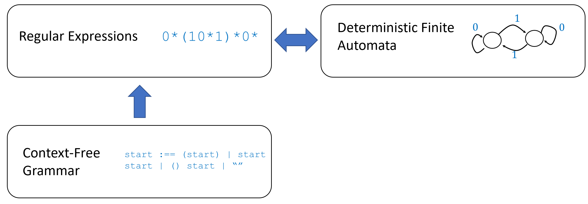

```admonish warning 
**本章施工中**
```

<!-- toc -->

# 受限计算模型 { #restrictedchap }

## 学习目标 { .objectives }
* 认识到图灵完备性并非总是好事
* 另一些总是停机的形式系统的例子: **上下文无关文法**(context-free grammars)和**简单类型λ演算**
* 非上下文无关函数(non context-free functions)的泵引理(pumping lemma)
* 正则表达式和上下文无关文法的可计算与不可计算的*语义属性*(semantic properties)示例

```admonish quote title=""
"幸福的家庭都是相似的, 不幸的家庭各有各的不幸."

*——Leo Tolstoy*(《安娜·卡列尼娜》开篇)
```

我们已经看到, 许多计算模型都是**图灵等价**的, 包括图灵机, NAND-TM/NAND-RAM程序, C/Python/JavaScript等标准编程语言, 以及$\lambda$演算乃至生命游戏等其他模型. 其反面则是, 对于所有这些模型, Rice定理([定理9.7](./chapter_9.md#thm:rice-thm))同样成立, 这意味着此类模型中程序的任何语义属性都是*不可计算*的. 

对于图灵等价模型, 停机问题及其他语义判定问题的不可计算性, 促使我们去研究**受限的计算模型**(restricted computational models). 这些模型需要满足: **(a)** 足够强大, 能够捕获对某些应用有用的一类函数; **(b)** 足够受限, 使得我们仍然能够解决其上的语义判定问题. 本章将讨论几个这样的例子. 

```admonish bigidea
{{idec}}{ide:restrictedmodel}

我们可以利用**受限的计算模型**来绕过诸如停机问题的不可计算性和Rice定理等限制. 这类模型只能计算一类受限的函数, 但至少允许我们回答程序的某些*语义问题*. 
```

```admonish pic id="restrictedmodelsoverviewfig"
 

{{pic}}{fig:restrictedmodelsoverview} 一些受限的计算模型. 我们已经见过两种等价的受限计算模型: 正则表达式(regular expressions)和确定性有限自动机(deterministic finite automata). 我们将展示一个更强大的模型: 上下文无关文法. 同时, 我们也将提供一些工具来证明某些函数无法在这些模型中被计算. 
```

## 图灵完备性之弊

我们已经看到, 看似简单的计算模型或系统可能被证明是图灵完备的. 下面[这个网页](https://goo.gl/xRXq7p)列举了若干"意外"实现图灵完备的形式系统案例, 包括本应受限的语言, 如C预处理器, CSS, (某些变体的)SQL, sendmail格局, 以及《我的世界》《超级马力欧》和卡牌游戏《万智牌》等游戏. 图灵完备性并非总是好事, 因为它意味着这类形式系统可能产生任意复杂的行为. 例如, PostScript格式(PDF的前身)本是一种用于描述打印文档的图灵完备编程语言. PostScript强大的表达能力可以用简短代码描述极其复杂的图像, 但也曾引发棘手问题——正如[该网页](http://hacking-printers.net/wiki/index.php/PostScript)所述, 攻击者既能利用无限循环实施拒绝服务攻击, 也能借此访问打印机文件系统. 

```admonish example title="DAO攻击事件" id="ethereum"
{{exam}}{exam:ethereum}

图灵完备性的陷阱的一个近期典型案例出现在加密货币[以太坊](https://www.ethereum.org/)中. 该货币的核心特点在于能够使用表现力强(特别是图灵完备)的编程语言设计"智能合约"(smart contracts). 在我们当前"人力运作"的经济体系中, Alice和Bob可以签订合约, 约定若条件X发生则共同投资查理的公​​司. 而以太坊允许双方创建合资项目: 将资金汇入由程序$P$监管的账户, 该程序决定在何种条件下拨付款项. 例如, 可以设想一段在Alice, Bob和在Bob汽车运行的程序之间交互的代码, 使得Alice能在无人干预或管理的情况下租用Bob的汽车. 

具体而言, 以太坊采用的图灵完备编程语言[Solidity](https://solidity.readthedocs.io/en/develop/index.html)具有类JavaScript语法. 其标志性实验是一个名为"去中心化自治组织"(The DAO)的项目, 旨在创建无需人类管理者, 由智能合约自主运营的去中心化风投基金, 股东可共同决策投资机会. DAO曾是历史上最成功的众筹项目, 巅峰时期市值达1.5亿美元, 占当时以太坊市场总值的10%以上. 投资DAO(或参与任何其他"智能合约")等同于将资金交由计算机程序管理, 即"代码即法律", 或用DAO的自我描述: "DAO诞生于不可篡改, 不可阻挡, 无可争议的计算机代码". 

然而(正如[第9章](./chapter_9.md)所述), 理解程序行为本质上是极其困难的. 一名黑客(亦有人称之为精明的投资者)构造了特殊输入, 使DAO代码陷入无限递归循环, 持续将资金转入其账户, [最终盗取约6000万美元](https://www.bloomberg.com/features/2017-the-ether-thief/). 虽然该交易符合智能合约代码规范而在技术层面"合法", 但显然违背了代码编写者的本意. 以太坊社区对此事件的应对陷入困境: 有人尝试"劫富济贫"式的操作, 利用相同漏洞将DAO资金转移至安全账户, 但收效甚微. 最终社区达成共识——代码必须可修正, 可中止, 可反驳. 以太坊维护者与矿工通过"硬分叉"(hard fork, 亦称作"紧急救助"bailout)方案将历史记录回滚至黑客交易发生前. 部分社区成员强烈反对该决议, 由此衍生出保留原始记录的新币种"[经典以太坊](https://ethereumclassic.github.io/)"(Ethereum Classic). 
```

## 上下文无关文法 { #seccfg }

如果你写过程序, 那么一定遇到过**语法错误**. 你可能也经历过程序陷入**无限循环**的情况. 但编译器或解释器在判断程序是否有语法错误时陷入无限循环的可能性则小得多. 

当人们设计一门编程语言时, 需要确定它的**语法**(syntax). 也就是说, 设计者要决定哪些字符串对应有效的程序, 哪些不是(即哪些字符串包含语法错误). 为了确保编译器或解释器在检查语法错误时总能停机, 语言设计者**通常不会**使用图灵完备的通用机制来表达语法, 而是采用一种受限的计算模型. 其中最常见的模型之一就是**上下文无关文法**. 

为了解释上下文无关文法, 让我们从一个经典例子开始. 考虑函数$\text{ARITH}: \Sigma^* \rightarrow \{0,1\}$, 它以字母表$\Sigma =\{ (,),+,-,\times,\div,0,1,2,3,4,5,6,7,8,9\}$上的字符串$x$作为输入, 当且仅当字符串$x$表示一个有效的算术表达式时返回$1$. 直观上, 我们通过将$+$, $-$, $\times$或$\div$等运算作用于较小的表达式, 或者用括号将其括起来, 来构建表达式, 其中"基本情况"对应那些只是数字的表达式. 更精确地说, 我们可以作出以下定义: 

* 一个**数字**是符号$0,1,2,3,4,5,6,7,8,9$之一. 
* 一个**数**是一个数字序列. (为简化起见, 我们忽略了序列不能有前导零的条件, 尽管在上下文无关文法中编码此条件也不难)
* 一个**运算符**是 $+,-,\times,\div$之一. 
* 一个表达式的形式可以是"数", "子表达式1 运算符 子表达式2"或"(子表达式1)", 其中"子表达式1"和"子表达式2"本身也是表达式. (注意, 这是一个**递归**定义)

上下文无关文法(CFG)是表达此类条件的一种形式化方法. CFG由一组规则构成, 这些规则告诉我们如何从较小的组成部分生成字符串. 在上面的例子中, 其中一条规则是"如果$\text{exp1}$和$\text{exp2}$是有效表达式, 那么$\text{exp1} \times \text{exp2}$也是有效表达式"；我们也可以使用简写$\text{expression} \; \Rightarrow \; \text{expression} \; \times \; \text{expression}$来书写这条规则. 正如上例所示, 上下文无关文法的规则通常是递归的: 规则$\text{expression} \; \Rightarrow\; \text{expression} \; \times \; \text{expression}$使用其自身来定义有效表达式. 我们现在正式定义上下文无关文法: 

```admonish quote title=""
{{defc}}{def:defcfg}[上下文无关文法]

设$\Sigma$为某个有限集合. $\Sigma$上的**上下文无关文法**(CFG) 是一个三元组$(V, R, s)$, 满足: 

* $V$称为**变量集合**(variables), 是一个与$\Sigma$不相交的集合. 
* $s \in V$称为**起始变量**(initial variable). 
* $R$是**规则**(rule)的集合. 每条规则是一个有序对$(v, z)$, 其中$v \in V$且$z \in (\Sigma \cup V)^*$. 我们通常将规则$(v, z)$写为$v \Rightarrow z$, 并称字符串$z$可以由变量$v$**导出**(derive). 
```

```admonish example title="算术表达式的上下文无关文法" id="cfgarithmeticex"
{{exam}}{exam:cfgarithmeticex}

上述良构的算术表达式的例子, 可以通过以下上下文无关文法形式化地描述: 

* 字母表$\Sigma$是$\{ (,),+,-,\times,\div,0,1,2,3,4,5,6,7,8,9 \}$. 
* 变量集合为$V = \{ \text{expression} \;,\; \text{number} \;,\; \text{digit} \;,\; \text{operation} \}$. 
* 规则集合$R$包含以下$19$条规则: 
    - $4$条关于运算符的规则: $\text{operation} \Rightarrow +$, $\text{operation} \Rightarrow -$, $\text{operation} \Rightarrow \times$, $\text{operation} \Rightarrow \div$. 
    - $10$条关于数字的规则: $\text{digit} \Rightarrow 0$, $\ldots$, $\text{digit} \Rightarrow 9$. 
    - 规则$\text{number} \Rightarrow \text{digit}$. 
    - 规则$\text{number} \Rightarrow \text{digit}\; \text{number}$. 
    - 规则$\text{expression} \Rightarrow \text{number}$. 
    - 规则$\text{expression} \Rightarrow \text{expression} \; \text{operation} \; \text{expression}$. 
    - 规则$\text{expression} \Rightarrow (\text{expression})$. 
* 起始变量是$\text{expression}$. 
```

人们使用许多不同的记法来书写上下文无关文法. 最常见的记法之一是[Backus-Naur范式](https://goo.gl/R4qZji)(BNF). 在这种记法中, 我们将$v \Rightarrow a$(其中$v$是变量, $a$是字符串)形式的规则写为`<v> := a`. 如果我们有$v \mapsto a$, $v \mapsto b$, $v \mapsto c$等多条规则, 则可以将它们合并为`<v> := a|b|c`. (换句话说, 我们称$v$可以导出出$a$, $b$或$c$)例如, [示例10.2](#cfgarithmeticex)的上下文无关文法的Backus-Naur描述如下(使用ASCII字符表示运算符): 

```python
operation  := +|-|*|/
digit      := 0|1|2|3|4|5|6|7|8|9
number     := digit|digit number
expression := number|expression operation expression|(expression)
```

上下文无关文法的另一个例子是"匹配括号"文法, 它可以用Backus-Naur范式表示如下: 

```python
match  := ""|match match|(match)
``` 

当且仅当一个由字母表$\{(,)\}$构成的字符串(其中`match`是起始表达式, `""`对应空字符串)可以由该文法生成时, 它才由一组匹配的括号组成. 相反, 根据[引理6.2](./chapter_6.md#lem:regexpparn), 不存在这样的正则表达式: 它能匹配字符串$x$当且仅当$x$包含一个有效的匹配括号序列. 

### 作为计算模型的上下文无关文法

我们可以将字母表$\Sigma$上的上下文无关文法视为定义了一个函数, 该函数根据字符串$x$是否能由文法规则生成, 将$\Sigma^*$中的每个字符串$x$映射为$1$或$0$. 现在我们将此定义形式化. 

```admonish quote title=""
{{defc}}{def:CFGderive}[从文法导出字符串]

若$G=(V,R,s)$是$\Sigma$上的一个上下文无关文法, 则对于两个字符串$\alpha,\beta \in (\Sigma \cup V)^*$, 如果我们可以通过应用$G$的一条规则从$\alpha$得到$\beta$, 则称$\beta$可从$\alpha$**一步导出**(derived in one step), 记作$\alpha \Rightarrow_G \beta$. 也就是说, 我们通过将$\alpha$中一个变量$v$的出现替换为字符串$z$来得到$\beta$, 其中$v \Rightarrow z$是$G$的一条规则. 

如果$\beta$可以通过有限步数$k$从$\alpha$导出, 则称$\beta$可从$\alpha$**导出**(derive), 记作$\alpha \Rightarrow_G^* \beta$. 也就是说, 如果存在$\alpha_1,\ldots,\alpha_{k-1} \in (\Sigma \cup V)^*$, 使得$\alpha \Rightarrow_G \alpha_1 \Rightarrow_G \alpha_2 \Rightarrow_G \cdots \Rightarrow_G \alpha_{k-1} \Rightarrow_G \beta$. 

如果$x$可以从起始变量$s$导出(即如果$s \Rightarrow_G^* x$), 则称$x\in \Sigma^*$被$G=(V,R,s)$**匹配**(matched). 我们将由$(V,R,s)$**计算的函数**定义为映射$\Phi_{V,R,s}:\Sigma^* \rightarrow \{0,1\}$, 使得$\Phi_{V,R,s}(x)=1$当且仅当$x$被$(V,R,s)$匹配. 如果对于某个CFG$(V,R,s)$有$F = \Phi_{V,R,s}$, 则函数$F:\Sigma^* \rightarrow \{0,1\}$是**上下文无关**(context free)的. {{footnote: 如同[定义6.3](./chapter_6.md#def:matchingregexp)的情况, 我们也可以使用语言而非函数记法, 并说一个语言$L \subseteq \Sigma^*$是 **上下文无关** 的, 当且仅当满足$F(x)=1$当且仅当$x\in L$的函数$F$是上下文无关的.}}
```

先验地看, 映射$\Phi_{V,R,s}$是否可计算可能并不明显, 但事实确实如此. 

```admonish quote title=""
{{thmc}}{thm:CFGhalt}[上下文无关文法总是可判定的]

对于$\{0,1\}$上的每个CFG$(V,R,s)$, 函数$\Phi_{V,R,s}:\{0,1\}^* \rightarrow \{0,1\}$是可计算的. 
```

与往常一样, 我们只关注$\{0,1\}$上的文法, 尽管下列证明可以推广到任何有限字母表$\Sigma$. 

```admonish proof collapsible=true title="{{ref:thm:CFGhalt}}的证明"
我们仅概述证明. 首先观察到, 我们可以将每个CFG转换为等价的*Chomsky范式*, 其中所有规则要么具有$u \rightarrow vw$的形式($u,v,w$为变量), 要么具有$u \rightarrow \sigma$的形式($u$为变量, $\sigma \in \Sigma$), 另外可能还有规则$s \rightarrow ""$, 其中$s$是起始变量. 

这种转换背后的思想是简单地根据需要添加新变量, 例如, 我们可以将$v \rightarrow u\sigma w$这样的规则转换为三条规则: $v \rightarrow ur$, $r \rightarrow tw$和$t \rightarrow \sigma$. 

使用Chomsky范式, 我们得到一个自然的递归算法, 用于计算对于给定的文法$G$和字符串$x$, 是否有$s \Rightarrow_G^* x$. 我们只需尝试所有可能作为该导出中使用的第一条规则$s \rightarrow uv$的猜测, 然后尝试所有可能将$x$划分为连接$x=x'x''$的方式. 如果我们正确地猜测了规则和划分, 那么我们的任务就简化为检查是否$u \Rightarrow_G^* x'$和$v \Rightarrow_G^* x''$, 这(由于涉及更短的字符串)可以通过递归完成. 基本情况是当$x$为空或单个符号时, 可以轻松处理. 
```

```admonish info
{{remc}}{rem:parsetreesrem}[解析树]

虽然我们专注于**判定**CFG是否匹配字符串这一任务, 但计算$\Phi_{V,R,s}$的算法实际上提供了比这更多的信息. 也就是说, 在输入字符串$x$时, 如果$\Phi_{V,R,s}(x)=1$, 则算法会生成可以从起始顶点$s$应用以获得最终字符串$x$的规则序列. 我们可以将这些规则视为确定了一棵**树**, 其中$s$是**根顶点**, 而**汇点**(或**叶子**)对应于通过那些第二个元素中不含变量的规则获得的$x$的子串. 这棵树被称为$x$的**解析树**(parse tree), 通常能提供关于$x$结构的非常有用的信息. 

编程语言的编译器或解释器的第一步通常是**解析器**(parser), 它将源代码转换为解析树(也称为[抽象语法树](https://en.wikipedia.org/wiki/Abstract_syntax_tree)(abstract syntax tree)). 也有一些工具可以自动将上下文无关文法的描述转换为能计算给定字符串解析树的解析器算法. (事实上, 上述递归算法可用于实现此目的, 但存在更高效的版本, 特别是对于具有[特定形式](https://en.wikipedia.org/wiki/LR_parser)的文法, 而编程语言设计者通常会努力确保其语言具有这些更高效的文法)
```

### 上下文无关文法的表达能力

上下文无关文法可以描述所有正则表达式: 

```admonish quote title=""
{{thmc}}{thm:CFGreg}[上下文无关文法与正则表达式]

设$e$为定义在字母表$\{0,1\}$上的正则表达式, 则存在一个定义在$\{0,1\}$上的上下文无关文法$(V,R,s)$, 使得$\Phi_{V,R,s}=\Phi_{e}$. 
```

```admonish proof collapsible=true title="{{ref:thm:CFGreg}}的证明"
我们通过对正则表达式$e$的长度进行归纳来证明此定理. 如果$e$是长度为1的表达式, 则$e=0$或$e=1$. 在这种情况下, 存在一个(平凡的)CFG可以计算它, 我们将其留给读者验证. 否则, 我们将落入以下三种情况之一: 

* **情况1**: $e = e'e''$, 
* **情况2**: $e = e'|e''$
* **情况3**: $e=(e')^*$. 

在所有这些情况下, $e'$和$e''$都是更短的正则表达式. 根据归纳假设, 我们可以分别定义计算$\Phi_{e'}$和 $\Phi_{e''}$的文法$(V',R',s')$和$(V'',R'',s'')$. 通过重命名变量, 我们也可以不失一般性地假设$V'$和$V''$是不相交的. 

在情况1中, 我们可以按如下方式定义新文法: 添加一个新的起始变量$s \not\in V' \cup V''$以及规则$s \mapsto s's''$. 在情况2中, 我们可以按如下方式定义新文法: 添加一个新的起始变量$s \not\in V' \cup V''$以及规则$s \mapsto s'$和$s \mapsto s''$. 情况3是唯一使用递归的情况. 和前面一样, 我们添加一个新的起始变量$s \not\in V' \cup V''$, 但现在添加规则$s \mapsto ""$(即空字符串), 并且对于$R'$中每一条形式为$(s',\alpha)$的规则, 将规则$s \mapsto s\alpha$添加到$R$中. 

我们将其作为(一个非常好的!)练习留给读者, 去验证在所有三种情况下, 我们生成的文法所描述的语言与原正则表达式描述的语言相同. 
```

事实证明, 上下文无关文法严格比正则表达式更强大. 特别地, 正如我们所见, "匹配括号"函数$\text{MATCHPAREN}$可以由一个上下文无关文法计算, 而根据[引理6.2](./chapter_6.md#lem:regexpparn), 它不能由正则表达式计算. 下面是另一个例子: 

```admonish question
{{exec}}{exe:reversedstringcfg}[回文的上下文无关文法]

令$PAL:{0,1,;}^* \rightarrow \{0,1\}$为在[练习6.4](./chapter_6.md#exe:palindromenotreg)中定义的函数, 其中当且仅当$w$具有形式$u;u^R$时, $PAL(w)=1$. 
那么$PAL$可以由一个上下文无关文法计算. 
```

```admonish solution collapsible=true title="对{{ref:exe:reversedstringcfg}}的解答"
可以使用Backus-Naur范式描述一个计算$PAL$的简单文法: 

~~~python
start      := ; | 0 start 0 | 1 start 1
~~~

可以通过归纳法证明, 该文法生成的恰好是满足$PAL(w)=1$的字符串$w$. 
```

一个更有趣的例子是计算那些形式为 $u;v$但不是回文的字符串: 

```admonish question
{{exec}}{exe:nonpalindrome}[非回文的上下文无关文法]

证明存在一个上下文无关文法可以计算$NPAL:\{0,1,;\}^* \rightarrow \{0,1\}$, 其中当$w=u;v$但$v \neq u^R$时, $NPAL(w)=1$. 
```

```admonish solution collapsible=true title="对{{ref:exe:nonpalindrome}}的解答"
使用Backus-Naur范式, 我们可以将这样的文法描述如下: 

~~~python
palindrome      := ; | 0 palindrome 0 | 1 palindrome 1
different       := 0 palindrome 1 | 1 palindrome 0
start           := different | 0 start | 1 start | start 0 | start 1
~~~

换句话说, 这意味着我们可以将满足$NPAL(w)=1$的字符串$w$描述为具有以下形式: 

$$
w = \alpha b u ; u^R b' \beta
$$

其中$\alpha,\beta,u$是任意字符串, 且$b \neq b'$. 因此, 我们可以先生成一个回文$u; u^R$(通过`palindrome`变量), 然后在左边或右边添加$0$, 并在对侧添加$1$, 从而得到一个非回文(通过`different`变量), 接着我们可以在任一端添加任意数量的$0$和$1$(通过`start`变量). 
```

### 上下文无关文法的局限性(可选)

尽管上下文无关文法比正则表达式更强大, 但仍有一些简单语言**无法**被上下文无关文法描述. 证明这一点的一个工具是"泵引理"的上下文无关文法版本(另见[定理6.8](./chapter_6.md#thm:pumping)): 

```admonish quote title=""
{{thmc}}{thm:cfgpumping}[上下文无关泵引理]

设$(V,R,s)$是字母表$\Sigma$上的一个CFG, 则存在某些数$n_0,n_1 \in \N$, 使得对于每个满足$|x|>n_0$的$x \in \Sigma^*$, 如果$\Phi_{V,R,s}(x)=1$, 那么$x=abcde$, 其中$|b|+|c|+|d| \leq n_1$, $|b|+|d| \geq 1$, 并且对于每个$k\in \N$, 都有$\Phi_{V,R,s}(ab^kcd^ke)=1$. 
```

```admonish pause title="暂停一下"
上下文无关泵引理的陈述比其正则版本更为繁琐, 但你可以这样理解: **"如果一个足够长的字符串能被某个文法匹配, 那么在推导过程中必然有某个变量被重复使用."**
```

```admonish proof collapsible=true title="{{ref:thm:cfgpumping}}的证明"
我们只概述证明思路. 其思想是: 如果文法规则中的符号总数为$n_0$, 那么要得到满足$|x|>n_0$且$\Phi_{V,R,s}(x)=1$的$x$, 唯一的方法就是使用*递归*. 也就是说, 必须存在某个变量$v \in V$, 使得我们能够从$v$推导出形如$bvd$的串(其中$b,d \in \Sigma^$), 并且随后还能从$v$推导出某个串$c\in \Sigma^$, 使得$bcd$是$x$的一个子串(换句话说, 对于某些$a,e \in \{0,1\}^*$, 有$x=abcde$). 如果我们选择满足此要求且推导步骤数最少的变量$v$, 那么可以确保$|bcd|$至多是某个依赖于$n_0$的常数, 我们可以设$n_1$为该常数($n_1=10 \cdot |R| \cdot n_0$即可, 因为我们最多需要$|R|$次规则应用, 而每次这样的应用最多能将字符串增长$n_0$个符号). 

因此, 根据文法的定义, 我们可以重复推导过程, 将$x$中的子串$bcd$替换为$b^kcd^k$(对于每个$k\in \N$), 同时保持$\Phi_{V,R,s}$的输出仍为1. 由于$bcd$是$x$的子串, 我们可以记$x=abcde$, 并保证对于每个$k$, $ab^kcd^ke$都能被该文法匹配. 
```

利用{{ref:thm:cfgpumping}}, 我们可以证明即使是下面定义的简单函数$F:\{0,1\}^* \rightarrow \{0,1\}$: 
$$F(x) = \begin{cases}1 & x =ww \text{ for some } w\in \{0,1\}^* \\ 0 & \text{otherwise} \end{cases}$$
也不是上下文无关的. (相比之下, 函数$G:\{0,1\}^* \rightarrow \{0,1\}$定义为: $G(x)=1$当且仅当对于某个$w\in \{0,1\}^*$和$n=|w|$, 有$x=w_0w_1\cdots w_{n-1}w_{n-1}w_{n-2}\cdots w_0$, 这个函数是上下文无关的. 你能否看出原因?)

```admonish question
{{exec}}{exe:equalisnotcfg}[等值函数不是上下文无关的]

设$\text{EQ}:{0,1,;}^* \rightarrow \{0,1\}$为满足以下条件的函数: 当且仅当$x=u;u$(对于某个$u\in \{0,1\}^*$)时, $\text{EQ}(x)=1$. 那么$\text{EQ}$不是上下文无关的. 
```

```admonish solution collapsible=true title="对{{ref:exe:equalisnotcfg}}的解答"
我们使用上下文无关泵引理. 为了推导矛盾, 假设存在一个计算$\text{EQ}$的文法$G$, 并令$n_0$为从{{ref:thm:cfgpumping}}中得到的常数. 

考虑字符串$x= 1^{n_0}0^{n_0};1^{n_0}0^{n_0}$, 并根据{{ref:thm:cfgpumping}}将其写作$x=abcde$, 其中$|bcd| \leq n_0$且$|b|+|d| \geq 1$. 根据{{ref:thm:cfgpumping}}, 应有$\text{EQ}(ace)=1$. 然而, 通过案例分析可以证明这是一个矛盾. 

首先, 除非$b$位于分号$; $分隔符的左侧且$d$位于右侧, 否则去掉$b$和$d$必定会使两个部分变得不同. 但如果$b$确实在左侧而$d$在右侧, 那么由条件$|bcd| \leq n_0$可知, $b$是仅由0组成的串, 而$d$是仅由1组成的串. 如果我们去掉$b$和$d$, 由于其中至少一个非空, 我们会得到: 要么左侧的0比右侧少, 要么右侧的1比左侧少. 无论哪种情况, 都有$\text{EQ}(ace)=0$, 从而得出所需的矛盾. 
```

## 上下文无关语言的语义性质

与正则表达式的情况类似, 上下文无关文法的局限性确实带来某些优势. 例如, 上下文无关文法的空性问题是可判定的: 

```admonish quote title=""
{{thmc}}{thm:cfgemptinessthem}[上下文无关文法的空性的可判定性]

存在一种算法, 当输入一个上下文无关文法$G$时, 当且仅当$\Phi_G$是恒零函数, 该算法输出$1$. 
```

```admonish proof collapsible=true title="{{ref:thm:cfgemptinessthem}}的证明思路"
若将文法转换为{{ref:thm:CFGhalt}}中的乔姆斯基范式, 则证明更易理解. 给定文法$G$, 我们可以递归地定义一个非终结符变量$v$为**非空**, 如果存在形如$v \Rightarrow \sigma$的规则, 或者存在形如$v \Rightarrow uw$的规则, 其中$u$和$w$均为非空. 则该文法非空当且仅当起始变量$s$非空. 
```

```admonish proof collapsible=true title="{{ref:thm:cfgemptinessthem}}的证明"
假设文法$G$为{{ref:thm:CFGhalt}}中的乔姆斯基范式. 我们考虑以下将变量标记为“非空”的过程: 

1. 首先, 将所有涉及形如$v \Rightarrow \sigma$规则的变量$v$标记为非空. 
2. 随后, 若变量$v$涉及形如$v \Rightarrow uw$的规则, 且$u$和$w$已被标记过, 则继续将$v$标记为非空. 

重复此过程, 直到无法再标记任何变量. 此时, 当且仅当$s$未被标记, 我们判定该文法为空. 要理解该算法的有效性, 请注意: 若变量$v$被标记为“非空”, 则存在某个字符串$\alpha\in \Sigma^*$可从$v$推导出. 反之, 若$v$未被标记, 则从$v$出发的每个推导序列始终包含未被字母表符号替换的变量. 因此, 特别地, 当且仅当起始变量$s$未被标记为“非空”时, $\Phi_G$是恒零函数. 
```

### 上下文无关文法等价性的不可计算性(选读)

与正则表达式类比, 人们曾希望找到一种算法, 用于判定两个给定的上下文无关文法是否等价. 但遗憾的是, 我们并没有这样的好运. 事实证明, 上下文无关文法的等价性问题是不可计算的. 这是以下定理的直接推论: 

```admonish quote title=""
{{thmc}}{thm:fullnesscfgdef}[上下文无关文法的满性的不可判定性]

对于每个集合$\Sigma$, 令$\text{CFGFULL}_\Sigma$为一个函数, 其输入是字母表$\Sigma$上的一个上下文无关文法$G$, 当且仅当$G$计算常值$1$函数时, 输出$1$. 那么存在某个有限字母表$\Sigma$, 使得$\text{CFGFULL}_\Sigma$是不可计算的. 
```

{{ref:thm:fullnesscfgdef}} 立即意味着上下文无关文法的等价性是不可计算的, 因为在某个字母表$\Sigma = \{\sigma_0,\ldots,\sigma_{k-1} \}$上计算文法$G$的"满性", 就对应于检查$G$是否等价于文法$s \Rightarrow ""|s\sigma_0|\cdots|s\sigma_{k-1}$. 请注意, {{ref:thm:fullnesscfgdef}}和{{ref:thm:cfgemptinessthem}}一起意味着, 与正则表达式不同, 上下文无关文法在补集运算下*不*封闭. (你能看出原因吗?)由于我们可以用$\ceil{\log |\Sigma|}$位来编码$\Sigma$中的每个元素(并且这种有限编码可以很容易地在文法中实现), {{ref:thm:fullnesscfgdef}}意味着, 对于二进制字母表上的文法, 满性同样是不可计算的. 

```admonish proof collapsible=true title="{{ref:thm:fullnesscfgdef}}的证明思路"
我们通过从停机问题归约来证明该定理. 为此, 我们使用NAND-TM程序的**格局**这一概念, 如[定义8.3](./chapter_8.md#def:configtmdef)所定义. 回想一下, 程序$P$的**格局**是一个二进制字符串$s$, 它编码了当前迭代中关于程序的所有信息. 

我们定义$\Sigma$为$\{0,1\}$加上一些分隔符字符, 并定义$\text{INVALID}_P:\Sigma^* \rightarrow \{0,1\}$为一个函数, 当且仅当字符串$L\in \Sigma^*$所编码的格局序列**不**对应于程序$P$在空输入上的有效停机计算历史时, 该函数将$L$映射到$1$. 

证明的核心在于证明$\text{INVALID}_P$是上下文无关的. 一旦我们证明了这一点, 我们就能看到$P$在空输入上停机, 当且仅当对**所有**$L$都有$\text{INVALID}_P(L)=1$. 为了证明这一点, 我们将以一种特殊的方式对列表进行编码, 这种方式使其适合通过上下文无关文法进行判定. 具体来说, 我们将反转所有奇数编号的字符串. 
```

```admonish proof collapsible=true title="{{ref:thm:fullnesscfgdef}}的证明"
我们只概述证明思路. 我们将证明, 如果我们能够计算$\text{CFGFULL}$, 那么我们就可以解决$\text{HALTONZERO}$, 而[定理9.4](./chapter_9.md#thm:haltonzero-thm)已证明$\text{HALTONZERO}$是不可计算的. 令$M$为$\text{HALTONZERO}$的一个输入图灵机. 我们将使用图灵机**格局**的概念, 如[定义8.3](./chapter_8.md#def:configtmdef)所定义. 

回想一下, 图灵机$M$和输入$x$的**格局**捕捉了$M$在计算的某个时间点的完整状态. 格局的具体细节并不那么重要, 但你需要记住的是: 

* 格局可以由一个二进制字符串$\sigma \in \{0,1\}^*$编码. 
* $M$在输入$0$上的**初始**格局是某个固定的字符串. 
* **停机格局**(halting configuration)会将其某个状态(可以很容易地从中"读出")的值设置为 $1$. 
* 如果$\sigma$是计算中某一步$i$的格局, 我们用$\text{NEXT}_M(\sigma)$表示下一步的格局. 

$\text{NEXT}_M(\sigma)$是一个字符串, 它在除了常数个坐标(那些编码对应读写头位置及相邻两个位置的坐标)外的所有坐标上都与$\sigma$一致. 在这些坐标上, $\text{NEXT}_M(\sigma)$的值可以通过某个有限函数计算. 

我们令字母表$\Sigma = \{0,1\} \cup \{ \| , \# \}$. $M$在输入$0$上的**计算历史**(computation history)是一个字符串$L\in \Sigma^*$, 它对应于一个列表$\| \sigma_0 \# \sigma_1 \| \sigma_2 \# \sigma_3 \cdots \sigma_{t-2} \| \sigma_{t-1} \#$(即, $\|$出现在偶数编号块之前, $\#$出现在奇数编号块之前), 其中, 如果$i$是偶数, 则$\sigma_i$是编码$P$在第$i$次迭代开始时在输入$0$上的格局的字符串；如果$i$是奇数, 则情况相同, 只是字符串被*反转*了. (也就是说, 对于奇数$i$, $rev(\sigma_i)$编码了$P$在第$i$次迭代开始时在输入$0$上的格局)反转奇数编号块是一种技术技巧, 以确保我们在下面定义的函数$\text{INVALID}_M$是上下文无关的. 

我们现在定义$\text{INVALID}_M:\Sigma^* \rightarrow \{0,1\}$如下: 

$$\text{INVALID}_M(L) = \begin{cases}0 & \text{$L$是$M$在$0$上的有效计算历史} \\
                            1 & \text{否则} \end{cases}
$$

我们将证明以下断言: 

**断言:** $\text{INVALID}_M$是上下文无关的. 

该断言蕴含了定理. 由于$M$在$0$上停机当且仅当存在一个有效的计算历史, 所以$\text{INVALID}_M$是常值1函数当且仅当$M$在$0$上**不**停机. 特别地, 这使我们能够将判定$M$是否在$0$上停机, 归约为判定对应于$\text{INVALID}_M$的文法$G_M$是否完全. 

我们现在转向该断言的证明. 我们不会展示所有细节, 但要点是: 如果**至少满足**以下三个条件之一, 则$\text{INVALID}_M(L)=1$: 

1. $L$的格式不正确, 即其形式不是$\langle \text{二进制字符串} \rangle \#  \langle \text{二进制字符串} \rangle \| \langle \text{二进制字符串} \rangle \# \cdots$. 
2. $L$包含一个形如$\| \sigma \# \sigma' \|$的子串, 使得$\sigma' \neq rev(\text{NEXT}_P(\sigma))$. 
3. $L$包含一个形如$\# \sigma \| \sigma' \#$的子串, 使得$\sigma' \neq \text{NEXT}_P(rev(\sigma))$. 

由于上下文无关函数在OR运算下封闭, 如果我们能证明可以通过上下文无关文法验证条件1, 2和3, 那么该断言即成立. 

对于条件1, 这非常简单: 检查$L$**是**正确格式可以使用正则表达式完成. 由于正则表达式在否定运算下封闭, 这意味着检查$L$**不是**这种格式也可以用正则表达式完成, 因此也可以用上下文无关文法完成. 

对于条件2和3, 其推理过程与证明"使得$F(u\#v)=1$当且仅当$u \neq rev(v)$的函数$F$是上下文无关的"非常相似, 参见{{ref:exe:nonpalindrome}}. 毕竟, $\text{NEXT}_M$函数只在其输入的常数个位置上进行修改. 我们将把补充细节的工作作为练习留给读者. 由于$\text{INVALID}_M(L)=1$当且仅当$L$满足条件1, 2或3之一, 并且所有这三个条件都可以通过上下文无关文法进行测试, 这就完成了该断言以及定理的证明. 
```

## 正则表达式与上下文无关文法的语义特性总结

总而言之, 我们通常可以在模型的**表达能力**与**分析的易处理性**之间进行权衡. 若考虑非图灵完备的计算模型, 则有时能够规避Rice定理, 并回答关于此类模型中程序的某些语义问题. 以下是对我们已探讨的不同模型在语义问题方面已知结论的总结. 

| 计算模型       | 停机问题 | 空性     | 等价性   |
| -------------- | -------- | -------- | -------- |
| 正则表达式     | 可计算   | 可计算   | 可计算   |
| 上下文无关文法 | 可计算   | 可计算   | 不可计算 |
| 图灵完备模型   | 不可计算 | 不可计算 | 不可计算 |

```admonish hint title="本章回顾"
* 通用模型下停机问题的不可计算性, 促使我们定义受限的计算模型. 
* 在某些受限模型中, 我们可以回答诸如以下**语义**问题: 给定程序是否会终止? 两个程序是否计算相同的函数? 
* **正则表达式**是一种受限的计算模型, 常用于描述字符串匹配任务. 我们可以高效地判断表达式是否匹配某个字符串, 并能解决停机问题和等价性问题. 
* **上下文无关文法**是一种表达能力更强、但仍非图灵完备的计算模型. 其停机问题是可判定的, 但等价性判定不可计算. 
```

## 习题

```admonish question title=""
{{proc}}{pro:closurecfgex}[上下文无关函数的闭包性质]

假设$F, G: \{0,1\}^* \rightarrow\{0,1\}$是上下文无关函数. 对于以下每个函数$H$的定义, 要么证明$H$总是上下文无关的, 要么针对正则函数$F, G$给出一个使$H$不是上下文无关的反例. 

1. $H(x) = F(x) \vee G(x)$. 
2. $H(x) = F(x) \wedge G(x)$. 
3. $H(x) = NAND(F(x), G(x))$.  (NAND的真值表: 当且仅当输入不全为1时输出0)
4. $H(x) = F(x^R)$, 其中$x^R$是$x$的反转: 对于$n=|x|$, 有$x^R = x_{n-1}x_{n-2} \cdots x_0$. 
5. $H(x) = \begin{cases}1 & \text{存在 } x=uv \text{ 使得 } F(u)=G(v)=1 \\ 0 & \text{否则} \end{cases}$
6. $H(x) = \begin{cases}1 & \text{存在 } x=uu \text{ 使得 } F(u)=G(u)=1 \\ 0 & \text{否则} \end{cases}$
7. $H(x) = \begin{cases}1 & \text{存在 } x=uu^R \text{ 使得 } F(u)=G(u)=1 \\ 0 & \text{否则} \end{cases}$
```

```admonish question title=""
{{proc}}{pro:noncontextfreeex}

证明函数$F: \{0,1\}^* \rightarrow \{0,1\}$不是上下文无关的, 其中$F(x)=1$当且仅当$|x|$是2的幂. 
```

```admonish question title=""
{{proc}}{pro:proglanguagecfgex}[编程语言的语法]

考虑以下一种"编程语言"的语法, 其源代码可以使用[ASCII字符集](https://en.wikipedia.org/wiki/ASCII)书写: 

* **变量**由字母、数字和下划线序列构成, 但不能以数字开头. 
* **语句**有两种形式: 一种是`foo = bar;`, 其中`foo`和`bar`是变量；另一种是`IF (foo) BEGIN ... END`, 其中`...`是一个或多个语句的列表, 语句间可以用换行符分隔. 

我们语言中的**程序**就是一个语句序列(语句间可以用换行符或空格分隔). 

1. 令$\text{VAR}: \{0,1\}^* \rightarrow \{0,1\}$为这样一个函数: 给定字符串$x \in \{0,1\}^*$, 当且仅当$x$对应于一个有效变量标识符的ASCII编码时输出$1$. 证明$\text{VAR}$是正则的. 
2. 令$\text{SYN}: \{0,1\}^* \rightarrow \{0,1\}$为这样一个函数: 给定字符串$s \in \{0,1\}^*$, 当且仅当$s$是我们语言中一个有效程序的ASCII编码时输出$1$. 证明$\text{SYN}$是上下文无关的. (你无需为$\text{SYN}$指定完整的正式文法, 但需要证明这样的文法存在. )
3. 证明$\text{SYN}$不是正则的. 提示见脚注{{footnote: 尝试观察是否可以用某种方式在$\text{SYN}$中"嵌入"一个看起来类似于$MATCHPAREN$的函数, 从而可以使用类似的证明方法. 当然, 一个函数是非正则的, 并不一定需要使用字面上的括号符号.}}. 
```

## 参考书目

与正则表达式的情况类似, 有大量资料对上下文无关文法进行了详细探讨. ([Sipser, 1997](https://scholar.google.com/scholar?hl=en&q=Sipser+Introduction+to+the+theory+of+computation))的第二章包含许多上下文无关文法示例及其性质. 此外, 还存在如[Grammophone](https://mdaines.github.io/grammophone/)这类网站, 允许用户输入文法并观察其生成的字符串及其满足的某些性质. 

“上下文无关”这一形容词用于描述CFG, 是因为形式为$v \mapsto a$的规则意味着我们可以**始终**将$v$替换为字符串$a$, 无论$v$出现在何种**上下文**中. 更一般地, 我们可能需要考虑替换规则依赖于上下文的情况, 这便引出了**一般文法**(又称“0型文法”, Type 0 grammar)的概念, 它允许形式为$a \Rightarrow b$的规则, 其中$a$和$b$均为$(V \cup \Sigma)^*$上的字符串. 其思想是, 举例来说, 如果我们希望强制规定仅在$v$两侧均被三个零包围时才应用诸如$v \mapsto 0w1$的规则, 则可通过添加$000v000 \mapsto 0000w1000$形式的规则来实现(当然, 我们还可添加更一般的条件). 然而, 这种通用性是有代价的——一般文法是图灵完备的, 因此其停机问题是不可判定的. 也就是说, 不存在一种算法$A$, 能够对每个一般文法$G$和字符串$x$判定文法$G$是否生成$x$. 

[Chomsky层级](https://en.wikipedia.org/wiki/Chomsky_hierarchy)是一个文法层级结构, 从限制最弱(能力最强)的0型文法(对应于递归可枚举语言, 参见[练习9.10](./chapter_9.md#pro:recursiveenumerableex)), 到限制最强的3型文法(对应于正则语言). 上下文无关语言对应于2型文法, 而1型文法即**上下文有关文法**. 这类文法比上下文无关文法能力更强, 但仍弱于图灵机. 具体而言, 对应于上下文有关文法的函数/语言总是可计算的, 且实际上可由[线性有界自动机](https://en.wikipedia.org/wiki/Linear_bounded_automaton)(linear bounded automaton)计算——这是一种占用$O(n)$空间的非确定性算法. 因此, 对应于上下文有关文法的函数/语言类也被称为复杂度类$\mathbf{NSPACE}O(n)$(我们将在[第17章](./chapter_17.md)讨论空间有界复杂度). 虽然Rice定理意味着我们无法计算0型文法的任何非平凡语义性质, 但对于其他类型的文法, 情况则更为复杂: 某些语义性质可判定, 某些则不可判定, 具体取决于文法在层级中的位置. 