```admonish warning 
**本章施工中**
```

# 运行时间建模 { #chapmodelruntime }

## 学习目标
* 形式化的建模程序的运行时间, 特别是诸如 $O(n)$ 或 $O(n^3)$ 时间算法的概念 \
* 分别对多项式时间和指数时间进行建模的复杂性类 $\mathbf{P}$ 和 $\mathbf{EXP}$.  \
* 了解时间层级定理, 即对于任意 $k \geq 1$ 都存在我们可以在 $O(n^{k+1})$ 时间计算但不能在 $O(n^k)$ 时间计算的函数. 
* 代表非一致性计算 $\mathbf{P_{/poly}}$ 的复杂性类, 及 $\mathbf{P} \subseteq \mathbf{P_{/poly}}$ 这一结论. 

```admonish quote
当问题规模的度量标准合理, 且当规模取值任意大时, 对算法难度的阶进行渐近估计在理论上具有重要意义. 这种估计无法被操纵——即无法通过人为地使算法在较小规模下变得困难而扭曲结果. 

*-杰克·埃德蒙兹, "Paths, Trees, and Flowers", 1963.*
```

```admonish quote
*马克斯·纽曼*: “声称机器‘能够’做这做那固然很好, 但是……它做这些事情究竟需要花费多少时间呢？”

*艾伦·图灵*: “在我看来, 这个时间因素正是所有真正的技术难点所在. ”

*-BBC 广播座谈节目 "我们可以说计算机会思考吗？", 1952.*
```

在 [第12章](chapter_12.md) 中, 我们介绍了一些高效的算法, 并且对他们的运行时间做了一些假设, 不过并未对这些算法的运行时间进行精确数学定义. 我们将在本章节中借助我们之前已经介绍过的图灵机和 RAM（或等价的 NAND-TM 和 NAND-RAM）机完成这一工作. 
任何非平凡的算法都会在更大规模的输入上运行更长的时间, 因此算法的运行时间并不能用一个确定的数字来表示. 
因此, 我们想要确定的是算法需要运行的步数和输入长度的关系. 
我们特别关注以下两者之间的区别, 那些最多只需多项式时间（即对于某个常数 $c$, 时间为 $O(n^c)$）的算法, 与那些任何算法都至少需要指数时间（即对于某个 $c$, 时间为 $\Omega(2^{n^c})$）的问题. 
正如 [第12章](chapter_12.md) 中 Edmonds 的引言所提到的, 这两者之间的差异, 有时与可计算和不可计算之间的差异一样重要. 

```admonish pic id = 'picoverviewfig'
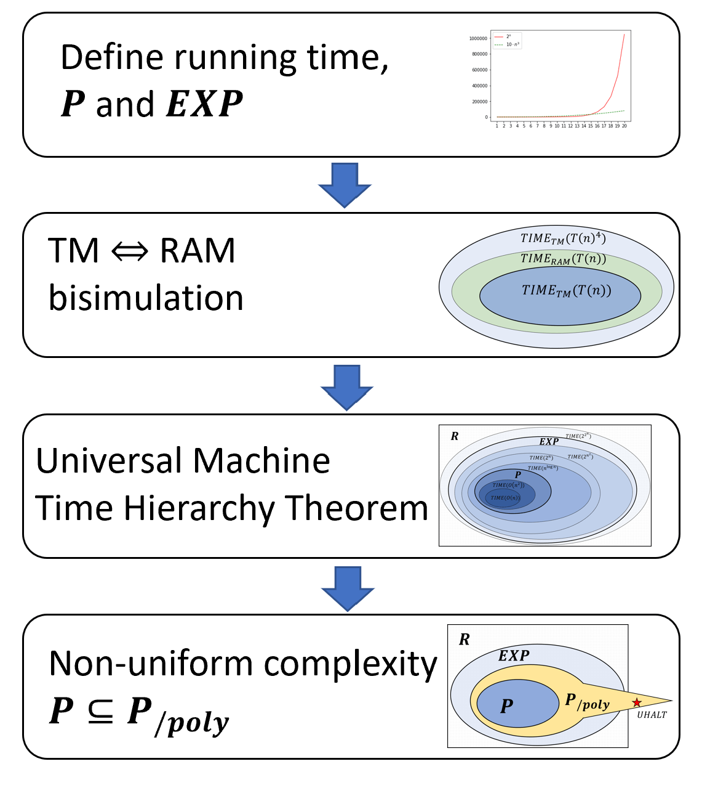

{{pic}}{fig:picoverview} 本章得到结果的概览
```

```admonish info title = "本章：一个直观的概述"
在这一章中我们形式化的定义一个函数可以被在确定的步数下计算意味着什么. 
正如在 [第12章](chapter_12.md) 中所说的那样, 运行时间并不是一个数字, 我们关心的是随着输入规模增大, 算法运行步数会以怎样的规模增长. 
我们可以用图灵机或 RAM 机来给出一个形式化定义 - 事实上模型的选择并不影响这个问题的核心解决方案
本章我们将给出几个重要定义并证明一些重要的定理. 
我们将定义本书中使用的主要时间复杂性类, 并展示时间层级定理, 该定理表明：如果给予更多的资源（即针对每个输入规模允许更多的执行步数）, 我们就能够计算更多的函数
```

要将这一切用不那么数学化的语言表述出来, 我们将定义能在 $T(n)$ 步内将函数 $F:\{0,1\}^* \rightarrow \{0,1\}^*$ 计算出来的含义, 其中 $T$ 是一个将输入长度 $n$ 映射到计算所需的步数的函数. 
使用这些定义, 我们将做以下事情（可参考 {{ref:fig:picoverview}}）

* 我们定义复杂性类 $\mathbf{P}$ 为可以在多项式时间内计算的布尔函数的集合, 复杂性类 $\mathbf{EXP}$ 为可以在指数时间内计算的函数的集合. 注意 $\mathbf{P} \subseteq \mathbf{EXP}$, 即如果我们能在多项式时间内计算一个函数, 那么当然也能在指数时间内计算他. 

* 我们证明, 用图灵机和RAM机计算一个函数所需的时间是多项式相关的. 这意味着, 无论使用图灵机还是 RAM 机（或 NAND-RAM 机）来定义, $\mathbf{P}$ 和 $\mathbf{EXP}$ 总是相同. 

* 我们给出一个高效且通用的 NAND-RAM 程序, 并使用它建立时间层级定理, 该定理意味着 $\mathbf{P}$ 是 $\mathbf{EXP}$ 的真子集. 

* 我们将此处定义的概念与 [第3章](chapter_3.md) 中定义的布尔电路和 NAND-CIRC 程序等非一致性模型联系起来. 我们将 $\mathbf{P_{/poly}}$ 定义为可以由一系列多项式大小的电路所计算的函数类. 我们证明了 $\mathbf{P} \subseteq \mathbf{P_{/poly}}$, 且 $\mathbf{P_{/poly}}$ 包含不可计算函数. 

## 13.1 形式化的定义运行时间

我们的计算模型（图灵机, NAND-TM 和 NAND-RAM 程序等）都是通过其运作方式都是对输入逐步执行一系列指令. 
我们可以通过测量算法 $M$ 在输入 $x$ 上执行的步数, 并将其表示为输入长度 $|x|$ 的函数, 从而定义算法 $M$ 在这些模型下的运行时间. 
我们首先定义基于图灵机的运行时间：

```admonish quote title=""
{{defc}}{def:time_tm_def}[运行时间（图灵机）] 

令 $T:\N \rightarrow \N$ 为某个实数到实数的映射. 
如果存在一台图灵机 $M$, 使得对于每一个充分大的 $n$ 和每一个 $x\in \{0,1\}^n$, 当给定输入 $x$ 时, 机器 $M$ 在执行最多 $T(n)$ 步后停机并输出 $F(x)$, 那么我们称函数 $F:\{0,1\}^* \rightarrow \{0,1\}^*$ 是在 $T(n)$ 图灵机时间（Turing Machine Time, 简称 TM 时间）内可计算的. 
我们定义 $TIME_{\mathsf{TM}}(T(n))$ 为所有在 $T(n)$ 图灵机时间内可计算的布尔函数（即映射 $\{0,1\}^*$ 到 $\{0,1\}$ 的函数）的集合. 
```

```admonish bigidea
{{idec}}{ide:formaldefinetime}
对于函数 $F:\{0,1\}^* \rightarrow \{0,1\}$ 和 $T:\N  \rightarrow \N$, 我们可以形式化的定义 $F$ 能在至多 $T(n)$ 的时间内计算意味着什么, 其中 $n$ 为输入规模. 
```

```admonish pause title = "暂停一下"
{{ref:def:time_tm_def}} 并不复杂, 但这是本书中最为重要的定义之一. 照例, $TIME_{\mathsf{TM}}(T(n))$ 代表一类函数, 而不是机器类. 若 $M$ 是图灵机, 则像 “$M$ 属于 $TIME_{\mathsf{TM}}(n^2)$” 这样的表述并不正确. 
此处定义的 TM 时间（图灵机时间）概念在文献中有时被称为“单带图灵时间”（single-tape Turing machine time）, 这是因为有些文献会考虑拥有多条工作带的图灵机. 
```

放宽条件只考虑充分大的 $n$ 虽然本质上并不是很重要, 但却非常便利, 因为这使我们能够避免讨论一些无趣的边界情况. 
尽管“函数的运行时间”这一概念可以在任意函数上定义, 但在定义 $TIME_{\mathsf{TM}}(T(n))$ 类时, 我们只考虑布尔函数, 即那些只有一个 bit 输出的函数. 
这一选择并不重要, 是为了后续讨论的简洁与便利而做出的. 
事实上, 任何一个非布尔函数都有一个与之计算等价的布尔变体, 参见 {{ref:boolex}}

```admonish quote title=""
{{exec}}{exe:timeboundexample}[时间界限的示例] 
证明 $TIME_{\mathsf{TM}}(10\cdot n^3) \subseteq TIME_{\mathsf{TM}}(2^n)$. 
```

```admonish pic id = 'examplefimeboundsfig'
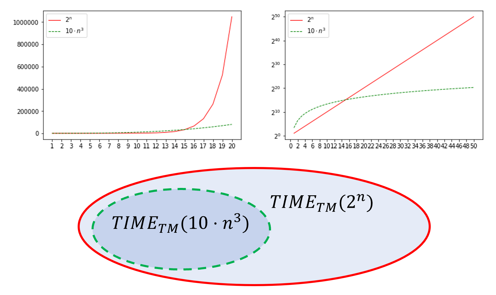

{{pic}}{fig:examplefimebounds} 将 $T(n)=10n^3$ 和 $T'(n) = 2^n$ 比较（右图的 Y 轴采用对数标度）. 因为对于足够大的 $n$, $T'(n) \geq T(n)$, 则 $TIME_{\mathsf{TM}}(T(n)) \subseteq TIME_{\mathsf{TM}}(T'(n))$. 
```

```admonish solution collapsible=true, title = "对 {{ref:exe:timeboundexample}} 的解答" 
证明其实已经在 {{ref:fig:examplefimebounds}} 中展示了. 
假设 $F\in TIME_{\mathsf{TM}}(10\cdot n^3)$, 则存在数 $N_0$ 和计算模型 $M$, 满足对于任意 $n > N_0$, $x\in \{0,1\}^*$, 都有 $M(x)$ 会在最多 $10\cdot n^3$ 步内输出 $F(x)$ 的结果. 
因为 $10\cdot n^3 = o(2^n)$, 一定存在数 $N_1$ 满足对于任意 $n > N_1$, 都有 $10 \cdot n^3 < 2^n$. 
则对于任意 $n > \max\{ N_0, N_1 \}$, $M(x)$ 会在至多 $2^n$ 步内输出 $F(x)$ 的结果, 即证明了 $F \in TIME_{\mathsf{TM}}(2^n)$. 
```

### 13.1.1 多项式时间和指数时间

与可计算性的概念不同, 精确的运行时间可能会取决于我们所使用的计算模型. 然而, 事实上, 如果我们只关心“足够粗糙”的尺度（大部分情况下都是如此）, 那么模型的选择——无论是图灵机、RAM 机、NAND-TM/NAND-RAM 程序, 还是 C/Python 程序——都无关紧要了. 
这就是所谓的*扩展*Church-Turing论题 (*extended* Church-Turing Thesis). 
具体来说, 我们主要关心的是多项式时间与指数时间之前的区别. 

我们将关注以下两个主要的时间复杂性类:

* __多项式时间:__ 如果一个函数 $F:\{0,1\}^* \rightarrow \{0,1\}$ 属于类 $\mathbf{P} = \cup_{c\in \{1,2,3,\ldots \}} TIME_{\mathsf{TM}}(n^c)$, 则称其是 __多项式时间可计算__ 的. 也就是说, 若 $F\in \mathbf{P}$, 则存在一个计算 $F$ 的算法, 其运行时间关于输入长度至多是多项式的（换言之, 对于某个常数 $c$, 至多 $n^c$）. 

* __指数时间:__ 如果一个函数 $F:\{0,1\}^* \rightarrow \{0,1\}$ 属于类 $\mathbf{EXP} = \cup_{c\in \{1,2,3,\ldots \}} TIME_{\mathsf{TM}}(2^{n^c})$, 则称其是 __指数时间可计算__ 的. 也就是说, 若 $F\in \mathbf{EXP}$, 则存在一个计算 $F$ 的算法, 其运行时间关于输入长度至多是指数的（换言之, 对于某个常数 $c$, 至多 $2^{n^c}$）. 

形式化的说, 他们是如下定义的. 

```admonish quote title=""
{{defc}}{def:PandEXP}[$\mathbf{P}$ 和 $\mathbf{EXP}$] 

设函数 $F:\{0,1\}^* \rightarrow \{0,1\}$. 

若存在一个多项式 $p:\N \rightarrow \R$, 和一个图灵机 $M$, 满足对于任意 $x\in \{0,1\}^*$, 当给出输入 $x$ 时, 图灵机将在至多 $p(|x|)$ 步内停机并输出 $F(x)$, 则我们称 $F\in \mathbf{P}$. 

若存在一个多项式 $p:\N \rightarrow \R$, 和一个图灵机 $M$, 满足对于任意 $x\in \{0,1\}^*$, 当给出输入 $x$ 时, 图灵机将在至多 $2^{p(|x|)}$ 步内停机并输出 $F(x)$, 则我们称 $F\in \mathbf{EXP}$. 
```

```admonish pause title = "暂停一下"
请务必花点时间, 确保你透彻理解了这些定义.
特别需要注意的是, 学生们有时会误以为 $\mathbf{EXP}$ 类指的是那些不在 $\mathbf{P}$ 中的函数.
然而, 事实并非如此. 如果 $F$ 属于 $\mathbf{EXP}$, 这意味着它能够在指数时间内被计算出来.
这并不意味着它不能同时在多项式时间内被计算.
```

```admonish quote title=""
{{exec}}{exe:diffdefofP}[$\mathbf{P}$ 的另一定义] 

证明 {{ref:def:PandEXP}} 中定义的 $\mathbf{P}$ 与 $\cup_{c\in \{1,2,3,\ldots \}} TIME_{\mathsf{TM}}(n^c)$ 等价. 
```

```admonish solution collapsible=true, title = "对 {{ref:exe:diffdefofP}} 的解答" 
为了证明这两个集合相等, 我们可证明 $\mathbf{P} \subseteq \cup_{c\in \{1,2,3,\ldots \}} TIME_{\mathsf{TM}}(n^c)$ 以及 $\cup_{c\in \{1,2,3,\ldots \}} TIME_{\mathsf{TM}}(n^c) \subseteq \mathbf{P}$. 

我们从前一个包含关系开始. 假设 $F \in \mathbf{P}$. 那么存在某个多项式 $p:\N \rightarrow \R$ 和一台图灵机 $M$, 使得 $M$ 能计算 $F$, 并且对于每一个输入 $x$, $M$ 都在至多 $p(|x|)$ 步内停机. 我们可以将多项式 $p:\N \rightarrow \R$ 写成 $p(n) = \sum_{i=0}^d a_i n^i$ 的形式, 其中 $a_0,\ldots,a_d \in \R$, 并且我们假设 $a_d$ 非零（否则我们就让 $d$ 对应使得 $a_d$ 非零的最大数）. 这个 $d$ 即为 $p$ 的次数（degree）. 由于 $n^d = o(n^{d+1})$, 无论系数 $a_d$ 是多少, 对于足够大的 $n$, 都有 $p(n) < n^{d+1}$. 这意味着图灵机 $M$ 在处理长度为 $n$ 的输入时, 会在少于 $n^{d+1}$ 步内停机, 因此 $F \in TIME_{\mathsf{TM}}(n^{d+1}) \subseteq \cup_{c\in \{1,2,3,\ldots \}} TIME_{\mathsf{TM}}(n^c)$. 

对于第二个包含关系, 假设 $F \in \cup_{c\in \{1,2,3,\ldots \}} TIME_{\mathsf{TM}}(n^c)$. 那么存在某个正整数 $c \in \N$ 使得 $F \in TIME_{\mathsf{TM}}(n^c)$, 这意味着存在一台图灵机 $M$ 和某个数值 $N_0$, 使得 $M$ 能计算 $F$, 并且对于每一个 $n>N_0$, $M$ 在处理长度为 $n$ 的输入时, 都在至多 $n^c$ 步内停机. 设 $T_0$ 为 $M$ 在处理长度至多为 $N_0$ 的输入时所花费的最大步数. 那么, 如果我们定义多项式 $p(n) = n^c + T_0$, 我们就会发现 $M$ 在处理每一个输入 $x$ 时都在至多 $p(|x|)$ 步内停机, 因此 $M$ 的存在证明了 $F\in \mathbf{P}$. 
```


因为指数时间比多项式时间大得多, $\mathbf{P}\subseteq \mathbf{EXP}$ 类.
我们在 [第12章](chapter_12.md) 中列出的所有问题都属于 $\mathbf{EXP}$, 不过如我们所见, 对于他们中的一些问题存在更高效的算法，这证明了他们实际上属于更小的 $\mathbf{P}$ 类.


```admonish table title=""
| $\mathbf{P}$             | $\mathbf{EXP}$ (但目前不知道属于 $\mathbf{P}$) |
|--------------------------|---------------------------|
| 最短路            | 最长路              |
| 最小割                  | 最大割                   |
| 2SAT                     | 3SAT                      |
| 解线性方程组               | 解二次方程组                 |
| 零和博弈                  | 纳什均衡                      |
| 行列式              | 积和式                 |
| 素数判定                | 整数分解                 |

这是一个来自 [第12章](chapter_12.md) 的表格. 表格中的所有问题都属于 $\mathbf{EXP}$ 类但只有左列中的问题目前已知属于 $\mathbf{P}$ 类. (换言之, 他们有多项式时间的算法). 参见 {{ref:fig:PvsEXP}}.
```

```admonish pic id = 'PvsEXPfig'
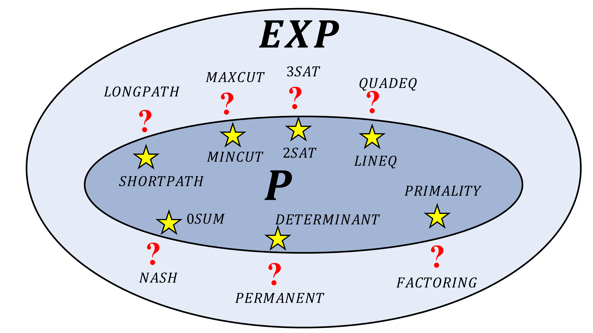

{{pic}}{fig:PvsEXP} 一些在 $\mathbf{P}$ 类中的问题和一些在 $\mathbf{EXP}$ 类中但不知道在不在 $\mathbf{P}$ 类中的问题的例子. 因为 $\mathbf{P}$ 和 $\mathbf{EXP}$ 都是布尔函数的类, 在此图中，我们始终指的是这些问题的布尔变体 (即只关心是/否).
```

```admonish remark title="问题的布尔版本"
{{remc}}{rem:booleanversion}
[第12章](chapter_12.md) 中定义的许多问题都对应于非布尔函数 (即输出超过一个 bit 的函数), 而 $\mathbf{P}$ 和 $\mathbf{EXP}$ 是布尔函数的集合.
然而, 对于每一个非布尔函数 $F$, 我们总是可以通过定义 $G(x,i)$ 为 $F(x)$ 的第 $i$ 个比特, 来定义一个与之等价的布尔函数 $G$ (参见 {{ref:boolex}}).
因此, 上表以及 {{ref:fig:PvsEXP}} 中所指的, 都是这些问题的计算等价布尔变体.
```


## 13.2 使用 RAM 机 / NAND-RAM 建模运行时间

图灵机虽然是一种简洁的理论计算模型, 但它与现实世界的计算架构并不十分吻合. 当我们考虑哪些函数是"可计算的"这一问题时, 图灵机与实际计算机之间的这种差异关系不大; 但在涉及"效率"的语境下, 这种差异就会产生影响. 甚至是本科算法课程中的基础内容——如"归并排序", 也无法在图灵机上以 $O(n\log n)$ 的时间实现 (参见 [参考文献](#bibnotesrunningtime)). RAM 机 (或等价的 NAND-RAM 程序) 更接近实际的计算架构, 也更符合我们在算法课程或白板编程面试中所说的 $O(n)$ 或 $O(n \log n)$ 算法的含义. 我们可以像定义图灵机那样, 定义针对 NAND-RAM 程序的运行时间.


```admonish quote title=""
{{defc}}{def:time_def}[运行时间 (RAM)] 

设 $T:\N \rightarrow \N$ 是某个将自然数映射到自然数的函数.
我们称函数 $F:\{0,1\}^* \rightarrow \{0,1\}^*$ 是 **在 $T(n)$ RAM 时间内可计算的** (简称 RAM 时间), 如果存在一个 NAND-RAM 程序 $P$, 使得对于每一个足够大的 $n$ 和每一个 $x\in \{0,1\}^n$, 当给定输入 $x$ 时, 程序 $P$ 在执行至多 $T(n)$ 行指令后停机, 并输出 $F(x)$.

我们定义 $TIME_{\mathsf{RAM}}(T(n))$ 为在 $T(n)$ RAM 时间内可计算的布尔函数 (即映射 $\{0,1\}^*$ 到 $\{0,1\}$ 的函数) 的集合.
```

因为 NAND-RAM 程序更加符合我们对运行时间的直观理解, 我们将把 NAND-RAM 作为我们讨论运行时间的默认模型, 并因此使用不带任何下标的 $TIME(T(n))$ 来表示 $TIME_{\mathsf{RAM}}(T(n))$.
然而, 事实证明, 只要我们只关心指数时间和多项式时间之间的区别, 模型的选择并没有太大影响.
原因是图灵机可以模拟 NAND-RAM 程序, 且其开销至多是多项式级别的 (参见 {{ref:fig:RAMTMsimulation}}):


```admonish quote title=""
{{thmc}}{thm:polyRAMTM}[图灵机和 RAM 机的联系]

$T:\N \rightarrow \N$ 为一个函数, 满足对任意 $n$ 都有 $T(n) \geq n$, 且映射 $n \mapsto T(n)$ 可以由一台图灵机在 $O(T(n))$ 时间内计算得出.
那么: 

$$
TIME_{\mathsf{TM}}(T(n)) \subseteq TIME_{\mathsf{RAM}}(10\cdot T(n)) \subseteq TIME_{\mathsf{TM}}(T(n)^4). {{numeq}}{eq:tmrambisimulation}
$$
```


```admonish pause title = "暂停一下"
{{ref:thm:polyRAMTM}} 中的一些技术细节并不重要, 如要求 $n \mapsto T(n)$ 可以在 $O(T(n))$ 时间内被计算出来的条件, 或者 {{eqref:eq:tmrambisimulation}} 中的常数 $10$ 和 $4$ (这些常数并非紧致的, 是可以被改进的)
特别的, 我们在实践中遇到的所有非病态的时间界限函数, 如 $T(n)=n$, $T(n)=n\log n$, $T(n)=2^n$ 等, 都满足 {{ref:thm:polyRAMTM}} 的条件 (另见 {{ref:rem:nicefunctions}})

该定理的核心信息是: 图灵机和 RAM 机是"大致等价"的, 在这个意义上, 其中一个可以模拟另一个, 且只产生多项式级别的开销.
同样地, 虽然证明过程涉及一些技术细节, 但它并不深奥也不困难, 仅仅是沿用了我们在 [定理8.1](./chapter_8.md#thm:RAMTMequivalencethm) 中看到的用图灵机模拟 RAM 机的方法, 只是做了更仔细的"簿记" (即状态维护) 工作.
```


```admonish pic id = 'RAMTMsimulationfig'
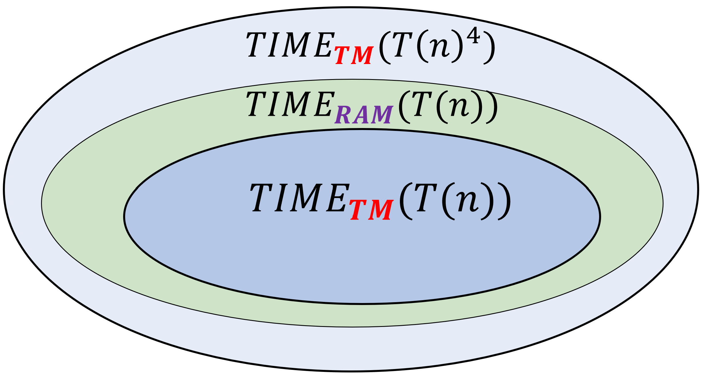

{{pic}}{fig:RAMTMsimulation} {{ref:thm:polyRAMTM}} 的证明表明, 我们可以用 $T$ 步的 NAND-RAM 程序来模拟 $T$ 步的图灵机, 并且可以用 $o(T^4)$ 步的图灵机来模拟 $T$ 步的 NAND-RAM 程序.
因此, $TIME_{\mathsf{TM}}(T(n)) \subseteq TIME_{\mathsf{RAM}}(10\cdot T(n)) \subseteq TIME_{\mathsf{TM}}(T(n)^4)$.
```


例如, 通过将 $T(n)=n^a$ 代入 {{ref:thm:polyRAMTM}}, 并利用 $10n^a = o(n^{a+1})$ 这一事实, 我们看到 $TIME_{\mathsf{TM}}(n^a) \subseteq TIME_{\mathsf{RAM}}(n^{a+1}) \subseteq TIME_{\mathsf{TM}}(n^{4a+4})$. 这意味着 (根据 {{ref:exe:diffdefofP}}): 
$$
\mathbf{P} = \cup_{a = 1,2,\ldots} TIME_{\mathsf{TM}}(n^a) = \cup_{a = 1,2,\ldots} TIME_{\mathsf{RAM}}(n^a) \;.
$$
也就是说, 我们完全可以将 $\mathbf{P}$ 定义为由 *NAND-RAM 程序* (而不是图灵机) 在输入长度的多项式时间内计算的函数类. 同样地, 通过将 $T(n)=2^{n^a}$ 代入 {{ref:thm:polyRAMTM}}, 我们看到 $\mathbf{EXP}$ 类也可以定义为由 NAND-RAM 程序在至多 $2^{p(n)}$ 时间内计算的函数集, 其中 $p$ 为某个多项式. 对于许多其他模型, 包括元胞自动机, C/Python/Javascript 程序, 并行计算机以及许多其他模型, 已知都存在类似的等价结果. 这证明了选择 $\mathbf{P}$ 作为捕捉独立于技术的"易处理性"概念是合理的 (参见 [13.3 节](#ECTTsec) 关于此问题的更多讨论). 图灵机和 NAND-RAM (以及其他模型) 之间的这种等价性, 允许我们根据手头的任务选择我们最喜欢的模型 (即"鱼与熊掌兼得"), 即使在研究效率问题时也是如此---只要我们只关心*多项式时间*和*指数时间*之间的差距. 当我们想要*设计*一个算法时, 我们可以利用 NAND-RAM 提供的额外能力和便利. 当我们想要*分析*一个程序或证明一个*否定性结果*时, 我们可以将注意力局限于图灵机.


```admonish bigidea
{{idec}}{ide:polyvsnot} 

只要我们仅关注**多项式时间**与**指数时间**之间的区别, 所有 "合理的" 计算模型都是等价的.
```


上文中的形容词 **"合理的"** 指的是所有已实现的、可扩展的计算模型, 而 **量子计算机** 可能是唯一的例外. 参见 [13.3 节](#ECTTsec) 和 [第23章](chapter_23.md).


```admonish proof collapsible=true title="{{ref:thm:polyRAMTM}} 的证明思路"
证明 $TIME_{\mathsf{TM}}(T(n)) \subseteq TIME_{\mathsf{RAM}}(10 \cdot T(n))$ 这一方向并不困难, 因为 NAND-RAM 程序 $P$ 可以通过在数组中存储图灵机 $M$ 的状态转移表（如 [定理9.1](./chapter_9.md#thm:universaltmthm) 的证明中所做的那样）, 以常数级的开销模拟 $M$. 模拟图灵机的每一步都可以在常数 $c$ 步 RAM 操作内完成, 且可以证明这个常数 $c$ 小于 $10$.

因此, 该定理的核心在于证明 $TIME_{\mathsf{RAM}}(T(n)) \subseteq TIME_{\mathsf{TM}}(T(n)^4)$. 这一证明紧随 [定理8.1](./chapter_8.md#thm:RAMTMequivalencethm) 的证明思路, 在那里我们已经证明了任何由 NAND-RAM 程序 $P$ 可计算的函数 $F$, 同样可以由图灵机（或等价的 NAND-TM 程序）$M$ 来计算. 为了证明 {{ref:thm:polyRAMTM}}, 我们沿用完全相同的证明过程, 只需核实 $M$ 模拟 $P$ 的开销是多项式级别的即可.

该证明包含许多细节, 但并不深奥. 因此, 相比于证明过程, 理解该定理的 **陈述** 要重要得多.
```

```admonish proof collapsible=true title="{{ref:thm:polyRAMTM}}的证明"
我们仅关注非平凡方向的 $TIME_{\mathsf{RAM}}(T(n)) \subseteq TIME_{\mathsf{TM}}(T(n)^4)$.
令 $F\in TIME_{\mathsf{RAM}}(T(n))$.
$F$ 可由某个 NAND-RAM 程序 $P$ 在 $T(n)$ 的时间内计算, 且我们需要证明它同样可以被一个图灵机 $M$ 在 $T(n)^4$ 的时间内被计算.
这等价于证明 $F$ 可以被一个 NAND-TM 程序在 $T(n)^4$ 时间内被计算, 因为对于任意 NAND-TM 程序 $Q$, 都存在一台模拟它的图灵机 $M$, 使得 $Q$ 的每一次迭代都对应 $M$ 的一个单步操作.


如前文所述, 我们沿用 [定理8.1](./chapter_8.md#thm:RAMTMequivalencethm) 的证明方法 (使用 NAND-TM 程序模拟 NAND-RAM 程序), 并且使用一样的模拟方法, 但更仔细地核算每步模拟所需要消耗的步数.
回想一下, NAND-RAM 的模拟是通过"剥离"其特性, 直到只剩下 NAND-TM 为止.

我们不会提供所有证明的细节, 但将展示证明 NAND-RAM 的每个特性都能以至多多项式开销被 NAND-TM 模拟的核心思路:

1. 回想一下, 每个 NAND-RAM 变量或数组元素包含的整数范围在 0 到 T 之间, 其中 T 是目前已经执行的行数.
因此, 如果 P 是一个在 $T(n)$ 时间内计算 $F$ 的 NAND-RAM 程序, 那么在长度为 $n$ 的输入下, P 所使用的所有整数的大小至多为 $T(n)$.
这意味着索引 `i` 能到达的最大值至多是 $T(n)$, 因此 $P$ 的每个变量都可以看作是一个拥有至多 $T(n)$ 个索引的数组, 每个索引存放一个大小至多为 $T(n)$ 的自然数.
令 $\ell = \ceil{\log T(n)}$ 为编码此类数字所需要的对比特数 (我们可以在模拟开始时先计算出 $T(n)$ 和 $\ell$).
1. 我们可以将一个长度 $\leq T(n)$, 包含范围在 $\{0,\ldots, T(n)-1 \}$ 内数字的 NAND-RAM 数组, 编码为一个包含 $T(n)\ell =O(T(n)\log T(n))$ 个比特的布尔 (即 NAND-TM) 数组.
我们也可以像 [定理8.1](./chapter_8.md#thm:RAMTMequivalencethm) 的证明那样, 将其视为一个*二维数组*.
一个包含数字的 NAND-RAM 标量则简单地编码为一个长度为 $\ell$ 的较短 NAND-TM 数组.
1. 我们可以使用长度为 $T(n)\ell = O(T(n) \log T(n))$ 的一维数组来模拟二维数组.
所有关于整数的算术运算都是用"小学数学算法", 其耗时是整数比特数 $\ell$ 的多项式级别的, 在本例中即为 $poly(\log T(n))$.
因此, 我们可以用一个使用随机访问内存但仅有*布尔值*的一维数组, 在 $O(T(n)poly(\log T(n)))$ 步内模拟 $T(n)$ 步的 NAND-RAM 模型.
1. 最昂贵的步骤是将随机访问内存转化为 NAND-TM/图灵机 的顺序内存模型.
正如我们在 [定理8.1](./chapter_8.md#thm:RAMTMequivalencethm) 证明中所做的, 我们可以通过以下步骤模拟访问数组 `Foo` 中由数组 `Bar` 编码的某个位置:

   1. 将 `Bar` 复制到某个临时数组 `Temp`
   2. 维护一个数组 `Index`, 其初始除第一位为 $1$ 外其余位置为 $0$.
   3. 重复以下步骤直到 `Temp` 编码了数字 $0$: _(最多重复 $T(n)$ 次)_
	  - 将 `Temp` 编码的数值减 $1$. _(消耗步数为 $\ell = \ceil{\log T(n)}$ 的多项式级)_
	  - 减小 `i` 直到其等于 $0$. _(消耗 $O(T(n))$ 步)_
	  - 扫描 `Index` 直到直到值为 $1$ 的位置, 将其改成 $0$, 向后移动一步并写下 $1$. _(消耗 $O(T(n))$ 步)_
   4. 完成后, 如果我们扫描 `Index` 直到找到 `Index[i]`$=1$ 的点, 那么 `i` 就包含了原先由 `Bar` 编码的值. _(消耗 $O(T(n))$ 步)_

   每次此类操作的总代价为 $O(T(n)^2 + T(n)poly(\log T(n))) = O(T(n)^2)$ 步.

综上所述，我们使用 $O(T(n)^2 poly(\log T(n)))$ 步 NAND-TM 来模拟 NAND-RAM 的**单步**操作，因此总模拟时间为 $O(T(n)^3 poly(\log T(n)))$。对于足够大的 $n$，这个值小于 $T(n)^4$.
```


```admonish info
{{remc}}{rem:nicefunctions}[好的时间界限]

在讨论一般的时间界限时, 我们需要确保排除掉一些"病态"的情况, 比如函数 $T$ 没有给算法留足够读取输入的时间, 或者时间界限函数本身就是不可计算的.

我们称函数 $T:\N \rightarrow \N$ 是一个 *好的时间界限函数* (或简称为好函数), 如果它满足以下条件:
+ 对于任意 $n\in \N$, 都有 $T(n) \geq n$ (即 $T$ 预留了足够的读入时间)
+ 对于任意 $n' \geq n$, 都有 $T(n') \geq T(n)$ (即 $T$ 允许在更长的输入上花费更长的时间)
+ 映射 $F(x) = 1^{T(|x|)}$ (即把长度为 $n$ 的字符串映射为长度为 $T(n)$ 的全 $1$ 序列) 可以被一个 NAND-RAM 程序在 $O(T(n))$ 时间内计算出来.

我们在应用中遇到所有"正常的"时间复杂度界限, 如 $T(n)= 100 n$, $T(n) =  n^2 \log n$,$T(n) = 2^{\sqrt{n}}$ 等, 都是好的.
因此, 从现在起, 我们只关心当 $T(n)$ 是"好函数"时的复杂性类 $TIME(T(n))$.
可计算性的条件一般是很容易被满足的.
比如, 对于像 $T(n) = n^3$ 这样的代数函数, 我们可以在关于 $T(n)$ 的比特数的多项式时间内 (即关于 $T(n)$ 的对数多项式级) 计算出 $T(n)$ 的二进制表示.
因此, 在这种情况下, 写出字符串 $1^{T(n)}$ 的时间将会是 $T(n) + poly(\log T(n)) = O(T(n))$.
```


## 13.3 扩展Church-Turing论题 (讨论) { #ECTTsec }

{{ref:thm:polyRAMTM}} 表明, 图灵机和 RAM 机/ NAND-RAM 程序这几个计算模型在运行时间上是多项式等价的.
其他多项式等价模型的例子有:

* 所有标准的编程语言, 包括 C/Python/JavaScript/Lisp/等.
* $\lambda$ 算子 (参见 [13.8 节](#bibnotesrunningtime))
* 元胞自动机
* 并行计算机
* 生物计算设备, 如基于 DNA 的计算机.

*扩展Church-Turing论题* 指出, 这一表述对于所有物理上可实现的计算模型均成立.
换言之, 扩展Church-Turing论题认为, 对于任意一个可以*扩展的计算设备* $C$ (该设备具有有限的描述, 但原则上可以用于处理任意长度的输入), 都存在某个常数 $a$, 使得对于 $C$ 在长度为 $n$ 的输入上使用 $S(n)$ 量的物理资源所能计算的每一个函数 $F:\{0,1\}^* \rightarrow \{0,1\}$, $F$ 都属于 $TIME(S(n)^a)$.
这是对一般的Church-Turing论题 (在 [第 8.8 节](./chapter_8.md#churchturingdiscussionsec) 中被讨论) 的加强.
普通论题仅指出所有物理上可实现模型的"可计算函数集"是相同的, 但不要求不同模型之间模拟的开销至多为多项式级别.

目前所有关于可扩展计算模型和编程语言的构建都遵循扩展Church-Turing论题, 即它们都可以被图灵机 (以及 NAND-TM 或 NAND-RAM 程序) 以多项式级开销进行模拟.
因此, $\mathbf{P}$ 和 $\mathbf{EXP}$ 类对于模型的选择具有鲁棒性.
我们可以使用任何我们喜欢的编程语言, 或者算法的高层描述, 来确定一个问题是否属于 $\mathbf{P}$.

与Church-Turing论题本身一样, 扩展Church-Turing论题也处于渐近设定之下, 并不直接产生可实验验证的预测.
然而, 它可以用更具体的开销界限来实例化, 从而产生可实验验证的预测, 例如我们在 [5.6 节](./chapter_5.md#PECTTsec) 中提到的*物理扩展Church-Turing论题*.

在过去一百多年对计算的研究和机械化进程中, 尚未有人制造出能违反扩展Church-Turing论题的可扩展计算设备.
然而, *量子计算* (如果得以实现) 将对扩展丘奇-图灵论题提出严峻挑战 (见 [第23章](./chapter_23.md)).
但是, 即便量子计算的愿景完全实现, 扩展Church-Turing论题在"精神层面"上依然是正确的: 
虽然我们需要修正该论题以纳入量子计算的可能性, 但其宏观框架保持不变.
我们依然能够对计算进行数学建模; 依然可以将程序视为字符串并拥有通用程序; 依然拥有时间层级和不可计算性结果; 并且依然没有理由怀疑 ("普通") Church-Turing论题.
此外, 量子计算的前景似乎并不会改变我们所关心的许多 (虽非全部!) 具体问题的运行时间复杂度.
特别是, 就我们目前所知, 在 [第12章](chapter_12.md) 提到的所有示例问题中, 只有*整数分解*这一个问题的复杂度, 会因为将模型修改为包含量子计算机而受到影响.


## 13.4 高效的通用机器: 在 NAND-RAM 中的 NAND-RAM 解释器

我们已经在 [定理 9.1](./chapter_9.md#thm:universaltmthm) 中见过了 "通用图灵机".
审视其证明, 并结合 {{ref:thm:polyRAMTM}} , 我们可以看到程序 $U$ 具有*多项式*开销, 即它可以在 $O(T^4)$ 步内模拟给定 NAND-TM (或 NAND-RAM) 程序 $P$ 在输入 $x$ 上运行 $T$ 步.
但事实上, 通过直接模拟 NAND-RAM 程序, 我们可以做的更好, 仅需*常数*倍的乘法开销.
也就是说, 存在一个*通用 NAND-RAM 程序* $U$, 使得对于每一个 NAND-RAM 程序 $P$, $U$ 仅需要 $O(T)$ 步就能模拟 $P$ 的 $T$ 步. ($O$ 记号中隐含的常数可能取决于程序 $P$, 但不依赖输入的长度.)

```admonish quote title=""
{{thmc}}{thm:univ-nandpp}[NAND-RAM 的高效通用性]

存在一个 NAND-RAM 程序 $U$ 满足以下性质:

1. *($U$ 是一个通用的 NAND-RAM 程序)* 对于任意 NAND-RAM 程序 $P$ 和输入 $x$,  $U(P, x) = P(x)$, 其中 $U(P, x)$ 表示 $U$ 在一个编码 $(P, x)$ 的字符串上的输出.

2. *($U$ 是高效的)* 存在一个常数 $a, b$, 使得对于每一个 NAND-RAM 程序 $P$, 如果 $P$ 在输入 $x$ 后运行至多 $T$ 步后停机, 那么 $U(P, x)$ 在运行至多 $C\cdot T$ 步后停机, 其中 $C \leq a |P|^b$.
```

```admonish pause title="暂停一下"
正如 {{ref:thm:polyRAMTM}} 的情况一样, {{ref:thm:univ-nandpp}} 的证明并不很深奥, 因此理解它的*陈述*更加重要.
具体来说, 如果你明白如何使用像 Python 这样的现代语言写一个 NAND-RAM 解释器, 那么你就知道了关于该定理证明的一切.
```

```admonish pic id="universalrammachinefig"
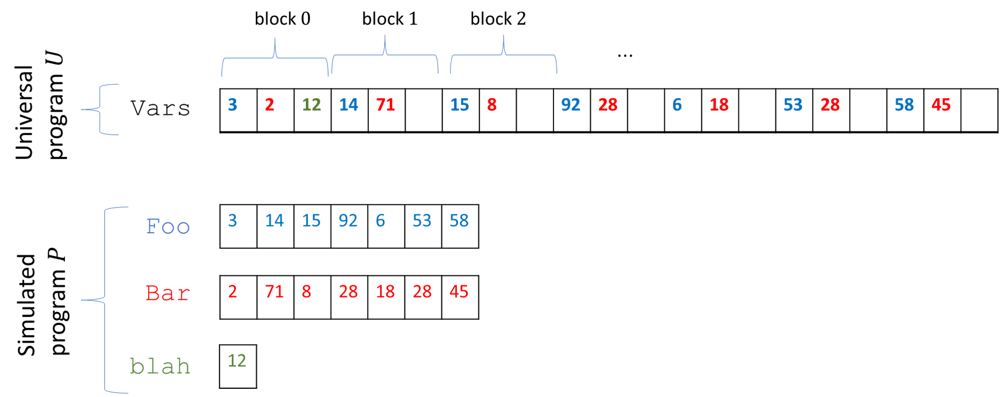

{{pic}}{fig:universalrammachine}
通用 NAND-RAM 程序 $U$ 通过将输入程序 $P$ 的所有变量存储在 $U$ 的单个数组 `Vars` 来模拟 $P$.
如果 $P$ 有 $t$ 个变量, 那么 `Vars` 被划分为长度为 $t$ 的块, 其中第 $i$ 个块的第 $j$ 个坐标包含 $P$ 的第 $j$ 个数组的第 $i$ 个元素.
如果 $P$ 的第 $j$ 个变量是标量, 那么我们只需将其值存储在 `Vars` 的第 $0$ 个块中.
```

```admonish proof collapsible=true title="{{ref:thm:univ-nandpp}} 的证明"
若要完整展示一个通用 NAND-RAM 程序, 我们需要描述一个精确的表示方案, 以及该程序的完整 NAND-RAM 指令.

虽然这可以被完成, 但关注主要想法更为重要, 因此我们在这里仅概述证明.

NAND-RAM 的规范在 [附录](http://tiny.cc/introtcsappendix) 中给出, 出于此模拟的目的, 我们可以简单地将 NAND-RAM 代码表示为 ASCII 字符串.

程序 $U$ 接收一个 NAND-RAM 程序 $P$ 和一个输入 $x$ 作为输入, 并逐步模拟 $P$.

为此, $U$ 执行以下操作:

1. $U$ 维护变量 `program_counter` 和 `number_steps`, 分别用于表示待执行的当前行和迄今为止已执行的步数.

2. $U$ 最初扫描 $P$ 的代码以找出 $P$ 使用的变量名的数量 $t$. $U$ 将把每个变量名转换为 $0$ 到 $t-1$ 之间的一个数字, 并使用一个数组 `Program` 来存储 $P$ 的代码, 其中对于每一行 $\ell$, `Program[`$\ell$`]` 将存储 $P$ 的第 $\ell$ 行, 其中的变量名已被转换为数字. (更具体地说, 我们将使用常数数量的数组来分别编码该行中使用的操作, 以及操作数的变量名和索引.)

3. $U$ 维护一个数组 `Vars`, 其中包含 $P$ 的变量的所有值. 我们将 `Vars` 分割为长度为 $t$ 的块. 如果 $s$ 是对应于 $P$ 的数组变量 `Foo` 的数字, 那么我们将 `Foo[0]` 存储在 `Vars[`$s$`]` 中, 将 `Foo[1]` 存储在 `Vars[`$t+s$`]` 中, 将 `Foo[2]` 存储在 `Vars[`$2t + s$`]` 中, 依此类推 (参见 {{ref:fig:universalrammachine}}). 一般的, 如果 $P$ 的第 $s$ 个变量是标量变量, 那么它的值将被存储在位置 `Vars[`$s$`]` 中. 如果它是一个数组变量, 那么它的第 $i$ 个元素的值将被存储在位置 `Vars[`$t\cdot i + s$`]` 中.

4. 为了模拟 $P$ 的一步, 程序 $U$ 从 `Program` 中获取对应于 `program_counter` 的行并执行它. 由于 NAND-RAM 具有常数数量的算术运算, 我们可以使用一连串常数数量的 if-then-else 来实现执行哪种运算的逻辑. 从 `Vars` 中检索每条指令的操作数的值可以使用常数数量的算术运算来完成.

初始化阶段仅花费常数 (取决于 $|P|$ 而非输入 $x$) 数量的步骤.

一旦我们完成了初始化, 为了模拟 $P$ 的单一步骤, 我们只需要获取相应的行, 并进行常数数量的 "if else" 和对 `Vars` 的访问来模拟它.

因此, 当忽略依赖于程序 $P$ 的常数时, 模拟程序 $P$ 的 $T$ 个步骤的总运行时间至多为 $O(T)$.
```

### 13.4.1 限时通用图灵机

高效通用机的一个推论如下.
给定任意图灵机 $M$, 输入 $x$, 以及 "步数预算" $T$, 我们可以在关于 $T$ 的多项式时间内模拟 $M$ 执行 $T$ 步.
形式化地, 我们定义一个函数 $TIMEDEVAL$, 它接受 $M$, $x$ 和时间预算这三个参数, 如果 $M$ 在至多 $T$ 步内停机, 则输出 $M(x)$, 否则输出 $0$.
限时通用图灵机在多项式时间内计算 $TIMEDEVAL$ (见 {{ref:fig:timeduniversaltm}}). 
(由于我们将时间作为输入长度的函数来度量, 我们将 $TIMEDEVAL$ 定义为接受以 _一元_ 表示的输入 $T$: 即由 $T$ 个 1 组成的字符串.)

```admonish quote title=""
{{thmc}}{thm:timeduniversalTM}[限时通用图灵机]

设 $TIMEDEVAL:\{0,1\}^* \rightarrow \{0,1\}^*$ 为如下定义的函数
$$TIMEDEVAL(M,x,1^T) = \begin{cases} M(x) & M \text{ 在 $x$ 上 $\leq T$ 步内停机} \\ 0 & \text{否则}\end{cases} \;.$$
那么 $TIMEDEVAL \in \mathbf{P}$.
```


```admonish pic id="timeduniversaltmfig"
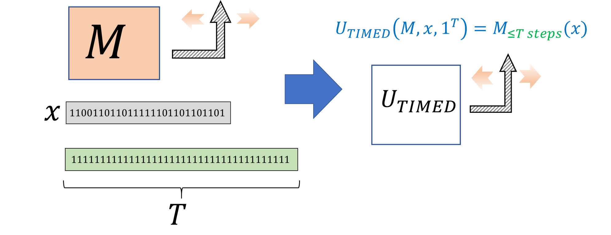

{{pic}}{fig:timeduniversaltm}
_限时_ 通用图灵机接受图灵机 $M$, 输入 $x$ 和时间界限 $T$ 作为输入, 并在 $M$ 于至多 $T$ 步内停机时输出 $M(x)$. 
{{ref:thm:timeduniversalTM}} 指出存在这样一台机器, 其运行时间是关于 $T$ 的多项式.
```

```admonish proof collapsible=true title="{{ref:thm:timeduniversalTM}} 的证明"
我们只给出证明概要, 因为该结果相当直接地由 {{ref:thm:polyRAMTM}} 和 {{ref:thm:univ-nandpp}} 推导得出.
根据 {{ref:thm:polyRAMTM}}, 要证明 $TIMEDEVAL \in \mathbf{P}$, 只要给出一个计算 $TIMEDEVAL$ 的多项式时间 NAND-RAM 程序即可.

这样的程序可以通过如下方式获得.
给定图灵机 $M$, 根据 {{ref:thm:polyRAMTM}}, 我们可以在关于其描述长度的多项式时间内, 将其转换为功能等价的 NAND-RAM 程序 $P$, 使得 $M$ 执行 $T$ 步的过程可以由 $P$ 执行 $c\cdot T$ 步来模拟.
然后我们可以运行 {{ref:thm:univ-nandpp}} 中的通用 NAND-RAM 机器来模拟 $P$ 执行 $c\cdot T$ 步, 耗时 $O(T)$, 如果执行在该预算内没有停机则输出 $0$.
这表明 $TIMEDEVAL$ 可以由一个 NAND-RAM 程序在关于 $|M|$ 的多项式且关于 $T$ 的线性时间内计算出来, 这意味着 $TIMEDEVAL \in \mathbf{P}$.
```


## 13.5 时间层级定理 (Time Hierarchy Theorem)

一些函数是*不可被计算的*, 但是否存在可被计算, 但只能以很高的代价计算的函数呢?
具体来说, 是否存在*能*在 $2^n$ 时间内被计算, 但*不能*在 $2^{0.9 n}$ 时间内被计算的函数呢?
事实证明, 这个问题的答案为*是*.

```admonish quote title=""
{{thmc}}{thm:time-hierarchy}[时间层级定理]

对于任意一个好函数 (nice function) $T:\N \rightarrow \N$, 一定存在一个函数 $F:\{0,1\}^* \rightarrow \{0,1\}$ 属于 $TIME(T(n)\log n) \setminus TIME(T(n))$.
```

这里出现 $\log n$ 并没有什么特殊的理由, 我们也可以用其他能被高效计算, 且当 n 趋于无穷时也趋于无穷的函数来替代 $\log n$.

```admonish bigidea
{{idec}}{ide:timehierarchy}

如果我们有更多的时间, 我们就能计算更多的函数.
```

```admonish info
{{remc}}{rem:hierarchytoy}[时间层级定理的简单推论]

时间层级定理的普适性会让其证明读起来略显晦涩.
如果你先尝试自己证明一个简单的命题 $\mathbf{P} \subsetneq \mathbf{EXP}$ 可能会让你更易理解该证明.

你可以通过证明 $F:\{0,1\}^* :\rightarrow \{0,1\}$ 属于 $\mathbf{EXP} \setminus \mathbf{P}$ 来做到这一点:
对于任意图灵机 $M$ 和输入 $x$, $F(M,x)=1$ 当且仅当 $M$ 在输入 $x$ 上运行最多 $|x|^{\log |x|}$ 步后停机.
通过使用通用图灵机 (或 {{ref:thm:univ-nandpp}} 中的高效通用 NAND-RAM 程序), 可以证明 $F \in TIME(n^{O(\log n)}) \subseteq \mathbf{EXP}$.
另一方面, 我们可以利用与 [9.3.2节](./chapter_9.md#haltalternativesec) 中用于证明 $HALT$ 不可计算性中类似的思路来证明 $F \not\in \mathbf{P}$.
```

```admonish pic id="timehierarchythmfig"
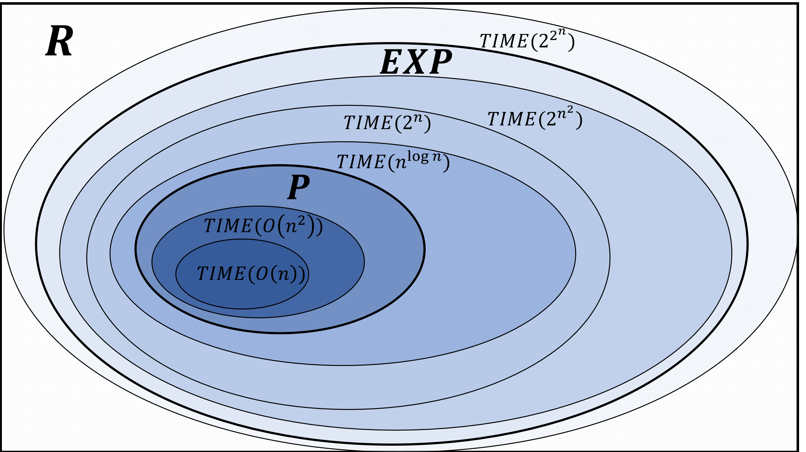

{{pic}}{fig:timehierarchythm} *时间层级定理* ({{ref:thm:time-hierarchy}}) 说明图中这些复杂性类有*本质区别*.
```


```admonish proof collapsible=true title="{{ref:thm:time-hierarchy}} 的证明思路"
在 [定理 9.3](./chapter_9.md#thm:halt-thm) (停机问题的不可计算性) 的证明中, 我们已经证明函数 $HALT$ 无法在任何有限时间内被计算.
仔细审查该证明可以发现, 它实际上给出了更强的结论.
具体来说, 该证明表明, 如果我们将计算预算固定为 $T$ 步, 那么我们不仅无法区分停机的程序和不停机的程序, 甚至无法区分那些在至多 $T'$ 步停机的程序与那些运行超过 $T'$ 步的程序 (其中 $T'$ 是某个由 $T$ 决定的数值).
因此 {{ref:thm:time-hierarchy}} 的证明沿用了停机问题不可计算性证明的思路, 但对运行时间进行了更仔细地分析.
```


```admonish proof collapsible=true title="{{ref:thm:time-hierarchy}} 的证明"
我们的证明灵感来源于停机问题不可计算性的证明.
具体的, 对于定理中描述的每个函数 $T$, 我们定义 *有界停机* 函数 $HALT_T$.
$HALT_T$ 的输入是二元组 $(P,x)$ 满足 $|P| \leq \log \log |x|$ 且 $P$ 编码着某个 NAND-RAM 程序.
我们定义

$$
HALT_T(P,x) = \begin{cases}1, & P \text{ 在 } \leq 100\cdot T(|P|+|x|) \text{ 步内于 } x \text{ 上停机} \\
0, & \text{否则} \end{cases} \;.
$$
(常数 $100$ 和函数 $\log \log n$ 实际上是为了证明的便捷性任意选择的.)

{{ref:thm:time-hierarchy}} 是以下两个断言的直接推论:

__断言 1:__ $HALT_T \in TIME(T(n)\cdot \log n)$

和

__断言 2:__ $HALT_T \not\in TIME(T(n))$.

请确保你明白为什么这两个断言能直接得出 {{ref:thm:time-hierarchy}}.
接下来我们将转而证明这两个断言.

__断言 1 的证明:__ 
我们可以轻松的在线性时间内检查是否输入具有 $P,x$ 的形式, 其中 $|P| \leq \log\log |x|$.
因为 $T(\cdot)$ 是一个好函数, 我们可以在 $O(T(n))$ 内计算它的值.
因此, 我们可以如下计算 $HALT_T(P,x)$:

1. 在 $O(T_0)$ 步内计算 $T_0=T(|P|+|x|)$.

2. 使用 {{ref:thm:univ-nandpp}} 中的通用 NAND-RAM 程序在至多 $poly(|P|)T_0$ 步内模拟 $P$ 在输入 $x$ 上运行 $100\cdot T_0$ 步. (回想一下, 我们用 $poly(\ell)$ 表示一个上界为 $a\ell^b$ 的量, 其中 $a, b$ 为某个常数.)

3. 如果 $P$ 在 $100\cdot T_0$ 步内停机则输出 $1$, 否则输出 $0$.

输入的长度为 $n=|P|+|x|$.
因为 $|x| \leq n$ 且对于任意 $b$ 都有 $(\log \log |x|)^b = o(\log |x|)$, 程序的运行时间将会是 $o(T(|P|+|x|) \log n)$, 因此上述算法证明了 $HALT_T \in TIME(T(n)\cdot \log n)$, 从而完成了对 断言 1 的证明.


__断言 2 的证明:__ 
这个证明是 {{ref:thm:time-hierarchy}} 的核心, 并且容易让人回想起 $HALT$ 不可计算性的证明.
假设 (为了导出矛盾), 存在某个 NAND-RAM 程序 $P^*$ 可在 $T(|P|+|x|)$ 步内计算 $HALT_T(P,x)$.
我们将通过构造一个程序 $Q$ 来导出矛盾.
我们将证明, 在我们的假设下, 如果 $Q$ 在给定其自身代码 (的填充版本) 作为输入时运行少于 $T(n)$ 步, 那么它实际上会运行超过 $T(n)$ 步, 反之亦然.
(这句话值得反复阅读二到三次以确保你理解其中的逻辑. 这与停机问题不可计算性的直接证明非常相似, 在那个证明中我们利用假设的 "停机求解器" 构造了一个程序, 那个程序在给定它自身代码作为输入时, 停机当且仅当自身不停机.)

我们定义将程序 $Q^*$ 为: 当输入字符串 $z$ 时, 执行以下三个阶段的操作:

1. 如果 $z$ 不具备 $z=P1^m$ 的形式, 其中 $P$ 表示一个 NAND-RAM 程序且 $|P|< 0.1 \log\log m$, 则返回 $0$. (回想一下, $1^m$ 表示有 $m$ 个 $1$ 的字符串.) 

2. 计算 $b= P^*(P,z)$ (在我们的假设下以最多 $T(|P|+|z|)$ 步的代价).

3. 如果 $b=1$ 则 $Q^*$ 进入无限循环, 否则停机.

令 $\ell$ 为 $Q^*$ 作为字符串时描述的长度, 并令 $m \ge 2^{2^{1000 \ell}}$.
我们将通过讨论 $HALT_T(Q^*,Q^*1^m)$ 等于 $0$ 还是 $1$ 来得出矛盾.

一方面, 如果 $HALT_T(Q^*,Q^*1^m)=1$, 则在我们 $P^*$ 计算 $HALT_T$ 的假设下, $Q^*$ 在输入 $z=Q^*1^m$ 上将进入无限循环, 因此 $Q^*$ 在输入为 $z=Q^*1^m$ 下*不会*在 $100 T(|Q^*|+m)$ 步内停机. 这与我们的假设 $HALT_T(Q^*,Q^*1^m)=1$ 矛盾.

这意味着 $HALT_T(Q^*,Q^*1^m)=0$ 必然成立. 但在这个情况下, 由于我们假设了 $P^*$ 计算 $HALT_T$, $Q^*$ 在其计算的第 $3$ 阶段不会做任何事情, 因此计算的唯一开销来自第 $1$ 和第 $2$ 阶段.
不难验证第 $1$ 阶段可以在线性时间内完成 (事实上少于 $5|z|$ 步).
第 $2$ 阶段包括执行 $P^*$, 根据我们的假设, 这需要 $T(|Q^*|+m)$ 步.
我们可以在总计少于 $10 T(|Q^*|+m)$ 步执行这两个阶段.
根据定义, 这说明 $HALT_T(Q^*,Q^*1^m)=1$, 但这显然是一个矛盾, 完成了断言 2 的证明, 从而也完成了 {{ref:thm:time-hierarchy}} 的证明. 
```


```admonish quote title=""
{{exec}}{exe:PvsEXP}[$\mathbf{P}$ vs $\mathbf{EXP}$]

证明 $\mathbf{P} \subsetneq \mathbf{EXP}$.
```


```admonish solution collapsible=true title="对 {{ref:exe:PvsEXP}} 的解答"
这一陈述直接由时间层级定理得出, 但直接证明它也是一项有益的练习 (参见 {{ref:thm:time-hierarchy}}).
我们需要证明存在 $F \in \mathbf{EXP} \setminus \mathbf{P}$.
令 $T(n) = n^{\log n}$ 且 $T'(n) = n^{\log n / 2}$.
两者都是良好的函数.
由于 $T(n)/T'(n) = \omega(\log n)$, 根据 {{ref:thm:time-hierarchy}}, 存在某个 $F$ 属于 $TIME(T(n)) \setminus TIME(T'(n))$.
由于对于充分大的 $n$, $2^n > n^{\log n}$, 故 $F \in TIME(2^n) \subseteq \mathbf{EXP}$.
另一方面, $F \not\in \mathbf{P}$. 实际上, 假设反之, 存在常数 $c>0$ 以及一个图灵机, 对于所有充分大的 $n$, 它在至多 $n^c$ 步内对长度为 $n$ 的输入计算 $F$. 那么, 由于对于足够大的 $n$, 有 $n^c < n^{\log n/2}$, 这将推出 $F \in TIME(n^{\log n /2})$, 这与我们对 $F$ 的选择矛盾.
```

时间层级定理告诉我们, 存在一些函数我们能在 $O(n^2)$ 时间计算但不能在 $O(n)$ 时间计算, 能在 $2^n$ 时间计算但不能在 $2^{\sqrt{n}}$ 时间计算, 等等..
特别的, 肯定存在一些函数我们能在 $2^n$ 时间计算但不能在 $O(n)$ 时间计算.
我们已经见过了太多自然的函数, 其已知的最好算法需要大约 $2^n$ 的时间, 且已经有许多人投入了大量的时间与精力来尝试改进这些问题的算法.
然而, 不像有穷对无穷那样, 上述的所有例子, 我们目前仍然不知道如何去排除有 $O(n)$ 时间的算法存在.   
然而我们将看到, 存在一个未被证明的猜想表明大多数这类问题都有这样的结论.


```admonish pic id="complexityclassinclusionfig"
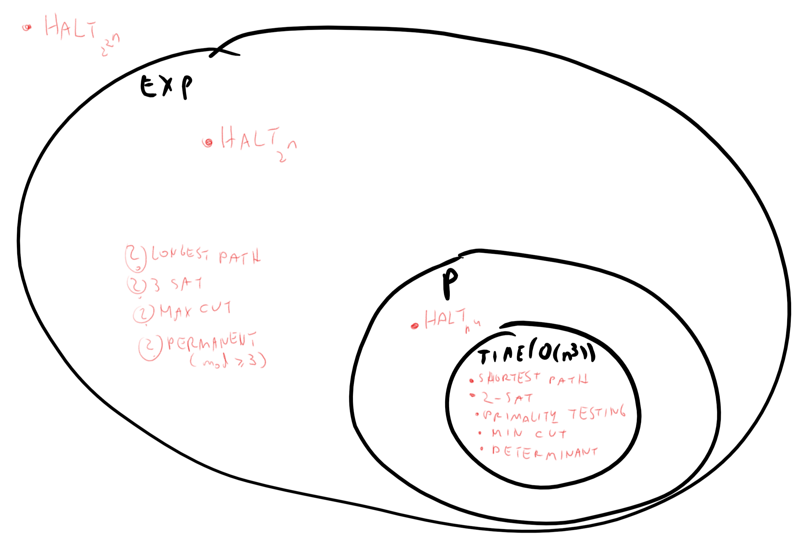

{{pic}}{fig:complexityclassinclusion} 一些函数已知 (或猜想) 包含在某个复杂性类里面.
```


时间层级定理的存在依赖于高效通用 NAND-RAM 程序 (已在 {{ref:thm:univ-nandpp}} 被证明存在).
对于其他计算模型, 如图灵机, 我们有类似的时间层级定理表明存在某个函数能在 $T(n)$ 时间内被计算但不能在 $T(n)/f(n)$ 时间内被计算, 其中 $f(n)$ 对应于相应通用机器的开销.


## 13.6 非一致性计算 {#nonuniformcompsec }


我们现在已经了解过了两种 "计算代价" 的度量.
在 [4.6 节](./chapter_4.md#secdefinesizeclasses) 中, 我们使用电路 / 直线式程序定义了计算*有限*函数的复杂性.
具体来说, 对于有限函数 $g:\{0,1\}^n \rightarrow \{0,1\}$ 和数 $s\in \N$, 如果存在一个至多包含 $s$ 个与非门的电路 (或一个等价的 $s$ 行的 NAND-CIRC 程序) 来计算 $g$, 则 $g\in SIZE_n(s)$.
为了将其与本章定义的类 $TIME(T(n))$ 联系起来, 我们首先需要将类 $SIZE_n(s)$ 扩展到具有无界输入长度的函数.  

```admonish quote title=""
{{defc}}{def:nonuniform}[非一致性计算]

设 $F:\{0,1\}^* \rightarrow \{0,1\}$ 且 $T:\N \rightarrow \N$ 为一个好的时间界限函数.
对于任意 $n\in \N$, 定义 $F_{\upharpoonright n} : \{0,1\}^n \rightarrow \{0,1\}$ 为 $F$ 在大小为 $n$ 的输入上的 _限制_. 也就是说, $F_{\upharpoonright n}$ 是将 $\{0,1\}^n$ 映射到 $\{0,1\}$ 的函数, 使得对于任意 $x\in \{0,1\}^n$, $F_{\upharpoonright n}(x)=F(x)$.

如果存在与非门电路序列 $(C_0,C_1,C_2,\ldots)$ 满足以下条件, 我们称 $F$ 是 _在至多 $T(n)$ 大小内非一致可计算的_, 记作 $F \in SIZE(T)$:

* 对于任意 $n\in \N$, $C_n$ 计算函数 $F_{\upharpoonright n}$

* 对于任意足够大的 $n$, $C_n$ 至多有 $T(n)$ 个门.
```

换言之, $F \in SIZE(T)$ 当且仅当对于任意 $n \in \N$, $F_{\upharpoonright n} \in SIZE_n(T(n))$.
类 $\mathbf{P}$ 在非一致性中的类似物是 $\mathbf{P_{/poly}}$, 其被定义为

$$
\mathbf{P_{/poly}} = \cup_{c\in \N} SIZE(n^c)  \; . {{numeq}}{eqppolydef}
$$

非一致性计算与一致性复杂性类 (如 $TIME(T(n))$ 或 $\mathbf{P}$) 之间存在巨大差异.
$F\in \mathbf{P}$ 意味着存在一个*固定的* (不由输入改变) 图灵机 $M$ 满足在任意输入上, $M$ 都能以多项式时间计算 $F$ 的结果.
而 $F\in \mathbf{P_{/poly}}$ 仅意味着, 对于每个输入长度 $n$, 存在一个*不同的* (可能由输入大小改变) 的电路, 使用多项式数量的门来计算该长度输入上的 $F$.
正如我们所见, $F\in \mathbf{P_{/poly}}$ 并不意味着 $F\in \mathbf{P}$.
然而, 这一陈述的反方向是成立的.

```admonish pic id="Ppolyfig"
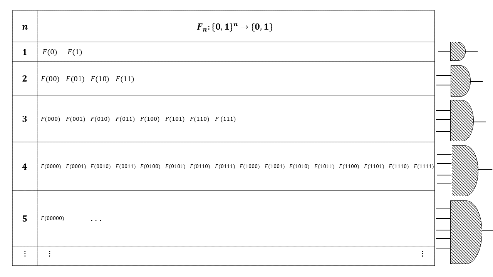 

{{pic}}{fig:Ppoly} 我们可以将无限函数 $F:\{0,1\}^* \rightarrow \{0,1\}$ 视为有限函数集合 $F_0,F_1,F_2,\ldots$, 其中 $F_{\upharpoonright n}:\{0,1\}^n \rightarrow \{0,1\}$ 是 $F$ 在长度为 $n$ 的输入上的限制. 如果对于任意 $n$, 函数 $F_{\upharpoonright n}$ 可由多项式大小的 NAND-CIRC 程序 (或等价地, 多项式大小的布尔电路) 计算, 我们就说 $F$ 属于 $\mathbf{P_{/poly}}$.
```


```admonish quote title=""
{{thmc}}{thm:non-uniform}[非一致性计算包含一致性计算]

存在某个 $a\in \N$, 使得对于每个好函数 $T:\N \rightarrow \N$ 和 $F:\{0,1\}^* \rightarrow \{0,1\}$, 都有

$$
TIME(T(n)) \subseteq SIZE(T(n)^a)\;.
$$
```

特别的, {{ref:thm:non-uniform}} 表明对于每个 $c$, $TIME(n^c) \subseteq SIZE(n^{ca})$, 因此 $\mathbf{P} \subseteq \mathbf{P_{/poly}}$.


```admonish proof collapsible=true title="{{ref:thm:non-uniform}} 的证明思路"
证明的思路是 "循环展开".
具体的, 我们将使用一致性计算和非一致性计算的编程语言变体, 即 NAND-CIRC 和 NAND-TM.
两者之间的主要差别在于 NAND-TM 有*循环*.
然而, 对于每个固定的 $n$, 如果我们知道一个 NAND-TM 程序最多运行 $T(n)$ 步, 那么我们就可以将这些循环用简单的"复制粘贴"代码 $T(n)$ 替代, 类似于在 Python 我们可以将

~~~python
for i in range(4):
	print(i)
~~~

替换成没有循环的代码

~~~python
print(0)
print(1)
print(2)
print(3)
~~~

为了将这一证明思路转化为实际的证明, 我们需要解决一个技术难点, 即确保 NAND-TM 程序是*非感知的*, 意思是说在循环的第 $j$ 次迭代中, 索引变量 `i` 的值仅取决于 `j`, 而不取决于输入的内容.
我们将在 [13.6.1 节](#obliviousnandtm) 中暂时岔开话题来专门解决这一点, 随后完成 {{ref:thm:non-uniform}} 的证明.
```


### 13.6.1 非感知的 NAND-TM 程序  {#obliviousnandtm}

我们证明 {{ref:thm:non-uniform}} 的方法涉及了 "循环展开".
比如, 考虑下面这个用于计算任意输入长度 $XOR$ 函数的 NAND-TM 程序:

```python
temp_0 = NAND(X[0],X[0])
Y_nonblank[0] = NAND(X[0],temp_0)
temp_2 = NAND(X[i],Y[0])
temp_3 = NAND(X[i],temp_2)
temp_4 = NAND(Y[0],temp_2)
Y[0] = NAND(temp_3,temp_4)
MODANDJUMP(X_nonblank[i],X_nonblank[i])
```

举个例子, 若 $n = 3$, 我们可以尝试通过简单地把循环复制三遍 (删去 `MODANDJMP` 这行), 把这个 NAND-TM 程序翻译成用于计算 $XOR_3:\{0,1\}^3 \rightarrow \{0,1\}$ 的 NAND-CIRC 程序


```python
temp_0 = NAND(X[0],X[0])
Y_nonblank[0] = NAND(X[0],temp_0)
temp_2 = NAND(X[i],Y[0])
temp_3 = NAND(X[i],temp_2)
temp_4 = NAND(Y[0],temp_2)
Y[0] = NAND(temp_3,temp_4)
temp_0 = NAND(X[0],X[0])
Y_nonblank[0] = NAND(X[0],temp_0)
temp_2 = NAND(X[i],Y[0])
temp_3 = NAND(X[i],temp_2)
temp_4 = NAND(Y[0],temp_2)
Y[0] = NAND(temp_3,temp_4)
temp_0 = NAND(X[0],X[0])
Y_nonblank[0] = NAND(X[0],temp_0)
temp_2 = NAND(X[i],Y[0])
temp_3 = NAND(X[i],temp_2)
temp_4 = NAND(Y[0],temp_2)
Y[0] = NAND(temp_3,temp_4)
```

然而, 上面这个仍然不是一个合法的 NAND-CIRC 程序, 因为它包含一个对特殊变量 `i` 的引用.
我们可以通过将第一个迭代中的 `i` 替换为 $0$, 第二个迭代中的替换为 $1$, 第三个迭代中的替换为 $2$ 来把上述程序转化为一个合法的 NAND-CIRC 程序. (我们还创建了一个变量 `zero`, 并在任意变量第一次初始化时使用, 同时移除了那些后续不再使用的非输出变量的赋值)
结果程序是一个标准的计算 $XOR_3$ 的 "无索引无循环" 的 NAND-CIRC 程序. (另见 {{ref:fig:unrolledcircuit}})


```python
temp_0 = NAND(X[0],X[0])
one = NAND(X[0],temp_0)
zero = NAND(one,one)
temp_2 = NAND(X[0],zero)
temp_3 = NAND(X[0],temp_2)
temp_4 = NAND(zero,temp_2)
Y[0] = NAND(temp_3,temp_4)
temp_2 = NAND(X[1],Y[0])
temp_3 = NAND(X[1],temp_2)
temp_4 = NAND(Y[0],temp_2)
Y[0] = NAND(temp_3,temp_4)
temp_2 = NAND(X[2],Y[0])
temp_3 = NAND(X[2],temp_2)
temp_4 = NAND(Y[0],temp_2)
Y[0] = NAND(temp_3,temp_4)
```

```admonish pic id="unrolledcircuitfig"
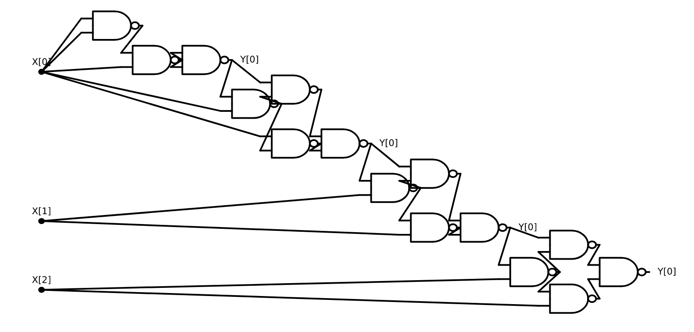 

{{pic}}{fig:unrolledcircuit} 一个通过 "循环展开" 三次计算 $XOR$ 的 NAND-TM 程序得到的计算 $XOR_3$ 的 NAND 电路.
```


这种转换的关键在于, 在我们最初的 $XOR$ NAND-TM 程序中, 无论输入是 $011$, $100$ 还是任何其他字符串, 索引变量 i 都保证在第一次迭代中等于 $0$, 在第二次迭代中等于 $1$, 在第三次迭代中等于 $2$, 依此类推.
特定的序列 $0,1,2,\ldots$ 并不重要: 关键属性在于 $XOR$ 的 NAND-TM 程序是 *非感知的*, 即在第 $j$ 次迭代中索引 `i` 的值仅取决于 $j$, 而不取决于输入的具体选择.
幸运的是, 我们能够将每个 NAND-TM 程序转换为功能等效的非感知程序, 且其开销至多为二次方. (类似地, 我们可以将任何图灵机转换为功能等效的非感知图灵机, 参见 {{ref:oblivious-ex}})


```admonish quote title=""
{{thmc}}{thm:obliviousnandtm}[使 NAND-TM 非感知]

令 $T:\N \rightarrow \N$ 为一个好函数, 且 $F\in TIME_{\mathsf{TM}}(T(n))$.
则存在一个 NAND-TM 程序 $P$ 在 $O(T(n)^2)$ 内计算 $F$ 且满足下述条件:
对于任意 $n\in \N$, 存在一个序列 $i_0,i_1,\ldots, i_{m-1}$, 满足对于任意 $x\in \{0,1\}^n$, 当 $P$ 在输入 $x$ 上执行时在第 $j$ 次迭代时变量 `i` 等于 $i_j$. 
```

换言之, {{ref:thm:obliviousnandtm}} 意味着如果我们能在 $T(n)$ 步内计算 $F$, 那么我们就能用一个程序 $P$ 在 $O(T(n)^2)$ 步内计算它, 且变量 `i` 在第 $j$ 次迭代中的值只取决于 $j$ 和输入的长度, 不依赖于输入的内容.
这样的程序可以通过 "循环展开" 轻松的被转译成 $O(T(n)^2)$ 行的 NAND-CIRC 程序.

```admonish proof collapsible=true title="{{ref:thm:obliviousnandtm}} 的证明思路"
我们可以通过让一个 NAND-TM 程序 $P$ 扫描它的数组来把任意 $P'$ 翻译成非感知的程序 $P$.
换言之, $P$ 中的索引 `i` 将始终在 $0$ 和 $T(n) - 1$ 之间反复移动.
于是我们便可以用至多 $T(n)$ 的开销来模拟程序 $P'$: 如果 $P'$ 想要在一个向右的扫描中向左移动, 则我们可以简单的等待至多 $2T(n)$ 步直到下一次在向左移动的过程中回到原位置. 
```

```admonish pic id="obliviousnandtmfig"
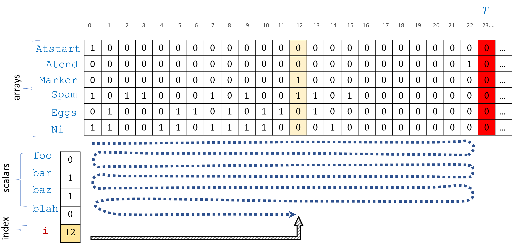 

{{pic}}{fig:obliviousnandtm} 
通过添加两个特殊数组 `Atstart` 和 `Atend` 来分别标记 $0$ 和 $T-1$ 两个位置, 我们得已用一个*非感知*的 NAND-TM 程序 $P$ 来模拟一个 $T(n)$ 时间的 NAND-TM 程序 $P'$.
程序 $P$ 会简单的从左到右再从右到左反复扫描它的数组.
如果原来的程序 $P'$ 想要向一个相反的方向移动 `i`, 那么我们会等待 $O(T)$ 步直到我们到达了相同的位置, 因此 $P$ 在 $O(T(n)^2)$ 时间运行.
```


```admonish proof collapsible=true title="{{ref:thm:obliviousnandtm}} 的证明"
令 $P'$ 为一个在 $T(n)$ 步内计算 $F$ 的 NAND-TM 程序.
我们构造一个非感知的 NAND-TM 程序 $P$ 以如下过程计算 $F$ (另见 {{ref:fig:obliviousnandtm}}). 

1. 在输入 $x$ 上, $P$ 会计算 $T=T(|x|)$ 并创建数组 `Atstart` 和 `Atend` 满足 `Atstart[`$0$`]`$=1$ 且对于 $i>0$, `Atstart[`$i$`]`$=0$ 和 `Atend[`$T-1$`]`$=1$ 且对于 $i \neq T-1$, `Atend[`i`]`$=0$.
因为 $T$ 是一个好函数, 所以我们可以做到这一点.
注意因为这步计算并不依赖于 $x$ 而只依赖于其长度, 因此这是非感知的.

2. $P$ 还会有一个初始化为全 $0$ 的特殊数组 `Marker`.

3. 当 `Atstart[i]`$=1$ 时, $P$ 的索引变量会会将其移动方向改为向右, 当 `Atend[i]`$=1$ 时, 会改为向左.

4. 程序 $P$ 会模拟程序 $P'$ 的指令执行.
不过当遇到指令 `MODANDJMP` 时, 且此时 $P'$ 在向左移动时尝试向右移动 (反之亦然), 那么 $P$ 会将 `Marker[i]` 设置为 $1$ 并进入一个特殊的 "等待模式".
在这个模式下, $P$ 将会一直等待直到 `Marker[i]`$=1$ 再次成立, 且此时 $P$ 会将 `Marker[i]` 设为 $0$ 并继续模拟的过程.
在最坏的情况下, 这将会消耗 $2T(n)$ 步 (如果 $P$ 需要从一头移动到另一头并从另一头移动回来.)

5. 我们同样会在 $P'$ 更早结束的情况下通过添加 "虚拟步" 来保证 $P$ 在恰好模拟了 $P'$ 的 $T(n)$ 步之后结束计算.

我们可以看到 $P$ 以 $O(T(n))$ 每步的开销模拟 $P'$ 的执行, 因此我们完成了证明.
```

{{ref:thm:obliviousnandtm}} 能导出 {{ref:thm:non-uniform}}.
事实上, 如果 $P$ 是一个 $k$ 行的非感知的在 $T(n)$ 时间内计算 $F$ 的 NAND-TM 程序, 那么对于每个 $n$, 只需要简单的做 $T(n)$ 次复制黏贴 (删去 `MODANDJMP` 指令), 我们都可以得到一个 $(k-1)\cdot T(n)$ NAND-CIRC 程序.
在第 $j$ 个副本中, 我们将所有形为 `Foo[i]` 的引用替换为 `foo_`$i_j$, 其中 $i_j$ 是 `i` 在第 $j$ 次迭代中的值.

### 13.6.2 "循环展开": 从图灵机到电路的转换算法  { #unrollloopsec  }

{{ref:thm:non-uniform}} 的证明是 *算法的*, 即这个证明给出了一个多项式时间的算法能够在给出一个图灵机 $M$, 参数 $T$ 和 $n$ 的前提下生成一个有 $O(T^2)$ 个门的电路, 且这个电路在任意输入 $x\in \{0,1\}^n$ 上运行的结果都与 $M$ 一致 (只要 $M$ 在这些输入上的运行步数少于 $T$.) 
我们将在下面的定理中记录这一事实, 因为这之后会对我们很有用.

```admonish pic id="unrollloopfig"
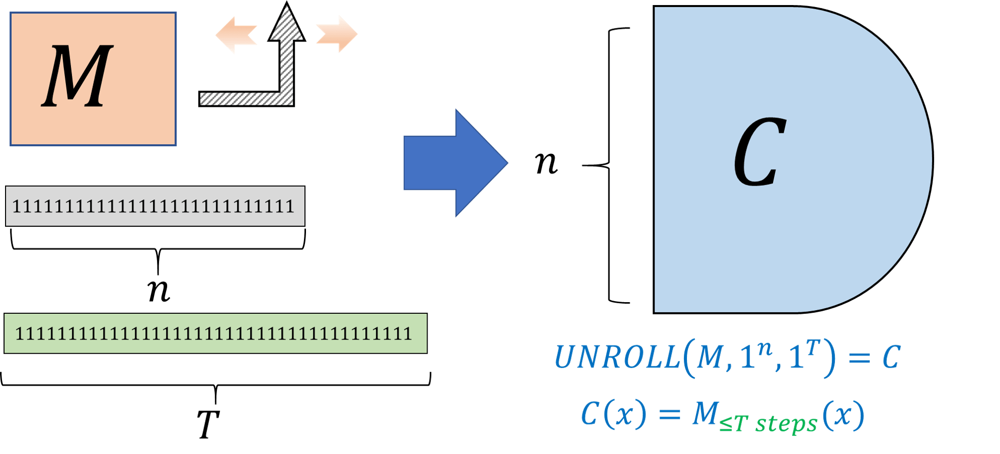 

{{pic}}{fig:unrollloop} 函数 $UNROLL$ 以图灵机 $M$, 输入长度参数 $n$ 和时间界限 $T$ 为输入, 输出一个 $O(T^2)$ 大小的 NAND 电路, 该电路在 $M$ 于至多 $T$ 步内停机的所有输入 $x\in \{0,1\}^n$ 上与 $M$ 一致. 
```


```admonish quote title=""
{{thmc}}{thm:nand-compiler}[编译图灵机到电路的编译器]

存在一个算法 $UNROLL$ 满足对于任意图灵机 $M$ 和参数 $n$, $T$, $UNROLL(M,1^T,1^n)$ 在至多 $poly(|M|,T,n)$ 步内运行, 且输出一个 NAND 电路 $C$. 该电路接受长度为 $n$ 的输入, 有 $O(T^2)$ 个门, 只有一个输出, 并且满足:
$$
C(x) = \begin{cases}y & M \text{ 在 $T$ 步内停机且输出 $y$ } \\ 0 & \text{否则} \end{cases}\;.
$$
```

```admonish proof collapsible=true title="{{ref:thm:nand-compiler}} 的证明"
我们将只概述证明, 因为它可以通过直接将 {{ref:thm:non-uniform}} 的证明转化为算法, 并结合 NAND-TM 程序对图灵机的模拟得到 (另见 {{ref:fig:unrolldescription}}).
具体来说, $UNROLL$ 将执行以下操作:

1. 将图灵机 $M$ 翻译为等价的 NAND-TM 程序 $P$.

2. 将 NAND-TM 程序 $P$ 翻译为等价的非感知的程序 $P'$ (按照 {{ref:thm:obliviousnandtm}} 的证明).
程序 $P'$ 需要 $T' = O(T^2)$ 步来模拟 $P$ 程序的 $T$ 步.

3. 通过获得对应于 $P'$ 的 $T'$ 次迭代执行的 NAND-CIRC 程序 (或等价的具有 $O(T^2)$ 个门的 NAND 电路) 来展开 $P'$ 的循环.
```

```admonish pic id="unrolldescriptionfig"
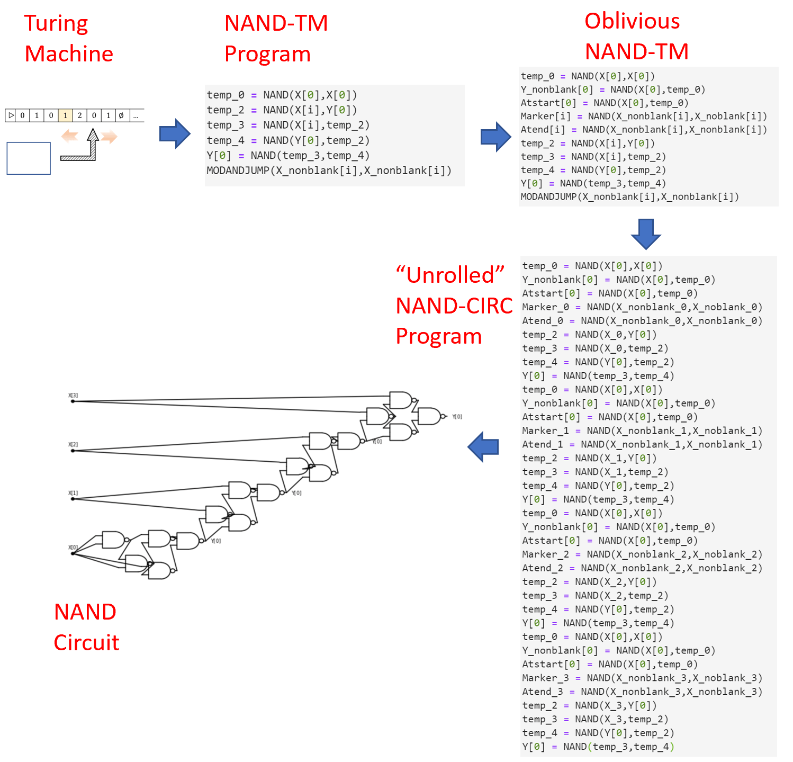

{{pic}}{fig:unrolldescription} 我们可以将图灵机 $M$, 输入长度参数 $n$ 和时间界限 $T$ 转换为一个 $O(T^2)$ 大小的 NAND 电路, 该电路在 $M$ 于至多 $T$ 步内停机的所有输入 $x\in \{0,1\}^n$ 上与 $M$ 一致. 该转换首先利用图灵机和 NAND-TM 程序 $P$ 的等价性, 然后通过 {{ref:thm:obliviousnandtm}} 将 $P$ 转换为等价的 *非感知的* NAND-TM 程序 $P'$, 接着 "展开" $P'$ 的循环 $O(T^2)$ 次迭代以获得一个与 $P'$ 在长度为 $n$ 的输入上一致的 $O(T^2)$ 行 NAND-CIRC 程序, 最后将此程序翻译为等价的电路.
```

```admonish bigidea
{{idec}}{ide:unrollloop}

通过 "循环展开", 我们可以将一个需要 $T(n)$ 步来计算 $F$ 的算法转换为一个使用 $poly(T(n))$ 个门来计算 $F$ 在 $\{0,1\}^n$ 上的限制的电路.
```

```admonish pause title="暂停一下"
回顾 {{ref:fig:unrolldescription}} 中描述的转换, 以及解决以下两个练习, 是更适应非一致性复杂度, 特别是 $\mathbf{P_{/poly}}$ 及其与 $\mathbf{P}$ 关系的绝佳方式.
```

```admonish question title=""
{{exec}}{exe:characterizationofp}[$\mathbf{P}$ 的另一刻画]

证明对于任意 $F:\{0,1\}^* \rightarrow \{0,1\}$, $F\in \mathbf{P}$ 当且仅当存在一个多项式时间图灵机 $M$, 使得对于任意 $n\in \N$, $M(1^n)$ 输出一个 $n$ 输入电路 $C_n$ 的描述, 该电路计算 $F$ 在输入 $\{0,1\}^n$ 上的限制 $F_{\upharpoonright n}$.
```

```admonish solution collapsible=true title="对{{ref:exe:characterizationofp}} 的解答"
我们从 "当" 的方向开始.
假设存在一个多项式时间图灵机 $M$, 它在输入 $1^n$ 上输出计算 $F_{\upharpoonright n}$ 的电路 $C_n$. 那么以下是计算 $F$ 的多项式时间图灵机 $M'$. 对于输入 $x\in \{0,1\}^*$, $M'$ 将:

1. 令 $n=|x|$ 并计算 $C_n = M(1^n)$.

2. 返回 $C_n$ 在 $x$ 上的执行结果.

由于我们可以在多项式时间内计算布尔电路在输入上的结果, 因此 $M'$ 在多项式时间内运行并对每个输入 $x$ 计算 $F(x)$.

对于 "仅当" 的方向, 如果 $M'$ 是一个在多项式时间内计算 $F$ 的图灵机, 那么 (应用图灵机和 NAND-TM 的等价性以及 {{ref:thm:obliviousnandtm}}) 同样存在一个非感知的 NAND-TM 程序 $P$, 它在时间 $p(n)$ 内计算 $F$, 其中 $p$ 为某个多项式.
我们现在可以定义 $M$ 为这样一个图灵机: 在输入 $1^n$ 上, 它输出通过将 $P$ 的 "循环展开" $p(n)$ 次迭代而获得的 NAND 电路.
结果 NAND 电路计算 $F_{\upharpoonright n}$ 并且具有 $O(p(n))$ 个门.
它也可以被转换为具有 $O(p(n))$ 个 AND/OR/NOT 门的布尔电路.
```

```admonish question title=""
{{exec}}{exe:adviceppoly}[$\mathbf{P_{/poly}}$ 的刻画]

令 $F:\{0,1\}^* \rightarrow \{0,1\}$.
那么 $F\in\mathbf{P_{/poly}}$ 当且仅当存在一个多项式 $p:\N \rightarrow \N$, 一个多项式时间图灵机 $M$ 和一个字符串序列 $\{ a_n \}_{n\in \N}$, 满足对于任意 $n\in \N$:

* $|a_n| \leq p(n)$
* 对于任意 $x\in \{0,1\}^n$, $M(a_n,x)=F(x)$.
```

```admonish solution collapsible=true title="对{{ref:exe:adviceppoly}} 的解答"
我们只概述证明.
对于 "仅当" 方向, 如果 $F\in \mathbf{P_{/poly}}$, 那么我们可以简单地使用对应电路 $C_n$ 的描述作为 $a_n$, 并使用在多项式时间内计算一个电路在其输入上的结果的程序作为 $M$.

对于 "当" 方向, 我们可以使用与 {{ref:thm:non-uniform}} 相同的 "循环展开" 技术来证明: 如果 $P$ 是一个多项式时间 NAND-TM 程序, 那么对于任意 $n\in \N$, 映射 $x \mapsto P(a_n,x)$ 可以由多项式大小的 NAND-CIRC 程序 $Q_n$ 计算.
```


### 13.6.3 一致性算法可以模拟非一致性算法吗?

{{ref:thm:non-uniform}} 向我们展示了每个属于 $TIME(T(n))$ 的函数都属于 $SIZE(poly(T(n)))$.
有人可能会问是否存在一个反向的关系.
假设有一个 $F$, 满足对于每个 $n$, 其 $F_{\upharpoonright n}$ 都有一个 "短的" NAND-CIRC 程序.
我们能说对于某些 "小的" $T$ 它一定在 $TIME(T(n))$ 中吗?
答案是坚决的 **不**.
不仅 $\mathbf{P_{/poly}}$ 不包含在 $\mathbf{P}$ 中, 事实上, $\mathbf{P_{/poly}}$ 中存在一些函数 *无法计算*.

```admonish quote title=""
{{thmc}}{thm:Ppolyuncomputable}[$\mathbf{P_{/poly}}$ 包含不可计算函数] 
 
存在一个 *不可计算* 函数 $F:\{0,1\}^* \rightarrow \{0,1\}$ 满足 $F \in \mathbf{P_{/poly}}$.
```

```admonish proof collapsible=true, title = "对{{ref:thm:Ppolyuncomputable}} 的证明思路"
因为 $\mathbf{P_{/poly}}$ 对应于非一致性计算, 若对于每个 $n\in \N$, 限制 $F_{\upharpoonright n}$ 在输入长度 $n$ 上有一个小的电路/程序, 尽管对于不同的 $n$ 这个电路/程序可能完全不同, 我们就说函数 $F$ 属于 $\mathbf{P_{/poly}}$.
特别的, 如果对于所有相同长度的输入 $x$ 和 $x'$, 函数 $F$ 都满足 $F(x)=F(x')$, 那么这意味着 $F_{\upharpoonright n}$ 要么是常函数 $0$ 要么是常函数 $1$.
因为常函数有一个 (非常!) 小的电路, 这样的函数 $F$ 总是属于 $\mathbf{P_{/poly}}$ (事实上属于一个更小的类).
然而通过规约停机问题, 我们可以得到一个具有上述性质但不可计算的函数.
```

```admonish proof collapsible=true, title = "对{{ref:thm:Ppolyuncomputable}} 的证明"
考虑如下定义的 "一元停机函数" $UH:\{0,1\}^* \rightarrow \{0,1\}$.
我们令 $S:\N \rightarrow \{0,1\}^*$ 为这样一个函数: 接受输入 $n\in \N$, 输出对应于数字 $n$ 的二进制表示但不包含最高位 1 的字符串.
注意 $S$ 是一个 *满射*.
对于所有 $x\in \{0,1\}^*$, 我们定义 $UH(x)=HALTONZERO(S(|x|))$.
即, 如果 $n$ 为 $x$ 的长度, 那么 $UH(x)=1$ 当且仅当字符串 $S(n)$ 编码了一个在输入 $0$ 上停机的 NAND-TM 程序.

$UH$ 是不可计算的, 因为如果 $UH$ 可被计算, 那么我们就可以通过将程序 $P$ 转化为数字 $n$, 满足 $P = S(n)$, 并运行 $UH(1^n)$ (换言之, $UH$ 在长为 $n$ 的全 $1$ 串上的结果) 来计算 $HALTONZERO$ 的结果.
另一方面, 对于所有 $n$, 对于所有输入 $x$, $UH_n(x)$ 总是为 $0$ 或总是为 $1$, 因此这个程序可以被一个常数行的 NAND-CIRC 程序计算.
```

这里的问题显然是 *一致性*.
对于一个函数 $F:\{0,1\}^* \rightarrow \{0,1\}$, 如果 $F$ 属于 $TIME(T(n))$, 那么我们有 *单一* 的算法可以对于每个 $n$ 计算 $F_{\upharpoonright n}$.
另一方面, 对于每个 $n$, $F_{\upharpoonright n}$ 可能都在 $SIZE(T(n))$ 中, 但对每个输入长度使用完全不同的算法.
因此, 我们通常不将 $\mathbf{P_{/poly}}$ 用作 _高效_ 计算的模型, 而是用来建模 _低效计算_.
例如, 在密码学中, 人们通常将一个加密方案是安全的定义为: 破解长度为 $n$ 的密钥需要超过多项式数量的 NAND 行.
由于 $\mathbf{P} \subseteq \mathbf{P_{/poly}}$, 这特别排除了用于破解的多项式时间算法, 但在密码学中使用非一致性模型还有技术上的原因.
它也允许用非渐进术语来谈论安全性, 例如方案具有 "$128$ 位安全性".

虽然这有时可能是一个真正的问题, 但在许多自然的背景下, 一致性和非一致性计算之间的差异似乎并不那么重要.
特别的, 在我们之前讨论的所有未知是否在 $\mathbf{P}$ 中的问题示例中: 最长路径, 3SAT, 因数分解等, 这些问题也都不知道是否在 $\mathbf{P_{/poly}}$ 中.
因此, 对于 "自然的" 函数, 如果你假装 $TIME(T(n))$ 大致等同于 $SIZE(T(n))$, 你正确的概率通常比错误的要大.

```admonish pic id="PEXPPpolyrelationsfig"
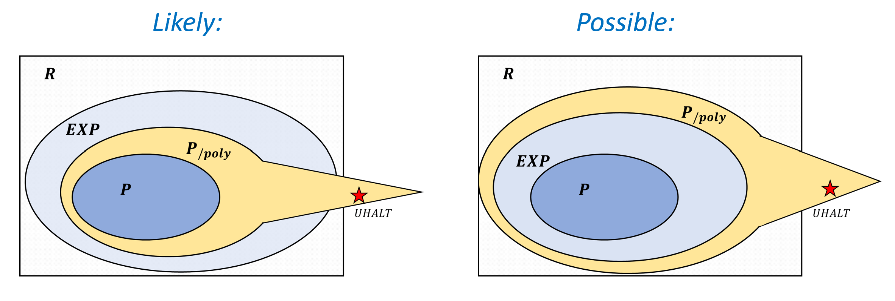 

{{pic}}{fig:PEXPPpolyrelations} 
$\mathbf{P}$, $\mathbf{EXP}$, 和 $\mathbf{P_{/poly}}$ 之间的关系.
已知的是 $\mathbf{P} \subseteq \mathbf{EXP}$, $\mathbf{P} \subseteq \mathbf{P_{/poly}}$ 且 $\mathbf{P_{/poly}}$ 包含不可计算函数 (特别的, 这些函数不属于 $\mathbf{EXP}$).
目前仍未知 $\mathbf{EXP} \subseteq \mathbf{P_{/poly}}$ 是否成立, 虽然大部分人相信 $\mathbf{EXP} \not\subseteq \mathbf{P_{/poly}}$.
```


### 13.6.4 一致性与非一致性计算: 总结

总而言之, 我们目前描述的两种计算模型是:


* **一致性模型 (Uniform models):** _图灵机_, _NAND-TM 程序_,  _RAM 机器_, _NAND-RAM 程序_, _C/JavaScript/Python_ 等. 这些模型包含循环和无界内存, 因此单个程序可以计算具有无界输入长度的函数. 


* **非一致性模型 (Non-uniform models):** _布尔电路_ 或 _直线程序_  没有循环, 只能计算有限函数. 执行它们的时间恰好是它们包含的行数或门的数量. 

对于一个函数 $F:\{0,1\}^* \rightarrow \{0,1\}$ 和某个良好的时间界限 $T:\N \rightarrow \N$, 我们知道:

* 如果 $F$ 在时间 $T(n)$ 内是一致可计算的, 那么存在一系列电路 $C_1,C_2,\ldots$, 其中 $C_n$ 具有 $poly(T(n))$ 个门并且对每个 $n$ 计算 $F_{\upharpoonright n}$ (即, $F$ 对 $\{0,1\}^n$ 的限制).

* 反之不一定成立 - 存在函数 $F:\{0,1\}^n \rightarrow \{0,1\}$ 的例子, 使得 $F_{\upharpoonright n}$ 甚至可以由常数大小的电路计算, 但 $F$ 是不可计算的.

这意味着非一致性复杂度对于建立函数的 _困难性_ 比建立其 _容易性_ 更有用.

```admonish hint title="本章回顾"
* 我们可以使用 NAND-TM 程序定义函数的时间复杂度, 与可计算性的概念类似, 这似乎捕捉了函数的固有复杂度.

* 有许多自然问题具有多项式时间算法, 也有其他我们很想解决的自然问题, 但其已知最好的算法是指数级的.

* 多项式时间的定义, 以及由此产生的类 $\mathbf{P}$, 对模型的选择具有鲁棒性, 无论是图灵机, NAND-TM, NAND-RAM, 现代编程语言, 还是许多其他模型.

* 时间层级定理表明, 有 _一些_ 问题可以在指数时间内解决, 但不能在多项式时间内解决. 然而, 我们不知道本章节中描述的自然示例是否属于这种情况.

* 通过 "循环展开", 我们可以证明每个在时间 $T(n)$ 内可计算的函数都可以由一系列 NAND-CIRC 程序 (每个输入长度一个) 计算, 每个程序的大小至多为 $poly(T(n))$.
```


## 习题

```admonish quote title=""
{{proc}}{definitionofP}[Equivalence of different definitions of $\mathbf{P}$ and $\mathbf{EXP}$.]

Prove that the classes $\mathbf{P}$ and $\mathbf{EXP}$ defined in [PandEXPdef](){.ref} are equal to $\cup_{c\in \{1,2,3,\ldots \}} TIME(n^c)$ and $\cup_{c\in \{1,2,3,\ldots \}} TIME(2^{n^c})$ respectively.
(If $S_1,S_2,S_3,\ldots$ is a collection of sets then the set $S = \cup_{c\in \{1,2,3,\ldots \}} S_c$ is the set of all elements $e$ such that there exists some $c\in \{ 1,2,3,\ldots \}$ where $e\in S_c$.)
```

```admonish quote title=""
{{proc}}{robsutrepresex}[Robustness to representation]

[polyRAMTM-thm](){.ref} shows that the classes $\mathbf{P}$ and $\mathbf{EXP}$ are _robust_ with respect to variations in the choice of the computational model.
This exercise shows that these classes are also robust with respect to our choice of the representation of the input.

Specifically, let $F$ be a function mapping graphs to $\{0,1\}$, and let $F', F'':\{0,1\}^* \rightarrow \{0,1\}$ be the functions defined as follows. For every $x\in \{0,1\}^*$:

* $F'(x)=1$ iff $x$ represents a graph $G$ via the adjacency matrix representation such that $F(G)=1$.

* $F''(x)=1$ iff $x$ represents a graph $G$ via the adjacency list representation such that $F(G)=1$.

Prove that $F' \in \mathbf{P}$ iff $F'' \in \mathbf{P}$.


More generally, for every function $F:\{0,1\}^* \rightarrow \{0,1\}$, the answer to the question of whether $F\in \mathbf{P}$ (or whether $F\in \mathbf{EXP}$) is unchanged by switching representations, as long as transforming one representation to the other can be done in polynomial time (which essentially holds for all reasonable representations).
```


```admonish quote title=""
{{proc}}{boolex}[Boolean functions]

For every function $F:\{0,1\}^* \rightarrow \{0,1\}^*$, define $Bool(F)$ to be the function mapping $\{0,1\}^*$ to $\{0,1\}$ such that on input a (string representation of a) triple $(x,i,\sigma)$ with $x\in \{0,1\}^*$, $i \in \N$ and $\sigma \in \{0,1\}$,

$$
Bool(F)(x,i,\sigma) = \begin{cases} F(x)_i & \sigma =0, i<|F(x)| \\
									1      & \sigma = 1,i<|F(x)| \\
								 0   & \text{otherwise} \end{cases}
$$
where $F(x)_i$ is the $i$-th bit of the string $F(x)$.

Prove that for every $F:\{0,1\}^* \rightarrow \{0,1\}^*$, $Bool(F) \in \mathbf{P}$ if and only if there is a Turing Machine $M$ and a polynomial $p:\N \rightarrow \N$ such  that for every $x\in \{0,1\}^*$, on input $x$, $M$ halts within $\leq p(|x|)$ steps and outputs $F(x)$.
```

```admonish quote title=""
{{proc}}{poly-time-comp-ex}[Composition of polynomial time]

Say that a (possibly non-Boolean) function $F:\{0,1\}^* \rightarrow \{0,1\}^*$ is _computable in polynomial time_, if there is a Turing Machine $M$ and a polynomial $p:\N \rightarrow \N$ such  that for every $x\in \{0,1\}^*$, on input $x$, $M$ halts within $\leq p(|x|)$ steps and outputs $F(x)$.
Prove that for every pair of functions  $F,G:\{0,1\}^* \rightarrow \{0,1\}^*$ computable in polynomial time, their _composition_ $F\circ G$, which is the function $H$ s.t. $H(x)=F(G(x))$, is also computable in polynomial time.
```


```admonish quote title=""
{{proc}}{exp-time-comp-ex}[Non-composition of exponential time]

Say that a (possibly non-Boolean) function $F:\{0,1\}^* \rightarrow \{0,1\}^*$ is _computable in exponential  time_, if there is a Turing Machine $M$ and a polynomial $p:\N \rightarrow \N$ such  that for every $x\in \{0,1\}^*$, on input $x$, $M$ halts within $\leq 2^{p(|x|)}$ steps and outputs $F(x)$.
Prove that there is some $F,G:\{0,1\}^* \rightarrow \{0,1\}^*$ s.t. both $F$ and $G$ are computable in exponential time, but $F\circ G$ is not computable in exponential time.
```


```admonish quote title=""
{{proc}}{oblivious-ex}[Oblivious Turing Machines]

We say that a Turing machine $M$ is _oblivious_ if there is some function $T:\N\times \N \rightarrow \Z$ such that for every input $x$ of length $n$, and $t\in \N$ it holds that:

* If $M$ takes more than $t$ steps to halt on the input $x$, then in the $t$-th step $M$'s head will be in the position $T(n,t)$. (Note that this position depends only on the _length_ of $x$ and not its contents.)

* If $M$ halts before the $t$-th step then $T(n,t) = -1$.

Prove that if $F\in \mathbf{P}$ then there exists an _oblivious_ Turing machine $M$ that computes $F$ in polynomial time. See footnote for hint.^[_Hint:_ This is the Turing machine analog of [obliviousnandtmthm](){.ref}. We replace one step of the original TM $M'$ computing $F$ with a "sweep" of the obliviouss TM $M$ in which it goes $T$ steps to the right and then $T$ steps to the left.]
```


```admonish quote title=""
{{proc}}{graphedgeex}

Let $EDGE:\{0,1\}^* \rightarrow \{0,1\}$ be the function such that on input a string representing a triple $(L,i,j)$, where $L$ is the adjacency list representation of an $n$ vertex graph $G$, and $i$ and $j$ are numbers in $[n]$, $EDGE(L,i,j)=1$ if the edge $\{i,j \}$ is present in the graph. $EDGE$ outputs $0$ on all other inputs.

1. Prove that $EDGE \in \mathbf{P}$.


2. Let $PLANARMATRIX:\{0,1\}^* \rightarrow \{0,1\}$ be the function that on input an adjacency matrix $A$ outputs $1$ if and only if the graph represented by $A$ is _planar_ (that is, can be drawn on the plane without edges crossing one another). For this question, you can use without proof the fact that $PLANARMATRIX \in \mathbf{P}$. Prove that $PLANARLIST \in \mathbf{P}$ where $PLANARLIST:\{0,1\}^* \rightarrow \{0,1\}$ is the function that on input an adjacency list $L$ outputs $1$ if and only if $L$ represents a planar graph.
```


```admonish quote title=""
{{proc}}{evalnandcircuit}[Evaluate NAND circuits]

Let $NANDEVAL:\{0,1\}^* \rightarrow \{0,1\}$ be the function such that for every string representing a pair $(Q,x)$ where $Q$ is an $n$-input $1$-output
NAND-CIRC (not NAND-TM!) program  and $x\in \{0,1\}^n$, $NANDEVAL(Q,x)=Q(x)$.  On all other inputs $NANDEVAL$ outputs $0$.

Prove that $NANDEVAL \in \mathbf{P}$.
```


```admonish quote title=""
{{proc}}{hardfunc}[Find hard function]

Let $NANDHARD:\{0,1\}^* \rightarrow \{0,1\}$ be the function such that on input a string representing a  pair $(f,s)$ where

* $f \in \{0,1\}^{2^n}$ for some $n\in \mathbb{N}$
* $s\in \mathbb{N}$

$NANDHARD(f,s)=1$ if there is no NAND-CIRC program $Q$ of at most $s$ lines that computes the function $F:\{0,1\}^n \rightarrow \{0,1\}$ whose truth table is the string $f$.
That is, $NANDHARD(f,s)=1$ if for every NAND-CIRC program $Q$ of at most $s$ lines, there exists some $x\in \{0,1\}^{n}$ such that $Q(x) \neq f_x$ where $f_x$ denote the $x$-the coordinate of $f$, using the binary representation to identify $\{0,1\}^n$ with the numbers $\{0,\ldots,2^n -1 \}$.

1. Prove that $NANDHARD \in \mathbf{EXP}$.

2. (Challenge) Prove that there is an algorithm $FINDHARD$ such that if $n$ is sufficiently large, then $FINDHARD(1^n)$ runs in time $2^{2^{O(n)}}$ and outputs a string $f \in \{0,1\}^{2^n}$ that is the truth table of a function that is not contained in  $SIZE(2^n/(1000n))$. (In other words, if $f$ is the string output by $FINDHARD(1^n)$ then if we let $F:\{0,1\}^n \rightarrow \{0,1\}$ be the function such that $F(x)$ outputs the $x$-th coordinate of $f$, then $F\not\in SIZE(2^n/(1000n))$.^[__Hint:__ Use Item 1, the existence of functions requiring exponentially hard NAND programs, and the fact that there are only finitely many functions mapping $\{0,1\}^n$ to $\{0,1\}$.]
```


```admonish quote title=""
{{proc}}{scheduleprogex}

Suppose that you are in charge of scheduling courses  in computer science in University X. In University X, computer science students wake up late, and have to work on their startups in the afternoon, and take long weekends with their investors. So you only have two possible slots: you can schedule a course either Monday-Wednesday 11am-1pm or Tuesday-Thursday 11am-1pm.


Let $SCHEDULE:\{0,1\}^* \rightarrow \{0,1\}$ be the function that takes as input a list of courses $L$ and a list of _conflicts_ $C$ (i.e., list of pairs of courses that cannot share the same time slot) and outputs  $1$ if and only if there is a "conflict free" scheduling of the courses in $L$, where no pair in $C$ is scheduled in the same time slot.

More precisely, the list $L$ is a list of strings $(c_0,\ldots,c_{n-1})$ and the list $C$ is a list of pairs of the form $(c_i,c_j)$. $SCHEDULE(L,C)=1$ if and only if there exists a partition of $c_0,\ldots,c_{n-1}$ into two parts so that there is no pair $(c_i,c_j) \in C$ such that both $c_i$ and $c_j$ are in the same part.

Prove that $SCHEDULE \in \mathbf{P}$.  As usual, you do not have to provide the full code to show that this is the case, and can describe operations as a high level, as well as appeal to any data structures or other results mentioned in the book or in lecture. Note that to show that a function $F$ is in $\mathbf{P}$ you need to both __(1)__ present an algorithm $A$ that computes $F$ in polynomial time, __(2)__ _prove_ that $A$ does indeed run in polynomial time, and does indeed compute the correct answer.

Try to think whether or not your algorithm extends to the case where there are _three_ possible time slots.
```


## Bibliographical notes {#bibnotesrunningtime }

Because we are interested in the _maximum_ number of steps for inputs of a given length, running-time as we defined it is often known as _worst case complexity_. The _minimum_ number of steps (or "best case" complexity) to compute a function on length $n$ inputs is typically not a meaningful quantity since essentially every natural problem will have some trivially easy instances.
However, the _average case complexity_ (i.e., complexity on a "typical" or "random" input) is an interesting concept which we'll return to when we discuss _cryptography_.
That said, worst-case complexity is the most standard and basic of the complexity measures, and will be our focus in most of this book.


Some lower bounds for single-tape Turing machines are given in [@maass1985combinatorial].

For defining efficiency in the  $\lambda$ calculus, one needs to be careful about the order of application of the reduction steps, which can matter for computational efficiency, see for example [this paper](https://lmcs.episciences.org/1627).


The notation $\mathbf{P_{/poly}}$ is used for historical reasons.
It was introduced by Karp and Lipton, who considered this class as corresponding to functions that can be computed by polynomial-time Turing machines that are given for any input length $n$ an _advice string_ of length polynomial in $n$.


