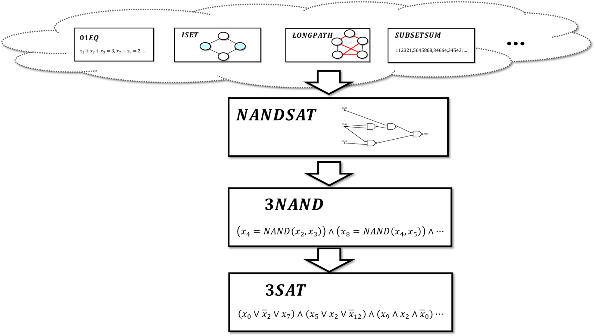
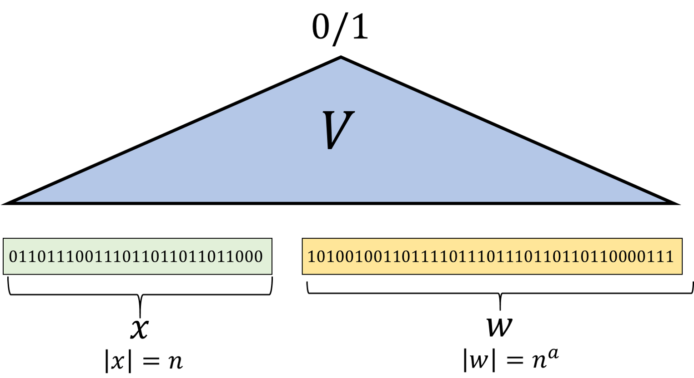
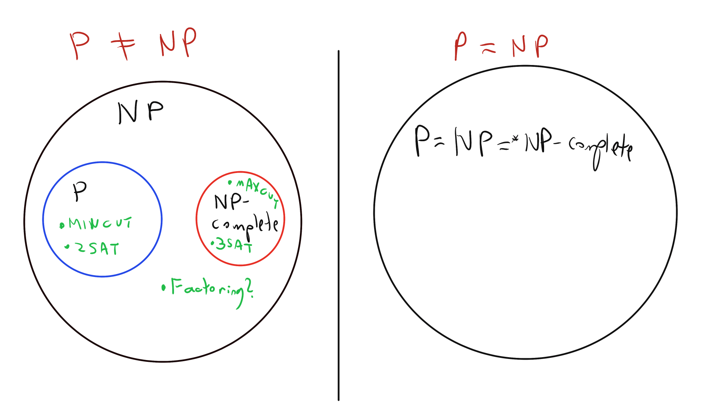
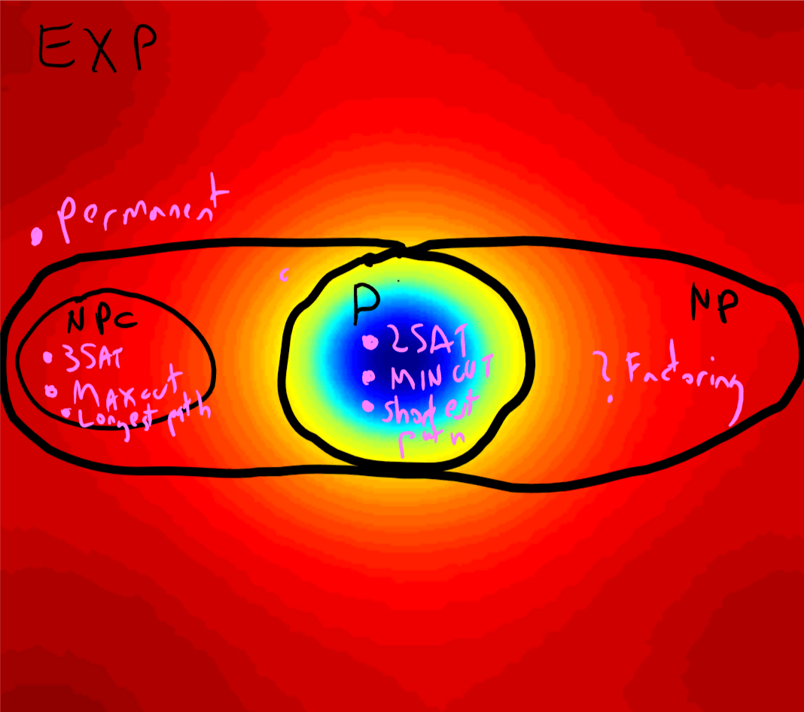

<!-- toc -->

# NP类,NP完全性以及Levin-Cook定理 { #chapnp }

## 学习目标
* 了解$\mathbf{NP}$类包含了许多重要的计算问题
* $\mathbf{NP}$-完全性: 某些问题难解的证据
* $\mathbf{P}$ vs $\mathbf{NP}$ 相关问题

```admonish quote
本论文将会给出的定理让我们推测（而不是推导）这些问题,包括类似于它们的问题,将会是永恒的难解的。——Richard Karp,1972


不幸的是,我们距离理解"2"的神秘力量仍然还有许多年……2-SAT问题是容易解决的,但是3-SAT问题却非常困难；二维的匹配非常简单,但是三维的匹配却异常困难。为什么会这样？天哪,为什么会这样？——Eugene Lawler
```

到此为止,我们已经证明了3SAT问题并不会比二次方程、独立集、最大割和最长路问题更难。但是证明这些问题在计算上等价,我们需要从其它方向给出证明。最终结果是：我们可以将所有的问题一举归约为3SAT问题。

事实上,上述的结果远远超出了那些特定问题描述的范畴。我们在上一章讨论的所有问题,以及很大一类其它问题,都具有一个共同特点：它们都是搜索类问题,且目标都是——给定一个实例$x$,判定是否存在一个解$y$使得某个条件成立,而这个条件可以在多项式时间内被验证。例如,在3SAT问题中,布尔公式就是一个实例,而它的一个解是对于变量的一个赋值；在最大割问题中,图是一个实例,而它的解则是切割的方法；诸如此类。我们最终发现,所有的类似的搜索问题都能够被归约为3SAT问题。

```admonish pic id = 'cooklevinoverviewfig'


{{pic}}{fig:cooklevinoverview} 本章内容的概览。我们用$\mathbf{NP}$来定义包含所有能够被高效验证的判定问题。本章的主要结果自然就是Cook-Levin定理（定理15.6）,该定理表明3SAT问题拥有多项式算法当且仅当$\mathbf{NP}$类具有多项式时间算法。另一种说法就是说3SAT是$\mathbf{NP}$完全的。我们将会通过定义两个中间问题NANDSAT和3NAND并证明NANDSAT是$\mathbf{NP}$完全的,从而进一步证明$NANDSAT\leq_p 3NAND \leq_p 3SAT$。
```

```admonish info title = "本章：一个直观的概述"
在这一章中我们将会了解复杂度类$\mathbf{NP}$的定义——这是本书中最重要的定义之一；还有Cook-Levin定理——这也是本书中最重要的定理之一。直觉上,复杂度类$\mathbf{NP}$对应的是容易验证结果的一类问题（例如,验证可以在多项式时间内完成）。举个例子,找到一个满足2SAT公式或者3SAT公式的赋值就是类似的问题,因为我们拥有一个对于公式的赋值,而我们可以高效地验证这个赋值是否满足所有的约束。更准确地说,$\mathbf{NP}$是一个"判定"问题的复杂度类（例如,布尔函数或者语言）,这一类问题常常对应确定一个解是否存在,尽管我们将会在16章看到,判定问题和搜索问题实际上是紧密相关的。

正如我们在2SAT和3SAR问题的例子中展示的那样,有一些$\mathbf{NP}$类中的计算问题（例如,函数）拥有多项式算法,但是有一些则还未发现是否有类似的算法。这是一个极其著名的开放问题：所有的$\mathbf{NP}$函数是否都具有多项式算法？或者说（用一点数学语言）,$\mathbf{P} = \mathbf{NP}$ 是否成立？本章,我们将会了解到某些感觉上"最难"的$\mathbf{NP}$中的函数。所谓"最难",就是说只要其中一个函数具有多项式时间算法,那么所有的$\mathbf{NP}$中的函数都具有多项式时间算法。这样的函数,我们称它们为$\mathbf{NP}$完全的。Cook-Levin定理表明,3SAT问题是$\mathbf{NP}$完全的。我们从这个定理可以构建一个复杂的多项式归约网络,目前,研究人员已经通过此定理证明了数千数学领域、自然科学、社会科学和工程学领域计算问题的$\mathbf{NP}$完全性。这些结果为我们提供了以上问题无法在最坏情况下被多项式时间算法解决的证据。
```

## 15.1 类$\mathbf{NP}$

我们下面使用数学定义使得我们之前的描述更加精确。我们将类$\mathbf{NP}$定义为所有对应上述搜索问题的布尔函数。这就是说,一个布尔函数$F$在$\mathbf{NP}$中当且仅当对于一个输入串$s$,有$F(x)=1$当且仅当存在一个串$w$作为解,且使得对于串对$(x,w)$满足某些多项式时间的检查条件。形式上,$\mathbf{NP}$类定义如下：

```admonish quote title=""
{{defc}}{def:NP}[定义15.1]

我们称$F:\{0,1\}^*\to \{0,1\}$在$\mathbf{NP}$中,若存在某个正整数$a$和对于每一个$x\in \{0,1\}^n$都有一个$V:\{0,1\}^*\to \{0,1\}$使得$V\in \mathbf{P}$。
$$
F(x)=1 \Leftrightarrow \exists_{w\in \{0,1\}^{n^a}}\quad\mathrm{s.t.}\quad V(xw)=1 \quad (15.1)
$$
```

```admonish pic id = 'npdefinitionfig'


{{pic}}{fig:npdefinition} 类$\mathbf{NP}$对应的是那些解可以被高效验证的问题。这就是说,该类中的函数$F$,当$F(x)=1$的时候,存在一个长度为关于$x$的多项式的解$w$可以被多项式时间算法$V$验证。
```

换句话说,对于任何在$\mathbf{NP}$的$F$,必然有一个多项式可计算验证函数$V$使得对于$F(x)=1$,必然存在$w$（长度为关于x的多项式）使得$V(xw)=0$。由于$w$的存在证明了$F(x)=1$,$w$通常被称为**证书**,**见证**或者**证明**使得$F(x)=1$。

对于这些内容的严格定义请参考{{ref:fig:npdefinition}}和{{ref:def:NP}}。$\mathbf{NP}$这一命名代表"非确定型多项式时间",并且由于历史原因被采用；相关内容可以在参考文献的笔记中找到。等式15.1中的字符串$w$被称为实例$x$一个解、一个证书或者一个见证。

```admonish quote title=""
{{exec}}{exe:NPaltdef}[$\mathbf{NP}$的另一定义]

证明定义15.1中的条件$|w| = |x|^\alpha$可以被条件$|w|\leq p(|x|)$替代,其中$p(|x|)$是某个多项式。也就是说,证明对于所有的函数$F:\{0,1\}^* \to \{0,1\}$, $F \in \mathbf{NP}$当且仅当存在一个多项式时间停机的图灵机$V$和一个多项式$p:\mathbb{N} \to \mathbb{N}$使得对于所有的$x\in \{0,1\}^*$,$F(x)=1$当且仅当存在$w\in\{0,1\}^*$且$|w|\leq p(|x|)$使得$V(x,w)=1$。
```

类$\mathbf{NP}$的定义表示对于任意属于该类的函数$F$和一个字符串$x\in \{0,1\}^*$,$F(x)=1$当且仅当对于这一事实存在一个"短且高效"的可验证证明。这就是说,我们可以考虑定义15.1中的函数$V$,将其作为一个验证算法,类似于我们在11.1节中看到的那样,这一个验证算法检查给定的字符串$w\in\{0,1\}^*$是否是$F(x)=1$的一个合法的证明。本质上,在数学中,所有的证明系统都包含一个可以在多项式时间运行的行级检查。因此,$\mathbf{NP}$的核心就是在询问一个陈述是否存在一个"短"的证明（也就是说,是否存在陈述多项式倍长度的证明）。的确,我们将会在16章中看到,K.哥德尔以"数学家在证明定理中的脑力工作是否可以被机器完全替代"的形式表述了$\mathbf{NP}=\mathbf{P}$的问题。

```admonish quote title=""
{{remc}}{rem:NPnotcomplement}[$\mathbf{NP}$（不一定）在补运算下封闭]

定义15.1具有非对称性,即输出$1$和输出$0$之间存在区别。你需要确保理解为什么这个定义不能保证：如果$F \in \mathbf{NP}$,那么函数$1-F$（即将$x$映射到$1-F(x)$的函数）也一定属于$\mathbf{NP}$。

事实上,人们相信确实存在某些函数$F$,使得$F\in \mathbf{NP}$但$1-F \not\in \mathbf{NP}$。例如,如下所示,$3\mathit{SAT} \in \mathbf{NP}$,但函数$\overline{3\mathit{SAT}}$（该函数在输入一个3CNF公式$\varphi$时,当且仅当$\varphi$不可满足时输出$1$）并不已知（也不被认为）属于$\mathbf{NP}$。

这与类$\mathbf{P}$形成对比,$\mathbf{P}$确实满足：如果$F\in \mathbf{P}$,那么$1-F$也属于$\mathbf{P}$。
```

### 15.1.1 $\mathbf{NP}$中的一些例子

我们现在给出一些属于类 $\mathbf{NP}$ 的函数的例子。我们从 $3\mathit{SAT}$ 函数的经典例子开始。

```admonish quote title=""
{{exec}}{exe:3SATinNP}[$3\mathit{SAT} \in \mathbf{NP}$]

$3\mathit{SAT}$ 属于 $\mathbf{NP}$,因为对于每个含有 $\ell$ 个变量的公式 $\varphi$,$3\mathit{SAT}(\varphi)=1$ 当且仅当存在一个满足赋值 $x \in \{0,1\}^\ell$ 使得 $\varphi(x)=1$,而我们可以在多项式时间内检验这一条件。

上述解释说明了为什么 $3\mathit{SAT}$ 属于 $\mathbf{NP}$,但由于这是我们的第一个例子,我们现在将详细阐述并以完整的形式展开见证 $w$ 和算法 $V$ 的精确表示,以证明 $3\mathit{SAT}$ 属于 $\mathbf{NP}$。由于证明函数属于 $\mathbf{NP}$ 相当直接,在后续例子中我们将不会使用如此多的细节,读者也可以放心跳过本例的其余部分。

根据已解决的练习15.1,见证的大小最多为输入长度 $n$ 的多项式即可,而不必精确等于某个整数 $a>0$ 的 $n^a$。具体而言,我们可以将一个含有 $k$ 个变量和 $m$ 项的 3CNF 公式 $\varphi$ 表示为长度 $n=O(m\log k)$ 的字符串,因为 $m$ 项中的每一个都涉及三个变量及其否定,而每个变量的标识可以用 $\lceil \log_2 k \rceil$ 表示。我们假设每个变量都参与某项（否则它可以被忽略）,因此 $m \geq k$,这意味着输入长度 $n$ 至少与 $m$ 和 $k$ 一样大。

我们可以用一个长度为 $k$ 的字符串 $w$ 来表示对 $k$ 个变量的赋值。{{ref:alg:3SATverifier}}可以检查给定的 $w$ 是否满足公式 $\varphi$：

算法 {{ref:alg:3SATverifier}} 需要 $O(m)$ 时间枚举所项,当且仅当 $w$ 满足所项时返回 $1$。

```admonish quote title=""
{{algc}}{alg:3SATverifier}[$3\mathit{SAT}$ 的验证器]

$$
\begin{aligned}
&\textbf{输入: }\text{含有 $k$ 个变量和 $m$ 项的 3CNF 公式 $\varphi$,字符串 $w \in \{0,1\}^k$}\\
&\textbf{输出: }\text{当且仅当 $w$ 满足 $\varphi$ 时输出 $1$}\\
&\textbf{for } j \in [m]\\
&\quad\text{令 $\ell_1 \vee \ell_2 \vee \ell_3$ 为 $\varphi$ 的第 $j$ 项}\\
&\quad\textbf{if } \text{$w$ 违反所有三个文字}\\
&\quad\quad\textbf{return } 0\\
&\quad\textbf{endif}\\
&\textbf{endfor}\\
&\textbf{return } 1\\
\end{aligned}
$$
```

```

以下是属于 $\mathbf{NP}$ 的更多问题的例子。对于其中的每一个问题,我们仅简要说明见证是如何表示的以及为什么它是可以高效验证的,但详细展开这些内容可以成为让你更熟悉定义 15.1 的好方法：

* $\mathit{QUADEQ}$ 属于 $\mathbf{NP}$,因为对于每个含有 $\ell$ 个变量的二次方程组实例 $E$,$\mathit{QUADEQ}(E)=1$ 当且仅当存在一个赋值 $x\in \{0,1\}^\ell$ 满足 $E$。我们可以通过枚举 $E$ 中的所有方程来在多项式时间内检验 $x$ 是否满足 $E$ 的条件,对于每个方程 $e$,代入 $x$ 的值并验证 $e$ 是否被满足。

* $\mathit{ISET}$ 属于 $\mathbf{NP}$,因为对于每个图 $G$ 和整数 $k$,$\mathit{ISET}(G,k)=1$ 当且仅当存在一个包含 $k$ 个顶点的集合 $S$,且 $S$ 中不包含 $G$ 中的任何一对相邻顶点。我们可以通过首先检验 $|S| \geq k$,然后枚举 $G$ 中的所有边 $\{u,v\}$,并对每条边验证 $u\not\in S$ 或 $v\not\in S$ 是否成立,从而在多项式时间内检验 $S$ 是大小至少为 $k$ 的独立集这一条件。

* $\mathit{LONGPATH}$ 属于 $\mathbf{NP}$,因为对于每个图 $G$ 和整数 $k$,$\mathit{LONGPATH}(G,k)=1$ 当且仅当在 $G$ 中存在一条长度至少为 $k$ 的简单路径 $P$。我们可以通过检验 $P$ 具有形式 $(v_0,v_1,\ldots,v_k)$,其中每个 $v_i$ 都是 $G$ 中的顶点,没有 $v_i$ 被重复,且对于每个 $i \in [k]$,边 $\{v_i,v_{i+1}\}$ 都存在于图中,从而在多项式时间内检验 $P$ 是一条长度为 $k$ 的简单路径这一条件。

* $\mathit{MAXCUT}$ 属于 $\mathbf{NP}$,因为对于每个图 $G$ 和整数 $k$,$\mathit{MAXCUT}(G,k)=1$ 当且仅当在 $G$ 中存在一个割 $(S,\overline{S})$ 切割了至少 $k$ 条边。我们可以通过检验 $S$ 是 $G$ 顶点的子集,然后枚举 $G$ 的所有边 $\{u,v\}$,统计满足 $u\in S$ 且 $v\not\in S$（或反之）的边的数量,从而在多项式时间内检验 $(S,\overline{S})$ 是一个值至少为 $k$ 的割这一条件。


### 15.1.2 类$\mathbf{NP}$的基本事实

$\mathbf{NP}$ 的定义是本书中最重要的定义之一,值得花时间仔细消化和深入理解。以下已解决的练习建立了这一复杂性类的一些基本性质。像往常一样,我强烈建议你尝试自己得出解决方案。

```admonish quote title=""
{{exec}}{exe:Verifying}[验证不比解决更难]
证明$\mathbf{P} \subseteq \mathbf{NP}$
```

```admonish quote title=""
{{remc}}{rem:NPlabel}[$\mathbf{NP}$ 不代表非多项式时间！]

人们有时会认为 $\mathbf{NP}$ 代表"非多项式时间"（non-polynomial time）。如练习15.2所示,这与事实相去甚远,实际上每个多项式时间可计算的函数也都属于 $\mathbf{NP}$。

如果 $F$ 属于 $\mathbf{NP}$,这并不意味着 $F$ 难以计算（尽管据我们所知,这也不一定意味着它容易计算）。相反,它意味着 $F$ 易于验证,这是在定义15.1的技术意义上的说法。
```

```admonish quote title=""
{{exec}}{exe:NPEXP}[$\mathbf{NP}$属于$\mathbf{EXP}$]
证明$\mathbf{NP}\subseteq \mathbf{EXP}$ 
```

练习15.2和练习15.3一起蕴含了

$$\mathbf{P} \subseteq \mathbf{NP} \subseteq \mathbf{EXP}\;.$$

时间层级定理（定理13.9）表明 $\mathbf{P} \subsetneq \mathbf{EXP}$,因此两个包含关系 $\mathbf{P} \subseteq \mathbf{NP}$ 和 $\mathbf{NP} \subseteq \mathbf{EXP}$ 中至少有一个是严格包含。人们相信事实上两者都是严格包含。也就是说,人们相信存在属于 $\mathbf{NP}$ 但不能在多项式时间内计算的函数（这就是 $\mathbf{P} \neq \mathbf{NP}$ 猜想）,并且存在属于 $\mathbf{EXP}$ 的函数 $F$,对于给定输入 $x$,我们甚至无法高效地证明 $F(x)=1$。

一个被认为属于 $\mathbf{EXP} \setminus \mathbf{NP}$ 的函数是对于每个3CNF公式 $\varphi$ 定义为 $\overline{3\mathit{SAT}}(\varphi)= 1 - 3\mathit{SAT}(\varphi)$ 的函数 $\overline{3\mathit{SAT}}$。猜想 $\overline{3\mathit{SAT}}\not\in \mathbf{NP}$ 被称为"$\mathbf{NP} \neq \mathbf{co-NP}$"猜想。它蕴含了 $\mathbf{P} \neq \mathbf{NP}$ 猜想（参见练习15.2）。

我们之前非正式地将 $F \leq_p G$ 的概念等同于 $F$ "不比 $G$ 更难",并且在练习14.1中看到,如果 $G \in \mathbf{P}$ 且 $F \leq_p G$,那么 $F \in \mathbf{P}$ 也成立。以下练习表明,如果 $F \leq_p G$,那么 $F$ 也"不比 $G$ 更难验证"。也就是说,无论 $F$ 是否属于 $\mathbf{P}$,如果 $G$ 具有其解可以被高效验证的性质,那么 $F$ 也具有这一性质。

```admonish quote title=""
{{exec}}{exe:reductionNP}[归约与$\mathbf{NP}$]
令$F,G:\{0,1\}^* \rightarrow \{0,1\}$是两个布尔函数。证明若$F \leq_p G$ 且 $G \in \mathbf{NP}$,则 $F \in \mathbf{NP}$。
```

## 15.2 从$\mathbf{NP}$到3SAT: Cook-Levin定理

我们已经看到了几个问题的例子,我们不知道它们的最佳算法是多项式时间还是指数时间的,但我们可以证明它们属于 $\mathbf{NP}$。也就是说,我们不知道它们是否容易求解,但我们确实知道验证一个给定的解是容易的。还有很多很多我们希望能够计算的有趣函数可以很容易地证明属于 $\mathbf{NP}$。相当令人惊讶的是,如果我们能解决 3SAT,那么我们就能解决所有这些问题！

以下是计算机科学中最基本的定理之一：

```admonish quote title=""
{{thmc}}{thm:CookLevin}[Cook-Levin定理]
任何属于 $\mathbf{NP}$ 的函数 $F$ 都满足 $F \leq_p 3\mathit{SAT}$。
```

我们很快将展示定理15.6的证明,但请注意,它立即蕴含了 $\mathit{QUADEQ}$、$\mathit{LONGPATH}$ 和 $\mathit{MAXCUT}$ 都可以归约到 $3\mathit{SAT}$。将它与我们在第14章中看到的归约结合起来,它蕴含了所有这些问题都是等价的！例如,要将 $\mathit{QUADEQ}$ 归约到 $\mathit{LONGPATH}$,我们可以首先使用定理15.6将 $\mathit{QUADEQ}$ 归约到 $3\mathit{SAT}$,然后使用我们在定理14.12中看到的从 $3\mathit{SAT}$ 到 $\mathit{LONGPATH}$ 的归约。也就是说,由于 $\mathit{QUADEQ} \in \mathbf{NP}$,定理15.6蕴含了 $\mathit{QUADEQ} \leq_p 3\mathit{SAT}$,而定理14.12蕴含了 $3\mathit{SAT} \leq_p \mathit{LONGPATH}$,根据归约的传递性（练习14.2）,这意味着 $\mathit{QUADEQ} \leq_p \mathit{LONGPATH}$。类似地,由于 $\mathit{LONGPATH} \in \mathbf{NP}$,我们可以使用定理15.6和定理14.4来证明 $\mathit{LONGPATH} \leq_p 3\mathit{SAT} \leq_p \mathit{QUADEQ}$,从而得出 $\mathit{LONGPATH}$ 和 $\mathit{QUADEQ}$ 在计算上是等价的。

当然,这里的 $\mathit{QUADEQ}$ 和 $\mathit{LONGPATH}$ 并没有什么特别之处：通过将定理15.6与我们看到的归约相结合,我们看到就像 $3\mathit{SAT}$ 一样,每个 $F\in \mathbf{NP}$ 都可以归约到 $\mathit{LONGPATH}$,对于 $\mathit{QUADEQ}$ 和 $\mathit{MAXCUT}$ 也是如此。从某种意义上看,所有这些问题都是"$\mathbf{NP}$ 中最难的",因为其中任何一个问题的高效算法都将蕴含 $\mathbf{NP}$ 中所有问题的高效算法。这引出了以下定义：

```admonish quote title=""
{{defc}}{def:NPhardNPC}[$\mathbf{NP}$ 困难和$\mathbf{NP}$ 完全]

设 $G:\{0,1\}^* \rightarrow \{0,1\}$。我们说 $G$ 是 **$\mathbf{NP}$ 困难的**（$\mathbf{NP}$ hard）,如果对于每个 $F\in \mathbf{NP}$,都有 $F \leq_p G$。

我们说 $G$ 是 **$\mathbf{NP}$ 完全的**（$\mathbf{NP}$ complete）,如果 $G$ 是 $\mathbf{NP}$ 困难的且 $G \in \mathbf{NP}$。
```

Cook-Levin 定理（定理15.6）可以被重新表述为说 $3\mathit{SAT}$ 是 $\mathbf{NP}$ 困难的,而且由于它也属于 $\mathbf{NP}$,这意味着 $3\mathit{SAT}$ 是 $\mathbf{NP}$ 完全的。结合第14章中的归约,定理15.6表明,尽管表面上存在差异,3SAT、二次方程、最长路径、独立集和最大割都是 $\mathbf{NP}$ 完全的。还有成千上万来自各个科学、数学、经济学、工程学和许多其他领域的额外问题已被证明是 $\mathbf{NP}$ 完全的。（欲了解更多示例,请参阅此维基百科页面和此网站。）

```admonish bigidea
{{idec}}{ide:NPCpolyimpliesall}

如果任何一个 $\mathbf{NP}$-完全问题存在多项式时间算法,那么对于每个对应于存在高效可验证解的判定问题,都存在这样的多项式时间算法。
```

### 15.2.1 这表明什么？？

正如我们在练习15.2中看到的,$\mathbf{P} \subseteq \mathbf{NP}$。计算机科学中最著名的猜想是这一包含关系是严格的。也就是说,人们广泛猜想 $\mathbf{P} \neq \mathbf{NP}$。反驳 $\mathbf{P} \neq \mathbf{NP}$ 猜想的一种方法是给出哪怕一个 $\mathbf{NP}$-完全问题的多项式时间算法,例如 3SAT、最大割,或者在人类各个活动领域中被研究过的其他数千个问题中的一个。这些问题的特点是,虽然有如此多的人研究过它们,但迄今为止没有发现任何一个的多项式时间算法,这支持了确实 $\mathbf{P} \neq \mathbf{NP}$ 的猜想。事实上,对于这些问题中的许多（包括我们上面提到的所有问题）,我们甚至不知道是否存在 $2^{o(n)}$ 时间算法！然而,令计算机科学家沮丧的是,我们还未能证明 $\mathbf{P}\neq\mathbf{NP}$,甚至不能排除 3SAT 存在 $O(n)$ 时间算法的可能性。解决 $\mathbf{P}$ 是否等于 $\mathbf{NP}$ 的问题被称为 $\mathbf{P}$ vs $\mathbf{NP}$ 问题。解决这个问题将获得百万美元的奖金,有人为此写了畅销书,每年都有新论文声称证明了 $\mathbf{P}=\mathbf{NP}$ 或 $\mathbf{P}\neq\mathbf{NP}$,但遗憾的是,它们都在仔细审查下被推翻。


```admonish pic id = 'pnpscenariofig'


{{pic}}{fig:pnpscenario} 如果 $\mathbf{P}\neq \mathbf{NP}$（左）和 $\mathbf{P}=\mathbf{NP}$（右）时的世界。在前一种情况下,$\mathbf{NP}$-完全问题集与 $\mathbf{P}$ 不相交,而且 Ladner 定理表明存在既不属于 $\mathbf{P}$ 也不是 $\mathbf{NP}$-完全的问题。（这类问题的自然候选例子出奇地少,一些突出的例子包括整数分解、格中最短向量和寻找纳什均衡等问题的判定变体。）在后一种情况 $\mathbf{P}=\mathbf{NP}$ 下,$\mathbf{NP}$-完全性的概念失去了意义,因为本质上 $\mathbf{P}$ 中的所有函数（除了平凡的常数零和常数一函数）都是 $\mathbf{NP}$-完全的。
```

计算的奥秘之一是人们观察到了自然问题计算复杂性中的某种经验性"零一律"或"二分性",即许多自然问题要么属于 $\mathbf{P}$（通常在 $\mathit{TIME}(O(n))$ 或 $\mathit{TIME}(O(n^2))$ 中）,要么是 $\mathbf{NP}$ 困难的。这与这样一个事实有关：对于大多数自然问题,已知的最佳算法要么是指数时间的,要么是多项式时间的,没有太多例子表明最佳运行时间是某种奇怪的中间复杂性,如 $2^{2^{\sqrt{\log n}}}$。然而,人们相信存在属于 $\mathbf{NP}$ 但既不属于 $\mathbf{P}$ 也不是 $\mathbf{NP}$-完全的问题,而且一个被称为"Ladner 定理"的结果表明,如果 $\mathbf{P} \neq \mathbf{NP}$,那么事实确实如此（另见练习15.1和{{ref:fig:pnpscenario}}）。

```admonish pic id = 'pnpmapfig'


{{pic}}{fig:pnpmap} 指数时间问题（猜想）状态的大致示意图。颜色越深表示运行时间越长,中间的圆圈代表 $\mathbf{P}$ 中的问题。$\mathbf{NP}$ 是 $\mathbf{P}$ 的（猜想为真的）超类,而 $\mathbf{NP}$-完全问题（或简写为 $\mathbf{NPC}$）是 $\mathbf{NP}$ 中"最难"的问题,在这个意义上,解决其中一个问题就意味着能解决 $\mathbf{NP}$ 中的所有其他问题。人们猜想所有 $\mathbf{NP}$-完全问题至少需要 $\exp(n^\epsilon)$ 时间来解决,其中 $\epsilon>0$ 是某个常数,而且许多问题需要 $\exp(\Omega(n))$ 时间。积和式（permanent）被认为不属于 $\mathbf{NP}$,尽管它是 $\mathbf{NP}$-困难的,这意味着它的多项式时间算法将蕴含 $\mathbf{P}=\mathbf{NP}$。
```

### 15.2.2 Cook-Levin定理：证明概览

我们现在将证明 Cook-Levin 定理,这是从 3SAT 到许多伟大领域中数千个问题的巨大归约网络的基础。一些已被证明是 $\mathbf{NP}$-完全的问题包括：最小能量蛋白质折叠、最小表面积泡沫构型、地图着色、最优纳什均衡、量子态纠缠、基因组的最小超序列、最小码字问题、格中的最短向量、最小亏格纽结、正丢番图方程、整数规划,以及很多很多其他问题。所有这些问题的最坏情况复杂性（至多相差多项式因子）与 3SAT 等价,并且通过 Cook-Levin 定理,与 $\mathbf{NP}$ 中的所有问题等价。

为了证明定理15.6,我们需要证明对于每个 $F\in \mathbf{NP}$,都有 $F \leq_p 3\mathit{SAT}$。我们将分三个阶段来完成。我们定义两个中间问题：$\mathit{NANDSAT}$ 和 $3\mathit{NAND}$。我们很快将展示这两个问题的定义,但定理15.6将由以下三个结果组合得出：

1. $\mathit{NANDSAT}$ 是 $\mathbf{NP}$ 困难的（引理15.8）。

2. $\mathit{NANDSAT} \leq_p 3\mathit{NAND}$（引理15.9）。

3. $3\mathit{NAND} \leq_p 3\mathit{SAT}$（引理15.10）。

根据归约的传递性,对于每个 $F \in \mathbf{NP}$,我们有

$$ F \leq_p \mathit{NANDSAT} \leq_p 3\mathit{NAND} \leq_p 3\mathit{SAT} $$

从而确立了定理15.6。

我们将逐一证明这三个结果——引理15.8、引理15.9和引理15.10,并在证明过程中提供所需的定义。


## 15.3 $\mathit{NANDSAT}$,以及它为什么是$\mathbf{NP}$-困难的

