```admonish warning title = ""
❗**页面施工中**: 目前状态: 翻译完成. 正文开放debug, 需要精修.

待办: 

- ✅将所有numthm环境用灰色admonish(quote)框起.
- ✅修复对NANDsfromActivationfunctionex(于习题)的引用.
- ✅标点符号统一为英文.
- ✅<a>标签换成<span>.
- ⬛️修复对cellularautomatasec(8.4节)的引用, 需要等候翻译进度.
- ⬛️修复对chapequivalentmodels(第7章)的引用, 需要等候翻译进度.
- ⬛️修复对functionprogramidea, secimplvsspec(第2章)的引用.
- ⬛️修复结尾传记部分的文献引用.
```

# 定义计算 {#compchap }

```admonish quote title = ""
*"没有理由不借助机器来节省脑力劳动和体力劳动. "* -- Charles Babbage, 1852   

*"如果有谁不以我的例子为戒, 而尝试并成功地用不同的原理或更简单的机械手段, 构造出一台在自身中体现数学分析执行部门全部功能的机器, 那么我丝毫不担心将我的声誉交付于他, 因为唯有他能完全理解我努力的性质及其成果的价值. "* -- Charles Babbage, 1864 

*"要理解一个程序, 你必须既成为机器, 又成为程序. "* -- Alan Perlis, 1982
```

## 学习目标 {.objectives  }
* 理解计算可以被精确建模.   
* 学习 **布尔电路** / **直线程序** 的计算模型.   
* 电路与直线程序的等价性.   
* $\AND$/$\OR$/$\NOT$ 与 $\NAND$ 的等价性.   
* 物理世界中的计算实例.  

## 目录

<!-- toc -->

```admonish quote title = ""
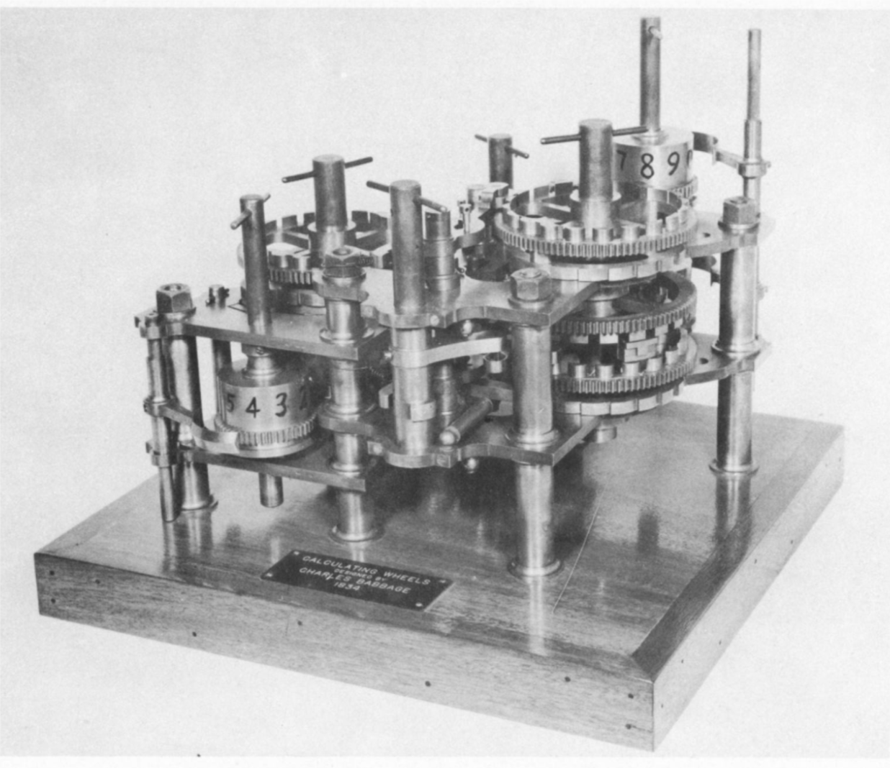
Charles Babbage的计算轮. 图片取自 Harvard Mark I 计算机的"操作手册". 
```
```admonish quote title = ""

摘自 **Popular Mechanics** 上的一篇关于 Harvard Mark I 计算机的[文章](http://sites.harvard.edu/~chsi/markone/about.html), 1944 年.
```

几千年来, 人类一直在进行计算, 不仅依靠纸笔, 还使用过算盘、计算尺、各种机械装置, 直到现代的电子计算机. 从先验的角度来看, **计算**这一概念似乎总是依赖于所使用的具体工具. 例如, 你也许会认为, 在现代笔记本电脑上用 **Python** 实现的乘法算法, 与用纸笔进行乘法运算时的"最佳"算法会有所不同.   

然而, 正如我们在[引言](chapter_0.md)中所看到的, 一个在渐近意义上更优的算法, 无论底层技术如何, 最终都会优于较差的算法. 这让我们看到希望: 可以找到一种**独立于技术**的方式来刻画计算的概念.   

本章正是要做这件事. 我们将把"从输入计算输出"定义为一系列基本操作的应用 (见[下图](#compchapwhatvshowfig)) . 借助这一框架, 我们便能精确地表述诸如: "函数 $f$ 可以由模型 $X$ 计算"或"函数 $f$ 可以由模型 $X$ 在 $s$ 步操作内计算完成"这样的命题.   

```admonish quote title = ""
<span id="compchapwhatvshowfig"> 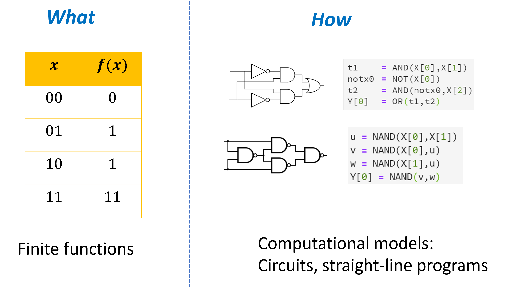 </span>
一个将字符串映射到字符串的函数, **规定**了一项计算任务, 也就是说, 它描述了输入与输出之间所期望的关系. 在本章中, 我们将定义一些模型, 用来**实现**这些计算过程, 从而达到所需的关系, 也就是描述**如何**根据输入来计算输出. 我们将看到若干此类模型的例子, 包括布尔电路和直线型编程语言. 
```

```admonish info title = "简要概述"
阅读本章, 我们希望读者能够有以下收获: 

* 我们可以使用 **逻辑运算**, 如 $\AND$(与)、$\OR$(或) 和 $\NOT$(非), 从输入计算输出 (见 [3.2节](#andornotsec)) . 

* **布尔电路** 是一种通过组合基本逻辑运算来计算更复杂函数的方法 (见 [3.3节](#booleancircuitsec)) .   
  我们既可以将布尔电路看作一种数学模型 (基于有向无环图) , 也可以将其视为现实世界中可实现的物理装置. 实现方式多种多样, 不仅包括基于硅的半导体, 还包括机械甚至生物机制 (见 [3.5节](#physicalimplementationsec)) . 

* 我们还可以把布尔电路描述为 **直线型程序**, 即不包含循环结构的程序 (没有 `while` / `for` / `do .. until` 等)  (见 [3.4节](#starightlineprogramsec)) . 

* 可以通过 $\NAND$ 运算来实现 $\AND$、$\OR$ 和 $\NOT$ 运算 (反之亦然) .   
  这意味着带有 $\AND$/$\OR$/$\NOT$ 门的电路, 与带有 $\NAND$ 门的电路在计算能力上是**等价的**, 我们可以根据需要选择其中任一模型来描述计算 (见 [3.6节](#nandsec)) .   
  先提前剧透一下, 在 [下一章](chapter_4.md) 中我们将看到, 这类电路可以计算**所有有限函数**. 

本章的一个"大思想"是 **模型之间的等价性** (见[下文](#equivalencemodels)) . 如果两个计算模型能够计算相同集合的函数, 那么它们就是**等价的**. 布尔电路 ($\AND$/$\OR$/$\NOT$ 门) 与 $\NAND$ 电路的等价性只是一个例子, 本书中我们还会多次遇到类似的普遍现象. 
```


## 3.1 定义计算

"算法"一词来源于对穆罕默德·伊本·穆萨·花剌子密(Muhammad ibn Musa al-Khwarizmi)名字的拉丁化转写. al-Khwarizmi 是九世纪的一位波斯学者, 他的著作向西方世界介绍了十进位值制数字系统, 以及一次方程与二次方程的解法 (见 [下图](#alKhwarizmi)) . 然而, 以今天的标准来看, al-Khwarizmi 对算法的描述的形式化程度相当不足. 他没有使用如 $x,y$ 这样的**变量**, 而是采用具体的数字 (如 10 和 39) , 并依赖读者从这些例子中自行类推出一般情况--这与当今儿童学习算法时的教学方式颇为相似.   

以下是 al-Khwarizmi 对解形如 $x^2 + bx = c$ 方程的算法的描述: 

```admonish quote title = "如何解形如'平方与根的和等于某数'的方程"
举例来说: "一个平方加上它的十倍平方根等于三十九迪拉姆. " 换句话说, 求这样一个平方数: 它加上它自身的十倍平方根, 结果是三十九.   

解法如下:   
1. 将根的数量减半, 本例中十的一半是五.   
2. 将这个数 (五) 平方, 得到二十五.   
3. 将平方结果加到三十九上, 得到六十四.   
4. 取六十四的平方根, 得到八.   
5. 从平方根中减去根数量的一半 (五) , 余数为三.   

因此, 这个平方根为三, 对应的平方为九.   
```

```admonish quote title = ""
<span id = "alKhwarizmi"></span>
代数学手稿中的文字页, 展示了解两类二次方程的几何解法. 馆藏号: MS. Huntington 214, 页码 fol. 004v-005r
```
```admonish quote title = ""
<span id="childrenalg"></span>

面向儿童的两位数加法算法讲解.
```

为了本书的目的, 我们需要一种更加精确的方式来描述算法. 幸运 (或者说不幸) 的是, 至少目前, 计算机在从实例中学习方面远远落后于学龄儿童. 因此, 在 20 世纪, 人们提出了用于精确描述算法的形式化语言, 即 **编程语言**.   

下面是用 **Python** 转写的 al-Khwarizmi 二次方程求解算法: 

```python
from math import sqrt
# 使用 Python 的 sqrt 函数来计算平方根

def solve_eq(b, c):
    # 根据 al-Khwarizmi 的方法求解 x^2 + b*x = c
    # al-Khwarizmi 在 b=10, c=39 的例子中演示了这个方法

    val1 = b / 2.0  # "将根的数量减半"
    val2 = val1 * val1  # "将这个数平方"
    val3 = val2 + c  # "将平方结果加到 c 上"
    val4 = sqrt(val3)  # "取和的平方根"
    val5 = val4 - val1  # "从平方根中减去根数量的一半"
    return val5  # "这就是所求的平方根"

# 测试: 求解 x^2 + 10*x = 39
print(solve_eq(10, 39))
# 输出 3.0
```
我们可以非正式地定义算法如下: 

```admonish quote title=""
{{defc}}{defofalg}[算法的非正式定义] **算法**是一组指令, 用于通过执行一系列"基本步骤"从输入计算出输出. 如果对于每一个输入 $x$, 按照算法 $A$ 的指令操作都能得到输出 $F(x)$, 则称算法 $A$ **计算**函数 $F$. 
```

在本章中, 我们将使用 **布尔电路 (Boolean Circuits)** 模型, 更精确而正式地定义算法. 我们将展示, 布尔电路在计算能力上等价于用"极简"编程语言编写的 **直线程序 (straight line programs)**, 即不包含循环的编程语言. 我们还将看到, 具体选择哪种 **基本运算 (elementary operations)** 并不重要, 不同的选择都可以得到计算能力等价的模型 (见[下图](#compchapoverviewfig)). 然而, 要理解这一点, 我们需要一些时间. 我们将从讨论什么是"基本运算"开始, 并说明如何将算法的描述映射为实际物理过程, 使其在现实世界中从输入生成输出. 

```admonish quote title = ""
<span id="compchapoverviewfig"> ![An overview of the computational models defined in this chapter. We will show several equivalent ways to represent a recipe for performing a finite computation. Specifically we will show that we can model such a computation using either a _Boolean circuit_ or a _straight line program_, and these two representations are equivalent to one another. We will also show that we can choose as our basic operations either the set $\{ \AND , \OR , \NOT \}$ or the set $\{ \NAND \}$ and these two choices are equivalent in power. By making the choice of whether to use circuits or programs, and whether to use   $\{ \AND , \OR , \NOT \}$ or  $\{ \NAND \}$ we obtain four equivalent ways of modeling finite computation. Moreover, there are many other choices of sets of basic operations that are equivalent in power.](./images/chapter3/compcharoverview.png)</span>
本章定义的计算模型概览. 我们将展示几种等价的方式来表示执行有限计算的"操作方法". 具体而言, 我们将证明, 可以使用 **布尔电路 (Boolean circuit)** 或 **直线程序 (straight line program)** 来表示这样的计算, 且这两种表示方式在计算能力上是等价的. 我们还将展示, 作为基本运算, 我们可以选择集合 $\{ \AND , \OR , \NOT \}$ 或集合 $\{ \NAND \}$, 这两种选择在计算能力上也是等价的. 通过选择使用电路还是程序, 以及选择 $\{ \AND , \OR , \NOT \}$ 还是 $\{ \NAND \}$, 我们可以得到四种等价的有限计算建模方法. 此外, 还有许多其他基本操作集合的选择, 它们在计算能力上同样是等价的. 
```

## 3.2 使用与($\AND$), 或($\OR$), 非($\NOT$)进行计算 { #andornotsec }

算法的表示需要将一个**较为复杂**的计算分解为一系列**更简单**的步骤. 这些步骤可以通过多种不同的方式来执行, 包括: 

* 在纸上书写符号.   
* 改变电线中的电流.   
* 蛋白质与 DNA 链结合.   
* 集体中的个体对刺激做出反应 (例如, 蜂群中的蜜蜂, 市场中的交易者) .   

为了形式化地定义算法, 我们尝试"化繁为简", 挑出组成算法的"最小单位", 例如下列一组简单逻辑函数:

* 与函数 $\AND:\{0,1\}^2 \rightarrow \{0,1\}$ 定义为

$$\AND(a,b) = \begin{cases} 1 & a=b=1 \\ 0 & \text{otherwise} \end{cases}$$

* 或函数 $\OR:\{0,1\}^2 \rightarrow \{0,1\}$ 定义为

$$\OR(a,b) = \begin{cases} 0 & a=b=0 \\ 1 & \text{otherwise} \end{cases}$$

* 非函数 $\NOT:\{0,1\} \rightarrow \{0,1\}$ 定义为

$$\NOT(a) = \begin{cases} 0 & a = 1 \\ 1 & a = 0 \end{cases}$$

函数 $\AND$、$\OR$ 和 $\NOT$ 是逻辑学以及许多计算机系统中使用的基本逻辑运算符. 在逻辑学中, $\AND(a,b)$ 表示为 $a \wedge b$, $\OR(a,b)$ 表示为 $a \vee b$, $\NOT(a)$ 表示为 $\overline{a}$ 或 $\neg a$, 我们也将采用这种表示法. 

每一个函数 $\AND, \OR, \NOT$ 都以一个或两个单比特作为输入, 并输出一个单比特. 尽管这些运算看起来相当基本, 然而, 计算的威力正来源于**将这些简单的运算组合在一起**. 


~~~admonish example title="例: 用 $\\\AND$,$\\\OR$ 和 $\\\NOT$ 写出多数函数 $\\\text{MAJ}$"
考虑函数 $\text{MAJ}:\{0,1\}^3 \rightarrow \{0,1\}$, 其定义如下: 

$$
\text{MAJ}(x) = \begin{cases}
1 & x_0 + x_1 + x_2 \geq 2 \\
0 & \text{otherwise}
\end{cases} \;.
$$

也就是说, 对于每个 $x\in \{0,1\}^3$, 当且仅当 $x$ 的三个元素中至少有两个等于 $1$ 时, $\text{MAJ}(x)=1$. 你能用 $\AND$、$\OR$ 和 $\NOT$ 写出一个计算 $\text{MAJ}$ 的公式吗？ (此处建议你先停下来自己推导公式. 提示: 虽然某些函数需要用到 $\NOT$, 但计算 $\text{MAJ}$ 不需要使用它. ) 

我们先用文字重新表述 $\text{MAJ}(x)$: "当且仅当存在一对不同的元素 $i,j$, 且 $x_i$ 和 $x_j$ 都等于 $1$ 时, $\text{MAJ}(x)=1$. "  
换句话说, $\text{MAJ}(x)=1$ 当且仅当 **$x_0=1$ 且 $x_1=1$**, **或** **$x_1=1$ 且 $x_2=1$**, **或** **$x_0=1$ 且 $x_2=1$**. 

由于三个条件 $c_0, c_1, c_2$ 的 $\OR$ 可以写作 $\OR(c_0, \OR(c_1, c_2))$, 我们可以将其翻译为如下公式: 

$$
\text{MAJ}(x_0,x_1,x_2) = \OR\left(\AND(x_0,x_1),\OR \bigl(\AND(x_1,x_2),\AND(x_0,x_2)\bigr)\right). {{numeq}}{eqmajandornot}
$$

回想一下, 我们也可以将 $\OR(a,b)$ 写作 $a \vee b$, 将 $\AND(a,b)$ 写作 $a \wedge b$. 使用这种符号表示, 公式 {{eqref: eqmajandornot}} 也可以写作: 

$$\text{MAJ}(x_0,x_1,x_2) = ((x_0 \wedge x_1) \vee (x_1 \wedge x_2)) \vee (x_0 \wedge x_2)\;.$$

我们也可以将公式 {{eqref:eqmajandornot}} 以"编程语言"的形式表示: 将其表达为一组指令, 用于在给定基本操作 $\AND, \OR, \NOT$ 的情况下计算 $\text{MAJ}$: 

```python
def MAJ(X[0],X[1],X[2]):
    firstpair  = AND(X[0],X[1])
    secondpair = AND(X[1],X[2])
    thirdpair  = AND(X[0],X[2])
    temp       = OR(secondpair,thirdpair)
    return OR(firstpair,temp)
```
<iframe src="https://trinket.io/embed/python/5ead2eab1b" width="100%" height="600" frameborder="0" marginwidth="0" marginheight="0" allowfullscreen></iframe>
~~~

### 3.2.1 $\AND$ 和 $\OR$ 的一些性质

与标准的加法和乘法类似, 函数 $\AND$ 和 $\OR$ 满足**交换律**: $a \vee b = b \vee a$ 和 $a \wedge b = b \wedge a$, 以及**结合律**: $(a \vee b) \vee c = a \vee (b \vee c)$ 和 $(a \wedge b) \wedge c = a \wedge (b \wedge c)$.   

于是如同加法和乘法的情况, 我们通常可以省略括号, 将 $((a \vee b) \vee c) \vee d$ 写作 $a \vee b \vee c \vee d$, 对更多项的 $\AND$ 和 $\OR$ 同理.   

它们还满足分配律的一种变体: 
```admonish quote title=""
{{exec}}{distributivelaw}[$\AND$ 与 $\OR$ 满足分配律] 
证明: 对于任意 $a,b,c \in \{0,1\}$, 都有
$$
  a \wedge (b \vee c) = (a \wedge b) \vee (a \wedge c). 
$$
```

```admonish solution collapsible=true, title = "解答" 
我们可以通过枚举 $a,b,c \in \{0,1\}$ 的所有 $8$ 种可能取值来证明这一点, 但它也可以直接从标准的分配律推导出来.   

假设我们将任意正整数视为"真", 将零视为"假". 那么对于每个数 $u,v \in \mathbb{N}$, $u+v$ 为正当且仅当 $u \vee v$ 为真, 而 $u \cdot v$ 为正当且仅当 $u \wedge v$ 为真.   

这意味着对于每个 $a,b,c \in \{0,1\}$, 表达式 $a \wedge (b \vee c)$ 为真当且仅当 $a \cdot (b+c)$ 为正, 而表达式 $(a \wedge b) \vee (a \wedge c)$ 为真当且仅当 $a \cdot b + a \cdot c$ 为正.   

根据标准的分配律 $a \cdot (b+c) = a \cdot b + a \cdot c$, 因此前者表达式为真当且仅当后者表达式为真. 
```


### 3.2.2 扩展例子: 计算异或($\XOR$) {#xoraonexample}

让我们看看如何用方才的基本运算得到一种新运算. 定义 $\XOR:\{0,1\}^2 \rightarrow \{0,1\}$ 为函数 $\XOR(a,b) = a + b \mod 2$. 也就是说, $\XOR(0,0) = \XOR(1,1) = 0$, $\XOR(1,0) = \XOR(0,1) = 1$.   

我们指出, 可以仅使用 $\AND$、$\OR$ 和 $\NOT$ 来构造 $\XOR$. 

```admonish pause title = "暂停一下"
像往常一样, 一个很好的练习是在继续阅读之前, 先尝试自己用 $\AND$、$\OR$ 和 $\NOT$ 算法推导出 $\XOR$ 的实现方法. 
```

以下算法使用 $\AND$、$\OR$ 和 $\NOT$ 来计算 $\XOR$: 

```admonish quote title=""
{{algc}}{XORfromAONalg}[用 $\AND$, $\OR$ 与 $\NOT$ 计算 $\XOR$]

$
  \begin{array}{l}
  \mathbf{Input:}\ a,b \in \{0,1\} \\
  \mathbf{Output:}\ \XOR(a,b) \\
  \hline
  \mathbf{Step 1:}\ w_1 \leftarrow \AND(a,b) \\
  \mathbf{Step 2:}\ w_2 \leftarrow \NOT(w_1) \\
  \mathbf{Step 3:}\ w_3 \leftarrow\OR(a,b) \\
  \mathbf{Step 4: return}\ \AND(w_2,w_3)
  \end{array}
$
```
```admonish quote title=""
{{lemc}}{alganalaysis}
对于每个 $a,b \in \{0,1\}$, 在输入 $a,b$ 时, {{ref: XORfromAONalg}} 输出 $a + b \mod 2$. 
```

```admonish proof collapsible=true, title = "证明"
对于任意 $a,b$, 有 $\XOR(a,b)=1$ 当且仅当 $a$ 与 $b$ 不同. 
令 $w1 = \AND(a,b)$, $w2 = \NOT(\AND(a,b))$, $w3 = \OR(a,b)$. 则在输入 $a,b \in \{0,1\}$ 时, {{ref: XORfromAONalg}} 输出  
$$
\AND(w2, w3)
$$ 
* 如果 $a=b=0$, 则 $w3 = \OR(a,b) = 0$, 因此输出为 $0$. 

* 如果 $a=b=1$, 则 $\AND(a,b) = 1$, 所以 $w2 = \NOT(\AND(a,b)) = 0$, 输出为 $0$. 

* 如果 $a=1$ 且 $b=0$ (或反之) , 则 $w3 = \OR(a,b) = 1$ 且 $w1 = \AND(a,b) = 0$, 此时算法输出  
$$
\AND(\NOT(w1), w3) = 1.
$$
```

我们也可以用编程语言来描述 {{ref: XORfromAONalg}}. 特别, 以下是 $\XOR$ 函数的 **Python** 实现:

```python
def AND(a,b): return a*b
def OR(a,b):  return 1-(1-a)*(1-b)
def NOT(a):   return 1-a

def XOR(a,b):
    w1 = AND(a,b)
    w2 = NOT(w1)
    w3 = OR(a,b)
    return AND(w2,w3)

# 一个测试
print([f"XOR({a},{b})={XOR(a,b)}" for a in [0,1] for b in [0,1]])
# ['XOR(0,0)=0', 'XOR(0,1)=1', 'XOR(1,0)=1', 'XOR(1,1)=0']
```

```admonish quote title=""
{{exec}}{xorthreebits}[在三个输入上计算 $\XOR$]
定义 $\XOR_3:\{0,1\}^3\to\{0,1\}$ 为 $\XOR_3(a,b,c)=a+b+c\pmod 2$. 也就是说, 当 $a+b+c$ 为奇数时 $\XOR_3(a,b,c)=1$, 否则 $\XOR_3(a,b,c)=0$. 证明可以仅用 $\AND$、$\OR$ 和 $\NOT$ 三种逻辑运算来计算 $\XOR_3$. 你可以将其表示为公式、使用诸如 Python 的编程语言实现, 或构造相应的布尔电路. 
```
~~~admonish solution collapsible=true, title = "解答"
模 2 加法具有与通常加法相同的 **结合律** ($(a+b)+c=a+(b+c)$) 和 **交换律** ($a+b=b+a$).   
这意味着, 如果我们定义 $a \oplus b = a+b \pmod 2$, 那么  
$$
\XOR_3(a,b,c) = (a \oplus b) \oplus c
$$
换句话说,   
$$
\XOR_3(a,b,c) = \XOR(\XOR(a,b),c) \;.
$$

由于我们已经知道如何仅用 $\AND$、$\OR$ 和 $\NOT$ 来计算 $\XOR$, 因此可以将其组合起来, 用同样的基本运算实现 $\XOR_3$. 在 Python 中, 这可以写作如下程序: 

```python
def XOR3(a,b,c):
    w1 = AND(a,b)
    w2 = NOT(w1)
    w3 = OR(a,b)
    w4 = AND(w2,w3)
    w5 = AND(w4,c)
    w6 = NOT(w5)
    w7 = OR(w4,c)
    return AND(w6,w7)

# 一个小测试
print([f"XOR3({a},{b},{c})={XOR3(a,b,c)}" for a in [0,1] for b in [0,1] for c in [0,1]])
# ['XOR3(0,0,0)=0', 'XOR3(0,0,1)=1', 'XOR3(0,1,0)=1', 'XOR3(0,1,1)=0', 'XOR3(1,0,0)=1', 'XOR3(1,0,1)=0', 'XOR3(1,1,0)=0', 'XOR3(1,1,1)=1']
```
<iframe src="https://trinket.io/embed/python/0e71e3fcaa" width="100%" height="600" frameborder="0" marginwidth="0" marginheight="0" allowfullscreen></iframe>
~~~

```admonish pause title="暂停一下"
尝试将上述例子推广, 构造一种对任意正整数 $n$ 都适用的方法, 用不超过 $4n$ 个基本步骤计算函数 $ \XOR_n:\{0,1\}^n \rightarrow \{0,1\}$.   
这里每一"基本步骤"指的是对某个已知输出或先前计算得到的值, 应用集合 $\{\AND,\OR,\NOT\}$ 中的某个布尔运算. 
```


### 3.2.3 非正式地定义"基本运算"和"算法"

我们已经看到, 通过组合应用 $ \AND $、$ \OR $ 和 $ \NOT $ 可以得到一些有趣的函数. 这启发我们将 $ \AND $、$ \OR $ 和 $ \NOT $ 视为我们的**基本运算**, 从而给出如下关于**算法**的定义: 
```admonish quote title=""
{{defc}}{semidefofalg}[算法的半形式化定义]一个**算法**由一系列步骤组成, 每一步的形式是: "通过将 $ \AND $、$ \OR $ 或 $ \NOT $ 应用于先前计算得到的值 (假定输入也已计算得到) , 来计算一个新值". 若对于函数 $F$ 的任意输入 $x$, 当我们将 $x$ 作为算法 $A$ 的输入时, 其最后一步计算出的值为 $F(x)$, 则称算法 $A$ **计算**了函数 $F$. 
```
这一定义引出了若干值得关注的问题: 

1. 首先, 这一定义确实过于非正式. 我们既没有精确说明每一步到底做了什么, 也没有明确"将 $x$ 作为输入"究竟是什么意思. 

2. 其次, 选择 $ \AND $、$ \OR $ 或 $ \NOT $ 看起来相当任意. 为什么不是 $ \XOR $ 和 $ \text{MAJ} $？为什么不允许加法和乘法这样的运算？又或者其他逻辑结构, 例如 `if/then` 或 `while`？

3. 第三, 我们是否确信该定义真的与实际计算有关？如果有人给出了这种算法的描述, 我们是否真的能够在现实中用它来计算相应的函数？

```admonish pause title="暂停一下"
这些问题将在很大程度上引导我们接下来的章节. 因此, 建议你重新阅读上述非正式定义, 并思考自己对这些问题的看法. 
```

本书的很大一部分内容将致力于回答上述问题. 我们将看到: 

1. 我们可以把算法的定义完全形式化, 从而为"算法 $A$ 计算函数 $f$"这样的表述赋予精确的数学含义. 

2. 虽然选择 $ \AND $ / $ \OR $ / $ \NOT $ 看似任意, 我们本可以选择其他函数, 但实际上这种选择影响不大. 我们会看到, 即使改用加法和乘法, 或者几乎任何可以合理视为基本步骤的操作, 我们依然能够得到相同的计算能力. 

3. 事实证明, 我们确实可以在现实世界中计算这种基于 $ \AND $ / $ \OR $ / $ \NOT $ 的算法. 首先, 这样的算法定义清晰, 因此人类可以用纸和笔逐步执行. 其次, 这种计算可以通过多种方式**机械化**. 我们已经看到, 可以编写 Python 程序来对应执行这样的指令序列. 而实际上, 还可以通过被称为**晶体管**的元件, 用电子信号直接实现 $ \AND $、$ \OR $ 和 $ \NOT $ 等操作. 这正是现代电子计算机的工作方式. 

在本章余下的内容以及本书后续部分, 我们将开始回答这些问题. 我们会看到更多简单操作组合出复杂操作的实例, 包括加法、乘法、排序等. 同时, 我们还会讨论如何通过多种技术**物理实现** $ \AND $、$ \OR $ 和 $ \NOT $ 等基本操作. 

## 3.3 布尔电路  {#booleancircuitsec }

```admonish quote title = ""

逻辑运算或"门"的标准符号包括 $ \AND $、$ \OR $、$ \NOT $, 以及在[3.6节](#nandsec)中讨论的 $ \NAND $ 运算. 
```
```admonish quote title = ""
<span id="smallandornotcircxorfig">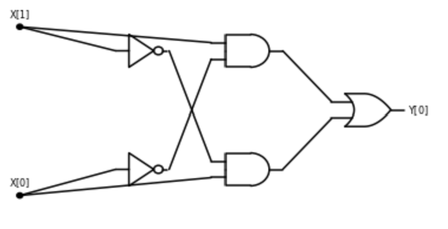</span>
一个由 $ \AND $、$ \OR $ 和 $ \NOT $ 门构成的, 用于计算 $ \XOR $ 函数的电路. 
```

**布尔电路**提供了"组合基本运算"的精确定义. 一个布尔电路 (参见[下图](#boolancircfig)) 由**门**和**输入**组成, 并通过**导线**连接.   

**导线**传递的信号表示值 $0$ 或 $1$, 每个门对应 $\OR$、$\AND$ 或 $\NOT$ 运算. 一个 $\OR$ 门有两条输入导线和一条或多条输出导线, 如果这两条输入导线的信号分别为 $a$ 和 $b$ ($a,b \in \{0,1\}$) , 则输出导线上的信号为 $\OR(a,b)$. $\AND$ 和 $\NOT$ 门的定义类似.   

**输入端**只有输出导线. 如果我们将某个输入设为 $a \in \{0,1\}$, 则该值会沿其所有输出导线传播. 我们还将一些门指定为**输出门**, 其值对应于电路的计算结果. 例如, [上图](#smallandornotcircxorfig) 给出了一个用于计算 $\XOR$ 函数的电路, 参考 [节3.2.2](#xoraonexample). 

对于一个 $n$ 输入的布尔电路 $C$, 我们在输入端放置 $x \in \{0,1\}^n$ 的比特, 然后沿导线传播信号, 直到到达输出端, 从而完成电路的计算, 参见 [下图](boolancircfig). 

```admonish remark title="布尔电路的物理电路模拟" 
<span id= "booleancircimprem"></span>

布尔电路是一种 **数学模型**, 不一定直接对应于物理对象, 但它们可以被物理电路模拟.   

在电路中, 信号通常通过导线上的电位 (**电压**) 来[表示](https://goo.gl/gntTQE). 例如, 高于某一电压水平被解释为逻辑值 $1$, 低于某一电压水平被解释为逻辑值 $0$.   

[3.5节](#physicalimplementationsec) 讨论了布尔电路的物理实现, 包括使用电信号 (如硅基电路) 、生物实现以及机械实现的实例. 
```

```admonish quote title=""
<span id="boolancircfig">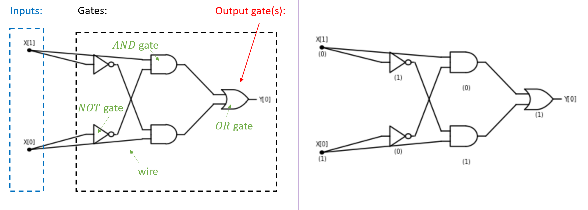</span>
一个**布尔电路**由**门**组成, 这些门通过**导线**彼此连接, 并与**输入端**相连.   

左图显示了一个具有 $2$ 个输入和 $5$ 个门的电路, 其中一个门被指定为输出门.   
右图展示了该电路在输入 $x \in \{0,1\}^2$ ($x_0=1$, $x_1=0$) 下的计算过程.   

每个门的值是通过对进入该门的导线上的值应用相应的函数 ($\AND$、$\OR$ 或 $\NOT$) 得到的.   
电路在给定输入下的输出为输出门的值.   

在此例中, 该电路计算 $\XOR$ 函数, 因此在输入 $10$ 下输出为 $1$. 
```

```admonish quote title=""
{{exec}}{allequalex}[全相等函数]
定义函数 $\text{ALLEQ}:\{0,1\}^4 \rightarrow \{0,1\}$, 其输入为 $x \in \{0,1\}^4$, 当且仅当 $x_0 = x_1 = x_2 = x_3$ 时输出 $1$.  
```
```admonish solution collapsible=true, title="解答"
另一种描述函数 $\text{ALLEQ}$ 的方式是: 当且仅当输入 $x \in \{0,1\}^4$ 满足 $x = 0^4$ 或 $x = 1^4$ 时, 它输出 $1$.   
我们可以将条件 $x = 1^4$ 表述为 $x_0 \wedge x_1 \wedge x_2 \wedge x_3$, 这可以用三个 $\AND$ 门计算.   
同样地, 我们可以将条件 $x = 0^4$ 表述为 $\overline{x}_0 \wedge \overline{x}_1 \wedge \overline{x}_2 \wedge \overline{x}_3$, 这可以用四个 $\NOT$ 门和三个 $\AND$ 门计算.   
$\text{ALLEQ}$ 的输出是这两个条件的 $\OR$, 由此得到的电路包含 4 个 $\NOT$ 门、6 个 $\AND$ 门和 1 个 $\OR$ 门, 如[下图](#allequalfig)所示. 
```

```admonish quote title = ""
<span id="allequalfig"> 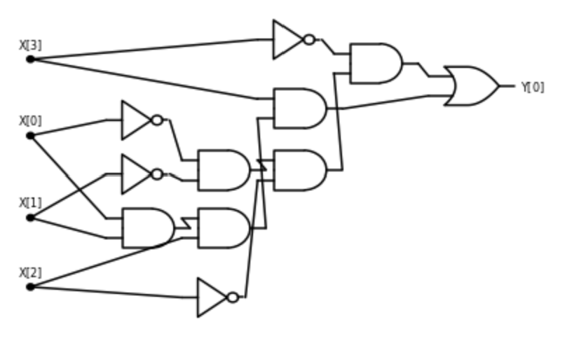</span>
一个用于计算 **全相等函数** $\text{ALLEQ}:\{0,1\}^4 \rightarrow \{0,1\}$ 的布尔电路. 当且仅当 $x \in \{0,1\}^4$ 满足 $x_0 = x_1 = x_2 = x_3$ 时, 它输出 $1$. 
```

### 3.3.1 布尔电路: 形式化定义

我们之前非正式地将布尔电路定义为通过导线连接 $\AND$、$\OR$ 和 $\NOT$ 门, 从输入生成输出的电路.   
然而, 为了能够证明关于计算各种函数的布尔电路存在性或非存在性的定理, 我们需要: 

1. 将布尔电路作为**数学对象**进行形式化定义.   
2. 正式定义电路 $C$ **计算**函数 $f$ 的含义. 

接下来我们将进行这一定义. 我们把布尔电路定义为带标记的**有向无环图 (DAG) **. 图的**顶点**对应电路的门和输入端, 图的**边**对应导线. 电路中从输入或门 $u$ 到门 $v$ 的导线对应顶点间的有向边. 输入顶点没有入边, 而每个门根据其计算的函数具有适当数量的入边 (即 $\AND$ 和 $\OR$ 门有两个入邻居, $\NOT$ 门有一个入邻居) .   

正式定义如下 (参见[下图](#generalcircuitfig)) : 

```admonish quote title=""
<span id="generalcircuitfig">![A _Boolean Circuit_ is a labeled directed acyclic graph (DAG). It has $n$ _input_ vertices, which are marked with `X[`$0$`]`,$\ldots$, `X[`$n-1$`]` and have no incoming edges, and the rest of the vertices are _gates_. _AND_, _OR_, and _NOT_ gates have two, two, and one incoming edges, respectively. If the circuit has $m$ outputs, then $m$ of the gates are known as _outputs_ and are marked with `Y[`$0$`]`,$\ldots$,`Y[`$m-1$`]`. When we evaluate a circuit $C$ on an input $x\in \{0,1\}^n$, we start by setting the value of the input vertices to $x_0,\ldots,x_{n-1}$ and then propagate the values, assigning to each gate $g$ the result of applying the operation of $g$ to the values of $g$'s in-neighbors. The output of the circuit is the value assigned to the output gates.](./images/chapter3/generalcircuit.png)</span>
**布尔电路** 是一个带标记的有向无环图 (DAG). 它有 $n$ 个 **输入** 顶点, 这些顶点标记为 `X[`$0$`]`, $\ldots$, `X[`$n-1$`]`, 且没有入边, 其余顶点为 **门**.   
$\AND$、$\OR$ 和 $\NOT$ 门分别有两个、两个和一个入边. 若电路有 $m$ 个输出, 则 $m$ 个门被称为 **输出**, 标记为 `Y[`$0$`]`, $\ldots$, `Y[`$m-1$`]`.   

在对输入 $x \in \{0,1\}^n$ 评估电路 $C$ 时, 我们首先将输入顶点的值设置为 $x_0,\ldots,x_{n-1}$, 然后将值向下传播, 将每个门 $g$ 的值设置为对 $g$ 的入邻居的值应用 $g$ 的操作的结果. 电路的输出即为分配给输出门的值. 
```
```admonish quote title=""
{{defc}}{booleancircdef}[布尔电路]
设 $n,m,s$ 为正整数, 且 $s \geq m$. 一个具有 $n$ 个输入、$m$ 个输出和 $s$ 个门的**布尔电路**是一个带标记的有向无环图 (DAG)  $G=(V,E)$, 其顶点数为 $s+n$, 满足以下性质: 

* 恰好有 $n$ 个顶点没有入邻居. 这些顶点称为**输入端**, 标记为 $X[0]$, $\ldots$, $X[n-1]$. 每个输入端至少有一个出邻居. 

* 其余 $s$ 个顶点称为**门**. 每个门标记为 $\wedge$、$\vee$ 或 $\neg$. 标记为 $\wedge$ ($\AND$) 或 $\vee$ ($\OR$) 的门有两个入邻居, 标记为 $\neg$ ($\NOT$) 的门有一个入邻居. 允许存在平行边. ^[平行边意味着 AND 或 OR 门 $u$ 的两个入邻居可以是同一个门 $v$. 由于对任意 $a \in \{0,1\}$ 有 $\AND(a,a)=\OR(a,a)=a$, 在仅使用 AND/OR/NOT 门的电路中, 这类平行边并不会计算出新的值. 但在后面引入更一般门集合时, 我们将看到平行边的用途. ]

* 恰好有 $m$ 个门同时标记为 $Y[0]$, $\ldots$, $Y[m-1]$ (除了其本来的 $\wedge$/$\vee$/$\neg$ 标记之外) , 称为**输出端**. 

布尔电路的**规模**定义为其包含的门的数量 $s$. 
```
```admonish pause
这是一个非平凡的数学定义, 因此值得慢慢仔细阅读.   
正如所有数学定义一样, 我们使用已知的数学对象--**有向无环图 (DAG) **--来定义一个新的对象, 即布尔电路.   

此时复习一些 DAG 的基本性质会很有帮助, 特别是它们可以进行**拓扑排序**的事实, 参见[1.6节](chapter_1.md#topsortsec). 
```

如果 $C$ 是一个具有 $n$ 个输入和 $m$ 个输出的电路, 且 $x \in \{0,1\}^n$, 则自然可以计算 $C$ 在输入 $x$ 下的输出:   
将输入顶点 $X[0]$, $\ldots$, $X[n-1]$ 赋值为 $x_0,\ldots,x_{n-1}$, 然后对每个门应用其入邻居的值, 最后输出对应于输出顶点的值.   

形式化定义如下: 
```admonish quote title=""
{{defc}}{circuitcomputedef}[利用布尔电路计算函数]
设 $C$ 为一个具有 $n$ 个输入和 $m$ 个输出的布尔电路.   
对于每个 $x \in \{0,1\}^n$, $C$ 在输入 $x$ 上的 **输出**, 记作 $C(x)$, 定义为以下过程的结果:

我们令 $h: V \rightarrow \N$ 为 $C$ 的 **最小分层** (又称 **拓扑排序**, 见[定理1.26](chapter_1.md#thm:minilayerunique)) .   
令 $L$ 为 $h$ 的最大层数, 对每个 $\ell=0,1,\ldots,L$, 执行以下操作: 

* 对每个位于第 $\ell$ 层的顶点 $v$ (即 $v$ 满足 $h(v)=\ell$) 执行: 

  - 如果 $v$ 是输入顶点, 标记为 `X[i]`, 其中 $i \in [n]$, 则将 $x_i$ 赋值给 $v$. 

  - 如果 $v$ 是标记为 $\wedge$ 的门顶点, 且有两个入邻居 $u,w$, 则将 $u$ 和 $w$ 的值的 $\AND$ 赋给 $v$.  (由于 $u$ 和 $w$ 是 $v$ 的入邻居, 它们位于比 $v$ 更低的层, 因此它们的值已经被赋值. ) 

  - 如果 $v$ 是标记为 $\vee$ 的门顶点, 且有两个入邻居 $u,w$, 则将 $u$ 和 $w$ 的值的 $\OR$ 赋给 $v$. 

  - 如果 $v$ 是标记为 $\neg$ 的门顶点, 且有一个入邻居 $u$, 则将 $u$ 的值取反并赋给 $v$. 

* 该过程的结果是一个 $y \in \{0,1\}^m$, 其中对于每个 $j \in [m]$, $y_j$ 为标记为 `Y[j]` 的顶点的值. 

设 $f: \{0,1\}^n \rightarrow \{0,1\}^m$, 如果对于每个 $x \in \{0,1\}^n$, 都有 $C(x) = f(x)$, 则称电路 $C$ **计算** 函数 $f$. 
```

```admonish remark title = "一些对布尔电路的吹毛求疵 (选读)"
<span id="booleancircuitsremarks"></span>

在表述 {{ref: booleancircdef}} 时, 我们做了一些技术性的选择, 这些选择并不是非常重要, 但对我们后续会很方便.   

允许存在平行边意味着一个 $\AND$ 或 $\OR$ 门 $u$ 可以让它的两个入邻居都是同一个门 $v$.   
由于对每个 $a \in \{0,1\}$ 都有 $\AND(a,a) = \OR(a,a) = a$, 因此在仅使用 **$\AND/\OR/\NOT$** 门的电路中, 这类平行边并不会带来新的计算值.   
然而, 我们稍后会看到包含更一般门集合的电路.   

要求每个输入顶点至少有一个出邻居也不是特别重要, 因为我们总可以添加"虚拟门"来使用这些输入.   
不过这个要求很方便, 因为它保证了 (由于每个门最多有两个入邻居) 电路中的输入数量永远不会超过其规模的两倍. 
```

## 3.4 直线程序 { #starightlineprogramsec }

我们已经看到两种使用 $\AND$、$\OR$ 和 $\NOT$ 来计算函数 $f$ 的方式: 

* **布尔电路**, 在 {{ref: booleancircdef}} 中定义, 通过将 $\AND$、$\OR$ 和 $\NOT$ 门通过导线连接到输入来计算 $f$. 

* 我们也可以使用 **直线程序** 来描述这样的计算, 该程序的每一行形式为 `foo = AND(bar,blah)`、`foo = OR(bar,blah)` 和 `foo = NOT(bar)`, 其中 `foo`、`bar` 和 `blah` 是变量名.  (称其为 **直线程序**, 因为它不包含循环或分支 (例如 if/then) 语句. ) 

为了更精确地描述第二种定义, 我们现在定义一种与布尔电路等价的 **编程语言**.   
我们将这种编程语言称为 **AON-CIRC 编程语言** ("AON" 代表 $\AND/\OR/\NOT$；"CIRC" 代表 **circuit**) . 

例如, 以下是一个 AON-CIRC 程序, 对于输入 $x \in \{0,1\}^2$, 输出 $\overline{x_0 \wedge x_1}$ (即对 $\AND(x_0,x_1)$ 应用 $\NOT$ 操作) : 

```python
temp = AND(X[0],X[1])
Y[0] = NOT(temp)
```

AON-CIRC 并不是一种实用的编程语言: 它仅用于教学目的, 用来将计算建模为 $\AND$、$\OR$ 和 $\NOT$ 的组合. 然而, 它仍然可以很容易地在计算机上实现. 

根据这个例子, 你可能已经能够猜到如何编写程序来计算 (例如) $x_0 \wedge \overline{x_1 \vee x_2}$, 以及更一般地, 如何将布尔电路翻译为 AON-CIRC 程序. 但是, 由于我们希望对 AON-CIRC 程序证明数学性质, 我们需要精确定义 AON-CIRC 编程语言.   

编程语言的精确定义有时可能冗长且枯燥, 例如, [C 语言规范](http://www.open-std.org/jtc1/sc22/wg14/www/docs/n1124.pdf) 就超过 500 页. 但对于安全可靠的实现至关重要. 幸运的是, AON-CIRC 编程语言足够简单, 我们可以相对轻松地对其进行正式定义. 

### 3.4.1 AON-CIRC 编程语言规范

一个 AON-CIRC 程序是一系列字符串, 我们称之为"行", 满足以下条件: 

* 每一行具有以下形式之一: `foo = AND(bar,baz)`、`foo = OR(bar,baz)` 或 `foo = NOT(bar)`, 其中 `foo`、`bar` 和 `baz` 是 **变量标识符**.  (我们遵循常见的 [编程语言惯例](https://goo.gl/QyHa3b), 使用 `foo`、`bar`、`baz` 等名称作为通用标识符的示例. )   
  行 `foo = AND(bar,baz)` 对应于将变量 `foo` 赋值为变量 `bar` 和 `baz` 的逻辑 $\AND$. 类似地, `foo = OR(bar,baz)` 和 `foo = NOT(bar)` 分别对应逻辑 $\OR$ 和逻辑 $\NOT$ 操作. 

* AON-CIRC 编程语言中的 **变量标识符** 可以由字母、数字、下划线和方括号的任意组合构成. 有两类特殊变量: 
  - 形式为 `X[i]` 的变量, 其中 $i \in \{0,1,\ldots,n-1\}$, 称为 **输入变量**. 
  - 形式为 `Y[j]` 的变量, 称为 **输出变量**. 

* 一个有效的 AON-CIRC 程序 $P$ 包含输入变量 `X[0]`, $\ldots$, `X[n-1]` 和输出变量 `Y[0]`, $\ldots$, `Y[m-1]`, 其中 $n,m$ 为自然数. 我们称 $n$ 为程序 $P$ 的 **输入数**, $m$ 为 **输出数**. 

* 在有效的 AON-CIRC 程序中, 每一行右侧的变量必须是输入变量或在之前的行中已经被赋值的变量. 

* 若 $P$ 是一个具有 $n$ 个输入和 $m$ 个输出的有效 AON-CIRC 程序, 则对于每个 $x \in \{0,1\}^n$, 程序 $P$ 在输入 $x$ 上的 **输出** 是字符串 $y \in \{0,1\}^m$, 定义如下: 
  - 将输入变量 `X[0]`, $\ldots$, `X[n-1]` 初始化为 $x_0,\ldots,x_{n-1}$. 
  - 按顺序逐行执行 $P$ 的操作行, 在每行中将左侧变量赋值为右侧操作的结果. 
  - 执行结束后, 令 $y \in \{0,1\}^m$ 为输出变量 `Y[0]`, $\ldots$, `Y[m-1]` 的值. 

* 我们用 $P(x)$ 表示程序 $P$ 在输入 $x$ 上的输出. 

* AON-CIRC 程序 $P$ 的 **规模** 是它包含的行数.  (读者可能注意到, 这与我们定义的电路规模--门的数量--是一致的. ) 

现在我们已经正式定义了 AON-CIRC 程序的规范, 就可以定义 AON-CIRC 程序 $P$ **计算**一个函数 $f$ 的含义: 
```admonish quote title=""
{{defc}}{AONcircdef}[使用AON-CIRC程序计算一个函数]
设 $f:\{0,1\}^n \rightarrow \{0,1\}^m$, 且 $P$ 为一个具有 $n$ 个输入和 $m$ 个输出的有效 AON-CIRC 程序.   
如果对于每个 $x \in \{0,1\}^n$ 都有 $P(x) = f(x)$, 则称 **$P$ 计算函数 $f$**. 
```
以下已解练习给出了一个 AON-CIRC 程序的示例. 
```admonish quote title=""
{{exec}}{aonforcmpsolved} 考虑如下函数 $\text{CMP}:\{0,1\}^4 \rightarrow \{0,1\}$: 对四个输入比特 $a,b,c,d \in \{0,1\}$, 当且仅当由 $(a,b)$ 表示的数字大于由 $(c,d)$ 表示的数字时输出 $1$.   
即 $\text{CMP}(a,b,c,d) = 1$ 当且仅当 $2a + b > 2c + d$. 
给出一个计算 $\text{CMP}$ 的 AON-CIRC 程序示例.
```

~~~admonish solution collapsible=true
编写这样的程序虽然繁琐, 但并不困难. 比较两个数字时, 我们首先比较它们的最高有效位, 然后依次比较下一位, 以此类推. 在数字仅有两位二进制的情况下, 这些比较特别简单. 由 $(a,b)$ 表示的数字大于由 $(c,d)$ 表示的数字, 当且仅当满足以下任一条件: 

1. $(a,b)$ 的最高有效位 $a$ 大于 $(c,d)$ 的最高有效位 $c$；  

或  

2. 两个最高有效位 $a$ 和 $c$ 相等, 但 $b > d$. 

另一种等价表述为: 数字 $(a,b)$ 大于 $(c,d)$ 当且仅当 $a>c$ **或** ($a\ge c$ **且** $b>d$). 

对于二进制位 $\alpha, \beta$, 条件 $\alpha > \beta$ 仅当 $\alpha = 1$ 且 $\beta = 0$, 也就是 $\AND(\alpha, \NOT(\beta)) = 1$；条件 $\alpha \ge \beta$ 则为 $\OR(\alpha, \NOT(\beta)) = 1$.   

结合这些观察, 可以得到用于计算 $\text{CMP}$ 的以下 AON-CIRC 程序: 

```python
# Compute CMP:{0,1}^4-->{0,1}
# CMP(X)=1 iff 2X[0]+X[1] > 2X[2] + X[3]
temp_1 = NOT(X[2])
temp_2 = AND(X[0],temp_1)
temp_3 = OR(X[0],temp_1)
temp_4 = NOT(X[3])
temp_5 = AND(X[1],temp_4)
temp_6 = AND(temp_5,temp_3)
Y[0] = OR(temp_2,temp_6)
```

我们也可以将这个 8 行程序表示为一个包含 8 个门的电路, 见[下图](#aoncmpfig). 
~~~

```admonish quote title=""
<span id="aoncmpfig">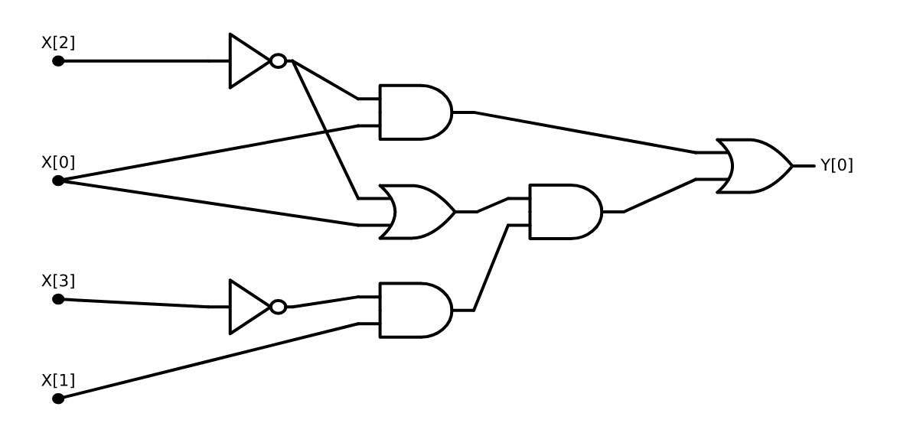</span>
一个用于计算 $\text{CMP}$ 函数的电路. 以输入 $(1,1,1,0)$ 运行该电路, 输出为 $1$, 因为数字 $3$ (二进制表示为 $11$) 大于数字 $2$ (二进制表示为 $10$) . 
```

### 3.4.2 证明AON-CIRC程序与布尔电路的等价性

我们现在正式证明 AON-CIRC 程序和布尔电路具有完全相同的计算能力: 
```admonish quote title=""
{{thmc}}{slcircuitequivthm}[电路与直线程序的等价性]
设 $f:\{0,1\}^n \rightarrow \{0,1\}^m$, $s \ge m$ 为某个正整数. 则 $f$ 可以由一个包含 $s$ 个门的布尔电路计算, 当且仅当 $f$ 可以由一个包含 $s$ 行的 AON-CIRC 程序计算. 
```
```admonish idea title="证明思路"
证明思路很简单--AON-CIRC 程序和布尔电路只是描述同一计算过程的不同方式.   
例如, 布尔电路中的一个 $\AND$ 门对应于对两个已计算值执行 $\AND$ 操作.   
在 AON-CIRC 程序中, 这对应于一行将两个已计算变量的 $\AND$ 结果存储到一个变量中的语句. 
```

```admonish pause
{{ref: slcircuitequivthm}} 的证明本质上很简单, 但其中包含的所有细节可能会让阅读起来有些繁琐.   
你最好先尝试自己推导一遍, 再去阅读证明.   
我们的 [GitHub 仓库](https://github.com/boazbk/tcscode) 中提供了 {{ref: slcircuitequivthm}} 的"Python 证明": 实现了 `circuit2prog` 和 `prog2circuits` 函数, 用于在布尔电路和 AON-CIRC 程序之间互相转换. 
```

```admonish proof collapsible=true
设 $f:\{0,1\}^n \rightarrow \{0,1\}^m$. 由于该定理是**"当且仅当"**的命题, 要证明它, 我们需要展示两个方向:   
1. 将计算 $f$ 的 AON-CIRC 程序转换为计算 $f$ 的布尔电路；  
2. 将计算 $f$ 的布尔电路转换为计算 $f$ 的 AON-CIRC 程序.   

我们先考虑第一个方向. 设 $P$ 是一个计算 $f$ 的 AON-CIRC 程序. 我们定义一个电路 $C$ 如下: 该电路有 $n$ 个输入和 $s$ 个门. 对于每个 $i \in [s]$, 若第 $i$ 行运算为 `foo = AND(bar,blah)`, 则电路中的第 $i$ 个门为 $\AND$ 门, 其入邻居连接到对应的第 $j$ 和第 $k$ 个门, $j$ 和 $k$ 分别对应于在第 $i$ 行之前最后一次写入变量 `bar` 和 `blah` 的行号.  (例如, 如果 $i=57$, 且 `bar` 最近一次被写入的是第 $35$ 行, `blah` 最近一次被写入的是第 $17$ 行, 则门 $57$ 的两个入邻居为门 $35$ 和门 $17$. )   
如果 `bar` 或 `blah` 是输入变量, 则将门连接到对应的输入顶点.   
如果 `foo` 是输出变量 (形式为 `Y[j]`) , 则在对应门上添加相同标签, 将其标记为输出门.   
对于 $\OR$ 或 $\NOT$ 操作的情况也类似, 只是使用对应的 $\OR$ 或 $\NOT$ 门, 并且 $\NOT$ 门只有一个入邻居.   

对于任意输入 $x \in \{0,1\}^n$, 若运行程序 $P$, 第 $i$ 行计算的值恰好等于在电路 $C$ 上对 $x$ 求值时第 $i$ 个门的值. 因此, 对所有 $x \in \{0,1\}^n$, 有 $C(x)=P(x)$. 

再看另一个方向. 设 $C$ 是一个具有 $n$ 个输入、$s$ 个门的电路, 计算函数 $f$. 我们对门按照拓扑序排序, 记为 $v_0,\ldots,v_{s-1}$.   
现在可以构造一个包含 $s$ 行运算的程序 $P$:   
对于每个 $i \in [s]$, 若 $v_i$ 是一个 $\AND$ 门, 其入邻居为 $v_j, v_k$, 则在 $P$ 中添加一行 `temp_i = AND(temp_j,temp_k)`, 除非某个顶点是输入顶点或输出门, 此时改用 `X[.]` 或 `Y[.]`.   
由于我们按照拓扑顺序操作, 保证入邻居 $v_j$ 和 $v_k$ 对应的变量已被赋值.   
$\OR$ 和 $\NOT$ 门同理.   

再次验证, 对于每个输入 $x$, $P(x)=C(x)$, 因此程序计算与电路相同的函数.   
 (注意, 由于 $C$ 是合法电路, 根据 {{ref: booleancircdef}}, $C$ 的每个输入顶点至少有一个出邻居, 并且恰有 $m$ 个输出门标记为 $0,\ldots,m-1$；因此所有变量 `X[0],\ldots,X[n-1]` 和 `Y[0],\ldots,Y[m-1]` 都会出现在程序 $P$ 中. ) 
```

```admonish quote title=""
<span id="aoncircequivfig"></span>
同一 $\AND/\OR/\NOT$ 计算的两种等效描述: 既作为 AON 程序, 也作为布尔电路. 
```

## 3.5 计算设备的物理实现 (插曲)  {#physicalimplementationsec}

**计算**是一个抽象概念, 它并不等同于其物理**实现**.   
虽然大多数现代计算设备是通过将逻辑门映射到基于半导体的晶体管实现的, 但纵观历史, 人类曾经使用过各种各样的机制来进行计算, 包括机械系统、气体与液体 (称为**流体计算**) 、生物和化学过程, 甚至是生物体本身 (参见[下图](#crabfig)或[这个视频](https://www.youtube.com/watch?v=czk4xgdhdY4), 了解螃蟹或黏菌如何被用于计算) .   

在本节中, 我们将回顾这些实现方式, 以帮助理解如何能够将布尔电路直接转化为物理世界中的系统, 而无需经过体系结构、操作系统和编译器的完整抽象层. 同时, 这也强调了基于硅的处理器绝不是实现计算的唯一方式.   

事实上, 正如我们将在[第23章](chapter_23.md) 中看到的, 一个令人兴奋的研究方向是使用不同的介质来进行计算, 从而利用**量子力学效应**来实现全新的算法类型.   

```admonish quote title=""
<span id="crabfig"></span>
摘自 Gunji、Nishiyama 和 Adamatzky 的论文 *Robust soldier-crab ball gate* 的蟹群逻辑门. 这是一个 AND 门的实例, 它依赖于从不同方向出发的两群螃蟹汇合成一群, 并沿两方向的平均方向继续前进. 
```

<blockquote class="twitter-tweet"><p lang="en" dir="ltr">Such a cool way to explain logic gates. <span href="https://t.co/6Wgu2ZKFCx">pic.twitter.com/6Wgu2ZKFCx</span></p>&mdash; Lionel Page (\@page_eco) <span href="https://twitter.com/page_eco/status/1188749430020698112?ref_src=twsrc%5Etfw">2019年10月28日</span></blockquote> <script async src="https://platform.twitter.com/widgets.js" charset="utf-8"></script>

### 3.5.1 晶体管

**晶体管** (transistor) 可以看作是一个具有两个输入和一个输出的电路: 输入称为**源极** (source) 和**栅极** (gate) , 输出称为**漏极** (sink) .   
栅极决定了电流是否能够从源极流向漏极.   

- 在**标准晶体管**中, 如果栅极处于"开 (ON) "状态, 则电流可以从源极流向漏极；如果栅极处于"关 (OFF) "状态, 则电流无法流动.   
- 在**互补晶体管**中, 情况正好相反: 栅极"关"时允许电流流动, 而栅极"开"时则不允许.   

```admonish quote title=""
<span id="transistor-water-fig">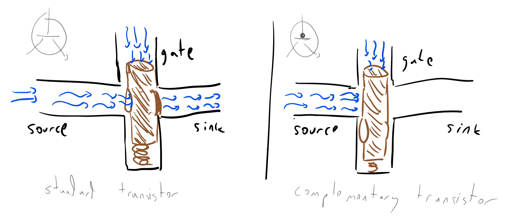</span>
我们可以用水来实现晶体管的逻辑. 来自栅极的水压控制着源极与漏极之间的阀门是否打开. 
```

实现晶体管逻辑的方法有很多. 例如, 可以通过水压与水龙头的开合来模拟晶体管的工作 (见[上图](transistor-water-fig)) . 这似乎只是个小趣味, 但事实上有一个名为[流体计算](https://en.wikipedia.org/wiki/Fluidics) (fluidics) 的研究领域, 专门研究如何利用液体或气体实现逻辑运算. 其动机之一是在极端环境 (如太空或战场) 中工作, 因为在这些环境下常规电子设备可能无法存活.   

晶体管的标准实现是通过**电流**. 而最早的实现方式之一是**真空管**. 顾名思义, 真空管是一个内部抽空的管子, 电子可以自由地从源 (电丝) 流向漏 (金属板) . 但在它们之间有一个"栅极" (网格) , 通过调节其电压可以阻止电子的流动.   

早期真空管大约有灯泡那么大 (外形也很像灯泡) . 到 1950 年代, 它们被**晶体管**取代. 晶体管利用**半导体**实现相同的逻辑. 半导体在正常情况下不导电, 但通过掺杂 (doping) 以及施加外部电场, 可以调控其导电性 (即**场效应**) .   

进入 1960 年代后, 计算机开始使用**集成电路** (integrated circuits) , 极大提高了晶体管的集成密度. 1965 年, 戈登·摩尔 (Gordon Moore) 预测集成电路中晶体管的数量大约每年会翻一番 (见[下图](#moorefig)) . 他还推测这将带来"诸如家庭计算机--或至少是接入中央计算机的终端--、汽车的自动控制, 以及个人便携通信设备等奇迹".   

从那时起, 经调整后的"**摩尔定律**"基本上一直成立, 尽管指数级增长不可能无限持续, 一些物理极限已经[逐渐显现](http://www.nature.com/news/the-chips-are-down-for-moore-s-law-1.19338).   

```admonish quote title=""
<span id="moorefig"></span>
1959 至 1965 年间集成电路中的晶体管数量, 并预测指数级增长至少能持续十年. 取自戈登·摩尔 1965 年的文章 *Cramming More Components onto Integrated Circuits*. 
```

```admonish quote title=""
<span id="moore-cartoon-fig"></span>
戈登·摩尔文章中的漫画, "预测"了晶体管密度大幅提升的影响. 
```

```admonish quote title=""
<span id="kurzweil-fig"></span>
过去 120 年间计算能力的指数级增长. 图表由 Steve Jurvetson 绘制, 基于雷·库兹韦尔的早期图表扩展而来. 
```

### 3.5.2 由晶体管到逻辑门

我们可以使用晶体管来实现各种布尔函数, 例如 $ \AND $、$ \OR $ 和 $ \NOT $.   
对于每一个二输入门 $G:\{0,1\}^2 \rightarrow \{0,1\}$, 其实现方式是一个具有两个输入导线 $x,y$ 和一个输出导线 $z$ 的系统. 若我们将高电压视为"$1$", 低电压视为"$0$", 那么当且仅当 $G(x,y)=1$ 时, 导线 $z$ 的值为"$1$" (参见下列[逻辑门的晶体管实现](logicgatestransistorsfig) 和[NAND实现](transistor-nand-fig)) .   

这意味着: 如果存在一个 $\AND/\OR/\NOT$ 电路可以计算函数 $g:\{0,1\}^n \rightarrow \{0,1\}^m$, 那么我们也可以在物理世界中通过晶体管来计算 $g$.   

```admonish quote title=""
<span id="logicgatestransistorsfig">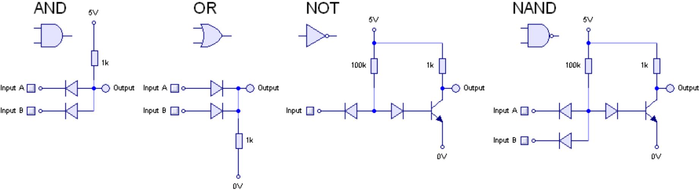</span>
使用晶体管实现逻辑门. 图源自 [Rory Mangles 的网站](http://www.northdownfarm.co.uk/rory/tim/basiclogic.htm). 
```

```admonish quote title=""
<span id="transistor-nand-fig">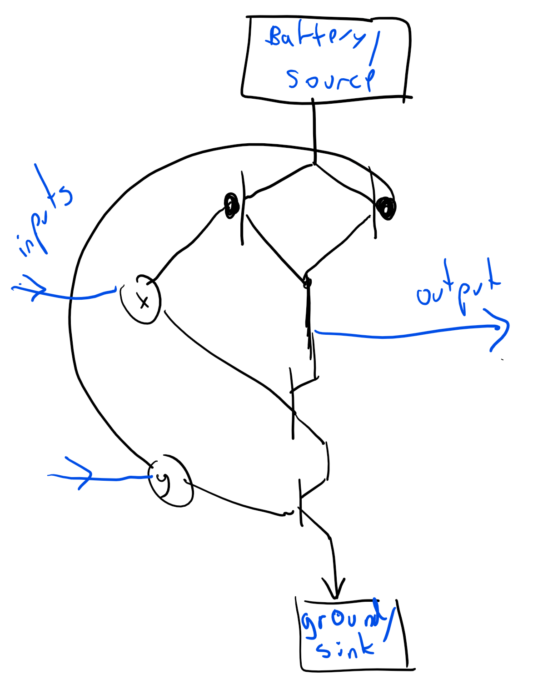</span>
使用晶体管实现 $ \NAND $ 门 (参见 [3.6节](#nandsec)) . 
```

### 3.5.3 生物计算

计算也可以基于[生物或化学系统](http://www.nature.com/nrg/journal/v13/n7/full/nrg3197.html). 例如, [_lac_ 操纵子](https://en.wikipedia.org/wiki/Lac_operon) 仅在条件 $x \wedge (\neg y)$ 成立时才会产生消化乳糖所需的酶, 其中 $x$ 表示"存在乳糖", $y$ 表示"存在葡萄糖".   

研究人员已经成功[制造出基于 DNA 分子的晶体管](http://science.sciencemag.org/content/340/6132/554?iss=6132), 并由此构建逻辑门 (参见[下图](transcriptorfig)) . 诸如 [Cello 编程语言](https://www.cidarlab.org/cello) 这样的项目, 能够将布尔电路转换为 DNA 序列, 从而在细菌细胞中执行运算 (参见[该视频](https://youtu.be/-1fqgrF7fXU)) .   

DNA 计算的动机之一是实现更高的并行性或存储密度；另一个动机是创造"智能生物因子", 这些因子或许能够被注入体内, 自我复制, 并修复或杀死因癌症等疾病损伤的细胞.   

当然, 生物系统中的计算不仅限于 DNA: 甚至更大规模的系统, 例如[鸟群](https://www.cs.princeton.edu/~chazelle/pubs/cacm12-natalg.pdf), 也可以被视为计算过程.   

```admonish quote title=""
<span id="transcriptorfig"></span>
基于 DNA 的逻辑门性能. 图源自 [Bonnet 等人](http://science.sciencemag.org/content/early/2013/03/27/science.1232758.full), Science, 2013. 
```

### 3.5.4 元胞自动机和生命游戏(GoL)

**元胞自动机**是一种由一系列**细胞**组成的系统模型, 每个细胞都可以处于有限的状态之一.   
在每一步中, 细胞会根据其**邻居细胞**的状态以及一些简单规则来更新自身状态.   

正如我们将在本书后续部分讨论的那样 (参见 [cellularautomatasec]()) , 元胞自动机 (例如康威的"生命游戏") 可以用来模拟计算门.   

```admonish quote title=""
<span id="gameoflifefig">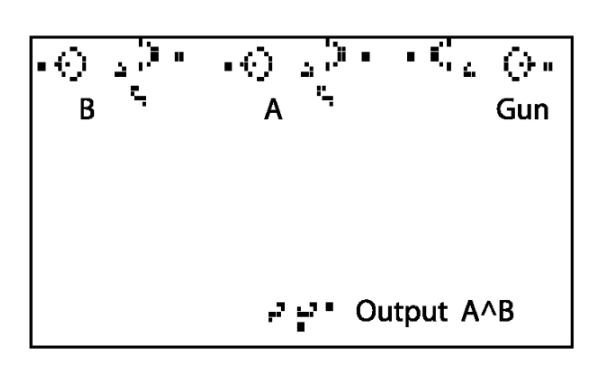</span>
利用"生命游戏"配置实现的 AND 门. 图源自 [Jean-Philippe Rennard 的论文](http://www.rennard.org/alife/CollisionBasedRennard.pdf). 
```

### 3.5.5 神经网络

我们每个人都随身携带的一种计算设备就是我们自己的**大脑**. 大脑在人类历史上一直发挥作用, 从区分猎物与捕食者, 到进行科学发现和艺术创作, 再到写出精巧的 280 字短消息. 大脑的确切工作机制仍未完全被理解, 但一种常见的数学模型是 (非常庞大的) **神经网络**.   

神经网络可以看作布尔电路, 只是它并非以 $\AND$ / $\OR$ / $\NOT$ 为基本门, 而是使用其他类型的基本门. 例如, 一种可以使用的基是**阈值门**.   

对于每个整数向量 $w = (w_0, \ldots, w_{k-1})$ 和整数 $t$ (其中一些分量可以为负) , 定义对应的**阈值函数** $T_{w,t}:\{0,1\}^k \to \{0,1\}$ 为: 当且仅当 $\sum_{i=0}^{k-1} w_i x_i \ge t$ 时, 输入 $x \in \{0,1\}^k$ 被映射为 $1$.   

例如, 向量 $w = (1,1,1,1,1)$ 与阈值 $t=3$ 所对应的 $T_{w,t}$, 就是 $\{0,1\}^5$ 上的多数函数 $\text{MAJ}_5$. 阈值门可以看作对构成人类与动物大脑核心的**神经元**的一种近似. 粗略来说, 一个神经元有 $k$ 个输入和一个输出, 当这些信号的强度超过某个阈值时, 神经元就会"触发"或"激活"其输出.   

许多机器学习算法采用的**人工神经网络**并非旨在模仿生物学, 而是为了执行某些计算任务, 因此它们并不局限于阈值门或其他生物学启发的门. 通常来说, 神经网络的输入信号被视为实数而非 $0/1$ 值, 并且一个门的输出是通过计算 $f(\sum_i w_i x_i)$ 得到的, 其中 $f:\R \to \R$ 是某种[激活函数](https://goo.gl/p9izfA), 例如修正线性单元 (ReLU) 、Sigmoid 或其他函数 (见[下图](#activationfunctionsfig)) .   

不过, 就我们讨论的范围而言, 上述所有模型在本质上是等价的 (参见 {{ref:NANDsfromActivationfunctionex}}) . 特别是, 我们可以通过二进制表示实数并将对应权重乘以 $2^i$ 的方式, 将实数输入化为二进制输入.   

```admonish quote title=""
<span id="activationfunctionsfig">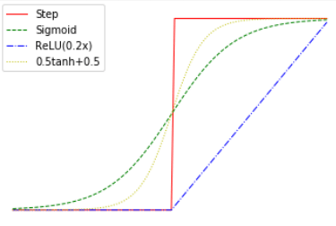</span>

神经网络中常用的激活函数, 包括修正线性单元 (ReLU) 、Sigmoid 和双曲正切. 它们都可以看作阶跃函数的连续近似形式. 所有这些函数都能用来计算 $\NAND$ 门 ( {{ref:NANDsfromActivationfunctionex}}) . 这一性质使得神经网络 (近似地) 能够计算任何布尔电路可计算的函数. 
```

### 3.5.6 利用弹珠和管道搭建的计算机

我们可以利用许多其他物理介质来实现计算, 而无需任何电子、生物或化学组件. 人们曾经提出许多关于**机械计算机**的构想, 至少可以追溯到 1670 年代 Gottfried Leibniz 的计算机, 以及 Charles Babbage 1837 年提出的机械"[解析引擎](https://en.wikipedia.org/wiki/Analytical_Engine)"计划.   

打个比方, [下图](#marblefig) 展示了使用弹珠通过管道来实现 $\NAND$ ($\AND$ 的取反, 参见 [3.6节](#nandsec)) 门的简单方法. 我们通过一对管道表示逻辑值 $\{0,1\}$, 保证恰好有一颗弹珠在其中一条管道中流动. 将其中一条管道称为"$0$ 管", 另一条管道称为"$1$ 管", 弹珠所在管道的身份决定逻辑值.   

一个 $\NAND$ 门对应一个机械装置, 具有两对输入管道和一对输出管道, 使得对于每个 $a,b \in \{0,1\}$, 如果两颗弹珠分别沿第一对管道的 $a$ 管和第二对管道的 $b$ 管滚向装置, 那么弹珠将沿输出对中对应 $\NAND(a,b)$ 的管道滚出.   

事实上, 市面上还有一个以弹珠为计算基础的教育游戏, 参见下方的[Turing Tumble](#turingtumblefig). 

```admonish quote title=""
<span id="marblefig">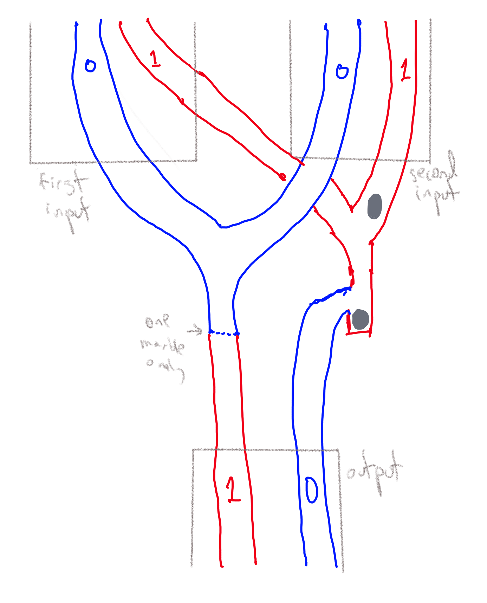</span>
使用弹珠实现的 $\NAND$ 门. 布尔电路中的每条导线由一对分别表示值 $0$ 和 $1$ 的管道建模, 因此一个门有四条输入管 (每个逻辑输入两条) 和两条输出管. 如果代表值 $0$ 的输入管有弹珠, 则该弹珠会流向输出管表示值 $1$.  (虚线表示一个装置, 确保管道中最多只有一颗弹珠可以继续流动. ) 如果代表值 $1$ 的输入管中两颗弹珠都在流动, 则第一颗弹珠会被阻住, 但第二颗弹珠会流向输出管表示值 $0$. 
```
```admonish quote title=""
<span id="gadgetfig">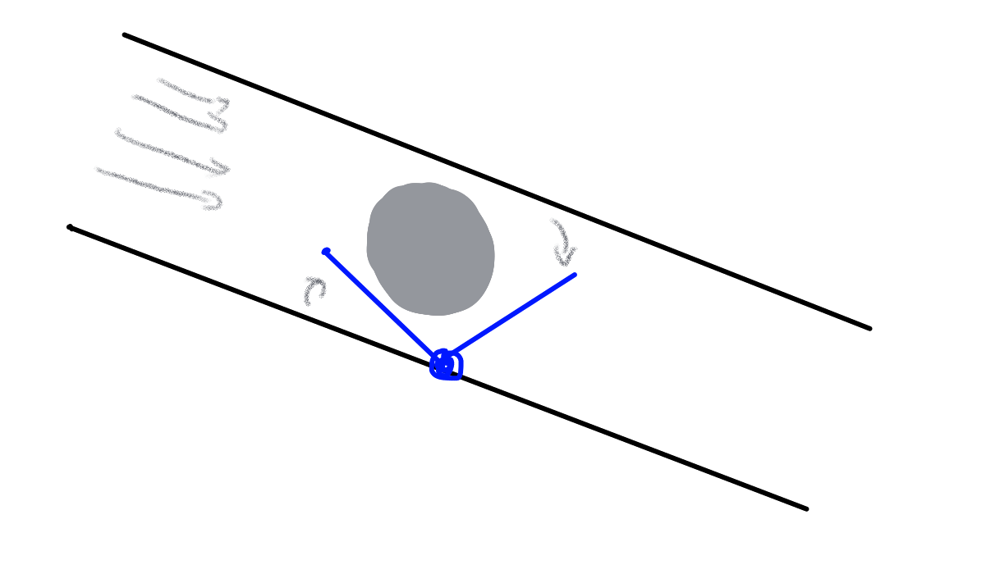</span>
管道中的一个"装置", 确保最多只有一颗弹珠可以通过它. 第一颗通过的弹珠会抬起障碍, 阻挡后续弹珠. 
```
```admonish quote title=""
<span id="turingtumblefig"></span>
游戏 ["Turing Tumble"](https://www.turingtumble.com/) 中使用弹珠实现逻辑门. 
```

## 3.6 NAND函数 { #nandsec }

$\NAND$ 函数是另一个非常简单且在定义计算中极为有用的函数.   
它是一个将 $\{0,1\}^2$ 映射到 $\{0,1\}$ 的函数, 定义为: 

$$\NAND(a,b) = \begin{cases} 0 & a=b=1 \\ 1 & \text{否则} \end{cases}\;.$$

顾名思义, $\NAND$ 是 AND 的取反 (即 $\NAND(a,b) = \NOT(\AND(a,b))$) , 因此显然可以使用 $\AND$ 和 $\NOT$ 来计算 $\NAND$.   
有趣的是, 反过来我们也有: 
```admonish quote title=""
{{thmc}}{univnandonethm}[用$\NAND$构造$\AND/\OR/\NOT$]
我们可以通过仅组合 $\NAND$ 来计算 $\AND$, $\OR$, 和 $\NOT$.
```
```admonish proof collapsible=true
我们从以下观察开始. 对于每个 $a \in \{0,1\}$, 有 $\AND(a,a) = a$.   
因此, $\NAND(a,a) = \NOT(\AND(a,a)) = \NOT(a)$.   

这意味着 $\NAND$ 可以计算 $\NOT$.   
根据"双重否定"原理, $\AND(a,b) = \NOT(\NOT(\AND(a,b)))$, 因此我们也可以使用 $\NAND$ 来计算 $\AND$.   

一旦我们能够计算 $\AND$ 和 $\NOT$, 就可以利用[de Morgan定律](https://goo.gl/TH86dH)计算 $\OR$:   
$$\OR(a,b) = \NOT(\AND(\NOT(a), \NOT(b)))$$ (也可以写作 $a \vee b = \overline{\overline{a} \wedge \overline{b}}$) , 对每个 $a,b \in \{0,1\}$ 都成立. 
```
```admonish pause
{{ref:univnandonethm}} 的证明非常简单, 但你应当确保 __(1)__ 你理解该定理的陈述, 且 __(2)__ 你能够读懂其证明过程. 尤其要理解为什么de Morgan定律成立. 
```

我们可以使用 $\NAND$ 来计算许多其他函数, 如以下练习所示. 
```admonish quote title=""
{{exec}}{majbynandex}[利用$\NAND$计算$\text{MAJ}$]
设 $\text{MAJ}:\{0,1\}^3 \rightarrow \{0,1\}$ 为函数: 对输入 $a,b,c$, 当且仅当 $a+b+c \ge 2$ 时输出 $1$. 说明如何用若干个 $\text{NAND}$ 的组合来计算 $\text{MAJ}$. 
```
```admonish solution collapsible=true
回想一下 {{eqref: eqmajandornot}} 给出的是: 
$$
\text{MAJ}(x_0,x_1,x_2) = \OR\bigl(\AND(x_0,x_1),\OR(\AND(x_1,x_2),\AND(x_0,x_2) )\bigr). 
{{numeq}}{eqmajandornotrestated}
$$我们可以利用 {{ref:univnandonethm}} 将所有出现的 $\AND$ 和 $\OR$ 用 $\NAND$ 替换. 具体地, 使用等价关系
$$
\begin{align*}
\AND(a,b)&=\NOT(\NAND(a,b)),\\
\OR(a,b)&=\NAND(\NOT(a),\NOT(b)),\\
\NOT(a)&=\NAND(a,a),
\end{align*}
$$把上式右边全部替换为仅含 $\NAND$ 的表达式, 就得到 $\text{MAJ}(a,b,c)$ 等价于下列 (**略显冗长**的) 表达式: 
$$
\begin{gathered}
\NAND\!\biggl(\, \NAND\Bigl(\, \NAND\bigl(\NAND(a,b),\NAND(a,c)\bigr), \\
\NAND\bigl(\NAND(a,b),\NAND(a,c)\bigr)\, \Bigr),\;
\NAND(b,c) \,\biggr)
\end{gathered}
$$同样的公式也可以表示为由 $\NAND$ 门组成的电路, 见[下图](#majnandcircfig). 
```
```admonish quote title=""
<span id="majnandcircfig">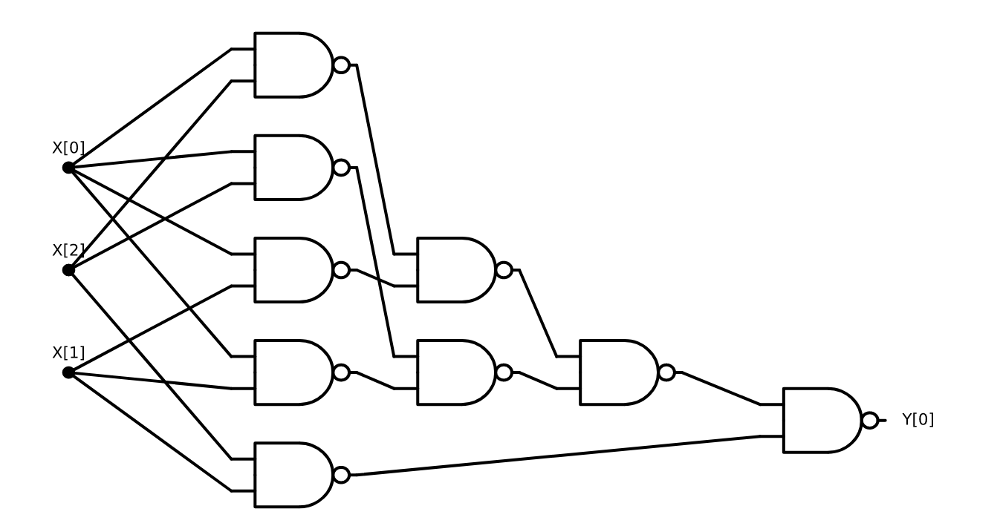</span>
用于计算三位多数函数的 $\NAND$ 门电路
```

### 3.6.1 $\NAND$ 电路

我们将 **$\NAND$ 电路** 定义为所有逻辑门均为 $\NAND$ 运算的电路.   
这样的电路同样对应一个有向无环图 (DAG) , 因为所有逻辑门都执行相同的功能 (即 $\NAND$) , 因此甚至无需对它们进行标记, 并且所有逻辑门的入度都恰好为 2.   
尽管形式简单, $\NAND$ 电路却具有相当强大的能力. 

```admonish example title="例: 基于 $\\\NAND$ 电路的 $\\\XOR$ 实现"
回忆 **$\XOR$ 函数**, 它将 $x_0, x_1 \in \{0,1\}$ 映射为 $x_0 + x_1 \bmod 2$.   
我们在[先前的例子](#xoraonexample)中已经看到, 可以使用 $\AND$、$\OR$ 和 $\NOT$ 来计算 $\XOR$, 因此根据 {{ref:univnandonethm}}, 我们也可以仅用 $\NAND$ 来实现它.   
然而, 下面给出的是一个直接利用一系列 $\NAND$ 运算来计算 $\XOR$ 的构造: 

1. 令 $u = \NAND(x_0,x_1)$.   
2. 令 $v = \NAND(x_0,u)$.   
3. 令 $w = \NAND(x_1,u)$.   
4. 则 $x_0$ 与 $x_1$ 的 **$\XOR$** 为 $y_0 = \NAND(v,w)$.   

我们可以通过枚举 $x_0, x_1 \in \{0,1\}$ 的所有四种取值情况来验证, 该算法确实计算了 $\XOR$.   
此外, 我们还可以将该算法表示为电路图, 参见[下图](#cornandcircfig). 
```
```admonish quote title=""
<span id="cornandcircfig">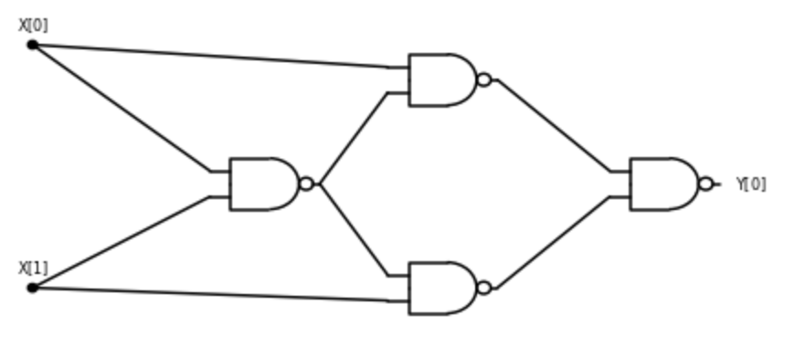</span>
一个由 $\NAND$ 门组成的电路, 用于计算两个比特的 $\XOR$. 
```

事实上, 我们可以证明以下定理:
```admonish quote title=""
{{thmc}}{NANDuniversamthm}[$\NAND$可作为通用逻辑门]
对于任意包含 $s$ 个逻辑门的布尔电路 $C$, 都存在一个至多包含 $3s$ 个逻辑门的 $\NAND$ 电路 $C'$, 其计算结果与 $C$ 相同. 
```
```admonish idea title="证明思路"
该证明的思路是: 按照 {{ref:univnandonethm}} 的证明方法, 将每一个 $\AND$、$\OR$ 和 $\NOT$ 门替换为它们对应的 $\NAND$ 实现. 
```
```admonish proof collapsible=true
如果 $C$ 是一个布尔电路, 那么由于我们在 {{ref:univnandonethm}} 的证明中已经看到, 对于任意 $a,b \in \{0,1\}$ 有: 

* $\AND(a,b) = \NAND(\NAND(a,b),\NAND(a,b))$  
* $\OR(a,b) = \NAND(\NAND(a,a),\NAND(b,b))$
* $\NOT(a) = \NAND(a,a)$  

因此, 我们可以将 $C$ 中的每一个逻辑门替换为至多三个 $\NAND$ 门, 从而得到一个等价电路 $C'$.   
由此得到的电路至多包含 $3s$ 个逻辑门. 
```
```admonish warning title="等效性"
<span id="equivalencemodels"></span>
如果两个模型能够计算相同的函数集合, 那么它们就是 **等效的**. 
```

### 3.6.2 更多 $\NAND$ 电路的例子 (选读)

下面给出一些更复杂的 $\NAND$ 电路示例: 

**后继数**: 考虑如下任务: 输入一个字符串 $x \in \{0,1\}^n$, 它表示一个自然数 $X \in \N$, 我们希望计算 $X+1$. 换句话说, 我们希望计算函数  
$$\text{INC}_n:\{0,1\}^n \rightarrow \{0,1\}^{n+1}$$  
使得对于任意 $x_0,\ldots,x_{n-1}$, 有 $\text{INC}_n(x)=y$, 并且满足  
$$\sum_{i=0}^n y_i 2^i = \left( \sum_{i=0}^{n-1} x_i 2^i \right)+1.$$  
 (为了书写简洁, 在此示例中我们采用最低有效位在前而不是在后的表示方式. ) 

后继操作可以非正式地描述为: **"将 $1$ 加到最低有效位并向高位传递进位"**.   
更准确地说, 在二进制表示的情形下, 要得到 $x$ 的后继, 我们从最低有效位开始扫描 $x$, 把所有的 $1$ 翻转为 $0$, 直到遇到一个等于 $0$ 的比特, 把它翻转为 $1$ 并停止. 

因此, 我们可以通过以下步骤来计算 $x_0,\ldots,x_{n-1}$ 的后继: 
```admonish quote title=""
{{algc}}{incrementalg}[后继函数]

$
\begin{array}{l}
\mathbf{Input:}\ x_0,x_1,\ldots,x_{n-1} \text{ representing } \sum_{i=0}^{n-1} x_i \cdot 2^i \ (\text{LSB-first}) \\[6pt]
\mathbf{Output:}\ y \in \{0,1\}^{n+1} \text{ such that } 
\sum_{i=0}^n y_i \cdot 2^i = \sum_{i=0}^{n-1} x_i \cdot 2^i + 1 \\
\hline
\mathbf{Step 1:}\ c_0 \leftarrow 1 \quad (\text{initial carry }=1) \\[6pt]
\mathbf{Step 2:}\ \text{For } i=0,\ldots,n-1 \\ 
\quad \mathbf{Step 2.1:}\ y_i \leftarrow \XOR(x_i,c_i) \\ 
\quad \mathbf{Step 2.2:}\ \text{If } (c_i=1 \wedge x_i=1) \text{ then } c_{i+1} \leftarrow 1 \\ 
\quad \mathbf{Step 2.3:}\ \text{Else } c_{i+1} \leftarrow 0 \\ 
\quad \mathbf{Step 2.4:}\ \text{Endif} \\ 
\mathbf{Step 3:}\ \text{Endfor} \\[6pt]
\mathbf{Step 4:}\ y_n \leftarrow c_n
\end{array}
$
```

{{ref:incrementalg}} 精确描述了如何计算后继, 并且可以很容易地转化为执行相同计算的 **Python** 代码, 但它似乎不能直接生成一个计算该运算的 $\NAND$ 电路.   
然而, 我们可以逐行将该算法转换为 $\NAND$ 电路.   

例如, 由于对任意 $a$ 都有 $\NAND(a,\NOT(a))=1$, 我们可以将最初的语句 $c_0=1$ 替换为  
$c_0 = \NAND(x_0, \NAND(x_0,x_0))$.   

我们已经知道如何用 $\NAND$ 实现 $\XOR$, 因此可以用它来实现操作 $y_i \leftarrow \XOR(x_i,c_i)$.   

类似地, 可以将 "if" 语句写作 $c_{i+1} \leftarrow \AND(c_i,x_i)$, 也就是  
$c_{i+1} \leftarrow \NAND( \NAND(c_i,x_i), \NAND(c_i,x_i))$.   

最后, 赋值 $y_n = c_n$ 可以写作  
$y_n = \NAND( \NAND(c_n,c_n), \NAND(c_n,c_n))$.   

结合这些观察, 对于任意 $n \in \N$, 我们就得到了一个计算 $\text{INC}_n$ 的 $\NAND$ 电路.   
例如, [下图](#nandincrememntcircfig)展示了 $n=4$ 时该电路的样子.   

```admonish quote title=""
<span id="nandincrememntcircfig">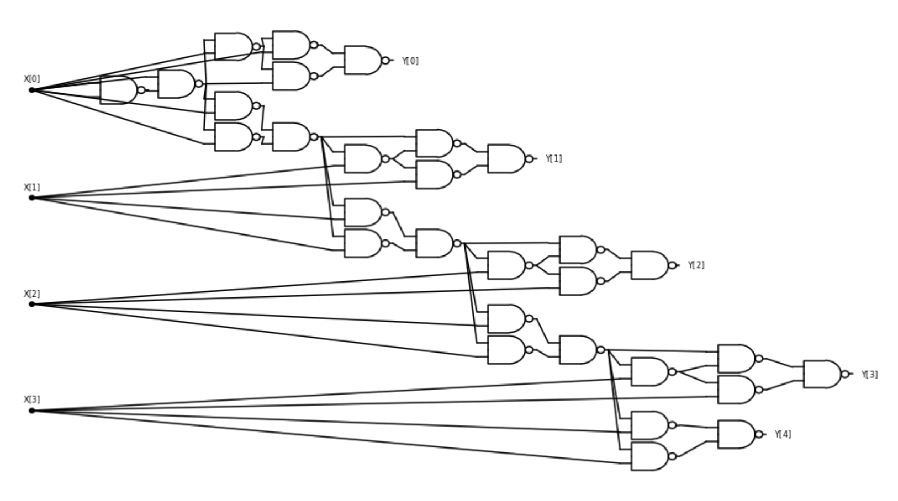</span>
用于计算 $4$ 位 **自增函数** 的 $\text{NAND}$ 电路. 
```

__从自增到加法__

一旦有了自增运算, 我们当然可以通过重复自增来计算加法 (即通过对 $x$ 执行 $y$ 次 $\text{INC}(x)$ 来计算 $x+y$) .   然而, 这种方法既低效又没有必要.   

利用同样的进位跟踪思想, 我们可以实现"中学"加法算法, 并计算函数 $\text{ADD}_n:\{0,1\}^{2n} \rightarrow \{0,1\}^{n+1}$, 其在输入 $x \in \{0,1\}^{2n}$ 时输出由 $x_0,\ldots,x_{n-1}$ 与 $x_n,\ldots,x_{2n-1}$ 所表示的两个数之和的二进制表示: 
```admonish quote title=""
{{algc}}{additionfromnand}[利用$\NAND$计算加法]

$
\begin{array}{l}
\mathbf{Input:}\ u \in \{0,1\}^n,\ v \in \{0,1\}^n \text{ (LSB-first binary representation)} \\
\mathbf{Output:}\ \text{LSB-first binary representation of } u+v \\
\hline
\mathbf{Step 1:}\ c_0 \leftarrow 0 \\[6pt]
\mathbf{Step 2:}\ \text{For } i=0,\ldots,n-1 \\ 
\quad \mathbf{Step 2.1:}\ y_i \leftarrow (u_i+v_i+c_i) \bmod 2 \\ 
\quad \mathbf{Step 2.2:}\ \text{If } (u_i+v_i+c_i \geq 2) \text{ then } c_{i+1} \leftarrow 1 \\ 
\quad \mathbf{Step 2.3:}\ \text{Else } c_{i+1} \leftarrow 0 \\ 
\quad \mathbf{Step 2.4:}\ \text{Endif} \\ 
\mathbf{Step 3:}\ \text{Endfor} \\[6pt]
\mathbf{Step 4:}\ y_n \leftarrow c_n
\end{array}
$
```

同样地, {{ref:additionfromnand}} 可以被转换为 $\NAND$ 电路.   
关键的观察是, "if/then" 语句实际上对应于 $c_{i+1} \leftarrow \text{MAJ}_3(u_i,v_i,v_i)$, 而我们在 {{ref:majbynandex}} 中已经看到函数 $\text{MAJ}_3:\{0,1\}^3 \rightarrow \{0,1\}$ 可以用 $\NAND$ 实现. 

### 3.6.3 编程语言 NAND-CIRC { #nandcircsec }

正如我们为布尔电路所做的那样, 我们可以定义 NAND 电路对应的编程语言.   
它甚至比 AON-CIRC 语言更简单, 因为这里只有一种操作.   

我们将 **NAND-CIRC 编程语言** 定义为这样一种编程语言, 其中每行 (除了输入/输出声明外) 具有以下形式: 

```python
foo = NAND(bar,blah)
```

其中 `foo`, `bar` 和 `blah` 指代变量.

~~~admonish example title="我们的第一个 NAND-CIRC 程序"
<span id="NANDprogramexample"></span>
以下是一个 NAND-CIRC 程序的例子

```python
u = NAND(X[0],X[1])
v = NAND(X[0],u)
w = NAND(X[1],u)
Y[0] = NAND(v,w)
```
~~~

```admonish pause
你知道这个程序计算的是什么函数吗？提示: 你以前见过它. 
```

形式上, 就像我们在 {{ref:AONcircdef}} 中对 AON-CIRC 所做的那样, 我们可以以自然的方式定义 NAND-CIRC 程序的计算概念: 
```admonish quote title=""
{{defc}}{NANDcomp}[由 NAND-CIRC 定义的计算]
设 $f:\{0,1\}^n \rightarrow \{0,1\}^m$ 为某个函数, $P$ 为一个 NAND-CIRC 程序. 我们说 $P$ **计算**函数 $f$, 如果满足以下条件: 

1. $P$ 具有 $n$ 个输入变量 `X[0]`, $\ldots$, `X[n-1]` 和 $m$ 个输出变量 `Y[0]`, $\ldots$, `Y[m-1]`. 

2. 对于任意 $x \in \{0,1\}^n$, 如果在执行 $P$ 时将输入变量 `X[0]`, $\ldots$, `X[n-1]` 赋值为 $x_0,\ldots,x_{n-1}$, 则在执行结束时, 输出变量 `Y[0]`, $\ldots$, `Y[m-1]` 的值为 $y_0,\ldots,y_{m-1}$, 其中 $y=f(x)$. 
```

和之前一样, 我们可以证明 NAND 电路与 NAND-CIRC 程序是等价的 (见[下图](#progandcircfig)).

```admonish quote title=""
{{thmc}}{NANDcircslequivthm}[NAND电路与直线程序的等价性]
对于任意 $f:\{0,1\}^n \rightarrow \{0,1\}^m$ 和任意 $s \geq m$，$f$ 可被一个含有 $s$ 行的 NAND-CIRC 程序计算，当且仅当 $f$ 可被一个含有 $s$ 个门的 NAND 电路计算。
```
```admonish quote title=""
<span id="progandcircfig">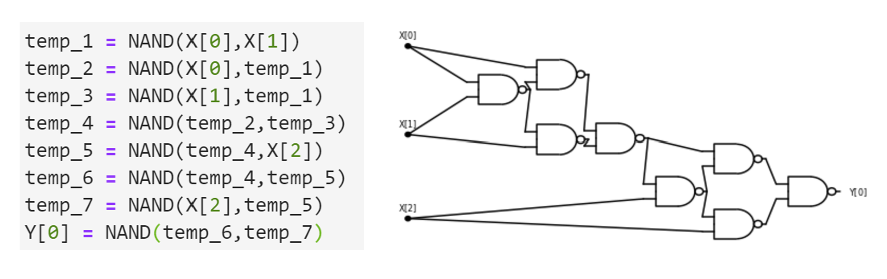</span>
一个 NAND 程序及其对应的电路. 注意程序中的每一行都对应电路中的一个门. 
```

我们省略 {{ref:NANDcircslequivthm}} 的证明, 因为其思路与布尔电路与 AON-CIRC 程序等价的证明完全相同 (参见 {{ref:slcircuitequivthm}}) .   

根据 {{ref:NANDuniversamthm}} 和 {{ref:NANDcircslequivthm}}, 我们知道可以将任意 $s$ 行的 AON-CIRC 程序 $P$ 翻译为一个等价的 NAND-CIRC 程序, 行数最多为 $3s$.   
实际上, 这种翻译可以通过将每一行 `foo = AND(bar,blah)`、`foo = OR(bar,blah)` 或 `foo = NOT(bar)` 替换为使用 `NAND` 的等价 1-3 行来轻松完成.   

我们的 [GitHub 仓库](https://github.com/boazbk/tcscode) 提供了"代码证明": 一个简单的 Python 程序 `AON2NAND`, 可以将 AON-CIRC 转换为等价的 NAND-CIRC 程序. 

```admonish remark title="NAND-CIRC编程语言是否图灵完备?(选读)"
<span id="NANDturingcompleteness"></span>
你可能听说过"图灵完备 (Turing Complete) "这一术语, 有时用来描述编程语言.  (如果没听过, 可以忽略本备注的其余部分: 我们将在 [chapequivalentmodels]() 中给出精确定义. )   

如果听说过, 你可能会好奇 NAND-CIRC 编程语言是否具备这一属性. 答案是否定的, 或者更准确地说, "图灵完备"这个术语并不真正适用于 NAND-CIRC 编程语言.   

原因在于, 根据设计, NAND-CIRC 编程语言只能计算**有限函数** $F:\{0,1\}^n \rightarrow \{0,1\}^m$, 这些函数接受固定数量的输入比特并产生固定数量的输出比特. "图灵完备"这一术语仅适用于可以处理任意长度输入的**无限函数**的编程语言.   

在本书后续章节中, 我们将回到这一区分进行进一步讨论. 
```

## 3.7 上述所有模型的等价性

如果我们将 {{ref:slcircuitequivthm}}、{{ref:NANDuniversamthm}} 和 {{ref:NANDcircslequivthm}} 结合起来, 可得到以下结论: 
```admonish quote title=""
{{thmc}}{equivalencemodelsthm}[有限计算模型之间的等价性]
对于足够大的 $s,n,m$ 以及函数 $f:\{0,1\}^n \rightarrow \{0,1\}^m$, 以下条件彼此等价: 
* $f$ 可以由最多 $O(s)$ 个门的布尔电路 (使用 $\wedge$、$\vee$、$\neg$ 门) 计算.   
* $f$ 可以由最多 $O(s)$ 行的 AON-CIRC 直线程序计算.   
* $f$ 可以由最多 $O(s)$ 个门的 $\NAND$ 电路计算.   
* $f$ 可以由最多 $O(s)$ 行的 NAND-CIRC 直线程序计算. 

这里的"$O(s)$"表示上界最多为 $c \cdot s$, 其中 $c$ 是与 $n$ 无关的常数. 例如, 如果 $f$ 可以由 $s$ 个门的布尔电路计算, 那么它可以由最多 $3s$ 行的 NAND-CIRC 程序计算；如果 $f$ 可以由 $s$ 个门的 NAND 电路计算, 那么它可以由最多 $2s$ 行的 AON-CIRC 程序计算. 
```
```admonish idea title="证明思路"
我们省略正式证明, 该证明可通过结合 {{ref:slcircuitequivthm}}、{{ref:NANDuniversamthm}} 和 {{ref:NANDcircslequivthm}} 得出. 关键观察是: 我们看到的结果允许我们将一个在上述模型之一中计算 $f$ 的程序/电路, 转换为在另一模型中计算 $f$ 的程序/电路, 其行数或门数最多增加一个常数因子 (实际上该常数因子最多为 $3$) .   
```

{{ref:slcircuitequivthm}} 是一个更一般结果的特例.   
我们可以考虑更一般的计算模型, 其中不仅使用 AND/OR/NOT 或 NAND, 还可以使用其他运算 (参见[下文](#othergatessec)) . 事实证明, 布尔电路在计算能力上与这些模型也是等价的.   

所有这些不同的计算定义方式最终导致等价模型, 这表明我们"走在正确的道路上". 它证明了我们选择 AND/OR/NOT 或 NAND 作为基本操作的看似任意的选择是合理的, 因为这些选择并不影响计算模型的能力. 像 {{ref:equivalencemodelsthm}} 这样的等价结果意味着我们可以轻松地在布尔电路、NAND 电路、NAND-CIRC 程序等之间进行转换. 在本书后续内容中, 我们将经常利用这一能力, 通常会根据方便选择最合适的表述, 而不会过分纠结. 因此, 我们不会过于担心例如布尔电路与 NAND-CIRC 程序之间的区别.   

相比之下, 我们将继续特别注意区分**电路/程序**与**函数** (回忆 [functionprogramidea]()) .   
一个函数对应于**计算任务的规范**, 它本质上不同于程序或电路, 后者对应于**任务的实现**. 

### 3.7.1 基于其它门集合的电路  {#othergatessec }

$\AND/\OR/\NOT$ 或 $\NAND$ 并没有什么特别之处. 对于任意函数集合 $\mathcal{G} = \{ G_0,\ldots,G_{k-1} \}$, 我们可以定义使用 $\mathcal{G}$ 中元素作为门的电路的概念, 以及一个"$\mathcal{G}$ 编程语言"的概念, 其中每一行都将一个变量 `foo` 赋值为对某个 $G_i \in \mathcal{G}$ 应用于先前定义的变量或输入变量的结果.   

具体而言, 我们可以做如下定义: 
```admonish quote title=""
{{defc}}{genstraight-lineprogs}[广义直线程序]
设 $\mathcal{F} = \{ f_0,\ldots, f_{t-1} \}$ 为有限布尔函数集合, 其中 $f_i:\{0,1\}^{k_i} \rightarrow \{0,1\}$, $k_i \in \N$.   

一个 **$\mathcal{F}$ 程序** 是一系列语句, 每条语句将某个变量赋值为对某个 $f_i \in \mathcal{F}$ 应用于 $k_i$ 个其他变量的结果. 如上所述, 我们使用 `X[i]` 和 `Y[j]` 表示输入变量和输出变量.   

当存在一个 $\mathcal{F}$ 程序可以计算函数 $\NAND$ 时, 我们称 $\mathcal{F}$ 为**通用运算集** (也称为通用门集) . 
```

AON-CIRC 程序对应于 $\{\AND,\OR,\NOT\}$ 程序, NAND-CIRC 程序对应于仅包含 $\NAND$ 函数的 $\mathcal{F}$ 程序, 但我们也可以定义 $\{\text{IF,ZERO,ONE}\}$ 程序 (见下文) , 或者使用任意其他集合.   

我们还可以定义 **$\mathcal{F}$ 电路**, 它是一个有向图, 其中每个 **门** 对应于应用某个 $f_i \in \mathcal{F}$ 的操作, 每个门有 $k_i$ 条入边和一条出边.  (如果函数 $f_i$ 不是**对称的**, 即输入顺序会影响结果, 那么我们需要标记每条入边对应函数的哪个参数. )   

正如在 {{ref:slcircuitequivthm}} 中, 我们可以证明 $\mathcal{F}$ 电路与 $\mathcal{F}$ 程序是等价的.   
我们已经看到, 对于 $\mathcal{F} = \{AND,OR,NOT\}$, 生成的电路/程序在计算能力上等价于 NAND-CIRC 编程语言, 因为我们可以用 $\AND$/$\OR$/$\NOT$ 计算 $\NAND$, 反之亦然.   

这实际上是一个更一般现象的特例--$\NAND$ 和其他门集的**通用性**--我们将在本书后续章节中深入探讨. 

```admonish example title = "$\\\\{\\\text{IF , ZERO, ONE}\\\\}$电路"
<span id="IZOcircuits"></span>
设 $\mathcal{F} = \{\text{IF , ZERO, ONE}\}$, 其中 $\text{ZERO}:\{0,1\} \rightarrow \{0\}$ 和 $\text{ONE}:\{0,1\} \rightarrow \{1\}$ 分别是常量零函数和常量一函数{{footnote: 也可以将这些函数定义为接受长度为零的输入, 这对模型的计算能力没有影响. }}, $\text{IF}:\{0,1\}^3 \rightarrow \{0,1\}$ 是一个函数, 对输入 $(a,b,c)$, 如果 $a=1$ 则输出 $b$, 否则输出 $c$.   

则 $\mathcal{F}$ 是通用的.   

实际上, 我们可以通过以下 $\NAND$ 的公式证明 $\{\text{IF, ZERO, ONE}\}$ 是通用的: 
$$
\NAND(a,b) = \text{IF}(a,\text{IF}(b,\text{ZERO},\text{ONE}),\text{ONE}) \;.
$$
```

也存在一些计算能力更受限的集合 $\mathcal{F}$.   
例如, 可以证明, 如果我们只使用 $\AND$ 或 $\OR$ 门 (不使用 $\NOT$) , 则无法得到等价的计算模型.   
练习中提供了几个通用门集与非通用门集的示例. 


### 3.7.2 规范 vs. 实现 (再次强调)  {#specvsimplrem}

```admonish quote title=""
<span id="specvsimplfig">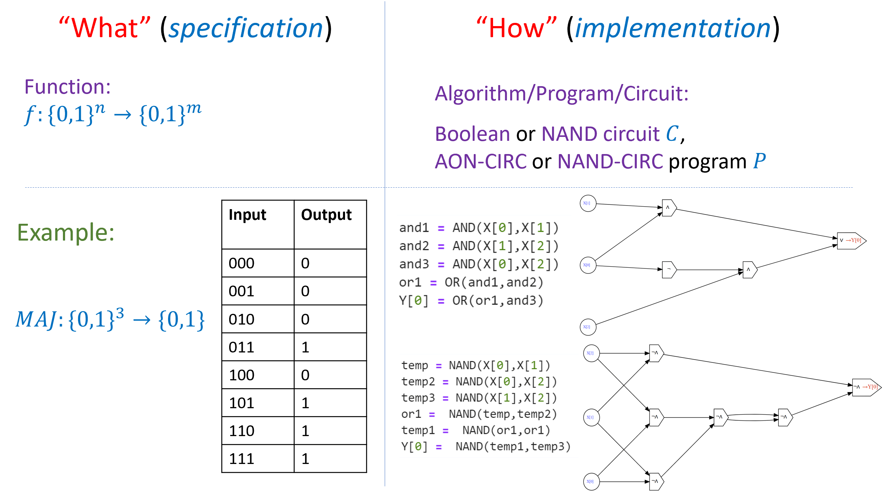</span>
区分计算任务的**规范**与其**实现**至关重要: 规范指明要计算的函数 (即"做什么") , 而实现则是包含将输入映射到输出的指令的算法、程序或电路 (即"如何做") . 同一个函数可以通过多种不同方式实现. 
```

正如我们在 [secimplvsspec]() 中讨论的, 本书中最重要的区别之一是**规范**与**实现**的区分, 即分离"做什么"和"如何做" (见[上图](#specvsimplfig)) .   
一个 **函数** 对应于计算任务的**规范**, 即对于每个特定输入应该产生什么输出.   
一个 **程序** (或电路, 或其他任何用于指定算法的方式) 对应于**实现**, 即如何从输入计算所需输出.   
也就是说, 程序是一组从输入计算输出的指令.   

即便在同一个计算模型内, 也可能有多种不同方式来计算同一个函数. 例如, 计算多数函数的 NAND-CIRC 程序不止一个, 计算加法函数的布尔电路也不止一个, 等等.   

混淆规范与实现 (或等价地, **函数**与**程序**) 是一个常见错误, 而编程语言中常将程序部分称为"函数"也在一定程度上助长了这种误解. 然而, 在计算机科学的理论与实践中, 保持这一区别非常重要, 本书尤其重视这一点. 

```admonish hint title="回顾"
* **算法** 是通过一系列"基本"或"简单"操作来执行计算的步骤或配方.   
* "基本"操作的一种候选定义是集合 $\AND$、$\OR$ 和 $\NOT$.   
* 另一种"基本"操作的候选定义是 $\NAND$ 操作. 它可以通过多种物理方法轻松实现, 包括电子晶体管.   
* 我们可以使用 $\NAND$ 计算许多其他函数, 包括多数、增量等.   
* 还有其他等价选择, 包括集合 $\{\AND,\OR,\NOT\}$ 和 $\{\text{IF,ZERO,ONE}\}$.   
* 我们可以形式化定义函数 $F:\{0,1\}^n \rightarrow \{0,1\}^m$ 可被 **NAND-CIRC 编程语言** 计算的概念.   
* 对于任意基本操作集合, 通过电路可计算与通过直线程序可计算的概念是等价的. 
```

## 习题

```admonish quote title=""
{{proc}}{comparenumbersex}[比较 $4$bit 数字]
给出一个布尔电路 (使用 $\AND/\OR/\NOT$ 门) , 该电路计算函数 $ \text{CMP}_8:\{0,1\}^8 \rightarrow \{0,1\}$, 使得当且仅当由 $a_0a_1a_2a_3$ 表示的数大于由 $b_0b_1b_2b_3$ 表示的数时, $ \text{CMP}_8(a_0,a_1,a_2,a_3,b_0,b_1,b_2,b_3)=1$. 
```

```admonish quote title=""
{{proc}}{compareasymnumbersex}[比较 $n$bit 数字]
证明存在常数 $c$, 使得对任意正整数 $n$, 存在一个布尔电路 (由 $\AND,\OR,\NOT$ 门构成) $C$, 其门数不超过 $c\cdot n$, 并能计算函数 $ \text{CMP}_{2n}:\{0,1\}^{2n}\rightarrow\{0,1\}$, 满足: 对任意输入 $a_0\cdots a_{n-1}\; b_0\cdots b_{n-1}$, 有
$$\text{CMP}_{2n}(a_0\cdots a_{n-1}\; b_0\cdots b_{n-1})=1$$
当且仅当由 $a_0\cdots a_{n-1}$ 表示的数大于由 $b_0\cdots b_{n-1}$ 表示的数. 
```

```admonish quote title=""
{{proc}}{ornotex}[$\{\OR,\NOT\}$ 是通用的]
证明集合 $\{\OR,\NOT\}$ 是**通用的**, 即可以仅使用这些门来计算 $\NAND$. 
```

```admonish quote title=""
{{proc}}{andorex}[$\{\AND,\OR,0,1\}$ 不是通用的]
证明: 对于任意只包含 $\AND$ 和 $\OR$ 门, 以及计算常数函数 $0$ 和 $1$ 的门的 $n$ 位输入电路 $C$, $C$ 是**单调的**, 即若 $x,x'\in\{0,1\}^n$ 且对每个 $i\in [n]$ 有 $x_i\le x'_i$, 则 $C(x)\le C(x')$. 
由此可得集合 $\{\AND,\OR,0,1\}$ **不是通用的**. 
```

```admonish quote title=""
{{proc}}{xorex}[$\{\XOR,0,1\}$ 不是通用的]
证明: 对于任意仅包含 $\XOR$ 门以及计算常数函数 $0$ 和 $1$ 的门的 $n$ 位输入电路 $C$, $C$ 是**仿射 (模 $2$) 或线性的**, 即存在 $a\in\{0,1\}^n$ 和 $b\in\{0,1\}$, 使得对任意 $x\in\{0,1\}^n$ 都有
$$C(x)=\sum_{i=0}^{n-1} a_i x_i + b \mod 2.$$
由此可得集合 $\{\XOR,0,1\}$ **不是通用的**. 
```

```admonish quote title=""
{{proc}}{majnotex}[$ \{\text{MAJ}, \NOT, 1\} $ 是通用的]
设 $ \text{MAJ}:\{0,1\}^3 \rightarrow \{0,1\}$ 为**多数函数** (当且仅当三个输入中至少有两个为 $1$ 时输出 $1$) . 证明集合 $ \{\text{MAJ},\ \text{NOT},\ 1\} $ 是**通用的**门集. 
```

```admonish quote title=""
{{proc}}{majnotextwo}[$\{\text{MAJ},\NOT\}$ 不是通用的]
证明 $\{\text{MAJ},\ \text{NOT}\}$ 不是通用门集. 见脚注中的**提示**. {{footnote: **提示:** 利用 $\text{MAJ}(\overline{a},\overline{b},\overline{c}) = \overline{\text{MAJ}(a,b,c)}$, 证明任何仅由 $\text{MAJ}$ 与 $\NOT$ 门构成的电路所计算的函数 $f:\{0,1\}^n \rightarrow \{0,1\}$ 都满足 $f(0,0,\ldots,0) \neq f(1,1,\ldots,1)$. }}感谢 Nathan Brunelle 和 David Evans 对本练习的建议. 
```

```admonish quote title=""
{{proc}}{norex}[$\text{NOR}$ 是通用的]
令 $\text{NOR}:\{0,1\}^2 \rightarrow \{0,1\}$, 定义为 $\text{NOR}(a,b) = \NOT(\OR(a,b))$. 证明集合 $\{\text{NOR}\}$ 是一个通用门集. 
```

```admonish quote title=""
{{proc}}{lookupex}[Lookup 是通用的]
证明集合 $\{\text{LOOKUP}_1, 0, 1\}$ 是通用门集, 其中 $0$ 和 $1$ 是常数函数, 且 $\text{LOOKUP}_1:\{0,1\}^3 \rightarrow \{0,1\}$ 满足: 当 $c=0$ 时 $\text{LOOKUP}_1(a,b,c)=a$, 当 $c=1$ 时 $\text{LOOKUP}_1(a,b,c)=b$. 
```

```admonish quote title=""
{{proc}}{universal-bound}[通用基底大小的界 (困难) ]
证明: 对任意集合 $B$ ($B$ 为从 $\{0,1\}^k$ 到 $\{0,1\}$ 的函数的子集) , 如果 $B$ 是通用的, 则存在一个最多 $O(1)$ 个门的 $B$-电路来计算 $\NAND$ 函数.  (可先证明存在一个大小至多 $O(k^{16})$ 的 $B$-电路. ) {{footnote:感谢 Alec Sun 和 Simon Fischer 对本题的评论. }}
```

```admonish quote title=""
{{proc}}{nandcircsizeex}[电路规模与输入/输出]
证明: 对于任意具有 $n$ 个输入和 $m$ 个输出的 $\NAND$ 电路, 若电路规模为 $s$, 则 $s \ge \min\{n/2,\; m\}$. 见脚注中的**提示**. {{footnote: **提示:** 利用布尔电路定义中对于输入顶点必须至少有一个出边以及电路恰有 $m$ 个输出门的条件. 另见相关[备注](#booleancircuitsremarks)}}. 
```

```admonish quote title=""
{{proc}}{threshold-nand-ex}[使用 $\NAND$ 的阈值函数]
证明存在常数 $c$, 使得对任意 $n>1$ 以及任意整数 $a_0,\ldots,a_{n-1},b \in \{-2^n,-2^n+1,\ldots,-1,0,1,\ldots,2^n\}$, 存在一个 $\NAND$ 电路, 该电路至多包含 $c\,n^4$ 个门, 并能计算阈值函数 $f_{a_0,\ldots,a_{n-1},b}:\{0,1\}^n \rightarrow \{0,1\}$: 对输入 $x\in\{0,1\}^n$, 当且仅当 $\sum_{i=0}^{n-1} a_i x_i > b$ 时输出 $1$. 
```

```admonish quote title=""
{{proc}}{NANDsfromActivationfunctionex}[由激活函数构造 $\NAND$]
我们称函数 $f:\mathbb{R}^2 \rightarrow \mathbb{R}$ 为 **$\NAND$ 近似器**, 如果它满足以下性质: 对任意 $a,b\in\mathbb{R}$, 当 $\min\{|a|,|1-a|\}\le 1/3$ 且 $\min\{|b|,|1-b|\}\le 0.1$ 时, 有
$$|f(a,b) - \NAND(\lfloor a \rceil,\lfloor b \rceil)| \le 0.1,$$
其中 $\lfloor x \rceil$ 表示与 $x$ 最接近的整数. 也就是说, 当 $a,b$ 在距离 $\{0,1\}$ 不超过 $1/3$ 的区域内时, 我们要求 $f(a,b)$ 等于与 $a,b$ 最近的那两个 $\{0,1\}$ 值的 $\NAND$ 值 (允许 $0.1$ 的误差) . 若 $a,b$ 不满足该接近条件, 则对 $f(a,b)$ 的值不作要求. 

在本练习中你将证明可以从常见的深度神经网络激活函数构造出 $\NAND$ 近似器. 作为推论, 你将得到深度神经网络可以模拟 $\NAND$ 电路. 由于 $\NAND$ 电路也可以模拟深度神经网络, 这两种计算模型因而等价. 

1. 证明存在一个 $\NAND$ 近似器 $f$, 其形式为
$$f(a,b) = L(\mathrm{DReLU}(L'(a,b)))$$
其中 $L':\mathbb{R}^2\to\mathbb{R}$ 为**仿射**函数 (即 $L'(a,b)=\alpha a + \beta b + \gamma$, 某些 $\alpha,\beta,\gamma\in\mathbb{R}$) , $L$ 也是仿射函数 ($L(y)=\alpha y + \beta$) , 而 $\mathrm{DReLU}:\mathbb{R}\to\mathbb{R}$ 定义为 $\mathrm{DReLU}(x)=\min(1,\max(0,x))$. 注意 $\mathrm{DReLU}(x)=1-\mathrm{ReLU}(1-\mathrm{ReLU}(x))$, 其中 $\mathrm{ReLU}(x)=\max(x,0)$ 是常用的整流线性单元激活函数. 

2. 证明存在一个 $\NAND$ 近似器 $f$, 其形式为
$$f(a,b) = L(\mathrm{sigmoid}(L'(a,b)))$$
其中 $L',L$ 如上为仿射函数, 且 $\mathrm{sigmoid}:\mathbb{R}\to\mathbb{R}$ 定义为 $\mathrm{sigmoid}(x)=\dfrac{e^x}{e^x+1}$. 

3. 证明存在一个 $\NAND$ 近似器 $f$, 其形式为
$$f(a,b) = L(\tanh(L'(a,b)))$$
其中 $L',L$ 如上为仿射函数, 且 $\tanh:\mathbb{R}\to\mathbb{R}$ 定义为 $\tanh(x)=\dfrac{e^x-e^{-x}}{e^x+e^{-x}}$. 

4. 证明: 对任意具有 $n$ 个输入且单输出的 $\NAND$ 电路 $C$ (计算函数 $g:\{0,1\}^n\to\{0,1\}$) , 如果用 $\NAND$ 近似器替换 $C$ 中的每一个门, 然后将得到的"近似电路"在某个 $x\in\{0,1\}^n$ 上求值, 则输出为某个实数 $y$, 且满足 $|y-g(x)|\le 1/3$. 
```

```admonish quote title=""
{{proc}}{majwithNAND}[用 $\NAND$ 高效实现多数函数]
证明存在常数 $c$, 使得对任意 $n>1$, 存在一个包含至多 $c\cdot n$ 个门的 $\NAND$ 电路, 该电路计算 $n$ 位输入的多数函数 $\mathrm{MAJ}_n:\{0,1\}^n\to\{0,1\}$, 即当且仅当 $\sum_{i=0}^{n-1} x_i > n/2$ 时 $\mathrm{MAJ}_n(x)=1$. 见脚注中的**提示**. {{footnote: **提示:** 一个可行的方法是使用递归并用所谓的"主定理 (Master Theorem) "进行分析. }}
```

```admonish quote title=""
{{proc}}{outputlastlayer}[输出放在最后一层]
证明: 对任意 $f:\{0,1\}^n\to\{0,1\}$, 若存在一个门数为 $s$ 的布尔电路 $C$ 计算 $f$, 则存在另一个门数不超过 $s$ 的布尔电路 $C'$, 使得在 $C'$ 的最小分层 (minimal layering) 中, 输出门位于最后一层. 见脚注中的**提示**. {{footnote: **提示:** 层次中位于输出之后的顶点可以安全地移除而不改变电路功能. }}
```

## 杂记

阿尔-花拉子米 (Al-Khwarizmi) 著作的摘录来自《The Algebra of Ben-Musa》, Fredric Rosen, 1831 年. 

查尔斯·巴贝奇 (Charles Babbage, 1791-1871) 是具有远见的科学家、数学家和发明家 (参见 [@swade2002the, @collier2000charles]) .   
在现代电子计算机发明的一个多世纪之前, 巴贝奇就意识到计算原则上可以机械化.   
他设计的第一台机械计算机是**差分机 (difference engine) **, 用于多项式插值.   
随后他设计了**解析机 (analytical engine) **, 这是一台更加通用的机器, 也是第一台可编程通用计算机的原型.   
遗憾的是, 巴贝奇从未完成这些原型机的设计.   
最早意识到解析机潜力及其深远影响的人之一是阿达·洛芙莱斯 (Ada Lovelace)  (参见 [chaploops]() 注释) . 

布尔代数最早由布尔 (Boole) 和德摩根 (DeMorgan) 在 1840 年代研究 [@Boole1847mathematical, @DeMorgan1847].   
布尔电路的定义及其与电继电器电路的联系由香农 (Shannon) 在其硕士论文中提出 [@Shannon1938].   
 (霍华德·加德纳称香农的论文为"可能是 20 世纪最重要、也最著名的硕士论文". )   
萨维奇 (Savage) 的书 [@Savage1998models] 与本书类似, 从布尔电路作为第一个模型开始引入计算理论.   
Jukna 的书 [@Jukna12] 提供了现代深入的布尔电路论述, 另见 [@wegener1987complexity]. 

Sheffer [@Sheffer1913] 证明了 $\NAND$ 函数是通用的, 尽管早期 Peirce 的工作中也出现过类似结论, 参见 [@Burks1978charles].   
怀特海德 (Whitehead) 和罗素 (Russell) 在其巨著《数学原理》 (_Principia Mathematica_) 中使用 $\NAND$ 作为逻辑基础 [@WhiteheadRussell1912].   
Ernst 在其博士论文中 [@Ernst2009phd] 实证研究了各种函数的最小 $\NAND$ 电路.   
Nisan 和 Shocken 的书 [@NisanShocken2005] 从 $\NAND$ 门开始构建计算系统, 直到高级程序和游戏 ("$\NAND$ 到 Tetris") ；另见网站 [nandtotetris.org](https://www.nand2tetris.org/). 

我们在 {{ref:booleancircdef}} 中将布尔电路的**大小**定义为其包含的门的数量. 这是文献中使用的两种约定之一. 另一种约定是将大小定义为**导线**的数量 (等价于门的数量加输入数量) .   
在几乎所有情况下, 这差异很小, 但可能影响某些"病态例子"的电路规模复杂度, 例如常量零函数, 其输出几乎不依赖输入. 
