** 本章仍在翻译中 **

<!-- toc -->

# 4. 语法糖与通用函数计算 { #finiteuniversalchap }

## 学习目标{ .objectives }
* 习惯于语法糖或高级逻辑到低级门电路的自动转换. 
* 学习重要结论的证明: 任何有限函数都能通过布尔电路计算. 
* 开始从量化角度思考计算过程所需的代码行数. 

```admonish quote
[于1951年] 我曾有一个能运行的编译器, 但没人愿意碰它, 因为他们谨慎地告诉我, 计算机只能做算术, 不能执行程序.

*-Grace Murray Hopper, 1986.*
```

```admonish quote
语法糖会引起分号癌.

*-Alan Perlis, 1982.*
```

我们目前所考察的计算模型, 可谓极其精简.  
例如. 我们的 NAND-CIRC "编程语言" 仅包含单一操作 `foo = NAND(bar,blah)`.  
本章将揭示, 这些简单模型实际上与更复杂的模型完全等价.
关键发现在于: 我们可以用基础构件来实现复杂功能, 再将这些新功能作为构件去实现更高级的功能. 
这在编程语言设计领域被称为"语法糖"——因为我们并未改变底层编程模型本身, 而只是通过语法转换, 将使用了新特性的程序转译为不依赖这些特性的等效程序.

本章将提供一个"工具箱", 以用于证明许多函数都能通过NAND-CIRC程序(进而也能通过布尔电路)进行计算. 我们还将借助这个工具箱证明一个基本定理: 任意有限函数 $f:\{0,1\}^n \rightarrow \{0,1\}^m$ 都能由布尔电路实现(详见下文{{ref:thm:circuit-univ}}).  
虽然语法糖工具箱本身具有重要意义, 但{{ref:thm:circuit-univ}}也可以在不使用该工具箱的情况下直接证明. 我们将在[第4.5节](chapter_4.md#seccomputalternative)呈现这种替代证明方法. 图{{ref:fig:computefuncoverview}}概括了本章的核心结论脉络.

<!--图4.1-->
```admonish pic id="computefuncoverviewfig"
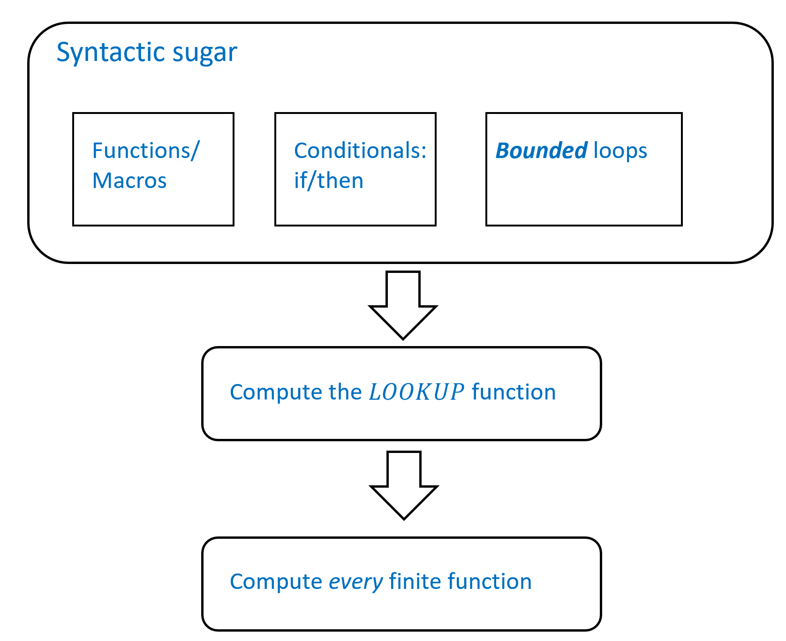

{{pic}}{fig:computefuncoverview} 本章内容概要如下: 在[第4.1节](chapter_4.md#secsyntacticsugar)中, 我们将提供一套"语法糖"功能模块, 展示如何在NAND-CIRC中实现程序员自定义函数和条件语句等特性. 在[第4.3节](chapter_4.md#seclookupfunc)中, 我们将运用这些工具构建计算$LOOKUP$函数的NAND-CIRC程序(或等效的布尔电路). 由此出发, 我们将在[第4.4节](chapter_4.md#seccomputeallfunctions)中证明: NAND-CIRC程序(即布尔电路)能够计算 **所有** 有限函数. 该结论的另一种直接证明方法将在[第4.5节](chapter_4.md#seccomputalternative)中呈现. 
```

```admonish info title = "简要概述"
阅读本章, 我们希望读者能够有以下收获: 
 - 本章中, 我们将会得出第一个主要结果: **每个** 有限函数都可以被一些布尔电路计算(参见{{ref:thm:circuit-univ}} 和 {{ref:ide:finitecomputation}}).
 其有时也被称为$AND$, $OR$ 与 $NOT$ 函数的"通用性" (利用[第3章](chapter_3.md)中的等价, 这也是$NAND$的"通用性")
 - 尽管{{ref:thm:circuit-univ}}是一项重要结论, 但其证明过程实际上并不复杂. [第4.5节](chapter_4.md#seccomputalternative)将给出该结论的一个相对简洁的直接证明. 
 不过在[第4.1节](chapter_4.md#secsyntacticsugar)和[第4.3节](chapter_4.md#seclookupfunc)中, 我们采用了"语法糖"(参见{{ref:ide:synsugar}})这一概念来推导该结论. 对于编程语言的理论与实践而言, 这都是一个至关重要的概念. 
 "语法糖"的核心思想在于: 我们可以通过基础组件实现高级功能, 从而扩展编程语言的表现力. 例如, 基于[第3章](chapter_3.md)介绍的AON-CIRC和NAND-CIRC编程语言, 我们可以通过扩展实现用户自定义函数(如`def Foo(...)`)、条件语句(如`if blah ...`)等高级特性. 
 一旦掌握了这些扩展功能, 我们就不难证明: 通过获取任意函数的真值表(即所有输入输出对应表), 可以据此创建出能将每个输入映射至对应输出的AON-CIRC或NAND-CIRC程序. 
 - 本章中我们还将首次接触 **定量分析** 的概念. 虽然{{ref:thm:circuit-univ}}定理指出每个函数都能通过某个电路实现, 但该电路所需逻辑门的数量可能呈指数级增长. 
 (此处使用的"指数级"并非口语中泛指的"非常巨大", 而是精确的数学概念——当然这个数学概念恰好也意味着规模极其庞大. )
 我们发现, **某些函数** (例如, 整数加法和乘法) 事实上可以用更少的门电路计算. 我们将在[第5章](./chapter_5.md)与接下来的章节中更加深入探讨这种"门电路复杂度".
```

## 4.1 语法糖的一些例子  { #secsyntacticsugar }

现在我们将展示若干"语法糖"转换的实例, 这些转换可用于构建直线式程序或电路. 我们主要从计算模型的**直线式编程语言**视角出发, 并具体以NAND-CIRC编程语言为例进行说明(以便更清晰地阐述概念). 
这种视角的便利之处在于, 我们介绍的多数语法糖转换最容易理解的方式, 就是将其视为对程序源代码进行"查找替换"操作. 根据{{ref:thm:equivalencemodels}}定理, 我们得到的所有结论同样适用于电路模型——无论是使用NAND门的电路, 还是使用AND、OR及NOT门构成的布尔电路. 
虽然详细列举这类语法糖转换的实例可能略显枯燥, 但我们之所以这样做, 主要基于两个原因: 

1. 这可以让你确信, 尽管布尔电路或NAND-CIRC编程语言等简单模型看似基础且存在局限性, 但它们实际上具有强大的表达能力. 

2. 于是你就可以意识到, 选择学习计算理论课程而非编译原理课程是多么幸运... `:)`

### 4.1.1 用户定义过程

几乎所有编程语言都具备一个核心功能: 定义并执行**过程**或**子程序**的能力(在某些语言中常称为 **函数** , 但为避免与程序计算的函数混淆, 我们更倾向于使用*过程*这一名称). NAND-CIRC编程语言本身并未内置这种机制, 但我们可以通过沿用已久的"复制粘贴"技巧实现相同效果. 具体来说, 我们可以将定义过程的代码: 

```python
def Proc(a,b):
    proc_code
    return c
some_code
f = Proc(d,e)
some_more_code
```

替换为以下形式, 其中直接"粘贴"`Proc`过程的代码: 

```python
some_code
proc_code'
some_more_code
```

其中`proc_code'`是通过将`Proc`代码中所有`a`替换为`d`、`b`替换为`e`、`c`替换为`f`而得到的. 在执行此操作时, 我们需要确保`proc_code'`中出现的所有其他变量不会与其他变量产生冲突——这总是可以通过将变量重命名为之前未使用过的新名称来实现. 
由上述推理, 我们可以得到以下定理:

```admonish quote title=""
{{thmc}}{thm:functionsynsugar}[语法糖: 过程定义]

令 NAND-CIRC-PROC 为 NAND_CIRC 编程语言的一个拓展, 其具有定义过程的语法.
则对于每个 NAND-CIRC-PROC 程序 $P$, 存在一个标准的 (即"无糖") NAND-CIRC 程序 $P'$ 与 $P$ 计算相同的函数.
```

```admonish info
{{remc}}{rem:norecursion}[无递归过程]

NAND-CIRC-PROC只允许 **无递归** 过程. 事实上, 过程`Proc`的代码无法调用`Proc`, 而只能使用在其之前定义的过程.
如果没有这样的限制, 上述的"搜索并替换"的过程可能永远无法结束, 而{{ref:thm:functionsynsugar}}随之不成立.
```

{{ref:thm:functionsynsugar}} 可通过上述转换方法证明, 但由于形式化证明过程较为冗长繁琐, 此处予以省略. 

~~~admonish example
{{exac}}{exa:majcircnand}[使用语法糖通过NAND计算多数函数]
过程机制让我们能够更清晰简洁地表达NAND-CIRC程序. 例如, 由于我们可以通过NAND实现AND、OR和NOT运算, 因此可以通过以下方式计算 **多数** 函数: 

```python
def NOT(a):
    return NAND(a,a)
def AND(a,b):
    temp = NAND(a,b)
    return NOT(temp)
def OR(a,b):
    temp1 = NOT(a)
    temp2 = NOT(b)
    return NAND(temp1,temp2)

def MAJ(a,b,c):
    and1 = AND(a,b)
    and2 = AND(a,c)
    and3 = AND(b,c)
    or1 = OR(and1,and2)
    return OR(or1,and3)

print(MAJ(0,1,1))
# 1
```

{{ref:fig:progcircmaj}} 展示了通过"展开"此程序(将其中的过程调用替换为具体定义)后得到的"无糖"版NAND-CIRC程序及其对应电路. 
~~~

```admonish bigidea
{{idec}}{ide:synsugar}
一旦我们证明某个计算模型 $X$ 与具有特性 $Y$ 的模型等价, 那么在论证函数 $f$ 可由 $X$ 计算时, 即可直接假定我们拥有特性 $Y$. 
```

```admonish pic id="progcircmajfig"
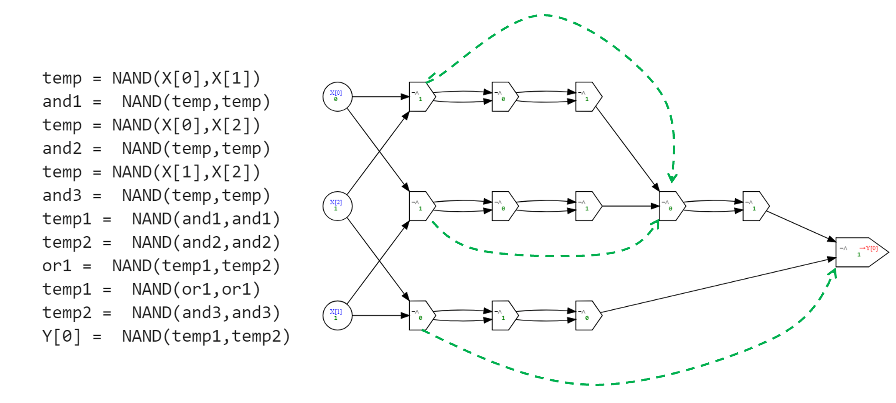

{{pic}}{fig:progcircmaj} 通过展开多数函数程序({{ref:exa:majcircnand}})中的过程定义后得到的标准(即"无糖")NAND-CIRC程序, 右侧为其对应电路. 需注意, 这并非实现多数函数最高效的NAND电路/程序: 通过简化某些步骤(例如当门电路 $u$ 计算 $NAND(v,v)$ 后, 门电路 $w$ 又计算 $NAND(u,u)$ 的情况, 图中绿色虚线箭头标示处), 我们可以减少逻辑门的使用数量. 
```

```admonish info
{{remc}}{rem:countinglines}[计算行数]

尽管我们可以通过使用语法糖来以一种更易读的方式 **表示** NAND-CIRC程序, 我们并没有改变语言本身的定义.
因此, 不管什么时候, 当我们说某个函数 $f$ 有一个 $s$ 行的NAND-CIRC程序时, 我们指的总是一个标准"无糖"NAND-CIRC程序, 其中所有的语法糖都已经被展开了.
例如, {{ref:exa:majcircnand}}的程序是计算 $MAJ$ 的一个 $12$ 行程序, 尽管使用NAND-CIRC-PROC时其可以用更少的代码行数写出.
```

### 4.1.2 由Python证明 (选读) { #functionsynsugarthmpython }

我们可以编写一个Python程序来实现{{ref:thm:functionsynsugar}}的证明. 该程序将接受包含过程定义的NAND-CIRC-PROC程序$P$, 通过简单的"查找替换"操作将其转换为标准的(即"无糖")NAND-CIRC程序$P'$, 使得$P'$在不使用任何过程的情况下计算与$P$相同的函数. 

核心思路很简单: 如果程序$P$包含一个带有两个参数`x`和`y`的过程`Proc`的定义, 那么每当遇到形如`foo = Proc(bar,blah)`的语句时, 我们可以用以下内容替换该行: 

1. 过程`Proc`的主体代码(将所有出现的`x`和`y`分别替换为`bar`和`blah`)

2. 一行`foo = exp`, 其中`exp`是过程`Proc`定义中`return`语句后面的表达式

为使转换更加健壮, 我们可以为`Proc`使用的内部变量添加前缀, 以确保它们不会与$P$中的变量冲突; 为简化起见, 我们在下面的代码中暂不考虑这个问题, 但实际实现时可以轻松添加此功能. 

以下Python函数`desugar`的代码实现了这样的转换: 

```admonish example
{{exac}}{exa:desugarcode}[将NAND-CIRC-PROC程序转化为标准无糖NAND-CIRC程序的Python代码]
~~~python
def desugar(code, func_name, func_args,func_body):
    """
    将所有具有形式
       foo = func_name(func_args) 
    用以下代码替换
       func_body[x->a,y->b]
       foo = [result returned in func_body]    
    """
    # 使用Python的正则表达式来简化代码
    # 参见 https://docs.python.org/3/library/re.html 和本书第九章

    # 捕获由逗号分割的参数列表的正则表达式
    arglist = ",".join([r"([a-zA-Z0-9\_\[\]]+)" for i in range(len(func_args))])
    # 捕获具有下列形式的正在表达式
    # "variable = func_name(arguments)"
    regexp = fr'([a-zA-Z0-9\_\[\]]+)\s*=\s*{func_name}\({arglist}\)\s*$'#$
    while True:
        m = re.search(regexp, code, re.MULTILINE)
        if not m: break
        newcode = func_body 
        # 将函数的参数用函数调用时传入的变量替换
        for i in range(len(func_args)): 
            newcode = newcode.replace(func_args[i], m.group(i+2))
        # 将新代码插入
        newcode = newcode.replace('return', m.group(1) + " = ")
        code = code[:m.start()] + newcode + code[m.end()+1:]
    return code
~~~
{{ref:fig:progcircmaj}} 展示了, 对{{ref:exa:majcircnand}}中使用语法糖计算的多数函数程序, 将`desugar`函数应用于其上得到的结果. 
具体来说, 我们首先应用`desugar`移除OR函数的使用, 然后再次应用以移除AND函数的使用, 最后第三次应用以移除NOT函数的使用. 
```

```admonish info
{{remc}}{rem:parsingdeg}[解析函数定义 (选读)]

{{ref:exa:desugarcode}}中的`desugar`函数假定过程定义已被拆分为名称、参数和主体部分. 
虽然精确描述如何扫描定义, 并将其拆分为这些组件, 对我们的目的并不关键. 但如果感兴趣, 可以通过以下Python代码实现这一拆分过程: 

~~~python
def parse_func(code):
    """将一个函数定义解析为名称, 参数列表与函数体"""
    lines = [l.strip() for l in code.split('\n')]
    regexp = r'def\s+([a-zA-Z\_0-9]+)\(([\sa-zA-Z0-9\_,]+)\)\s*:\s*'
    m = re.match(regexp,lines[0])
    return m.group(1), m.group(2).split(','), '\n'.join(lines[1:])
~~~
```


### 4.1.3 条件语句 {#ifstatementsec }

NAND-CIRC语言中另一个严重缺失的特性是条件语句(例如许多编程语言中常见的`if`/`then`结构). 
不过, 通过运用过程机制, 我们可以实现一种替代的条件判断结构. 
首先我们需要计算函数 $IF:\{0,1\}^3 \rightarrow \{0,1\}$, 该函数满足: 当 $a=1$ 时输出 $b$, 当 $a=0$ 时输出 $c$. 

```admonish pause title="思考时刻"
在继续阅读前, 请尝试思考如何用$NAND$门实现$IF$函数. 完成这一步后, 再思考如何利用它来模拟`if`/`then`类型的结构. 
```

如{{ref:pro:mux}}所示, $IF$函数可以通过NAND门按如下方式实现: 

```python
def IF(cond,a,b):
    notcond = NAND(cond,cond)
    temp = NAND(b,notcond)
    temp1 = NAND(a,cond)
    return NAND(temp,temp1)
```

$IF$又被称为 **多路** 函数, 因为$cond$可以被视作一个控制输出与$a$还是$b$相连的开关.
只要我们由计算$IF$函数的过程, 就可以在NAND中实现条件语句.
其思路为将具有以下形式的代码

```python
if (condition):  assign blah to variable foo
```

替换为具有以下形式的代码

```python
foo   = IF(condition, blah, foo)
```

其在`condition`等于$0$时将`foo`赋值为旧值, 否则将`foo`赋值为`blah`的值.
更一般地, 我们将如下形式的代码

```python
if (cond):
    a = ...
    b = ...
    c = ...
```

替换为如下形式的代码

```python
temp_a = ...
temp_b = ...
temp_c = ...
a = IF(cond,temp_a,a)
b = IF(cond,temp_b,b)
c = IF(cond,temp_c,c)
```

通过运用此类转换方法, 我们可以证明以下定理. 尽管其完整形式化证明(启发性有限)在此从略, 但读者可参阅[第4.1.2节](chapter_4.md#functionsynsugarthmpython)获取相关证明思路的提示. 

```admonish quote title=""
{{thmc}}{thm:conditionalsugar}[语法糖: 条件语句]
设NAND-CIRC-IF为在NAND-CIRC编程语言基础上扩展了`if`/`then`/`else`语句的语言版本, 允许代码根据变量取值是否为$0$或$1$来条件执行.   
则对于任意NAND-CIRC-IF程序$P$, 都存在一个标准的(即"无糖")NAND-CIRC程序$P'$能计算与$P$完全相同的函数. 
```

## 4.2 拓展样例: 加法与乘法(选读) { #addexample }

使用"语法糖", 我们能够写出以下的整数加法函数:

```python
# 将两个n为整数相加
# 为了简便, 使用最低有效位优先表示法
def ADD(A,B):
    Result = [0]*(n+1)
    Carry  = [0]*(n+1)
    Carry[0] = zero(A[0])
    for i in range(n):
        Result[i] = XOR(Carry[i],XOR(A[i],B[i]))
        Carry[i+1] = MAJ(Carry[i],A[i],B[i])
    Result[n] = Carry[n]
    return Result

ADD([1,1,1,0,0],[1,0,0,0,0]);;
# [0, 0, 0, 1, 0, 0]
```

其中`zero`是常数零函数, `MAJ`和`XOR`分别对应多数函数与异或函数. 虽然我们为方便起见使用了Python语法, 但此例中$n$是某个 **固定整数** , 因此对每个这样的$n$而言, `ADD`都是一个接收$2n$位输入并输出$n+1$位的有限函数. 特别地, 对于每个$n$, 我们只需将代码重复$n$次(将`i`的值依次替换为$0,1,2,\ldots,n-1$)即可消除`for i in range(n)`循环结构. 通过展开所有特性, 对每个$n$的取值, 我们都能将上述程序转换为标准的(无糖)NAND-CIRC程序. {{ref:fig:add2bitnumbers}}展示了$n=2$时的转换结果. 

```admonish pic id="add2bitnumbersfig"
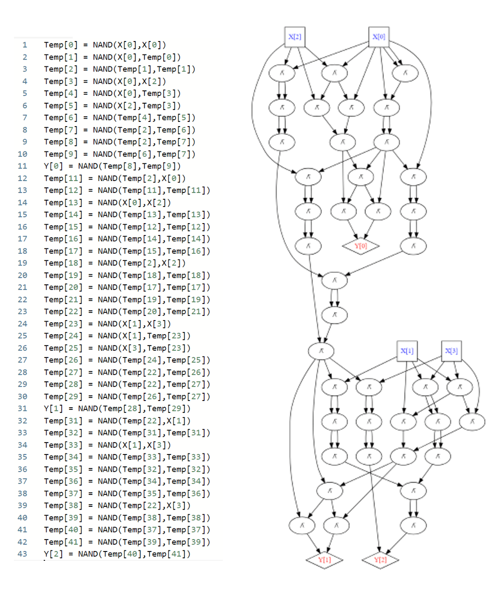

{{pic}}{fig:add2bitnumbers} 通过"展开"所有语法糖功能得到的用于两个二进制数相加的NAND-CIRC程序及对应NAND电路. 该程序/电路包含43行代码/逻辑门, 但这远非最优实现. 实际上只需使用$9n$个NAND门即可完成$n$位二进制数的加法运算, 具体实现方法参见{{ref:pro:halffulladder}}. 
```

通过仔细分析上述程序并统计逻辑门数量, 我们可以证明以下定理(另见{{ref:fig:addnumoflines}}): 

```admonish quote title=""
{{thmc}}{thm:addition}[使用NAND-CIRC程序实现加法运算]
对于任意$n\in \N$, 令$ADD_n:\{0,1\}^{2n}\rightarrow \{0,1\}^{n+1}$为如下函数: 给定$x,x'\in \{0,1\}^n$, 计算$x$和$x'$所表示数值之和的二进制表示. 则存在常数$c \leq 30$, 使得对每个$n$, 都存在一个最多包含$cn$行代码的NAND-CIRC程序可计算$ADD_n$. {{footnote: $c$的值可优化至$9$, 具体参见{{ref:pro:halffulladder}}. }}
```

```admonish pic id="addnumoflinesfig"
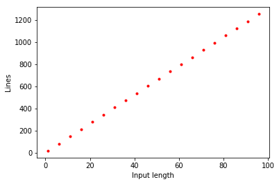

{{pic}}{fig:addnumoflines} 我们实现的两位$n$比特二进制数相加的NAND-CIRC程序行数随$n$的变化关系($n$取值1到100). 虽然这不是该任务的最优实现, 但关键之处在于其复杂度呈现$O(n)$的线性特征. 
```

只要有了加法, 我们就可以使用小学乘法算法来获得乘法, 从而得到以下定义:

```admonish quote title=""
{{thmc}}{thm:theorem}[使用NAND-CIRC程序实现乘法运算]
对于任意$n$, 设$MULT_n:\{0,1\}^{2n}\rightarrow \{0,1\}^{2n}$为这样的函数: 给定$x,x'\in \{0,1\}^n$, 计算$x$和$x'$所表示数值之积的二进制表示. 则存在常数$c$, 使得对每个$n$, 都存在一个最多包含$cn^2$行代码的NAND-CIRC程序可计算函数$MULT_n$. 
```

我们在此省略证明过程, 不过在{{ref:pro:multiplication}}中, 我们将要求您以(用您熟悉的编程语言编写的)程序形式提供一份"构造性证明": 该程序以数字$n$作为输入, 输出一个最多包含$1000n^2$行代码的NAND-CIRC程序, 用于计算$MULT_n$函数. 
实际上, 利用Karatsuba算法可以证明: 存在一个包含$O(n^{\log_2 3})$行代码的NAND-CIRC程序能够计算$MULT_n$函数(若采用更优算法, 还能实现更进一步的渐进性优化). 

## 4.3 LOOKUP函数 { #seclookupfunc }

$LOOKUP$ 函数将在本章及后续章节中扮演重要角色.
其定义如下:

```admonish quote title="" 
{{defc}}{def:lookup}[查找函数]
对于每个 $k$, $k$阶 **查找** 函数 $LOOKUP_k: \{0,1\}^{2^k+k}\rightarrow \{0,1\}$ 定义如下:
对于每个 $x\in\{0,1\}^{2^k}$ 和 $i\in \{0,1\}^k$,
$$
LOOKUP_k(x,i)=x_i
$$
其中 $x_i$ 表示 $x$ 的第 $i^{th}$ 个条目, 使用二进制表示将 $i$ 识别为 $\{0,\ldots,2^k - 1 \}$ 中的一个数字.
```

```admonish pic id="lookupfig"
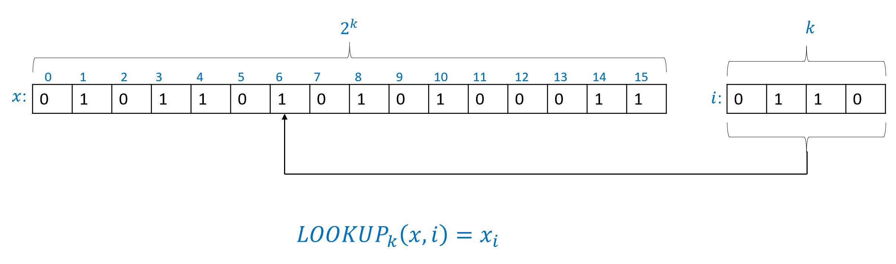

{{pic}}{fig:lookup} $LOOKUP_k$ 函数接受一个输入在 $\{0,1\}^{2^k+k}$ 中, 我们将其表示为 $x,i$ (其中 $x\in \{0,1\}^{2^k}$ 和 $i \in \{0,1\}^k$). 输出是 $x_i$: $x$ 的第 $i$ 个坐标, 其中我们使用二进制表示将 $i$ 识别为 $[k]$ 中的一个数字. 在上面的例子中 $x\in \{0,1\}^{16}$ 和 $i\in \{0,1\}^4$. 由于 $i=0110$ 是数字 $6$ 的二进制表示, 在这种情况下 $LOOKUP_4(x,i)$ 的输出是 $x_6 = 1$.
```

对于 LOOKUP 函数的图示参见 {{ref:fig:lookup}}.
事实证明, 对于每个 $k$, 我们可以使用 NAND-CIRC 程序计算 $LOOKUP_k$:

```admonish quote title=""
{{thmc}}{thm:lookup}[查找函数]
对于每个 $k>0$, 存在一个 NAND-CIRC 程序计算函数 $LOOKUP_k: \{0,1\}^{2^k+k}\rightarrow \{0,1\}$. 此外, 该程序的行数最多为 $4\cdot 2^k$.
```

{{ref:thm:lookup}} 的一个直接推论是, 对于每个 $k>0$, $LOOKUP_k$ 可以由一个布尔电路(使用 AND,OR 和 NOT 门)计算, 其门数最多为 $8 \cdot 2^k$.

### 4.3.1 为$LOOKUP$构造一个NAND-CIRC程序

我们通过归纳法证明{{ref:thm:lookup}}.

对于情况 $k=1$, $LOOKUP_1$ 将 $(x_0,x_1,i) \in \{0,1\}^3$ 映射到 $x_i$. 
换句话说, 如果 $i=0$ 则它输出 $x_0$ , 否则它输出 $x_1$ , 
(在变量重新排序后)这与 [第4.1.3节](chapter_4.md#ifstatementsec) 中提出的 $IF$ 函数相同, 
该函数可以用一个4行 NAND-CIRC 程序计算.

作为一般情况的热身, 让我们考虑 $k=2$ 的情况. 给定 $LOOKUP_2$ 的输入 $x=(x_0,x_1,x_2,x_3)$ 和索引 $i=(i_0,i_1)$, 如果索引的最高有效位 $i_0$ 是 $0$ , 那么 $LOOKUP_2(x,i)$ 将等于 $x_0$ 如果 $i_1=0$ , 并等于 $x_1$ 如果 $i_1=1$ . 类似地, 如果最高有效位 $i_0$ 是 $1$ , 那么 $LOOKUP_2(x,i)$ 将等于 $x_2$ 如果 $i_1=0$ , 并将等于 $x_3$ 如果 $i_1=1$ . 另一种说法是, 我们可以将 $LOOKUP_2$ 写成如下形式:

```python
def LOOKUP2(X[0],X[1],X[2],X[3],i[0],i[1]):
    if i[0]==1:
        return LOOKUP1(X[2],X[3],i[1])
    else:
        return LOOKUP1(X[0],X[1],i[1])
```

换言之

```python
def LOOKUP2(X[0],X[1],X[2],X[3],i[0],i[1]):
    a = LOOKUP1(X[2],X[3],i[1])
    b = LOOKUP1(X[0],X[1],i[1])
    return IF( i[0],a,b)
```

更一般地, 如以下引理所示, 我们可以使用两次 $LOOKUP_{k-1}$ 调用和一次 $IF$ 调用来计算 $LOOKUP_k$ :

```admonish quote title=""
{{lemc}}{lem:lookup-rec}[查找递归]
对于每个 $k \geq 2$, $LOOKUP_k(x_0,\ldots,x_{2^k-1},i_0,\ldots,i_{k-1})$ 等于

$$
\begin{aligned}
IF (&i_0, LOOKUP_{k-1}(x_{2^{k-1}},\ldots,x_{2^k-1},i_1,\ldots,i_{k-1}), \\ 
    &LOOKUP_{k-1}(x_0,\ldots,x_{2^{k-1}-1},i_1,\ldots,i_{k-1}))
\end{aligned}
$$
```

```admonish proof collapsible=true, title = "对{{ref:lem:lookup-rec}}的证明"
如果 $i$ 的最高有效位 $i_{0}$ 为零, 那么索引 $i$ 在 $\{0,\ldots,2^{k-1}-1\}$ 中, 因此我们可以在 $x$ 的"前半部分"执行查找, 并且 $LOOKUP_k(x,i)$ 的结果将与 $a=LOOKUP_{k-1}(x_0,\ldots,x_{2^{k-1}-1},i_1,\ldots,i_{k-1})$ 相同. 另一方面, 如果这个最高有效位 $i_{0}$ 等于 $1$ , 那么索引在 $\{2^{k-1},\ldots,2^k-1\}$ 中, 在这种情况下, $LOOKUP_k(x,i)$ 的结果与 $b=LOOKUP_{k-1}(x_{2^{k-1}},\ldots,x_{2^k-1},i_1,\ldots,i_{k-1})$ 相同. 因此, 我们可以通过首先计算 $a$ 和 $b$ , 然后输出 $IF(i_0,b,a)$ 来计算 $LOOKUP_k(x,i)$ .
```

__基于 {{ref:lem:lookup-rec}} 的 {{ref:thm:lookup}} 证明.__ 既然我们已经证明 {{ref:lem:lookup-rec}}, 我们就可以完成 {{ref:thm:lookup}} 的证明.
我们将通过对$k$归纳证明, 存在一个最多 $4\cdot (2^k-1)$ 行的 NAND-CIRC 程序用于计算 $LOOKUP_k$.
对于 $k=1$, 这由我们之前见过的用于 $IF$ 的四行程序得出.
对于 $k>1$, 我们使用以下伪代码来计算:

```python
a = LOOKUP_(k-1)(X[0],...,X[2^(k-1)-1],i[1],...,i[k-1])
b = LOOKUP_(k-1)(X[2^(k-1)],...,X[2^(k-1)],i[1],...,i[k-1])
return IF(i[0],b,a)
```

如果我们令 $L(k)$ 表示 $LOOKUP_k$ 所需的行数, 那么上述伪代码表明
$$
L(k) \leq 2L(k-1)+4 \;. {{numeq}}{eq:induction-lookup}
$$

由归纳假设, $L(k-1) \leq 4(2^{k-1}-1)$, 我们有
$L(k) \leq 2\cdot 4 (2^{k-1}-1) + 4 = 4(2^k - 1)$, 这正是我们想要证明的.

对于我们实现的 $LOOKUP_k$ 的实际行数图, 参见 {{ref:fig:lookuplines}}.

```admonish pic id="lookuplinesfig"
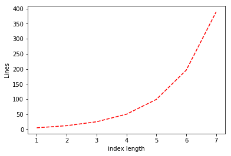

{{pic}}{fig:lookuplines} 我们实现的 `LOOKUP_k` 函数的行数关于 $k$ (即索引的长度) 的函数. 我们实现中的行数大约为 $3 \cdot 2^k$.
```

## 4.4 **通用** 函数计算 { #seccomputeallfunctions }

此时, 关于 NAND-CIRC 程序(以及等价的布尔电路和其他等效模型), 我们知道以下事实:

1. 它们至少可以计算一些非平凡函数.
2. 为各种函数想出 NAND-CIRC 程序是一项非常繁琐的任务.

因此, 如果读者并不特别期待一长串可以由 NAND-CIRC 程序计算的函数示例, 这也是无可指摘的.
然而, 事实证明我们并不需要这样做, 因为我们可以一举证明 NAND-CIRC 程序可以计算 **每一个** 有限函数:

```admonish quote title=""
{{thmc}}{thm:NAND-univ}[NAND 的通用性]
存在某个常数 $c>0$ , 使得对于每个 $n,m>0$ 和函数 $f: \{0,1\}^n\rightarrow \{0,1\}^m$ , 都有一个最多 $c \cdot m 2^n$ 行的 NAND-CIRC 程序计算函数 $f$ .
```

根据 {{ref:thm:equivalencemodels}}, NAND 电路, NAND-CIRC 程序, AON-CIRC 程序和布尔电路的模型都是彼此等价的, 因此 {{ref:thm:NAND-univ}} 对所有这些模型都成立.
特别地, 以下定理等价于 {{ref:thm:NAND-univ}}:

```admonish quote title=""
{{thmc}}{thm:circuit-univ}[布尔电路的通用性]
存在某个常数 $c>0$ , 使得对于每个 $n,m>0$ 和函数 $f: \{0,1\}^n\rightarrow \{0,1\}^m$ , 都有一个最多 $c \cdot m 2^n$ 个门的布尔电路计算函数 $f$ .
```

```admonish bigidea
{{idec}}{ide:finitecomputation}
**每个** 有限函数都能被一个足够大的布尔电路计算.
```

**改进上界** 尽管对我们不是特别重要, 但仍有可能改进{{ref:thm:NAND-univ}}的证明, 将其削弱$n$倍, 同时优化常数$c$, 从而证明对每个$\epsilon > 0$, $m \in \N$ 和足够大的 $n$, 若$f:\{0, 1\}^n \rightarrow \{0, 1\}^m$, 则$f$能被一个最多有$(1+\epsilon)\tfrac{m\cdot 2^n}{n}$个门电路的NAND电路计算.
该结果的证明超出了本书的范畴, 但我们确实会讨论如何得到具有形式$O(\tfrac{m \cdot 2^n}{n})$的上界. 参见[第4.4.2节](chapter_4.md#tight-upper-bound)和[杂记](chapter4_md#computeeveryfunctionbibnotes)

### 4.4.1 NAND通用性的证明

为了证明 {{ref:thm:NAND-univ}}, 我们需要为 **每一个** 可能的函数给出一个 NAND 电路, 或等价的 NAND-CIRC 程序.  
我们将注意力限制在布尔函数的情况 (即 $m=1$).  
{{ref:pro:mult-bit}} 要求你扩展证明, 使其对 $m$ 的所有值成立.  
一个函数 $F: \{0,1\}^n\rightarrow \{0,1\}$ 可以通过一个表来指定, 该表列出了它对每个 $2^n$ 输入的值.  
例如, 下表描述了一个特定的函数 $G: \{0,1\}^4 \rightarrow \{0,1\}$:{{footnote:如果你好奇的话, 该函数的作用是, 在输入 $i\in \{0,1\}^4$ (我们将其解释为 $[16]$ 中的一个数字) 时, 输出 $\pi$ 在二进制下的第 $i$ 位.}}  


| 输入   ($x$)|   输出 ($G(x)$) |
|:------------|:----------------|
| $0000$      | 1               |
| $0001$      | 1               |
| $0010$      | 0               |
| $0011$      | 0               |
| $0100$      | 1               |
| $0101$      | 0               |
| $0110$      | 0               |
| $0111$      | 1               |
| $1000$      | 0               |
| $1001$      | 0               |
| $1010$      | 0               |
| $1011$      | 0               |
| $1100$      | 1               |
| $1101$      | 1               |
| $1110$      | 1               |
| $1111$      | 1               |


表格: 函数 $G:\{0,1\}^4 \rightarrow \{0,1\}$ 的一个示例.

对每个 $x \in \{0, 1\}^4$, $G(x)=LOOKUP_4(1100100100001111,x)$, 而下列则是使用`LOOKUP_4`过程语法糖来计算$G$的NAND-CIRC "伪代码".


```python
G0000 = 1
G1000 = 1
G0100 = 0
...
G0111 = 1
G1111 = 1
Y[0] = LOOKUP_4(G0000,G1000,...,G1111,
                X[0],X[1],X[2],X[3])
```

我们可以通过添加三行代码来定义初始化为 $0$ 和 $1$ 的变量 `zero` 和 `one`, 从而将这些伪代码转换为实际的 NAND-CIRC 程序, 然后将诸如 `Gxxx = 0` 的语句替换为 `Gxxx = NAND(one,one)`, 并将诸如 `Gxxx = 1` 的语句替换为 `Gxxx = NAND(zero,zero)`. 对 `LOOKUP_4` 的调用将被替换为计算 $LOOKUP_4$ 的 NAND-CIRC 程序, 并插入相应的输入.
上述推理中没有任何部分是特定于上述函数 $G$ 的. 对于 **每一个** 函数 $F: \{0,1\}^n \rightarrow \{0,1\}$, 我们都可以编写一个 NAND-CIRC 程序来执行以下操作:

1. 初始化 $2^n$ 个变量, 从 `F00...0` 到 `F11...1`, 使得对于每个 $z\in\{0,1\}^n$, 与 $z$ 对应的变量被赋值为 $F(z)$.
2. 在上一步初始化的 $2^n$ 个变量上计算 $LOOKUP_n$, 索引变量是输入变量 `X[`$0$ `]`,...,`X[`$n-1$ `]`. 也就是说, 就像上面 `G` 的伪代码一样, 我们使用 `Y[0] = LOOKUP(F00..00,...,F11..1,X[0],..,X[`$n-1$`])`
3. 
所得程序的总行数用于初始化变量的 $3+2^n$ 行代码, 加上我们为计算 $LOOKUP_n$ 所使用的 $4\cdot 2^n$ 行. 这就完成了 {{ref:thm:NAND-univ}} 的证明.

```admonish info
{{remc}}{rem:discusscomputation}[对结果的观察]
虽然 {{ref:thm:NAND-univ}} 起初看起来令人惊讶, 但回想起来, 每个有限函数都可以用 NAND-CIRC 程序计算可能并不那么令人吃惊. 毕竟, 一个有限函数 $F: \{0,1\}^n \rightarrow \{0,1\}^m$ 可以通过简单地列出其每个 $2^n$ 输入值的输出值来表示. 因此, 我们可以编写一个类似大小的 NAND-CIRC 程序来计算它, 这是合理的. 更有趣的是, **一些** 函数, 比如加法和乘法, 具有更高效的表示: 只需要 $O(n^2)$ 或更少的行.
```

### 4.4.2 改进因子 $n$ (选读) {#tight-upper-bound}

通过更加仔细的处理, 我们可以改进 {{ref:thm:NAND-univ}} 的上界, 并证明每个函数 $F:\{0,1\}^n \rightarrow \{0,1\}^m$ 都可以由一个最多 $O(m 2^n/n)$ 行的 NAND-CIRC 程序计算. 换句话说, 我们可以证明以下改进版本:

```admonish quote title=""
{{thmc}}{thm:NAND-univ-improved}[NAND 电路的普遍性, 改进上界]
存在一个常数 $c>0$, 使得对于每个 $n,m>0$ 和函数 $f: \{0,1\}^n\rightarrow \{0,1\}^m$, 都有一个最多 $c \cdot m 2^n / n$ 行的 NAND-CIRC 程序计算函数 $f$.{{footnote:这个定理中的常数 $c$ 最多为 $10$ 并且实际上可以任意接近 $1$, 参见[杂记](#computeeveryfunctionbibnotes).}}
```

```admonish proof collapsible=true, title = "对{{ref:thm:NAND-univ-improved}}的证明"
和之前一样, 证明 $m=1$ 的情况就足够了.
因此, 我们令 $f:\{0,1\}^n \rightarrow \{0,1\}$, 我们的目标是证明存在一个 $O(2^n/n)$ 行的 NAND-CIRC 程序(或等价地, 一个 $O(2^n/n)$ 门的布尔电路)来计算 $f$.

我们令 $k= \log(n-2\log n)$(这个选择背后的原因稍后会变得清晰).
我们定义函数 $g:\{0,1\}^k \rightarrow \{0,1\}^{2^{n-k}}$ 如下:
$$
g(a) = f(a0^{n-k})f(a0^{n-k-1}1) \cdots f(a1^{n-k}) \;.
$$

换句话说, 如果我们使用通常的二进制表示将数字 $\{0,\ldots, 2^{n-k}-1 \}$ 等同于字符串 $\{0,1\}^{n-k}$ , 那么对于每个 $a\in \{0,1\}^k$ 和 $b\in \{0,1\}^{n-k}$, 有
$$
g(a)_b = f(ab) \;. {{numeq}}{eq:computefusinggeffcircuit}
$$

{{eqref:eq:computefusinggeffcircuit}} 意味着对于每个 $x\in \{0,1\}^n$, 如果我们写成 $x=ab$, 其中 $a\in \{0,1\}^k$ 和 $b\in \{0,1\}^{n-k}$, 那么我们可以通过首先计算长度为 $2^{n-k}$ 的字符串 $T=g(a)$, 然后计算 $LOOKUP_{n-k}(T\;,\; b)$ 来检索 $T$ 中对应于 $b$ 位置的元素(参见 {{ref:fig:efficient_circuit_allfunc}}).
计算 $LOOKUP_{n-k}$ 的成本是 $O(2^{n-k})$ 行/门, 而计算 $f$ 的 NAND-CIRC 行(或布尔门)成本最多为
$$
cost(g) + O(2^{n-k}) \;, {{numeq}}{eq:costcomputefusingg}
$$
其中 $cost(g)$ 是计算 $g$ 所需的操作数(即 NAND-CIRC 程序的行数或电路中的逻辑门数).

为了完成证明, 我们需要给出 $cost(g)$ 的一个界.
由于 $g$ 是一个将 $\{0,1\}^k$ 映射到 $\{0,1\}^{2^{n-k}}$ 的函数, 我们也可以将其视为 $2^{n-k}$ 个函数 $g_0,\ldots, g_{2^{n-k}-1}: \{0,1\}^k \rightarrow \{0,1\}$ 的集合, 其中对于每个 $a\in \{0,1\}^k$ 和 $i\in [2^{n-k}]$, 有 $g_i(x) = g(a)_i$. (即 $g_i(a)$ 是 $g(a)$ 的第 $i$ 位.)
一个不成熟的想法是, 我们可以使用 {{ref:thm:NAND-univ}} 以 $O(2^k)$ 行计算每个 $g_i$, 但总行数为 $O(2^{n-k} \cdot 2^k) = O(2^n)$, 这并没有什么优化.
然而, 关键是观察到只有 $2^{2^k}$ 个不同的函数将 $\{0,1\}^k$ 映射到 $\{0,1\}$.
例如, 如果 $g_{17}$ 与 $g_{67}$ 是相同的函数, 那意味着如果我们已经计算了 $g_{17}(a)$, 那么我们可以仅用常数次操作计算 $g_{67}(a)$: 只需复制相同的值!
一般来说, 如果你有一个包含 $N$ 个函数 $g_0,\ldots,g_{N-1}$ 的集合, 每个函数将 $\{0,1\}^k$ 映射到 $\{0,1\}$, 其中最多有 $S$ 个不同的函数, 那么对于每个值 $a\in \{0,1\}^k$, 我们可以使用最多 $O(S\cdot 2^k + N)$ 次操作计算所有 $N$ 个值 $g_0(a),\ldots,g_{N-1}(a)$(参见 {{ref:fig:computemanyfunctions}}).

在我们的情况下, 由于最多有 $2^{2^k}$ 个不同的函数将 $\{0,1\}^k$ 映射到 $\{0,1\}$, 我们可以使用最多  
$$O(2^{2^k} \cdot 2^k + 2^{n-k}) {{numeq}}{eq:boundoncostg}$$
次操作计算函数 $g$(因此通过 {{eqref:eq:computefusinggeffcircuit}} 计算出 $f$).

现在剩下的就是将我们选择的 $k = \log (n-2\log n)$ 代入 {{eqref:eq:boundoncostg}}.
根据定义, $2^k = n-2\log n$, 这意味着 {{eqref:eq:boundoncostg}} 可以被限制在某个上界内
$$
O\left(2^{n-2\log n} \cdot (n-2\log n) +  2^{n-\log(n-2\log n)}\right) \leq
$$

$$
O\left(\tfrac{2^n}{n^2} \cdot n + \tfrac{2^n}{n-2\log n} \right)
\leq
O\left(\tfrac{2^n}{n}  + \tfrac{2^n}{0.5n} \right)  = O\left( \tfrac{2^n}{n} \right)
$$
这正是我们想要证明的. (我们在上面使用了对于足够大的 $n$, 有 $n - 2\log n \geq 0.5 \log n$ 的事实.)
```

```admonish pic id="computemanyfunctionsfig"
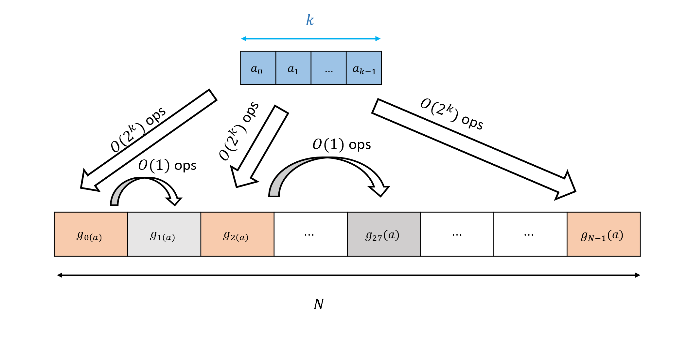

{{pic}}{fig:computemanyfunctions} 若 $g_0,\ldots, g_{N-1}$ 是一族从 $\{0,1\}^k$ 到 $\{0,1\}$ 的映射, 使得其中最多有$S$个是互不相同的, 则对每个$a\in \{0,1\}^k$, 我们可以使用至多 $O(S \cdot 2^k + N)$ 操作来计算所有 $g_0(a),\ldots,g_{N-1}(a)$ 的值. 方法首先计算那些不同的函数, 再将结果值复制.
```

```admonish pic id="efficient_circuit_allfuncfig"
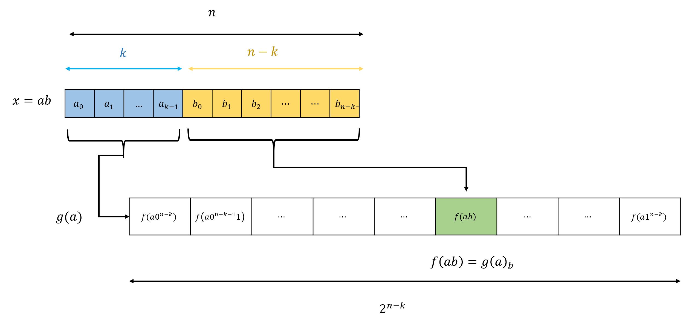

{{pic}}{fig:efficient_circuit_allfunc} 我们可以计算函数 $f:\{0,1\}^n \rightarrow \{0,1\}$ 在输入 $x=ab$ 上的值, 其中 $a\in \{0,1\}^k$ 且 $b\in \{0,1\}^{n-k}$, 方法是先计算长度为 $2^{n-k}$ 的字符串 $g(a)$, 该字符串对应于所有以 $a$ 开头的输入上 $f$ 的值, 再输出该字符串的第 $b$ 个坐标.
```

利用 NAND-CIRC 程序与布尔电路之间的联系, {{ref:thm:NAND-univ-improved}} 的一个直接推论是以下对 {{ref:thm:circuit-univ}} 的改进:

```admonish quote title=""
{{thmc}}{thm:circuit-univ-improved}[布尔电路的普遍性, 改进界限]
存在某个常数 $c>0$, 使得对于每个 $n,m>0$ 和函数 $f: \{0,1\}^n\rightarrow \{0,1\}^m$, 都存在一个最多具有 $c \cdot m 2^n / n$ 个门的布尔电路计算函数 $f$.
```

## 4.5 **通用** 函数计算: 一个替代的证明 {#seccomputalternative }

{{ref:thm:circuit-univ}} 是计算理论(和实践!)中的一个基本结果. 在本节中,我们将提出布尔电路可以计算每个有限函数这一基本事实的另一种证明. 这种替代证明在门数量上给出了稍差一些的定量界限, 但它的优点是更简单, 直接使用电路并避免了所有语法糖机制的使用. (然而,该机制本身是有用的,并将在以后找到其他应用.)

```admonish quote title=""
{{thmc}}{thm:circuit-univ-alt}[布尔电路的普遍性(替代表述)]
存在某个常数 $c>0$,使得对于每个 $n,m>0$ 和函数 $f: \{0,1\}^n\rightarrow \{0,1\}^m$,都存在一个最多具有 $c \cdot m\cdot n 2^n$ 个门的布尔电路计算函数 $f$ .
```

```admonish pic id="computeallfuncaltfig"
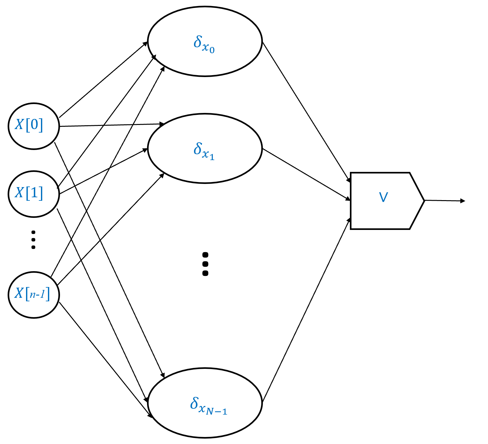

{{pic}}{fig:computeallfuncalt} 给定一个函数 $f:\{0,1\}^n \rightarrow \{0,1\}$,我们令 $\{ x_0, x_1, \ldots, x_{N-1} \} \subseteq \{0,1\}^n$ 是满足 $f(x_i)=1$ 的输入集合, 并要求 $N \leq 2^n$. 我们可以将 $f$ 表示为 $\delta_{x_i}$ 对于 $i\in [N]$ 的 OR,其中函数 $\delta_\alpha:\{0,1\}^n \rightarrow \{0,1\}$(对于 $\alpha \in \{0,1\}^n$)定义如下: $\delta_\alpha(x)=1$ 当且仅当 $x=\alpha$. 我们可以使用 $N$ 个二输入 OR 门来计算 $N$ 个值的 OR. 因此,如果我们有一个大小为 $O(n)$ 的电路来计算每个 $\alpha \in \{0,1\}^n$ 的 $\delta_\alpha$ 值, 那么我们可以使用大小为 $O(n \cdot N) = O(n \cdot 2^n)$ 的电路来计算 $f$.
```

```admonish proof collapsible=true, title = "对{{ref:thm:circuit-univ-alt}}的证明思路"
证明思路如 {{ref:fig:computeallfuncalt}} 所示. 如前所述, 关注 $m=1$ 的情况(函数 $f$ 有单个输出)就足够了, 因为我们可以通过组合 $m$ 个电路(每个计算函数 $f$ 的不同输出位)来扩展到 $m>1$ 的情况.
我们首先证明, 对于每个 $\alpha \in \{0,1\}^n$, 存在一个大小为 $O(n)$ 的电路来计算函数 $\delta_\alpha:\{0,1\}^n \rightarrow \{0,1\}$,定义如下: $\delta_\alpha(x)=1$ 当且仅当 $x=\alpha$ (即 $\delta_\alpha$ 对除了$\alpha$以外的所有输入, 其输出为 $0$). 然后,我们可以将任何函数 $f:\{0,1\}^n \rightarrow \{0,1\}$ 写为最多 $2^n$ 个函数 $\delta_\alpha$ 的 OR,其中 $\alpha$ 满足 $f(\alpha)=1$.
```

```admonish proof collapsible=true, title = "对{{ref:thm:circuit-univ-alt}}的证明"
我们针对 $m=1$ 的情况证明这个定理. 结果可以像之前一样扩展到 $m>1$ 的情况(另见 {{ref:pro:mult-bit}}).
令 $f:\{0,1\}^n \rightarrow \{0,1\}$.
我们将通过以下步骤证明存在一个 $O(n\cdot 2^n)$ 大小的布尔电路来计算 $f$:

1. 我们证明对于每个 $\alpha\in \{0,1\}^n$, 存在一个 $O(n)$ 大小的电路来计算函数 $\delta_\alpha:\{0,1\}^n \rightarrow \{0,1\}$, 其中 $\delta_\alpha(x)=1$ 当且仅当 $x=\alpha$.

2. 然后我们证明这说明了存在一个 $O(n\cdot 2^n)$ 大小的电路来计算 $f$, 通过将 $f(x)$ 写为所有使得 $f(\alpha)=1$ 的 $\alpha\in \{0,1\}^n$ 的 $\delta_\alpha(x)$ 的 OR. (如果 $f$ 是恒零函数, 因此没有这样的 $\alpha$, 那么我们可以使用电路 $f(x) = x_0 \wedge \overline{x}_0$.)

我们从步骤 1 开始:

__断言:__ 对于 $\alpha \in \{0,1\}^n$, 定义 $\delta_\alpha:\{0,1\}^n$ 如下:

$$
\delta_\alpha(x) = \begin{cases}1 & x=\alpha \\ 0 & \text{否则} \end{cases} \;.
$$
$$
\delta_\alpha(x) = \begin{cases}1 & x=\alpha \\ 0 & \text{otherwise} \end{cases} \;.
$$

那么存在一个使用最多 $2n$ 个门的布尔电路来计算 $\delta_\alpha$.


__断言证明:__ 证明如 {{ref:fig:deltafunc}} 所示.
例如, 考虑函数 $\delta_{011}:\{0,1\}^3 \rightarrow \{0,1\}$.
这个函数在 $x$ 上输出 $1$ 当且仅当 $x_0=0$, $x_1=1$ 且 $x_2=1$, 因此我们可以写 $\delta_{011}(x) = \overline{x_0} \wedge x_1 \wedge x_2$, 这转化为一个有一个 NOT 门和两个 AND 门的布尔电路.
更一般地, 对于每个 $\alpha \in \{0,1\}^n$, 我们可以将 $\delta_{\alpha}(x)$ 表示为 $(x_0 = \alpha_0) \wedge (x_1 = \alpha_1) \wedge \cdots \wedge (x_{n-1} = \alpha_{n-1})$, 其中如果 $\alpha_i=0$ 我们将 $x_i = \alpha_i$ 替换为 $\overline{x_i}$, 如果 $\alpha_i=1$ 我们将 $x_i=\alpha_i$ 替换为简单的 $x_i$.

这产生一个使用 $n$ 个 AND 门和最多 $n$ 个 NOT 门来计算 $\delta_\alpha$的电路, 因此总共最多需要 $2n$ 个门.
现在对于每个函数 $f:\{0,1\}^n \rightarrow \{0,1\}$, 我们可以写出

$$
f(x) = \delta_{x_0}(x) \vee \delta_{x_1}(x) \vee \cdots \vee \delta_{x_{N-1}}(x) {{numeq}}{eq:orofdeltafunc}
$$

其中 $S=\{ x_0 ,\ldots, x_{N-1}\}$ 是 $f$ 输出 $1$ 的输入集合.

(要观察到这一点, 你可以验证 {{eqref:eq:orofdeltafunc}} 的右边在 $x\in \{0,1\}^n$ 上求值为 $1$ 当且仅当 $x$ 在集合 $S$ 中.)
因此, 我们可以使用最多 $2n$ 个门的布尔电路来计算每个 $N$ 个函数 $\delta_{x_i}$, 并结合最多 $N$ 个 OR 门, 从而获得一个最多 $2n\cdot N + N$ 个门的电路.
由于 $S \subseteq \{0,1\}^n$, 其大小 $N$ 最多为 $2^n$, 因此这个电路中门的总数是 $O(n\cdot 2^n)$.
```

```admonish pic id="deltafuncfig"
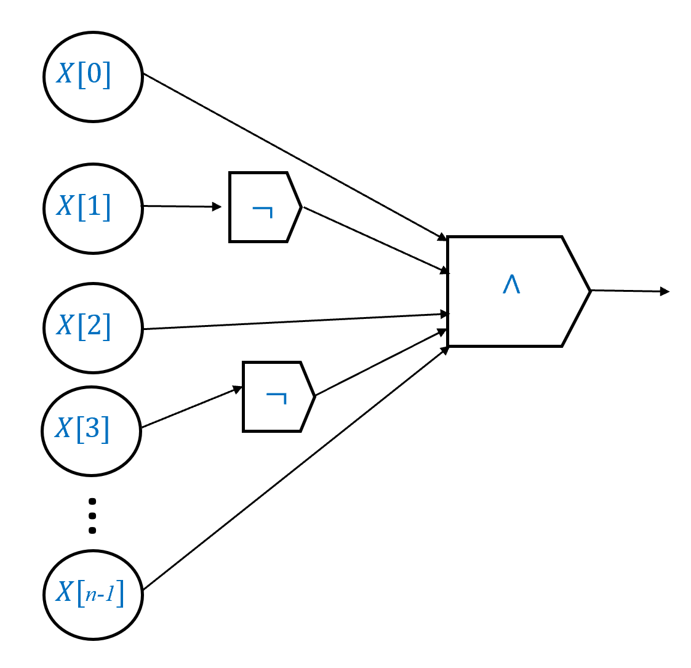

{{pic}}{fig:deltafunc} 对每个字符串 $\alpha\in \{0,1\}^n$ , 均有一个有着 $O(n)$ 个门的布尔电路可以计算函数 $\delta_\alpha:\{0,1\}^n \rightarrow \{0,1\}$, 其满足 $\delta_\alpha(x)=1$ 当且仅当 $x=\alpha$. 这样一个电路非常简单. 给定输入 $x_0,\ldots,x_{n-1}$ ,我们计算$z_0,\ldots,z_{n-1}$的AND, 其中当$\alpha_i = 1$ 时 $z_i = x_i$, $\alpha_i=0$ 时 $z_i = NOT(x_i)$ . 虽然形式化的布尔电路只允许有两个输入计算 AND 函数的逻辑门, 我们可以通过组合 $n$ 个具有两个输入的 AND 门来获得具有 $n$个输入的 AND 门.
```


## 4.6 $SIZE_{n,m}(s)$类 {#secdefinesizeclasses }

我们已经看到, **每个** 函数 $f:\{0,1\}^n \rightarrow \{0,1\}^m$ 都可以由一个大小为 $O(m\cdot 2^n)$ 的电路计算, 并且 **一些** 函数(如加法和乘法)可以由更小的电路计算.

我们定义 $SIZE_{n,m}(s)$ 为映射 $n$ 位到 $m$ 位的函数的集合, 这些函数可以由最多 $s$ 个门的 NAND 电路计算(或者等价地, 由最多 $s$ 行的 NAND-CIRC 程序计算).
形式化地, 其定义如下:

```admonish quote title=""
{{defc}}{def:size}[函数的规模类]
对于所有自然数 $n,m,s$, 令 $SIZE_{n,m}(s)$ 表示所有函数 $f:\{0,1\}^n \rightarrow \{0,1\}^m$ 的集合, 使得存在一个最多 $s$ 个门的 NAND 电路计算 $f$.
我们用 $SIZE_n(s)$ 表示集合 $SIZE_{n,1}(s)$.
对于每个整数 $s \geq 1$, 我们令 $SIZE(s) = \cup_{n,m} SIZE_{n,m}(s)$ 为所有函数 $f$ 的集合, 对于这些函数存在一个最多 $s$ 个门的 NAND 电路计算 $f$.
```

{{ref:fig:funcvscirc}} 描绘了集合 $SIZE_{n,1}(s)$.
注意 $SIZE_{n,m}(s)$ 是 **函数** 的集合, 而不是 **程序** 的集合! 就像 {{ref:fig:cucumber}} 所示的那样, 询问一个程序或电路是否是 $SIZE_{n,m}(s)$ 的成员是一种 **类别错误**!

正如我们在[3.7.2节](./chapter_3.md#specvsimplrem)(和[第2.6.1节](chapter_2.md#secimplvsspec))中讨论的, **程序** 和 **函数** 之间的区别是绝对关键的.
你应该始终记住, 虽然一个程序能 **计算** 一个函数, 但它并不 **等于** 一个函数.
特别是, 如我们所见, 可以有多个程序计算同一个函数.

```admonish pic id="funcvscircfig"
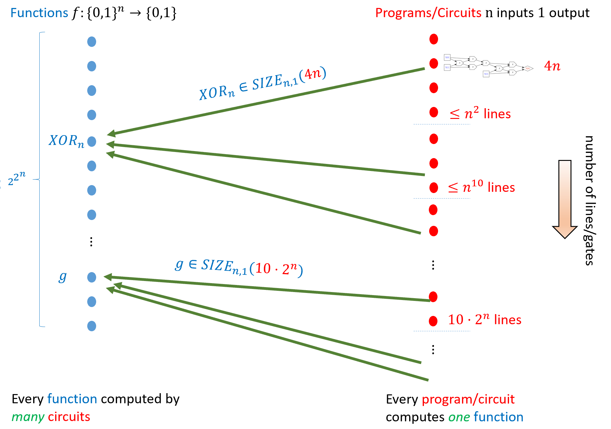

{{pic}}{fig:funcvscirc} 有 $2^{2^n}$ 个函数映射 $\{0,1\}^n$ 到 $\{0,1\}$, 以及无限多个具有 $n$ 位输入和单比特输出的电路. 每个电路计算一个函数, 但每个函数可以由许多电路计算. 如果计算 $f$ 的最小电路有 $s$ 个或更少的门, 我们说 $f \in SIZE_{n,1}(s)$. 例如 $XOR_n \in SIZE_{n,1}(4n)$. {{ref:thm:NAND-univ}} 表明_每个_函数 $g$ 都可以由某个最多 $c\cdot 2^n/n$ 个门的电路计算, 因此 $SIZE_{n,1}(c\cdot 2^n/n)$ 对应于从 $\{0,1\}^n$ 到 $\{0,1\}$ 的 **所有** 函数的集合.
```

虽然我们针对NAND门定义了$SIZE_n(s)$, 但如果我们针对AND/OR/NOT门定义它, 我们基本上会得到相同的类:

```admonish quote title=""
{{lemc}}{lem:nandaonsize}
令 $SIZE^{AON}_{n,m}(s)$ 表示所有函数 $f:\{0,1\}^n \rightarrow \{0,1\}^m$ 的集合, 这些函数可以由最多 $s$ 个门的AND/OR/NOT布尔电路计算.
那么,
$$
SIZE_{n,m}(s/2) \subseteq SIZE^{AON}_{n,m}(s) \subseteq SIZE_{n,m}(3s)
$$
```

```admonish proof collapsible=true, title = "对{{ref:lem:nandaonsize}}的证明"
如果 $f$ 可以由最多 $s/2$ 个门的NAND电路计算, 那么通过用NOT和AND两个门替换每个NAND门, 我们可以获得一个最多 $s$ 个门的AND/OR/NOT布尔电路来计算 $f$.
另一方面, 如果 $f$ 可以由最多 $s$ 个门的布尔AND/OR/NOT电路计算, 那么根据 {{ref:thm:NANDuniversam}} , 它可以由最多 $3s$ 个门的NAND电路计算.
```

```admonish pic id="cucumberfig"


{{pic}}{fig:cucumber} "类别错误"是指诸如"黄瓜是偶数还是奇数?"这样甚至没有意义的问题. 在本书中, 您需要警惕的一种类别错误是混淆 **函数** 和 **程序** (即混淆 **规范** 和 **实现** ). 如果 $C$ 是一个电路或程序, 那么询问 $C \in SIZE_{n,1}(s)$ 是一个类别错误, 因为 $SIZE_{n,1}(s)$ 是一个 **函数** 的集合, 而不是程序或电路的集合.
```

我们在本章中所见到的结果可以被表述为证明 $ADD_n \in SIZE_{2n,n+1}(100 n)$ 与 $MULT_n \in SIZE_{2n,2n}(10000 n^{\log_2 3})$.
{{ref:thm:NAND-univ}} 说明对于某个常数 $c$, $SIZE_{n,m}(c m 2^n)$ 等于从 $\{0,1\}^n$ 到 $\{0,1\}^m$ 的所有函数的集合.

```admonish info
{{remc}}{rem:infinitefunc}[有限与无限函数]
与诸如 **Python** 、**C** 或 **JavaScript** 等编程语言不同, NAND-CIRC 和 AON-CIRC 编程语言中没有 **数组**. 
一个 NAND-CIRC 程序 $P$ 有固定数量的输入和输出变量 $n$ 和 $m$. 因此, 例如, 没有单个 NAND-CIRC 程序可以计算增量函数 $INC:\{0,1\}^* \rightarrow \{0,1\}^*$, 该函数将字符串 $x$(我们通过二进制表示将其视为数字)映射到表示 $x+1$ 的字符串. 相反, 对于每个 $n>0$, 存在一个 NAND-CIRC 程序 $P_n$, 它计算函数 $INC$ 限制到长度为 $n$ 的输入 $INC_n$. 由于可以证明对于每个 $n>0$, 这样的程序 $P_n$ 存在且长度最多为 $10n$, 因此对于每个 $n>0$, $INC_n \in SIZE_{n,n+1}(10n)$. 

目前, 我们的重心将放在 **有限** 函数上, 但我们将在后面的 [第13.6节](chapter_13.md#nonuniformcompsec) 中讨论如何将大小复杂度的定义扩展到具有无界输入长度的函数. 
```

```admonish question
{{exec}}{exe:sizeclosundercomp}[$SIZE$ 在补集下封闭]

在这个练习中, 我们证明规模类 $SIZE_n(s)$ 的一个"闭包性质". 
也就是说, 我们证明如果 $f$ 在这个类中, 那么(至多有某个小的加法项)$f$ 的补集也在该类中, 其中补集函数是 $g(x)=1-f(x)$. 

证明存在一个常数 $c$, 使得对于每个 $f:\{0,1\}^n \rightarrow \{0,1\}$ 和 $s\in \N$, 如果 $f \in SIZE_n(s)$ 则 $1-f \in SIZE_n(s+c)$. 
```

```admonish solution collapsible=true title="对{{ref:exe:sizeclosundercomp}}的解答"
如果 $f\in SIZE_n(s)$, 那么存在一个 $s$ 行 NAND-CIRC 程序 $P$ 计算 $f$. 
我们可以将 $P$ 中的变量 `Y[0]` 重命名为 `temp`, 并在最后添加一行

~~~python
Y[0] = NAND(temp,temp)
~~~

来获得一个计算 $1-f$ 的程序 $P'$. 
```

```admonish hint title="本章回顾"
* 我们可以通过一个简化的"编程语言"来定义计算函数的概念, 其中在 $T$ 步内计算函数 $F$ 对应于拥有一个 $T$ 行的 NAND-CIRC 程序来计算 $F$.  
* 虽然 NAND-CIRC 编程只有一种操作, 但其他操作如函数和条件执行可以使用它来实现.  
* 每个函数 $f:\{0,1\}^n \rightarrow \{0,1\}^m$ 都可以由一个最多 $O(m 2^n)$ 个门的电路计算(实际上最多 $O(m 2^n/n)$ 个门).  
* 我们有时(或者总是?)可以将计算 $f$ 的 **高效** 算法翻译成一个电路, 该电路计算 $f$ 的门数量与算法中的步数相当.  
```

## 4.7 习题

```admonish question
{{proc}}{pro:embedtuples}[配对]
本练习要求你给出一个从 $\N^2$ 到 $\N$ 的一一映射. 这可以在只有一维数组的编程语言中实现二维数组作为"语法糖".

1. 证明映射 $F(x,y)=2^x3^y$ 是一个从 $\N^2$ 到 $\N$ 的一一映射.

2. 证明存在一个一一映射 $F:\N^2 \rightarrow \N$ , 使得对于每个 $x,y$ , 有 $F(x,y) \leq 100\cdot \max\{x,y\}^2+100$ .

3. 对于每个 $k$ , 证明存在一个一一映射 $F:\N^k \rightarrow \N$ , 使得对于每个 $x_0,\ldots,x_{k-1} \in \N$ , 有 $F(x_0,\ldots,x_{k-1}) \leq 100 \cdot (x_0+x_1+\ldots+x_{k-1}+100k)^k$ .
```

```admonish question
{{proc}}{pro:mux}[计算 MUX]
证明下面的 NAND-CIRC 程序计算函数 $MUX$ (或 $LOOKUP_1$ ), 其中 $MUX(a,b,c)$ 在 $c=0$ 时等于 $a$ , 在 $c=1$ 时等于 $b$ :

~~~python
t = NAND(X[2],X[2])
u = NAND(X[0],t)
v = NAND(X[1],X[2])
Y[0] = NAND(u,v)
~~~
```

```admonish question
{{proc}}{pro:atleasttwo}[至少两个/多数]
给出一个最多 6 行的 NAND-CIRC 程序来计算函数 $MAJ:\{0,1\}^3 \rightarrow \{0,1\}$ , 其中 $MAJ(a,b,c) = 1$ 当且仅当 $a+b+c \geq 2$ .
```

```admonish question
{{proc}}{pro:conditionalsugar}[条件语句]
在这个练习中, 我们将探索 {{ref:thm:conditionalsugar}} : 将使用诸如 `if .. then .. else ..` 代码的 NAND-CIRC-IF 程序转换为标准的 NAND-CIRC 程序.

1. 给出 {{ref:thm:conditionalsugar}} 的"代码证明": 用你选择的编程语言编写一个程序, 将 NAND-CIRC-IF 程序 $P$ 转换为一个"无糖"的 NAND-CIRC 程序 $P'$ , 计算相同的函数. 参见脚注提示.{{footnote:你可以先从将 $P$ 转换为使用过程语句的 NAND-CIRC-PROC 程序开始, 然后使用 {{ref:exa:desugarcode}} 的代码将后者转换为"无糖"的 NAND-CIRC 程序.}}

2. 证明以下陈述, 这是 {{ref:thm:conditionalsugar}} 的核心: 假设存在一个 $s$ 行 NAND-CIRC 程序计算 $f:\{0,1\}^n \rightarrow \{0,1\}$ 和一个 $s'$ 行 NAND-CIRC 程序计算 $g:\{0,1\}^n \rightarrow \{0,1\}$ .
证明存在一个最多 $s+s'+10$ 行的 NAND-CIRC 程序计算函数 $h:\{0,1\}^{n+1} \rightarrow \{0,1\}$ , 其中 $h(x_0,\ldots,x_{n-1},x_n)$ 在 $x_n=0$ 时等于 $f(x_0,\ldots,x_{n-1})$ , 否则等于 $g(x_0,\ldots,x_{n-1})$ . (本项中的所有程序都是标准的"无糖" NAND-CIRC 程序.)
```

```admonish question
{{proc}}{pro:halffulladder}[半加器和全加器]
1. 一个 **半加器** 是对应于两个二进制位相加的函数 $HA:\{0,1\}^2 :\rightarrow \{0,1\}^2$, 也就是说, 对于每个 $a,b \in \{0,1\}$ , $HA(a,b)= (e,f)$ 其中 $2e+f = a+b$ . 证明存在一个最多五个 NAND 门的 NAND 电路计算 $HA$ .

2. 一个 **全加器** 是函数 $FA:\{0,1\}^3 \rightarrow \{0,1\}^{2}$ , 它接受两个位和一个"进位"位, 并输出它们的和. 也就是说, 对于每个 $a,b,c \in \{0,1\}$ , $FA(a,b,c) = (e,f)$ 使得 $2e+f = a+b+c$ . 证明存在一个最多九个 NAND 门的 NAND 电路计算 $FA$ .

3. 证明如果有一个 $c$ 门 NAND 电路计算 $FA$ , 那么有一个 $cn$ 门电路计算 $ADD_n$ , 其中(如 {{ref:thm:addition}}) $ADD_n:\{0,1\}^{2n} \rightarrow \{0,1\}^{n+1}$ 是输出两个输入 $n$ 位数字加法的函数. 参见脚注提示.{{footnote:使用一个逐位相加的"级联", 从最低有效位开始, 就像小学算法一样.}}

4. 证明对于每个 $n$ , 有一个最多 $9n$ 行的 NAND-CIRC 程序计算 $ADD_n$ .
```

```admonish question title=""
{{proc}}{pro:addition}[加法]
使用你最喜欢的编程语言编写一个程序,该程序在输入整数 $n$ 时,输出一个计算 $ADD_n$ 的 NAND-CIRC 程序.你能确保它为 $ADD_n$ 输出的程序少于 $10n$ 行吗?
```

```admonish question title=""
{{proc}}{pro:multiplication}[乘法]
使用你最喜欢的编程语言编写一个程序,该程序在输入整数 $n$ 时,输出一个计算 $MULT_n$ 的 NAND-CIRC 程序.你能确保它为 $MULT_n$ 输出的程序少于 $1000\cdot n^2$ 行吗?
```

```admonish question title=""
{{proc}}{pro:eff-multiplication}[高效乘法 (挑战)]
使用你最喜欢的编程语言编写一个程序,该程序在输入整数 $n$ 时,输出一个计算 $MULT_n$ 的 NAND-CIRC 程序,并且最多有 $10000 n^{1.9}$ 行.{{footnote: **提示:** 使用 Karatsuba 算法.}} 你能用多少行来相乘两个 2048 位数字?
```

```admonish question title=""
{{proc}}{pro:mult-bit}[多比特函数]
在文本 {{ref:thm:NAND-univ}} 中,只证明了 $m=1$ 的情况.
在这个练习中,你将扩展证明到每个 $m$.

证明:

1. 如果有一个 $s$ 行 NAND-CIRC 程序计算 $f:\{0,1\}^n \rightarrow \{0,1\}$ 和一个 $s'$ 行 NAND-CIRC 程序计算 $f':\{0,1\}^n \rightarrow \{0,1\}$,那么有一个 $s+s'$ 行程序计算函数 $g:\{0,1\}^n \rightarrow \{0,1\}^2$,使得 $g(x)=(f(x),f'(x))$.
2. 对于每个函数 $f:\{0,1\}^n \rightarrow \{0,1\}^m$,有一个最多 $10m\cdot 2^n$ 行的 NAND-CIRC 程序计算 $f$.(你可以使用 {{ref:thm:NAND-univ}} 在 $m=1$ 的情况与第1.题)
```

```admonish question title=""
{{proc}}{pro:usesugar}[使用语法糖简化]
设 $P$ 为以下 NAND-CIRC 程序:

~~~python
Temp[0] = NAND(X[0],X[0])
Temp[1] = NAND(X[1],X[1])
Temp[2] = NAND(Temp[0],Temp[1])
Temp[3] = NAND(X[2],X[2])
Temp[4] = NAND(X[3],X[3])
Temp[5] = NAND(Temp[3],Temp[4])
Temp[6] = NAND(Temp[2],Temp[2])
Temp[7] = NAND(Temp[5],Temp[5])
Y[0] = NAND(Temp[6],Temp[7])
~~~

1. 编写一个程序 $P'$,最多三行代码,使用 `NAND` 以及语法糖 `OR`,计算与 $P$ 相同的函数.

2. 绘制一个电路,计算与 $P$ 相同的函数,并仅使用 $AND$ 和 $NOT$ 门.
```

在以下练习中,要求你比较每对编程语言的 **表达能力**.
当我们说 "比较" 两个编程语言 $X$ 和 $Y$ 的 "表达能力" 时, 我们指的是确定分别使用 $X$ 和 $Y$ 中的程序可计算的函数集之间的关系. 也就是说, 要回答该问题, 你需要同时完成以下两项:

1. **要么** 证明对于 $X$ 中的每个程序 $P$,都有 $Y$ 中的一个程序 $P'$ 计算与 $P$ 相同的函数, **要么** 给出一个函数示例,该函数可由 $X$-程序计算但不可由 $Y$-程序计算.

**和**

2. 要么证明对于 $Y$ 中的每个程序 $P$,都有 $X$ 中的一个程序 $P'$ 计算与 $P$ 相同的函数, **要么** 给出一个函数示例,该函数可由 $Y$-程序计算但不可由 $X$-程序计算.

当你给出上述示例,即一个函数在一种编程语言中可计算但在另一种中不可计算时,你需要 **证明** 你展示的函数 **(1)** 在第一种编程语言中可计算,并且 **(2)** 在第二种编程语言中 **不可计算**.

```admonish question title=""
{{proc}}{pro:compareif}[比较 IF 和 NAND]
设 IF-CIRC 为编程语言,其中有以下操作 `foo = 0`, `foo = 1`, `foo = IF(cond,yes,no)` (即,我们可以使用常量 $0$ 和 $1$,以及函数 $IF:\{0,1\}^3 \rightarrow \{0,1\}$,使得如果 $a=1$ 则 $IF(a,b,c)$ 等于 $b$,如果 $a=0$ 则等于 $c$).比较 NAND-CIRC 编程语言和 IF-CIRC 编程语言的表达能力.
```

```admonish question title=""
{{proc}}{pro:comparexor}[比较 XOR 和 NAND]
设 XOR-CIRC 为编程语言,其中有以下操作 `foo = XOR(bar,blah)`, `foo = 1` 和 `bar = 0` (即,我们可以使用常量 $0$, $1$ 和函数 $XOR$,它将 $a,b \in \{0,1\}^2$ 映射到 $a+b \mod 2$).比较 NAND-CIRC 编程语言和 XOR-CIRC 编程语言的表达能力.参见脚注中的提示.{{footnote:你可以使用以下事实: $(a+b)+c \mod 2 = a+b+c \mod 2$.特别地,这意味着如果你有行 `d = XOR(a,b)` 和 `e = XOR(d,c)`,那么 `e` 得到变量 `a`, `b` 和 `c` 在模 $2$ 意义下的和.}}
```

```admonish question title=""
{{proc}}{pro:majasymp}[多数函数的电路]
证明存在某个常数 $c$,使得对于每个 $n>1$, $MAJ_n \in SIZE_n(cn)$,其中 $MAJ_n:\{0,1\}^n \rightarrow \{0,1\}$ 是 $n$ 个输入比特上的多数函数.即 $MAJ_n(x)=1$ 当且仅当 $\sum_{i=0}^{n-1}x_i > n/2$. 参见脚注中的提示.{{footnote:解决这个问题的一种方法是使用递归和所谓的 [主定理](https://en.wikipedia.org/wiki/Master%5Ftheorem%5F(analysis%5Fof%5Falgorithms)).}}
```

```admonish question title=""
{{proc}}{pro:thresholdcirc}[阈值函数的电路]
证明存在某个常数 $c$,使得对于每个 $n>1$,和整数 $a_0,\ldots,a_{n-1},b \in \{-2^n,-2^n+1,\ldots,-1,0,+1,\ldots,2^n\}$,有一个最多 $n^c$ 个门的 NAND 电路计算 **阈值** 函数 $f_{a_0,\ldots,a_{n-1},b}:\{0,1\}^n \rightarrow \{0,1\}$,该函数在输入 $x\in \{0,1\}^n$ 时输出 $1$ 当且仅当 $\sum_{i=0}^{n-1} a_i x_i > b$.
```

## 4.8 杂记 { #computeeveryfunctionbibnotes  }

关于电路的更广泛讨论, 请参阅 Jukna 和 Wegener 的著作 [Jukna, 2012](https://scholar.google.com/scholar?hl=en&q=Jukna+Boolean+function+complexity:+advances+and+frontiers), [Wegener, 1987](https://scholar.google.com/scholar?hl=en&q=Wegener+The+complexity+of+Boolean+functions).
Shannon 证明了每个布尔函数都可以由指数级大小的电路计算 [Shannon, 1938](https://scholar.google.com/scholar?hl=en&q=Shannon+A+symbolic+analysis+of+relay+and+switching+circuits). 改进的 $c \cdot 2^n/n$ 界(对于许多基, $c$ 是最优值)归功于 Lupanov [Lupanov, 1958](https://scholar.google.com/scholar?hl=en&q=Lupanov+A+circuit+synthesis+method). 关于 NAND 情况(其中 $c=1$)的阐述可以在他的著作 [Lupanov, 1984](https://scholar.google.com/scholar?hl=en&q=Lupanov+Asymptotic+complexity+bounds+for+control+circuits) 的第 4 章中找到.
(感谢 Sasha Golovnev 追踪到这个参考文献!)

"语法糖"的概念也称为"宏"或"元编程", 有时通过编程语言或文本编辑器中的预处理器或宏语言实现. 一个现代例子是 [Babel](https://babeljs.io/) JavaScript 语法转换器, 它将使用最新特性编写的 JavaScript 程序转换为旧版浏览器可以接受的格式. 它甚至有一个 [插件](https://babeljs.io/docs/plugins/) 架构, 允许用户将自己的语法糖添加到语言中.