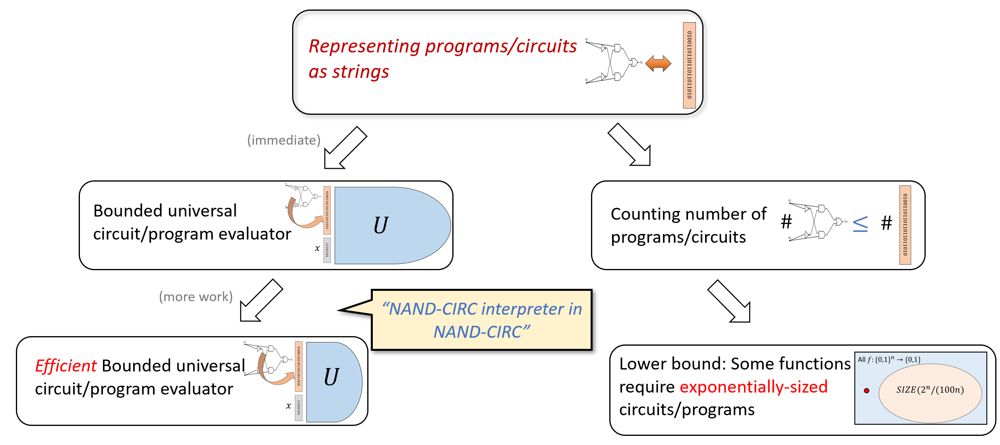
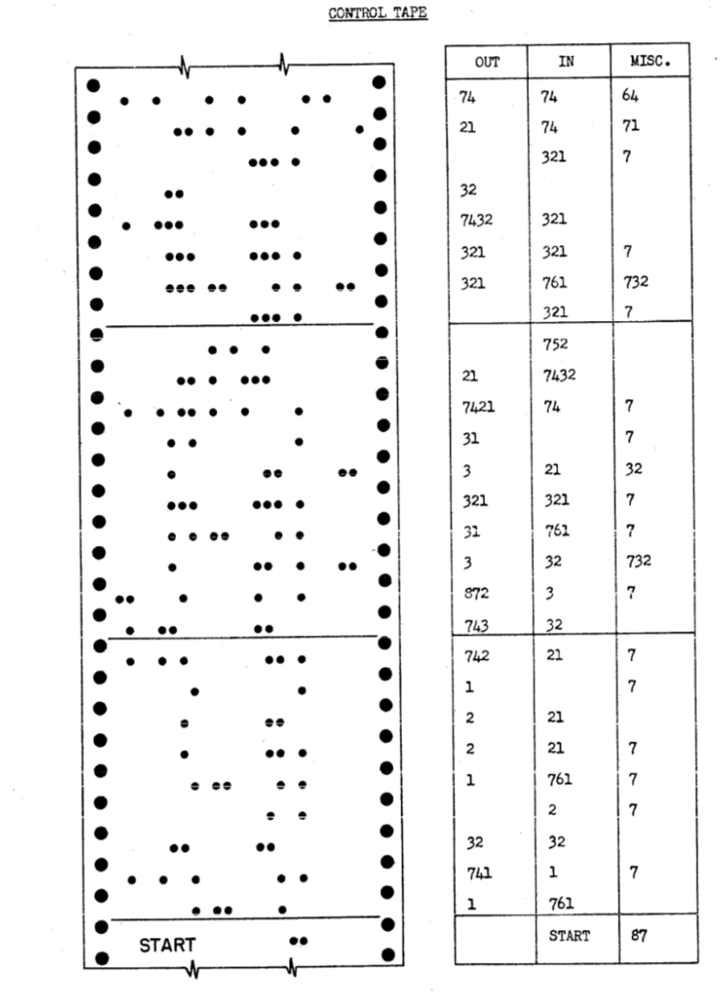
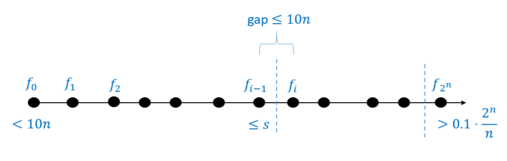
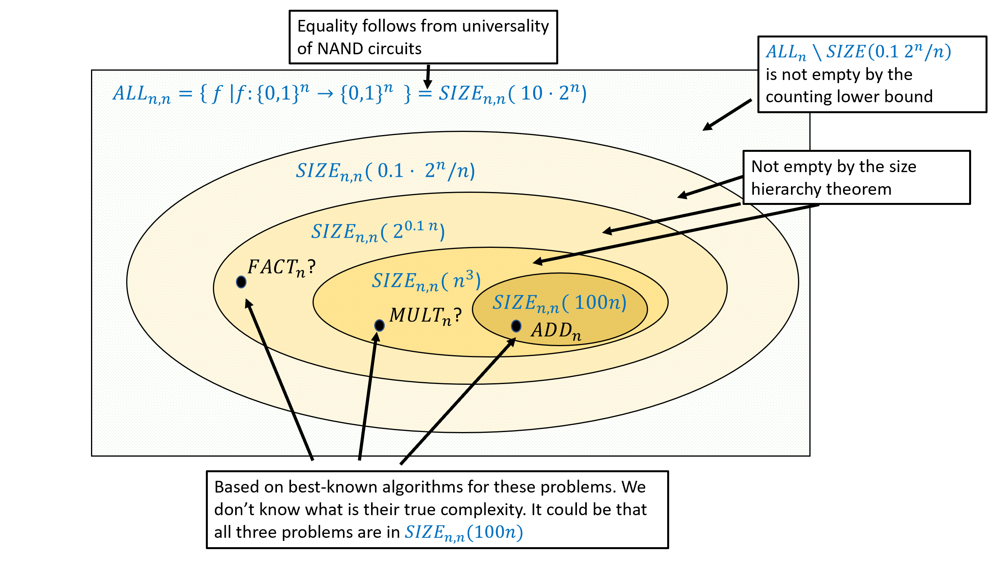
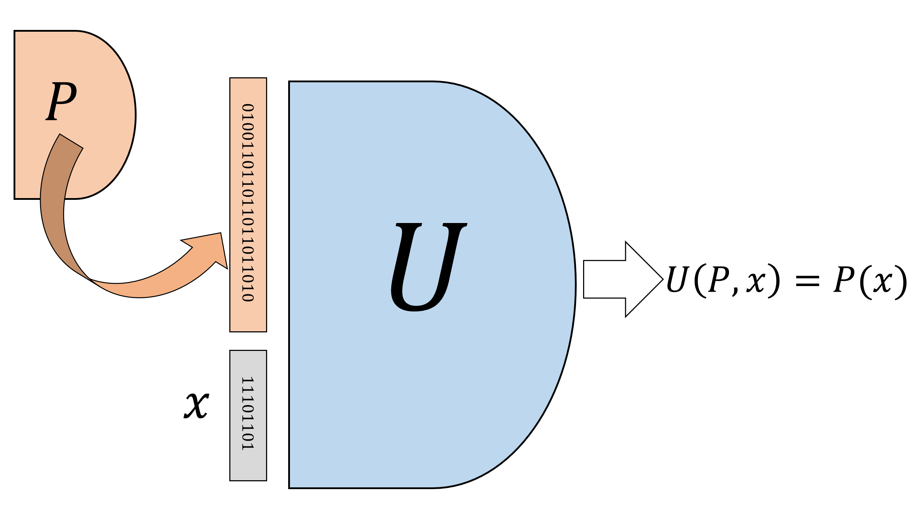
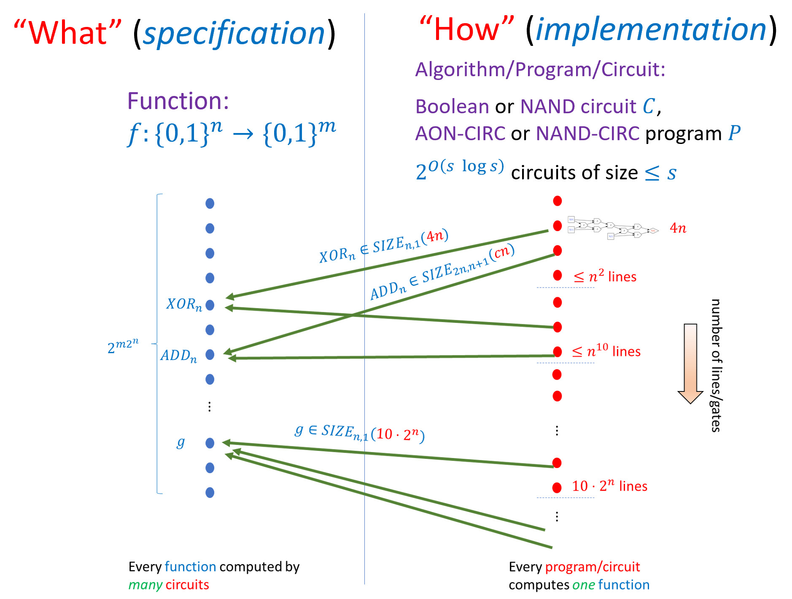

```admonish warning 
**本章施工中**
```

<!-- toc -->

# 数据即代码，代码即数据
```admonish tip title="本章的学习目标"
- 理解计算中的最重要概念之一：代码与数据的二元性。
- 逐步熟悉程序的不同表示形式之间的转换。
- 学习构建一个“通用电路求值器”，能够根据给定表示执行其他电路。
- 认识与上一章结论相辅相成的重要成果：某些函数需要指数级数量的门电路才能实现。
- 探讨在物理意义上的Church-Turing论题--该论题指出布尔电路可以建模物理世界中所有可行的计算，并分析其背后的物理学原理与哲学意涵。
```

```admonish quote title=""
“密码脚本”这一术语显然过于狭隘。染色体结构同时是实现它们所预示的发展的工具——它们既是法律条文又是执行权力，或者用另一个比喻来说，它们同时是建筑师的设计图和施工者的技艺。

*——埃尔温·薛定谔（Erwin Schrödinger），1944年*
```

```admonish quote title=""
"数学家几乎不会将64种四个单元的三联体组合与二十种其他单元之间的对应关系称为‘普适’，而这种对应很可能是地球生命最根本的普遍特征。"

*——米沙·格罗莫夫（Misha Gromov），2013年*
```

程序就是由一系列符号组成的序列，每个符号都可以通过（例如）ASCII标准编码为由$0$和$1$组成的字符串。因此，我们可以将每个NAND-CIRC程序（进而每个布尔电路）表示为二进制字符串。这个论断看似浅显，实则意义深远--它意味着我们既可以将电路或NAND-CIRC程序视为执行计算的指令，也可以将其视为可能被其他计算用作输入的数据。

```admonish check title="重要启示6"
程序是文本的一种形式，因此可以作为其他程序的输入。
```

这种代码与数据的对应关系是计算科学最根本的特性之一。它构成了通用计算机概念的基础（使计算机不需要预先布线即可执行不同任务），也为实现通用人工智能的愿景提供了理论支撑。这一理念从脚本语言到机器学习等计算领域都有广泛应用，但客观而言，人类尚未完全掌握其精髓。许多安全漏洞（如[图5.1](#i51)所示的“缓冲溢出”案例）正是由于攻击者成功在系统仅预期接收“被动”数据的位置注入了可执行的代码。代码与数据的关联性甚至超越了电子计算机的范畴：例如DNA即可被视为程序也可被视为数据（正如薛定谔在DNA发现前出版的著作所言--这部著作后来启发了沃森与克里克--DNA同时承载着“建筑师的设计图”与“施工者的工艺”）。

```admonish quote title="图5.1"
<span id="i51"> </span>
*正如这部xkcd漫画所阐释的，包括缓冲溢出、SQL注入在内的诸多漏洞利用技术，正是模糊了"动态程序"与"静态字符串"之间的界限*
```

```admonish tip title="本章的一个非数学化概览"
本章将初步探讨代码与数据对应关系的多种应用。我们将首先通过将程序/电路表示为字符串的方式，统计特定规模内的程序/电路数量，并借此获得与[第4章](./chapter_4.md)结论相对应的成果——第四章我们证明了所有函数都可以通过电路计算，但该电路可能具有指数级规模（具体界限见[定理4.16]()）。本章将证明某些函数确实无法突破这个限制：计算这些函数的最小电路必然具有指数级规模。

我们还将利用程序/电路字符串化表示的概念，证明"通用电路"的存在性——即能够评估其他电路的电路。在编程语言领域，这被称为"元循环求值器"：用某编程语言编写的能评估同语言其他程序的程序。这些结论存在重要限制：通用电路的规模必须大于其评估的电路。我们将在[第7章](./chapter_7.md)引入循环和图灵机时展示如何突破这一限制。

本章成果概览参见[图5.2](#i52)。
```

```admonish quote title="图5.2"
<span id="i52"> </span>
*本章结论概要。通过将程序/电路表示为字符串，我们推导出两个主要结论：首先证明通用程序/电路的存在性，且经过深化论证可知其规模最多为被执行的程序/电路规模的多项式倍；继而利用字符串表示统计特定规模程序/电路的数量，据此证实某些函数需要指数级别的代码行数/逻辑门数才能实现计算*
```

## 5.1 将程序表示为字符串 {#s51}
```admonish quote title="图5.3"
<span id="i53"> </span>
*在哈佛Mark I计算机中，程序是由一系列数字三元组来表示的，这些数字三元组又由打孔纸板来表示*
```

我们可以用无数种方式将程序或电路表示为字符串。例如，由于布尔电路是带标签的有向无环图，我们可以使用**邻接矩阵**或**邻接表**来表示它们。然而，由于程序代码本质上只是字母和符号的序列，可以说程序在概念上最简单的表示就是这样的序列。例如，以下NAND-CIRC程序$P$：

```python
temp_0 = NAND(X[0],X[1])
temp_1 = NAND(X[0],temp_0)
temp_2 = NAND(X[1],temp_0)
Y[0] = NAND(temp_1,temp_2)
```

本质上是一个包含107个符号的字符串，这些符号包括大小写字母、数字、下划线`_`、等号`=`、标点符号（如“`(`”、“`)`”、“`,`”）、空格以及“换行”标记（通常表示为“`\n`”或“↵”）。每个这样的符号都可以通过[ASCII编码](https://en.wikipedia.org/wiki/ASCII)用7位二进制字符串表示，因此程序$P$可以被编码为一个长度为$7\cdot 107=749$位的字符串。

上述讨论中没有任何内容是特定于程序$P$的，因此我们可以用相同的推理证明每个NAND-CIRC程序都可以表示为${0,1}^*$中的字符串。实际上，我们可以做得更好。由于NAND-CIRC程序的工作变量名称不会影响其功能，我们总是可以将程序转换为$P'$的形式，其中除输入和输出之外的所有变量都具有temp_0、temp_1、temp_2等形式。此外，如果程序有$s$行，我们永远不需要使用大于$3s$的索引（因为每行最多涉及三个变量），同样地，输入和输出变量的索引也都不会超过$3s$。由于0到$3s$之间的数字最多可以用$\lceil \log_{10}(3s+1) \rceil = O(\log s)$位数字表示，程序中的每一行（形式为foo = NAND(bar,blah)）可以用$O(1) + O(\log s) = O(\log s)$个符号表示，每个符号又可以用7位表示。因此，一个$s$行程序可以表示为$O(s \log s)$位组成的字符串，由此得到以下定理：

```admonish quote title=""
{{thmc}}{thmc:t51}（将程序表示为字符串）

在一个常数$c$，使得对于$f \in SIZE(s)$，存在一个计算$f$的程序$P$，其字符串表示的长度最多为$c s \log s$。
```

```admonish pause title="暂停一下"
我们省略了{{tref:thmc:t51}}的正式证明，但请确保你理解为什么它可以从上述推理中得出。
```

## 5.2 程序数量统计与NAND-CIRC程序规模下界

将程序表示为字符串的必然结果是：特点长度的程序数量受限于可表示它们的字符串数量。这一结论对我们[4.6节]()定义的集合$SIZE_{n,m}(s)$具有重要意义。

```admonish quote title=""
{{thmc}}{thmc:t52}（程序计数定理）：

对于任意$s,n,m\in\N$，$SIZE_{n,m}(s)\le 2^{O(s\log s)}$。

这意味着最多存在$2^{O(s\log s)}$个函数可由不超过$s$行的NAND-CIRC程序计算。{{footnote: 其中$O(\cdot)$表示法中的隐常数小于10。也就是说，对于所有足够大的$s$，$|SIZ_{n,m}(s)<2^{10s\log s}|$，详见[备注5.4](#r54)。如[1.7节](./chapter_1.md#17-本书所用到的符号及规范)所述，我们采用10这个界限值仅仅是因为它是个整数。}}
```

```admonish proof collapsible=true
对于任意$n,m\in\N$，我们将构造一个从$SIZE_{n,m}(s)$到长度为$cs\log s$的字符串集合的单射映射$E$（其中$c$为常数）。这将完成证明，因为该证明表明$|SIZE_{n,m}(s)|$小于长度至多为$\ell=cs\log s$的所有字符串集合的规模。根据等比数列求和公式，后一个集合的规模为$1+2+4+\cdots+2^\ell=2^{\ell+1}-1$。

映射$E$将简单地把函数$f$映射到计算$f$的最小程序表示。由于$f\in SIZE_{n,m}(s)$，根据{{tref:thmc:t51}}，存在一个最多$s$行的程序$P$，其字符串表示长度不超过$cs\log s$。此外，映射$f\mapsto E(f)$是单射，因为对于任意不同的函数$f,f':\{0,1\}^n\to\{0,1\}^m$，必然存在某个输入为$x\in\{0,1\}^n$使得$f(x)\ne f'(x)$。这意味着分别计算$f$和$f'$的程序不可能完全相同。
```

{{tref:thmc:t52}}有一个重要推论：可用小型电路/程序计算的函数数量远少于函数总数，因此必然存在需要非常大规模（实际上是指数级规模）电路才能计算的函数。理解这一点需要注意：映射$\{0,1\}^2$到$\{0,1\}$可由其在输入$00,01,10,11$上的四个值唯一确定;映射$\{0,1\}^3$到$\{0,1\}$的函数可尤其在输入$000,001,010,011,100,101,110,111$上的八个值唯一确定。更一般地，每个函数$F:\{0,1\}^n\to\{0,1\}$都可等同于其在$\{0,1\}^n$上$2^n$个取值组成的列表。因此，映射$\{0,1\}^n$到$\{0,1\}$的函数数量等于可能存在的$2^n$长度取值列表的数量，即$2^{2^n}$。注意这是关于$n$的双重指数函数，因此即使对于较小的$n$值（比如$n=10$），从$\{0,1\}^n$到$\{0,1\}$的函数数量也是真正的天文数字。{{footnote: “天文数字”在此是一种保守表述：可观测宇宙中的恒星数量甚至粒子数量都远少于$2^{2^{10} }$。}}如前所述，这引出了如下推论：

```admonish quote title=""
{{thmc}}{thmc:t53}（计数论证下界）

存在常数$\delta>0$，使得对于所有足够大的$n$，必然存在函数$f:\{0,1\}^n\to\{0,1\}$满足$f\notin SIZE_n\left(\tfrac{\delta 2^n}{n}\right)$。也就是说，计算$f$的最短NAND-CIRC程序需要超过$\delta\cdot 2^n/n$行。{{footnote: 常数$\delta$至少为0.1，实际上，可以通过{{tref:proc:q57}}将其进一步缩小为任意接近$1/2$的值。}}
```

```admonish proof collapsible=true
证明相当简单。令$c$为满足$|SIZE_n(s)|\le 2^{cs\log s}$的常数，且设$\delta=1/c$，则当$s=\delta 2^n/n$时，有：
$$
|SIZE_n(\tfrac{\delta 2^n}{n})| \leq 2^{c \tfrac{\delta 2^n}{n} \log s} < 2^{c \delta 2^n} = 2^{2^n}
$$
这里利用了$s<2^n$时$\log s<n$以及$\delta=1/c$的事实。由于$|SIZE_n(s)|$小于从$n$比特映射到1比特的函数总数，必然存在至少一个函数不属于$SIZE_n(s)$，这正是我们需要证明的结论。
```

我们此前已经知道：每个从$\{0,1\}^n$映射到$\{0,1\}$的函数都可由$O(2^n/n)$行程序计算。{{tref:thmc:t53}}表明了该界限是紧的，因为某些函数确实需要如此天文数字的行数才能计算。

```admonish check title="重要启示7"
某些函数$f:\{0,1\}^n\to\{0,1\}$无法通过门电路数量少于$n$的指数级的布尔电路来计算。
```

事实上，正如习题中所探讨的，**大多数**函数都属于这种情况。因此，能用少量代码行数计算的功能（如加法、乘法、图上的最短路径算法，甚至$EVAL$函数）只是例外而非普遍规律。

```admonish note title="备注5.4（更高效的表示方法，高级可选内容）" id="r54"
ASCII表示并非NAND-CIRC程序的最短表示形式。NAND-CIRC程序等价于带NAND门的电路，这意味着具有$s$行、$n$个输入和$m$个输出的NAND-CIRC程序可用包含$s+n$个顶点的标记有向图表示，其中$n$个顶点的入度为零，其余$s$个顶点的入度至多为二。使用此类图的邻接矩阵表示，我们可以将{{tref:thmc:t52}}中的隐常数降低到任意接近5的值，详见{{tref:proc:q56}}。
```

### 5.2.1 规模层次定理（可选）

由[定理4.15]()有$SIZE_n(10\cdot 2^n/n)$包含了**所有**由$\{0,1\}^n$到$\{0,1\}$的函数，而由{{tref:thmc:t53}}，存在一些**没有包含**在$SIZE_n(0.1\cdot 2^n/n)$中的函数$f:\{0,1\}^n\to\{0,1\}$。换而言之，对于充分大的$n$，有

$$
SIZE_n\left(0.1 \tfrac{2^n}{n} \right) \subsetneq SIZE_n\left(10 \tfrac{2^n}{n} \right)
$$

可以发现我们可以使用{{tref:thmc:t53}}来展示一个更加一般的结论：当我们增加我们门电路的“预算”的时候，我们就能计算新的函数。

```admonish quote title=""
{{thmc}}{thmc:t55}（规模层次定理）

对于所有充分大的$n$和$10n<s<0.1\cdot 2^n/n$，有
$$
SIZE_n(s)\subsetneq SIZE_n(s+10n)
$$
```

```admonish tip collapsible=true title="证明思路"
为了证明这个定理，我们需要找到一个函数$f:\{0,1\}^n\to\{0,1\}$，使得该函数可以由$s+10n$个门的电路计算，但**不能**被$s$个门的电路计算。为此，我们将构筑一个函数序列$f_0,f_1,f_2,\dots,f_N$，其满足以下性质：(1) $f_0$最多可用$10n$个门的电路计算;(2) $f_N$无法用$0.1\cdot 2^n/n$个门的电路计算;(3) 对每个$i\in\{0,\dots,N\}$，若$f_i$可用规模为$s$的电路计算，则$f_{i+1}$最多可用规模为$s+10n$的电路计算。这些性质共同表明：若令$i$是满足$f_i\notin SIZE_n(s)$的最小下标，则由于$f_{i-1}\in SIZE_n(s)$，必然有$f_i\in SIZE_n(s+10n)$，这正是我们需要证明的结论。示意图见[图5.4](#i54)。
```

```admonish quote title="图5.4"
<span id="i54"></span>
*我们通过构造函数列表$f_0,\ldots,f_{2^n}$来证明{{tref:thmc:t55}}，其中$f_0$是全零函数，$f_{2^n}$是（由{{tref:thmc:t53}}得到的）不在$SIZE_n(0.1\cdot 2^n/n)$中的函数，且满足$f_{i-1}$与$f_i$最多在一个输入上存在差异。可以证明：对每个$i$，计算$f_i$所需的门数最多比计算$f_{i-1}$多$10n$个。因此若令$i$是满足$f_i \not\in SIZE_n(s)$的最小下标，则$f_i \in SIZE_n(s+10n)$*
```

```admonish proof collapsible=true
设$f^*:\{0,1\}^n\to\{0,1\}$是由{{tref:thmc:t53}}保证存在的函数，且满足$f^*\notin SIZE_n(0.1\cdot 2^n/n)$。我们定义函数序列$f_0,f_1,\dots,f_{2^n}:\{0,1\}^n\to\{0,1\}$如下：对任意$x\in\{0,1\}^n$，若$lex(x)\in\{0,1,\dots,2^n-1\}$是$x$在字典序中的编号，则
$$
f_i(x) = \begin{cases} f^*(x) & lex(x)< i  \\ 0 & \text{otherwise} \end{cases}
$$
函数$f_0$是常值零函数，而$f_{2^n}$等于$f^*$。此外，对每个$i\in[2^n]$，函数$f_i$与$f_{i+1}$最多在一个输入上存在差异（即满足$lex(x)=i$的输入$x\in\{0,1\}^n$）。

设$10n<s<0.1\cdot 2^n/n$，并令$i$是满足$f_i\notin SIZE_n(s)$的最小下标。由于$f_{2^n}=f^*\notin SIZE_n(0.1\cdot 2^n/n)$，这样的下标$i$必然存在，且因常值零函数属于$SIZE_n(10n)$，故$i>0$。

根据$i$的选取，$f_{i-1}$属于$SIZE_n(s)$。为完成证明，需要证明$f_i\in SIZE_n(s+10n)$。令$x^*$是满足$lex(x^*)=i$的字符串，$b\in\{0,1\}$为$f^*(x^*)$的值。则$f_i$也可定义为
$$
f_i(x) = \begin{cases} b & x=x^* \\ f_{i-1}(x) & x \neq x^*
         \end{cases}
$$
即
$$
f_i(x) = IF(EQUAL(x^*,x),b,f_{i-1}(x))
$$
其中$EQUAL:\{0,1\}^{2n}\to\{0,1\}$ 是将$x,x'\in\{0,1\}^n$ 映射到$1$（若两者相等）或$0$（否则）的函数。由$i$的选取可知，$f_{i-1}$最多可用$s$个门计算，且易证$EQUAL\in SIZE_n(9n)$，因此$f_i$最多可用$s+9n+O(1)\leq s+10n$个门计算，得证。
```

```admonish quote title=""
<span id="i55"></span>
*关于规模复杂度类已知结论的示意图（未按比例绘制）。该图描绘了形如$SIZE_{n,n}(s)$的类，但其他规模复杂度类（如$SIZE_{n,1}(s)$）的情况类似。由[定理4.12]()（结合[4.4.2节]()的改进）可知：所有$n$比特到$n$比特的函数都可由规模为$c\cdot 2^n$（$c\leq 10$）的电路计算；另一方面，计数下界（{{tref:thmc:t53}}，另见{{tref:proc:q54}}）表明某些函数需要$0.1 \cdot 2^n$个门；规模分层定理（{{tref:thmc:t55}}）则证明当$s=o(S)$时必然存在属于$SIZE_n(S)\setminus SIZE_n(s)$的函数，另见{{tref:proc:q55}}。*

*我们还考虑了一些具体示例：两个$n/2$比特数的加法可在$O(n)$线路中完成，而两个$n$比特数的乘法目前尚无此类程序，但已知可在$O(n^2)$甚至更优规模内完成。上图中的$FACTOR_n$对应乘法的逆问题——求给定整数的质因数分解。目前尚未发现任何具有多项式（甚至次指数）级别线路数量的电路能计算$FACTOR_n$。*
```

```admonish note title="备注5.6"
虽然规模分层定理保证了存在某些函数（例如）可用$n^2$个门计算但不能用$100n$个门计算，但我们尚未找到这类函数的显式案例。尽管我们怀疑整数乘法属于此类，但目前尚无证明。
```

## 5.3 元组表示
ASCII码能很好地呈现程序，但对某些应用场景而言，采用更具体的NAND-CIRC程序表示方法更为实用。本节将介绍一种便于后续使用的特定表示方案。

NAND-CIRC程序本质上是由若干行如下形式的语句构成的序列：

```python
blah = NAND(baz,boo)
```

变量命名本身并不具有特殊性。尽管可读性会降低，但我们完全可以仅使用`temp_0`、`temp_1`等工作变量来编写所有程序。因此，我们的NAND-CIRC程序表示法将忽略变量实际名称，转而采用为每个变量分配**编号**的方案。我们将程序中的每一行编码为数字三元组。若某行形式为`foo = NAND(bar,blah)`，则将其编码为三元组$(i,j,k)$，其中$i$对应变量`foo`的编号，$j$和$k$分别对应`bar`和`blah`的编号。

具体而言，我们将为每个变量分配集合$[t]={0,1,\ldots,t-1}$中的唯一编号。前$n$个数字${0,\ldots,n-1}$对应**输入**变量，最后$m$个数字${t-m,\ldots,t-1}$对应**输出**变量，中间数字${n,\ldots,t-m-1}$则对应剩余的"工作区"变量。形式化定义如下：

```admonish quote title=""
{{defc}}{defc:d57}（元组列表表示法）

设$P$是一个具有$n$个输入、$m$个输出、$s$行代码的NAND-CIRC程序，$t$是该程序使用的不同变量总数。则$P$的**元组列表表示**是一个三元组$(n,m,L)$，其中$L$是由$[t]$集合中数字构成的三元组$(i,j,k)$组成的列表。

变量编号分配规则如下：

- 对任意$i\in [n]$，变量X[$i$]被赋予编号$i$
- 对任意$j\in [m]$，变量Y[$j$]被赋予编号$t-m+j$
- 其余变量按照在程序$P$中出现的顺序，依次被赋予${n,n+1,\ldots,t-m-1}$中的编号
```

元组列表表示法是我们在表示NAND-CIRC程序时默认采用的方案。鉴于"元组列表表示法"这个名称略显冗长，我们通常直接称其为程序的"表示法"。当输入数量$n$和输出数量$m$可通过上下文明确时，我们有时会直接用列表$L$而非三元组$(n,m,L)$来表示程序。

```admonish example title="示例5.8（异或程序的表示）"
我们熟悉的计算异或函数的NAND-CIRC程序：

~~~python
u = NAND(X[0],X[1])
v = NAND(X[0],u)
w = NAND(X[1],u)
Y[0] = NAND(v,w)
~~~

可表示为元组$(2,1,L)$，其中$L=((2, 0, 1), (3, 0, 2), (4, 1, 2), (5, 3, 4))$。具体而言：变量`X[0]`和`X[1]`分别被赋予编号$0$和$1$，变量`u`，`v`，`w`分别被赋予编号$2,3,4$，变量`Y[0]`被赋予编号$5$。
```

将NAND-CIRC程序从代码表示转换为元组列表表示是一项直观的编程任务，仅需几行**Python**代码即可实现{{footnote: 若想了解具体实现代码，请参阅我们的[GitHub代码库](https://github.com/boazbk/tcscode)}}。虽然元组列表表示法会丢失变量命名等信息，但这并不影响程序功能，因此完全可接受。

### 5.3.1 从元组到字符串

如果程序$P$的规模为$s$，则其变量数量$t$最多为$3s$（因为每行代码最多涉及三个变量）。因此我们可以通过补前导零的方式，将每个在$[t]$范围内的变量索引编码为长度为$\ell = \ceil{\log (3s)}$的字符串。由于这是定长编码，自然满足无前缀性，因此我们可以将$s$个三元组组成的列表$L$（对应程序的$s$行编码）简单地表示为所有编码连接而成的长度为$3\ell s$的字符串。

我们定义$S(s)$为表示规模$s$程序对应列表$L$的字符串长度。由上述推导可得：

$$
S(s) = 3s\ceil{\log (3s)} {{numeq}}{eq51}
$$

我们可以通过将$n$和$m$的无前缀表示作为前缀附加到列表$L$之前，从而将$P=(n,m,L)$表示为字符串。由于$n,m \leq 3s$（程序必须至少涉及其所有输入和输出变量各一次），这些无前缀表示可以用长度为$O(\log s)$的字符串进行编码。特别地，每个最多包含$s$行代码的程序$P$都可以用长度为$O(s\log s)$的字符串表示。类似地，每个最多包含$s$个逻辑门的电路$C$也可用长度为$O(s \log s)$的字符串表示（例如通过将$C$转换为等效程序$P$实现）。

## 5.4 使用NAND-CIRC实现的NAND-CIRC程序解释器

既然程序可以表示为字符串，我们亦可将程序本身作为一个函数的输入。更具体地，对于每个自然数$s,n,m>0$我们定义函数$EVAL_{s,n,m}:\{0,1\}^{S(s)+n}\to\{0,1\}^m$如下：
$$
EVAL_{s,n,m}(px) = \begin{cases} P(x) & \text{$p\in \{0,1\}^{|S(s)|}$ 表示一个大小为$s$的，有$n$个输入和$m$个输出的程序$P$}  \\ 0^m & \text{其他情况} \end{cases} {{numeq}}{eq52}
$$
其中$S(s)$已在{{eqref:eq51}}中定义，同时，我们使用在[5.1节](#s51)中介绍的具体表示方案。

换而言之，$EVAL_{s,n,m}$接受两个字符串的拼接作为输入：字符串$p\in\{0,1\}^{|S(s)|}$和字符串$x\in\{0,1\}^n$。若$p$是表示三元组列表$L$的字符串，且$(n,m,L)$是某个规模为$s$的NAND-CIRC程序$P$的元组列表表示，则$EVAL_{s,n,m}(px)$等于程序$P$在输入$x$的求值结果$P(x)$。否则，$EVAL_{s,n,m}(px)$等于$0^m$（这种情况并不重要，$0^m$只是表示错误的“垃圾值”）。

**核心要点**：$EVAL_{s,n,m}$定义的具体细节并不重要，但以下要点需要记忆：
- $EVAL_{s,n,m}$是一个有限函数，接受固定长度的字符串作为输入，并输出固定长度的字符串。
- $EVAL_{s,n,m}$是单一函数，计算该函数可对**任意**固定长度的NAND-CIRC的程序在对应长度下的**任意**输入进行求值。
- $EVAL_{s,n,m}$是一个**函数**，而非**程序**（回忆[3.7.2节](./chapter_3.md#specvsimplrem)中的讨论）。即$EVAL_{s,n,m}$是描述输入与输出对应关系的**规范**。是否存在计算 $EVAL_{s,n,m}$ 的程序（即该函数的实现）是一个独立问题，需要另行证明（我们将在{{tref:thmc:t59}}中实现，并在{{tref:thmc:t510}}中给出更高效的程序）。

本书中我们将首次遇到的**自我循环**的示例是以下定理，可将其理解为“用NAND-CIRC实现的NAND-CIRC解释器”：

```admonish quote title=""
{{thmc}}{thmc:t59}（NAND-CIRC程序的有界通用性）

对于所有满足$s\geq m$ 的 $s,n,m \in \N$，存在一个计算函数$EVAL_{s,n,m}$的NAND-CIRC程序$U_{s,n,m}$。
```

也就是说，NAND-CIRC程序$U_{s,n,m}$能够接受**任何其他NAND-CIRC程序**（需满足特定长度和输入/输出要求）的描述以及**任意输入**$x$，并计算程序$P$在输入$x$下的结果。根据NAND-CIRC程序与布尔电路的等价性，我们也可以将$U_{s,n,m}$视为一个接受其他电路描述及其输入，并返回其求值结果的电路（参见[图5.6](#i56)）。我们将这个计算 、$EVAL_{s,n,m}$的NAND-CIRC程序$U_{s,n,m}$称为**有界通用程序**（或**通用电路**，参见[图5.6](#i56)）。“通用”意味着这是一个可以执行**任意**代码的**单一**程序，而“有界”表示$U_{s,n,m}$仅能评估有限规模的程序。当然这种限制是NAND-CIRC编程语言固有的，因为一个$s$行的程序（或等效的$s$个门的电路）最多只能接受$2s$个输入。后续在[第7章](./chapter_7.md)中，我们将引入**循环**的概念（以及**图灵机模型**），从而突破这一限制。

```admonish proof collapsible=true
{{tref:thmc:t59}}是一个重要结果，但其证明实际上并不困难。具体而言，由于$EVAL_{s,n,m}$是一个有限函数，{{tref:thmc:t59}}是[定理4.12]()的直接推论，后者表明每个有限函数都可以由某个NAND-CIRC程序计算。
```

```admonish pause title="暂停一下"
{{tref:thmc:t59}}简洁但重要。请确保您理解该定理的含义，以及它为何是[定理4.12]()的推论。
```

```admonish quote title="图5.6"
<span id="i56"></span>
*通用电路$U$是一种电路，它接收任意（较小）电路$P$的二进制字符串描述作为输入，同时接收输入$x$，并输出字符串$P(x)$——即电路$P$在输入$x$上的求值结果。我们也可以将$U$视为一个直线程序：它接收另一个直线程序$P$的代码及输入$x$，最终输出$P(x)$的计算结果*
```

### 5.4.1 高效通用程序

{{tref:thmc:t59}}虽然确立了存在计算函数$EVAL_{s,n,m}$的NAND-CIRC程序，但并未明确限定该程序规模的边界。我们用于证明[定理4.9]()的{{tref:thmc:t59}}仅能保证存在一个规模可能达到输入长度**指数级**的NAND-CIRC程序。这意味着即使对于中等规模的$s,n,m$参数（例如 $n=100,s=300,m=1$），计算$EVAL_{s,n,m}$所需的NAND程序行数甚至可能超过可观测宇宙中的原子数量！幸运的是，我们能够实现比这好得多的方案。事实上，对于任意$s,n,m$，都存在一个输入长度为**多项式级**规模的NAND-CIRC程序可计算$EVAL_{s,n,m}$，如下述定理所示：

```admonish quote title=""
{{thmc}}{thmc:t510}（NAND-CIRC程序的高效有界通用性）

对于每个$s,n,m\in\N$，存在一个最多包含$O(s^2\log s)$行代码的NAND-CIRC程序，可计算上述定义的函数$EVAL_{s,n,m}:\{0,1\}^{S+n}\to\{0,1\}^m$（其中$S$表示用二进制表示$s$行的程序时所需要的位数）。
```

```admonish pause title="暂停一下"
若你尚未接触相关内容，建议此时回顾[1.4.8节](./chapter_1.md#148-渐近分析与大o表示法)中关于大$O$表示法的说明。需要特别指出的是，{{tref:thmc:t510}}的等价表述为：**存在**常数$c>0$，使得**对于任意**$s,n,m\in\N$，都存在一个最多包含$cs^2 \log s$行代码的NAND-CIRC程序$P$可计算函数$EVAL_{s,n,m}$。
```

与{{tref:thmc:t59}}不同，{{tref:thmc:t510}}并非“任意有限函数均可用电路计算”这一事实的平凡推论。证明{{tref:thmc:t510}}需要构造一个具体的NAND-CIRC程序来计算$EVAL_{s,n,m}$函数，我们将通过以下阶段实现：

1. 首先用“伪代码”描述计算$EVAL_{s,n,m}$的算法流程；
2. 随后展示如何用**Python**编写实现该函数的程序（无需深入掌握Python知识，任何具备编程语言基础的读者都能理解）；
3. 最终演示如何将此Python程序转化为NAND-CIRC程序。

这种方法不仅证明了{{tref:thmc:t510}}，更揭示了重要规律：我们总是可以将Python等高级语言的（无循环）代码转化为NAND-CIRC程序（进而转化为布尔电路）。

### 5.4.2 “伪代码”形式的NAND-CIRC解释器

要证明{{tref:thmc:t510}}，只需给出一个具有$O(s^2 \log s)$行代码的NAND-CIRC程序，该程序能够计算包含$s$行代码的NAND-CIRC程序。首先思考：若不受限于仅执行NAND操作，我们应如何计算此类程序？换而言之，我们将非正式地描述一个**算法**：当输入$n,m,s$、三元组列表$L$以及字符串$x\in {0,1}^n$时，该算法能计算由$(n,m,L)$表示的程序在输入$x$上的输出。

```admonish quote title="暂停一下"
强烈建议你在此暂停并尝试独立解决该问题。例如，可思考如何用你熟悉的编程语言编写函数`NANDEVAL(n,m,s,L,x)`来实现该函数。
```

接下来我们将描述这样的算法。假设我们拥有一个**位数组**数据结构，可为每个$i\in [t]$存储位$T_i \in {0,1}$。具体而言，若变量`Table`存储此数据结构，则我们假定能执行以下操作：

- `GET(Table,i)`：获取`Table`中索引`i`对应的位。其中`i`为$[t]$范围内的整数。
- `Table = UPDATE(Table,i,b)`：更新`Table`使其索引`i`对应的位变为`b`。其中`i`为$[t]$范围内的整数，`b`为${0,1}$中的位。

```admonish quote title=""
{{algc}}{algc:a511}：执行NAND-CIRC程序

$
  \begin{array}{l}
  \mathbf{输入}：数字(n,m,s)与(t\leq 3s)，与\\
  \mathbf{输出}：程序的执行结果，由\\
  \hline
  \text{Let }\texttt{Vartable}\text{ be table of size }t\\
  \textbf{for}\{i\text{ in }[n]\}\\
  \quad\texttt{Vartable = UPDATE(Vartable,}i,\texttt{,}x_i\texttt{)}\\
  \textbf{endfor}\\
  \textbf{for}\{i,j,k\text{ in }L\}\\
  \quad a\leftarrow\texttt{GET(Vartable,}j\texttt{)}\\
  \quad b\leftarrow\texttt{GET(Vartable,}k\texttt{)}\\
  \quad\texttt{Vartable = UPDATE(Vartable,}i\texttt{NAND(}a\texttt{,}b\texttt{))}\\
  \textbf{endfor}\\
  \textbf{for}\{j\text{ in }[m]\}\\
  \quad y_j\leftarrow\texttt{GET(Vartable,}(t-m+j)\texttt{)}\\
  \textbf{endfor}\\
  \textbf{return }(y_0,\dots,y_{m-1})
  \end{array}
$
```

{{tref:algc:a511}}通过逐行计算输入程序，并更新`Vartable`以记录每个变量的值。在执行结束时，它输出索引位置$t-m,t-m+1,\ldots,t-1$对应的变量（这些变量对应程序的输出变量）。

### 5.4.3 Python实现的NAND解释器 {#nandevalpythonsec}

为了使内容更加具体，我们来看如何在**Python**语言中实现{{tref:algc:a511}}。（选择Python并无特殊意义，我们同样可以轻松地使用JavaScript、C、OCaml或其他任何编程语言实现相应函数。）我们将构建一个函数`NANDEVAL`，该函数在输入$n,m,L,x$时，会输出由$(n,m,L)$所表示的程序在$x$上的求值结果。为简化说明，我们暂不考虑$L$不能表示具有$n$个输入和$m$个输出的有效程序的情况。具体代码展示于[图5.7](#i57)中。

```admonish quote title="图5.7"
<span id="i57"></span>
~~~python
def NANDEVAL(n,m,L,X):
    # 执行一个由元组列表表示的NAND-CIRC程序
    s = len(L) # 行数
    t = max(max(a,b,c) for (a,b,c) in L)+1 # L + 1中的最大编号
    Vartable = [0] * t # 初始化变量表

    # 辅助函数
    def GET(V,i): return V[i]
    def UPDATE(V,i,b):
        V[i]=b
        return V

    # 加载输入值到变量表
    for i in range(n):
        Vartable = UPDATE(Vartable,i,X[i])

    # 执行程序
    for (i,j,k) in L:
        a = GET(Vartable,j)
        b = GET(Vartable,k)
        c = NAND(a,b)
        Vartable = UPDATE(Vartable,i,c)

    # 返回输出 Vartable[t-m], Vartable[t-m+1],....,Vartable[t-1]
    return [GET(Vartable,t-m+j) for j in range(m)]

# 在XOR上测试（2个输入, 1个输出）
L = ((2, 0, 1), (3, 0, 2), (4, 1, 2), (5, 3, 4))
print(NANDEVAL(2,1,L,(0,1))) # XOR(0,1)
# [1]
print(NANDEVAL(2,1,L,(1,1))) # XOR(1,1)
# [0]
~~~
```

访问数组`Vartable`中特定索引处的元素仅需常数次基本操作。因此（由于$n,m \leq s$且$t \leq 3s$），上述程序将执行$O(s)$量级的基本操作。{{footnote: Python虽不区分列表与数组，但允许对这两种结构中的索引元素进行常数时间随机访问。若考虑程序长度真正无界（例如超过$2^{64}$）的情况，则访问成本将变为与数组或列表长度的对数相关，但$O(s)$与$O(s \log s)$的差异不影响本文后续讨论。}}

### 5.4.4 用NAND-CIRC构建NAND-CRIC解释器

现在我们来阐述{{tref:thmc:t510}}的证明。要证明该定理，仅提供一个Python程序是不够的。我们需要展示如何通过**NAND-CIRC程序**计算函数$EVAL_{s,n,m}$。换言之，我们的任务是为每一组$s,n,m$，将[5.4.3节](#nandevalpythonsec)中的Python代码转换为能计算函数$EVAL_{s,n,m}$的NAND-CIRC程序$U_{s,n,m}$。

```admonish pause title="暂停一下"
在继续阅读之前，请思考**你**将如何给出{{tref:thmc:t510}的“构造性证明”。也就是说，思考如何用你选择的编程语言编写函数`universal(s,n,m)`，使其在输入$s,n,m$时输出能计算$EVAL_{s,n,m}$的NAND-CIRC程序$U_{s,n,m}$的代码。这个函数与前述Python程序`NANDEVAL`存在微妙但关键的差异：函数`universal`并非实际执行给定程序$P$对输入$w$的求值，而是输出一个能计算映射关系$(P,x) \mapsto P(x)$的NAND-CIRC程序**代码**。
```

我们的构造将紧密遵循前文中`EVAL`的Python实现。我们将使用变量`Vartable`[$0$],$\ldots$,`Vartable`[$2^\ell-1$]（其中$\ell = \lceil \log 3s \rceil$）来存储变量。但NAND不具备整数值变量，因此我们不能编写类似`Vartable`[i]的代码（其中i为变量）。然而，我们可以实现函数`GET(Vartable,i)`来输出数组变量表的第`i`位——这实质上正是我们在[定理4.10]()中见过的$LOOKUP_\ell$函数！

```admonish pause title="暂停一下"
请确保你理解为何`GET`函数与$LOOKUP_\ell$是等价的。
```

我们已知，对于选择的$\ell$，可以在$O(2^\ell) = O(s)$时间内计算$LOOKUP_\ell$。

对于每个$\ell$，令$UPDATE_\ell:{0,1}^{2^\ell + \ell +1} \rightarrow {0,1}^{2^\ell}$对应长度为$2^\ell$数组的`UPDATE`函数。即对于输入$V\in {0,1}^{2^\ell}$, $i\in {0,1}^\ell$, $b\in {0,1}$，$UPDATE_\ell(V,i,b)$等于满足以下条件的$V' \in {0,1}^{2^\ell}$：

$$
V'_j = \begin{cases} V_j & j \neq i \\ b & j = i \end{cases}
$$

其中我们将字符串$i \in {0,1}^\ell$通过二进制表示视为${0,\ldots, 2^{\ell}-1 }$中的数字。我们可以通过$O(2^\ell \ell)=(s \log s)$行NAND-CIRC程序计算$UPDATE_\ell$，具体如下：

对于每个$j\in [2^\ell]$，存在一个$O(\ell)$行NAND-CIRC程序来计算函数$\mathit{EQUALS}_j: {0,1}^\ell \rightarrow {0,1}$，该函数在输入$i$时当且仅当$i$等于$j$的二进制表示时输出$1$（验证工作留作{{tref:proc:q52}}和{{tref:proc:q53}}）。

我们已知可以计算函数$\mathit{IF}:\{0,1\}^3 \rightarrow \{0,1\}$，使得$\mathit{IF}(a,b,c)$在$a=1$时输出$b$，在$a=0$时输出$c$。

综合以上两点，我们可以通过以下方式计算`UPDATE`函数（使用有限循环的语法糖）：

```python
def UPDATE_ell(V,i,b):
    # 输入: V[0]...V[2^ell-1], i ∈ {0,1}^ell, b ∈ {0,1}
    # 输出: NewV[0],...,NewV[2^ell-1]
    # 更新后的数组满足NewV[i]=b，其余位置与V相同
    for j in range(2**ell): # j = 0,1,2,...,2^ell -1
        a = EQUALS_j(i)
        NewV[j] = IF(a,b,V[j])
    return NewV
```

由于`UPDATE`函数中的循环`j`会运行$2^\ell$次，且计算$\mathit{EQUALS}_j$需要$O(\ell)$行代码，因此计算`UPDATE`的总行数为$O(2^\ell \cdot \ell) = O(s \log s)$。一旦我们能计算`GET`和`UPDATE`函数，剩余的实现主要是需要仔细处理的“簿记工作”，但这并不需要深度的理解，因此我们省略完整细节。由于我们运行`GET`和`UPDATE`函数$s$次，计算$EVAL_{s,n,m}$的总行数为$O(s^2) + O(s^2 \log s) = O(s^2 \log s)$。至此（除省略的细节外），我们完成了{{tref:thmc:t510}}的证明。

```admonish note title="备注5.12：改进至准线性开销（高级可选笔记）"
上述NAND-CIRC程序比其Python版本效率低，因为NAND不支持能够进行高效随机访问的数组。例如，对$s$位数组的查找操作在NAND中需要$\Omega(s)$行代码，而在**Python**中仅需$O(1)$步（或可能为$O(\log s)$步，取决于计数方式）。

事实上，可以改进{{tref:thmc:t510}}的界限，使用$O(s \log s)$行NAND-CIRC程序来求值$s$行NAND-CIRC程序。关键在于将NAND-CIRC程序的描述视为电路，特别是视为有界入度的有向无环图（DAG）。用于$s$行程序的通用NAND-CIRC程序$U_s$将对应于此类$s$顶点DAG的**通用图**$H_s$。我们可以将此类图$U_s$视为通信网络的固定“布线”，它应能适应$s$个顶点之间任意可能的通信模式（该模式对应一个$s$行NAND-CIRC程序）。事实证明，存在高效的路由网络，允许将任何$s$顶点电路嵌入到大小为$O(s \log s)$的通用图中，更多内容请参阅[第5.9节](#bib)。
```

## 5.5 用NAND-CIRC实现Python解释器（讨论）

为了证明{{tref:thmc:t510}}，我们实际上将Python程序`EVAL`的每一行代码都转换为了等价的NAND-CIRC代码片段。不过，我们的推理过程并不特定于$EVAL$这个具体函数。实际上，我们可以将**每一个**Python程序都转换为具有可比效率的等价NAND-CIRC程序。（更具体地说，如果Python程序在长度不超过$n$的输入上执行$T(n)$次操作，那么存在一个$O(T(n) \log T(n))$行数的NAND-CIRC程序，能在长度为$n$的输入上与Python程序产生相同输出。）虽然具体实现需要处理大量细节并超出本书范围，但请允许我说明为何你应该相信这在原理上是可行的。

首先，我们可以使用[CPython](https://en.wikipedia.org/wiki/CPython)（Python的参考实现），通过`C`程序来执行任意Python程序。再结合C编译器，就能将Python程序转换为多种“机器语言“。因此，要将Python程序转化为等价的NAND-CIRC程序，只需证明如何将**机器语言**程序转换为等价的NAND-CIRC程序。ARM架构就是一类极简（因此相当便利）的机器语言，它驱动着包括几乎所有安卓设备在内的移动设备。{{footnote: ARM代表“Advanced RISC Machine”，而RISC又代表“Reduced instruction set computer”（精简指令集计算机）。}}还存在更简单的机器语言，例如为[LLVM编译器](http://llvm.org/)用于实现后端的[LEG架构](https://github.com/frasercrmck/llvm-leg)（因此可以编译该编译器支持的[大量且不断增长的语言列表](https://en.wikipedia.org/wiki/LLVM#Front_ends)中的任何语言）。其他例子包括受交互式证明系统（我们将在[第22章](./chapter_22.md)介绍它们）启发的[TinyRAM](http://www.scipr-lab.org/doc/TinyRAM-spec-0.991.pdf)架构，以及面向教学的[超级简易计算机架构](https://www.ece.umd.edu/~blj/RiSC/)。逐一处理这些计算机的指令集并将其转换为NAND片段虽枯燥但可行。实际上，这最终与将高级代码转换为实际硅门电路的过程非常相似，而硅门操作与NAND-CIRC程序的操作并无太大差异。事实上，像[MyHDL](http://www.myhdl.org/)这样实现“从Python到硅芯片转换”的工具，就可以用于将Python程序转换为NAND-CIRC程序。

NAND-CIRC编程语言仅是一种教学工具，我绝对没有表示编写NAND-CIRC程序或编译器是一种实用、有用或令人愉悦的活动。但我希望你理解为何这**能够**实现，并确保在紧要关头（至少为了你的成绩），你有信心完成这项任务。理解Python等高级语言程序如何最终转换为NAND这样的具体底层表示，是计算机科学的基础。

敏锐的读者可能注意到，上述段落仅说明了为何可能为每个**特定**Python可计算函数$f$找到具有可比效率的**特定**NAND-CIRC程序$P$来计算$f$。但这似乎与我们编写“用NAND实现的Python解释器”的目标仍有距离——这意味着对于每个参数$n$，我们需要给出一个**单一的**NAND-CIRC程序$UNIV_s$，使得在给定Python程序$P$的描述、特定输入$x$以及操作步数上限$T$（其中$P$和$x$的长度以及$T$的值均不超过$s$时），该程序能返回$P$在$x$上最多执行$T$步的结果。毕竟，上述转换将每个Python程序转化为**不同的**NAND-CIRC程序，并未产生能够评估所有Python程序的“万能NAND-CIRC程序”。然而，我们实际上可以获得一个能执行**任意**Python程序的单一NAND-CIRC程序。原因在于存在用Python编写的Python解释器：即一个能读取比特串、将其解释为Python代码并执行的Python程序$U$。因此，我们只需要展示一个能计算与特定Python程序$U$相同功能的NAND-CIRC程序$U^*$，就能获得执行**所有**Python程序的方法。

我们反复看到的是计算的**通用性**或**自引用**概念，即所有足够丰富的计算模型都足以“模拟自身”。这种现象对计算理论和实践（以及远超出该领域的范畴，包括数学基础和科学基本问题）的重要性，无论如何强调都不为过。

## 5.6 物理扩展Church-Turing论题（讨论）

我们已经看到，NAND门（和其他布尔运算）在物理世界中可以通过截然不同的系统实现。那么其反方向呢？即NAND-CIRC程序能否模拟任何物理计算机？

我们可以踏出大胆的一步并规定：布尔电路（或其等价的NAND-CIRC程序）确实囊括了我们能想到的**所有**计算。这个关于无限函数的陈述（我们将在[第7章](./chapter_7.md)中遇到）通常归功于Alonzo Church和Alan Turing，故我们将其称为Church-Turing论题。正如我们将在后续课程中讨论的，Church-Turing论题并非数学定理或猜想，而是像物理学理论一样，是对现实世界的数学建模。在有限函数的语境下，我们可以提出如下非正式的猜想或预测：

```admonish quote title="物理扩展Church-Turing命题（Physical Extended Church-Turing Thesis，PECTT）" id="pectt"
如果一个函数$F:\{0,1\}^n\to\{0,1\}^m$在物理世界中可以用$s$单位的“物理资源”计算，那么它也能通过大致$s$个门的布尔电路程序计算。
```

先验地看，假设我们简陋的NAND-CIRC程序或布尔电路模型能捕获所有可能的物理计算可能显得极端。但一个多世纪以来，在计算技术的发展中，尚未有人构建出任何可扩展的计算设备来挑战这一假设。

现在我们更详细地讨论PECTT的“细则”，以及迄今为止针对它提出的（未成功的）挑战。对于“大致$s$物理资源”这一表述并无普遍认同的形式化定义，但我们可以通过考虑物理计算设备的尺寸和计算输出所需的时间来近似这一概念，并要求任何此类设备都能被布尔电路模拟，其门数量是系统尺寸和运行时间的多项式（指数不太大）。

换句话说，我们可以将PECTT表述为：任何可由占用空间体积$V$、耗时$t$完成计算的设备计算的函数，必须也能由门数为$p(V,t)$的布尔函数电路计算，其中$p(V,t)$是关于$V$和$t$的多项式。

函数$p(V,t)$的具体形式并未达成普遍共识，但广泛接受的是，如果$f:\{0,1\}^n \rightarrow \{0,1\}$是一个**指数级困难**的函数（即其NAND-CIRC程序行数不少于$2^{n/2}$），那么展示一个能在现实世界中计算中等输入长度（如$n=500$）的$f$的物理设备，将违反PECTT。

```admonish note title="备注5.13（具体化 PECTT（高级，可选））" id="r513"
我们可以尝试更精确地将PECTT表述如下：假设有一个物理系统$Z$，接受$n$个二进制刺激并产生二进制输出，且可被容纳于体积为$V$的球体内。我们说系统$Z$在$t$秒内计算函数$f:\{0,1\}^n \rightarrow \{0,1\}$，是指当我们将刺激设置为某个值$x\in\{0,1\}^n$时，如果在$t$秒后测量输出，会得到$f(x)$。

那么，PECTT 可以表述为：如果存在这样的系统$Z$在$t$秒内计算$F$，则存在一个计算$F$的NAND-CIRC程序，其行数最多为$\alpha(Vt)^2$，其中$\alpha$是某个归一化常数。（我们也可以考虑使用[表面积](https://goo.gl/ALgbVS)而非体积，或将$(Vt)$的幂次改为 2 以外的值，但这些选择不会对以下讨论产生定性影响。）特别地，假设$f:\{0,1\}^n \rightarrow \{0,1\}$是一个函数，任何NAND-CIRC程序都需要至少$2^n/(100n)>2^{0.8n}$行（通过{{tref:thmc:t53}}可知这样的函数存在）。那么PECTT意味着，计算$F$的系统要么体积至少为$2^{0.2 n}/\sqrt{\alpha}$，要么时间至少为$2^{0.2 n}/\sqrt{\alpha}$。由于这个量随$n$呈**指数级**增长，不难设置参数使得即使对于中等大小的$n$，这样的系统也无法存在于我们的宇宙中。

为了使PECTT完全具体化，我们需要确定测量时间和体积的单位以及归一化常数$\alpha$。一种保守的选择是假设我们可以将计算压缩到绝对物理极限（这远远超出当前技术的多个数量级），这对应于设$\alpha=1$并使用[普朗克单位](https://goo.gl/gkpmBF)表示体积和时间。普朗克长度$\ell_P$（粗略地说，是理论上可测量的最短距离）约为$2^{-120}$米。**普朗克时间**$t_P$（光传播一个普朗克长度所需的时间）约为$2^{-150}$秒。在上述设置中，如果一个函数$F$接受1KB的输入（例如，约$10^4$位，可编码一张$100 \times 100$的位图），且需要至少$2^{0.8 n}= 2^{0.8 \cdot 10^4}$行NAND程序计算，那么任何计算它的物理系统要么需要$2^{0.2\cdot 10^4}$普朗克长度立方的体积（超过$2^{1500}$立方米），要么需要至少$2^{0.2 \cdot 10^4}$普朗克时间单位（超过$2^{1500}$秒）。为了感知这个数字有多大，请注意宇宙年龄仅约$2^{60}$秒，其可观测半径仅约$2^{90}$米。以上讨论表明，通过展示一个小于宇宙尺寸的系统来计算此类函数，可以在**经验上证伪**PECTT。

当然，以这种方式反驳PECTT存在几个障碍，其中之一是我们无法在所有可能的输入上测试系统。然而，事实证明我们可以利用**交互式证明**和**程序检查**等概念（可能在本书后续遇到）绕过这个问题。另一个更显著的问题是，虽然我们知道许多困难函数存在，但目前**没有单个显式的函数**$F:\{0,1\}^n \rightarrow \{0,1\}$，我们能**证明**其NAND-CIRC程序所需行数的下界为$\omega(n)$（更不用说$\Omega(2^n/n)$）。
```

### 5.6.1 反驳PECTT的尝试

人类令人钦佩的特质之一，就是拒绝接受局限。这种特质最美好的体现，是人们完成了历史上长期被认为“不可能”的挑战——例如实现重于空气的（物体的）飞行、将人类送上月球、完成环球航行，甚至是证明[费马大定理](https://zh.wikipedia.org/wiki/%25E8%25B4%25B9%25E9%25A9%25AC%25E5%25A4%25A7%25E5%25AE%259A%25E7%2590%2586)。而最糟糕的体现，则是人们不断重蹈失败覆辙，执意尝试那些已被证明不可能的任务，例如制造[永动机](https://zh.wikipedia.org/wiki/%25E6%25B0%25B8%25E5%258A%25A8%25E6%259C%25BA)、用[尺规三等分角](https://zh.wikipedia.org/wiki/%25E4%25B8%2589%25E7%25AD%2589%25E5%2588%2586%25E8%25A7%2592)或驳斥[贝尔不等式](https://zh.wikipedia.org/wiki/%25%E5%85%B7%E5%B0%94%E5%AE%9A%E7%90%86)。PECTT（及其多种形式）同时吸引了这两类人。以下是一些曾被推测能够完成常规NAND-CIRC程序无法实现的计算任务的物理设备：

- **意大利面排序**： 计算机科学学生最早接触的下界定理之一，是对$n$个数进行排序需要$\Omega(n \log n)$次比较。而“意大利面排序”则描述了一种试图突破这一限制的“机械计算机”：若要排序$n$个数字$x_1,\dots,x_n$，可将$n$根意大利面切割为对应长度，然后握成一束竖直置于平面——面条下端自然会形成有序排列。但这种设计存在诸多缺陷，无法真正挑战PECTT，笔者在此保留悬念，让读者自行发现其中奥妙。
- **肥皂泡**： **欧几里得Steiner树**问题被认为需要大量NAND门电路才能解决。该问题要求判断给定平面上的$m$个点（坐标范围为$1$到$m$的整数，可用$n=O(m \log m)$长度的字符串表示）能否通过总长度不超过$K$的线段连接。这个被推测为**NP完全问题**（后续课程将涉及该概念）的函数，其计算复杂度很可能随$m$增长呈**指数级**增长——根据PECTT，当$m$达到一定规模（如数百量级）时，任何物理设备都无法计算该函数。然而有人声称，只需木钉和肥皂就能构造出解决该问题的简易物理设备：将$m$个木钉固定在两点玻璃板之间的对应坐标点，形成的肥皂膜会以最小化总能量的方式连接所有木钉（总能量与线段总长度相关）。但该设备的缺陷在于：自然与人一样容易陷入"局部最优解"——最终配置往往无法达到全局能量最小值，而是停留在局部最优状态。[Aaronson](http://www.scottaaronson.com/papers/npcomplete.pdf)通过实际实验（见[图5.8](#i58)）发现，虽然该设备对三四个木钉有效，但随着数量增加，计算结果就会逐渐偏离最优解。

```admonish quote title=""
<span id="i58"> </span>

*Scott Aaronson正在[测试](http://www.scottaaronson.com/blog/?p=266)使用肥皂泡来计算Steiner树的一种候选设备*
```

- **DNA计算**：有人提出利用DNA的特性来解决复杂的计算问题。DNA的主要优势在于能在极小的物理空间内编码大量信息，并以高度并行的方式处理这些信息。截至本文撰写时，已有[实验证明](http://science.sciencemag.org/content/337/6102/1628.full)，在半径约1毫米的区域内可用DNA存储约$10^{16}$比特信息，而最先进的硬盘技术仅能存储约$10^{10}$比特。虽然这对PECTT尚未构成实质性质疑，但提示我们应谨慎设定常数项的选择，且不应假定当前硬盘+硅基技术已是物理极限。{{footnote: 我们在PECTT的参数设定上极为保守，甚至假设在毫米级区域内可能存储高达$\ell_P^{-2}10^{-6} \sim 10^{61}$比特的信息。}}
- **连续/实数计算机**：物理世界常使用时空间等连续量进行描述，因而有观点认为模拟设备可能直接处理实数计算，其本质能力应超越NAND机等离散模型。关于物理世界本质是连续还是离散的争论仍是未解之谜——事实上，我们甚至无法精确表述该问题，更遑论解答。但无论如何，测量连续量所需付出的代价显然会随精度要求而增长，因此这类机器无法提供“免费午餐”或规避PECTT的途径（另见[这篇论文](http://www.cs.princeton.edu/~ken/MCS86.pdf)）。与此相关的还有“超计算”或“芝诺计算机”提案：通过第一秒完成第一步操作、半秒完成第二步、四分之一秒完成第三步等方式试图利用时间连续性。这些尝试失败的原因与保证阿基里斯最终追上乌龟的芝诺悖论解决方案类似。
- **相对论计算机与时间旅行**：前文论述基于经典时间观，但根据相对论，时间具有观测者依赖性。解决难题的一种思路是让计算机从**自身**参照系经历长时间运行，而确保从**我们**视角看仅经过片刻。实现方式可以是用户启动计算机后，以近光速短途慢跑再返回查看结果。根据速度差异，用户的几秒钟可能相当于计算机时代的数个世纪（甚至足够完成Windows系统更新！）。当然关键在于：用户所需能量与接近光速的程度成正比。更有趣的提案是利用**闭合类时曲线**（CTCs）进行时间旅行——通过保存当前状态后回到过去继续运算，可实现任意长计算时间。若CTCs确实存在，我们或许需要修正PECTT（不过到时候我大可以回到过去修改这些笔记，声称自己从未提出该猜想...）
- **人类**：另一个被提议作为PECTT反例的计算系统是半径约0.1米、重约3磅的人脑。人类能行走、交谈、感知以及执行NAND-CIRC程序通常无法完成的任务，但他们是否能计算NAND-CIRC程序不可计算的部分函数？**当前**确实存在人类表现优于计算机的计算任务（例如某些[电子游戏](http://www.theverge.com/2016/11/4/13518210/deepmind-starcraft-ai-google-blizzard)），但基于现有认知，人类（或其他生物）并不具备超越计算机的**固有**计算优势。人脑约含$10^{11}$个神经元，每个每秒处理约1000次运算，因此粗略估算模拟人脑一秒活动需要约$10^{14}$个门电路的布尔电路。{{footnote: 该估算可能存在数量级偏差：一方面模拟神经胶质等其它脑组织可能导致更高开销；另一方面，为达成相同计算任务未必需要完全复刻大脑。}}需注意，此类电路（可能）存在并不意味易于发现——进化构建人脑耗费了数十亿年。当前人工智能研究多专注于发掘能复现部分脑功能的程序，这些程序虽需要巨大计算资源来发现，但其规模常远小于上述悲观估计。例如截至本文撰写时，谷歌[机器翻译神经网络](https://arxiv.org/pdf/1609.08144.pdf)仅含约$10^4$个节点（可由同等规模NAND-CIRC程序模拟）。自远古起，哲学家、神职人员等便主张人类存在机械装置无法捕捉的特质；但即便确有此可能，目前仍然没有有力证据表明人类能完成复杂度相当的计算机本质上无法实现的计算任务。{{footnote: 亦有知名科学家[主张](http://www.telegraph.co.uk/science/2017/03/14/can-solve-chess-problem-holds-key-human-consciousness/)人类具有优于计算机的固有计算能力，参见[此文](https://arxiv.org/abs/1508.05929)。}}
- 量子计算。对PECTT最有力的挑战来自**量子计算**。该理念源于观察到强量子效应系统难以用计算机模拟，研究者反过来提议利用此类系统完成传统计算无法实现的任务。截至本文撰写时，可扩展量子计算机尚未建成，但这一迷人设想似乎与任何已知自然法则都不冲突。我们将在[第23章](./chapter_23.md)详细讨论：量子计算需将布尔电路模型扩展为包含特殊门的量子电路，但其核心启示在于——量子计算虽要求我们修正PECTT，却无需彻底颠覆世界观。事实上，无论底层计算模型是布尔电路还是量子电路，本书绝大部分内容依然成立。

```admonish note title="备注（PECTT与密码学）"
尽管PECTT的精确表述及其正确性仍是活跃研究方向，其多种变体已经在实践中被隐式地假设成立。当前政府、企业及个人依赖**密码学**保护其最重要的资产，包括国家机密、武器系统控制权、关键基础设施安全、商业保障与隐私保护。应用密码学中常见"密码系统$X$提供128位安全性"的表述，其真实含义是：(a) 猜想不存在远小于$2^{128}$规模的布尔电路（或等效NAND-CIRC程序）能破解$X$；(b) 假定其他物理机制亦无法超越该效率，故破解X需消耗约$2^{128}$量级资源。使用“猜想”而非“证明”是因为：虽然可将“破解系统无法由$s$门电路实现”表述为精确数学猜想，但目前无法对任何非平凡的密码系统**证明**该论断。此问题与后续章节将讨论的$\mathbf{P}$与$\mathbf{NP}$问题相关，我们将在[第21章](./chapter_21.md)深入探讨。
```

```admonish note title="本章回顾"
- 我们可以将程序视为某个**过程**的描述，也可以将其视为符号列表，这种列表可被看作**数据**，并作为其他程序的输入。
- 我们可以编写一个能计算任意NAND-CIRC程序的NAND-CIRC程序（或等效地，一个能计算其他电路的电路）。此外，这样做的效率损失并不大。
- 我们甚至可以编写一个能计算其他编程语言（如Python、C、Lisp、Java、Go等）程序的NAND-CIRC程序。
- 作为理论上的重大一跃，我们可以假设计算函数$f$的最小电路中的门数量大致反映了计算$f$所需的物理资源量。这一观点被称为**物理扩展Church-Turing论题（PECTT）**。
- 布尔电路（或等效的AON-CIRC或NAND-CIRC程序）涵盖了广泛的计算模型。目前对PECTT最有力的挑战来自利用量子力学效应加速计算的潜力，这种模型被称为**量子计算机**。
```

```admonish quote title="图5.9"
<span id="i59"> </span>

*有限计算任务由函数$f:{0,1}^n \rightarrow {0,1}^m$定义。我们可以使用布尔电路（基于不同门集合）或直线程序对计算过程建模。每个函数都可以通过多个程序计算。如果存在一个最多包含$s$个门的NAND电路（或等效地，最多包含$s$行的NAND-CIRC程序）可以计算$f$，则称$f \in SIZE_{n,m}(s)$。每个函数$f:\{0,1\}^n \rightarrow \{0,1\}^m$都可以通过一个包含$O(m \cdot 2^n/n)$个门的电路计算。许多函数（如乘法、加法、解线性方程、计算图中的最短路径等）可以通过门数少得多的电路计算。特别地，存在一个大小为$O(s^2 \log s)$的电路，可以计算映射$C,x \mapsto C(x)$，其中$C$是描述$s$个门电路的字符串。然而，计数论证表明，确实存在某些函数$f:\{0,1\}^n \rightarrow \{0,1\}^m$需要$\Omega(m \cdot 2^n /n)$个门才能计算。*
```

## 5.7 第一部分的回顾：有限计算

本章标志着本书的第一部分，即**有限计算**部分的结束（即计算将固定个布尔输入映射到固定个布尔输出的函数）。[第3章](./chapter_3.md)、[第4章](./chapter_4.md)和[第5章](./chapter_5.md)的主要要点如下：

- 我们可以形式化地定义函数$f:\{0,1\}^n\to\{0,1\}^m$使用$s$个基本运算进行计算的概念。无论这些运算是AND、OR、NOT、NAND还是其他通用基函数，都不会产生本质差异。这类计算既可以通过**电路**描述，也可以通过**直线程序**描述。
- 我们定义$SIZE_{n,m}(s)$为最多由$s$个门电路实现的NAND电路可计算的**函数集合**。该集合等同于最多由$s$行代码实现的NAND-CIRC程序可计算的函数集（其中$s$的常数倍差异可忽略）;这也等同于最多又$s$个AND/OR/NOT门组成的布尔电路可计算的函数集。需要注意的是，$SIZE_{n,m}(s)$是一个**函数集合**，而不是程序或电路的集合。
- **任意**函数$f:\{0,1\}^n\to\{0,1\}^m$都可通过最多$O(m\cdot 2^n/n)$个门电路实现，而**某些**函数**至少**需要$\Omega(m\cdot 2^n/n)$个门电路。我们将$SIZE_{n,m}(s)$定义为所有**最多**使用$s$个门电路可计算的、从$\{0,1\}^n$到$\{0,1\}^m$的函数集合。
- 我们可以将电路或程序$P$表示为字符串。对于任意$s$，都存在一个**通用**电路或程序$U_s$，它能够根据字符串描述的程序来执行长度为$s$的程序。这些表示方法还可以用于**统计**最多包含$s$个门电路的数量，从而证明某些函数无法通过小于指数规模的电路来计算。
- 如果存在一个由$s$个门电路计算函数$f$的电路，那么我们可以使用$s$个基本组件（如晶体管）构建物理设备来计算$f$。PECTT假设其逆命题同样成立：如果**每个**计算函数$f$的电路至少需要$s$个门电路，那么**任何**计算$f$的物理设备都需要消耗$s$单位的“物理资源”。PECTT面临的主要挑战是**量子计算**，我们将在[第23章](./chapter_23.md)讨论该主题。

**下章预告**： 下一部分我们将探讨如何对**无界输入**的计算任务建模。这些任务通过函数$F:\{0,1\}^* \rightarrow \{0,1\}^*$（或$F:\{0,1\}^* \rightarrow \{0,1\}$）进行规范，此类函数可接受任意数量的布尔输入。

## 5.8 习题

```admonish question title=""
{{proc}}{proc:q51}

以下哪一项陈述是错误的：

a. 存在一个$O(s^3)$行的NAND-CIRC程序，当输入为采用元组列表表示法的$s$行的程序$P$且所有输入均为$1$时，能够计算$P$的输出。

b. 存在一个$O(s^3)$行的NAND-CIRC程序，当输入为使用ASCII编码（以$7s$位字符串表示）的$s$字符程序$P$且所有输入均为$1$时，能够计算$P$的输出。

c. 存在一个$O(\sqrt{s})$行的NAND-CIRC程序，当输入为采用元组列表表示法的$s$行程序$P$且所有输入均为$1$时，能够计算$P$的输出。
```

```admonish question title=""
{{proc}}{proc:q52}（等值函数）

对于每个$k\in\N$，证明存在一个$O(k)$行的NAND-CIRC程序，用于计算函数$EQUAL_k:\{0,1\}^{2k}\to\{0,1\}$，其中当且仅当$x=x'$时，$EQUALS(x,x')=1$。
```

```admonish question title=""
{{proc}}{proc:q53}（等于常数的函数）

对于每个$k\in\N$和$x'\in\{0,1\}^k$，证明存在一个$O(k)$行NAND-CIRC程序，用于计算函数$EQUALS_{x'}:\{0,1\}^k\to\{0,1\}$，该函数在输入$x\in\{0,1\}^k$时，当且仅当$x=x'$时输出$1$。
```

```admonish question title=""
{{proc}}{proc:q54}（多输出函数的计数下界）

证明存在一个数$\delta>0$，使得对于每个足够大的$n$和每个$m$，存在一个函数$f:\{0,1\}^n\to\{0,1\}^m$，需要至少$\delta m\cdot 2^n/n$个NAND门来计算。提示见脚注。{{footnote: 存在多少个从$\{0,1\}^n$到$\{0,1\}^m$的函数？注意，我们对电路的定义要求每个输出对应一个唯一的门，尽管这一限制最多会对门数产生$O(m)$的附加差异。}}
```

```admonish question title=""
{{proc}}{proc:q55}（多输出函数的规模层次定理）

证明存在一个数$C$，使得对于每个$n,m$和$n+m<s<m\cdot 2^n/(Cn)$，存在一个函数$f\in SIZE_{n,m}(C\cdot s)\setminus SIZE_{n,m}(s)$。提示见脚注。{{footnote: 遵循{{tref:thmc:t55}}证明，将计数论证的使用替换为{{tref:proc:q54}}。}}
```

```admonish question title=""
{{proc}}{proc:q56}（电路的高效表示和更紧的计数上界）
使用[备注5.4](#r54)的思想证明，对于每个$\epsilon>0$和足够大的$s,n,m$，
$$
|SIZE_{n,m}(s)| < 2^{(2+\epsilon)s \log s + n\log n + m\log s}
$$
并得出结论：在{{tref:thmc:t52}}中的隐常数可以任意接近$5$。提示见脚注。{{footnote: 使用邻接表表示法，具有$n$个入度为零的顶点和$s$个入度为二的顶点的图可以用大约$2s\log(s+n) \leq 2s (\log s + O(1))$位表示。$n$个输入顶点和$m$个输出顶点的标记可以通过$[n]$中的$n$个标记列表和$[m]$中的$m$个标记列表来指定。}}
```

```admonish question title=""
{{proc}}{proc:q57}（更紧的计数下界）

证明对于每个$\delta< 1/2$，如果$n$足够大，则存在一个函数$f:\{0,1\}^n\to\{0,1\}$，使得$f \not\in SIZE_{n,1}\left( \tfrac{\delta 2^n}{n} \right)$。提示见脚注。{{footnote: 提示：使用{{tref:proc:q56}}的结果，并注意在此范围内$m=1$且$n\ll s$。}}
```

```admonish question title=""
{{proc}}{proc:q58}（随机函数的难计算性）

假设$n>1000$，并且我们随机选择一个函数$F:\{0,1\}^n\to\{0,1\}$，对于每个$x\in\{0,1\}^n$，$F(x)$的值通过投掷独立的无偏硬币来确定。证明存在一个$2^n/(1000n)$行程序来计算$F$的概率至多为$2^{-100}$。{{footnote: 提示：等价的说法是，你需要证明使用最多$2^n/(1000n)$行可以计算的函数集合的元素个数少于$2^{-100}2^{2^n}$。你能看出为什么吗？}}
```

```admonish question title=""
{{proc}}{proc:q59}

以下是一个表示NAND程序的元组：$(3, 1, ((3, 2, 2), (4, 1, 1), (5, 3, 4), (6, 2, 1), (7, 6, 6), (8, 0, 0), (9, 7, 8), (10, 5, 0), (11, 9, 10)))$。

1. 按照顺序写出八个值$P(000)$、$P(001)$、$P(010)$、$P(011)$、$P(100)$、$P(101)$、$P(110)$、$P(111)$的表格。
2. 用文字描述该程序的功能。
```

```admonish question title=""
{{proc}}{proc:q510}（使用XOR的EVAL）

对于每个足够大的$n$，设$E_n:\{0,1\}^{n^2}\to\{0,1\}$是一个函数，它接受一个长度为$n^2$的字符串，该字符串编码一对$(P,x)$，其中$x\in\{0,1\}^n$，$P$是一个具有$n$个输入、单个输出且最多$n^{1.1}$行的NAND程序，并返回$P$在$x$上的输出。{{footnote: 注意，如果$n$足够大，那么很容易用$n^2$位表示这样的一对，因为我们可以用$O(n^{1.1}\log n)$位表示程序，并且我们总是可以将表示填充到恰好$n^2$长度。}}即，$E_n(P,x)=P(x)$。

证明对于每个足够大的$n$，**不存在一个**XOR电路$C$来计算函数$E_n$，其中XOR电路包含$XOR$门以及常量$0$和$1$（参见[第18章](./chapter_18.md)）。即，证明存在某个常数$n_0$，使得对于每个$n>n_0$和具有$n^2$个输入与单个输出的XOR电路$C$，存在一对$(P,x)$，使得$C(P,x) \neq E_n(P,x)$。
```

```admonish question title=""
{{proc}}{proc:q511}（学习电路（挑战性，可选，需要更多背景知识））

（本练习假设你可能此时不具备概率论和/或机器学习的背景知识。可以在后续阶段，特别是在学习[第18章](./chapter_18.md)之后再来回顾。）
在本练习中，我们将使用对大小为$s$的电路数量的界限来表明（如果我们忽略计算成本）每个这样的电路都可以从不太多的训练样本中**学习**。
具体来说，如果我们找到一个大小为$s$的电路，该电路在来自某个分布$D$的$O(s \log s)$个训练样本上正确分类，那么可以保证它在整个分布$D$上表现良好。
由于布尔电路建模了许多物理过程（如果（有争议的）PECTT成立，可能包括所有过程），这表明所有这样的过程也可以被学习（再次忽略在训练数据上找到表现良好的分类器的计算成本）。

设$D$是$\{0,1\}^n$上的任意概率分布，$C$是一个具有$n$个输入、一个输出且规模为$s \geq n$的NAND电路。
证明存在某个常数$c$，使得以下情况以至少$0.999$的概率成立：如果$m = c s \log s$且$x_0,\ldots,x_{m-1}$是从$D$中独立选取的，那么对于每个电路$C'$，如果在每个$i \in [m]$上$C'(x_i)=C(x_i)$，则$\Pr_{x \sim D}[C'(x) \leq C(x)] \leq 0.99$。

换句话说，如果$C'$是一个所谓的“经验风险最小化器”，在所有训练样本$x_0,\ldots,x_{n-1}$上与$C$一致，那么它也有高概率与从分布$D$中抽取的样本上的$C$一致（即，使用机器学习术语来说，它“泛化”了）。提示见脚注。{{footnote: 提示：使用我们对大小为$s$的程序/电路数量的界限{{tref:thmc:t52}}，以及Chernoff界（[定理18.12]()）和联合界。}}
```

## 5.9 参考书目 {#bib}

$EVAL$函数通常被称为**通用电路**。我们在本章中所描述的实现并非目前已知最高效的。Valiant（[Valiant](https://scholar.google.com/scholar?hl=en&q=Valiant+Universal+circuits+(preliminary+report))）最早提出了规模为$O(n\log n)$的通用电路（其中$n$表示输入规模）。近年来，由于在密码学中的应用（参见[Lipmaa, Mohassel, Sadeghian, 2016](https://scholar.google.com/scholar?hl=en&q=Lipmaa,+Mohassel,+Sadeghian+Valiant%27s+Universal+Circuit:+Improvements,+Implementation,+and+Applications.)，[Günther, Kiss, Schneider, 2017](https://scholar.google.com/scholar?hl=en&q=G%C3%BCnther,+Kiss,+Schneider+More+efficient+universal+circuit+constructions)），通用电路获得了新的研究动力。

尽管我们已经知道“大多数”将$n$比特映射到1比特的函数需要规模为指数级$\Omega(2^n/n)$的电路，但事实上我们尚未找到任何一个**显式**函数能够被**证明**需要至少$n^{100}$甚至$100n$规模的电路。目前已知的最强下界表明：存在非常简洁且显式的$n$变量函数，其计算至少需要$(5-o(1))n$线路（参见[Iwama等人的论文](http://www.wisdom.weizmann.ac.il/~ranraz/publications/P5nlb.pdf)以及[Kulikov等人更近期的研究](http://logic.pdmi.ras.ru/~kulikov/papers/2012_5n_lower_bound_cie.pdf)）。针对受限电路模型证明下界是一个极具吸引力的研究领域，Jukna的著作（[Jukna, 2012](https://scholar.google.com/scholar?hl=en&q=Jukna+Boolean+function+complexity:+advances+and+frontiers)）（另见Wegener（[Wegener, 1987](https://scholar.google.com/scholar?hl=en&q=Wegener+The+complexity+of+Boolean+functions)））为此提供了优秀的入门指南和综述。
本人从Sasha Golovnev处获悉规模分层定理（{{tref:thmc:t55}}）的证明。

Scott Aaronson关于[信息具有物理性的博客文章](http://www.scottaaronson.com/blog/?p=3327)，对PECTT相关议题进行了精彩探讨。其关于NP完全问题与物理现实的综述（[Aaronson, 2005](https://scholar.google.com/scholar?hl=en&q=Aaronson+NP-complete+problems+and+physical+reality)）也讨论了这些议题，不过建议在学完[第15章](./chapter_15.md)中关于$\mathbf{NP}$与$\mathbf{NP}$完全性的内容后再阅读会更易理解。