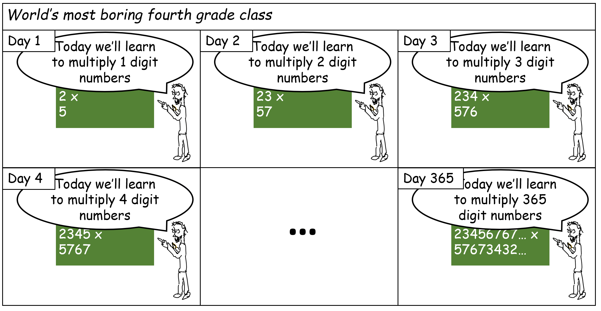
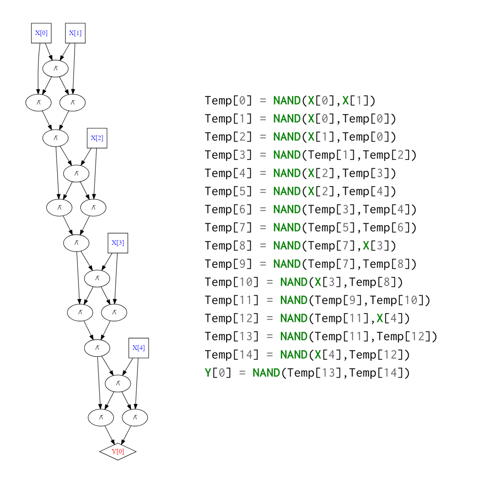
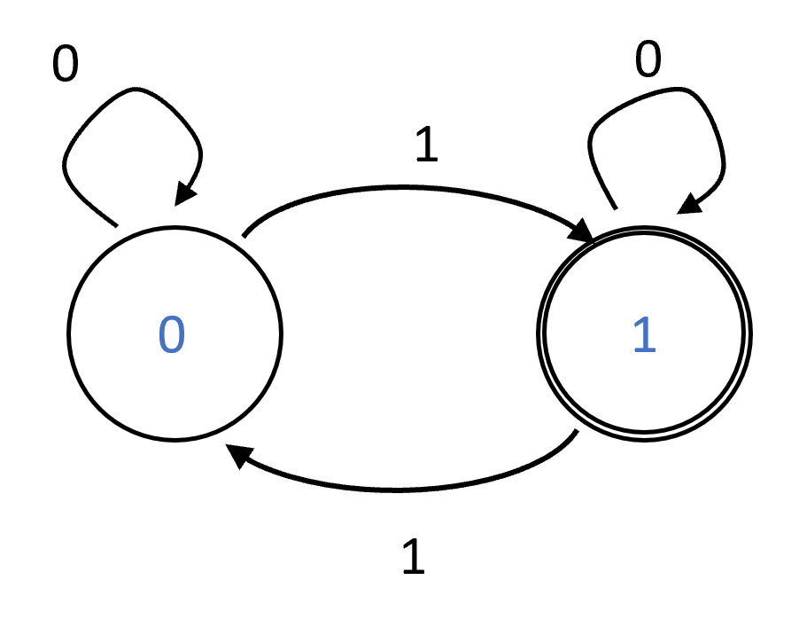
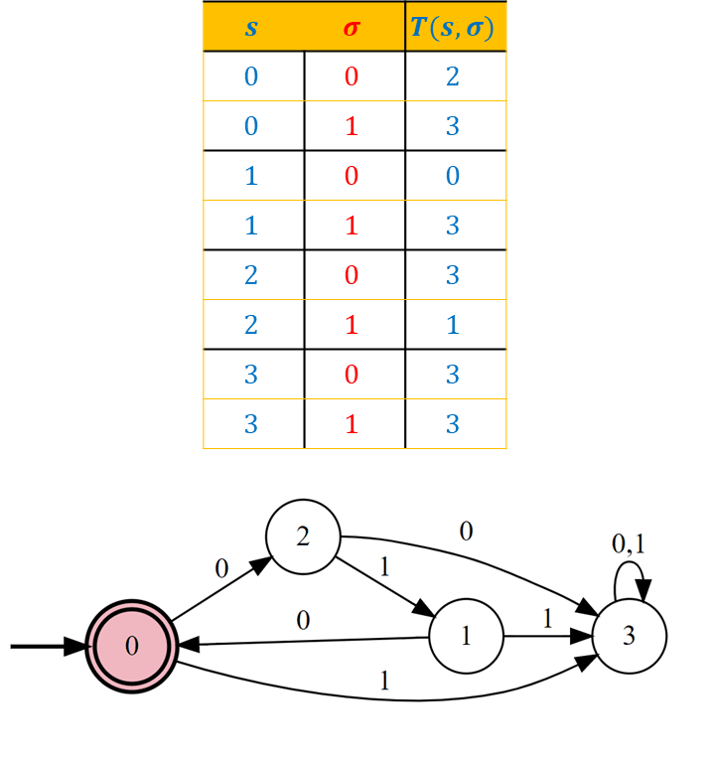
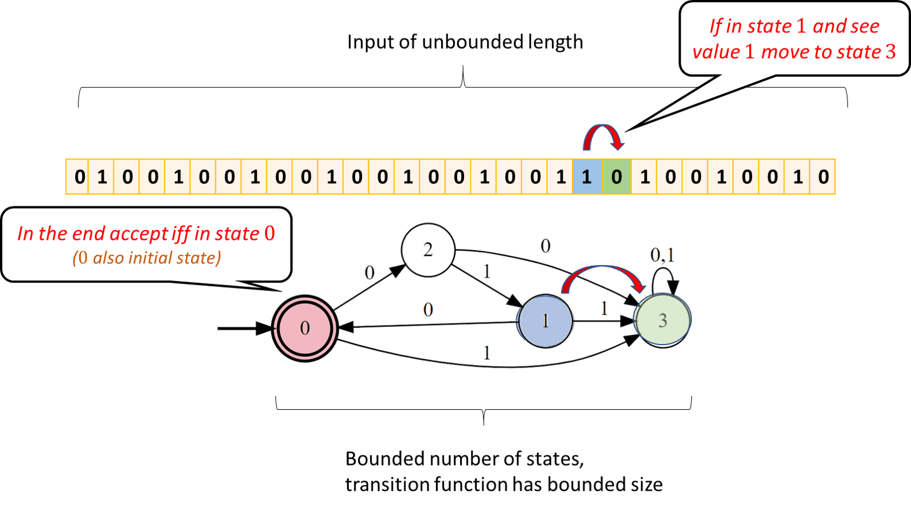
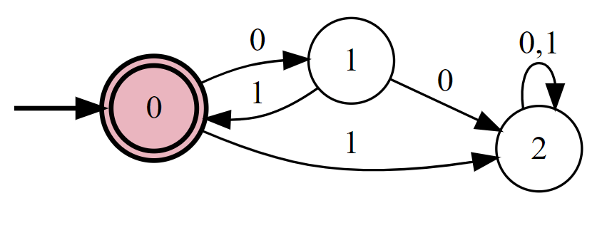
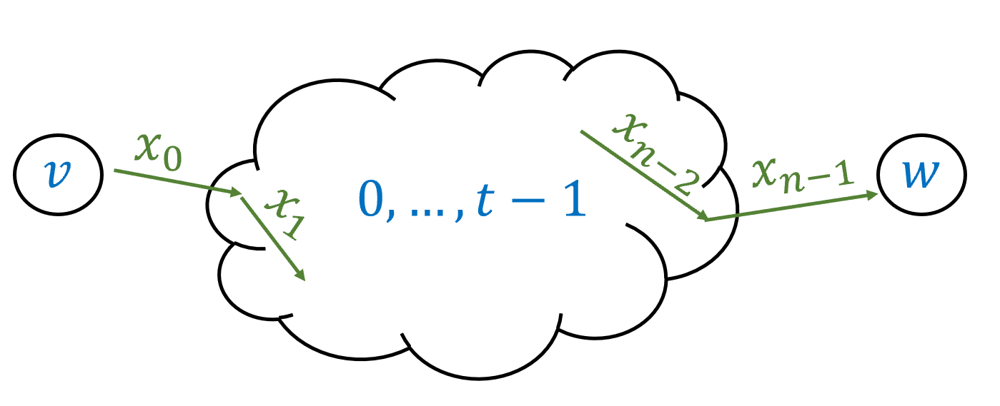
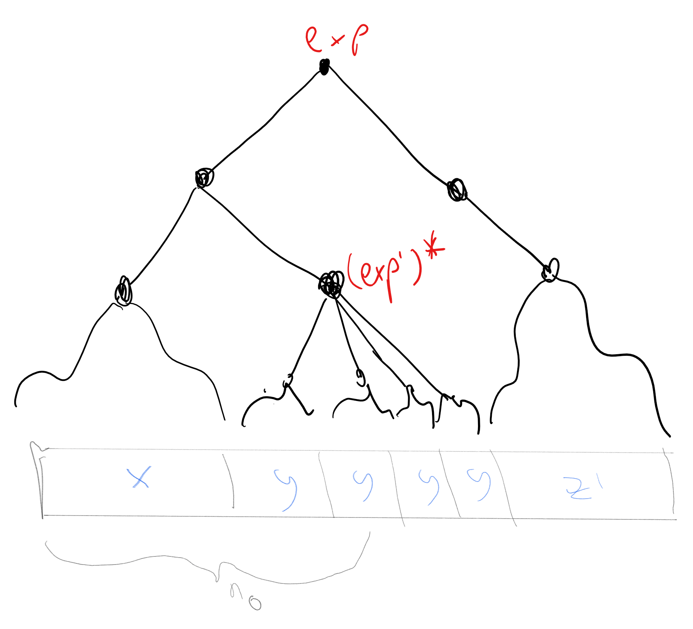
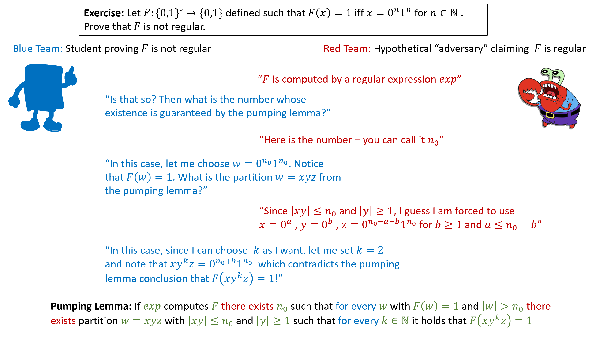

<!-- toc -->

# 6. 无限域函数，自动机与正则表达式 { #chapinfinite }

## 学习目标{ .objectives }
* 在 **长度无界** 的输入上定义函数，这种函数无法用一个大小有限的、由输入和输出构成的表格描述
* (前者)与语言的成员资格判定任务的等价性
* 确定性有穷自动机(可选): 一个无界计算模型的简单案例
* (前者)与正则表达式的等价性

```admonish quote
"算法以有限回答无穷"

*—Stephen Kleene*
```

布尔电路的模型(或者说，NAND-CIRC编程语言)有一个非常明显的短板: 一个布尔电路只能计算一个 **有限的** 函数$f$. 事实上，由于每个门配有两个输入，大小为$s$的电路至多能计算长度为$2s$的输入. 

因此该模型无法捕捉到这样一种直观概念: 算法可以视作对潜在的无穷函数进行的 **统一处理** . 

比方说，标准的小学乘法算法是一种 **统一** 算法，它可以对所有长度的数进行乘法运算的. 然而，这种算法无法被表达为单一的电路，而是需要对每种输入配备一个不同的电路(或者说，NAND-CIRC语言). (见[图 6.1](#multiplicationschoolfig))

<!--图 6.1-->
```admonish pic id="multiplicationschoolfig"


{{pic}} 一旦知道如何计算多位数乘法，就可以对所有$n$位数这么做. 但如果你想用布尔电路或者NAND-CIRC程序来描述乘法，对所有长度为$n$的输入，你都需要一个不同的程序/电路
```

本章拓展了计算任务的定义，使其考虑配备 **无界** 定义域$\{0,1\}^*$的函数. 
其重点在于定义计算 **哪些** 任务，将 **如何** 计算的绝大部分留给之后的章节. 其中将会认识到 **图灵机** 与其他在无界输入上进行计算的计算模型. 
然而，这一章将认识到一个简单且受限的计算模型——确定性有穷自动机(DFAs). 

```admonish info title = "简要概述"
阅读本章, 我们希望读者能够有以下收获: 
 - 本章将会讨论以任意长度字符串作为输入的函数，其中主要关注 **布尔** 函数这种特例，其输出为单个位. 
 - 除此之外仍然有无数多个输入长度无界的函数. 因此这一的函数不能被任何一个单一的布尔电路计算. 
这个章节的第二部分将会讨论 **有穷自动机** ，这种计算模型可以计算一个输入长度无界的函数. 
 - 确定性有穷自动机不像Python或其他通用编程语言一样强大. 但它可以作为这些更加通用的计算模型的一个引子. 
 - 本章将会展示一个美妙的结果——能被有穷自动机计算的函数与能被 **正则表达式** 计算的函数精确地一致. 
 - 然而，读者仍然可以自由跳过自动机的部分，直接转向[第七章](./chapter_7.md)中对于 **图灵机** 的讨论. 
```

## 6.1 输入长度无界的函数

直到现在，我们考虑的计算任务都将某些长度为$n$的字符串映射为某个长度为$m$的字符串. 

然而，一般情况下的计算任务都会涉及到长度无界的输入
例如，接下来的Python函数会计算一个函数$XOR:\{0,1\}^* \rightarrow \{0,1\}$, 其中 $XOR(x)$ 为 $1$ 当且仅当$x$中$1$的数量为奇数. 

(换言之，对每个 $x\in \{0,1\}^*$，$XOR(x) = \sum_{i=0}^{|x|-1} x_i \mod 2$)
$XOR$虽然简单，却无法被一个布尔电路计算. 相反，对每个$n$，都需要通过不同的电路计算$XOR_n$($XOR$函数在$\{0,1\}^n$的限制)(e.g. 见[图 6.2](#xor5circprogfig)).  

```python
def XOR(X):
    '''接受一个0与1的列表X
       当1的个数为奇数时输出1
       否则输出0'''
    result = 0
    for i in range(len(X)):
        result = (result + X[i]) % 2
    return result
```
<!--图 6.2-->
```admonish pic id="xor5circprogfig"


{{pic}} 计算$5$位异或的NAND电路与NAND-CIRC程序. 值得注意的是$XOR_5$的电路仅仅只是重复了四次计算$2$位异或的电路. 
这本书的前面部分研究了 **有限** 函数$f:\{0,1\}^n \rightarrow \{0,1\}^m$的计算. 这样一种函数$f$总是能通过列举所有的输入$x\in \{0,1\}^n$所对应的$2^n$个函数值来表示. 本章考虑像$XOR$这样输入长度无界的函数. 
```

尽管能用有限多个符号来描述$XOR$(事实上在上面已经做过了)，它却能接受无穷多种可能的输入，因此无法把它所有的函数值都写下来. 
这对其他蕴含着其他重要计算任务的函数也是同理，包括加法，乘法，排序，在图上寻找路径，由点拟合曲线，等等. 

为了和有限情况作区分，有时将函数$F:\{0,1\}^* \rightarrow \{0,1\}$(或$F:\{0,1\}^* \rightarrow \{0,1\}^*$)称为 **无限的** . 
然而，这不意味着$F$可以接收一个无限长的输入. 
它仅仅表明$F$可以接收任意长的输入，因此无法简单地把在一个表上把不同输入下$F$的全部输出都写下来. 

```admonish bigidea
{{idec}}{ide:comptask}
函数$F:\{0,1\}^* \rightarrow \{0,1\}^*$指明了一个将输入$x\in \{0,1\}^*$映射到$F(x)$的计算任务. 
```

如前所述，不失一般性的前提下，我们可以把注意力限制在输入和输出为二进制串的函数. 因为其他的对象，像数字、列表、矩阵、照片、视频、以及别的种种，都可以用二进制串编码. 

如前所述，有必要区分 **规范** 和 **实现** 这两个概念 . 例如，考虑以下函数. 

$$
TWINP(x) = \begin{cases} 
        1 & \exists_{p \in \N} \text{使得} p,p+2 \text{为质数且} p>|x| \\
        0 & \text{否则}
       \end{cases}
$$

在数学上，这是一个良定义的函数. 对每个$x$,$TWINP$都会有一个非$0$即$1$的函数值. 然而，截至目前，尚未已知能计算该函数的Python程序. [孪生素数猜想](https://en.wikipedia.org/wiki/Twin_prime)主张对每个$n$都有一个$p>n$使得$p,p+2$均为素数. 
如果该猜想成立，那么$T$(译者注:此处应指$TWINP$)很容易计算—— `def T(x): return 1`是一个奏效的程序. 
然而，自1849年起，数学家们对该猜想的证明均无功而返. 
这说明，不论知不知道$TWINP$函数的 **实现** ，上面的定义提供的都是它的 **规范** . 

### 6.1.1 改变输入和输出

许多有趣的函数都接受不止一个输入，例如函数: 

$$
MULT(x,y) = x \cdot y
$$

接受一个二进制表示的整数对$x,y \in \N$，并输出积$x \cdot y$的二进制表示.
然而，因为一对字符串能被表达为一个单一的字符串，所以像$MULT$这样的函数，可以被视为从$\{0,1\}^*$到$\{0,1\}^*$的映射. 
一般不考虑底层细节，比如把一对整数精确地表达为串的方式，因为近乎所有的选择对我们的目标而言都是等价的. 

我们想计算的另一个函数是

$$
PALINDROME(x) = \begin{cases}
        1 & \forall_{i \in [|x|]} x_i = x_{|x|-i} \\
        0 & \text{否则}
        \end{cases}
$$

$PALINDROME$ 以一个单个位作为输出. 以一个单个位为输出的函数成为 **布尔函数** . 
布尔函数是计算理论的中心，因此将在这本书中经常性地被讨论. 
需要注意的是，即使布尔函数只有一个单一位用于输出，其输入可以是任意长度的. 
因此它们仍然无法通过一个由函数值组成的有限表格描述，因此仍然是一个无限函数. 

*"布尔化"函数* . 有时从一个非布尔函数中构造一个布尔函数的变体是非常方便的. 
例如，下列函数是$MULT$的一个布尔函数变体: 

$$
BMULT(x,y,i) = \begin{cases}
                x\cdot y \text{的第i位} & i <|x \cdot y| \\
                0     & \text{否则}
               \end{cases}
$$

如果能够通过例如Python，C，JAVA等任何一门编程语言计算$BMULT$，也可以计算$MUL$，反之亦然. 


```admonish question title=""
{{exec}}{exe:booleanize}[一般函数的布尔化]

说明对每个函数$F:\{0,1\}^* \rightarrow \{0,1\}^*$，都有一个布尔函数$BF:\{0,1\}^* \rightarrow \{0,1\}$使得一个能够计算$BF$的Python程序可以被转移为一个计算$F$的程序，反之亦然. 
```

```admonish solution collapsible=true title="解答6.1"
对每个函数$F:\{0,1\}^* \rightarrow \{0,1\}^*$, 可以定义. 

$$
BF(x,i,b) = \begin{cases}
            F(x)_i & i<|F(x)|, b=0 \\
            1      & i<|F(x)|, b=1 \\
            0      & i \geq |F(x)|
            \end{cases}
$$
其输入满足 $x \in \{0,1\}^*, i \in \N, b\in \{0,1\}$，而输出为$F(x)$的第i位(如果$b=0$且$i<|F(x)|$). 

如果$b=1$，则$BF(x,i,b)$当且仅当$i<|F(x)|$时为$1$，通过这一点可以计算$F(x)$的长度. 
从$F$出发计算$BF$是十分直接的. 
另一方面，给定一个计算$BF$的Python函数$BF$，可以通过如下方法计算$F$. 

~~~python
def F(x):
    res = []
    i = 0
    while BF(x,i,1):
        res.append(BF(x,i,0))
        i += 1
    return res
~~~
```

### 6.1.2 形式语言 { #languagessec } 

对每个布尔函数$F:\{0,1\}^* \rightarrow \{0,1\}$，可以定义集合 $L_F = \{ x | F(x) = 1 \}$. 这样的集合被称为 **语言** . 
这个名字源于 **形式语言理论** ，像Noam Chomsky这样的语言学家致力于该理论. . 
一个 **形式语言** 是$L \subseteq \{0,1\}^*$(更一般地说$L \subseteq \Sigma^*$，其中$\Sigma$是一个有限的字母表{{footnote:译者注: $\Sigma$中的元素称为 **字母** ，原著中提到其元素时使用的术语是字母表符号`alphabet symbol`，翻译时为了简洁使用字母这一个更加简单的术语}}). 
一个语言$L$上的 **成员资格问题** 或 **判定问题** ，是断定对于给定的$x\in \{0,1\}^*$，是否有$x\in L$. 
如果能够计算函数$F$，也就能够判定语言$L_F$的成员资格，反之亦然. 
因此，许多像[Sipser，1997](https://scholar.google.com/scholar?hl=en&q=Sipser+Introduction+to+the+theory+of+computation)这样的教材都将计算一个布尔函数的任务称为"判定一个语言"
本书主要用 **函数** 的记号来描述计算任务，这种方法更容易推广到不止一位输出的计算任务. 
然而，因为语言的术语在文献中更加流行，有时也会提到它们. 

### 6.1.3 函数的限制

如果$F:\{0,1\}^* \rightarrow \{0,1\}$是一个布尔函数而$n\in \N$，则$F$在输入长度为$n$上的限制记作$F_n$，是一个有限函数$f:\{0,1\}^n \rightarrow \{0,1\}$使得对每个$x\in \{0,1\}^n$均有$f(x) = F(x)$. 
这就是说$F_n$是定义在$\{0,1\}^n$上的有限函数，但在这些输入上与$F$保持一致. 
因为$F_n$是一个有限函数，所以它可以被一个布尔电路计算. 以下定理表明了这一点. 

```admonish quote title=""
{{thmc}}{thm:computeallinfinitefunc}[无限函数的电路族] 
 
令$F:\{0,1\}^* \rightarrow \{0,1\}$.. 则有一个电路族$\{ C_n \}_{n\in \{1,2,\ldots\}}$使得对每个$n>0$，$C_n$能够计算$F$在输入长度为$n$上的限制$F_n$
```

```admonish proof collapsible=true, title = "对{{ref:thm:computeallinfinitefunc}}的证明"
这是布尔电路通用性的一个立即推论. 
事实上，因为$F$把$\{0,1\}^n$映射到$\{0,1\}$，定理4.15表明一定有一个布尔函数$C_n$来计算它. 
事实上，这个电路的大小为至多$c \cdot 2^n / n$个门，其中$c \leq 10$为常数. $\square$
```

特别地，{{ref:thm:computeallinfinitefunc}}表明甚至对于前面描述过的$TWINP$函数，这样的电路族也存在，即使尚未已知的程序可以对其进行计算. 
这实际上并不令人惊讶: 对每个特定的$n \in N$，$TWINP_n$要么是常0函数要么是常1函数，其中任何一者都可以用一个简单的布尔电路计算. 
因为计算$TWINP$的电路族一定存在，用Python或其他任何编程语言计算$TWINP$的难度源于这样一个事实——我们不知道对每个特定的$n$，电路族中的$C_n$应该是什么. 

## 6.2 确定性有穷自动机(可选)

我们目前所有的计算模型——布尔电路和无分支程序——都只对 **有限** 函数有效. 

在[第七章](./chapter_7.md)中，将会介绍 **图灵机** ，这是输入长度无界函数的中心计算模型. 
然而，本节将会介绍一个更加基本的模型—— **确定性有穷自动机** (DFA)

自动机可以视作通往图灵机的一个优秀的垫脚石，尽管它们在这本书的后面部分并不会大量地被用到，所以读者可以自由跳过到[第七章](./chapter_7.md).

DFA在能力上与 **正则表达式** 是等价的: 正则表达式是识别模式的一个强力工具，在实践中广泛应用. 
本书对自动机的处理是相对简略的. 有大量的资源可以帮助你更加熟悉DFAs. 
详细地说，第一章中Sisper的著作[Sipser, 1997](https://scholar.google.com/scholar?hl=en&q=Sipser+Introduction+to+the+theory+of+computation)包含对这个内容的绝佳的说明. 
这里有许多的在线自动机模拟器网站，也有将自动机和正则表达式互化的翻译器. 
(例如[此处](http://ivanzuzak.info/noam/webapps/fsm2regex/)和[此处](https://cyberzhg.github.io/toolbox/nfa2dfa)).

从高视角上看，一个 **算法** 是通过以下步骤的组合从输入计算输出的方法:

1. 从输入读入一位
2. 更新 **状态** (工作记忆)
3. 停止并产生一个输出

例如，回忆以下计算$XOR$函数的Python程序

```python
def XOR(X):
    '''接受一个0与1的列表X
       当1的个数为奇数时输出1
       否则输出0'''
    result = 0
    for i in range(len(X)):
        result = (result + X[i]) % 2
    return result
```
每一步中，程序读入一个位`X[i]`并且根据它更新自己的`result`状态(在`X[i]`为1时翻转`result`，否则保持原样). 当它遍历完输入后，程序输出`result`. 
在计算机科学中，这样一个程序称为 **单遍常数内存算法** ，因为它只遍历一次输入，而它的工作记忆是有限的. 
(事实上，在这个案例中，`result`非$0$即$1$)
这样一个算法称为 **确定性有穷自动机** 或 **DFA** (DFAs的另一个名字是 **有限自动机** ). 
我们可以把这样一种算法视作一个拥有$C$个状态的"机器"，其中$C$为常数. 
这样一种机器从某个初始状态开始，然后从输入$x \in \{0.1\}^*$中一次读取一个位
只要这个机器读入了一个位$\sigma \in \{0,1\}$，它就会根据$\sigma$和先前的状态转换到一个新的状态. 
机器的输出决定于最终状态. 每个单遍常数内存算法都和这样一个机器一致. 
如果这个算法使用了$c$位内存，那么其内存中的内容就能用一个长度为$c$的串表达. 因此对于这样一个算法的任意一个执行点，其都在至多$2^c$个状态之中. 

我们可以通过一个$C \cdot 2$条规则的列表来指明一个拥有$C$个状态的DFA{{footnote:译者注: 更准确地说，是$C \cdot |\Sigma|$条，但之后考虑的均为$\Sigma=\{0,1\}$，因此$|\Sigma|=2$}}. 
每条规则都有这样的形式: "如果DFA位于状态$v$，读入的输入位为$sigma$，则新状态为$v'$". 
在计算的最后，会有一个具有形式"如果最终状态为下列中的一者 ... 则输出$1$，否则输出$0$"的规则. 
举例而言，上述的Python程序可以用一个两个状态的自动机来计算$XOR$: 

* 初始化为状态$0$. 
* 对每个状态$s \in \{0,1\}$和读取的输入位$\sigma$，如果$\sigma=1$则将状态转移为$1-s$，否则停留在状态$s$. 
* 最终当且仅当$s=1$时输出$1$. 

我们也可以用一个带标号的$C$个顶点的 **图** 来描述$C$个状态的DFA. 随每个状态$s$和位$\sigma$，我们添加一条带有标号$\sigma$的从$s$到$s'$的有向边，使得若DFA位于状态$s$且读入$\sigma$，则DFA转移到状态$s'$. (如果状态不变，则这个边是一个指向原状态的圈; 相似地，如果$s$在$\sigma=0$和$\sigma=1$两种情况下都转移为状态$s'$，则图上会有两条平行的边)同时也会标明在最后使自动机输出$1$的状态集$\mathcal{S}$. 这个集合称为 **接受状态** 集. 

[图 6.3](#xorautomatonfig)给出了XOR自动机的图形表示

<!--图6.3-->
```admonish pic id="xorautomatonfig"


{{pic}} 一个计算XOR函数的有穷自动机. 其有两个状态$0$和$1$, 当它读入$\sigma$时，它从$v$转移到$v \oplus \sigma$.
```

形式化地讲，一个DFA由 **(1)** $C \cdot 2$条规则构成的表格，该表格用 **转移函数** $T$表示. $T$将状态$s \in [C]$和位$\sigma \in \{0,1\}$映射到状态$s' \in [C]$. DFA将会在输入$\sigma$下从状态$s$转移到$s'$; 和 **(2)** 接受状态集$\mathcal{S}$

```admonish quote title=""
{{def}}{def:DFA}[确定性有穷自动机] 

一个在$\{0,1\}$上定义的$C$个状态的确定性有穷自动机是一个对$(T, \mathcal{S})$. 其中$T:[C]\times \{0,1\} \rightarrow [C]$ 而 $\mathcal{S} \subseteq [C]$. 
有限函数$T$称为DFA的 **转移函数** . 集合$\mathcal{S}$称为 **接受状态** 集. 

令$F:\{0,1\}^* \rightarrow \{0,1\}$为无限域$\{0,1\}^*$上的布尔函数. 
对于任意$n \in \N$和$x\in \{0,1\}^n$，定义$s_0=0$且对任意$i \in [n]$，$s_{i+1} = T(s_i,x_i)$，若有
$$
s_n \in \mathcal{S}   \Leftrightarrow F(x)=1
$$
则称$(T,\mathcal{S})$计算函数$F:\{0,1\}^* \rightarrow \{0,1\}$. 
```

```admonish pause title="暂停一下"
确保你没有混淆自动机的 **转移函数** ({{ref:def:DFA}}中的$T$)与其所 **计算** 的函数({{ref:def:DFA}}中的$F$). 前者是一个有限函数，指明了自动机所遵循的规则的表格; 后者是一个无限函数. 
```

```admonish info
{{remc}}{rem:Sipserautmatadef}[其他教材中的定义]

确定性有穷自动机可以通过几种等价的方法定义. 

特别地，Sisper在[Sipser，1997](https://scholar.google.com/scholar?hl=en&q=Sipser+Introduction+to+the+theory+of+computation)将DFA定义为五元组$(Q,\Sigma,\delta,q_0,F)$，其中$Q$为状态集，$\Sigma$为字母表，$\delta$为转移函数，$q_0$是初始状态，$F$为接受状态集. 

该书中状态集总是如下形式$Q=\{0,\ldots,C-1 \}$而初状态总是$q_0 = 0$，但这对这些模型的计算能力没有影响. 
因此，我们将注意力局限在字母表$\Sigma$与$\{0,1\}$相等的情况. 
```

```admonish question
{{exec}}{exe:DFAzeroone}[识别$(010)^*的DFA$]

证明计算下列函数$F$的DFA存在: 

$$
F(x) = \begin{cases} 
         1 & 3 \text{ 整除 } |x| \text{ 且 } \forall_{i\in [|x|/3]} x_{3i} x_{3i+1} x_{3i+2} = 010  \\
         0 & \text{否则}
         \end{cases}
$$
```

```admonish solution collapsible=true title="解答6.2"
当要求构造一个DFA时，可以首先通过更加一般的、形式化的方式，来构造一个单遍常数内存算法，这通常是有效的. (例如使用伪代码或者一个python程序). 一旦得到了这样一个算法，就可以机械式地将其翻译为一个DFA. 
以下是计算$F$的一个简单Python程序: 

~~~python
def F(X):
    '''当且仅当X是零个或多个[0,1,0]的拼接时返回1'''
    if len(X) % 3 != 0:
        return False
    ultimate = 0
    penultimate = 1
    antepenultimate = 0
    for idx, b in enumerate(X):
        antepenultimate = penultimate
        penultimate = ultimate
        ultimate = b
        if idx % 3 == 2 and ((antepenultimate, penultimate, ultimate) != (0,1,0)):
            return False
    return True
~~~

```

既然我们维护了三个布尔变量，工作记忆就可以是$2^3 = 8$种配置中的一个，因此上述程序可以直接翻译为一个$8$状态DFA. 
尽管这对解决问题没有必要，通过检查结果DFA，会发现可以通过合并一些状态得到一个$4$状态自动机，该自动机在[图 6.4](#DFA010afig)中描述. [图 6.5](#DFA010executionfig)中描述了在一个特定输入上这个DFA的运行. 

<!--图6.4-->
```admonish pic id="DFA010afig"


{{pic}} 一个仅在输入$x\in \{0,1\}^*$为零个或多个$010$的拼接时输出$1$的DFA. 
状态$0$既是初始状态又是唯一的接受状态. 
表格表示了转移函数$T$. 它将当前状态和读到的符号映射到一个新状态. 
```

### 对自动机的剖析(有限vs无界)

既然我们已在考虑输入长度无界的计算任务，将算法中拥有 **固定长度** 的组件，和大小随输入增长的组件区分开，是非常关键的任务. 对于DFAs而言，要分类的是下列部分: 

**固定大小组件:** 给定一个DFA $A$，下列量是固定的，与输入大小无关: 

* $A$中 **状态** 数$C$. 
* **转移函数** $T$(有$2C$种输入，因此可以用一个$2C$行的表格描述，每一项都是$[C]$中的一个数字). 
* 接收状态集$\mathcal{S} \subseteq [C]$. 该集合可以用一个$\{0,1\}^C$中的串描述，以指明哪些状态位于$\mathcal{S}$中而哪些没有. 

以上这些意味着，可以通过有限多个符号完全地描述一个自动机. 这是我们要求的任何一种"算法"的概念都拥有的一个共同性质: 我们应当能够写下如何从输入生成输出的完整规范. 

**无界大小组件:** 以下关于DFA的量不以任何常数作为上界. 需要强调的是，对于任何给定的输入，它们仍然是有限的.  

* 提供给DFA的输入$x\in \{0,1\}^*$的大小. 输入长度总是有限的，但是不能预先设定上界. 
* DFA执行的步数可以随输入长度而增长. 事实上，DFA进行单次便利，因此对于一个输入$x\in \{0,1\}^*$，它精确地执行$|x|$步. 

<!--图6.5-->
```admonish pic id="DFA010executionfig"


{{pic}} [图 6.4](#DFA010afig)中DFA的执行过程. 状态数和转移函数的大小是有界的，但是输入可以是任意长的. 
如果DFA位于状态$s$且读取值$\sigma$，则其转移到状态$T(s,\sigma)$. 在执行的最后，当且仅当最终状态位于$\mathcal{S}$时DFA接受该输入. 
```

### DFA可计算函数

如果有一个$DFA$可以计算$F$，就称一个函数$F:\{0,1\}^* \rightarrow \{0,1\}$是 *DFA可计算的* . 
在[第四章](./chapter_4.md)中，我们发现每个有限函数都可以被某些布尔电路计算，因此，在此刻，你可能会希望每个函数都可以被 **某些** DFA计算. 
然而，有很多并 **不是** 这种情况. 我们马上就会发现一些简单的，却无法被DFA计算的无限函数. 但对于初学者，我们先证明这样的函数是存在的. 

```admonish quote title=""
{{thmc}}{thm:DFAcompuncountable}[DFA可计算的函数是可数的]
 
让$DFACOMP$为全体使得存在一个DFA计算$F$的布尔函数$F:\{0,1\}^* \rightarrow \{0,1\}$的集合. 则$DFACOMP$可数. 
```

```admonish proof collapsible=true, title = "对{{ref:thm:DFAcompuncountable}}的证明思路"
每个DFA都能用一个有限长度的串来描述，从而产生一个从$\{0,1\}^*$到$DFACOMP$的满射: 更准确地说，这个函数将一个描述自动机$A$的串对应到$A$计算的函数. 
```

```admonish proof collapsible=true, title = "对{{ref:thm:DFAcompuncountable}}的证明"
每个DFA都能用一个表示转移函数$T$和接收状态集的串描述，而每个DFA $A$都计算 **某些** 函数$F:\{0,1\}^* \rightarrow \{0,1\}$. 
因此可以定义如下函数$StDC:\{0,1\}^* \rightarrow DFACOMP$:
$$
StDC(a) = \begin{cases}
        F & a \text{ 表示自动机 } A \text{ 且 } F \text{ 是 } A \text{ 计算的函数 } \\
        ONE & \text{否则}
        \end{cases}
$$
其中$ONE:\{0,1\}^* \rightarrow \{0,1\}$是对于所有输入，其均输出$1$的常函数(也是$DFACOMP$中的一个函数). 
因此根据定义，每个$DFACOMP$中的函数$F$都可以被 **某些** 自动机计算，而$StDC$是从$\{0,1\}^*$到$DFACOMP$的满射，这就意味着$DFACOMP$可数. (见[节 2.4.2](./chapter_2.md))$\square$
```

因为 **所有** 布尔函数的集合是不可数的，所以有如下推论: 

```admonish quote title=""
{{thmc}}{thm:DFAdontcomputeeverything}[DFA不可计算函数的存在性] 
 
存在一个布尔函数$F:\{0,1\}^* \rightarrow \{0,1\}$不能被 **任何的** DFA计算. 
```

```admonish proof collapsible=true, title = "对{{ref:thm:DFAdontcomputeeverything}}的证明"
如果每个布尔函数$F$都可以被一些DFA计算，那么$DFACOMP$就与集合$ALL$(所有布尔函数的集合)相等. 但根据定理2.12，后者不可数，又与{{ref:thm:DFAcompuncountable}}相矛盾. $\square$
```

## 6.3 正则表达式

**搜索** 一段文本是计算中的一个常见任务. 从本质上说， **搜索问题** 非常简单. 
我们有一个串集$X = \{ x_0, \ldots, x_k \}$(例如硬盘上的文件，或数据库中的学生记录)，而用户想要找到一个所有被某些模式 **匹配** 的$x \in X$构成的子集. 
(例如，所有名称以串`.txt`结尾的文件)
在最一般的情况下，我们允许用户通过指定一个(可计算的) **函数** $F:\{0,1\}^* \rightarrow \{0,1\}$来指明模式，其中$F(x)=1$与$x$的模式匹配相一致. 
这就是说，用户提供一个用像 **Python** 这样的编程语言编写的 **程序** $P$，而系统返回所有使$P(x)=1$的$x \in X$. 
举例而言，我们可以搜索所有包含串`important document`的文本文件，或是(让$P$与一个基于神经网络的分类器相一致)所有包含猫的图片. 
然而，我们希望系统不会为了尝试求程序$P$的值，而因此陷入死循环! 
因此，典型的搜索文件和数据库的系统 **不** 允许用户用功能齐全的编程语言来指定模式. 
相反，这样的系统使用 **受限计算模型** . 这种模型一方面 **足够丰富** ，可以捕捉许多实践中需要的查询(例如，所有以`.txt`结尾的文件名，或者所有形如`(617)xxx-xxxx`的电话号码)，但另一方面受到的 **限制** 又足够大，使大型文件中的查询变得非常高效，并避免其陷入死循环. 

这种计算模型中最流行的一种是[正则表达式](https://goo.gl/2vTAFU). 如果你使用过一个高级的文本编辑器，一个命令行终端，或者进行过任何种类的、对文本文件的大批量操作，那么你很有可能对正则表达式有所耳闻. 

在字母表$\Sigma$上定义的 **正则表达式** 由$\Sigma$上的元素通过连接操作，$|$操作(与 **或** 一致)和$*$操作(与重复零到多次一致)组合而成. 
举例而言，接下来的正则表达式在字母表$\{0,1\}$上定义，并与所有使每个数位重复至少两次的串$x\in \{0,1\}^*$所构成的集合一致: 
$$
(00(0^*)|11(1^*))^*
$$

下列正则表达式定义在字母表$\{ a,\ldots,z,0,\ldots,9 \}$上，并与所有这样的串形成的集合一致——该串由两个序列连接: 第一个序列由至少一个$a$-$d$的字母形成; 第二个序列由至少一个数位形成(无前导零). 

$$
(a|b|c|d)(a|b|c|d)^*(1|2|3|4|5|6|7|8|9)(0|1|2|3|4|5|6|7|8|9)^* {{numeq}}{eq:regexp}
$$

形式化地说，正则表达式由以下递归定义所定义: 

```admonish quote title=""
{{def}}{def:regexp}[正则表达式] 
字母表$\Sigma$上定义的 **正则表达式** $e$是$\Sigma \cup \{ (,),|,*,\emptyset, \texttt{""} \}$上的一个串，并具有下列形式之一
1. $e = \sigma$，其中$\sigma \in \Sigma$
2. $e = (e' | e'')$，其中$e', e''$为正则表达式
3. $e = (e')(e'')$其中$e',e''$为正则表达式(当不会混淆时，通常省略括号并写为$e' \; e''$. )
4. $e = (e')^*$其中$e'$为正则表达式
最终还有两个"边界条件": $e = \emptyset$ and $e = \texttt{""}$. 这些正则表达式分别与不接受任何串和只接受空串一致. 
```

在能从上下文中推断出来时，我们也会忽略括号. 我们也使用或运算和连接运算左结合的惯例，并且给$*$运算最高的优先级，然后是连接，最后是或. 
因此，举例来说，我们写的是$00^*|11$而不是$((0)(0^*))|((1)(1))$. 

每个正则表达式$e$都与一个函数$\Phi_{e}:\Sigma^* \rightarrow \{0,1\}$一致，其中若$x$ **匹配** 正则表达式，则$\Phi_{e}(x)=1$. 
举例说，若$e = (00|11)^*$ 则 $\Phi_e(110011)=1$ 而 $\Phi_e(101)=0$(你知道为什么吗)

```admonish pause title="暂停一下"
$\Phi_{e}$的形式化定义是那种写比掌握麻烦的类型. 因此第一时间自己搞清楚其定义，再检查其是否与下列的定义相符，可能会更加简单. 
```

```admonish quote title=""
{{def}}{def:matchingregexp}[匹配正则表达式] 
令$e$为字母表$\Sigma$上的正则表达式
函数$\Phi_{e}:\Sigma^* \rightarrow \{0,1\}$ 定义如下:
1. 若$e = \sigma$，则当且仅当$x=\sigma$时$\Phi_{e}(x)=1$. 
2. 若$e = (e' | e'')$，则$\Phi_{e}(x) = \Phi_{e'}(x) \vee \Phi_{e''}(x)$，其中$\vee$为或运算符. 
3. 若$e = (e')(e'')$，则当且仅当存在$x',x'' \in \Sigma^*$使得$x$为$x'$和$x''$的连接，且$\Phi_{e'}(x')=\Phi_{e''}(x'')=1$时，$\Phi_{e}(x) = 1$.  
4. 若$e= (e')*$，则当且仅当存在$k\in \N$和$x_0,\ldots,x_{k-1} \in \Sigma^*$使得$x$为$x_0 \cdots x_{k-1}$的连接，且对每个$i\in [k]$，均有$\Phi_{e'}(x_i)=1$时$\Phi_{e}(x)=1$. 
5. 最终, 对边界条件 $\Phi_{\emptyset}$是常$0$函数, 而$\Phi_{\texttt{""}}$ 只在输入空串时输出$1$. 
对一个串$x \in \Sigma^*$，若$\Sigma$上的正则表达式$e$使$\Phi_{e}(x)=1$，就说$e$ **匹配** $x$. 
```

```admonish pause title="暂停一下"
上述的定义本身并不是什么难事，但很麻烦. 所以你应该在此处停下并再看一次上述定义，直到你理解为什么该定义与我们对正则表达式的直观概念是相一致的. 这不仅对理解正则表达式本身(在许多应用中经常使用)很重要，对更好地理解一般的递归定义也一样. 
```

若一个布尔函数在输出$1$时，所有的输入串都能够被某些正则表达式匹配，就说这个布尔函数是"正则的". 

```admonish quote title=""
{{def}}{def:regularfunctions}[定义6.8] 正则函数/语言
令$\Sigma$为一个有限集，而$F:\Sigma^*\rightarrow \{0,1\}$为一个布尔函数. 若存在某个正则表达式$e$，$F=\Phi_{e}$，就称$F$是 **正则** 的. 
类似的，对每个形式语言$L \subseteq \Sigma^*$，称$L$是正则的当且仅当存在某个正则表达式$e$使得$x\in L$当且仅当$e$匹配$x$. 
```


```admonish example title=""
{{exac}}{exa:regularexpmatching}[一个正则函数]
令$\Sigma=\{ a,b,c,d,0,1,2,3,4,5,6,7,8,9 \}$而$F:\Sigma^* \rightarrow \{0,1\}$使得$F(x)$当且仅当$x$是一个或多个$a$-$d$组成的序列接上一个或多个数位组成的序列(无前导零)
则$F$就是一个正则函数，因为$F=\Phi_e$，其中
$$
e = (a|b|c|d)(a|b|c|d)^*(1|2|3|4|5|6|7|8|9)(0|1|2|3|4|5|6|7|8|9)^*
$$

即{{eqref:eq:regexp}}

举例而言，如果要验证$\Phi_e(abc12078)=1$，注意到$(a|b|c|d)$匹配$a$，$(a|b|c|d)^*$匹配$bc$，$(1|2|3|4|5|6|7|8|9)$匹配$1$， $(0|1|2|3|4|5|6|7|8|9)^*$匹配$2078$. 其中这些式子又可以被归结为一些更简单的表达式. 例如$(a|b|c|d)^*$匹配$bc$，因为$b$和$c$被表达式$a|b|c|d$所匹配. 
```

正则表达式可以在任意有限字母表$\Sigma$上定义. 但是和之前一样，我们主要关注 **二进制情况** ，其中$\Sigma=\{0,1\}$. 绝大部分(如果不是所有的话)关于正则表达式的理论和实践的真知灼见都可以从研究二进制情况得到. 

### 6.3.1 匹配正则表达式的算法

除非能计算以下问题，否则正则表达式在搜索方面并不会很有用: 给定一个正则表达式$e$，串$x$是否被$e$匹配. 幸运的是，这样一个算法存在. 
准确地说，存在一个算法(你可以想成"Python程序"，尽管稍后就会用 **图灵机** 来形式化算法的概念)，该算法输入一个正则表达式$e$和串$x \in \{0,1\}^*$，当且仅当$e$匹配$x$时输出$1$(即，输出$\Phi_e(x)$)

实际上，{{ref:def:matchingregexp}}已经指明了一个 **计算** $\Phi_{e}$的递归算法. 准确地说，操作——连接，或，星号{{footnote:译者注: 准确的说法是闭包}}——可以被视作这样一个过程: 对测试某个表达式$e$是否匹配$x$的任务，将其归约到测试$e$的某个子表达式是否匹配$x$的某个子串. 因为这些子表达式总是比原式短，所以这个判定$e$是否匹配$x$的递归算法最终会在最基础的表达式上停止: 与空串或者当个符号一致. 

```admonish quote title=""
{{algc}}{alg:regexpmatch}[正则表达式匹配] 

$$
\begin{aligned}
&\input\text{在}\Sigma^*\text{上定义的正则表达式}e\text{,}x\in \Sigma^* \\
&\output \Phi_e(x) \\
&\proc{Match}(e,x) \\
&\quad\if{e = \emptyset} \return{0} \textbf{;} \\
&\quad\if{x = \texttt{""}} \return{\mathsf{MatchEmpty}(e)} \textbf{;} \\
&\quad\if{e \in \Sigma} \return{1} \text { iff } x = e \textbf{;} \\
&\quad\if{e = (e' | e'')} \return{\{\textsf{Match}(e',x) \text{或} \textsf{Match}(e'', x)\}} \textbf{;} \\
&\quad\if{e = (e')(e'')} \\
&\qquad\for{i \in [|x|]} \\
&\qqquad\if{\textsf{Match}(e',x_0 \cdots x_{i-1}) \text{且} \textsf{Match}(e'',x_i \cdots x_{|x|-1})} \return{1} \textbf{;}\\
&\qquad \endfor\\
&\quad \endif\\
&\quad\if{e = (e')^*}\\
&\qquad{e'=\texttt{""}} \return{\textsf{Match}(\texttt{""},x)} \textbf{;}\\
&\qquad \text{\#} (\texttt{""}) \text{与} \texttt{""} \text{相同} \\
&\qquad\for{i \in [|x|]} \\
&\qqquad\text{\#}x_0\cdots x_{i-1}\text{比}x\text{短}\\
&\qqquad\if{\textsf{Match}(e,x_0 \cdots x_{i-1}) \text{且} \textsf{Match}(e',x_i \cdots x_{|x|-1})}\return{1} \textbf{;}\\
&\qquad\endfor \\
&\quad\endif \\
&\quad\textbf{return }0 \\
&\endproc
\end{aligned}
$$
```

以上代码假定已经编写了一个过程$\textsf{MatchEmpty}$，其当且仅当$e$匹配空串$\texttt{""}$时输出$1$. 

一个关键的观察结果为，在对正则表达式的递归定义中，无论$e$是由一个还是两个表达式$e',e''$组成的，这两个正则表达式都比$e$ *小*
最终(当其长度为$1$)时，它们一定和单个字母的非递归情形一致. 
相应地，{{ref:alg:regexpmatch}}中的递归调用总是和一个更短的表达式或者(在表达式具有形式$(e')^*$的情况下)一个更短的输入串相一致. 
因此，当输入具有形式$(e,x)$时，通过在$\min \{ |e|, |x| \}$上做递归，可以证明{{ref:alg:regexpmatch}}的正确性. 
归纳奠基是$x=\texttt{""}$或$e$为单独的一个字母，$\texttt{""}$或$\emptyset$. 
在表达式具有形式$e=(e'|e'')$或$e=(e')(e'')$时，用更短的表达式$e',e''$做递归调用
在表达式具有形式$e=(e')^*$时，在一个更短的字符串$x$与同样的表达式，或更短的表达式$e'$与一个字符串$x'$上做递归调用，其中的$x'$长度小于等于$x$. 

{{footnote:译者注: 事实上，以上过程仅仅证明了{{ref:alg:regexpmatch}}是会结束的，但是并没有证明正确性. 但上面的过程确实给出了证明其正确性的骨架，因此剩下的工作繁而不难}}

```admonish question title=""
{{exec}}{exe:emptymatch}[匹配空串]

给出一个匹配空串的算法. 该算法输入为正则表达式$e$，且满足当且仅当$\Phi_e(\texttt{""})=1$时输出$1$
```

```admonish solution collapsible=true title="解答6.3"
可以通过以下观察结果给出这样一个递归算法
1. 具有形式 $\texttt{""}$或$(e')^*$的表达式总是匹配空串
2. 具有形式 $\sigma$，其中$\sigma\in\Sigma$是一个字母，不匹配空串
3. 正则表达式$\emptyset$不匹配空串
4. 具有形式$e'|e''$的表达式当且仅当$e'$或$e''$匹配空串时才匹配
5. 具有形式$(e')(e'')$的表达式当且仅当$e'$和$e''$都匹配空串时才匹配
 
根据以上的观察结果，可以给出下列算法来判断$e$是否匹配空串
```

~~~admonish quote collapsible=true title=""
{{algc}}{alg:regexpmatchempty}[匹配空串]{{footnote:译者注: 该算法并未要求输入串$x\in\Sigma^*$. 此处应为作者笔误}}

$$
\begin{aligned}
&\input\text{在}\Sigma^*\text{上定义的正则表达式}e\text{,}x\in \Sigma^* \\
&\output \text{当且仅当}e\text{匹配空串时输出}1 \\
&\proc{MatchEmpty}(e) \\
&\quad\if{e=\texttt{""}}\return{1} \textbf{;}\\
&\quad\if{e=\emptyset\text{或}e\in\Sigma}\return{0} \textbf{;}\\
&\quad\if{e=(e'|e'')}\return{\textsf{MatchEmpty}(e')\text{或}\textsf{MatchEmpty}(e'')} \textbf{;}\\
&\quad\if{e=(e')(e'')}\return{\textsf{MatchEmpty}(e')\text{ and }\textsf{MatchEmpty}(e'')} \textbf{;}\\
&\quad\if{e=(e')^*}\return{1} \textbf{;}\\
&\endproc
\end{aligned}
$$
~~~

## 6.4 高效匹配正则表达式(可选)

{{ref:alg:regexpmatch}}并不高效
举例而言，给定一个包含连接或"*"操作的表达式和一个长度为$n$的串，它需要$n$次递归调用. 因此，在最劣情况下，{{ref:alg:regexpmatch}}花费的时间是输入串$x$长度的 **指数** 级别. 
幸运的是，有快得多的算法可以在 **线性** 时间(即$O(n)$)内匹配正则表达式. 
鉴于还没提到时间和空间复杂度的话题，我们将像在编程入门课程和白板编程面试中做的那样，不给出计算模型，而使用高级术语描述这个算法，其中使用的$O(n)$运行时间的概念是口语化的. 
我们将会在[第13章](./chapter_13.md)中介绍时间复杂度的形式化定义

```admonish quote title=""
{{thmc}}{thm:reglintime}[在线性时间内匹配正则表达式]
 
给定一个正则表达式$e$，则存在$O(n)$时间的算法计算$\Phi_{e}$
```

{{ref:thm:reglintime}}中$O(n)$术语所隐含的常数取决于表达式$e$
因此，另一个描述{{ref:thm:reglintime}}的方法是对于每个表达式$e$，都会有一个常数$c$和一个算法$A$使得在$n$位输入上计算$\Phi_e$最多需要$c\cdot n$步
因为在实践中，通常希望对一个短的正则表达式$e$和大的文档$x$计算$\Phi_e(x)$，所以这是有意义的. 
{{ref:thm:reglintime}}告诉我们，可以在运行时间随文档大小线性增大的情况下计算$\Phi_e(x)$，即使运行时间可能更依赖于正则表达式的大小

我们通过给出一个高效的递归算法来证明{{ref:thm:reglintime}}. 该算法将判定$e$是否匹配串$x \in \{0,1\}$的任务归约到判定相关表达式$e'$是否匹配$x_0,\ldots,x_{n-2}$. 
该算法使得表达式的运行时间拥有形式$T(n) = T(n-1) + O(1)$,解得$T(n)=O(n)$. 

**正则表达式的限制**: {{ref:thm:reglintime}}背后的算法，其中心定义是正则表达式的 **限制** 的概念
其思想为: 对每个正则表达式$e$和字母$\sigma$，有可能定义一个正则表达式$e[\sigma]$使得$e[\sigma]$匹配$x$当且仅当$e$匹配匹配串$x\sigma$. 
例如，如果$e$是正则表达式$(01)^*(01)$(即$01$出现一次或多次)，那么$e[1]$与$(01)^*0$等价而$e[0]$为$\emptyset$. (你能发现是为什么吗)

{{ref:alg:regexprestriction}}计算给定正则表达式$e$和字母$\sigma$的限制$e[\sigma]$. 
该算法总会结束，因为其递归调用时传递的表达式总比输入的表达式小. 
其正确性可以通过对正则表达式$e$的长度进行归纳证明，归纳奠基是$e$为$\texttt{\texttt{""}}$，$\emptyset$，或一个单独的字母$\tau$时. 

```admonish quote title=""
{{algc}}{alg:regexprestriction}[限制正则表达式] 
$$
\begin{aligned}
&\input \text{在}\Sigma\text{上定义的正则表达式}e\text{，符号}\sigma\in\Sigma\\
&\output \text{正则表达式}e'=e[\sigma]\text{，使得}\Phi_{e'}(x)=\Phi_e(x \sigma)\text{对每个}x\in\Sigma^*\text{成立}\\
&\proc{Restrict}(e,\sigma)\\
&\quad\if{e=\texttt{""} \text{或} e=\emptyset} \return{\emptyset} \textbf{;}\\
&\quad\if{e=\tau \text{其中} \tau \in \Sigma}\return{\texttt{""}}\text{若}\tau=\sigma\text{否则}\return{\emptyset}\textbf{;}\\
&\quad\if{e=(e'|e'')}\return{(\mathsf{Restrict}(e',\sigma) | \mathsf{Restrict}(e'',\sigma))}\textbf{;}\\
&\quad\if{e=(e')^*}\return{(e')^* (\mathsf{Restrict}(e',\sigma))}\textbf{;}\\
&\quad\if{e=(e')(e'')\text{且}\Phi_{e''}(\texttt{""})=0} \return{(e')(\mathsf{Restrict}(e'',\sigma))}\textbf{;}\\
&\quad\if{e=(e')(e'')\text{且}\Phi_{e''}(\texttt{""})=1} \return{(e' \mathsf{Restrict}(e'',\sigma)) \; | \; \mathsf{Restrict}(e',\sigma)}\textbf{;}\\
&\endproc
\end{aligned}
$$
```

通过限制的概念，可以定义如下匹配正则表达式的递归算法


```admonish quote title=""
{{algc}}{alg:regexpmatchlinear}[在线性时间内匹配正则表达式] 

$$
\begin{aligned}
&\input\text{在}\Sigma^*\text{上定义的正则表达式}e\text{，}x\in\Sigma^n\text{其中}n\in\N\\
&\output\Phi_e(x)\\
&\proc{FMatch}(e,x)\\
&\quad\if{x=\texttt{""}}\return{\mathsf{MatchEmpty}(e)}\mathbf{;}\\
&\quad\text{令}e'\leftarrow \mathsf{Restrict}(e,x_{n-1})\\
&\quad\return{\mathsf{FMatch}(e',x_0 \cdots x_{n-2})}\\
&\endproc
\end{aligned}
$$
```

根据限制的定义，对于每个$\sigma \in \Sigma$和$x'\in \Sigma^*$，表达式$e$匹配$x'\sigma$当且仅当$e[\sigma]$匹配$x'$. 
因此对每个$e$和$x\in \Sigma^n$，$\Phi_{e[x_{n-1}]}(x_0\cdots x_{n-2}) = \Phi_e(x)$和{{ref:alg:regexpmatchlinear}}确实给出了正确的结果. 
剩下的唯一任务就是分析其 **运行时间** . 
需要注意的是，{{ref:alg:regexpmatchlinear}}在归纳奠基$x=\texttt{""}$时使用{{ref:exe:emptymatch}}中的$\text{\textsf{MatchEmpty}}$过程. 
然而，因为这个过程的运行时间只依赖于$e$，与原输入的长度无关，所以没有问题. 

简单起见，我们将注意力限制在字母表$\Sigma$与$\{0,1\}$相等的情况. 
定义$C(\ell)$为，给定最大符号数$\ell$，输入定义在$\{0,1\}$上的符号数不超过最大符号数的正则表达式，{{ref:alg:regexprestriction}}所能进行的最大操作次数. 
可以发现$C(\ell)$的值是关于$\ell$的多项式. 然而这对我们的定理并不重要，因为我们只关心计算$\Phi_e(x)$时运行时间对$x$长度的依赖而不关心其对$e$长度的依赖. 

{{ref:alg:regexpmatchlinear}}是输入表达式$e$和串$x\in \{0,1\}^n$的递归算法. 其计算过程为在最多运行$C(|e|)$后，以某些表达式$e'$和长度为$n-1$的串$x'$为输入调用自身. 
它将在$n$步运行后结束，此时它到达一个长度为$0$的串. 
因此，对长度为$n$的输入，用{{ref:alg:regexprestriction}}计算$Phi_e$的运行时间$T(e,n)$满足以下递归方程: 

$$
T(e,n) = \max \{ T(e[0],n-1) , T(e[1],n-1)  \} + C(|e|) {{numeq}}{eq:matchregexprecursion}
$$

(在归纳奠基$n=0$时，$T(e,0)$是某个只与$e$有关的常数. )

为了对{{eqref:eq:matchregexprecursion}}有直观印象，我们展开一层递归，将$T(e,n)$写作
$$
\begin{aligned}
T(e,n) &= \max \{ T(e[0][0],n-2) + C(|e[0]|), \\ 
&T(e[0][1],n-2) + C(|e[0]|), \\
&T(e[1][0],n-2) + C(|e[1]|),  \\
&T(e[1][1],n-2) + C(|e[1]|) \} + C(|e|)
\end{aligned}
$$

如此继续，可以发现$T(e,n) \leq n \cdot C(L) + O(1)$，其中$L$是这么做时会遇到的最长的表达式$e'$的长度. 
因此，如下声明足以说明{{ref:alg:regexpmatchlinear}}在运行时间是$O(n)$: 

```admonish quote title="声明"
令$e$是定义在$\{0,1\}$上的正则表达式，则有$L(e)\in\N$使得对符号序列$\alpha_0,\ldots,\alpha_{n-1}$，再定义$e'=e[\alpha_0][\alpha_1]\cdots[\alpha_{n-1}]$(即，将$e$限制在$\alpha_0$上，然后是$\alpha_1$，以此类推)，则$|e'| \leq L(e)$. 
```

```admonish proof collapsible=true, title="对上述声明的证明"
对于一个定义在$\{0,1\}$上的正则表达式$e$和$\alpha\in \{0,1\}^m$，我们用$e[\alpha]$来指代表达式$e[\alpha_0][\alpha_1]\cdots [\alpha_{m-1}]$，其通过将$e$限制在$\alpha_0$上，再是$\alpha_1$，以此类推得到. 
令$S(e) = \{ e[\alpha] | \alpha \in \{0,1\}^* \}$. 
通过说明对每个$e$，集合$S(e)$是有限的，因此$L(e)$也一样，其为$e' \in S(e)$中$e'$的最大长度，从而证明该声明. 
 
我们通过在$e$的结构上做归纳证明这一点. 如果$e$是符号，空串，或者空集，则可以直截了当地说明$S(e)$能含有的最多的表达式就是只有这个表达式本身，$\texttt{""}$和$\emptyset$. 对其余情况，我们分为两类: **(i)** $e = e'^*$ 和 **(ii)** $e = e'e''$，其中$e',e''$是更小的表达式(因此根据归纳假设$S(e')$和$S(e'')$有限). 

在情况 **(i)** 中，若$e = (e')^*$则$e[\alpha]$要么等于$(e')^* e'[\alpha]$要么在$e'[\alpha]=\emptyset$时为空集合. 因为$e'[\alpha]$在集合$S(e')$中，所以$S(e)$中不同表达式的个数最多为$|S(e')|+1$. 

在情况 **(ii)** 中，若$e = e' e''$，则$e$在串$\alpha$上的所有限制要么具有形式$e' e''[\alpha]$，要么具有形式$e' e''[\alpha] | e'[\alpha']$，其中$\alpha'$为使得$\alpha = \alpha' \alpha''$成立的串，其中$e''[\alpha'']$
匹配空串. 

因为 $e''[\alpha] \in S(e'')$ 和 $e'[\alpha'] \in S(e')$，所以具有形式$e[\alpha]$的可能不同的表达式的数量最多有$|S(e'')| + |S(e'')|\cdot |S(e')|$个. 这就完成了对该声明的证明.  $\square$
```

最重要的是，在一个正则表达式$e$上运行{{ref:alg:regexpmatchlinear}}时，会遇到的所有表达式都在有限集$S(e)$中，不论输入$x$多大. 因此{{ref:alg:regexpmatchlinear}}的运行时间满足等式$T(n) = T(n-1) + C'$，其中$C'$是依赖于$e$的常数. 
最终解得$O(n)$，O记号中隐含的常数可以(且将会)依赖于$e$，并且，重要的是，不依赖于输入$x$的长度. 

### 6.4.1 用DFAs匹配正则表达式

{{ref:thm:reglintime}}非常令人印象深刻，但是我们可以做得更好. 
准确的说，不管$x$有多长，都可以通过维护一个常数大小的内存并进行对$x$的 **单次遍历** 来计算$\Phi_e(x)$. 
也就是说，这个算法将会从输入$x$的开头扫描到结尾，然后判定$x$是否被$e$匹配. 
在常见情况下，我们会尝试在巨大的文件或文档中匹配简短的正则表达式，这些文件或文档甚至没法整个装在电脑的内存里，此时这一特点尤为重要. 
当然，如前所述，一个单遍常数内存算法仅仅就是一个确定性有穷自动机. 
就像在{{ref:thm:dfaregequiv}}中将要看到的那样，一个函数能被正则表达式计算 **当且仅当** 它能被一个DFA计算. 
我们从证明"仅当"开始: 

```admonish quote title=""
{{thmc}}{thm:DFAforREG}[匹配正则表达式的DFA] 
 
令$e$为正则表达式. 则有输入$x \in\{0,1\}^*$的计算$\Phi_e(x)$算法，其对$x$进行单次遍历并维护一个常数大小的内存. 
```

```admonish proof collapsible=true, title="对{{ref:thm:DFAforREG}}的证明思路"
{{ref:alg:regexpmatchdfa}}给出了一个匹配正则表达式的单遍常数内存算法来检查正则表达式是否匹配一个串. 其思路在于使用"记忆化搜索"的方法，将{{ref:alg:regexpmatchlinear}}这一个递归算法用[动态规划](https://goo.gl/kgLdX1)的算法替代. 如果你还没有上过算法课，你可能不知道这些技巧，这没有关系; 尽管这个更高效的算法对正则表达式的实践应用十分关键，对这本书却并不是很重要. 
```

```admonish quote title=""
{{algc}}{alg:regexpmatchdfa}[匹配正则表达式] 
$$
\begin{align}
&\input\text{定义在}\Sigma^*\text{上的正则表达式}e\text{，串}x\in\Sigma^n\text{其中}n\in\N\\
&\output\Phi_e(x)\\
&\proc{DFAMatch}(e,x)\\
&\quad\text{令}S\leftarrow S(e)\text{为线性时间匹配定理的证明中定义的集合}\{ e[\alpha] | \alpha\in \Sigma^* \}\\
&\quad\for{e' \in S} \\
&\qquad\text{当}\Phi_{e'}(\texttt{""})=1\text{时，令}v_{e'} \leftarrow 1\text{否则为}v_{e'} \leftarrow 0 \\
&\quad\endfor \\
&\quad\for{i \in [n]} \\
&\qquad\text{对每个}e' \in S\text{，令}last_{e'} \leftarrow v_{e'} \\
&\qquad\text{对每个}e' \in S\text{，令}v_{e'} \leftarrow last_{e'[x_i]} \\
&\quad\endfor \\
&\quad\return{v_e}\\
&\endproc
\end{align}
$$
```

```admonish proof collapsible=true, title = "对{{ref:thm:DFAforREG}}的证明"
{{ref:alg:regexpmatchdfa}}判定给定的串$x\in \Sigma^*$是否被正则表达式$e$所匹配. 

对每个正则表达式，这个算法都有恒定数量的布尔变量(更准确地说，对每个$e' \in S(e)$有一个变量$v_{e'}$和$last_{e'}$. 该算法利用了一个事实: 对每个$e' \in S(e)$，$e'[x_i]$都在$S(e)$中. )
其对输入串进行单次遍历. 因此与一个DFA一致. 

我们通过归纳输入长度$n$来证明其正确性. 
准确地说，我们将论证，在读入$x_i$之前，对每个$e; \in S(e)$，变量$v_{e'}$与$\Phi_{e'}(x_0 \cdots x_{i-1})$相等. 

因为初始对每个$e' \in S(e)$，让$v_{e'} = \Phi_{e'}(\texttt{""})$,所以$i=0$的情况成立
对$i>0$的情况，归纳法证明其成立. 归纳假设表明对每个$e' \in S(e)$，都有$last_{e'} = \Phi_{e'}(x_0 \cdots x_{i-2})$. 而根据集合$S(e')$的定义，对每个$e' \in S(e)$，$x_{i-1} \in \Sigma$和$e'' = e'[x_{i-1}]$，$e'' = e'[x_{i-1}]$位于$S(e)$中而$\Phi_{e'}(x_0 \cdots x_{i-1}) = \Phi_{e''}(x_0 \cdots x_i)$. $\square$
```

### 6.4.2 正则表达式和自动机的等价性  { #regdfaequivsec } 

回忆 以下，若存在某个正则表达式$e$，布尔函数$F:\{0,1\}^* \rightarrow \{0,1\}$与$Phi_e$相等，则称其为 **正则的** . (等价地，若存在某个正则表达式$e$，语言$L \subseteq \{0,1\}^*$满足当且仅当$x\in L$时$e$匹配$x$，则称其为 **正则的** ). 下述定理是自动机理论的核心: 

```admonish quote title=""
{{thmc}}{thm:dfaregequiv}[DFA与正则表达式的等价性] 

令$F:\{0,1\}^* \rightarrow \{0,1\}$. 则$F$正则当且仅当存在DFA$(T,\mathcal{S})$计算$F$. 
```

```admonish proof collapsible=true, title = "对{{ref:thm:dfaregequiv}}的证明思路"
一个方向由{{ref:thm:DFAforREG}}证明，其说明对每个正则表达式$e$，函数$\Phi_e$可以被一个DFA计算(见样例[图 6.6](#automatonfig)). 
在另一个方向上，我们说明给定一个DFA$(T,\mathcal{S})$，对每个$v,w \in [C]$都可以找到这样一个正则表达式: 当且仅当DFA从状态$v$出发，在读取$x$后最终会到达$w$时，该正则表达式才匹配串$x\in \{0,1\}^*$. 
```

<!--图6.6-->
```admonish pic id="automatonfig"


{{pic}} 计算函数$\Phi_{(01)^*}$的确定性有穷自动机. 
```

<!--图6.7-->
```admonish pic id="dfatoreg1fig"


{{pic}} 给定一个$C$状态DFA，对于每个$v,w \in [C]$和数$t\in\{0,\ldots,C\}$，定义函数$F^t_{v,w}:\{0,1\}^* \rightarrow \{0,1\}$，其输入为$x\in \{0,1\}^*$. 当且仅当DFA从状态$v$出发，在给定输入为$x$的情况下，最后会到达状态$w$，且过程中仅通过了中间状态$\{0,\ldots,t-1\}$，则函数值为$1$. 
```

```admonish proof collapsible=true, title = "对{{ref:thm:dfaregequiv}}的证明"
既然{{ref:thm:DFAforREG}}已经证明了"仅当"方向，现在只需要证明"当"方向. 
令$A=(T,\mathcal{S})$为一个$C$状态DFA，其计算函数$F$，需要证明$F$是正则的. 

对每个$v,w \in [C]$，令$F_{v,w}:\{0,1\}^* \rightarrow \{0,1\}$为这样的函数: 当且仅当DFA $A$从状态$v$出发，读入输入$x\in \{0,1\}^*$后会到达状态$w$，则其将$x$映射到$1$. 
现在将要证明$F_{v,w}$对每个$v,w$都正则. 这将证明该定理. 因为根据{{ref:def:DFA}}，$F(x)$等于对所有$F_{0,w}(x)$取或，其中$w\in \mathcal{S}$. 
因此一旦能够为每个具有形式$F_{v,w}$的函数写出一个正则表达式，(通过使用$|$操作)也就可以得到$F$的正则表达式. 

为了给出函数$F_{v,w}$的正则表达式，现在从定义函数$F_{v,w}^t$开始: 对每个$v,w \in [C]$和$0 \leq t \leq C$，$F_{v,w}^t(x)=1$当且仅当自动机从$v$出发接受输入$x$后到达$w$且 *所有的中间状态都在集合$[t]=\{0,\ldots, t-1\}$中 . (见[图 6.7](#dfatoreg1fig))

这就是说，尽管$v,w$可能会在$[t]$之外，$F_{v,w}^t(x)=1$当且仅当在输入$x$(从$v$出发)时自动机运行过程中永不进入$[t]$之外的状态并在$w$结束. 
当$t=0$时$[t]$就是空集，因此$F^0_{v,w}(x)=1$当且仅当自动机在输入$x$时直接从$v$转移到$w$而不经过任何的中间状态. 
当$t=C$时所有的状态都在$[t]$中，因此$F_{v,w}^t=F_{v,w}$. 

现在通过归纳$t$来证明这个定理，说明对所有$v,w$和$t$，$F^t_{v,w}$正则. 

对于 **归纳奠基** $t=0$，对所有的$v,w$，$F^0_{v,w}$都正则，因为它可以被表示为表达式$\texttt{""}$，$\emptyset$，$0$，$1$或$0|1$中的一个. 

准确地说，若$v=w$，则$F^0_{v,w}(x)=1$当且仅当$x$为空串. 
若$v\neq w$，则$F^0_{v,w}(x)=1$当且仅当$x$为单个字母$\sigma \in \{0,1\}$且$T(v,\sigma)=w$. 

因此在这种情况中，$F^0_{v,w}$与四个正则表达式$0|1$，$0$，$1$和$\emptyset$中的一个相一致，并取决于$A$从$v$转移到$w$时读取的是$0$或$1$，还是仅为两个符号中的一者，或者都不是. 

**归纳步骤** : 刚刚已经说明了归纳奠基，现在通过归纳法来证明一般情况. 
归纳假设为对每个$v',w' \in [C]$，都有正则表达式$R_{v',w'}^t$计算$F_{v',w'}^t$. 
需要证明的是对每个$v,w$，$F_{v,w}^{t+1}$正则. 
如果自动机从$v$到$w$时访问了中间状态$[t+1]$，则其访问了第$t$个状态零次或多次. 

如果一个路径标号为$x$，使得自动机从$v$到$w$，并且过程中不需要访问第$t$个状态，则$x$被正则表达式$R_{v,w}^t$匹配; 
如果一个路径标号为$x$，使得使得自动机从$v$到$w$，并且过程中需要访问第$t$个状态$k>0$次，则可以将该路径视为: 

* 首先，从$v$到$t$，期间访问的中间状态均位于$[t-1]$. 
* 然后，回到自身$k-1$次，期间访问的中间状态均位于$[t-1]$. 
* 最后，从$t$到$w$，期间访问的中间状态均位于$[t-1]$. 

因此在该情况下，字符串被正则表达式$R_{v,t}^t(R_{t,t}^t)^* R_{t,w}^t$匹配. (又见[图 6.8](#dfatoreginductivefig))
因此可以使用以下正则表达式计算$F_{v,w}^{t+1}$: 
$$
R_{v,w}^t \;|\; R_{v,t}^t(R_{t,t}^t)^* R_{t,w}^t\;
$$

归纳步骤证明完毕，进而定理得证明. $\square$
```

<!--图6.8-->
```admonish pic id="dfatoreginductivefig"


{{pic}} 若对于每个$v',w' \in [C]$，均有与$F_{v',w'}^{t}$相一致的正则表达式$R_{v',w'}^{t}$，则可以得到一个与$F_{v',w'}^{t+1}$相一致的正则表达式$R_{v',w'}^{t+1}$. 关键的观察结果在于，一个可能经过的状态均在$\{0,\ldots, t \}$中的，从$v$到$w$的路径，要么完全不通过$t$——这种情况被$R_{v,w}^{t}$所捕捉; 要么从$v$到$t$，然后回到$t$零或多次，最终从$t$到$w$——这种情况被$R_{v,t}^{t}(R_{t,t}^{t})^* R_{t,w}^t$所捕捉. 
```

### 6.4.3 正则表达式的闭包性质

若$F$和$G$分别是被$e$和$f$计算的正则函数，则表达式$e|f$计算函数$H = F \vee G$, 其定义为$H(x) = F(x) \vee G(x)$. 
另一个说法是，正则函数族 **在或运算下封闭** . 
这就是说，如果$F$和$G$正则，则$F \vee G$也一样. 
{{ref:thm:dfaregequiv}}的重要推论是这个集合也在非运算下封闭

```admonish quote title=""
{{lemc}}{lem:regcomplement}[正则表达式在补运算下封闭] 

若$F:\{0,1\}^* \rightarrow \{0,1\}$正则，则函数$\overline{F}$也正则，其中对每个$x\in \{0,1\}^*$，$\overline{F}(x) = 1 - F(x)$. 
```

```admonish proof collapsible=true, title = "对{{ref:lem:regcomplement}}的证明"
如果$F$正则，则根据{{ref:thm:reglintime}}，其可被DFA $A$计算. 然后可构造一个DFA $\overline{A}$，其进行的计算相同，但是翻转了接受状态集. DFA $\overline{A}$将计算$\overline{F}$. 根据{{ref:thm:dfaregequiv}}，这表明
$\overline{F}$也是正则的. $\square$
```

因为$a \wedge b = \overline{\overline{a} \vee \overline{b}}$，{{ref:lem:regcomplement}}表明正则函数族在与操作下也同样封闭. 进一步说，因为或，非，与是通用的基础运算，这个集合在与非，异或，和其它有限函数的运算下也封闭. 
这就是说，我们有如下推论

```admonish quote title=""
{{thmc}}{thm:closurereg}[正则表达式的闭包性质] 

令$f:\{0,1\}^k \rightarrow \{0,1\}$为任意有限布尔函数，令$F_0,\ldots,F_{k-1} : \{0,1\}^* \rightarrow \{0,1\}$为正则函数，则函数$G(x) = f(F_0(x),F_1(x),\ldots,F_{k-1}(x))$正则. 
```

```admonish proof collapsible=true, title = "对{{ref:thm:closurereg}}的证明"
这是正则函数在或运算和非运算(因此也有与运算)下的封闭性，与{{ref:thm:circuit-univ}}(注:定理4.13)——其声明每个$f$都可以被一个布尔电路计算(其只不过是与、或、非运算的结合)——结合的直接结果. $\square$
```

## 6.5 正则表达式的限制与泵引理 

正则表达式的高效匹配使其分外实用. 通常来说，操作系统和文本编辑器都限制其搜索接口，不允许任意指明一个函数，并采用正则表达式，其原因就在此处. 
然而，这种高效是有代价的. 如我们所见，正则表达式无法计算所有函数. 实际上，有很多简单(而且有用! )的函数无法被正则表达式计算. 以下是一个样例: 

```admonish quote title=""
{{lemc}}{lem:regexpparn}[匹配括号] 

令$\Sigma = \{\langle ,\rangle \}$，而$MATCHPAREN:\Sigma^* \rightarrow \{0,1\}$为这样一个函数: 给定一个括号串，其输出$1$当且仅当对于每一个左括号，都有一个右括号与其配对. 则没有定义在$\Sigma$上的正则表示能够计算$MATCHPAREN$. 
```

{{ref:lem:regexpparn}}是如下结果的一个推论，该结果也被称为*泵引理* :

```admonish quote title=""
{{thmc}}{thm:pumping}[泵引理] 
令$e$为定义在字母表$\Sigma$上的正则表达式，则有这样一个数字$n_0$，使得对于每个$w \in \Sigma^*$，其中$w$使得$|w|>n_0$且$\Phi_{e}(w)=1$，有串$x,y,z \in \Sigma*$使得$w=xyz$，并满足以下条件: 

1. $|y| \geq 1$. 
 
2. $|xy| \leq n_0$. 
 
3. 对每个$k \in \N$，有$\Phi_{e}(xy^kz)=1$. 
```

<!--图6.9-->
```admonish pic id="pumpinglemmafig"


{{pic}} 为了证明"泵引理"，我们观察一个串$w$，正则表达式$e$能够匹配它,并且$w$比$e$大得多. 在这种情况下，$w$的一部分一定会被具有形式$(e')^*$的子表达式匹配，而这是唯一允许表达式匹配比其长的串的操作. 如果我们考虑"最左"的、具有该形式的子表达式，并定义$y^k$是被其匹配的串，我们就得到了泵引理需要的部分. 
```

```admonish proof collapsible=true, title = "对{{ref:thm:pumping}}的证明思路"
证明思路如下. 令$n_0$为表达式$e$中使用的字母数的两倍，串$w$满足$|w|>n_0$且$\Phi_{e}(w)=1$，则串$w$存在的唯一方法是$e$中含有操作$*$(即，闭包操作)，且$w$有一个非空子串$y$被$(e')*$匹配，其中$e'$为$e$的子串. {{footnote:译者注: 此处应为作者笔误，正确语句应当如下: 且$w$有一个非空子串$y$被$e'$匹配，其中$(e')*$为$e$的子串. }}我们可以重复$y$任意多次，而所得的串仍然被匹配. 又见[图 6.9](#pumpinglemmafig)
```

```admonish pause title="暂停一下"
泵引理声明起来比较麻烦，但是记忆它的一个方法是，泵引理实际上只说了这句话:  **"如果一个被正则表达式的串足够长，那么它的一个子串一定是被$*$运算符所匹配的"** . 
```

```admonish proof collapsible=true, title = "对{{ref:thm:pumping}}的证明"
通过归纳表达式的长度可以形式化地证明该引理. 

像所有的归纳证明一样，该证明会比较长，但在结尾给出符合我们直觉结果——我们一定在某处使用了闭包运算. 阅读该证明，特别地，去理解以下的形式化证明如何与上面的直观思路相一致，是更好地熟悉该种归纳证明的好方法. 

归纳假设为对于一个长度为$n$的表达式，$n_0=2n$符合引理要求的条件. 

**归纳奠基** 为当表达式为当个字母$\sigma \in \Sigma$或者$\emptyset$或$\texttt{""}$. 
在这些情况中引理显然成立，因为$n_0=2$，而不可能有长度大于$n_0$的串被该表达式匹配. 

我们现在证明 **归纳步骤** . 令$e$为有$n>1$个符号的正则表达式，让$n_0=2n$且串$w \in \Sigma^*$满足$|w|>n_0$. 
既然$e$有多于一个符号，则其具有下列形式之一:  __(a)__ : $e' | e''$;  __(b)__ : $(e')(e'')$;  __(c)__ $(e')^*$ . 在所有情况中，子表达式$e'$与$e''$的符号数都少于$e$，因此符合归纳假设. 

在情况 **(a)** 中，每个被$e$匹配的串$w$都被$e'$与$e''$中的一者匹配. 若$e'$匹配$w$，则根据归纳假设以及$|w|>2|e'|$，有$x,y,z$，其中$|y| \geq 1$与$|xy| \leq 2|e'| <n_0$使得对每个$k$，$e'$(因此$e=e'|e''$也一样)匹配$xy^kz$. 当$e''$匹配$w$时同理. 

在情况 **(b)** 中，若$w$被$(e')(e'')$匹配，则有$w=w'w''$，其中$e'$匹配$w'$而$e''$匹配$w''$. 
我们现在分类讨论. 
若$|w'|>2|e'|$则根据归纳假设有$x,y,z'$满足$|y| \geq 1$，$|xy| \leq 2|e'| < n_0$使得$w'=xyz'$，且对每个$k \in \N$有$e'$匹配$xy^kz$. 
如果我们令$z=z'w''$，则$w=w'w''=xyz$，且对于每个$k \in N$有$e=(e')(e'')$匹配$xy^kz$. 
否则，若$|w'| \leq 2|e'|$，又$|w|=|w'|+|w''|>n_0=2(|e'|+|e''|)$，则必定有$|w''|>2|e''|$. 
因此根据归纳假设有$x',y,z$使得$|y| \geq 1$，$|x'y| \leq 2|e''|$且对每个$k\in \N$有$e''$匹配$x'y^kz$. 
而我们现在令$x=w'x'$，则有$|xy|=|w'| + |x'y| \leq 2|e'| + 2|e''|=n_0$. 而另一方面对每个$k\in \N$，表达式$e=(e')(e'')$匹配$xy^kz=w'x'y^kz$. 

在情况 **(c)** 中，若$w$被$(e')^*$匹配，则$w=w_0\cdots w_t$，其中对每个$i \in [t]$，$w_i$是一个被$e'$匹配的非空串. 
若$|w_0|>2|e'|$，我们可以用与上述连接运算情况相同的方法. 
否则，注意到若$x$是空串，$y=w_0$且$z=w_1\cdots w_t$则$|xy| \leq n_0$且对每个$k\in \N$，$xy^kz$被$(e')^*$匹配.  $\square$
```

```admonish info
{{remc}}{rem:recursiveproofs}[递归定义与归纳证明] 

当一个对象是 **递归定义的** (像是正则表达式)，则通过 **归纳** 证明这种对象的性质是自然的. 
也就是说，我们我们想要证明所有这种类型的对象都具有性质$P$，则我们可以很自然地采取这样的归纳步骤: 若$o',o'',o'''$等具有性质$P$，则通过结合它们产生的对象$o$也一样. 
```

通过泵引理，我们可以轻易地证明{{ref:lem:regexpparn}}(即"括号匹配"函数的非正则性): 

```admonish proof collapsible=true, title="对{{ref:lem:regexpparn}}的证明"
为了使用反证法，我们假设有一个表达式$e$使得$\Phi_{e}=MATCHPAREN$. 
令$n_0$为{{ref:thm:pumping}}中的数，而$w=\langle^{n_0}\rangle^{n_0}$(即，$n_0$个左括号跟着$n_0$个右括号). 则若如{{ref:thm:pumping}}中那样写出$w=xyz$，$|xy| \leq n_0$表明$y$完全由左括号组成. 因此$xy^2z$中的左括号比右括号更多. 
因此$MATCHPAREN(xy^2z)=0$. 但根据泵引理$\Phi_{e}(xy^2z)=1$，与假设$\Phi_{e}=MATCHPAREN$矛盾. $\square$
```

对于一个确定的函数，在说明该函数 **不能** 被正则表达式计算的方面，泵引理是一个有效的工具. 
然而，这并 **不是** 正则性的"充分必要"条件: 存在一个非正则的函数，其满足泵引理的条件. 
为了理解泵引理，遵循{{ref:thm:pumping}}中量词的顺序是很关键的. 
特别地，{{ref:thm:pumping}}所描述的数字$n_0$取决于所选的正则表达式(上述证明选择了表达式所用符号数的两倍). 
所以，为了使用泵引理来排除计算某个函数$F$的正则表达式$e$的存在性，就需要能够选择一个合适的输入$w$. 它要能够任意地增大，并且满足F(w)=1. 
如果你仔细思考泵引理后蕴含的直观，就会发现上述内容是很有意义的: 足够大的$w$才能强制性地要求使用闭包运算. 

<!--图6.10-->
```admonish pic id="pumpinglemmaprooffig"

{{pic}}  一个漫画，其内容是使用泵引理来证明$F$不正则. 泵引理宣称: 如果$F$正则，就一定会有一个数$n_0$，使得对 **所有** 足够大的满足$F(w)=1$的$w$， **存在** $w$的一个划分$w=xyz$满足特定的条件，使得对 **所有** $k\in \N$，$F(xy^kz)=1$. 你可以将一个基于泵引理的证明视作你和对手间的一场竞赛. 每个 **存在** 量词都对应着你可以自由选择的对象(其基于先前选择的对象). 每个 **全称** 量词都对应着对手可以任意选择的满足条件的对象(并且也基于先前的选择). 一个有效的证明对应着无论对手做什么，你都可以取胜的策略. 该策略通过构造一个矛盾来取胜. 其是对$k$的一个选择，使得$F(xy^kz)=0$成立，同时又使得泵引理的结论有效. 
```

```admonish question title=""
{{exec}}{exe:palindromenotreg}[回文非正则]

证明对于定义在字母表$\{0,1,; \}$上的函数$PAL(w)$非正则: $PAL(w)=1$当且仅当$w = u;u^R$，其中$u \in \{0,1\}^*$且$u^R$代表$u$"反转": 串$u_{|u|-1}\cdots u_0$. 
( **回文** 函数定义时一般不需要一个显式的分隔符$\;$，但带有分隔符的版本更加简洁，因为我们在此处使用它. 这并没有什么影响，因为分隔符可以很容易地用一个特殊的二进制串编码). 
```

```admonish solution collapsible=true,title="解答 6.4"
此处采用泵引理. 
为了使用反证法，假设有一个正则表达式$e$计算$PAL$，令$n_0$为泵引理({{ref:thm:pumping}})中的数. 考虑串$w = 0^{n_0};0^{n_0}$. 因为全部由零组成的串的反转仍为全部由零组成的串，所以$PAL(w)=1$. 
现在，根据选择引理，如果$PAL$被$e$计算，则可以写下$w=xyz$使得$|xy| \leq n_0$，$|y|\geq 1$且对每个$k\in \N$有$PAL(xy^kz)=1$. 特别地，$PAL(xz)=1$一定成立，但这就导致了矛盾，因为$xz=0^{n_0-|y|};0^{n_0}$，所以其两部分并不一样长，所以并不是另一者的反转.  $\square$
```

另一个基于泵引理的证明见[图 6.10](#pumpinglemmaprooffig)，这是一个关于函数$F:\{0,1\}^* \rightarrow \{0,1\}$非正规性证明的漫画，其中$F(x)=1$当且仅当存在$n\in \N$使得$x=0^n1^n$(即，$x$为一个连续零串拼接上一个同等长度的连续一串). 

## 6.6 回答正则表达式的语义问题

正则表达式有着除搜索之外的其他应用. 
例如，在编程语言的 **语法分析器** 、 **编译器** 和 **解释器** 的设计中，正则表达式通常用于定义 **词元** (例如一个有效的变量名，或者关键字). 
正则表达式还有别的应用: 例如，近年来，互联网从固定的拓扑结构演化为"软件定义的网络". 
这样一个网络由可编程交换机进行路由，这些交换机实现了一些 **策略** ，例如"如果包被SSL验证，则把它转发到A，否则转发到B". 
为了表示这样的策略，我们需要一种语言，它一方面足够丰富，可以捕捉我们需要实现的策略; 另一方面又被充分地限制，从而可以在网络高速的要求下快速地执行它们，并能够回答像"C能否查看从A到B的包"这样的问题. 

[NetKAT网络编程语言](https://goo.gl/oeJNuw)通过正则表达式的一个变体来精确地实现这一点. 
在这些应用中，我们不仅仅能够回答表达式$e$能够匹配$x$，同时也回答关于正则表达式的 **语义问题** ，例如"表达式$e$和$e'$是否计算同一个函数" 以及 "是否存在串$x$被$e$匹配? "

接下来的定理说明我们可以回答后者: 

```admonish quote title=""
{{thmc}}{thm:regemptyness}[正则语言的空性可计算] 

存在一个算法，给定一个正则表达式$e$，其输出$1$当且仅当$\Phi_{e}$为常零函数. 
```

```admonish proof collapsible=true, title = "对{{ref:thm:regemptyness}}的证明思路"
思路为，我们可以直接从表达式的结构中观察到这一点. $e$计算常零函数的唯一可能是$e$具有形式$\emptyset$或者通过$\emptyset$与其他表达式连接得到. 
```

```admonish proof collapsible=true, title = "对{{ref:thm:regemptyness}}的证明"
如果一个正则表达式计算的是常零函数，我们就定义其是"空的". 给定一个正则表达式，通过以下规则，我们可以判定是否为空: 

* 若$e$具有形式$\sigma$或$\texttt{""}$，则其非空
* 若$e$非空，则对所有的$e'$，$e|e'$均非空
* 若$e$非空则$e^*$非空
* 若$e$与$e'$均非空，则$e\; e'$非空. 
* $\emptyset$为空.  

通过这些规则，可以直接得出一个判定空性的递归算法. $\square$
```

通过{{ref:thm:regemptyness}}，我们可以得到判定两个正则表达式是否 **等价** 的算法. 这意味着它们计算相同的函数. 

```admonish quote title=""
{{thmc}}{thm:regequivalence}[正则表达式的等价性可计算] 
令函数$REGEQ:\{0,1\}^* \rightarrow \{0,1\}$输入(串表示的)一对正则表达式$e,e'$，$REGEQ(e,e')=1$当且仅当$\Phi_{e} = \Phi_{e'}$. 则存在一个算法计算$REGEQ$.  
```

```admonish proof collapsible=true,title="对{{ref:thm:regequivalence}}的证明思路"
证明思路是，对于给定的一对正则表达式$e$，$e'$，我们寻找一个表达式$e''$使得$\Phi_{e''}(x)=1$当且仅当$\Phi_e(x) \neq \Phi_{e'}(x)$. 因此$\Phi_{e''}$为常零函数当且仅当$e$与$e'$等价，则我们可以由此通过测试$e''$的空性来判定$e$与$e'$的等价性. 
```

```admonish proof collapsible=true,title="对{{ref:thm:regequivalence}}的证明"
我们从{{ref:thm:regemptyness}}中证明{{ref:thm:regequivalence}}. (这两个定理实际上是等价的: 我们很容易从{{ref:thm:regequivalence}}中证明{{ref:thm:regemptyness}}，因为测试表达式空性和判定其与$\emptyset$的等价性是一样的. )

对给定的两个表达式$e$与$e'$，目标是计算表达式$e''$使得$\Phi_{e''}(x) =1$当且仅当$\Phi_e(x) \neq \Phi_{e'}(x)$. 可以发现，$e$与$e'$等价当且仅当$e''$为空. 

我们从这样一个观察结果出发: 对每个位 $a,b \in \{0,1\}$，$a \neq b$当且仅当

$$
(a \wedge \overline{b}) \; \vee \;  (\overline{a} \wedge b) \;
$$

因此我们需要构造这样一个$e''$，其对所有的$x$，均有

$$
\Phi_{e''}(x) = (\Phi_{e}(x) \wedge \overline{\Phi_{e'}(x)}) \; \vee  \; (\overline{\Phi_{e}(x)} \wedge \Phi_{e'}(x)) \; {{numeq}}{eq:emptyequivreg}
$$

为了构造这个表达式$e''$，我们会说明对于任意一对$e$和$e'$，我们可以构造表达式$e\wedge e'$与$\overline{e}$，其分别计算$\Phi_{e} \wedge \Phi_{e'}$和$\overline{\Phi_{e}}$. (计算表达式$e \vee e'$是很直接的，只需使用$|$运算)

特别地，根据{{ref:lem:regcomplement}}，正则函数在否运算下封闭. 这意味着对每个正则表达式$e$，均有表达式$\overline{e}$使得对所有$x\in \{0,1\}^*$均有$\Phi_{\overline{e}}(x) = 1 - \Phi_{e}(x)$. 

于是，对于所有的两个表达式$e$与$e'$，表达式
$$
e \wedge e' = \overline{(\overline{e} | \overline{e'})}
$$
计算表达式的与运算. 

给出了这两个变换，可以发现对所有的正则表达式$e$与$e'$，都可以找到一个表达式$e''$满足{{eqref:eq:emptyequivreg}}，使得$e''$为空当且仅当$e$与$e'$等价. $\square$

```

```admonish hint title="本章回顾"
* 使用 **无限** 函数$F:\{0,1\}^* \rightarrow \{0,1\}^*$对输入长度任意的计算任务建模. 
* 这样一种函数输入一个任意长(但仍然有限! )的串，而且不能被一个由输入输出构成的有限表格描述. 
* 被称为 **布尔函数** 的一类特殊函数，其输出为单个位. 计算该函数等价于判定一个 **语言** $L\subseteq \{0,1\}^*$. 
* **确定性有穷自动机** (DFAs)是计算(无限)布尔函数的一个简单模型. 
* 有一些函数无法被DFAs计算. 
* DFAs可计算的函数族与正则表达式能识别的语言族相同. 
```

## 6.7 习题

```admonish question title=""
{{proc}}{pro:closureregex}[正则函数的闭性质]

假设$F,G:\{0,1\}^* \rightarrow \{0,1\}$均正则. 对于下列每一个函数$H$的定义，要么证明$H$总正则; 要么给出一对正则的$F,G$作为反例，使得$H$非正则. 

1. $H(x) = F(x) \vee G(x)$.

2. $H(x) = F(x) \wedge G(x)$

3. $H(x) = NAND(F(x),G(x))$.

4. $H(x) = F(x^R)$其中$x^R$是$x$的反转: $x^R = x_{n-1}x_{n-2} \cdots x_o$ for $n=|x|$.

5. $H(x) = \begin{cases}1 & x=uv \text{ 使得 } F(u)=G(v)=1 \\  0 & \text{否则} \end{cases}$

6. $H(x) = \begin{cases}1 & x=uu \text{ 使得 } F(u)=G(u)=1 \\  0 & \text{否则} \end{cases}$
WWWW
7. $H(x) = \begin{cases}1 & x=uu^R \text{ 使得 } F(u)=G(u)=1 \\  0 & \text{否则} \end{cases}$
```

```admonish question title=""
{{proc}}{pro:regularno}

下列是两个从$\{0,1\}^*$映射到$\{0,1\}$的函数，其中一个能被正则表达式计算，另一者不能. 对能被计算的那一者，写出确实能够计算其的表达式; 对于不能被计算的那一者，使用泵引理证明其不能. 

* $F(x)=1$若$4$整除$\sum_{i=0}^{|x|-1} x_i$，否则$F(x)=0$. 

* $G(x) = 1$当且仅当$\sum_{i=0}^{|x|-1} x_i \geq |x|/4$否则$G(x)=0$. 
```

```admonish question title=""
{{proc}}{pro:nonregex}[非正则性]

1. 证明下列函数$F:\{0,1\}^* \rightarrow \{0,1\}$非正则. 对每个$x\in \{0,1\}^*$，$F(x)=1$当且仅当$x$具有形式$x=1^{3^i}$，其中$i>0$. 

2. 证明下列函数$F:\{0,1\}^* \rightarrow \{0,1\}$非正则. 对每个$x\in \{0,1\}^*$，$F(x)=1$当且仅当$\sum_j x_j = 3^i$，其中$i>0$.  
```

## 6.8 参考文献

正则表达式与有穷自动机的练习是一个优美的话题，本文中我们对其浅尝辄止. 
([Sipser, 1997](https://scholar.google.com/scholar?hl=en&q=Sipser+Introduction+to+the+theory+of+computation))([Hopcroft, Motwani, Ullman, 2014](https://scholar.google.com/scholar?hl=en&q=Hopcroft,+Motwani,+Ullman+Introduction+to+automata+theory,+languages,+and+computation))([Kozen, 1997](https://scholar.google.com/scholar?hl=en&q=Kozen+Automata+and+computability))中对该话题涉及更多. 
这些文章也讨论了像 **非确定有穷自动机** (NFA)，以及上下文无关文法与下推自动机的关系. 

[图 6.4](#DFA010a)中的自动机由[FSM simulator](http://ivanzuzak.info/noam/webapps/fsm_simulator/)生成，作者为Ivan Zuzak和Vedrana Jankovic. 

我们对于{{ref:thm:reglintime}}的证明与[Myhill-Nerode定理](https://goo.gl/mnKVMP)联系紧密. Myhill-Nerode定理的一个方向可以被陈述为: 如果$e$是一个正则表达式，则存在最多有限个串$z_0,\ldots,z_{k-1}$，使得对每个$0 \leq i\neq j < k$，有$\Phi_{e[z_i]} \neq \Phi_{e[z_j]}$