```admonish warning 
**本章施工中**
```

<!-- toc -->

# 等价的计算模型 { #chapequivalentmodels }

## 学习目标 { .objectives }
- 了解RAM机(RAM Machine)与λ演算(λ Calculus)
- 掌握这些模型与图灵机及其他模型的等价关系
- 认识元胞自动机(Cellular Automata)与各种图灵机格局
- 理解Church-Turing论题

```admonish quote
计算机科学的所有问题都可以通过增加一层间接寻址来解决

*——大卫·惠勒(David Wheeler)*
```

```admonish quote
由于后续我们将使用函数表达式进行计算, 必须区分函数与形式, 并需要相应的表示法. 这一区分及其描述记法由Church提出, 我们仅作细微调整.

*——约翰·麦卡锡(John McCarthy), 1960年(摘自描述LISP编程语言的论文)*
```

到目前为止, 我们已经定义了使用图灵机计算函数的概念, 但这与实际的计算方法并不完全吻合. 本章将通过证明可计算函数的定义在各种计算模型下保持不变, 来论证这一选择的合理性. 这一概念被称为**图灵完备性**(Church completeness)或**图灵等价性**(Church equivalence), 是计算机科学中最基本的事实之一. 实际上, 被广泛认同的**Church-Turing论题**做了出了如下主张: 任何对可计算函数的"合理"定义, 都等价于通过图灵机可计算的概念. 我们将在[8.8节](#88-church-turing论题讨论)讨论Church-Turing论题以及"合理"的可能定义. 

本章讨论的主要计算模型包括: 

- **RAM机**: 图灵机与具备随机存取存储器(RAM, Random Access Memory)的标准计算架构并不对应, RAM机的数学模型更接近实际计算机, 但我们将看到它在计算能力上与图灵机等价. 我们还将讨论RAM机的一种编程语言变体, 称之为NAND-RAM. 图灵机与RAM机的等价性使得我们能够证明诸多流行编程语言的图灵等价性, 包括现实中使用的所有通用编程语言, 如C、Python、JavaScript等. 
- **元胞自动机**: 许多自然的和人工的系统都可以被建模为简单组件的集合, 每个组件根据其自身状态及其直接邻居的状态, 按照简单的规则进行演化. 一个著名的例子是[康威的生命游戏](https://en.wikipedia.org/wiki/Conway%27s_Game_of_Life)(Conway's Game of Life). 为了证明元胞自动机与图灵机等价, 我们将引入**图灵机格局**(configurations of Turing machines). 这些格局还有其他应用, 特别是在[第11章](./chapter_11.md)用于证明哥德尔不完备定理——数学中的一个核心结果. 
- **λ演算**: λ演算是一种表达计算模型, 起源于20世纪30年代, 不过它与当今广泛使用的函数式编程语言密切相关. 证明λ演算与图灵机等价涉及一种名为"Y组合子"(Y Combinator)的消除递归的巧妙方法. 

```admonish info title="本章的一个非数学化概览"
本章中我们将研究不同模型间的等价性. 如果两个计算模型能够计算的函数构成的集合是相同的, 则称它们是**等价**的(也称之为**图灵等价**). 例如, 我们已经看到图灵机与NAND-TM程序是等价的, 因为我们可以将每个图灵机转换为计算相同函数的NAND-TM程序, 同样地, 也可以将每个NAND-TM程序转换为计算相同函数的图灵机. 

本章我们将证明这种等价性远不止于图灵机. 我们开发的技术使我们能够证明所有通用编程语言(即Python、C、Java等)都是**图灵完备的**, 即它们能够模拟图灵机, 因此能够计算所有图灵机可计算的函数. 我们还将证明其反向亦成立——图灵机可以用来模拟用任何这些语言编写的程序, 因此能够计算这些语言可计算的任何函数. 这意味着所有这些编程语言都是**图灵等价**的: 即它们在计算能力上等价于图灵机, 并且彼此等价. 这是一个强大的原理, 是计算机科学广泛影响的基础. 此外, 它使我们能够"鱼和熊掌兼得"——既然所有这些模型都是等价的, 我们可以为手头的任务选择方便的模型. 为了实现这种等价性, 我们定义了一种新的计算模型, 称为RAM机. RAM机比图灵机更接近现代计算机的架构, 但在计算能力上仍然与图灵机等价. 

最后, 我们将证明图灵等价性远不止于传统编程语言, 作为极其简单的自然系统的数学模型的**元胞自动机**也是图灵等价的, 并且我们还将看到λ演算的图灵等价性——λ演算是一种用于表达函数的逻辑系统, 是Lisp、OCaml等**函数式编程语言**的基础. 

本章成果概览见{{ref:fig:turingcomplete}}. 
```

```admonish pic id="turingcompletefig"


{{pic}}{fig:turingcomplete} 一些图灵等价模型. 所有这些模型在计算能力上都与图灵机(或等价的NAND-TM程序)等价, 因为它们能够计算完全相同的函数类. 所有这些模型都是用于计算接受无界长度输入的无限函数的模型. 相比之下, 布尔电路/NAND-CIRC程序只能计算有限函数, 因此不是图灵完备的. 
```

## 8.1 RAM机与NAND-RAM

图灵机(以及NAND-TM程序)的一个局限性在于, 我们每次只能访问数组或磁带的一个位置. 如果磁头位于磁带的第$22$位, 而我们想要访问第$957$个位置, 那么我们至少需要$923$步才能到达该位置. 相比之下, 几乎每种编程语言都提供了直接访问内存位置的形式化方法. 实际的物理计算机也提供了可以被视为一个大型数组`Memory`的**随机存取存储器**(RAM), 给定索引$p$(即内存地址或**指针**), 我们可以读取和写入`Memory`的第$p$个位置. ("随机存取存储器"这一名称实际上用词有误, 因为它与概率无关, 但既然这是计算理论与实践中的标准术语, 我们也将沿用这一说法). 

中这种内存访问进行建模的计算模型是**RAM机**(有时也称为**字RAM模型**(Word RAM Model)), 如{{ref:fig:ramvsturing}}所示. RAM机的内存是一个大小无界的数组, 其中每个单元可以存储一个**字**(Word), 我们将其视为$\{0,1\}^w$的字符串, 同时(等价地)也视为$[2^w]$中的一个数字. 例如, 许多现代计算架构使用64位的字, 每个内存位置保存一个$\{0,1\}^{64}$中的字符串, 这也可以视为一个介于$0$到$2^{64}-1=18,446,744,073,709,551,615$之间的数字. 参数$w$被称为**字长**(Word Size). 在实践中, $w$通常是一个固定数字(比如64), 但在理论研究中, 我们将$w$建模为一个可以依赖于输入长度或步骤数的参数. (你可以将$2^w$大致视为我们在计算中使用的最大内存地址)除了内存数组, RAM机还包含恒定数量的**寄存器**(Register)$r_0,\dots,r_{k-1}$, 每个寄存器也能保存一个字. 

```admonish pic id="ramvsturingfig"
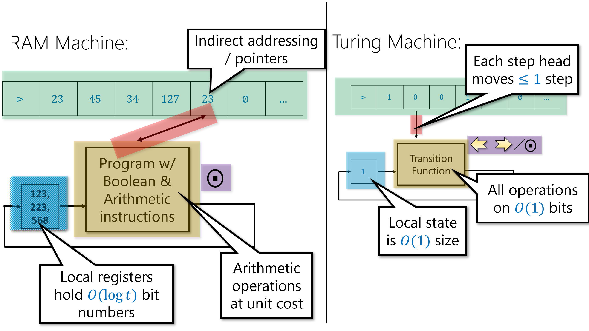

{{pic}}{fig:ramvsturing} RAM机包含有限数量的局部寄存器(每个寄存器保存一个整数)和一个无界的内存数组. 它可以对寄存器执行算术运算, 还可以将内存中由寄存器$r'$中的数字索引的地址的内容加载到寄存器$r$中. 
```

RAM机可以执行的操作包括: 

- **数据移动**:  将内存中某个单元的数据加载到寄存器中, 或将寄存器的内容存储到内存的某个单元. RAM机可以直接访问内存的任何单元, 而无需像图灵机那样将"磁头"移动到该位置. 也就是说, RAM机可以在一步中将由寄存器$r_j$索引的内存单元的内容加载到寄存器$r_i$中, 或将寄存器$r_i$的内容存储到由寄存器$r_j$索引的内存单元中. 
- **计算**:  RAM机可以对寄存器执行计算, 例如算术运算、逻辑运算和比较. 
- **控制流**:  与图灵机一样, 接下来执行什么指令的选择可以取决于RAM机的状态, 这由其寄存器的内容捕获. 

```admonish pic id="rammachinefig"
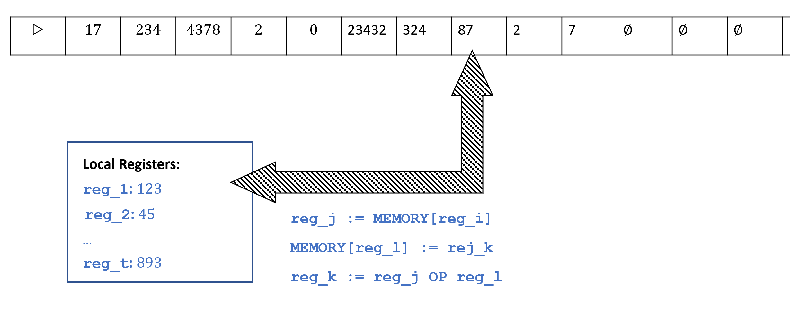

{{pic}}{fig:rammachine} RAM机和图灵机的不同方面. RAM机可以在其局部寄存器中存储整数, 并且可以读取和写入由其寄存器指定的内存位置. 相比之下, 图灵机只能访问其磁头位置的内存, 且磁头在每一步最多只能向右或向左移动一个位置.
```

我们不会给出RAM机的正式定义, 但参考文献部分([第8.10节](#810-参考文献))包含了这些定义的来源. 正如NAND-TM编程语言模拟图灵机一样, 我们也可以定义一种模拟RAM机的**NAND-RAM编程语言**. NAND-RAM编程语言通过添加以下特性扩展了NAND-TM: 

- NAND-RAM的变量允许是(非负)**整数值**的, 而不仅仅是NAND-TM中的布尔值. 也就是说, 标量变量`foo`保存的是$\N$中的非负整数(而不仅仅是$\{0,1\}$中的一位), 数组变量`Bar`保存的是一个整数数组. 与RAM机的情况一样, 我们不允许无界大小的整数. 具体来说, 每个变量保存一个介于$0$和$T-1$之间的数字, 其中$T$是程序到目前为止已执行的步骤数. (你现在可以忽略此限制: 如果我们想要保存更大的数字, 可以简单地执行虚拟指令；这在后面的章节中会有用)
- 我们允许对数组进行**索引访问**. 如果`foo`是标量而`Bar`是数组, 则`Bar[foo]`引用由`foo`的值索引的`Bar`的位置. (注意这意味着我们不再需要特殊的索引变量`i`)
- 正如编程语言中常见的情况, 我们假设对于布尔运算(如`NAND`), 零值整数被视为**假**, 非零值整数被视为**真**. 
- 除了`NAND`之外, NAND-RAM还包括所有基本的算术运算: 加、减、乘、(整数)除, 以及比较(等于、大于、小于等). 
- NAND-RAM将条件语句`if`/`then`作为语言的一部分. 
- NAND-RAM包含循环结构, 例如`while`和`do`, 作为语言的一部分. 

NAND-RAM编程语言的完整描述见[附录](http://tiny.cc/introtcsappendix). 然而, 关于NAND-RAM你需要了解的最重要的事实是你实际上并不需要太多了解NAND-RAM, 因为它在能力上等同于图灵机: 

```admonish quote title=""
{{thmc}}{thm:RAMTMequivalencethm}(图灵机(即 NAND-TM 程序)与 RAM 机(即 NAND-RAM 程序)的等价性)

对于每个函数 $F:\{0,1\}^* \rightarrow \{0,1\}^*$, $F$ 可由 NAND-TM 程序计算, 当且仅当 $F$ 可由 NAND-RAM 程序计算. 
```

由于NAND-TM程序等价于图灵机, 而NAND-RAM程序等价于RAM机, {{ref:thm:RAMTMequivalencethm}}表明所有这四种模型彼此之间是等价的. 

```admonish pic id="nandramproofoverviewfig"
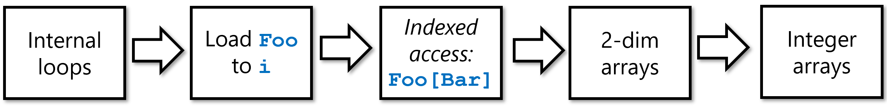

{{pic}}{fig:nandramproofoverview} 使用NAND-TM模拟NAND-RAM的{{ref:thm:RAMTMequivalencethm}}证明步骤概览. 我们首先使用[7.4.1节]()中的内部循环语法糖, 使得能够将整数从数组加载到NAND-TM的索引变量`i`. 一旦我们能这样做, 我们就可以在NAND-TM中模拟索引访问. 然后, 我们利用$\N^2$到$\N$的嵌入, 在NAND-TM中模拟二维位数组. 最后, 我们使用二进制表示将整数的一维数组编码为位的二维数组, 从而完成使用NAND-TM对NAND-RAM的模拟.
```

```admonish tip collapsible=true title="{{ref:thm:RAMTMequivalencethm}}的证明思路"
显然, NAND-RAM只会比NAND-TM更强大, 因此如果一个函数$F$可由NAND-TM程序计算, 那么它也能由NAND-RAM程序计算. 具有挑战性的方向是将NAND-RAM程序$P$转换为等价的NAND-TM程序$Q$. 要完整描述这个证明, 我们需要涵盖NAND-RAM语言的完整形式化规范, 并展示如何将其每一个特性实现为NAND-TM之上的语法糖. 

这可以做到, 但详细检查所有操作相当繁琐. 因此, 我们将着重描述此转换背后的主要思想. (另见{{ref:fig:nandramproofoverview}})NAND-RAM在两个方面推广了NAND-TM: **(a)** 增加了对数组的索引访问(即`Foo[bar]`语法), 以及 **(b)** 从布尔值变量过渡到整数值变量. 该转换有两个步骤: 
1. **位数组的索引访问**:  我们首先展示如何处理 **(a)**. 即, 我们展示如何在NAND-TM中实现操作`Setindex(Bar)`, 使得如果`Bar`是编码了某个整数$j$的数组, 则在执行`Setindex(Bar)`后, `i`的值将等于$j$. 这将允许我们通过`Setindex(Bar)`后跟`Foo[i]`来模拟`Foo[Bar]`这种形式的语法. 
2. **二维位数组**:  接着, 我们展示如何使用"语法糖"来为NAND-TM增加**二维数组**的功能. 即, 拥有**两个索引**`i`和`j`以及**二维数组**, 使得我们可以使用语法`Foo[i][j]`来访问`Foo`的(`i`,`j`)位置. 
3. **整数数组**:  最后, 我们将一个**整数**的一维数组`Arr`编码为一个**位**的二维数组`Arrbin`. 思路很简单: 如果$a_{i,0},\ldots,a_{i,\ell}$是`Arr[`$i$`]`的一个二进制(无前缀)表示, 那么`Arrbin[`$i$`][`$j$`]`将等于$a_{i,j}$. 

一旦我们有了整数数组, 我们就可以使用我们常用的函数语法糖、`GOTO`等来实现NAND-RAM的算术和控制流操作. 
```

上述方法并非获得{{ref:thm:RAMTMequivalencethm}}证明的唯一途径, 例如可参见[练习8.1](). 

```admonish note title="备注8.2: RAM机/NAND-RAM与汇编语言(可选)" id="NANDRAMassembly"
RAM机与现实中的微处理器(例如Intel x86系列中的那些)非常对应, 这些微处理器也包含一个大的**主内存**和数量固定的少量寄存器. 这当然并非偶然: 与图灵机相比, RAM机旨在更贴近地模拟实际计算系统的体系结构, 这种体系结构在很大程度上遵循了 ([von Neumann, 1945](https://scholar.google.com/scholar?hl=en&q=von+Neumann+First+Draft+of+a+Report+on+the+EDVAC)) 报告中描述的所谓[冯·诺依曼架构](https://en.wikipedia.org/wiki/Von_Neumann_architecture). 
因此, NAND-RAM在其大致轮廓上类似于x86或NIPS等汇编语言. 这些汇编语言都具有以下指令: **(1)** 将数据从寄存器移动到内存, **(2)** 对寄存器执行算术或逻辑计算, 以及 **(3)** 条件执行和循环(在汇编语言语境中通常称为"分支"和"跳转"的"if"和"goto"). 

RAM机与实际微处理器之间的主要区别(相应地, 也是NAND-RAM与汇编语言之间的主要区别)在于, 实际微处理器具有固定的字长$w$, 因此所有寄存器和内存单元保存的都是$[2^w]$中的数字(或等价地, $\{0,1\}^w$中的字符串). 这个数字$w$在不同的处理器中可能不同, 但常见的值要么是$32$, 要么是$64$. 作为理论模型, RAM机没有这个限制, 我们反而让$w$作为我们运行时间的对数(这也大致对应于其在实践中的值). 现实中的微处理器也具有固定数量的寄存器(例如, x86-64中有14个通用寄存器), 但这与RAM机相比差别不大. 可以证明, 只有两个寄存器的RAM机与拥有任意大的常数数量寄存器的完整RAM机具有同等能力. 

当然, 现实中的微处理器也具有许多RAM机所不具备的特性, 包括并行性、内存层次结构以及许多其他特性. 然而, RAM机确实在初步近似下捕捉了实际计算机的特征, 因此(正如我们将看到的), 算法在RAM机上的运行时间(例如, $O(n)$对比$O(n^2)$)与其实际运行的效率高度相关. 
```

## 8.2 具体细节(可选) { #nandtmgorydetailssec  }

我们将不展示{{ref:thm:RAMTMequivalencethm}}的完整形式化证明, 而是聚焦于最重要的部分: 实现索引访问, 以及用一维数组模拟二维数组. 即便如此, 描述这些部分也已经相当繁琐, 这对于任何写过编译器的人都不足为奇. 因此, 你可以随意略读本节. 重点不在于记住所有细节, 而在于明白**原则上**将一个NAND-RAM程序转换为等价的NAND-TM程序是**可能**的, **你**自己如果想做也能完成. 

### 8.2.1 NAND-TM中的索引访问

在NAND-TM中, 我们只能访问数组在索引变量`i`位置处的元素, 而NAND-RAM拥有整数值变量, 并能使用它们对数组进行**索引访问**, 写作`Foo[bar]`. 为了在NAND-TM中实现索引访问, 我们将使用某种无前缀编码(参见[2.5.2节](./chapter_2.md#前缀无歧义编码))在数组中编码整数, 然后提供一个过程`Setindex(Bar)`来将`i`设置为`Bar`编码的值. 我们可以通过先执行`Setindex(Bar)`再执行`Foo[i]`来模拟`Foo[Bar]`的效果. 

`Setindex(Bar)`的实现可以通过以下方式完成: 

1. 初始化一个数组`Atzero`, 使得`Atzero[`$0$`]`$=1$并且对所有$j>0$, `Atzero[`$j$`]`$=0$. (这可以在NAND-TM中轻松完成, 因为所有未初始化的变量默认值为零)
2. 通过递减`i`直到达到`Atzero[i]`$=1$的点来将`i`设置为零. 
3. 令`Temp`为一个编码数字$0$的数组. 
4. 我们使用`GOTO`来模拟一个内部循环, 形式如下: 当`Temp`$\neq$`Bar`时, 递增`Temp`. 
5. 在循环结束时, `i`等于由`Bar`编码的值. 

在NAND-TM代码中(使用一些语法糖), 我们可以按如下方式实现上述操作: 

```python
# 假设Atzero是一个数组, 满足Atzero[0]=1
# 且对所有j>0, Atzero[j]=0

# 将i设置为0. 
LABEL("zero_idx")
dir0 = zero
dir1 = one
# 对应i <- i-1
GOTO("zero_idx",NOT(Atzero[i]))
...
# 将temp清零
#(下面的代码假设使用一种特定的无前缀编码, 其中10是"结束标记")
Temp[0] = 1
Temp[1] = 0
# 将i设置为Bar, 假设我们知道如何递增和比较
LABEL("increment_temp")
cond = EQUAL(Temp,Bar)
dir0 = one
dir1 = one
# 对应i <- i+1
INC(Temp)
GOTO("increment_temp",cond)
# 如果执行到这里, i就是Bar所编码的数字
...
# 程序的最终指令
MODANDJUMP(dir0,dir1)
```

### 8.2.2 NAND-TM中的二维数组

为了实现二维数组, 我们希望将它们嵌入到一个一维数组中. 思路是通过一个**一一对应**的函数$\text{embed}:\N\times\N\to\N$, 从而将二维数组`Two`中的位置$(i,j)$嵌入到一维数组`One`的位置$\text{embed}(i,j)$中. 

由于集合$\N\times\N$看上去"远大于"集合$\N$, 先验地来看, 这样的一个双射可能并不明显存在. 然而, 一旦你深入思考, 你就会发现构建它并不算太难. 例如, 你可以让一个孩子用剪刀和胶水将一张10英寸乘10英寸的纸转换成一条1英寸乘100英寸的纸带. 这本质上就是一个从$[10]\times [10]$到$[100]$的双射. 我们可以推广这一点, 得到一个从$[n]\times[n]$到$[n^2]$的双射, 更一般地, 得到一个从$\N\times\N$到$\N$的双射. 

具体来说, 下面的$\text{embed}$函数可以做到这一点(见{{ref:fig:pairingfunction}}): 
$$
\text{embed}(x,y)=\frac{1}{2}(x+y)(x+y+1)+x
$$

```admonish quote id="pairingfunctionfig"
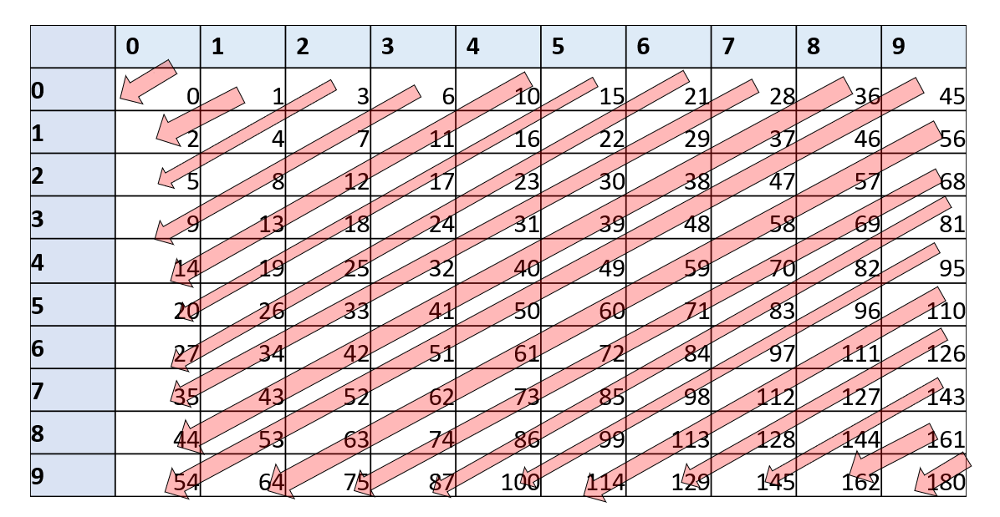

{{pic}}{fig:pairingfunction} 映射$\text{embed}(x,y)=\frac{1}{2}(x+y)(x+y+1)+x$对于$x,y\in[10]$的示意图, 可以看出对于每一对不同的$(x,y)$和$(x',y')$, 都有$\text{embed}(x,y)\ne\text{embed}(x',y')$
```

[习题8.3]()要求你证明$\text{embed}$确实是一个双射, 并且可以由一个NAND-TM程序计算. (后者可以通过简单地遵循小学所学的乘法、加法和除法算法来完成)这意味着我们可以将形式为`Two[Foo][Bar] = something`(即, 访问二维数组中由一维数组`Foo`和`Bar`编码的整数对应的位置)替换为如下形式的代码: 

```python
Blah = embed(Foo,Bar)
Setindex(Blah)
Two[i] = something
```

### 8.2.3 其他细节

一旦我们有了二维数组和索引访问, 用NAND-TM模拟NAND-RAM就只是在NAND-TM中实现算术运算和比较的标准算法的问题了. 虽然这很繁琐, 但并不困难, 最终的结果表明每个NAND-RAM程序$P$都可以被一个等价的NAND-TM程序$Q$模拟, 从而完成了{{ref:thm:RAMTMequivalencethm}}的证明. 

```admonish note title="备注8.3: NAND-RAM中的递归(进阶)" id="recursion"
**递归**是许多编程语言中都出现的一个概念, 但我们没有将其包含在NAND-RAM程序中. 然而, 递归(以及一般的函数调用)可以在NAND-RAM中使用[栈数据结构](https://goo.gl/JweMj)来实现. **栈**是一种包含一系列元素的数据结构, 我们可以按照"后进先出"的顺序向其中"压入"元素和从中"弹出"元素. 

我们可以使用一个整数数组`Stack`和一个标量变量`stackpointer`(表示栈中的项目数量)来实现一个栈. 我们通过以下方式实现`push(foo)`: 

~~~python
Stack[stackpointer]=foo
stackpointer += one
~~~

并通过以下方式实现`bar = pop()`: 

~~~python
bar = Stack[stackpointer]
stackpointer -= one
~~~

我们通过将$F$的参数压入栈中来实现对$F$的函数调用. $F$的代码将从栈中"弹出"参数, 执行计算(可能涉及进行递归或非递归调用), 然后将其返回值"压入"栈中. 由于栈的"后进先出"特性, 直到所有递归调用完成, 我们才会将控制权返回给调用过程. 

我们可以使用非递归语言实现递归这一事实并不令人惊讶. 实际上, **机器语言**通常不具有递归(或一般的函数调用)功能, 因此编译器使用栈和`GOTO`来实现函数调用. 你可以在网上找到关于您最喜欢的编程语言(无论是[Python](http://interactivepython.org/runestone/static/pythonds/Recursion/StackFramesImplementingRecursion.html)、[JavaScript](https://javascript.info/recursion)还是[Lisp/Scheme](https://mitpress.mit.edu/sites/default/files/sicp/full-text/sicp/book/node110.html))中如何通过栈实现递归的教程. 
```

## 8.3 图灵等价性(讨论)

```admonish pic id="fortranprogfig"


{{pic}}{fig:fortranprog} 表示一条Fortran语句的打孔卡片
```

任何标准编程语言, 如`C`、`Java`、`Python`、`Pascal`、`Fortran`, 其操作都与NAND-RAM非常相似. (事实上, 它们最终都可以由具有固定数量寄存器和大型内存阵列的机器来执行)因此, 使用{{ref:thm:RAMTMequivalencethm}}, 我们可以用NAND-TM程序来模拟任何此类编程语言中的程序. 反过来, 在任何上述编程语言中编写一个NAND-TM的解释器是一个相当简单的编程练习. 因此, 我们也可以使用这些编程语言来模拟NAND-TM程序(进而通过[定理7.11]()来模拟图灵机). 这种在计算能力上等同于图灵机/NAND-TM的特性被称为**图灵等价**(有时也称为**图灵完备**). 因此, 我们熟悉的所有编程语言都是图灵等价的. {{footnote: 一些编程语言可以访问的内存量有固定的(即使非常大)上限, 这正式地阻止了它们适用于计算无限函数并因此模拟图灵机. 我们在本次讨论中忽略此类问题, 并假定可以访问某种容量没有固定上限的存储设备. }}

### 8.3.1 "两全其美"的范式

图灵机与RAM机之间的等价性使我们能够为手头的任务选择最方便的语言: 

- 当我们想要**证明**一个关于所有程序/算法的定理时, 我们可以使用图灵机(或NAND-TM), 因为它们更简单且易于分析. 特别是, 如果我们想证明某个函数无法被计算, 那么我们将使用图灵机. 
- 当我们想要证明某个函数**可以被计算**时, 我们可以使用RAM机器或NAND-RAM, 因为它们更容易编程, 并且更接近于我们习惯的高级编程语言. 事实上, 我们通常会以非正式的方式描述NAND-RAM程序, 并相信读者能够填充细节并将简略的描述转换为精确的程序. (这就像人们通常使用非正式的或"伪代码"的算法描述方式, 并相信他们的受众知道在需要时将这些描述转换为代码一样)

我们对图灵机/NAND-TM和RAM机/NAND-RAM的使用, 与人们在实践中使用高级和低级编程语言的方式非常相似. 当人们想要制造一个执行程序的设备时, 为一种非常简单和"低级"的编程语言来实现是很方便的. 当人们想要描述一个算法时, 使用尽可能高级的形式体系是方便的. 

```admonish pic id="have_your_cake_and_eat_it_toofig"


{{pic}}{fig:have_your_cake_and_eat_it_too} 通过拥有两种等价语言NAND-TM和NAND-RAM, 我们可以"鱼与熊掌兼得": 当我们想证明程序不能做某事时, 使用NAND-TM；当我们想证明程序能做某事时, 使用NAND-RAM或其他高级语言
```

```admonish bigidea id="eatandhavecake"
{{idec}}{ide:eatandhavecake}

利用图灵机和RAM机之间的等价性, 我们可以"鱼与熊掌兼得". 

当我们想证明某事无法完成时, 可以使用更简单的模型(如图灵机)；当我们想证明某事可以完成时, 可以使用功能丰富的模型(如RAM机). 
```

### 8.3.2 浅谈抽象层次

```admonish quote
程序员处于一个独特的位置……他必须能够思考概念层次结构, 其深度是单个思维以前从未需要面对的.

*——Edsgar Dijkstra, 《论真正教授计算机科学的残酷性》, 1988年. *
```

在任何计算理论课程中的某个时刻, 教师和学生都需要进行**那次**谈话. 也就是说, 我们需要讨论描述算法时的**抽象层次**. 在算法课程中, 通常用英语描述算法{{footnote: 译者注: 在本翻译版中会使用中文}}, 假设读者能够"填充细节", 并在需要时能够将此类算法转化为实现. 例如, {{ref:alg:a81}}是广度优先搜索算法的高级描述. 

```admonish quote title=""
{{algc}}{alg:a81}[广度优先搜索]
$$
\begin{aligned}
&\mathbf{Input: }图G, 顶点u,v\\
&\mathbf{Output: }当u与v在图中联通时, 返回"\text{connected}", 否则返回"\text{disconnected}"\\
&初始化一个空队列Q\\
&将u放入Q中\\
&\textbf{while}\{Q不为空\}\\
&\quad 将队列顶部的顶点w从Q中移除\\
&\quad\textbf{if}\{w=v\}\textbf{ return }\text{connected}\textbf{ endif}\\
&\quad 标记w\\
&\quad 将w的所有未被标记的邻居加入Q\\
&\textbf{endwhile}\\
&\textbf{return }\text{disconnected}
\end{aligned}
$$
```

如果我们想提供关于如何在Python或C(或NAND-RAM/NAND-TM)等编程语言中实现广度优先搜索的更多细节, 我们会描述如何用数组实现队列数据结构, 以及同样如何用数组标记顶点. 我们称这种"中间层次"的描述为**实现级别**(implementation level)或**伪代码**描述. 最后, 如果我们想精确地描述实现, 我们会给出程序的全部代码(或另一个完全精确的表示形式, 例如元组列表的形式). 我们称之为**形式化**或**低级**(low level)描述. 

```admonish pic id="levelsofdescriptionfig"
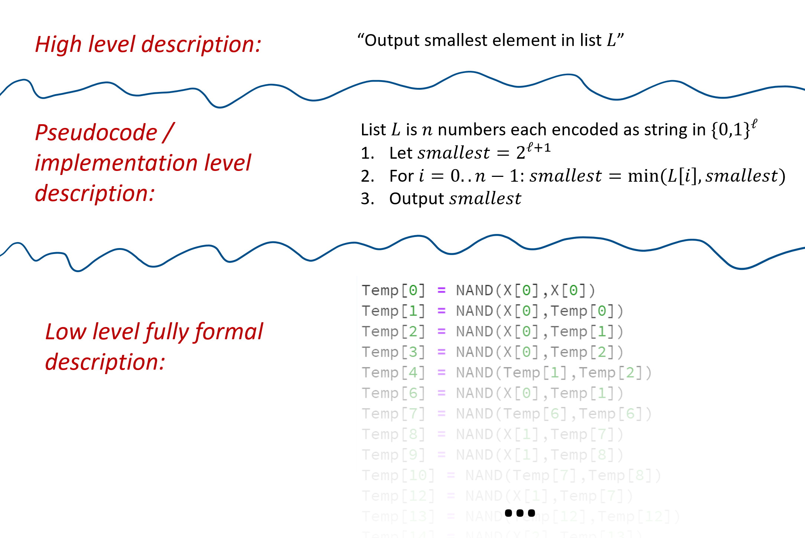

{{pic}}{fig:levelsofdescription} 我们可以用不同的粒度/细节和精确度级别来描述一个算法. 在最高级别, 我们只用文字描述想法, 省略所有关于表示和实现的细节. 在中间级别(也称为实现或伪代码), 我们提供足够的实现细节, 使他人能够推导出它, 但我们仍然不提供完整代码. 最低级别是实际代码或数学描述被完整阐述的地方. 这些不同的细节层次都有其用途, 在它们之间转换是计算机科学家最重要的技能之一
```

虽然我们开始时是在完全形式化的层面上描述NAND-CIRC、NAND-TM和NAND-RAM程序, 随着本书的深入, 我们将转向实现级别和高级别的描述. 毕竟, 我们的目标不是使用这些模型进行实际计算, 而是分析计算的一般现象. 也就是说, 如果你不理解高级描述如何转化为实际实现, "深入底层"通常是一个极好的练习. 计算机科学家最重要的技能之一就是能够在抽象层次结构中上下移动. 

类似的区别也适用于将对象表示为字符串的概念. 有时, 为了精确起见, 我们会给出一个**低级规范**(low level specification), 确切说明一个对象如何映射到二进制字符串. 例如, 我们可能将$n$个顶点的图的编码描述为长度为$n^2$的二进制字符串, 通过说明我们将顶点集为$[n]$的图$G$映射到字符串$x\in \{0,1\}^{n^2}$, 其中$x$的第$n\cdot i + j$个坐标是$1$当且仅当边$\overrightarrow{i ; j}$存在于$G$中. 我们也可以使用**中间**或**实现**级别的描述, 只需简单说明我们使用邻接矩阵表示法来表示图. 

最后, 因为图(以及一般对象)的各种表示之间的转换可以通过NAND-RAM(因此也可以通过NAND-TM)程序完成, 所以在进行高级别讨论时, 我们也会避免关于表示的讨论. 例如, 图连通性是一个可计算函数, 这一事实无论我们是用邻接表、邻接矩阵、边对列表等表示图都是成立的. 因此, 在精确表示无关紧要的情况下, 我们通常会谈论我们的算法将对象$X$(可以是图、向量、程序等)作为输入, 而不指定$X$如何被编码为字符串. 

**定义"算法"**: 到目前为止, 我们一直非正式地使用"算法"这个术语. 然而, 图灵机和一系列等效模型产生了一种精确且形式化地定义算法的方法. 因此, 在本书中, 每当我们提到算法时, 我们指的是它是图灵等效模型(如图灵机、NAND-TM、RAM机等)中的一个实例. 由于所有这些模型的等价性, 在许多情况下, 我们使用哪一个并不重要. 

### 8.3.3 图灵完备性与等价性的形式化定义(可选) {#turingcompletesec }

一个**计算模型**是某种定义**程序**(由字符串表示)计算(部分)函数的方式. 一个**计算模型**$\mathcal{M}$是**图灵完备**的, 如果我们可以将每个图灵机(或等价的NAND-TM程序)$N$映射到$\mathcal{M}$中的一个程序$P$, 使得$P$计算与$N$相同的函数. 它是**图灵等价**的, 如果另一个方向也成立(即, 我们可以将$\mathcal{M}$中的每个程序映射到一个计算相同函数的图灵机). 我们可以形式化地定义这个概念如下. (这个形式化定义对于本书的其余部分并不关键, 只要你理解图灵等价的一般概念就可以跳过它；这个概念在文献中有时被称为[哥德尔数](https://goo.gl/rzuNPu)(Gödel numbering)或[可接纳数](https://goo.gl/xXJoUG)(admissible numbering))

```admonish quote title=""
{{defc}}{def:turingcompletedef}[图灵完备性与等价性(可选)]

令$\mathcal{F}$为所有从$\{0,1\}^*$到$\{0,1\}^*$的部分函数的集合. 一个**计算模型**是一个映射$\mathcal{M}:\{0,1\}^* \rightarrow \mathcal{F}$. 

我们说一个程序$P \in \{0,1\}^*$ $\mathcal{M}$-**计算**一个函数$F\in \mathcal{F}$, 如果$\mathcal{M}(P) = F$. 

一个计算模型$\mathcal{M}$是**图灵完备**的, 如果存在一个可计算映射$ENCODE_{\mathcal{M}}:\{0,1\}^*\rightarrow\{0,1\}^*$, 使得对于每个图灵机$N$(表示为字符串), $\mathcal{M}(ENCODE_{\mathcal{M}}(N))$等于由$N$计算的部分函数. 

一个计算模型$\mathcal{M}$是**图灵等价**的, 如果它是图灵完备的, 并且存在一个可计算映射$DECODE_{\mathcal{M}}:\{0,1\}^*\rightarrow\{0,1\}^*$, 使得对于每个字符串$P\in \{0,1\}^*$, $N=DECODE_{\mathcal{M}}(P)$是一个计算函数$\mathcal{M}(P)$的图灵机的字符串表示. 
```

一些图灵等价模型的例子(其中一些我们已经见过, 一些将在下面讨论)包括: 

- 图灵机
- NAND-TM程序
- NAND-RAM程序
- λ演算
- 生命游戏(将程序和输入/输出映射到起始和结束格局)
- 编程语言, 如Python/C/Javascript/OCaml...(允许无限存储)

## 8.4 元胞自动机 {#cellularautomatasec }

许多物理系统可以被描述为由大量相互作用的基元组件组成. 一种模拟此类系统的方法是使用**元胞自动机**. 这是一个由大量(甚至无限)细胞组成的系统. 每个细胞只有有限个可能的状态. 在每个时间步, 细胞通过将某个简单规则应用于自身及其邻居的状态来更新到新状态. 

```admonish pic id="conwaysgridsfig"
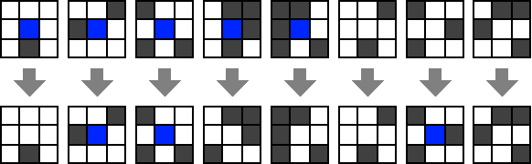

{{pic}}{fig:conwaysgrids} 康威生命游戏的规则. 图片来自[此博客文章](https://mblogscode.wordpress.com/2017/06/07/python-simulation-coding-conways-game-of-life/)
```

元胞自动机的一个典型例子是[康威的生命游戏](https://en.wikipedia.org/wiki/Conway%27s_Game_of_Life)(Conway's Game of Life). 在此自动机中, 细胞排列在一个无限二维网格中. 每个细胞只有两种状态: "死亡"(我们可以编码为$0$并标识为$\varnothing$)或"存活"(我们可以编码为$1$). 细胞的下一个状态取决于其先前状态及其8个垂直、水平和对角线邻居的状态(参见{{ref:fig:conwaysgrids}}). 死亡细胞只有在恰好有三个存活邻居时才会变为存活. 存活细胞只有在有两个或三个存活邻居时继续存活. 尽管细胞数量可能无限, 但我们可以通过仅跟踪存活细胞来使用有限长度字符串编码状态. 如果我们在具有有限数量存活细胞的格局中初始化系统, 那么在所有未来步骤中存活细胞的数量将保持有限. 生命游戏的[维基百科页面](https://en.wikipedia.org/wiki/Conway%27s_Game_of_Life)上有一些产生非常有趣演化的格局的美丽图形和动画. 

```admonish pic id="onetwodimensionalcafig"
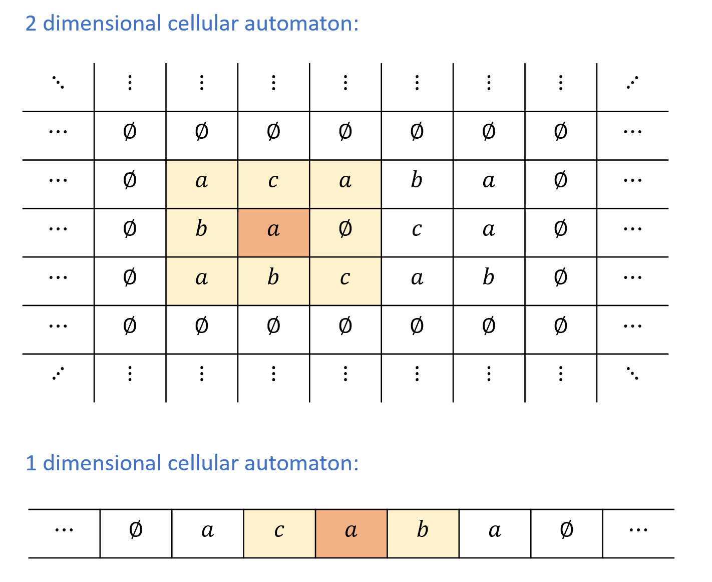

{{pic}}{fig:onetwodimensionalca} 在二维元胞自动机中, 每个细胞位于某个整数$i,j \in \Z$的位置$i,j$上. 细胞的状态是某个值$A_{i,j} \in \Sigma$, 其中$\Sigma$是某个有限字母表. 在给定时间步, 细胞的状态根据应用于$(i,j)$及其所有邻居$(i \pm 1, j\pm 1)$状态的某个函数进行调整. 在一维元胞自动机中, 每个细胞位于位置$i\in \Z$上, 且$i$在下一个时间步的状态$A_i$取决于其当前状态及其两个邻居$i-1$和$i+1$的状态
```

由于生命游戏中的细胞排列在无限二维网格中, 它是二维元胞自动机的一个例子. 我们也可以考虑**一维元胞自动机**的更简单设置, 其中细胞排列在一条无限直线上, 参见{{ref:fig:onetwodimensionalca}}. 事实证明, 即使这个简单模型也足以实现图灵完备性. 我们现在将正式定义一维元胞自动机, 然后证明它们的图灵完备性. 

```admonish quote title=""
{{defc}}{def:cellautomatadef}[一维元胞自动机]

设$\Sigma$是一个包含符号$\varnothing$的有限集合. 一个在字母表$\Sigma$上的**一维元胞自动机**由一个**转移规则**$r:\Sigma^3 \rightarrow \Sigma$描述, 该规则满足$r(\varnothing,\varnothing,\varnothing) = \varnothing$. 

自动机$r$的一个**格局**(configuration)是一个函数$A:\Z \rightarrow \Sigma$. 如果具有规则$r$的自动机处于格局$A$, 那么它的下一个格局, 记为$A' = NEXT_r(A)$, 是函数$A'$, 使得对于每个$i\in \Z$, 有$A'(i) = r(A(i-1),A(i),A(i+1))$. 换句话说, 自动机$r$在点$i$的下一个状态是通过将规则$r$应用于$A$在$i$及其两个邻居的值得到的. 
```

**有限格局**: 如果自动机$r$的格局中只有有限个索引$i_0,\ldots,i_{j-1}$在$\Z$中使得$A(i_j) \neq \varnothing$, 则我们称该格局是_有限的_. (即, 对于每个$i \not\in { i_0, \ldots, i_{j-1}}$, 有$A(i)=\varnothing$)这样的格局可以使用一个有限字符串表示, 该字符串编码索引$i_0,\ldots,i_{n-1}$和值$A(i_0),\ldots,A(i_{n-1})$. 由于$r(\varnothing,\varnothing,\varnothing)=\varnothing$, 如果$A$是有限格局, 则$NEXT_r(A)$也是有限的. 我们只关心在有限格局中初始化的元胞自动机, 因此在其整个演化过程中保持有限格局. 

### 8.4.1 一维元胞自动机的图灵完备性

我们可以编写一个程序(例如使用NAND-RAM)来模拟任何元胞自动机从初始有限格局的演化, 只需存储状态不等于$\varnothing$的细胞值并重复应用规则$r$. 因此, 元胞自动机可以被图灵机模拟. 更令人惊讶的是, 反过来也成立. 例如, 尽管其规则简单, 我们可以使用生命游戏模拟图灵机(参见{{ref:fig:turinggol}}). 

```admonish pic id="turinggolfig"


{{pic}}{fig:turinggol} 模拟图灵机的生命游戏格局. 图片由[Paul Rendell](http://rendell-attic.org/gol/tm.htm)提供
```

事实上, 即使一维元胞自动机也可以是图灵完备的: 

```admonish quote title=""
{{thmc}}{thm:onedimcathm}[一维自动机是图灵完备的]

对于每个图灵机$M$, 存在一个一维元胞自动机, 可以在每个输入$x$上模拟$M$. 
```

为了使"模拟图灵机"的概念更精确, 我们需要定义图灵机的**格局**. 我们将在下面的[8.4.2节](#842-图灵机格局与状态转移函数)中这样做, 但高层面上, 图灵机的**格局**是一个字符串, 编码了其在计算中给定步骤的完整状态. 即, 其磁带所有(非空)单元的内容、其当前状态以及磁头位置. 

{{ref:thm:onedimcathm}}的证明的关键思想是, 在图灵机$M$的计算中的每个点, $M$的磁带中唯一能改变的单元是磁头所在的位置, 并且该单元改变的值是其当前状态和$M$的有限状态的函数. 这一观察使我们能够将图灵机$M$的格局编码为一个元胞自动机$r$的有限格局, 并确保此编码格局在$r$的规则下的一步演化对应于图灵机$M$执行中的一步. 

### 8.4.2 图灵机格局与状态转移函数 {#turingmachinesconfigsec }

为了将上述思想转化为{{ref:thm:onedimcathm}}的严格证明(甚至陈述! ), 我们需要精确定义图灵机的**格局**这一概念. 这个概念在后续章节中对我们也有用. 

```admonish pic id="turingmachineconffig"
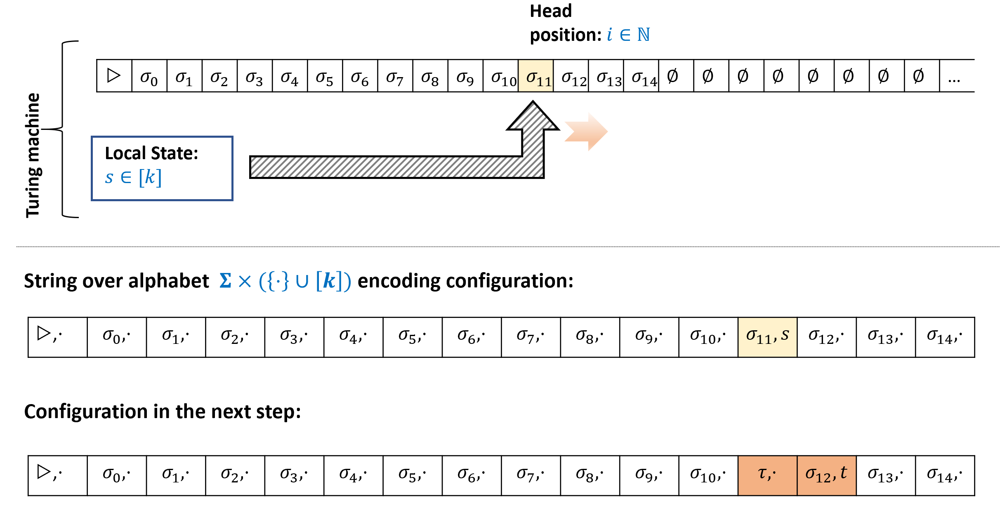

{{pic}}{fig:turingmachineconf} 具有字母表$\Sigma$和状态空间$[k]$的图灵机$M$的_格局_将其在执行中特定步骤的状态编码为一个在字母表$\overline{\Sigma} = \Sigma \times ({\cdot } \cup [k])$上的字符串$\alpha$. 字符串的长度为$t$, 其中$t$满足$M$的磁带在所有位置$t$及更大处包含$\varnothing$, 且$M$的磁头位于小于$t$的位置. 如果$M$的磁头在第$i$个位置, 那么对于$j \neq i$, $\alpha_j$编码$M$磁带的第$j$个单元的值, 而$\alpha_i$编码此值以及$M$的当前状态. 如果机器写入值$\tau$, 更改状态为$t$, 并向右移动, 那么在下一个格局中, 位置$i$将包含值$(\tau,\cdot)$, 位置$i+1$将包含值$(\alpha_{i+1},t)$
```

```admonish quote title=""
{{defc}}{def:configtmdef}(图灵机的格局)

设$M$是一个具有磁带字母表$\Sigma$和状态空间$[k]$的图灵机. $M$的一个**格局**是一个字符串$\alpha \in \overline{\Sigma}^*$, 其中$\overline{\Sigma} = \Sigma \times \left( {\cdot} \cup [k] \right)$, 满足存在恰好一个坐标$i$, 使得对于某个$\sigma \in \Sigma$和$s\in [k]$, 有$\alpha_i = (\sigma,s)$. 对于所有其他坐标$j$, $\alpha_j = (\sigma',\cdot)$, 其中$\sigma'\in \Sigma$. 

$M$的格局$\alpha \in \overline{\Sigma}^*$对应于其执行的以下状态: 

- $M$的磁带对于所有$j<|\alpha|$包含$\alpha_{j,0}$, 对于所有至少为$|\alpha|$的位置包含$\varnothing$, 其中我们令$\alpha_{j,0}$为值$\sigma$, 使得$\alpha_j = (\sigma,t)$, 其中$\sigma \in \Sigma$且$t \in {\cdot } \cup [k]$. (换句话说, 由于$\alpha_j$是一个字母表符号$\sigma$和一个$[k]$中的状态或符号$\cdot$的对, $\alpha_{j,0}$是这个对的第一个分量$\sigma$)
- $M$的磁头位于唯一位置$i$, 其中$\alpha_i$具有形式$(\sigma,s)$, $s\in [k]$, 且$M$的状态等于$s$. 
```

```admonish pause title = "暂停一下"
{{ref:def:configtmdef}}有一些技术细节, 但实际上并不深奥或复杂. 尝试花点时间停下来思考**你**如何将图灵机在执行中给定点的状态编码为一个字符串. 

思考你需要知道哪些组件才能从此点继续执行, 以及使用有限符号列表编码它们的简单方法是什么. 特别是, 考虑到我们未来的应用, 尝试思考一种编码, 使得将步骤$t$的格局映射到步骤$t+1$的格局尽可能简单. 
```

{{ref:def:configtmdef}}有点繁琐, 但无论怎么讲格局只是一个字符串, 编码了图灵机在执行中给定点的**快照**. (用操作系统术语, 它是一个"核心转储"(core dump))这样的快照需要编码以下组件: 

1. 当前磁头位置. 
2. 大容量存储器的完整内容, 即磁带. 
3. "本地寄存器"的内容, 即机器的状态. 

我们如何编码格局的精确细节并不重要, 但我们确实想记录以下简单事实: 

```admonish quote title=""
{{lemc}}{lem:nextstepfunctionlem}

设$M$是一个图灵机, 令$NEXT_M:\overline{\Sigma}^* \rightarrow \overline{\Sigma}^*$是将$M$的格局映射到执行下一步格局的函数. 那么对于每个$i \in \N$, $NEXT_M(\alpha)i$的值仅依赖于坐标$\alpha_{i-1},\alpha_i,\alpha_{i+1}$. 
```

(为简化记号, 上面我们使用约定: 如果$i$"越界", 例如$i<0$或$i>|\alpha|$, 则我们假设$\alpha_i = (\varnothing,\cdot)$)我们将{{ref:lem:nextstepfunctionlem}}的证明留作[练习8.7](). 证明背后的思想很简单: 如果磁头既不在位置$i$, 也不在位置$i-1$和$i+1$, 那么$i$处的下一步格局将与之前相同. 否则, 我们可以从$i$或其邻居的格局中"读取"图灵机的状态和磁头位置的磁带值, 并用其更新$i$处的新状态应该是什么. 完成完整证明并不难, 但这样做是确保你熟悉格局定义的好方法. 

**完成{{ref:thm:onedimcathm}}的证明**: 我们现在可以更正式地重述{{ref:thm:onedimcathm}}, 并完成其证明: 

```admonish quote title=""
{{thmc}}{thm:RAMTMequivalencethm0}(一维自动机是图灵完备的(形式化陈述))

对于每个图灵机$M$, 如果我们用$\overline{\Sigma}$表示其格局字符串的字母表, 那么存在一个在字母表$\overline{\Sigma}^*$上的一维元胞自动机$r$, 使得
$$
NEXT_M(\alpha)=NEXT_r(\alpha)
$$
对于$M$的每个格局$\alpha \in \overline{\Sigma}^*$(再次使用约定: 如果$i$"越界", 则我们考虑$\alpha_i=\varnothing$). 
```

```admonish proof collapsible=true title="{{ref:thm:RAMTMequivalencethm0}}证明"
我们将$\overline{\Sigma}$的元素$(\varnothing,\cdot)$对应于自动机$r$的$\varnothing$元素. 在这种情况下, 由{{ref:lem:nextstepfunctionlem}}, 将$M$的格局映射到下一个格局的函数$NEXT_M$实际上是一维自动机的有效规则. 
```

从{{ref:thm:RAMTMequivalencethm0}}的证明中产生的自动机具有大的字母表, 而且其大小依赖于被模拟的机器$M$. 事实证明, 人们可以获得一个具有固定大小字母表的自动机, 该字母表独立于被模拟的程序, 实际上自动机的字母表可以是最小集合$\{0,1\}$! {{ref:fig:rule110big}}展示了这样的一个图灵完备的自动机. 

```admonish quote id="rule110bigfig"


{{pic}}{fig:rule110big} 一维自动机的演化. 图中的每一行对应一个格局. 初始格局对应顶行, 仅包含一个"存活"细胞. 此图对应Stephen Wolfram的"规则110"自动机, 它是图灵完备的. 图片取自[Wolfram MathWorld](http://mathworld.wolfram.com/Rule110.html)
```

```admonish note title="备注8.11: NAND-TM程序的格局" id="nandtmprogconfig"
我们可以使用与{{ref:def:configtmdef}}相同的方法来定义**NAND-TM程序**的格局. 这样的格局需要编码: 

1. 变量`i`的当前值. 
2. 对于每个标量变量`foo`, `foo`的值. 
3. 对于每个数组变量`Bar`, 值`Bar[`$j$`]`对于每个$j \in {0,\ldots, t-1}$, 其中$t-1$是指标变量`i`在计算中曾达到的最大值. 
```

## 8.5 λ演算与函数式编程语言 { #lambdacalculussec }

[λ演算](https://goo.gl/B9HwT8)是定义可计算函数的另一种方式. 它有Alonzo Church在1930年代提出, 大约与Alan Turing提出图灵机同时. 有趣的是, 尽管图灵机不用于实际计算, λ演算却催生了函数式编程语言, 如Lisp、ML和Haskell, 并间接地促进了许多其他编程语言的发展. 在本节中, 我们将介绍λ演算并展示其能力等价于NAND-TM程序(因此也等价于图灵机). 我们的[Github仓库](https://github.com/boazbk/tcscode)包含一个Jupyter Notebook, 其中有一个λ演算的Python实现, 你可以通过实验来更好地理解这个话题. 

**λ算子**: λ演算的核心是定义"匿名"函数的一种方式. 例如, 有一个函数$f$的定义为
$$
f(x)=x\times x
$$
我们可以将其写为
$$
\lambda x.x\times x
$$
因此$(\lambda x.x\times x)(7)=49$. 也就是说, 你可以将$\lambda x. exp(x)$(其中$exp$是某个表达式)视为指定匿名函数$x \mapsto exp(x)$的一种方式. 匿名函数使用$\lambda x.f(x)$、$x \mapsto f(x)$或其他密切相关的表示法, 出现在许多编程语言中. 例如, 在**Python**中我们可以使用`lambda x: x*x`来定义平方函数, 而在**JavaScript**中我们可以使用`x => x*x`或`(x) => x*x`. 在**Scheme**中我们会将其定义为`(lambda (x) (* x x))`. 显然, 函数的参数名称无关紧要, 因此$\lambda y.y\times y$与$\lambda x.x \times x$相同, 因为两者都对应平方函数. 

**省略括号**: 为了减少表示上的杂乱, 在书写λ演算表达式时我们经常省略函数求值的括号. 因此, 与其将函数$f$应用于输入$x$的结果写为$f(x)$, 我们也可以简单地写为$f\; x$. 因此我们可以写$(\lambda x.x\times x) 7=49$. 在本章中, 我们将同时使用$f(x)$和$f\; x$表示法进行函数应用. 函数求值是结合性的, 并从左到右绑定, 因此$f;g;h$与$(f g) h$相同. 

### 8.5.1 函数的高阶应用

λ演算的一个核心特性是函数都是"一等公民", 即我们可以将函数作为其他函数的参数. 比如说, 你能猜到下面这个表达式等于什么数字吗?

$$
(((\lambda f.(\lambda y.(f\; (f\; y))))(\lambda x.x\times x))\; 3) {{numeq}}{eq:lambdaexampleeq}
$$

```admonish pause title = "暂停一下"
{{eqref:eq:lambdaexampleeq}}可能看上去有点吓人, 但在你看下面的解答之前, 尝试将其分解为各个组成部分, 并一次计算一个部分. 完成这个例题将极大地有助于理解λ演算
```

让我们一步一步地计算{{eqref:eq:lambdaexampleeq}}. 尽管允许匿名函数是λ演算的优势, 但添加名称对于理解复杂表达式非常有帮助. 因此, 我们令$F=\lambda f.(\lambda y.(f\; (f\; y)))$与$g=\lambda x.x\times x$. 

因此, {{eqref:eq:lambdaexampleeq}}可以写作
$$
((F\; g)\; 3)
$$
在输入函数$f$时, $F$输出函数$\lambda y.(f\; (f\; y))$, 换而言之, $F\; f$是函数$y\mapsto f(f(y))$. 我们的函数$g$是简单的$g(x)=x^2$, 因此$(F\; g)$是将$y$映射到$(y^2)^2=y^4$的函数. 因此$((F\; g)\; 3)=3^4=81$. 

```admonish question
{{exec}}{exe:lambdaexptwoex}[λ表达式求值练习]

下面的这个λ表达式等于什么数字?

$$
((\lambda x.(\lambda y.x)) \; 2)\; 9 \;. {{numeq}}{eq:lambdaexptwoeq}
$$
```

```admonish solution collapsible=true title="对{{ref:exe:lambdaexptwoex}}的解答"
$\lambda y.x$是一个函数, 其在输入$y$时忽略其输入并返回$x$.

因此, $(\lambda x.(\lambda y.x))\; 2$的结果是函数$y\mapsto 2$(或者使用λ符号写作函数$\lambda y.2$).

因此, {{eqref:eq:lambdaexptwoeq}}等价于$(\lambda y. 2) 9 = 2$.
```

### 8.5.2 通过柯里化实现多参数函数 { #curryingsec }
在形如$\lambda x.e$的λ表达式中, 表达式$e$本身也可以包含λ运算符. 比如如下函数
$$
\lambda x. (\lambda y. x+y) {{numeq}}{eq:eqlambdaexampleone}
$$
将$x$映射到函数$y\mapsto x+y$.

特别地, 若我们使用$a$调用函数{{eqref:eq:eqlambdaexampleone}}得到某个函数$f$, 再以$b$调用$f$, 便可获得值$a+b$. 可以看出, 对应于$a\mapsto (b\mapsto a+b)$的单参数函数{{eqref:eq:eqlambdaexampleone}}亦可视为双参数函数$(a,b)\mapsto a+b$. 一般地, 我们可以使用λ表达式$\lambda x.(\lambda y.f(x,y))$来模拟双参数函数$(x,y)\mapsto f(x,y)$的效果, 这一技巧被称为[**柯里化**(Currying)](https://en.wikipedia.org/wiki/Currying). 我们将使用$\lambda x,y.e$作为$\lambda x.(\lambda y.e)$的简写形式. 若$f=\lambda x.(\lambda y.e)$, 则$(f\; a)\; b$对应于对$f\; a$进行求值后, 将所得函数作用于$b$, 从而获得将$e$中$x$出现处替换为$a$, $y$出现处替换为$b$的结果. 根据结合律, 该结果等价于$(f\; a\; b)$, 有时我们也写作$f(a,b)$.

```admonish pic id="curryingfig"
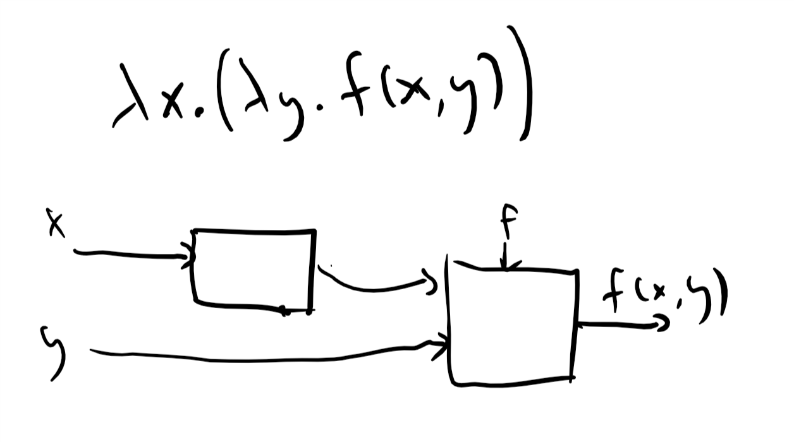

{{pic}}{fig:currying} 在"柯里化"转换中, 我们可以通过λ表达式$\lambda x.(\lambda y. f(x,y))$实现双参数函数$f(x,y)$的效果: 当输入$x$时, 该表达式会输出一个单参数函数$f_x$, 其中$x$已被"硬编码"至函数内, 且满足$f_x(y)=f(x,y)$. 这一过程可通过电路图直观展示, 详见[Chelsea Voss的网站](https://tromp.github.io/cl/diagrams.html).
```

### 8.5.3 λ演算的形式化描述
我们现在提供λ演算的形式描述. 我们从包含单个变量的"基本表达式"开始, 例如$x$或$y$, 并构建更复杂的表达式, 形为$(e\; e')$和$\lambda x.e$, 其中$e,e'$是表达式, $x$是变量标识符. 形式上, λ表达式的定义如下:
```admonish quote title=""
{{defc}}{def:lambdaexpdef}[λ表达式]

一个**λ表达式**要么是一个单独的变量标识符, 要么是以下形式之一的表达式$e$:
- **应用(Application)**: $e = (e' \; e'')$, 其中$e'$和$e''$是λ表达式.
- **抽象(Abstraction)**: $e = \lambda x.(e')$, 其中$e'$是λ表达式.
```

{{ref:def:lambdaexpdef}}是一个**递归定义**, 因为我们在λ表达式的定义中使用了其自身. 这可能起初看起来令人困惑, 但事实上你从小学起就已经知道递归定义. 考虑我们如何定义**算术表达式**: 它是一个表达式, 要么只是一个数字, 要么具有形式$(e + e')$, $(e - e')$, $(e \times e')$, 或 $(e \div e')$, 其中$e$和$e'$是其他算术表达式.

**自由变量和绑定变量**: λ表达式中的变量可以是**自由的**(free)或**绑定**(bound)到一个$\lambda$运算符(在[1.4.7节](./chapter_1.md#boundvarsec)的意义上). 在单变量λ表达式$var$中, 变量$var$是自由的. 在应用表达式$e = (e' \; e'')$中, 自由和绑定变量的集合与底层表达式$e'$和$e''$的相同. 在抽象表达式$e = \lambda var.(e')$中, $e'$中$var$的所有自由出现(free occurences)都被绑定到$e$的$\lambda$运算符. 如果你觉得自由和绑定变量的概念令人困惑, 你可以通过为所有变量使用唯一标识符来避免所有这些问题.

**优先级和括号**: 我们将使用以下规则来允许我们省略一些括号. 函数应用从左向右结合, 因此$f\; g\; h$与$(f\; g)\; h$相同. 函数应用的优先级高于λ运算符, 因此$\lambda x.f\; g\; x$与$\lambda x.((f\; g)\; x)$相同. 这类似于我们在算术运算中使用优先级规则来允许我们使用更少的括号, 比如表达式$(7 \times 3) + 2$可以写成$7\times 3 + 2$. 如[8.5.2节](#curryingsec)所述, 我们还使用简写$\lambda x,y.e$表示$\lambda x.(\lambda y.e)$, 以及简写$f(x,y)$表示$(f\; x)\; y$. 这与使用λ表达式模拟多输入函数的"柯里化"转换很好地配合.

**λ表达式的等价性**: 正如我们在{{ref:exe:lambdaexptwoex}}中看到的,规则$(\lambda x. exp)\; exp'$等价于$exp[x \rightarrow exp']$使我们能够修改λ表达式并获得更简单的**等价形式**. 另一个我们可以使用的规则是参数名称无关紧要, 因此$\lambda y.y$与$\lambda z.z$相同. 这些规则一起定义了λ表达式的**等价性**概念:

```admonish quote title=""
{{defc}}{def:lambdaequivalence}[λ表达式的等价性]

两个λ表达式是**等价的**, 如果它们可以通过重复应用以下规则变成相同的表达式:
1. **求值(即$\beta$归约)**: 表达式$(\lambda x.exp) exp'$等价于$exp[x \rightarrow exp']$.
2. **变量重命名(即$\alpha$转换)**: 表达式$\lambda x.exp$等价于$\lambda y.exp[x \rightarrow y]$.
```

如果$exp$是一个形式为$\lambda x.exp'$的λ表达式, 那么它自然对应于将任何输入$z$映射到$exp'[x \rightarrow z]$的函数. 因此, λ演算自然隐含了一个计算模型. 由于在λ演算中, 输入本身可以是函数, 我们需要决定以什么顺序求值一个表达式, 例如

$$
(\lambda x.f)(\lambda y.g\; z) {{numeq}}{eq:lambdaexpeq}
$$

对此有两种自然约定:
- **按名调用(Call-by-name, 即"惰性求值")**: 我们通过先将右侧表达式$(\lambda y.g; z)$作为输入代入左侧函数来求值{{eqref:eq:lambdaexpeq}}, 得到$f[x \rightarrow (\lambda y.g; z)]$然后从此继续.
- **按值调用(Call-by-value, 即"立即求值")**: 我们先对右侧进行求值并得到$h=g[y \rightarrow z]$, 然后将其代入左侧得到$f[x \rightarrow h]$来求值{{eqref:eq:lambdaexpeq}}.
- 
因为λ演算只有**纯**函数, 没有"副作用", 所以在许多情况下顺序无关紧要. 事实上, 可以证明如果我们在两种策略中都得到一个确定的不可约表达式(irreducible expression)(例如, 一个数字), 那么它将是同一个. 然而, 为具体起见, 我们将始终使用"按名调用"(即惰性求值)顺序. (编程语言Haskell也做出了相同的选择, 尽管许多其他编程语言使用立即求值)形式上, 使用"按名调用"求值λ表达式的过程由以下过程描述:

```admonish quote title=""
{{defc}}{def:simplifylambdadef}[λ表达式的简化]

令$e$为一个λ表达式. $e$的**简化**是以下递归过程的结果:
1. 如果$e$是一个单独变量$x$, 那么$e$的简化是$e$.
2. 如果$e$具有形式$e= \lambda x.e'$, 那么$e$的简化是$\lambda x.f'$其中$f'$是$e'$的简化.
3. **求值/$\beta$归约**: 如果$e$具有形式 $e=(\lambda x.e' \; e'')$, 那么$e$的简化是$e'[x \rightarrow e'']$的简化,这表示将$e'$中绑定到$\lambda$运算符的所有$x$的出现替换为$e''$.
4. **重命名/$\alpha$转换**: $e$的**规范简化**(canonical simplification)通过取$e$的简化并重命名变量得到, 使得表达式中的第一个绑定变量是$v_0$, 第二个是$v_1$, 依此类推.

我们说两个λ表达式$e$和$e'$是**等价的**, 记为$e \cong e'$, 如果它们具有相同的规范简化.
```

```admonish question
{{exec}}{exe:lambdaeuivexer}[λ表达式等价判断练习]

证明以下两个表达式$e$和$f$是等价的:

$$e = \lambda x.x$$

$$f = (\lambda a.(\lambda b.b)) (\lambda z.z\; z)$$
```

```admonish solution collapsible=true title="对{{ref:exe:lambdaeuivexer}}的解答"
$e$的规范简化就是$\lambda v_0.v_0$. 为了计算$f$的规范简化, 我们首先使用$\beta$归约将$\lambda z.z\; z$代入$(\lambda b.b)$中的$a$, 但由于$a$在这个函数中根本未被使用, 我们简单地得到$\lambda b.b$, 它同样简化为$\lambda v_0.v_0$.
```

### 8.5.4 λ演算中的无限循环

与图灵机和NAND-TM程序类似, λ演算中的简化过程也可能进入无限循环. 例如, 考虑以下λ表达式

$$
\lambda x.xx \; \lambda x.xx {{numeq}}{eq:lambdainfloopeq}
$$

若我们尝试通过将左侧函数作用于右侧函数来简化{{eqref:eq:lambdainfloopeq}}, 则会得到另一个{{eqref:eq:lambdainfloopeq}}的副本, 因此该过程永不休止. 在某些情况下, 求值顺序会影响表达式是否可被简化, 具体参见[习题8.9](). 

## 8.6 增强λ演算

我们现在将λ演算作为一种计算模型进行讨论. 我们将从描述一个"增强"版本的λ演算开始, 它包含一些"冗余特性", 但更易于理解. 我们将首先展示增强λ演算在计算能力上如何等价于图灵机. 然后, 我们将展示如何将"增强λ演算"的所有特性实现为"纯"(即非增强)λ演算之上的"语法糖". 因此, 纯λ演算在计算能力上等价于图灵机(因此也等价于RAM机器和其他所有图灵等价模型).

增强λ演算包括以下对象和操作:
- **布尔常量和IF函数**: 存在λ表达式$0$, $1$和$\IF$, 满足以下条件: 对于每个λ表达式$e$和$f$, $\IF\; 1\;e\;f = e$且$\IF\;0\;e\;f = f$. 也就是说, $\IF$是一个函数, 接受三个参数$a,e,f$, 当$a=1$时输出$e$, 当$a=0$时输出$f$.
- **二元组**: 存在一个λ表达式$\PAIR$, 我们将其视为**配对**函数. 对于每个λ表达式$e,f$, $\PAIR\; e\; f$是二元对$\langle e,f \rangle$, 其中$e$是其第一个成员, $f$是其第二个成员. 我们还有λ表达式$\HEAD$和$\TAIL$, 分别提取二元组的第一个和第二个成员. 因此, 对于每个λ表达式$e,f$, $\HEAD\; (\PAIR \; e\; f) = e$且$\TAIL \; (\PAIR \; e\; f) = f$. (在Lisp中, $\PAIR$, $\HEAD$和$\TAIL$函数[传统上称为](https://goo.gl/BLRd6S)`cons`, `car`和`cdr`)
- **列表和字符串**: 存在λ表达式$\NIL$, 对应**空列表**, 我们也用 $\langle \bot \rangle$ 表示. 使用$\PAIR$和$\NIL$, 我们可以构造**列表**. 思路是, 如果$L$是一个$k$元素列表, 形式为$\langle e_1, e_2, \ldots, e_k, \bot \rangle$, 那么对于每个λ表达式$e_0$, 我们可以使用表达式$\PAIR\; e_0 \; L$获得$k+1$元素列表$\langle e_0,e_1, e_2, \ldots, e_k, \bot \rangle$. 例如, 对于任意三个λ表达式$e,f,g$, 以下对应三元素列表$\langle e,f,g,\bot \rangle$:

$$
\PAIR \; e \; \left(\PAIR\; f \; \left( \PAIR\; g \; \NIL \right) \right) \;.
$$

λ表达式$\ISEMPTY$在$\NIL$上返回$1$, 在其他任何列表上返回$0$. 字符串就是由比特组成的列表.

- **列表操作**: 增强λ演算还包含**列表处理函数**$\MAP$, $\REDUCE$和$\FILTER$. 给定列表$L= \langle x_0,\ldots,x_{n-1}, \bot \rangle$和函数$f$, $\MAP\; L \; f$将$f$应用于列表的每个成员, 得到新列表$L'= \langle f(x_0),\ldots,f(x_{n-1}), \bot \rangle$. 给定列表$L$和输出为$0$或$1$的表达式$f$, $\FILTER\; L\; f$返回列表$\langle x_i \rangle_{f\; x_i = 1}$, 包含所有$f$输出$1$的$L$的元素. 函数$\REDUCE$对列表应用"组合"操作. 例如, $\REDUCE\; L \; + \; 0$将返回列表$L$中所有元素的和. 更一般地, $\REDUCE$接受列表$L$, 操作$f$(我们视其为接受两个参数)和λ表达式$z$(我们视其为操作$f$的"中性元", 例如加法为$0$, 乘法为 $1$). 输出通过以下方式定义:

$$\REDUCE\;L\;f\;z = \begin{cases}z & L=\NIL \\ f\;(\HEAD\; L) \; (\REDUCE\;(\TAIL\; L)\;f\;z)  & \text{otherwise}\end{cases}\;.$$

关于三个列表操作操作的图示, 请参见{{ref:fig:reducemapfilter}}.

- **递归**: 最后, 我们希望能够执行**递归函数**. 由于在λ演算中函数是匿名的, 我们不能编写形式为$f(x) = blah$ 的定义, 其中$blah$包含对$f$的调用. 相反, 我们使用函数$f$, 它接受一个额外输入$me$作为参数. 运算符$\RECURSE$将接受这样的函数$f$作为输入, 并返回$f$的"递归版本", 其中所有对$me$的调用都替换为对此函数的递归调用. 也就是说, 如果我们有一个函数$F$, 接受两个参数$me$和$x$, 那么$\RECURSE\; F$将是函数$f$, 接受一个参数$x$, 使得对于每个$x$, $f(x) = F(f,x)$.

```admonish question
{{exec}}{exe:NANDlambdaex}[使用λ演算计算NAND]

证明以下两个表达式$e$和$f$是等价的:

给出一个λ表达式$N$, 使得对于每个$x,y \in \{0,1\}$, $N\;x\;y = \NAND(x,y)$.
```

```admonish solution collapsible=true title="对{{ref:exe:NANDlambdaex}}的解答"
$x,y$的$\NAND$等于$1$, 除非$x=y=1$. 因此
$$
N = \lambda x,y.\IF(x,\IF(y,0,1),1)
$$
```

```admonish question
{{exec}}{exe:XORlambdaex}[使用λ演算计算XOR]

给出一个λ表达式$\XOR$, 使得对于每个列表$L=\langle x_0, \ldots, x_{n-1}, \bot \rangle$, 其中$x_i \in \{0,1\}$对于$i\in [n]$, $\XOR L$等价于$\sum x_i \mod 2$.
```

```admonish solution collapsible=true title="对{{ref:exe:XORlambdaex}}的解答"
首先, 我们注意到我们可以计算两个比特的XOR如下:
$$
NOT = \lambda a. \IF(a,0,1) {{numeq}}{eq:lambdanot}
$$
和
$$
XOR_2 = \lambda a,b. \IF(b,\NOT(a),a) {{numeq}}{eq:lambdaxor}
$$
(我们在这里使用了一些语法糖来描述函数. 为了获得XOR的λ表达式, 我们只需将{{eqref:eq:lambdanot}}代入{{eqref:eq:lambdaxor}}) 现在我们可以递归地定义列表的XOR如下:
$$
\XOR(L) = \begin{cases} 0 & \text{$L$ is empty} \\
\XOR_2(\HEAD(L),\XOR(\TAIL(L))) & \text{otherwise}
\end{cases}
$$
这意味着$\XOR$等于

$$
\RECURSE \;  \bigl(\lambda me,L. \IF(\ISEMPTY(L),0,\XOR_2(\HEAD\;L\;\;,\;\;me(\TAIL \; L)))\bigr) \;.
$$

也就是说, $\XOR$是通过将$\RECURSE$运算符应用于函数而得到的, 该函数在输入$me$, $L$时, 如果$\ISEMPTY(L)$则返回$0$, 否则返回$\XOR_2$应用于$\HEAD(L)$和$me(\TAIL(L))$的结果.

我们也可以使用$\REDUCE$操作计算$\XOR$, 我们将此作为练习留给读者.
```

```admonish pic id="lambdalistfig"
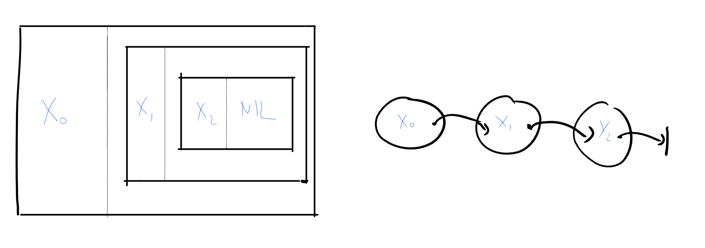

{{pic}}{fig:lambdalist} λ演算中的列表$\langle x_0,x_1,x_2 \rangle$是从尾部向前构造的, 先构建二元组$\langle x_2,\NIL\rangle$, 然后是$\langle x_1, \langle x_2,\NIL\rangle \rangle$, 最后是$\langle x_0,\langle x_1,\langle x_2,\NIL \rangle\rangle\rangle$. 也就是说, 列表是一个二元组, 二元组的第一个元素是列表的第一个元素, 第二个元素是列表的其余部分. 上图展示了这种"对中含对"的构造, 但通常将列表视为"链"更容易理解, 如右图所示, 其中每个对的第二个元素被视为列表其余部分的链接指针或引用.
```

```admonish pic id="reducemapfilterfig"
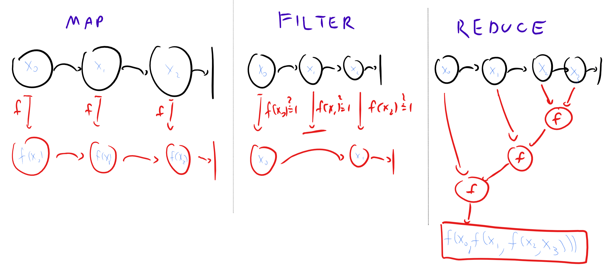

{{pic}}{fig:reducemapfilter} $\MAP$, $\FILTER$和$\REDUCE$操作的图示.
```

### 8.6.1 增强λ演算中的函数计算

一个**增强λ表达式**是通过将上述对象与**应用**和**抽象**规则组合而得到的. 简化λ表达式的结果是一个与远表达式等价的表达式, 因此如果两个表达式具有相同的简化结果, 则它们是等价的.

```admonish quote title=""
{{defc}}{def:lambdacomputedef}[通过λ演算计算函数]

令$F:\{0,1\}^* \rightarrow \{0,1\}^*$

我们说$exp$*计算*$F$如果对于每个$x\in\{0,1\}^*$,
$$exp \langle x_0,\ldots,x_{n-1},\bot \rangle \cong \langle y_0,\ldots, y_{m-1}, \bot \rangle$$
其中$n=|x|$, $y=F(x)$, 和$m=|y|$, 等价的概念见{{ref:def:lambdaequivalence}}.
```

### 8.6.2 增强λ演算的图灵完备性

增强λ演算的基本操作或多或少相当于Lisp或Scheme编程语言. 鉴于这一点, 增强λ演算与图灵机等效或许并不令人惊讶:

```admonish quote title=""
{{thmc}}{thm:lambdaturing}[λ演算与NAND-TM]
对于每个函数$F:\{0,1\}^* \rightarrow \{0,1\}^*$, $F$在增强λ演算中可计算当且仅当它在图灵机上可计算.
```

```admonish proof collapsible=true title="{{ref:thm:lambdaturing}}的证明思路"
为了证明该定理,我们需要证明 **(1)**: 如果$F$可由λ表达式计算, 则它可由图灵机计算, 以及 **(2)**: 如果$F$可由图灵机计算,则它可由增强λ表达式计算.

证明 **(1)** 相当直接.将简化规则应用于λ表达式基本上相当于"搜索和替换",我们可以轻松地在NAND-RAM或Python中实现(两者在能力上都等价于图灵机). 证明 **(2)** 本质上相当于在函数式编程语言(如LISP或Scheme)中模拟图灵机(或编写NAND-TM解释器). 我们在下面给出细节, 但如何做到这一点是掌握一些本身就有用的函数式编程技术的良好练习.
```

```admonish proof collapsible=true title="{{ref:thm:lambdaturing}}的证明"
我们仅给出证明的一个概述. "if"方向是简单的. 如上所述, 对λ表达式进行求值基本上相当于"搜索和替换". 在命令式语言(如Python或C)中实现所有上述基本操作也是一个相当直接的编程练习, 并且使用相同的想法, 我们也可以在NAND-RAM中实现, 然后我们可以将其转换为NAND-TM程序.

对于"only if"方向,我们需要使用λ表达式模拟图灵机. 我们将通过首先为每个图灵机$M$展示一个λ表达式来计算状态转移函数$\text{NEXT}_M:\overline{\Sigma}^* \rightarrow \overline{\Sigma}^*$来实现这一点,该函数将$M$的一个格局映射到下一个格局(见[第8.4.2节](#turingmachinesconfigsec)).

$M$的一个格局是一个字符串$\alpha \in \overline{\Sigma}^*$, 其中$\overline{\Sigma}$是一个有限集合. 我们可以用有限字符串$\{0,1\}^\ell$对每个符号$\sigma \in \overline{\Sigma}$进行编码, 因此我们将在λ演算中将格局$\alpha$编码为一个列表$\langle \alpha_0, \alpha_1, \ldots, \alpha_{m-1}, \bot \rangle$, 其中$\alpha_i$是一个长度为$\ell$的字符串(即一个由$0$和$1$组成的长度为$\ell$的列表), 编码$\overline{\Sigma}$中的一个符号.

根据{{ref:lem:nextstepfunctionlem}}, 对于每个$\alpha \in \overline{\Sigma}^*$, $\text{NEXT}_M(\alpha)i$等于$r(\alpha{i-1},\alpha_i,\alpha_{i+1})$, 其中$r:\overline{\Sigma}^3 \rightarrow \overline{\Sigma}$是某个有限函数. 使用我们对$\overline{\Sigma}$的编码$\{0,1\}^\ell$, 我们也可以将$r$视为映射 $\{0,1\}^{3\ell}$到$\{0,1\}^\ell$. 通过{{ref:exe:NANDlambdaex}},我们可以计算$\NAND$函数, 因此使用λ演算可以计算**每个**有限函数, 包括$r$. 利用这一见解, 我们可以使用λ演算计算$\text{NEXT}_M$如下. 给定一个编码格局$\alpha_0\cdots \alpha_{m-1}$的列表$L$, 我们定义列表$L_\text{prev}$和$L_\text{next}$, 分别编码格局$\alpha$向右和向左移动一步后的版本. 下一个格局$\alpha'$定义为$\alpha'_i = r(L\text{prev}[i],L[i],L_\text{next}[i])$, 其中$L'[i]$表示$L'$的第$i$个元素. 这可以通过递归(使用增强λ演算的$\RECURSE$运算符)计算如下:

{{algc}}{alg:nextmlambdacalc}[使用λ演算计算$\text{NEXT}_M$]
$$
\begin{align}
&\textbf{输入: }\text{编码一个格局$\alpha$的列表}L=\langle\alpha_0,\alpha_1,\dots,\alpha_{m-1},\bot\rangle\\
&\textbf{输出: }\text{编码$\text{NEXT}_M(\alpha)$的列表}L'\\
&\textbf{Procedure }\textsf{ComputeNext}(L_\text{prev},L,L_\text{next})\\
&\quad\if{\ISEMPTY\; L_\text{prev}}\\
&\qquad\return\NIL\\
&\quad\endif\\
&\quad\alpha\gets\HEAD\; L_\text{prev}\\
&\quad\if{\ISEMPTY\; L}\\
&\qquad b\gets\varnothing\qquad\textit{\#此处使用$\{0,1\}^\ell$对$\varnothing$的编码}\\
&\quad\else\\
&\qquad b\gets\HEAD\; L\\
&\quad\endif\\
&\quad\if{\ISEMPTY\; L_\text{next}}\\
&\qquad c\gets\varnothing\\
&\quad\else\\
&\qquad c\gets\HEAD\; L_\text{next}\\
&\quad\endif\\
&\quad\return{\PAIR\; r(a,b,c)\; \textsf{ComputeNext}}(\TAIL\; L_\text{prev},\TAIL\; L,\TAIL\; L_\text{next})\\
&\endproc\\
&L_\text{prev}\gets\PAIR\;\varnothing\; L\qquad \#L_\text{prev}=\langle\varnothing,\alpha_0,\dots,a_{m-1},\bot\rangle\\
&L_\text{next}\gets\TAIL\; L\qquad \#L_\text{next}=\langle\alpha_1,\dots,a_{m-1},\bot\rangle\\
&\return{\textsf{ComputeNext}}(L_\text{prev},L,L_\text{next})
\end{align}
$$

一旦我们可以计算$\text{NEXT}_M$, 我们就可以使用以下递归模拟$M$在输入$x$上的执行. 定义$\text{FINAL}(\alpha)$为$M$从格局$\alpha$初始化时的最终格局. 函数$FINAL$可以递归定义如下:

$$
FINAL(\alpha) = \begin{cases}\alpha & \text{$\alpha$ is halting configuration} \\ FINAL(NEXT_M(\alpha)) & \text{otherwise}\end{cases}\;.
$$

检查一个格局是否停机(即, 转移函数是否输出$\mathsf{Halt}$)可以轻松在λ演算中实现, 因此我们可以使用$\RECURSE$来计算$\text{FINAL}$. 如果我们让$\alpha^0$是$M$在输入$x$上的**初始格局**, 那么我们可以从$\text{FINAL}(\alpha^0)$得到输出$M(x)$, 从而完成证明.
```

## 8.7 从增强λ演算到纯λ演算 {#lambdacacluluspuresec}

虽然我们所允许的增强型λ演算的"基本"函数集合比大多数Lisp方言提供的要小, 但从NAND-TM的角度来看, 它仍然显得有些"臃肿". 我们能否用更少的函数来完成工作? 换句话说, 我们能否找到这些基本操作的一个子集, 使得该子集能够实现其余的操作?

事实上, 增强型λ演算的操作集合确实存在一个真子集, 可以用来实现其余所有操作. 这个子集就是空集.也就是说, 我们甚至可以不用$0$和$1$, 仅使用λ运算符就能实现上述**所有**操作. 这完全是λ的天下!

```admonish pause title="暂停一下"
这是一个很好的时机, 可以暂停一下, 思考你自己会如何实现这些操作. 例如, 可以先思考如何用$\REDUCE$来实现$\MAP$, 然后如何结合$0,1,\IF,\PAIR,\HEAD,\TAIL,\NIL,\ISEMPTY$与$\RECURSE$来实现$\REDUCE$. 你也可以基于$0,1,\IF$来实现$\PAIR$, $\HEAD$和$\TAIL$. 最具挑战性的部分是仅使用纯λ演算的操作来实现$\RECURSE$. 
```

```admonish quote title=""
{{thmc}}{thm:enhancedvanillalambdathm}[增强型λ演算等价于纯λ演算]

存在λ表达式可以实现函数$0$, $1$, $\IF$, $\PAIR$, $\HEAD$, $\TAIL$, $\NIL$, $\ISEMPTY$, $\MAP$, $\REDUCE$和$\RECURSE$. 
```

{{ref:thm:enhancedvanillalambdathm}}背后的思想是, 我们将$0$和$1$本身编码为λ表达式, 并以此为基础进行构建. 这被称为**Church编码**(Church encoding), 因为它源于邱奇为了证明λ演算可以作为所有计算的基础所做的努力. 我们不会写出{{ref:thm:enhancedvanillalambdathm}}的完整形式化证明, 但会概述其中涉及的思想: 
- 我们将$0$定义为接受两个输入$x,y$并输出$y$的函数, 将$1$定义为接受两个输入$x,y$并输出$x$的函数. 我们使用柯里化来实现双参数函数的效果, 因此$0 = \lambda x. \lambda y.y$且$1 = \lambda x.\lambda y.x$. (这种表示方案是表示`false`和`true`的常见惯例, 但也有很多其他同样可行的表示$0$和$1$的替代方案)
- 上述实现使得$\IF$函数的实现变得平凡: $\IF(cond,a,b)$就是$cond \; a \; b$, 因为$0\; a\; b = b$且$1\; a\; b = a$. 我们可以写成$\IF = \lambda x.x$以达到 $\IF(cond,a,b) = (((\IF\; cond)\; a)\; b) = cond \; a \; b$ 的效果. 
- 为了编码一个二元组$(x,y)$, 我们将产生一个函数$f_{x,y}$, 该函数在其"内部"包含$x$和$y$, 并且对于每个函数$g$都满足$f_{x,y}\;g = g\; x\; y$. 也就是说, $\PAIR = \lambda x,y. (\lambda g. gxy)$. 我们可以通过写$p\; 1$来提取二元组$p$的第一个元素, 通过写$p\; 0$来提取第二个元素, 因此$\HEAD = \lambda p. p1$且$\TAIL = \lambda p. p0$. 
- 我们将$\NIL$定义为忽略其输入并始终输出$1$的函数. 即$\NIL = \lambda x.1$. $\ISEMPTY$函数在给定输入$p$时, 检查如果我们将$p$应用于函数$zero = \lambda x,y.0$(该函数忽略其两个输入并始终输出$0$)时是否得到$1$. 对于每个形式为$p = \PAIR \; x \; y$ 的有效二元组, $p \; zero = p \; x \; y = 0$, 而 $\NIL \; zero=1$. 形式化地, $\ISEMPTY = \lambda p. p (\lambda x,y.0)$. 

```admonish info id="Churchnum"
{{remc}}{rem:Churchnumrem}[Church数(可选)]

布尔值并没有什么特别之处. 你可以使用类似的技巧, 用λ项来实现**自然数**. 标准做法是将数字$n$表示为函数$\text{ITER}_n$, 该函数在输入函数$f$时, 输出函数$x\mapsto f(f(\cdots f(x)))$($n$ 次). 也就是说, 我们将自然数$1$表示为$\lambda f.f$, 数字$2$表示为$\lambda f.(\lambda x.f(fx))$, 数字$3$表示为$\lambda f.(\lambda x.f(f(fx)))$, 依此类推. (请注意, 这与我们在布尔值上下文中用于表示$1$的方式不同: 这没关系；我们已经知道同一个对象可以用多种方式表示)数字$0$被表示为将任何函数$f$映射到恒等函数$\lambda x.x$ 的函数. (即$0 = \lambda f.(\lambda x.x)$)

在这种表示下, 我们可以将$\text{PLUS}(n,m)$表示为$\lambda f.\lambda x.(n f)((m f)x)$, 将$\text{TIMES}(n,m)$表示为$\lambda f.n(m f)$. 减法和除法更复杂, 但可以通过使用递归来实现. (将其推导出来是一个很好的练习)
```

### 8.7.1 列表处理

现在我们面临一个更大的障碍, 即如何在纯λ演算中实现$\MAP$, $\FILTER$, $\REDUCE$和$\RECURSE$. 事实证明, 我们可以用$\REDUCE$构建$\MAP$和$\FILTER$, 用$\RECURSE$构建$\REDUCE$. 例如, $\MAP(L,f)$等同于$\REDUCE(L,g,\NIL)$, 其中$g$是对输入$x$和$y$输出$\PAIR(f(x),y)$的操作. (我将其验证留给读者你作为一个(推荐的)练习)

我们可以递归地定义$\REDUCE(L,f,z)$, 通过令$\REDUCE(NIL,f,z)=z$, 并规定给定一个非空列表$L$(我们可以将其视为一个二元组$(head,rest)$), $\REDUCE(L,f,z) = f(head, \REDUCE(rest,f,z))$. 因此, 我们可能会尝试为$\REDUCE$编写一个递归的λ表达式, 如下所示: 

$$
\REDUCE = \lambda L,f,z. \IF(\ISEMPTY(L),z,f \HEAD(L) \REDUCE(\TAIL(L),f,z)) {{numeq}}{eq:reducereceq}
$$

这里唯一的问题是λ演算没有递归的概念, 因此这是一个无效的定义. 但当然, 我们可以使用我们的$\RECURSE$运算符来解决这个问题. 我们将把对"$\REDUCE$"的递归调用替换为对作为额外参数给定的函数$me$的调用, 然后将$\RECURSE$应用于此. 因此$\REDUCE = \RECURSE \; \text{myREDUCE}$, 其中: 

$$
\text{myREDUCE} = \lambda me,L,f,z. \IF(\ISEMPTY(L),z,f \HEAD(L) me(\TAIL(L),f,z)) {{numeq}}{eq:myreducereceq}
$$

### 8.7.2 Y组合子: 不需要递归的递归 { #ycombinatorsec }

{{eqref:eq:myreducereceq}}表明为了实现$\MAP$, $\FILTER$与$\REDUCE$我们需要在纯λ演算中实现$\RECURSE$运算符. 这就是我们现在要做的事情.

我们如何在不使用递归的情况下实现递归?我们将用一个简单的例子来说明这一点 - $\XOR$函数. 如{{ref:exe:XORlambdaex}}所示, 我们可以递归地写出列表的$\XOR$函数如下:

$$
\XOR(L) = \begin{cases} 0 & L \text{为空} \\ \XOR_2(\HEAD(L),\XOR(\TAIL(L))) & \text{otherwise}
\end{cases}
$$

其中$\XOR_2:\{0,1\}^2 \rightarrow \{0,1\}$是两个比特上的异或操作. 在Python中, 我们会这样写:

```python
def xor2(a,b): return 1-b if a else b
def head(L): return L[0]
def tail(L): return L[1:]

def xor(L): return xor2(head(L),xor(tail(L))) if L else 0

print(xor([0,1,1,0,0,1]))
# 1
```

现在, 我们如何消除这个递归调用? 主要思想是, 既然函数可以接受其他函数作为输入, 那么在Python(当然还有λ演算)中, 给函数**自身**作为输入是完全合法的. 因此, 我们的想法是尝试提出一个**非递归**函数`tempxor`, 它接受**两个输入**: 一个函数和一个列表, 并且使得`tempxor(tempxor,L)`会输出`L`的异或值!

```admonish pause title="暂停一下"
此时, 你可能想尝试用Python或任何其他编程语言(只要它允许函数作为输入)自己实现这一点.
```

我们的第一次尝试可能只是简单地用`me`替换递归调用. 让我们将这个函数定义为`myxor`

```python
def myxor(me,L): return xor2(head(L),me(tail(L))) if L else 0
```

让我们测试一下:

```python
myxor(myxor,[1,0,1])
```

如果你这样做,解释器会给出以下错误:

`TypeError: myxor() missing 1 required positional argument`

问题是`myxor`期望**两个**输入: 一个函数和一个列表. 而在调用`me`时, 我们只提供了一个列表. 为了纠正这一点, 我们修改调用, 同时提供函数本身:

```python
def tempxor(me,L): return xor2(head(L),me(me,tail(L))) if L else 0
```

注意在`tempxor`的定义中对`me(me,..)`的调用: 给定一个函数`me`作为输入, `tempxor`实际上会以自身作为第一个输入来调用函数`me`. 如果我们现在测试一下, 会发现实际上得到了正确的结果!

```python
tempxor(tempxor,[1,0,1])
# 0
tempxor(tempxor,[1,0,1,1])
# 1
```

因此, 我们可以将`xor(L)`简单地定义为`return tempxor(tempxor,L)`.

上述方法不仅适用于XOR. 给定一个接受输入`x`的递归函数`f`, 我们可以获得一个非递归版本, 如下所示:
1. 创建函数`myf`, 它接受两个输入`me`和`x`,并将对`f`的递归调用替换为对`me`的调用.
2. 创建函数`tempf`,它将`myf`中形式为`me(x)`的调用转换为形式为`me(me,x)`的调用.
3. 函数`f(x)`将被定义为`tempf(tempf,x)`.

以下是我们如何在Python中实现`RECURSE`运算符的方式. 它将接受一个如上所述的函数`myf`, 并将其替换为一个函数`g`, 使得对于每个`x`, `g(x)=myf(g,x)`.

```python
def RECURSE(myf):
    def tempf(me,x): return myf(lambda y: me(me,y),x)

    return lambda x: tempf(tempf,x)


xor = RECURSE(myxor)

print(xor([0,1,1,0,0,1]))
# 1

print(xor([1,1,0,0,1,1,1,1]))
# 0
```

**从Python到λ演算**: 在λ演算中, 一个接受两个输入$me,y$的函数$g$被写作$\lambda me.(\lambda y. g)$. 因此, 函数$y \mapsto me(me,y)$被简单地写作$me\;me$, 类似地, 函数$x \mapsto \text{tempf}(\text{tempf},x)$就是$\text{tempf}\; \text{tempf}$ (你明白为什么吗?) 因此, 上述定义的函数`tempf`可以写作`λ me. myf(me me)`. 这意味着, 如果我们将`RECURSE`的输入记为$f$, 那么$\RECURSE\; \text{myf} = \text{tempf} \; \text{tempf}$, 其中$\text{tempf} = \lambda m. f(m; m)$, 或者换句话说

$$
\RECURSE =  \lambda f.\bigl( (\lambda m. f(m\; m))\;\; (\lambda m. f(m \;m)) \bigr)
$$

[在线附录](https://github.com/boazbk/nandnotebooks/blob/master/lambda.ipynb)包含一个使用Python实现的λ演算. 以下是该附录中递归XOR函数的实现: {{footnote:由于Python语法的特定问题, 在此实现中, 我们使用`f * g`表示将`f`应用于`g`,而不是`f g`, 并使用`λx(exp)`而不是`λx.exp`进行抽象. 我们还使用`_0`和`_1`表示$0$和$1$的λ项, 以免与Python常量混淆.}}

```python
# XOR of two bits
XOR2 = λ(a,b)(IF(a,IF(b,_0,_1),b))

# Recursive XOR with recursive calls replaced by m parameter
myXOR = λ(m,l)(IF(ISEMPTY(l),_0,XOR2(HEAD(l),m(TAIL(l)))))

# Recurse operator (aka Y combinator)
RECURSE = λf((λm(f(m*m)))(λm(f(m*m))))

# XOR function
XOR = RECURSE(myXOR)

#TESTING:

XOR(PAIR(_1,NIL)) # List [1]
# equals 1

XOR(PAIR(_1,PAIR(_0,PAIR(_1,NIL)))) # List [1,0,1]
# equals 0
```

```admonish info id="Ycombinator"
{{remc}}{rem:Ycombinator}[Y组合子]

上述$\RECURSE$运算符更广为人知的名字是[Y组合子](https://en.wikipedia.org/wiki/Fixed-point_combinator#Fixed_point_combinators_in_lambda_calculus)(Y combinator).

它是一族**不动点算子**(fixed point operators)中的一个, 给定一个λ表达式$F$, 找到$F$的一个**不动点**(fixed point)$f$, 使得$f = F\; f$. 如果你思考一下就会发现, $\XOR$就是上述$\text{myXOR}$的不动点. $\XOR$是这样的函数: 对于每个$x$, 如果将$\XOR$作为$\text{myXOR}$的第一个参数代入, 我们会得到$\XOR$, 换句话说$\XOR = \text{myXOR}\; \XOR$. 因此, 为$\text{myXOR}$找到**不动点**等同于对其应用$\RECURSE$.
```

## 8.8 Church-Turing论题(讨论) {#churchturingdiscussionsec }

```admonish quote
[1934年], 丘奇一直在思索, 并最终明确提出了λ可定义函数就是所有能行可计算函数的观点....当丘奇提出这一论点时, 我坐下来试图反驳它....但很快意识到[我的方法失败了], 一夜之间我成了该论点的支持者.

*——斯蒂芬·克林,1979年.*
```

```admonish quote
[该论点]与其说是定义或公理, 不如说是...一条自然法则.

*——埃米尔·波斯特,1936年.*
```

我们定义了一个函数是**可计算的**, 如果它可以通过NAND-TM程序进行计算, 并且我们已经看到, 如果我们将NAND-TM程序替换为Python程序, 图灵机, λ演算, 元胞自动机以及许多其他计算模型, 该定义将保持不变. Church-Turing论题指出, 这是"可计算"函数的唯一合理定义. 与我们之前看到的"物理扩展Church-Turing论题"(PECTT)不同, Church-Turing论题并未做出可以通过实验检验的具体物理预测, 但它确实激励了诸如PECTT之类的预测. 我们可以将Church-Turing论题视为一种定义选择的提倡, 对所有潜在计算设备做出某种预测, 或者提出一些约束自然界的自然法则. 用Scott Aaronson的话来说, "无论它是什么, Church-Turing论题只能被视为极其成功". 迄今为止, 尚无候选计算设备(包括量子计算机, 以及更不合理的模型, 例如我们之前提到的假设性"封闭时间曲线"计算机)对Church-Turing论题构成严肃挑战. 这些设备可能使某些计算更高效, 但并未改变有限可计算与不可计算之间的界限.(我们在[第13.3]()节讨论的扩展Church-Turing论题规定, 图灵机也捕获了可高效计算内容的极限. 正如其物理版本所言, 量子计算对这一论题构成了主要挑战)

### 8.8.1 不同的计算模型

我们可以将我们已经看到的模型总结在以下表格中:

```admonish quote title=""
| **计算问题**                                          | **模型类型**                                           | **示例**                                                             |
|-----------------------------------------------------|-------------------------------------------------------------|--------------------------------------------------------------------------|
| 有限函数$f:\{0,1\}^n \rightarrow \{0,1\}^m$                | 非均匀计算 (算法依赖于输入长度) | 布尔电路, NAND电路, 直线程序 (例如, NAND-CIRC) |
| 具有无界输入的函数$F:\{0,1\}^* \rightarrow \{0,1\}^*$ | 顺序访问内存                                 | 图灵机, NAND-TM程序                                        |
| --                                                                  | 索引访问 / RAM                                        | RAM机, NAND-RAM, 现代编程语言                     |
| --                                                                  | 其他                                                       | λ演算, 细胞自动机                                       |

用于计算有限函数和任意输入长度函数的不同模型.
```

在[第17章](./chapter_17.md)中, 我们将研究_内存受限_计算. 事实证明, 具有常量内存的NAND-TM程序等价于**有限自动机**(finite automata)模型(有时也会加上"确定性"或"非确定性"的形容词, 该模型也被称为**有限状态机**(finite state machines)), 它又捕获了**正则语言**(regular language)的概念(那些可以用[正则表达式](https://en.wikipedia.org/wiki/Regular_expression)描述的语言), 这是我们将在[第10章](./chapter_10.md)中看到的概念.

```admonish hint title="本章回顾"
- 虽然我们使用图灵机定义了可计算函数, 但我们同样可以使用许多其他模型来定义, 不仅包括NAND-TM程序, 还包括RAM机, NAND-RAM, λ演算, 细胞自动机和许多其他模型.
- 非常简单的模型也可以是"图灵完备"的, 即它们可以模拟任意复杂的计算.
```

## 8.9 习题

```admonish question title=""
{{proc}}{pro:RAMTMalternativeex}[TM/RAM等价性的替代证明]

令$\text{SEARCH}:\{0,1\}^* \rightarrow \{0,1\}^*$为以下函数. 输入是一个二元组$(L,k)$, 其中$k\in \{0,1\}^$, $L$是一个由键值对$(k_0,v_1),\ldots,(k_{m-1},v_{m-1})$组成的列表的编码, 其中$k_0,\ldots,k_{m-1}$,$v_0,\ldots,v_{m-1}$是二进制字符串. 输出是满足$k_i=k$的最小$i$对应的$v_i$(如果这样的$i$存在), 否则输出空字符串. 

1. 证明$\text{SEARCH}$可由图灵机计算. 
2. 令$\text{UPDATE}(L,k,v)$为一个函数, 其输入是一个对组成的列表$L$, 其输出是通过将对$(k,v)$添加到$L$的开头而得到的列表$L'$. 证明$\text{UPDATE}$可由图灵机计算. 
3. 假设我们用一个键/值对的列表$L$来编码一个NAND-RAM程序的配置, 其中键要么是标量变量名`foo`, 要么是形如`Bar[<num>]`的形式(其中`<num>`是某个数字), 并且它包含所有非零的变量值. 令$\text{NEXT}(L)$为一个函数, 它将NAND-RAM程序在某一时刻的配置映射到下一时刻的配置. 证明$\text{NEXT}$可由图灵机计算(你不需要实现每一个算术操作: 实现加法和乘法就足够了). 
4. 证明对于每个可由NAND-RAM程序计算的函数$F:\{0,1\}^* \rightarrow \{0,1\}^*$, $F$也可由图灵机计算. 
```

```admonish question title=""
{{proc}}{pro:lookup}[NAND-TM查找函数]

本练习展示了NAND-TM可以模拟NAND-RAM的部分证明. 编写一个NAND-TM程序的代码, 该程序计算函数$\text{LOOKUP}:\{0,1\}^* \rightarrow \{0,1\}$, 其定义如下. 在输入$pf(i)x$上, 其中$pf(i)$表示整数$i$的一个前缀无关编码, 如果$i<|x|$则$\text{LOOKUP}(pf(i)x)=x_i$, 否则$\text{LOOKUP}(pf(i)x)=0$. (我们不关心$\text{LOOKUP}$在非此形式的输入上的输出)你可以选择任何你喜欢的任意前缀无关编码, 也可以使用你喜欢的编程语言来生成此代码. 
```

```admonish question title=""
{{proc}}{pro:pair-ex}[配对]

令$\text{embed}:\N^2 \rightarrow \N$为定义为$\text{embed}(x_0,x_1)= \tfrac{1}{2}(x_0+x_1)(x_0+x_1+1) + x_1$的函数. 

1. 证明对于每个$x^0,x^1 \in \N$, $\text{embed}(x^0,x^1)$确实是一个自然数. 
2. 证明$\text{embed}$是单射. 
3. 构造一个NAND-TM程序$P$, 使得对于每个$x^0,x^1 \in \N$, $P(pf(x^0)pf(x^1))=pf(\text{embed}(x^0,x^1))$, 其中$pf$是上面定义的前缀无关编码映射. 你可以为内层循环、条件语句以及递增/递减计数器使用语法糖. 
4. 构造NAND-TM程序$P_0,P_1$, 使得对于每个$x^0,x^1 \in \N$和$i \in N$, $P_i(pf(\text{embed}(x^0,x^1)))=pf(x^i)$. 你可以为内层循环、条件语句以及递增/递减计数器使用语法糖. 
```

```admonish question title=""
{{proc}}{pro:shortestpathcomputableex}[最短路径]

令$\text{SHORTPATH}:\{0,1\}^* \rightarrow \{0,1\}^*$为一个函数, 其在输入一个编码三元组$(G,u,v)$的字符串时, 如果$u$和$v$在$G$中不连通, 则输出一个编码$\infty$的字符串; 否则输出一个编码从$u$到$v$的最短路径长度$k$的字符串. 证明$\text{SHORTPATH}$可由图灵机计算. 参见脚注中的提示. {{footnote: 你不需要给出图灵机的完整描述：使用我们的"鱼与熊掌兼得"范式, 通过论证更强大的等价模型来证明这种机器的存在.}}
```

```admonish question title=""
{{proc}}{pro:longestpathcomputableex}[最长路径]

令$\text{LONGPATH}:\{0,1\}^* \rightarrow \{0,1\}^*$为一个函数, 其在输入一个编码三元组$(G,u,v)$的字符串时, 如果$u$和$v$在$G$中不连通, 则输出一个编码$\infty$的字符串; 否则输出一个编码从$u$到$v$的最长简单路径长度$k$的字符串. 证明$\text{LONGPATH}$可由图灵机计算. 参见脚注中的提示. {{footnote: 与{{ref:pro:shortestpathcomputableex}}相同的提示. 注意, 为了证明$\text{LONGPATH}$是可计算的, 你不必给出一个**高效**的算法.}}
```

```admonish question title=""
{{proc}}{pro:shortestpathlambda}[最短路径λ表达式]

令$\text{SHORTPATH}$如{{ref:pro:shortestpathcomputableex}}所定义. 证明存在一个计算$\text{SHORTPATH}$的λ表达式. 你可以使用{{ref:pro:shortestpathcomputableex}}. 
```

```admonish question title=""
{{proc}}{pro:nextstepfunctionlemex}[状态转移函数是局部的]

证明{{ref:lem:nextstepfunctionlem}}并利用它完成{{ref:thm:onedimcathm}}的证明. 
```

```admonish question title=""
{{proc}}{pro:lambda-calc-ex}[λ演算最多需要三个变量]

证明对于每个不含自由变量的λ表达式$e$, 存在一个等价的λ表达式$f$, 该表达式仅使用变量$x$, $y$和$z$. {{footnote: 提示: 你可以通过"将它们配对"来减少函数所使用的变量数量. 也就是说, 定义一个λ表达式$PAIR$, 使得对于每个$x,y$, $\PAIR\; x\; y$是某个函数$f$, 满足$f\; 0=x$且$f\; 1=y$. 然后使用$\PAIR$迭代地减少所使用的变量数量.}}
```

```admonish question title=""
{{proc}}{pro:evalorderlambdaex}[λ演算中的求值顺序示例]

1. 令$e = \lambda x.7 \left( (\lambda x.xx) (\lambda x.xx) \right)$. 证明如果我们使用按名调用求值顺序, 则$e$的简化过程会在确定的步数内结束; 而如果我们使用按值调用顺序, 则它永远不会结束. 
2. (加分, 挑战性)令$e$为任意λ表达式. 证明如果使用按值调用顺序时简化过程会在确定的步数内结束, 那么使用按名调用顺序时它也会在确定的步数内结束. 参见脚注中的提示. {{footnote: 对表达式$e$的结构使用归纳法.}}
```

```admonish question title=""
{{proc}}{pro:zipfunctionex}[Zip函数]

给出一个增强的λ演算表达式来计算函数$\text{zip}$, 该函数在输入一对相同长度$n$的列表$I$和$L$时, 输出一个由$n$个对组成的列表$M$, 使得$M$的第$j$个元素(我们记为$M_j$)是对$(I_j,L_j)$. 因此$\text{zip}$将这两个元素列表"压缩"成一个由对组成的单个列表. {{footnote: $\text{zip}$是这个操作的常用名称, 例如在Python中. 不要将其与zip压缩文件格式混淆.}}
```

```admonish question title=""
{{proc}}{pro:exer-lambdaturing-thm}[不使用RECURSE的状态转移函数]

令$M$为一台图灵机. 给出一个增强的λ演算表达式来计算$M$的状态转移函数$\text{NEXT}_M$(如{{ref:thm:lambdaturing}}的证明中所示), 而不使用$\RECURSE$. 参见脚注中的提示. {{footnote: 使用$\MAP$和$\REDUCE$(以及可能的$\FILTER$). 你可能还会发现{{ref:pro:zipfunctionex}}中的$\text{zip}$函数有用.}}
```

```admonish question title=""
{{proc}}{pro:lambdacompiler}[λ演算到NAND-TM编译器(挑战性)]

用你选择的编程语言给出一个程序, 该程序将λ表达式$e$作为输入, 并输出一个NAND-TM程序$P$, 该程序计算与$e$相同的函数. 为了部分得分, 你可以在输出程序中使用`GOTO`和所有NAND-CIRC语法糖. 你可以使用任何对你方便的λ表达式到二进制字符串的编码. 参见脚注中的提示. {{footnote: 尝试建立这样一个过程: 如果数组`Left`包含λ表达式$\lambda x.e$的编码, 并且数组`Right`包含另一个λ表达式$e'$的编码, 那么数组`Result`将包含$e[x \rightarrow e']$.}}
```

```admonish question title=""
{{proc}}{pro:altlambdaex}[λ演算中的"至少两个"函数]

令$1 = \lambda x,y.x$且$0 = \lambda x,y.y$如前所定义. 定义

$$
\text{ALT} = \lambda a,b,c.(a (b 1 (c 1 0)) (b c 0))
$$

证明$\text{ALT}$是一个计算至少两个函数的λ表达式. 也就是说, 对于每个$a,b,c \in \{0,1\}$(按上述编码), 当且仅当${a,b,c}$中至少有两个等于$1$时, $\text{ALT} a b c = 1$. 
```

```admonish question title=""
{{proc}}{pro:stringsprogramex}[状态转移函数的局部性]

这个问题将帮助你更好地理解图灵机**状态转移函数**的局部性概念. 这种局部性在诸如λ演算和一维元胞自动机的图灵完备性等结果中起着重要作用, 也出现在我们将在本课程后面看到的Godel不完备定理和Cook Levin定理等结果中. 定义`STRINGS`为具有以下语义的编程语言: 

* 一个`STRINGS`程序$Q$有一个单一的字符串变量`str`, 它既是$Q$的输入也是输出. 该程序没有循环也没有其他变量, 而是由一系列修改`str`的条件搜索和替换操作组成. 
* `STRINGS`程序的操作包括: 
  - `REPLACE(pattern1,pattern2)`, 其中`pattern1`和`pattern2`是固定字符串. 这将`str`中第一次出现的`pattern1`替换为`pattern2`. 
  - `if search(pattern) { code }`: 如果`pattern`是`str`的子串, 则执行`code`. 代码`code`本身可以包含嵌套的`if`语句. (也可以添加`else { ... }`来在`pattern`不是`str`的子串时执行). 
  - 返回值是`str`. 
* 一个`STRINGS`程序$Q$计算一个函数$F:\{0,1\}^* \rightarrow \{0,1\}^*$, 如果对于每个$x\in \{0,1\}^*$, 我们将`str`初始化为$x$然后执行$Q$中的指令序列, 则在执行结束时`str`等于$F(x)$. 

例如, 以下是一个`STRINGS`程序, 它计算函数$F:\{0,1\}^* \rightarrow \{0,1\}^*$, 使得对于每个$x\in \{0,1\}^*$, 如果$x$包含一个形如$y=11ab11$的子串, 其中$a,b \in \{0,1\}$, 则$F(x)=x'$, 其中$x'$是通过将$x$中第一次出现的$y$替换为$00$得到的. 

~~~python
if search('110011') {
    replace('110011','00')
} else if search('110111') {
    replace('110111','00')
} else if search('111011') {
    replace('111011','00')
} else if search('111111') {
    replace('1111111','00')
}
~~~

证明对于每个图灵机程序$M$, 存在一个`STRINGS`程序$Q$, 它计算$\text{NEXT}_M$函数, 该函数将每个编码$M$的有效配置的字符串映射到编码$M$计算下一步的配置的字符串. (我们不关心该函数在那些不编码有效配置的字符串上的行为)你不必完整地写出`STRINGS`程序, 但你需要给出一个令人信服的论证, 证明这样的程序存在. 
```

## 8.10 参考文献 {#othermodelsbibnotes }
Moore和Mertens的杰出著作([Moore, Mertens, 2011](https://scholar.google.com/scholar?hl=en&q=Moore,+Mertens+The+nature+of+computation))第七章对这部分内容进行了精彩阐述. 

RAM模型在研究实用算法的具体复杂度时非常有效, 其理论研究始于Cook和Reckhow([Cook, Reckhow, 1973](https://scholar.google.com/scholar?hl=en&q=Cook,+Reckhow+Time+bounded+random+access+machines)). 不过需要注意的是, 不同文献和场景中对RAM模型允许的操作集及其成本定义存在差异. 正如Shamir([Shamir, 1979](https://scholar.google.com/scholar?hl=en&q=Shamir+Factoring+numbers+in+O+(logn)+arithmetic+steps))已指出的, 在定义时需要特别谨慎——尤其是在字长可变的情况下. Savage著作([Savage, 1998](https://scholar.google.com/scholar?hl=en&q=Savage+Models+of+computation))第三章给出了RAM机更形式化的描述, 亦可参阅Hagerup的论文([Hagerup, 1998](https://scholar.google.com/scholar?hl=en&q=Hagerup+Sorting+and+searching+on+the+word+RAM)). 关于不依赖输入规模的RAM算法研究(即transdichotomous RAM model)则由Fredman和Willard([Fredman, Willard, 1993](https://scholar.google.com/scholar?hl=en&q=Fredman,+Willard+Surpassing+the+information+theoretic+bound+with+fusion+trees))开创. 

目前讨论的计算模型本质上是串行的, 但当今大量计算已转向并行模式——无论是通过多核处理器, 还是通过数据中心或互联网的大规模分布式计算. 虽然并行计算在实践中至关重要, 但对于"可计算与不可计算"的界限问题并未产生本质影响. 毕竟, 若计算任务可由$m$台机器在$t$时间内完成, 那么单台机器只需$mt$时间同样可以完成. 

λ演算由Church([Church, 1941](https://scholar.google.com/scholar?hl=en&q=Church+The+calculi+of+lambda-conversion))提出. Pierce的专著([Pierce, 2002](https://scholar.google.com/scholar?hl=en&q=Pierce+Types+and+programming+languages))是该领域权威教材, 另可参考Barendregt的著作([Barendregt, 1984](https://scholar.google.com/scholar?hl=en&q=Barendregt+The+lambda+calculus+:+its+syntax+and+semantics)). "柯里化"以逻辑学家[Haskell Curry](https://goo.gl/C9hKz1)命名(Haskell编程语言同样得名于他). Curry本人认为这一概念应归功于[Moses Schönfinkel](https://goo.gl/qJqd47), 但出于某种原因, "Schönfinkeling"这一术语始终未能流行. 

与大多数编程语言不同, 纯λ演算不包含类型概念. 其中的每个对象既可视为λ表达式, 也可作为接收单参数并返回单值的函数. 所有函数均采用"搜索替换"机制：当传入非常规参数时, 系统会将形参全部替换为输入表达式的副本. λ演算的类型化变种已成为研究热点, 与编程语言类型系统及计算机可验证证明系统紧密关联(参见[Pierce, 2002](https://scholar.google.com/scholar?hl=en&q=Pierce+Types+and+programming+languages)). 部分类型化λ演算变种摒弃了无限循环特性, 这使其成为程序静态分析和机器验证证明的重要工具, 我们将在[第10章](./chapter_10.md)和[第22章](./chapter_22.md)重新探讨这一主题. 

陶哲轩曾[提出](https://terrytao.wordpress.com/2014/02/04/finite-time-blowup-for-an-averaged-three-dimensional-navier-stokes-equation/)通过证明流体动力学("水计算机")的图灵完备性来解决Navier-Stokes方程行为问题, 相关科普论述可参阅[此文](https://www.quantamagazine.org/terence-tao-proposes-fluid-new-path-in-navier-stokes-problem-20140224/). 