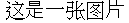
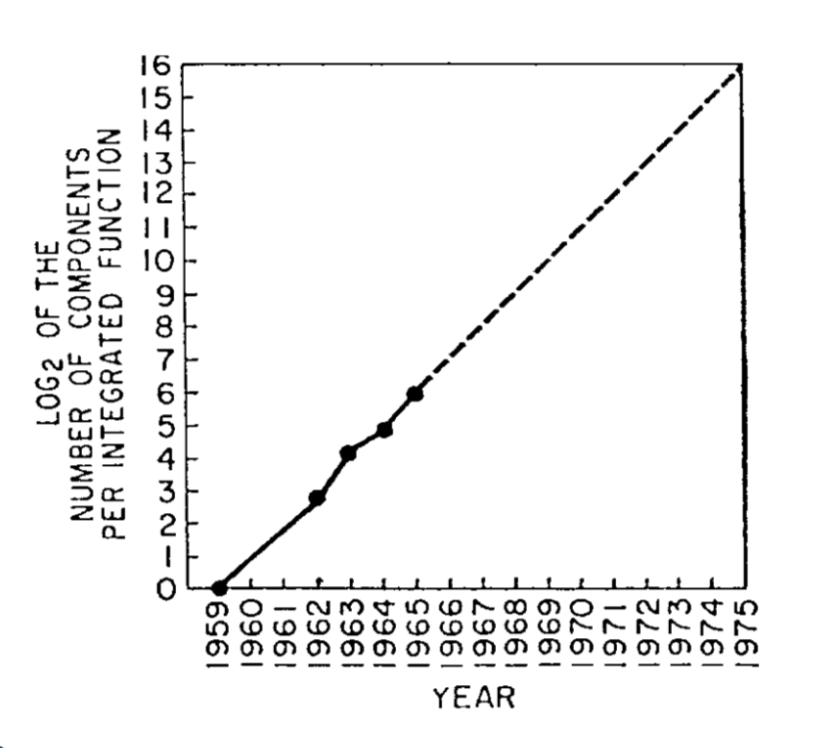

```admonish warning title = ""
❗**页面施工中**: 目前状态: 创建教程中.

要求: 
- ✅将所有numthm环境用灰色admonish(quote)框起.
- ✅标点符号统一为英文.
- ✅使用<span id="refid">添加对文内特定位置的超链接.
- ✅使用<a href>添加引用.
- ⬛️重要概念框.
```

# 格式统一教程: 标题 { #templatetitle }

- 原文存在一些对章节标题id的引用, [如](#templatetitle)(`[如](#templatetitle)`). 这些统一替换成对章节文件名的[引用](chapter_x.md)(`[引用](chapter_x.md)`)

```admonish quote title = ""
随机引的名人名言, 用quote括起 -- 译者, 2025
```

## 学习目标 
* 此处填写学习目标
* 一些目标
* 二些目标
* 三些目标

## 目录

<!-- toc -->

---

以下是教程正文.

- 每一章以一些插图引入比较合适, 如下图, 然后再写正文前的引子.

- 使用`<span>`即可添加能够[超链接](#templateimage)的ID (源码:`[引用](#templateimage)`), 点击即可跳转.

- 原文中用斜体强调的词, 在译文中统一用加粗, 如:

```admonish quote title = ""
You might think that the "best" algorithm for multiplying numbers will differ if you implement it in _Python_ on a modern laptop than if you use pen and paper.
```

译作

```admonish quote title = ""
例如, 你也许会认为, 在现代笔记本电脑上用 **Python** 实现的乘法算法, 与用纸笔进行乘法运算时的"最佳"算法会有所不同.
```

- 对某一章的引用可以直接引`.md`: 例如[本章](chapter_x.md) (`[本章](chapter_x.md)`), 对章节的引用则使用html id语法糖, 如下方[x.1小节](#templatesection)(`[x.1小节](#templatesection)`)所示.

```admonish info title = "简要概述"
阅读本章, 我们希望读者能够有以下收获: 

* 此处填一些收获, 遵照原文即可.
```

## x.1 小节: 右侧花括号添加 #id 即可用于引用 { #templatesection }

- 渲染时看不到上面说的花括号, 实际语句是: `## x.1 小节: 右侧花括号添加 #id 即可用于引用 { #templatesection }`

- quote 可以带标题, 遵照原文即可. 当原文需要引用的时候, 就使用 quote.

```admonish quote title = "如何解形如'平方与根的和等于某数'的方程"
举例来说: "一个平方加上它的十倍平方根等于三十九迪拉姆. " 换句话说, 求这样一个平方数: 它加上它自身的十倍平方根, 结果是三十九.   

解法如下:   
(见[Chapter 3](chapter_3.md))

因此, 这个平方根为三, 对应的平方为九.   
```

- 代码块照常写即可.

```python
# 使用 Python 的 sqrt 函数来计算平方根
def solve_eq(b, c):
    # 根据 al-Khwarizmi 的方法求解 x^2 + b*x = c
    blablabla()
# 测试: 求解 x^2 + 10*x = 39
print(solve_eq(10, 39))
```

- 出现在公式中的函数名全部应该用 `\text` 框起, 如 $\text{XOR}$(`$\text{XOR}$`). 如果发现某个名字经常出现, 应该将其添加进`./makros.txt`. 如与($\AND$), 或($\OR$), 非($\NOT$). (`$\AND, \OR, \NOT$`)

- example 环境的示例. 注意其中嵌套了代码, 所以使用了`~~~` 取代 \`\`\`. admonish的title中如果需要使用公式, 反斜杠需要重复三次. 例如下方的标题就出现了 `$\\\text{MAJ}$`.

~~~admonish example title="例: 用 $\\\AND$,$\\\OR$ 和 $\\\NOT$ 写出多数函数 $\\\text{MAJ}$"
考虑函数 $\text{MAJ}:\{0,1\}^3 \rightarrow \{0,1\}$, 其定义如下: 

(...)

我们也可以将公式 {{eqref:eq:majandornot}} 以"编程语言"的形式表示: 将其表达为一组指令, 用于在给定基本操作 $\AND, \OR, \NOT$ 的情况下计算 $\text{MAJ}$: 

```python
def MAJ(X[0],X[1],X[2]):
    firstpair  = AND(X[0],X[1])
    secondpair = AND(X[1],X[2])
    thirdpair  = AND(X[0],X[2])
    temp       = OR(secondpair,thirdpair)
    return OR(firstpair,temp)
```
<iframe src="https://trinket.io/embed/python/5ead2eab1b" width="100%" height="600" frameborder="0" marginwidth="0" marginheight="0" allowfullscreen></iframe>
~~~

- 公式的引用: 在行间公式中添加 `[{numeq}]{id}`, 例如:
$$
    \text{foo} \to \text{bar} {{numeq}}{templatenumeq}
$$
然后就可以直接引用: {{eqref: templatenumeq}} (`[{eqref: templatenumeq}]`)(为防止替换, 这里最外层的花括号替换成了方括号.)

### x.1.1 依然是小节名示例. 小节名总是可以添加id.

- 所有 preprocessor `numthm` 引入的定理/例子/命题环境都需要套一个 admonish quote, 以和正文分隔开. `book.toml`中可以自定义这些环境. 已经定义了一些"常用缩写+c"为名的中文环境. 例如:

```admonish quote title=""
{{lemc}}{templatelem}
对于每个 $a,b \in \{0,1\}$, 在输入 $a,b$ 时, {{ref:alg:XORfromAON}} 输出 $a + b \mod 2$. 
```

```admonish quote title=""
{{exec}}{templateexe}[$\AND$ 与 $\OR$ 满足分配律] 
证明: 对于任意 $a,b,c \in \{0,1\}$, 都有
$$
  a \wedge (b \vee c) = (a \wedge b) \vee (a \wedge c). 
$$
```

```admonish quote title=""
{{defc}}{templatedef}[使用AON-CIRC程序计算一个函数]
设 $f:\{0,1\}^n \rightarrow \{0,1\}^m$, 且 $P$ 为一个具有 $n$ 个输入和 $m$ 个输出的有效 AON-CIRC 程序.   
如果对于每个 $x \in \{0,1\}^n$ 都有 $P(x) = f(x)$, 则称 **$P$ 计算函数 $f$**. 
```

- `numthm` 的引用方式: {{ref: templatelem}} (`[{ref: templatelem}]`) (为防止替换, 这里最外层的花括号替换成了方括号.)

- 小练习对应的 admonish solution 以及证明对应的 admonish proof 应该是 collapsible 的. 如:

```admonish solution collapsible=true, title = "解答" 
我们可以通过枚举 $a,b,c \in \{0,1\}$ 的所有 $8$ 种可能取值来证明这一点, 但它也可以直接从标准的分配律推导出来.   

假设我们将任意正整数视为"真", 将零视为"假". 那么对于每个数 $u,v \in \mathbb{N}$, $u+v$ 为正当且仅当 $u \vee v$ 为真, 而 $u \cdot v$ 为正当且仅当 $u \wedge v$ 为真.   

这意味着对于每个 $a,b,c \in \{0,1\}$, 表达式 $a \wedge (b \vee c)$ 为真当且仅当 $a \cdot (b+c)$ 为正, 而表达式 $(a \wedge b) \vee (a \wedge c)$ 为真当且仅当 $a \cdot b + a \cdot c$ 为正.   

根据标准的分配律 $a \cdot (b+c) = a \cdot b + a \cdot c$, 因此前者表达式为真当且仅当后者表达式为真. 
```

```admonish proof collapsible=true, title = "对[{ref:id}]的证明"
对于任意 $a,b$, 有 $\XOR(a,b)=1$ 当且仅当 $a$ 与 $b$ 不同. 
令 $w1 = \AND(a,b)$, $w2 = \NOT(\AND(a,b))$, $w3 = \OR(a,b)$. 则在输入 $a,b \in \{0,1\}$ 时, {{ref:alg:XORfromAON}} 输出  
$$
\AND(w2, w3)
$$ 
* 如果 $a=b=0$, 则 $w3 = \OR(a,b) = 0$, 因此输出为 $0$. 

* 如果 $a=b=1$, 则 $\AND(a,b) = 1$, 所以 $w2 = \NOT(\AND(a,b)) = 0$, 输出为 $0$. 

* 如果 $a=1$ 且 $b=0$ (或反之) , 则 $w3 = \OR(a,b) = 1$ 且 $w1 = \AND(a,b) = 0$, 此时算法输出  
$$
\AND(\NOT(w1), w3) = 1.
$$
```

- 原文的 pause 也有对应的 admonish:

```admonish pause title = "暂停一下"
像往常一样, 一个很好的练习是在继续阅读之前, 先尝试自己用 $\AND$、$\OR$ 和 $\NOT$ 算法推导出 $\XOR$ 的实现方法. 
```

- 算法的写法, 以下是一个例子: 

```admonish quote title=""
{{algc}}{templatealg}[用 $\AND$, $\OR$ 与 $\NOT$ 计算 $\XOR$]

$
  \begin{array}{l}
  \mathbf{Input:}\ a,b \in \{0,1\} \\
  \mathbf{Output:}\ \XOR(a,b) \\
  \hline
  \mathbf{Step 1:}\ w_1 \leftarrow \AND(a,b) \\
  \mathbf{Step 2:}\ w_2 \leftarrow \NOT(w_1) \\
  \mathbf{Step 3:}\ w_3 \leftarrow\OR(a,b) \\
  \mathbf{Step 4: return}\ \AND(w_2,w_3)
  \end{array}
$
```

当然, 与图片一样, 也可以使用llm帮助转换. 

```markdown
依照示例, 将以下格式的算法转换为tex格式:
Input: $a,b \in \{0,1\}$.
Output: $XOR(a,b)$

$w1 \leftarrow AND(a,b)$

$w2 \leftarrow NOT(w1)$

$w3 \leftarrow OR(a,b)$

return $AND(w2,w3)$
转换为
$
  \begin{array}{l}
  \mathbf{Input:}\ a,b \in \{0,1\} \\
  \mathbf{Output:}\ \XOR(a,b) \\
  \hline
  \mathbf{Step 1:}\ w_1 \leftarrow \AND(a,b) \\
  \mathbf{Step 2:}\ w_2 \leftarrow \NOT(w_1) \\
  \mathbf{Step 3:}\ w_3 \leftarrow\OR(a,b) \\
  \mathbf{Step 4: return}\ \AND(w_2,w_3)
  \end{array}
$
我将提供其它类似格式的算法输入.
```

- 脚注的例子 {{footnote: 这是一条脚注}} (`[{footnote: 这是一条脚注}]`). 最外层的方括号替换为花括号, 文中出现脚注时需要使用.

- 正文结束后, 用 admonish hint 写回顾

```admonish hint title="回顾"
* **算法** 是通过一系列"基本"或"简单"操作来执行计算的步骤或配方.   
* ...
```

## x.2 小节: 各类环境使用方式汇总

### x.2.1 admonish

- 插入图片: 用pic环境框起, 再付一个numthm的pic编号环境. 源码:

~~~markdown
```admonish pic id = '图片id'

    <-- 这里的空行不能省
[{pic}] 图片描述    <-- 外层花括号改为方括号, 和描述之间的空格不能省
```
~~~

效果如下, [引用](#templateimage)可直接使用pic id:

```admonish pic id = 'templateimage'


{{pic}} 这是图片描述.
```

插入图片的格式可以设计prompt交给llm处理. 下面给一个例子

~~~markdown
请根据以下例子转换插入图片的格式:
{#moorefig .margin}  
转换为
```admonish pic id = "moorefig"


[{pic}] 1959 至 1965 年间集成电路中的晶体管数量，并预测指数级增长至少能持续十年。取自戈登·摩尔 1965 年的文章 *Cramming More Components onto Integrated Circuits*。
```
我将提供其它相同格式的代码, 输出请装在代码块内: 要再套一层代码块, 而不是使用已有的.
~~~

- 原文出现的 Big Idea(重要启示): 

```admonish bigidea id="idofidea"
此处填写IDEA. 
```

## 习题

- 习题的专有 `numthm` 环境是 `proc`. 例如:

```admonish quote title=""
{{proc}}{templatepro}[比较 $4$bit 数字]
给出一个布尔电路 (使用 $\AND/\OR/\NOT$ 门) , 该电路计算函数 $ \text{CMP}_8:\{0,1\}^8 \rightarrow \{0,1\}$, 使得当且仅当由 $a_0a_1a_2a_3$ 表示的数大于由 $b_0b_1b_2b_3$ 表示的数时, $ \text{CMP}_8(a_0,a_1,a_2,a_3,b_0,b_1,b_2,b_3)=1$. 
```

- 依然可以先翻译习题(和标题), 再用llm调整格式, 以下是可用的prompt.

```markdown
改变以下我输入的习题框的格式: 例如
::: {.exercise title="比较 $4$bit 数字" #comparenumbersex}

给出一个布尔电路（使用 $\AND/\OR/\NOT$ 门），该电路计算函数 $ \text{CMP}_8:\{0,1\}^8 \rightarrow \{0,1\}$，使得当且仅当由 $a_0a_1a_2a_3$ 表示的数大于由 $b_0b_1b_2b_3$ 表示的数时，$ \text{CMP}_8(a_0,a_1,a_2,a_3,b_0,b_1,b_2,b_3)=1$。
:::
改为

[{proc}]{comparenumbersex}[比较 $4$bit 数字]
给出一个布尔电路（使用 $\AND/\OR/\NOT$ 门），该电路计算函数 $ \text{CMP}_8:\{0,1\}^8 \rightarrow \{0,1\}$，使得当且仅当由 $a_0a_1a_2a_3$ 表示的数大于由 $b_0b_1b_2b_3$ 表示的数时，$ \text{CMP}_8(a_0,a_1,a_2,a_3,b_0,b_1,b_2,b_3)=1$。
接下来我将提供输入.
```

注意上面`proc`的方括号要改掉.

## 杂记

- 杂记需要修复对文献的引用. 使用 `<a>` 编写引用.

### 未完成章节中的引用: 

以下是未完成的章节中的引用

{{wip}}{thm:chernoff}